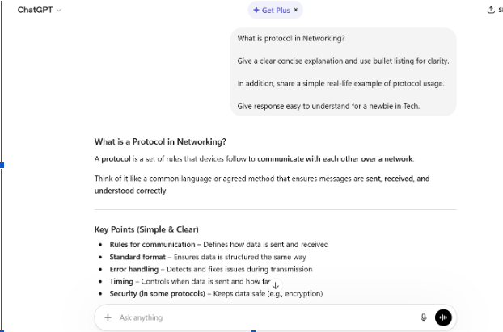
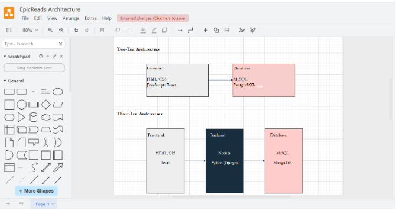
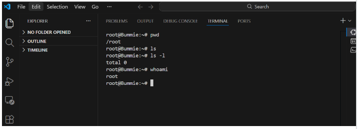

# Week 00 - Internet and Networking

Part of the DevOps Micro Internship (DMI) Cohort 3 with Agentic AI

---

# 🧑‍💻 Task 1: Using ChatGPT as Your Learning Assistant

## Scenario

You're new to DevOps and will frequently encounter technical questions. ChatGPT can be your learning companion.

## Your Task

Write a clear ChatGPT prompt to help you understand:

> "What is a protocol in networking? Explain with a simple real-life example."

Take a screenshot of your interaction showing:

* Your detailed prompt (with clear expectations)
* ChatGPT's simplified response with an example

## Screenshot

Save your screenshot in the `screenshots` folder and update the file name below.




Replace `task-1-chatgpt.png` with your actual screenshot file name.

---

## What I Learned (2–3 lines)

I learned how to craft a clear, structured ChatGPT prompt that sets expectations for simplicity and real‑life examples. I also understood how to pair that prompt with a screenshot of ChatGPT’s response and summarize the interaction concisely.

---

# 🌐 Task 2: Internet and Networking

## Scenario

Your friend is launching an online bookstore named **EpicReads**.

He asked you to explain how users globally can access his website hosted in Finland.

## Your Task

Write a short explanation (**100–150 words**) that includes:

* Packet Switching
* IP Address
* TCP/IP
* HTTP/HTTPS

💡 **Tip:** You may use ChatGPT (as demonstrated in Task 1) to refine your explanation.

## Answer

Hey Friend! Congrats on launching EpicReads, that’s exciting!
Here is a simple way your website in Finland can be accessed globally:
When someone visits your site, their device sends a request over the internet using HTTP/HTTPS (the protocol for web browsing). This request is broken into small chunks called packet switching, so the data can travel efficiently across different routes.
Each packet carries an IP address, your server’s unique identifier in Finland and the user’s device address, so data knows where to go and where to return.
The TCP/IP protocol ensures all packets arrive correctly, in order, and without errors. Once everything reaches the user, their browser reassembles the packets and displays your bookstore.
That’s how someone anywhere in the world can access EpicReads seamlessly!

---

# 🏗️ Task 3: Application Architecture & Stack

## Scenario

EpicReads bookstore has two application versions:

### Two-Tier Application

* Frontend
* Database

### Three-Tier Application

* Frontend
* Backend
* Database

## Your Task

* Draw simple diagrams (hand-drawn or tool-based such as draw.io)
* Label each layer clearly
* List at least two common technologies or tools used for each layer
* Submit a screenshot or photo clearly showing your own drawing

## Diagram Screenshot / Photo

Save your diagram image in the `screenshots` folder and update the file name below.




Replace `task-3-diagram.png` with your actual diagram file name.

---

## Technologies Used

### Frontend

* HTML/CSS

* JavaScript / React

### Backend

* Node.js

* Python (Django)

### Database

* AMySQL

* MongoDB

---

# 🌍 Task 4: Domain Name & DNS (Basic Concepts)

## Scenario

Your friend's bookstore **EpicReads** is currently accessible through:

```text
52.172.142.222:3000
```

He purchased the domain:

```text
epicreads.com
```

## Your Task

In **50–100 words**, explain in your own words:

1. What is DNS (Domain Name System)?
2. Which DNS record type should be used to connect the domain to the given IP, and why?

## Answer

The Domain Name System (DNS) is like the internet’s phonebook, it translates human-friendly domain names (such as epicreads.com) purchased by my friend into machine-readable IP addresses (like 52.172.142.222), so users can access websites easily.

To connect the domain to the IP, my friend would use an A (Address) record. This record directly maps the domain name (epicreads.com) to the server’s IPv4 address (52.172.142.222), ensuring users are routed to the correct server when they visit the site.

---

# 💻 Task 5: Visual Studio Code Setup (Hands-on)

## Your Task

Install Visual Studio Code (if not already installed).

Take a screenshot of your VS Code environment showing:

* Terminal open inside VS Code
* Running a basic command:

### Windows

```powershell
dir
```

### Linux / macOS

```bash
pwd
ls
```

* Your selected VS Code theme clearly visible

⚠️ **Important:** The screenshot must show your username or another identifiable detail to confirm it is your environment.

## Screenshot

Save your screenshot in the `screenshots` folder and update the file name below.




Replace `task-5-vscode.png` with your actual screenshot file name.

---

# 🔗 Task 6: Publish Your Assignment as a LinkedIn Post

## Objective

Publishing on LinkedIn helps you:

* Build your professional online presence
* Reinforce your learning
* Document your DevOps journey publicly

## Your Task

Summarize your answers from Tasks 1–5 into a LinkedIn post.

Clearly structure your post into the following sections:

* ChatGPT
* Internet & Networking
* App Architecture
* DNS
* VS Code Setup

Add the following credit note at the end of your post:

> **P.S. This post is a part of DevOps Micro Internship with Agentic AI Cohort-3 by Pravin Mishra. You can start your DevOps journey by joining this Discord community: https://discord.pravinmishra.com/**

---

## LinkedIn Post URL

Paste your LinkedIn post URL here:

```text
https://www.linkedin.com/posts/oluwabunmi-olowoyeye_my-devops-learning-journey-chatgpt-leveraged-activity-7440410405161631744-6wp3?utm_source=share&utm_medium=member_desktop&rcm=ACoAABIxKt4BWOFz-d7RRyAsVUilmny_HuUV_Iw
```

---

## LinkedIn Post Backup Copy

Paste the full text of your LinkedIn post here:

My DevOps Learning Journey 

🔹 ChatGPT
Leveraged ChatGPT to simplify complex tech concepts, structure responses clearly, and improve my understanding of networking and system design fundamentals.

🌐 Internet & Networking
Learned that communication over the internet relies on protocols like TCP/IP and HTTP/HTTPS, with data transmitted through packet switching and identified using IP addresses.

🏗️ App Architecture
Explored both Two-tier (Frontend + Database) and Three-tier (Frontend + Backend + Database) architectures, understanding how separating layers improves scalability, security, and maintainability.

🌍 DNS (Domain Name System)
Understood how DNS translates domain names into IP addresses. Learned that an A record connects a domain directly to a server IP.

💻 VS Code Setup
Already had VS Code set up and can comfortably run basic Linux commands, which supports my development and DevOps workflow.

✨ This journey is strengthening my foundation in DevOps and system design, and I’m excited to keep building!

P.S. This post is part of the FREE DevOps Micro Internship Cohort run by Pravin Mishra. You can start your DevOps journey for free from his YouTube Playlist.

---

# Reflection – Week 0

### What did you find easy?

Understanding the foundational concepts like protocols, DNS, and basic networking felt straightforward once I broke them down into simple explanations. Using ChatGPT to refine my answers also made the learning process smoother and more interactive.

---

### What was difficult?

Creating diagrams and ensuring they clearly represented two‑tier and three‑tier architectures required extra effort. Summarizing everything into a polished LinkedIn post while keeping it concise and structured was also a bit challenging.

---

### What will you improve next week?

I plan to improve my hands‑on practice with tools like VS Code, networking commands, and cloud concepts. I’ll also work on making my explanations more concise and visually clear for documentation and LinkedIn posts.

---

## 📌 About DMI & CloudAdvisory

DevOps Micro Internship (DMI) is a project-based DevOps program run by Pravin Mishra (The CloudAdvisory) focused on real-world execution, systems thinking, and career readiness.

It helps learners build strong DevOps foundations with hands-on experience.


## 📌 Resources

- 🌐 **DMI Official Website:** https://pravinmishra.com/dmi  
- 🎓 **DevOps for Beginners (Udemy):** https://www.udemy.com/course/devops-for-beginners-docker-k8s-cloud-cicd-4-projects/  
- 🎓 **Ultimate Agentic AI DevOps with Clude Code** https://www.udemy.com/course/ultimate-agentic-ai-devops-with-claude-code/?referralCode=448389767BC96284087B
- 🎓 **DevOps with Claude Code: Terraform, EKS, ArgoCD & Helm** https://www.udemy.com/course/devops-with-claude-code-terraform-eks-argocd-helm/?referralCode=1C5B734505D65A010FA3
- ▶️ **YouTube Playlist (DMI Cohort 3):** https://www.youtube.com/playlist?list=PLFeSNDtI4Cho  
- 🔗 **Pravin Mishra (LinkedIn):** https://www.linkedin.com/in/pravin-mishra-aws-trainer/  
- 🏢 **CloudAdvisory (LinkedIn):** https://www.linkedin.com/company/thecloudadvisory/

---

*This submission is part of DevOps Micro Internship (DMI) Cohort 3 — Agentic AI Track*