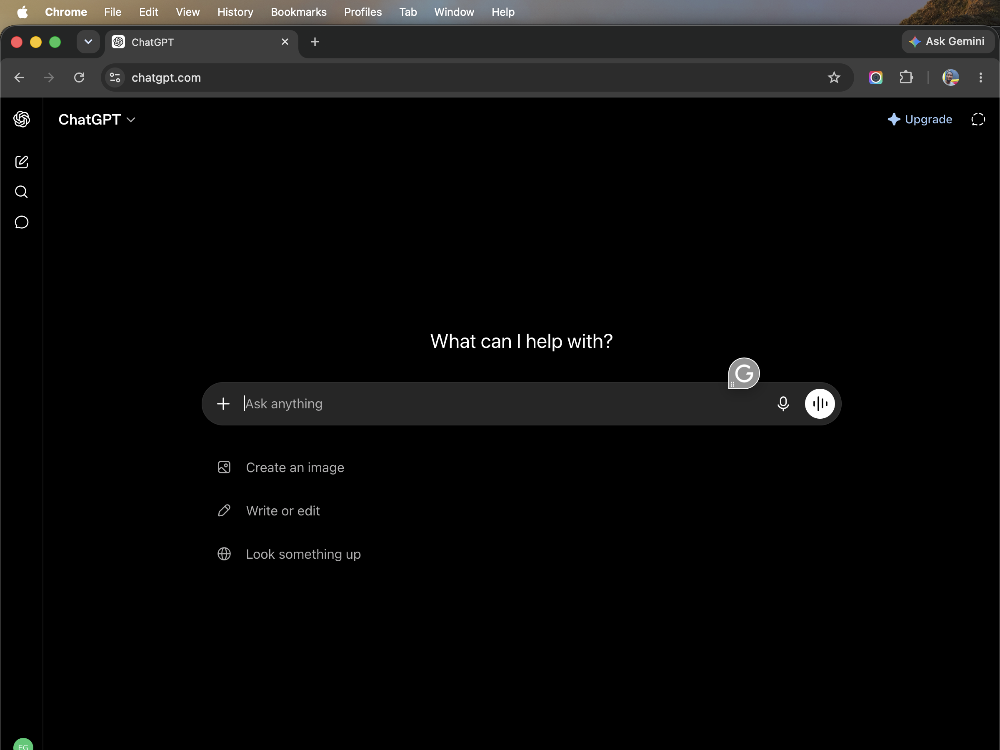
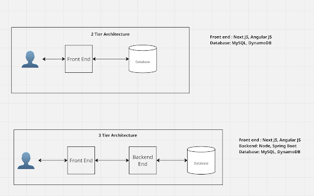

# Week 00 - Internet and Networking

Part of the DevOps Micro Internship (DMI) Cohort 3 with Agentic AI

---

# 🧑‍💻 Task 1: Using ChatGPT as Your Learning Assistant

## Scenario

You're new to DevOps and will frequently encounter technical questions. ChatGPT can be your learning companion.

## Your Task

Write a clear ChatGPT prompt to help you understand:

> "What is a protocol in networking? Explain with a simple real-life example."

Take a screenshot of your interaction showing:

* Your detailed prompt (with clear expectations)
* ChatGPT's simplified response with an example

## Screenshot

Save your screenshot in the `screenshots` folder and update the file name below.



---

## What I Learned (2–3 lines)

I learned that a network protocol is like a set of rules that devices follow to communicate with each other, similar to how two people speaking the same language can understand each other. Protocols like TCP/IP ensure data is sent, received, and acknowledged correctly across networks. ChatGPT helped me understand this with the analogy of mailing a letter — the address (IP), the language (protocol), and the delivery confirmation (ACK) all work together.

---

# 🌐 Task 2: Internet and Networking

## Scenario

Your friend is launching an online bookstore named **EpicReads**.

He asked you to explain how users globally can access his website hosted in Finland.

## Your Task

Write a short explanation (**100–150 words**) that includes:

* Packet Switching
* IP Address
* TCP/IP
* HTTP/HTTPS

💡 **Tip:** You may use ChatGPT (as demonstrated in Task 1) to refine your explanation.

## Answer

When a user in Nigeria visits EpicReads (hosted in Finland), their request is broken into small data chunks called **packets** — this is **packet switching**. Each packet contains the destination **IP address** (e.g., 52.172.142.222) so routers across the internet can forward it toward the Finland server. The **TCP/IP** protocol suite ensures packets arrive in the correct order and any lost packets are retransmitted. Once the server receives the request, it responds using **HTTP/HTTPS** — the protocol that web browsers and servers use to communicate. HTTPS adds encryption (SSL/TLS) so that sensitive data like login credentials or payment info is secure during transit. The response is also split into packets, routed back through the internet, and reassembled by the user's browser into the EpicReads webpage they see on screen.

---

# 🏗️ Task 3: Application Architecture & Stack

## Scenario

EpicReads bookstore has two application versions:

### Two-Tier Application

* Frontend
* Database

### Three-Tier Application

* Frontend
* Backend
* Database

## Your Task

* Draw simple diagrams (hand-drawn or tool-based such as draw.io)
* Label each layer clearly
* List at least two common technologies or tools used for each layer
* Submit a screenshot or photo clearly showing your own drawing

## Diagram Screenshot / Photo

Save your diagram image in the `screenshots` folder and update the file name below.



---

## Technologies Used

### Frontend

* React.js
* HTML / CSS / JavaScript

### Backend

* Node.js / Express
* Python / Django

### Database

* PostgreSQL
* MongoDB

---

# 🌍 Task 4: Domain Name & DNS (Basic Concepts)

## Scenario

Your friend's bookstore **EpicReads** is currently accessible through:

```text
52.172.142.222:3000
```

He purchased the domain:

```text
epicreads.com
```

## Your Task

In **50–100 words**, explain in your own words:

1. What is DNS (Domain Name System)?
2. Which DNS record type should be used to connect the domain to the given IP, and why?

## Answer

**DNS (Domain Name System)** is like the phonebook of the internet — it translates human-friendly domain names (like epicreads.com) into machine-readable IP addresses (like 52.172.142.222). Without DNS, users would have to memorize IP addresses to visit websites. To connect epicreads.com to the server's IP address, an **A Record (Address Record)** should be used. An A Record maps a domain name directly to an IPv4 address, which is exactly what we need here since the server has a fixed IP address (52.172.142.222).

---

# 💻 Task 5: Visual Studio Code Setup (Hands-on)

## Your Task

Install Visual Studio Code (if not already installed).

Take a screenshot of your VS Code environment showing:

* Terminal open inside VS Code
* Running a basic command:

### Linux / macOS

```bash
pwd
ls
```

* Your selected VS Code theme clearly visible

⚠️ **Important:** The screenshot must show your username or another identifiable detail to confirm it is your environment.

## Screenshot

Save your screenshot in the `screenshots` folder and update the file name below.


---

# 🔗 Task 6: Publish Your Assignment as a LinkedIn Post

## Objective

Publishing on LinkedIn helps you:

* Build your professional online presence
* Reinforce your learning
* Document your DevOps journey publicly

## Your Task

Summarize your answers from Tasks 1–5 into a LinkedIn post.

Clearly structure your post into the following sections:

* ChatGPT
* Internet & Networking
* App Architecture
* DNS
* VS Code Setup

Add the following credit note at the end of your post:

> **P.S. This post is part of the DevOps Micro Internship (DMI) with Agentic AI — Cohort 3 — by Pravin Mishra. My graded progress is public: https://dmi.pravinmishra.com/s/Favourcloud.html · Start your DevOps journey: https://dmi.pravinmishra.com/?utm_source=student&utm_medium=ps-linkedin&utm_campaign=cohort3**

---

## LinkedIn Post URL

Paste your LinkedIn post URL here:

```text
https://www.linkedin.com/in/eze-favour-52732752/
```

---

## LinkedIn Post Backup Copy

Paste the full text of your LinkedIn post here:

🌐 Week 00 of the DevOps Micro Internship — Internet & Networking Basics

This week I explored the fundamentals that power the internet:

🧑‍💻 ChatGPT as a Learning Assistant — Used AI to understand network protocols with real-life analogies. A protocol is like a common language devices use to communicate.

🌍 Internet & Networking — Learned how packet switching, IP addresses, TCP/IP, and HTTP/HTTPS work together to deliver websites globally. Your request is broken into packets, routed across the internet, and reassembled — all in seconds!

🏗️ Application Architecture — Compared Two-Tier (Frontend + Database) vs Three-Tier (Frontend + Backend + Database) architectures. Each layer has specific technologies like React, Node.js, and PostgreSQL.

🌐 DNS — The Domain Name System translates human-friendly names like epicreads.com into IP addresses. An A Record maps the domain to the server's IPv4 address.

💻 VS Code Setup — Got my development environment ready with VS Code, terminal configured, and my preferred theme.

#DevOps #CloudComputing #Networking #DNS #VSCODE #DMI #AgenticAI

---

## Reflection – Week 0

### What did you find easy?

The VS Code setup and ChatGPT interaction were straightforward since I already had experience with both tools. Understanding the high-level concepts of DNS and how websites are accessed also came naturally.

---

### What was difficult?

Drawing the architecture diagrams and clearly distinguishing between Two-Tier and Three-Tier applications took some thought. Explaining packet switching in simple terms without oversimplifying was also a bit challenging.

---

### What will you improve next week?

I will focus on providing more detailed answers with concrete examples. I also want to improve my diagramming skills and ensure all screenshots are clear and properly labeled before submission.

---

## 📌 About DMI & CloudAdvisory

DevOps Micro Internship (DMI) is a project-based DevOps program run by Pravin Mishra (The CloudAdvisory) focused on real-world execution, systems thinking, and career readiness.

It helps learners build strong DevOps foundations with hands-on experience.


## 📌 Resources

- 🌐 **DMI Official Website:** https://pravinmishra.com/dmi  
- 🎓 **DevOps for Beginners (Udemy):** https://www.udemy.com/course/devops-for-beginners-docker-k8s-cloud-cicd-4-projects/  
- 🎓 **Ultimate Agentic AI DevOps with Clude Code** https://www.udemy.com/course/ultimate-agentic-ai-devops-with-claude-code/?referralCode=448389767BC96284087B
- 🎓 **DevOps with Claude Code: Terraform, EKS, ArgoCD & Helm** https://www.udemy.com/course/devops-with-claude-code-terraform-eks-argocd-helm/?referralCode=1C5B734505D65A010FA3
- ▶️ **YouTube Playlist (DMI Cohort 3):** https://www.youtube.com/playlist?list=PLFeSNDtI4Cho  
- 🔗 **Pravin Mishra (LinkedIn):** https://www.linkedin.com/in/pravin-mishra-aws-trainer/  
- 🏢 **CloudAdvisory (LinkedIn):** https://www.linkedin.com/company/thecloudadvisory/

---

*This submission is part of DevOps Micro Internship (DMI) Cohort 3 — Agentic AI Track*
