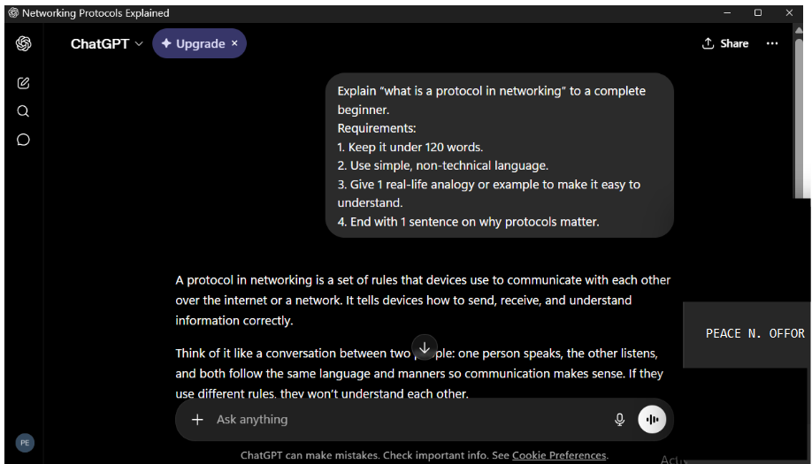
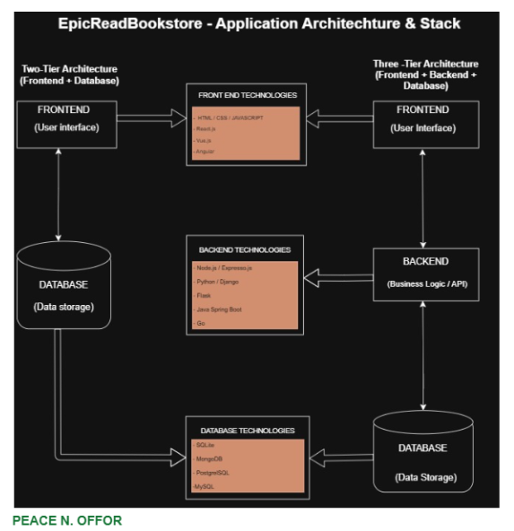
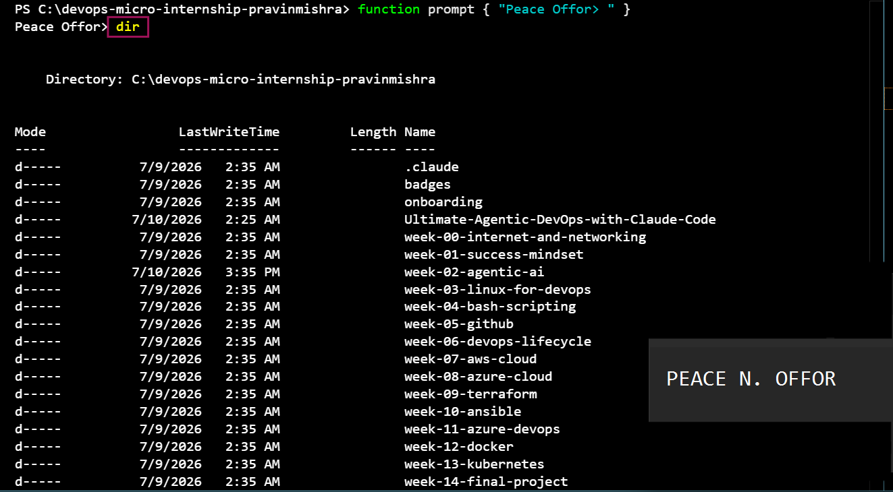
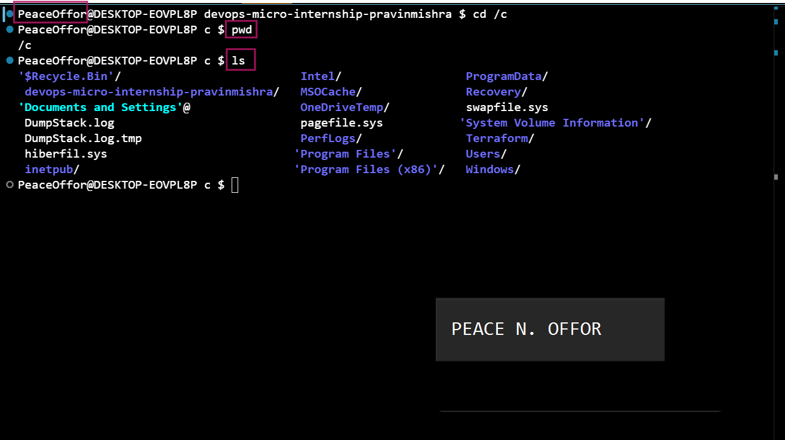

# Week 00 - Internet and Networking

Part of the DevOps Micro Internship (DMI) Cohort 3 with Agentic AI

---

# 🧑‍💻 Task 1: Using ChatGPT as Your Learning Assistant

## Scenario

You're new to DevOps and will frequently encounter technical questions. ChatGPT can be your learning companion.

## Your Task

Write a clear ChatGPT prompt to help you understand:

> "What is a protocol in networking? Explain with a simple real-life example."

Take a screenshot of your interaction showing:

* Your detailed prompt (with clear expectations)
* ChatGPT's simplified response with an example

## Screenshot

Save your screenshot in the `screenshots` folder and update the file name below.




Replace `task-1-chatgpt.png` with your actual screenshot file name.

---

## What I Learned (2–3 lines)
I learned that networking protocols are simply a set of rules that allow devices to communicate and understand each other. Using a simple real-life analogy made the concept much easier to grasp, showing that protocols are essential for reliable and accurate communication across networks.

---

# 🌐 Task 2: Internet and Networking

## Scenario

Your friend is launching an online bookstore named **EpicReads**.

He asked you to explain how users globally can access his website hosted in Finland.

## Your Task

Write a short explanation (**100–150 words**) that includes:

* Packet Switching
* IP Address
* TCP/IP
* HTTP/HTTPS

💡 **Tip:** You may use ChatGPT (as demonstrated in Task 1) to refine your explanation.

## Answer

EpicReads’ website can be accessed globally because the internet uses a system of connected networks and communication rules. When a user visits the website, their request is broken into small pieces called packets through packet switching. These packets travel across different routes on the internet and are reassembled when they reach the server in Finland.

The server has a unique Internet Protocol(IP) address, which helps devices locate it online. Communication between the user and the server follows the Transmission Control Protocol/ Internet Protocol (TCP/IP) suite, ensuring data is delivered accurately and in the correct order. Users access the site through Hypertext Transfer Protocol (HTTP) or Hypertext Transfer Protocol Secure (HTTPS), which are protocols used for web communication. HTTPS is more secure because it encrypts data, protecting users’ information while browsing or making purchases on EpicReads.


---

# 🏗️ Task 3: Application Architecture & Stack

## Scenario

EpicReads bookstore has two application versions:

### Two-Tier Application

* Frontend
* Database

### Three-Tier Application

* Frontend
* Backend
* Database

## Your Task

* Draw simple diagrams (hand-drawn or tool-based such as draw.io)
* Label each layer clearly
* List at least two common technologies or tools used for each layer
* Submit a screenshot or photo clearly showing your own drawing

## Diagram Screenshot / Photo

Save your diagram image in the `screenshots` folder and update the file name below.




Replace `task-3-diagram.png` with your actual diagram file name.

---

## Technologies Used

### Frontend

* HTML/CSS/JAVASCRIPT
* React.js
* Vue.js
* Angular

### Backend

* Node.js/Expresso.js
* Python/Django
* Flash
* Java Spring Boot
* Go

### Database

* SQLite
* MongoDB
* PostgrelSQL
* MySQL

---

# 🌍 Task 4: Domain Name & DNS (Basic Concepts)

## Scenario

Your friend's bookstore **EpicReads** is currently accessible through:

```text
52.172.142.222:3000
```

He purchased the domain:

```text
epicreads.com
```

## Your Task

In **50–100 words**, explain in your own words:

1. What is DNS (Domain Name System)?
2. Which DNS record type should be used to connect the domain to the given IP, and why?

## Answer

1. Domain Name System (DNS) is the internet address translator. It works by connecting easy to remember domain names, for example, EpicReads’s “epicreads.com” to the numerical IP addresses computers use to find websites.This makes it easier for users to be able to access domain name by simply typing the domain name in a browser instead of typing  52.172.142.222:3000.

2. To connect the domain to the server IP, an Address (A) record should be used because it links a domain name directly to an IPv4 address. It works like this: when you type epicreads.com, the DNS looks up the A record and returns the IPv4 address like 52.172.142.222, then your browser connects to that IP. The A record will point epicreads.com to 52.172.142.222.
For example:
epicreads.com A 52.172.142.222

---

# 💻 Task 5: Visual Studio Code Setup (Hands-on)

## Your Task

Install Visual Studio Code (if not already installed).

Take a screenshot of your VS Code environment showing:

* Terminal open inside VS Code
* Running a basic command:

### Windows

```powershell
dir
```

### Linux / macOS

```bash
pwd
ls
```

* Your selected VS Code theme clearly visible

⚠️ **Important:** The screenshot must show your username or another identifiable detail to confirm it is your environment.

## Screenshot

Save your screenshot in the `screenshots` folder and update the file name below.





Replace `task-5-vscode.png` with your actual screenshot file name.

---

# 🔗 Task 6: Publish Your Assignment as a LinkedIn Post

## Objective

Publishing on LinkedIn helps you:

* Build your professional online presence
* Reinforce your learning
* Document your DevOps journey publicly

## Your Task

Summarize your answers from Tasks 1–5 into a LinkedIn post.

Clearly structure your post into the following sections:

* ChatGPT
* Internet & Networking
* App Architecture
* DNS
* VS Code Setup

Add the following credit note at the end of your post:

> **P.S. This post is a part of DevOps Micro Internship with Agentic AI Cohort-3 by Pravin Mishra. You can start your DevOps journey by joining this Discord community: https://discord.pravinmishra.com/**

---

## LinkedIn Post URL

Paste your LinkedIn post URL here:

```text
`https://www.linkedin.com/posts/peace-offor-aa736a147_week-0-devops-micro-internship-key-takeaways-activity-7462543993420197888-nsVG?utm_source=share&utm_medium=member_desktop&rcm=ACoAACN4g58BM2OoiPOU_M6YmR_9gplw4hlL_RQ`
```

---

## LinkedIn Post Backup Copy

Paste the full text of your LinkedIn post here:

Week 0 DevOps Micro Internship (Key Takeaways)

I just finished Tasks 1-5 and wanted to share what I learned in simple terms:

ChatGPT 
I used ChatGPT to clarify DevOps concepts, compare tools, and draft explanations. It helped me transform technical notes into clear, accurate posts without losing details that matters.

INTERNET & NETWORKING
I learned the basic flow: 
Frontend runs in the browser, 
Backend + Database run on the server. 
They communicate using HTTP requests and APIs. Understanding where each part lives eliminates a lot of confusion early on.

APP ARCHITECTURE 
2-Tier: The frontend connects directly to the database. Quick to build, but difficult to scale and secure. 
3-Tier: Frontend — Backend/API — Database. A middle layer for logic and security. This is the standard for most production and applications.

DNS 
DNS (Domain Name System) is like the internet’s phonebook. It translates domain names into IP addresses. An A record specifically maps a domain name to an IPv4 address, so when you type a URL, your browser knows exactly where to go.

VS CODE SETUP 
Set up VS Code as my primary code editor. With extensions for React, Python, Docker, and Git, plus the built in terminal, it handles coding, debugging, and version control in one place.


P.S. This post is part of the FREE DevOps Micro Internship Cohort run by Pravin Mishra. You can start your DevOps journey for free from his YouTube Playlist.

---

# Reflection – Week 0

### What did you find easy?

I found it easy to understand the high-level concepts once I related them to real-world examples. Explaining networking, DNS, and application architecture in simple terms helped me move beyond memorization and build a clearer understanding of how the different components work together.

---

### What was difficult?

The most challenging part was connecting individual concepts into a complete picture of how a web application functions from end to end. Understanding where the frontend, backend, database, APIs, and DNS each fit required careful study rather than simply reading definitions.

---

### What will you improve next week?

Next week, I will spend more time reinforcing the concepts through hands-on practice instead of relying only on theory. My goal is to strengthen my understanding by applying what I learn and explaining each topic in my own words.

---

## 📌 About DMI & CloudAdvisory

DevOps Micro Internship (DMI) is a project-based DevOps program run by Pravin Mishra (The CloudAdvisory) focused on real-world execution, systems thinking, and career readiness.

It helps learners build strong DevOps foundations with hands-on experience.


## 📌 Resources

- 🌐 **DMI Official Website:** https://pravinmishra.com/dmi  
- 🎓 **DevOps for Beginners (Udemy):** https://www.udemy.com/course/devops-for-beginners-docker-k8s-cloud-cicd-4-projects/  
- 🎓 **Ultimate Agentic AI DevOps with Clude Code** https://www.udemy.com/course/ultimate-agentic-ai-devops-with-claude-code/?referralCode=448389767BC96284087B
- 🎓 **DevOps with Claude Code: Terraform, EKS, ArgoCD & Helm** https://www.udemy.com/course/devops-with-claude-code-terraform-eks-argocd-helm/?referralCode=1C5B734505D65A010FA3
- ▶️ **YouTube Playlist (DMI Cohort 3):** https://www.youtube.com/playlist?list=PLFeSNDtI4Cho  
- 🔗 **Pravin Mishra (LinkedIn):** https://www.linkedin.com/in/pravin-mishra-aws-trainer/  
- 🏢 **CloudAdvisory (LinkedIn):** https://www.linkedin.com/company/thecloudadvisory/

---

*This submission is part of DevOps Micro Internship (DMI) Cohort 3 — Agentic AI Track*