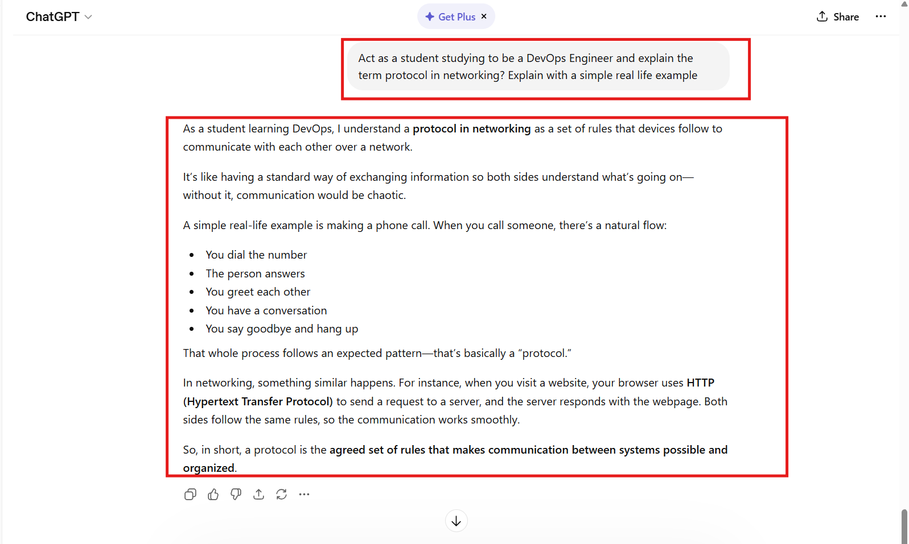
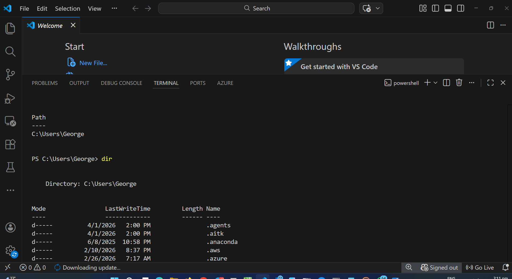

# Week 00 - Internet and Networking

Part of the DevOps Micro Internship (DMI) Cohort 3 with Agentic AI

---

# 🧑‍💻 Task 1: Using ChatGPT as Your Learning Assistant

## Scenario

You're new to DevOps and will frequently encounter technical questions. ChatGPT can be your learning companion.

## Your Task

Write a clear ChatGPT prompt to help you understand:

> "What is a protocol in networking? Explain with a simple real-life example."

Take a screenshot of your interaction showing:

* Your detailed prompt (with clear expectations)
* ChatGPT's simplified response with an example

## Screenshot

Save your screenshot in the `screenshots` folder and update the file name below.




---

## What I Learned (2–3 lines)

I learnt that it is possible and easier to use CHATGPT as a learning assistant with confirmation from several other sources.

---

# 🌐 Task 2: Internet and Networking

## Scenario

Your friend is launching an online bookstore named **EpicReads**.

He asked you to explain how users globally can access his website hosted in Finland.

## Your Task

Write a short explanation (**100–150 words**) that includes:

* Packet Switching
* IP Address
* TCP/IP
* HTTP/HTTPS

💡 **Tip:** You may use ChatGPT (as demonstrated in Task 1) to refine your explanation.

## Answer

When users around the world access EpicReads, their requests travel across the internet using packet switching. This means the data (like a webpage request) is broken into small packets, sent separately, and reassembled at the destination. Each packet carries an IP address, which identifies both the user’s device and the server in Finland, ensuring the data reaches the correct location.
The communication follows the TCP/IP model. TCP ensures all packets arrive correctly and in order, while IP handles addressing and routing. On top of this, HTTP/HTTPS is used to transfer web content. HTTP delivers the website data, while HTTPS adds encryption, keeping user information secure. Together, these technologies allow anyone, anywhere, to reliably and safely access the EpicReads website.


---

# 🏗️ Task 3: Application Architecture & Stack

## Scenario

EpicReads bookstore has two application versions:

### Two-Tier Application

* Frontend
* Database

### Three-Tier Application

* Frontend
* Backend
* Database

## Your Task

* Draw simple diagrams (hand-drawn or tool-based such as draw.io)
* Label each layer clearly
* List at least two common technologies or tools used for each layer
* Submit a screenshot or photo clearly showing your own drawing

## Diagram Screenshot / Photo

Save your diagram image in the `screenshots` folder and update the file name below.


---

## Technologies Used

### Frontend

* Html
* CSS
* Javascript
* React/Angular

### Backend

* Node.js
* Python
* Java

### Database

* MySQL
* PostgreSQL
* MongoDB

---

# 🌍 Task 4: Domain Name & DNS (Basic Concepts)

## Scenario

Your friend's bookstore **EpicReads** is currently accessible through:

```text
52.172.142.222:3000
```

He purchased the domain:

```text
epicreads.com
```

## Your Task

In **50–100 words**, explain in your own words:

1. What is DNS (Domain Name System)?
2. Which DNS record type should be used to connect the domain to the given IP, and why?

## Answer
The DNS (Domain Name System) is like the internet’s phonebook—it translates human friendly domain names like epicreads.com into IP addresses such as 52.172.142.222, which computers use to locate servers.

To connect the domain to the IP, you should use an A record. This record directly maps the domain name to an IPv4 address. It’s the best choice here because you already have a fixed IP address, allowing users to access EpicReads through the domain instead of typing the numeric IP.

---

# 💻 Task 5: Visual Studio Code Setup (Hands-on)

## Your Task

Install Visual Studio Code (if not already installed).

Take a screenshot of your VS Code environment showing:

* Terminal open inside VS Code
* Running a basic command:

### Windows

```powershell
dir
```

### Linux / macOS

```bash
pwd
ls
```

* Your selected VS Code theme clearly visible

⚠️ **Important:** The screenshot must show your username or another identifiable detail to confirm it is your environment.

## Screenshot

Save your screenshot in the `screenshots` folder and update the file name below.




---

# 🔗 Task 6: Publish Your Assignment as a LinkedIn Post

## Objective

Publishing on LinkedIn helps you:

* Build your professional online presence
* Reinforce your learning
* Document your DevOps journey publicly

## Your Task

Summarize your answers from Tasks 1–5 into a LinkedIn post.

Clearly structure your post into the following sections:

* ChatGPT
* Internet & Networking
* App Architecture
* DNS
* VS Code Setup

Add the following credit note at the end of your post:

> **P.S. This post is a part of DevOps Micro Internship with Agentic AI Cohort-3 by Pravin Mishra. You can start your DevOps journey by joining this Discord community: https://discord.pravinmishra.com/**

---

## LinkedIn Post URL

[Paste your LinkedIn post URL here: ](https://www.linkedin.com/posts/wisgeorge1_pravin-mishra-the-cloudadvisory-linkedin-activity-7445137604108505088-mFgw?utm_source=share&utm_medium=member_desktop&rcm=ACoAADp8HhoB_UGFhHiID8Ba-4DVResYfMJJsuY)


---

## LinkedIn Post Backup Copy

DevOPs - My learning journey so far 
 With each passing day, I'm growing more excited to continue the DevOps journey I embarked on. It's been an incredible experience, and here's a summary of a few of the things I've picked up so far:
 
 ChatGPT - Using ChatGPT as your learning Assistant
ChatGPT  can be a worthwhile learning assistant if properly harnessed, it helped me break down complex DevOps concepts into simple, practical explanations. I’ll give an example; I learned that a protocol networking is the language and rules that make communication between systems possible and reliable.

 Internet & Networking
The internet is just a giant network that connects thousands of smaller networks around the world. It lets computers talk to each other and share information. These information travel in form of data broken into small packets, sent independently, and reassembled at the destination. 
This process follows the TCP/IP model. TCP guarantees that all packets arrive intact and in the correct order, while IP manages addressing and routing. On top of this, HTTP or HTTPS handles web content transfer. HTTP delivers the website data, while HTTPS adds encryption to protect user information
App Architecture
 I also identified and explored two common architectures:
 Two-tier: Frontend → Database
 Three-tier: Frontend → Backend → Database
 Each layer has its role:
 Frontend: User interface (HTML, CSS, JavaScript)
 Backend: Logic (Node.js, Java, Python)
 Database: Storage (MySQL, PostgreSQL, MongoDB)
DNS (Domain Name System)
 Think of DNS as the internet's phonebook. it helps you find websites without having to memorise a bunch of random numbers. Take google.com for instance, it is pointed its server's IP address, now that's where an A record comes in, it simply tells the domain, "Hey, go here," by linking it directly to the right IP. Simple as that.
 

VS Code Setup
 I got my development environment set up with VS Code and added a few handy extensions to help with coding, debugging, and staying productive. It's a small step, but it's giving me a solid feel for what real DevOps workflows look like.
Honestly, this is just the start but I'm already starting to see how everything pieces together, from the way the internet works behind the scenes to how apps are actually built and organised.

 hashtag#DevOps hashtag#LearningInPublic hashtag#Networking hashtag#WebDevelopment hashtag#TechJourney

P.S. This post is part of the FREE DevOps Micro Internship (DMI) Cohort 3 run by Pravin Mishra. You can be part of this learning community too. 
 JOIN HERE (https://lnkd.in/dndNzXTb ) DMI Cohort 3: https://lnkd.in/dYXQUcH2
 Pravin Mishra Profile: https://lnkd.in/d7Mbyxj9

---

# Reflection – Week 0

### What did you find easy?

Because of my prior knowledge of these concepts, I think everything was easy, even the CHATGPT part too.

---

### What was difficult?

I didn't find any difficulty doing these tasks.

---

### What will you improve next week?

My plan for improvement is to learn, unlearn and relearn. So next week I plan to find out those things related to the concepts 
treated here that I am unaware of that can increase my knowledge and understanding of the concepts herewith and more.

---

## 📌 About DMI & CloudAdvisory

DevOps Micro Internship (DMI) is a project-based DevOps program run by Pravin Mishra (The CloudAdvisory) focused on real-world execution, systems thinking, and career readiness.

It helps learners build strong DevOps foundations with hands-on experience.


## 📌 Resources

- 🌐 **DMI Official Website:** https://pravinmishra.com/dmi  
- 🎓 **DevOps for Beginners (Udemy):** https://www.udemy.com/course/devops-for-beginners-docker-k8s-cloud-cicd-4-projects/  
- 🎓 **Ultimate Agentic AI DevOps with Clude Code** https://www.udemy.com/course/ultimate-agentic-ai-devops-with-claude-code/?referralCode=448389767BC96284087B
- 🎓 **DevOps with Claude Code: Terraform, EKS, ArgoCD & Helm** https://www.udemy.com/course/devops-with-claude-code-terraform-eks-argocd-helm/?referralCode=1C5B734505D65A010FA3
- ▶️ **YouTube Playlist (DMI Cohort 3):** https://www.youtube.com/playlist?list=PLFeSNDtI4Cho  
- 🔗 **Pravin Mishra (LinkedIn):** https://www.linkedin.com/in/pravin-mishra-aws-trainer/  
- 🏢 **CloudAdvisory (LinkedIn):** https://www.linkedin.com/company/thecloudadvisory/

---

*This submission is part of DevOps Micro Internship (DMI) Cohort 3 — Agentic AI Track*