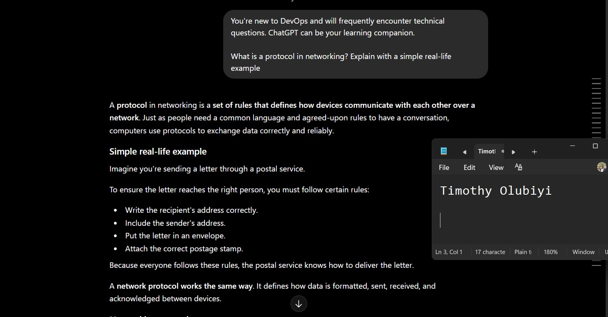
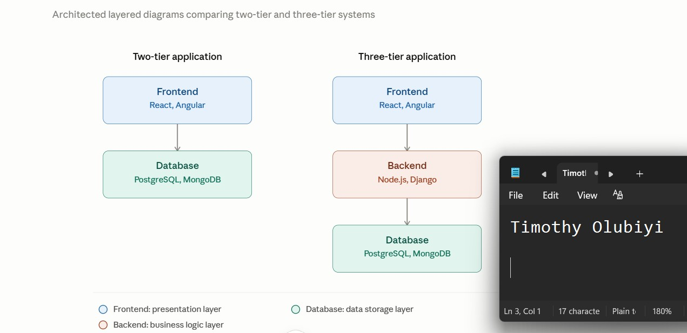
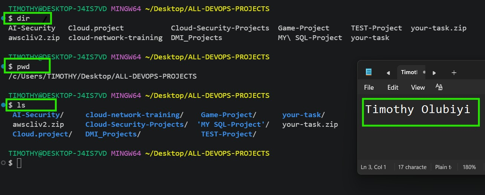

# Week 00 - Internet and Networking

Part of the DevOps Micro Internship (DMI) Cohort 3 with Agentic AI

---

# 🧑‍💻 Task 1: Using ChatGPT as Your Learning Assistant

## Scenario

You're new to DevOps and will frequently encounter technical questions. ChatGPT can be your learning companion.

## Your Task

Write a clear ChatGPT prompt to help you understand:

> "What is a protocol in networking? Explain with a simple real-life example."

Take a screenshot of your interaction showing:

* Your detailed prompt (with clear expectations)
* ChatGPT's simplified response with an example

## Screenshot

Save your screenshot in the `screenshots` folder and update the file name below.



Replace `task-1-chatgpt.png` with your actual screenshot file name.

---

## What I Learned (2–3 lines)

A protocol is a set of communication rules that allows devices on a network to exchange information correctly and reliably, just like rules in a conversation between people.

---

# 🌐 Task 2: Internet and Networking

## Scenario

Your friend is launching an online bookstore named **EpicReads**.

He asked you to explain how users globally can access his website hosted in Finland.

## Your Task

Write a short explanation (**100–150 words**) that includes:

* Packet Switching
* IP Address
* TCP/IP
* HTTP/HTTPS

💡 **Tip:** You may use ChatGPT (as demonstrated in Task 1) to refine your explanation.

## Answer

When a user anywhere in the world visits the EpicReads website, their browser first uses DNS to find the server's IP address in Finland. The browser then establishes a connection using the TCP/IP protocol, which ensures that data is transmitted reliably between the user's device and the web server. The website's content is broken into small pieces through packet switching, allowing the data to travel efficiently across different network routes before being reassembled on the user's device. Finally, the browser uses HTTP or, more securely, HTTPS to request and receive the web pages. HTTPS encrypts the communication, protecting sensitive information such as login credentials and payment details. Together, packet switching, IP addressing, TCP/IP, and HTTP/HTTPS enable users worldwide to access the EpicReads website quickly, reliably, and securely.


---

# 🏗️ Task 3: Application Architecture & Stack

## Scenario

EpicReads bookstore has two application versions:

### Two-Tier Application

* Frontend
* Database

### Three-Tier Application

* Frontend
* Backend
* Database

## Your Task

* Draw simple diagrams (hand-drawn or tool-based such as draw.io)
* Label each layer clearly
* List at least two common technologies or tools used for each layer
* Submit a screenshot or photo clearly showing your own drawing

## Diagram Screenshot / Photo

Save your diagram image in the `screenshots` folder and update the file name below.




Replace `task-3-diagram.png` with your actual diagram file name.

---

## Technologies Used

### Frontend

* React.js
* Vue.js

### Backend

* Node.js (Express)
* Python (Django or Flask)

### Database

* MySQL
* PostgreSQL

---

# 🌍 Task 4: Domain Name & DNS (Basic Concepts)

## Scenario

Your friend's bookstore **EpicReads** is currently accessible through:

```text
52.172.142.222:3000
```

He purchased the domain:

```text
epicreads.com
```

## Your Task

In **50–100 words**, explain in your own words:

1. What is DNS (Domain Name System)?
2. Which DNS record type should be used to connect the domain to the given IP, and why?

## Answer

1. DNS (Domain Name System) is like the phonebook of the internet. It translates a human-friendly domain name, such as epicreads.com, into an IP address, such as 52.172.142.222, that computers use to locate and communicate with a server.

Without DNS, users would have to remember and type numerical IP addresses to access websites. Instead, they simply enter epicreads.com into their browser, and DNS automatically finds the correct IP address and directs them to the EpicReads web server.

In simple terms, DNS makes websites easier to find by converting easy-to-remember domain names into machine-readable IP addresses.

2. The A (Address) record should be used to connect the domain epicreads.com to the IP address 52.172.142.222.

An A record maps a domain name directly to an IPv4 address, allowing users to access the website by typing epicreads.com instead of entering the numerical IP address. When someone visits the domain, the DNS server looks up the A record and returns the corresponding IP address so the browser can connect to the correct web server.

In this case, the DNS record would look like:

Record Type	Host	Value
A	@	52.172.142.222

This configuration ensures that requests for epicreads.com are directed to the server hosted at 52.172.142.222.

---

# 💻 Task 5: Visual Studio Code Setup (Hands-on)

## Your Task

Install Visual Studio Code (if not already installed).

Take a screenshot of your VS Code environment showing:

* Terminal open inside VS Code
* Running a basic command:

### Windows

```powershell
dir
```

### Linux / macOS

```bash
pwd
ls
```

* Your selected VS Code theme clearly visible

⚠️ **Important:** The screenshot must show your username or another identifiable detail to confirm it is your environment.

## Screenshot

Save your screenshot in the `screenshots` folder and update the file name below.




Replace `task-5-vscode.png` with your actual screenshot file name.

---

# 🔗 Task 6: Publish Your Assignment as a LinkedIn Post

## Objective

Publishing on LinkedIn helps you:

* Build your professional online presence
* Reinforce your learning
* Document your DevOps journey publicly

## Your Task

Summarize your answers from Tasks 1–5 into a LinkedIn post.

Clearly structure your post into the following sections:

* ChatGPT
* Internet & Networking
* App Architecture
* DNS
* VS Code Setup

Add the following credit note at the end of your post:

> **P.S. This post is part of the DevOps Micro Internship (DMI) with Agentic AI — Cohort 3 — by Pravin Mishra. My graded progress is public: https://dmi.pravinmishra.com/s/YOUR-GITHUB-USERNAME.html · Start your DevOps journey: https://dmi.pravinmishra.com/?utm_source=student&utm_medium=ps-linkedin&utm_campaign=cohort3**

---

## LinkedIn Post URL

Paste your LinkedIn post URL here:

https://www.linkedin.com/posts/timothy-olubiyi-05b9ba123_homepage-activity-7408877918619090944-XybC?utm_source=share&utm_medium=member_desktop&rcm=ACoAAB6VGscB2AplIT7PcrwZvA0ECup4mNaUoIw

---

## LinkedIn Post Backup Copy

Paste the full text of your LinkedIn post here:

DevOps Learning Journey (Tasks 1–5)
I recently worked through a set of practical DevOps foundation tasks using a real-world scenario: an online bookstore called EpicReads. Here’s a concise summary of what I learned 👇

 ChatGPT
 Used as a learning assistant to break down complex DevOps, networking, and architecture concepts into clear, beginner-friendly explanations.

 Internet & Networking
 Global users access EpicReads through packet switching, where data is split into packets and routed efficiently. TCP/IP ensures reliable communication, IP addresses identify servers, and HTTP/HTTPS enables secure web access to the Finland-hosted site.

Application Architecture
 Explored two-tier (Frontend + Database) and three-tier (Frontend + Backend + Database) architectures. The three-tier model offers better security, scalability, and maintainability. Common tools include React, Node.js/Python, and MySQL/MongoDB.

DNS
 Learned how DNS translates domain names into IP addresses. An A record maps epicreads.com to its IPv4 address, making the website easily accessible.

VS Code Setup
 Configured VS Code with essential DevOps extensions like Git, Docker, YAML, and Python to support efficient development and automation workflows.

P.S. This post is part of the FREE DevOps Micro Internship Cohort run by hashtag#PravinMishra. You can start your DevOps journey for free from his YouTube Playlist 

---

# Reflection – Week 0

### What did you find easy?

I found it easy to understand the basic networking concepts, such as protocols, IP addresses, TCP/IP, HTTP/HTTPS, DNS, and application architectures. Creating simple architecture diagrams and identifying the technologies used at each layer was straightforward because the concepts relate closely to real-world web applications. I also found it easy to explain how DNS connects a domain name to an IP address using an A record, making websites easier for users to access.

---

### What was difficult?

The most challenging part was understanding how the different networking concepts work together in a real-world environment. Distinguishing the roles of TCP/IP, HTTP/HTTPS, DNS, and packet switching required careful study because each serves a different purpose in delivering a website. It also took some effort to understand the differences between two-tier and three-tier architectures and why modern applications typically use a backend layer for better security, scalability, and maintainability. However, working through practical examples made these concepts much clearer.

---

### What will you improve next week?

I plan to improve my understanding of networking and Linux administration by spending more time on hands-on practice. I want to strengthen my knowledge of DNS configuration, TCP/IP communication, web server deployment, and Bash scripting while becoming more confident in troubleshooting real-world server and network issues. I also aim to continue building practical DevOps skills through automation, cloud-based projects, and infrastructure management.
---

## 📌 About DMI & CloudAdvisory

DevOps Micro Internship (DMI) is a project-based DevOps program run by Pravin Mishra (The CloudAdvisory) focused on real-world execution, systems thinking, and career readiness.

It helps learners build strong DevOps foundations with hands-on experience.


## 📌 Resources

- 🌐 **DMI Official Website:** https://pravinmishra.com/dmi  
- 🎓 **DevOps for Beginners (Udemy):** https://www.udemy.com/course/devops-for-beginners-docker-k8s-cloud-cicd-4-projects/  
- 🎓 **Ultimate Agentic AI DevOps with Clude Code** https://www.udemy.com/course/ultimate-agentic-ai-devops-with-claude-code/?referralCode=448389767BC96284087B
- 🎓 **DevOps with Claude Code: Terraform, EKS, ArgoCD & Helm** https://www.udemy.com/course/devops-with-claude-code-terraform-eks-argocd-helm/?referralCode=1C5B734505D65A010FA3
- ▶️ **YouTube Playlist (DMI Cohort 3):** https://www.youtube.com/playlist?list=PLFeSNDtI4Cho  
- 🔗 **Pravin Mishra (LinkedIn):** https://www.linkedin.com/in/pravin-mishra-aws-trainer/  
- 🏢 **CloudAdvisory (LinkedIn):** https://www.linkedin.com/company/thecloudadvisory/

---

*This submission is part of DevOps Micro Internship (DMI) Cohort 3 — Agentic AI Track*