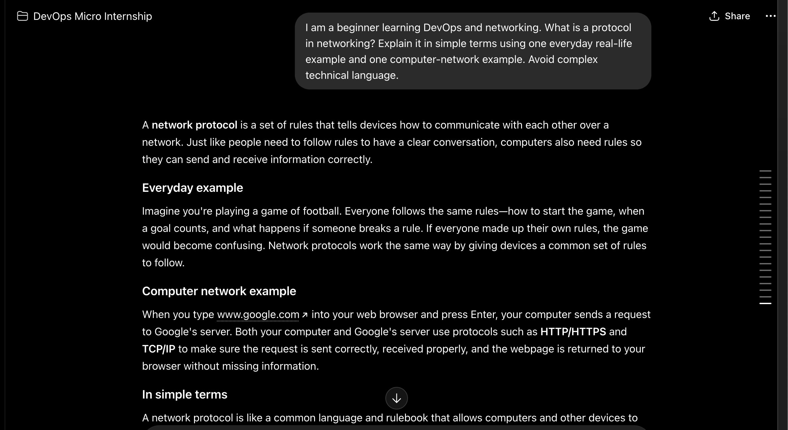
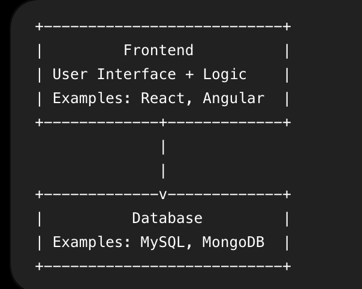
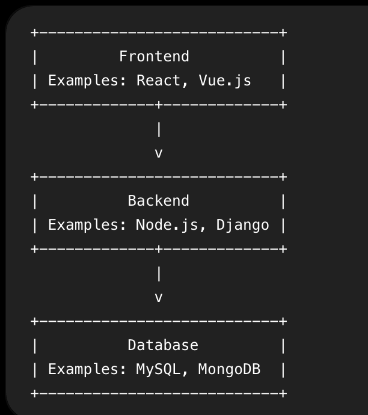
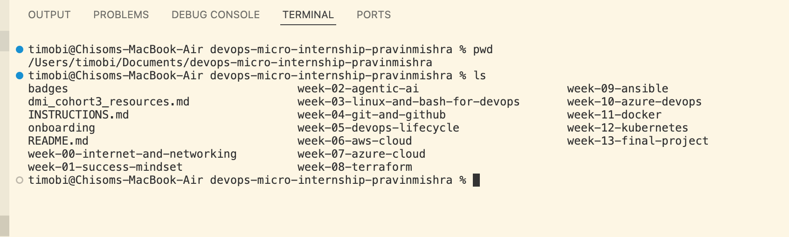

    # Week 00 - Internet and Networking

Part of the DevOps Micro Internship (DMI) Cohort 3 with Agentic AI

---

# 🧑‍💻 Task 1: Using ChatGPT as Your Learning Assistant

## Scenario

You're new to DevOps and will frequently encounter technical questions. ChatGPT can be your learning companion.

## Your Task

Write a clear ChatGPT prompt to help you understand:

> "What is a protocol in networking? Explain with a simple real-life example."

Take a screenshot of your interaction showing:

* Your detailed prompt (with clear expectations)
* ChatGPT's simplified response with an example

## Screenshot

Save your screenshot in the `screenshots` folder and update the file name below.




Replace `task-1-chatgpt.png` with your actual screenshot file name.

---

## What I Learned (2–3 lines)

I learned that a network protocol is a set of agreed rules that devices follow when communicating. Just like people follow rules during a phone conversation, computers use protocols to make sure information is sent, received, and understood correctly.

---

# 🌐 Task 2: Internet and Networking

## Scenario

Your friend is launching an online bookstore named **EpicReads**.

He asked you to explain how users globally can access his website hosted in Finland.

## Your Task

Write a short explanation (**100–150 words**) that includes:

* Packet Switching
* IP Address
* TCP/IP
* HTTP/HTTPS

💡 **Tip:** You may use ChatGPT (as demonstrated in Task 1) to refine your explanation.

## Answer

When a user opens the EpicReads website, the device uses an IP address to locate the server hosted in Finland. The request is divided into smaller units called packets through packet switching. These packets may travel through different routers and routes across the internet before reaching the server. TCP/IP controls this communication: IP handles the addressing and routing of packets, while TCP ensures that the packets arrive correctly and in the right order. The browser then uses HTTP or HTTPS to request the website content from the server. HTTPS is more secure because it encrypts the information exchanged between the user and the website. The server processes the request and sends the website data back in packets, which the browser combines and displays to the user.

---

# 🏗️ Task 3: Application Architecture & Stack

## Scenario

EpicReads bookstore has two application versions:

### Two-Tier Application

* Frontend
* Database

### Three-Tier Application

* Frontend
* Backend
* Database

## Your Task

* Draw simple diagrams (hand-drawn or tool-based such as draw.io)
* Label each layer clearly
* List at least two common technologies or tools used for each layer
* Submit a screenshot or photo clearly showing your own drawing

## Diagram Screenshot / Photo

Save your diagram image in the `screenshots` folder and update the file name below.





Replace `task-3-diagram.png` with your actual diagram file name.

---

## Technologies Used

### Frontend

* React
* Angular

### Backend

* Node.js
* Django

### Database

* MySQL
* MongoDB

---

# 🌍 Task 4: Domain Name & DNS (Basic Concepts)

## Scenario

Your friend's bookstore **EpicReads** is currently accessible through:

```text
52.172.142.222:3000
```

He purchased the domain:

```text
epicreads.com
```

## Your Task

In **50–100 words**, explain in your own words:

1. What is DNS (Domain Name System)?
2. Which DNS record type should be used to connect the domain to the given IP, and why?

## Answer

DNS, or Domain Name System, translates a human-readable domain name such as epicreads.com into an IP address that computers use to locate the website server. To connect epicreads.com to the IPv4 address 52.172.142.222, an A record should be created. An A record maps a domain name directly to an IPv4 address. The port number 3000 is not added to the DNS record because DNS only connects the domain to the server’s IP address. The application or a reverse proxy would handle the port separately.

---

# 💻 Task 5: Visual Studio Code Setup (Hands-on)

## Your Task

Install Visual Studio Code (if not already installed).

Take a screenshot of your VS Code environment showing:

* Terminal open inside VS Code
* Running a basic command:

### Windows

```powershell
dir
```

### Linux / macOS

```bash
pwd
ls
```

* Your selected VS Code theme clearly visible

⚠️ **Important:** The screenshot must show your username or another identifiable detail to confirm it is your environment.

## Screenshot

Save your screenshot in the `screenshots` folder and update the file name below.




Replace `task-5-vscode.png` with your actual screenshot file name.

---

# 🔗 Task 6: Publish Your Assignment as a LinkedIn Post

## Objective

Publishing on LinkedIn helps you:

* Build your professional online presence
* Reinforce your learning
* Document your DevOps journey publicly

## Your Task

Summarize your answers from Tasks 1–5 into a LinkedIn post.

Clearly structure your post into the following sections:

* ChatGPT
* Internet & Networking
* App Architecture
* DNS
* VS Code Setup

Add the following credit note at the end of your post:

> **P.S. This post is a part of DevOps Micro Internship with Agentic AI Cohort-3 by Pravin Mishra. You can start your DevOps journey by joining this Discord community: https://discord.pravinmishra.com/**

---

## LinkedIn Post URL

Paste your LinkedIn post URL here:

```text
https://www.linkedin.com/posts/tim-obi-40688a3a7_devops-micro-internship-dmi-by-pravin-activity-7440164044625584128-2txY?utm_source=share&utm_medium=member_desktop&rcm=ACoAAGOencYBw8GQRmlEqrn_AHS24OqmBpkIlVs
```

---

## LinkedIn Post Backup Copy

Paste the full text of your LinkedIn post here:

🚀 My DevOps Learning Journey – Task Progress Update

I’ve been diving into DevOps fundamentals, and here’s a summary of what I’ve learned so far:

🔹 ChatGPT
Using ChatGPT has been really helpful in breaking down complex DevOps concepts into simple, easy-to-understand explanations.

🌐 Internet & Networking
I learned how communication over the internet works using:
IP addresses (like digital home addresses)
TCP/IP (rules for sending data reliably)
HTTP/HTTPS (how browsers communicate with servers securely)

🏗️ Application Architecture
Two-tier: Frontend connects directly to the database
Three-tier: Frontend → Backend → Database (more secure and scalable)

🌍 DNS (Domain Name System)
DNS acts like the internet’s phonebook, converting domain names into IP addresses.
I also learned how A records connect a domain to a server.

💻 VS Code Setup
Set up my development environment and practiced using the terminal inside VS Code.
This journey is helping me build a solid foundation in DevOps, and I’m excited to keep learning and growing! 🚀


P.S. This post is part of the FREE DevOps Micro Internship Cohort run by Pravin Mishra . You can start your DevOps journey for free from his YouTube Playlist👇 
(https://lnkd.in/d3VD-Cuj).

hashtag#DevOps hashtag#LearningJourney hashtag#TechSkills hashtag#Networking hashtag#CloudComputing

---

# Reflection – Week 0

### What did you find easy?

I found it easy to understand the role of ChatGPT as a learning assistant and to use basic commands in the VS Code terminal. The explanations and practical examples made the concepts easier to follow.

---

### What was difficult?

The most difficult part was understanding how packet switching, TCP/IP, DNS, and application architecture work together. Creating clear diagrams for the two-tier and three-tier applications also required careful thinking.

---

### What will you improve next week?

Next week, I will improve my time management, study each concept more deeply, and complete my assignments earlier. I will also practise using the terminal more often so that I become more confident with command-line tasks.

---

## 📌 About DMI & CloudAdvisory

DevOps Micro Internship (DMI) is a project-based DevOps program run by Pravin Mishra (The CloudAdvisory) focused on real-world execution, systems thinking, and career readiness.

It helps learners build strong DevOps foundations with hands-on experience.


## 📌 Resources

- 🌐 **DMI Official Website:** https://pravinmishra.com/dmi  
- 🎓 **DevOps for Beginners (Udemy):** https://www.udemy.com/course/devops-for-beginners-docker-k8s-cloud-cicd-4-projects/  
- 🎓 **Ultimate Agentic AI DevOps with Clude Code** https://www.udemy.com/course/ultimate-agentic-ai-devops-with-claude-code/?referralCode=448389767BC96284087B
- 🎓 **DevOps with Claude Code: Terraform, EKS, ArgoCD & Helm** https://www.udemy.com/course/devops-with-claude-code-terraform-eks-argocd-helm/?referralCode=1C5B734505D65A010FA3
- ▶️ **YouTube Playlist (DMI Cohort 3):** https://www.youtube.com/playlist?list=PLFeSNDtI4Cho  
- 🔗 **Pravin Mishra (LinkedIn):** https://www.linkedin.com/in/pravin-mishra-aws-trainer/  
- 🏢 **CloudAdvisory (LinkedIn):** https://www.linkedin.com/company/thecloudadvisory/

---

*This submission is part of DevOps Micro Internship (DMI) Cohort 3 — Agentic AI Track*