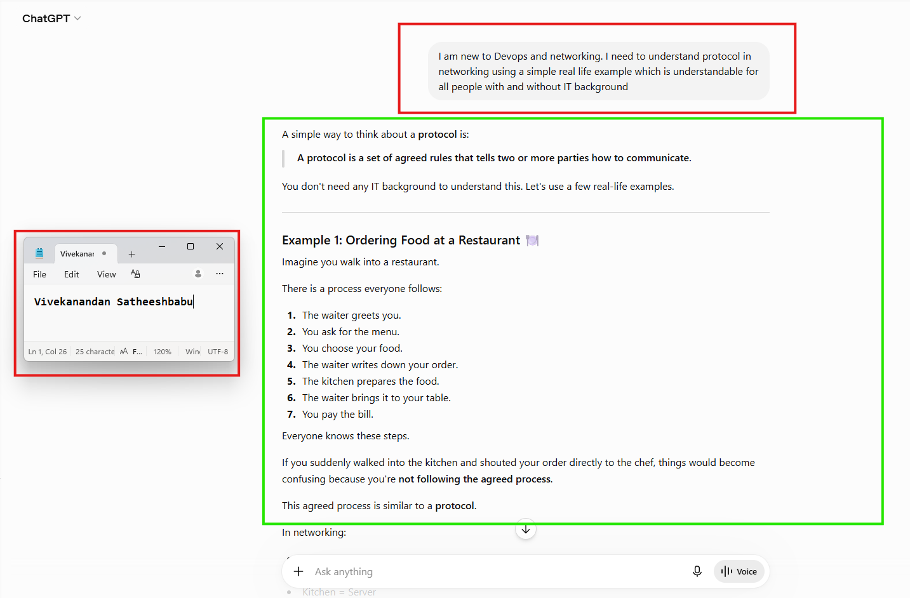
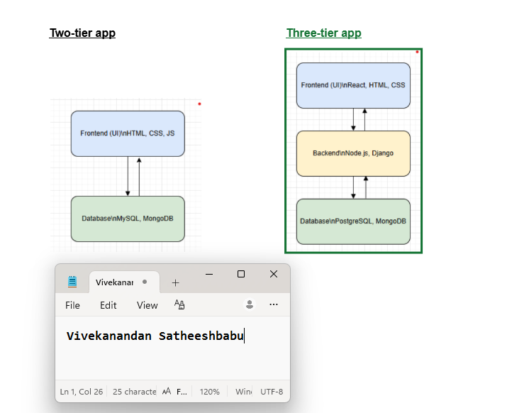
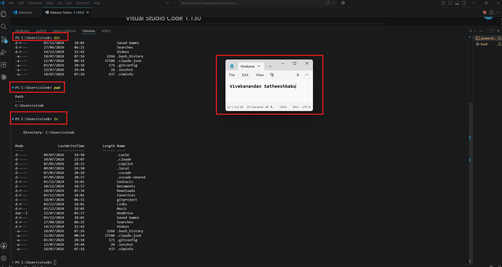

# Week 00 - Internet and Networking

Part of the DevOps Micro Internship (DMI) Cohort 3 with Agentic AI

---

# 🧑‍💻 Task 1: Using ChatGPT as Your Learning Assistant

## Scenario

You're new to DevOps and will frequently encounter technical questions. ChatGPT can be your learning companion.

## Your Task

Write a clear ChatGPT prompt to help you understand:

> "What is a protocol in networking? Explain with a simple real-life example."

Take a screenshot of your interaction showing:

* Your detailed prompt (with clear expectations)
* ChatGPT's simplified response with an example

## Screenshot

Save your screenshot in the `screenshots` folder and update the file name below.




Replace `task-1-chatgpt.png` with your actual screenshot file name.

---

## What I Learned (2–3 lines)

I learned that a protocol is a set of agreed rules that allows computers and devices to communicate with each other correctly. Just like people follow rules when talking, driving, or ordering food, computers follow networking protocols to exchange information. Understanding protocols helps me see how applications, servers, and networks communicate, which is a fundamental concept in DevOps and networking.

---

# 🌐 Task 2: Internet and Networking

## Scenario

Your friend is launching an online bookstore named **EpicReads**.

He asked you to explain how users globally can access his website hosted in Finland.

## Your Task

Write a short explanation (**100–150 words**) that includes:

* Packet Switching
* IP Address
* TCP/IP
* HTTP/HTTPS

💡 **Tip:** You may use ChatGPT (as demonstrated in Task 1) to refine your explanation.

## Answer

When someone visits EpicReads from anywhere in the world, their request travels across the internet using packet switching, where data is broken into small pieces called packets and sent separately. Each packet knows where to go because of the website’s IP address, which is like the home address of the server in Finland. The communication follows TCP/IP, a set of rules that ensures all packets are delivered correctly and reassembled in the right order. Finally, HTTP/HTTPS is used to load the website in the browser—HTTPS also keeps the connection secure by encrypting the data. Together, these technologies allow users globally to access EpicReads quickly and safely. 

---

# 🏗️ Task 3: Application Architecture & Stack

## Scenario

EpicReads bookstore has two application versions:

### Two-Tier Application

* Frontend
* Database

### Three-Tier Application

* Frontend
* Backend
* Database

## Your Task

* Draw simple diagrams (hand-drawn or tool-based such as draw.io)
* Label each layer clearly
* List at least two common technologies or tools used for each layer
* Submit a screenshot or photo clearly showing your own drawing

## Diagram Screenshot / Photo

Save your diagram image in the `screenshots` folder and update the file name below.




Replace `task-3-diagram.png` with your actual diagram file name.

---

## Technologies Used

### Frontend

* HTML
* CSS
* Javascript

### Backend

* Node.js
* Django

### Database

* MySQL
* MongoDB

---

# 🌍 Task 4: Domain Name & DNS (Basic Concepts)

## Scenario

Your friend's bookstore **EpicReads** is currently accessible through:

```text
52.172.142.222:3000
```

He purchased the domain:

```text
epicreads.com
```

## Your Task

In **50–100 words**, explain in your own words:

1. What is DNS (Domain Name System)?
2. Which DNS record type should be used to connect the domain to the given IP, and why?

## Answer

1. DNS (Domain Name System) is like internet’s phonebook.  When we type the domain epicread.com on the browser, DNS converts it into IP addresses and we don’t need to remember numbers for all domain.
2. To connect epicreads.com to 52.172.142.222, we should use an A record. An A record maps a domain name to an IPv4 address, making it the correct and standard way to point a domain to a server running on that IP. 

---

# 💻 Task 5: Visual Studio Code Setup (Hands-on)

## Your Task

Install Visual Studio Code (if not already installed).

Take a screenshot of your VS Code environment showing:

* Terminal open inside VS Code
* Running a basic command:

### Windows

```powershell
dir
```

### Linux / macOS

```bash
pwd
ls
```

* Your selected VS Code theme clearly visible

⚠️ **Important:** The screenshot must show your username or another identifiable detail to confirm it is your environment.

## Screenshot

Save your screenshot in the `screenshots` folder and update the file name below.




Replace `task-5-vscode.png` with your actual screenshot file name.

---

# 🔗 Task 6: Publish Your Assignment as a LinkedIn Post

## Objective

Publishing on LinkedIn helps you:

* Build your professional online presence
* Reinforce your learning
* Document your DevOps journey publicly

## Your Task

Summarize your answers from Tasks 1–5 into a LinkedIn post.

Clearly structure your post into the following sections:

* ChatGPT
* Internet & Networking
* App Architecture
* DNS
* VS Code Setup

Add the following credit note at the end of your post:

> **P.S. This post is a part of DevOps Micro Internship with Agentic AI Cohort-3 by Pravin Mishra. You can start your DevOps journey by joining this Discord community: https://discord.pravinmishra.com/**

---

## LinkedIn Post URL

Paste your LinkedIn post URL here:

https://www.linkedin.com/posts/vivek-satheeshbabu-454bb2408_to-start-my-career-in-devops-i-just-finished-share-7458267851905376256-iJjK/?utm_source=share&utm_medium=member_desktop&rcm=ACoAAGgdzwABbNstL2kSo9lujHSi1sZJFd95mgQ

---

## LinkedIn Post Backup Copy

Paste the full text of your LinkedIn post here:

To start my career in Devops, I just finished Week 0 of the DevOps Micro‑Internship, and here’s what I learned in each task.

Week 0 – DevOps Micro Internship Summary

💡 ChatGPT
I used ChatGPT as my learning assistant to understand networking protocols through a simple real‑life example — ordering food at a restaurant. This analogy helped me see how communication follows a structured set of rules, just like protocols in networking.
🌐 Internet & Networking
When someone visits EpicReads, their request travels across the internet using packet switching. Each packet carries the website’s IP address, ensuring it reaches the correct server. TCP/IP guarantees reliable delivery, while HTTPS secures the connection through encryption — enabling fast and safe global access.
🏗️ App Architecture
I explored how applications are built using two‑tier and three‑tier architectures. The two‑tier model connects the client directly to the database, while the three‑tier model separates the frontend, backend, and database layers — improving scalability, security, and maintainability.
🌍 DNS
DNS acts as the internet’s phonebook, translating domain names into IP addresses. To connect epicreads.com to 52.172.142.222, an A record is used because it maps a domain directly to an IPv4 address — the standard way to point a domain to its server.
💻 VS Code Setup
I installed Visual Studio Code, opened the integrated terminal, ran basic commands, and customized the theme. This setup prepares me for coding, automation, and future DevOps tasks.


P.S. This post is part of the DevOps Micro Internship (DMI) with Agentic AI — Cohort 3 — by Pravin Mishra. My graded progress is public: https://lnkd.in/eHpkPx4v · Start your DevOps journey: https://lnkd.in/ePzqKf65

---

# Reflection – Week 0

### What did you find easy?

All topics are explained clearly in this DMI. People with technical and non technical background can follow and learn easily.

---

### What was difficult?

I am new in using the tools like VS Code and Posting a blog in linkedin. But i will get used to it and doing it regularly will make things easy and increase my confidence.

---

### What will you improve next week?

I will spend more time on hands on by doing each assignment repeatedly and revising my notes

---

## 📌 About DMI & CloudAdvisory

DevOps Micro Internship (DMI) is a project-based DevOps program run by Pravin Mishra (The CloudAdvisory) focused on real-world execution, systems thinking, and career readiness.

It helps learners build strong DevOps foundations with hands-on experience.


## 📌 Resources

- 🌐 **DMI Official Website:** https://pravinmishra.com/dmi  
- 🎓 **DevOps for Beginners (Udemy):** https://www.udemy.com/course/devops-for-beginners-docker-k8s-cloud-cicd-4-projects/  
- 🎓 **Ultimate Agentic AI DevOps with Clude Code** https://www.udemy.com/course/ultimate-agentic-ai-devops-with-claude-code/?referralCode=448389767BC96284087B
- 🎓 **DevOps with Claude Code: Terraform, EKS, ArgoCD & Helm** https://www.udemy.com/course/devops-with-claude-code-terraform-eks-argocd-helm/?referralCode=1C5B734505D65A010FA3
- ▶️ **YouTube Playlist (DMI Cohort 3):** https://www.youtube.com/playlist?list=PLFeSNDtI4Cho  
- 🔗 **Pravin Mishra (LinkedIn):** https://www.linkedin.com/in/pravin-mishra-aws-trainer/  
- 🏢 **CloudAdvisory (LinkedIn):** https://www.linkedin.com/company/thecloudadvisory/

---

*This submission is part of DevOps Micro Internship (DMI) Cohort 3 — Agentic AI Track*