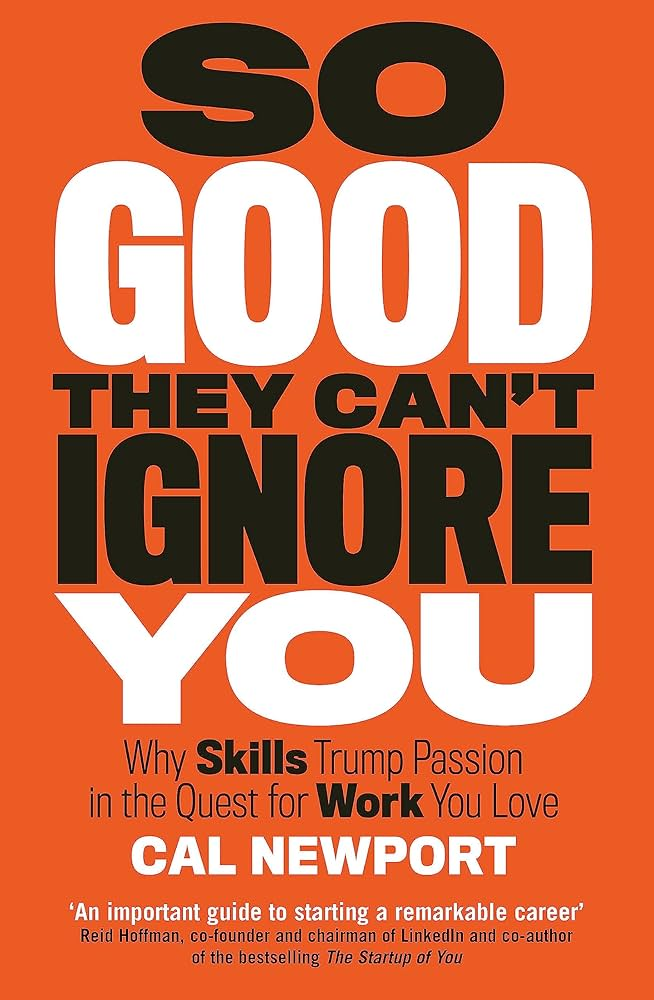
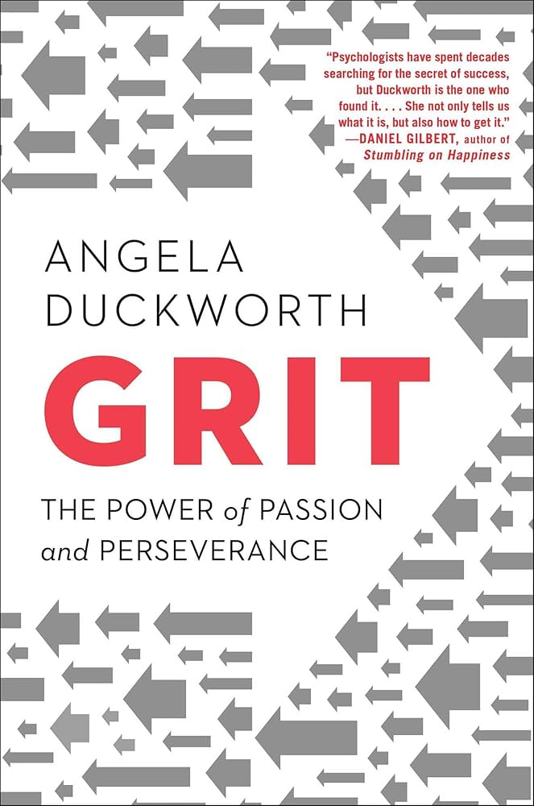
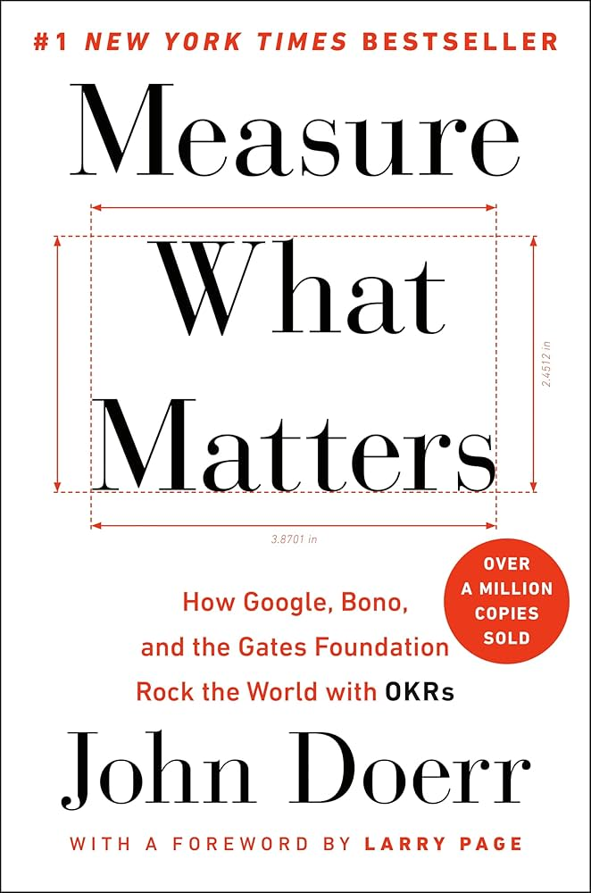
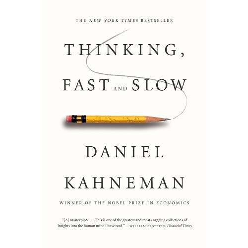
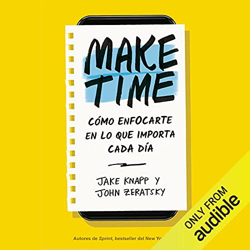

# Week 01 — Success Mindset (Mindset OS)

Part of the DevOps Micro Internship (DMI) Cohort 3 with Agentic AI

---

## Purpose (Read This First)

This week is not motivation homework.

This is you building your **Mindset OS** — the system you will use for the next 5 months (and honestly, for years).

### Expectations

* Be honest.
* Be specific.
* Be practical.
* Write like an adult professional: clear sentences, no one-liners.

You will reuse this in later weeks. So do it properly once.

---

# Assignment 1. What is something you believe to be true that most people around you would disagree with?

### Rules

* No "safe" answers.
* Must be your real belief (not copied from internet).
* Minimum 50 words.

**Hint:** What do you believe about career, money, learning, discipline, relationships, health, success, life, tech industry, etc. that most people don't agree with?

## Answer
I believe people hide behind preparation instead of taking action. Many think they must feel ready, get certifications and learn everything before starting, especially in tech. I disagree completely. Real growth happens through doing, failing, and adapting. Waiting masks fear. Imperfect action consistently beats perfect planning and leads to faster, meaningful success.

---

# Assignment 2. What are the top 3 objective truths you discovered through experimentation and results?

### Definition

Objective truths do not depend on opinions. They hold true regardless of how people feel.

Write each truth in this format:

**Truth:** (1 sentence)

**Evidence from my life:** (2–4 lines: what you tried + what happened)

---

## Truth #1

### Truth

**Truth:** Consistent effort produces better results than short bursts of motivation.

### Evidence from my life

**Evidence from my life:** I tried relying on motivation to study and build projects, but I was inconsistent and made little progress. When I switched to doing small tasks daily, even when I didn’t feel like it, I completed more projects and improved faster. Then i was able to get rid of procrastination, consistency will give you what determination without step will give you.

---

## Truth #2

### Truth

**Truth:** Practical experience teaches faster than passive learning.

### Evidence from my life

**Evidence from my life:** I spent time watching tutorials without building anything and retained very little. When I started doing hands-on projects, I understood concepts better and could apply them confidently.

---

## Truth #3

### Truth

**Truth:** Clear goals increase productivity and focus.

### Evidence from my life

**Evidence from my life:** When I worked without defined goals, I wasted time and felt unproductive. After setting specific daily and weekly targets, I became more focused and achieved more measurable progress. By then i was able to build brick by brick and here we are DMI is another step forward.

---

# Assignment 3. What does your 2.0 version look like?

### Instructions

Write as if a journalist is writing about you **3 to 7 years from now** (not 20 years).

**Minimum 300 words.**

### Rules

* Write in past tense, like it already happened.
* Don't use "likes to / wants to / hopes to."
* Use specifics:

  * built
  * shipped
  * led
  * published
  * earned
  * relocated
  * contributed
* Include skills proof:

  * projects
  * portfolios
  * GitHub
  * blogs
  * certifications
  * job role
  * leadership
  * community contribution
* Add 1–3 images if you can (optional but powerful).

### Publish It Publicly On Any ONE

* LinkedIn
* Medium
* WordPress
* Blogspot
* Personal blog
* Portfolio page

Include this line:

> **P.S. This post is a part of DevOps Micro Internship with Agentic AI Cohort-3 by [Pravin Mishra](https://www.linkedin.com/in/pravin-mishra-aws-trainer/). You can start your DevOps journey by joining this [Discord community](https://discord.pravinmishra.com/) ( https://discord.pravinmishra.com/ ).**

## Your Article

## From History Lecture Halls to Production Infrastructure: The Rise of Micheal Atoyebi

*Ilorin, Nigeria — The World*

When Micheal Atoyebi walked out of Kwara State University in 2024 clutching a bachelor's degree in History, almost nobody around him would have guessed he'd spend the next few years wiring together cloud infrastructure for clients scattered across three continents. He didn't come up through a computer science department or a bootcamp with a famous name attached. He taught himself, one broken Docker container and one failed Terraform apply at a time.

The turning point came quietly. While most of his coursemates chased NYSC postings and civil service exams, Atoyebi spent his evenings working through AWS documentation, setting up VLANs in Cisco Packet Tracer, and pushing half-finished projects to a GitHub account nobody was watching yet. He shipped his first real client project — a containerized deployment pipeline for a small e-commerce startup — through Fiverr in 2025, charging less than the work was worth just to build a track record. He didn't stop there.

By 2027, Atoyebi had earned his AWS Solutions Architect Associate certification and landed a remote DevOps engineering role with a mid-sized logistics company, where he led the migration of their staging environment from manual server provisioning to a fully automated Terraform-and-Docker workflow, cutting deployment time from days to under an hour. He later contributed fixes and documentation to two open-source infrastructure tools, earning his first merged pull requests outside his own repositories.

Outside the terminal, Atoyebi built something unusual: a comic series called Vault Vibes, breaking down DeFi concepts through the Concrete protocol for readers who found whitepapers unreadable. What started as weekly Twitter threads grew into a small but loyal following and eventually a short-form video spinoff. He also began mentoring newer freelancers on annotation platforms like Outlier and DataAnnotation, walking them through the same trial-and-error path he'd taken himself.

By 2031, Atoyebi runs a lean two-person DevOps consultancy out of Ilorin, serving clients in the UK, Canada, and Nigeria, while still finding time to publish the occasional Vault Vibes panel. The History graduate who once studied empires now builds the infrastructure quieter revolutions run on.

---

**P.S. This post is a part of DevOps Micro Internship with Agentic AI Cohort-3 by [Pravin Mishra](https://www.linkedin.com/in/pravin-mishra-aws-trainer/). You can start your DevOps journey by joining this [Discord community](https://discord.pravinmishra.com/) ( https://discord.pravinmishra.com/ ).**

### Public Link

https://medium.com/@fhelo3030/from-history-lecture-halls-to-production-infrastructure-the-rise-of-micheal-atoyebi-9e3a08966b14

`__________________________`

---

# Assignment 4. Have you ever cut corners (unethical / dishonest / shortcut behavior — not necessarily illegal)? If yes, how did it make you feel?

### Important

You don't need to write the full story.

Focus on the feeling:

* guilt
* fear
* shame
* stress
* regret
* numbness
* etc.

This is about self-awareness, not judgment.

### Answer Format

**Yes / No**

If Yes:

**What emotion did you feel?** (minimum 50–100 words)

## Answer

**No**

---

# Assignment 5. What are 10 non-fiction books you plan to read in the next 1 year?

### Rules

* Mention **Title + Author**
* Any language allowed
* No fiction novels

### Tip

Choose books that improve:

* mindset
* communication
* productivity
* health
* money
* career
* leadership

## Book List

## 📚 Book List

### 1. Essentialism — Greg McKeown  

---

### 2. So Good They Can’t Ignore You — Cal Newport  

---

### 3. The One Thing — Gary Keller  

---

### 4. Grit — Angela Duckworth  

---

### 5. Measure What Matters — John Doerr  

---

### 6. The Psychology of Money — Morgan Housel  

---

### 7. Thinking, Fast and Slow — Daniel Kahneman  

---

### 8. Make Time — Jake Knapp & John Zeratsky  

---

### 9. The Power of Now — Eckhart Tolle  

---

### 10. Never Split the Difference — Chris Voss  

---

# Assignment 6. What are the things you will measure regularly in your life and career?

### Rules

List topics only. No need to share numbers.

### Must Include

* Learning / skill
* Output / proof
* Health / energy
* Time / focus
* Money / finance (personal or business)

### Example

* Learning hours per week
* Deep work sessions per week
* Projects shipped / documented
* Steps / workouts
* Sleep hours
* Spending tracker

## My Metrics

* Skill depth gained from hands-on practice
* Number of real-world problems solved
* Energy levels throughout the day
* Quality of focus during work sessions
* Personal income growth and savings consistency
* Completed projects with public proof (GitHub, portfolio)
* Time spent on distractions vs productive work
* Physical activity consistency (movement, workouts)
* Sleep quality and recovery level
* New concepts successfully applied in real tasks

---

# Assignment 7. Brain Dump + 5-Month System Plan

## Step 1: Brain Dump (Private)

Do a brain dump of everything in your mind into a notebook.

Examples:

* Bills
* Tasks
* Worries
* Goals
* Pending messages
* Ideas
* Responsibilities

### Did You Do It?

**Yes / No**

Answer:

**Yes**

---

## Step 2: Your 5-Month Routine + Focus Blocks

Create a simple plan you can realistically follow for the next 5 months.

### Weekly Routine

Example:

* Mon–Thu: 60 min deep work
* Sat: DMI session
* Sun: Weekly review

#### My Weekly Routine

Mon–Fri: 3–5 hours focused learning/building (DevOps + projects)
Sat: DMI session + review what I learned
Sun: Weekly reset (plan, reflect, organize tasks)

---

### Focus Blocks

#### When Will You Do DMI Work? (Days + Time)

Monday to Friday, 12:00 AM – 4:00 AM

#### How Many Sessions Per Week?

5 sessions per week

---

### Distraction Rules

Examples:

* Phone rules
* Social media rules
* Environment setup

#### My Distraction Rules

No social media during focus hours
Phone stays away from my workspace while working
Only use laptop for task-related work during sessions
Set a clear task before starting each session
Take short breaks only after completing a task

---

# Reflection – Week 1

### Biggest insight I got about myself this week

I realized I tend to overthink starting tasks, but once I begin, I actually make good progress.

### My biggest weakness/loop I noticed

I delay important work by spending too much time planning or consuming content instead of doing.

### One system I will implement from this week (exact habit + time)

Start working immediately at 12:00 AM every weekday without thinking twice, even if it’s just for 2hours.

### LinkedIn Post

Paste your LinkedIn post link here:

`https://www.linkedin.com/posts/aamicheal_join-the-dmi-devops-micro-internship-share-7478634141383663616-TGH8/?utm_source=share&utm_medium=member_desktop&rcm=ACoAADFvgDYBsnsyE66xAyq2HzH3Jfsf19WE6JA`

---

## 10. Proof of Work

- LinkedIn Post URL: **https://www.linkedin.com/posts/aamicheal_join-the-dmi-devops-micro-internship-share-7478634141383663616-TGH8/?utm_source=share&utm_medium=member_desktop&rcm=ACoAADFvgDYBsnsyE66xAyq2HzH3Jfsf19WE6JA**  
- Blog / Medium : **https://medium.com/@fhelo3030/from-history-lecture-halls-to-production-infrastructure-the-rise-of-micheal-atoyebi-9e3a08966b14**  

---

## 📌 About DMI & CloudAdvisory

DevOps Micro Internship (DMI) is a project-based DevOps program run by Pravin Mishra (The CloudAdvisory) focused on real-world execution, systems thinking, and career readiness.

It helps learners build strong DevOps foundations with hands-on experience.

## 📌 Resources

- 🌐 **DMI Official Website:** https://pravinmishra.com/dmi  
- 🎓 **DevOps for Beginners (Udemy):** https://www.udemy.com/course/devops-for-beginners-docker-k8s-cloud-cicd-4-projects/  
- 🎓 **Ultimate Agentic AI DevOps with Clude Code** https://www.udemy.com/course/ultimate-agentic-ai-devops-with-claude-code/?referralCode=448389767BC96284087B
- 🎓 **DevOps with Claude Code: Terraform, EKS, ArgoCD & Helm** https://www.udemy.com/course/devops-with-claude-code-terraform-eks-argocd-helm/?referralCode=1C5B734505D65A010FA3
- ▶️ **YouTube Playlist (DMI Cohort 3):** https://www.youtube.com/playlist?list=PLFeSNDtI4Cho  
- 🔗 **Pravin Mishra (LinkedIn):** https://www.linkedin.com/in/pravin-mishra-aws-trainer/  
- 🏢 **CloudAdvisory (LinkedIn):** https://www.linkedin.com/company/thecloudadvisory/

---

*This submission is part of DevOps Micro Internship (DMI) Cohort 3 — Agentic AI Track*