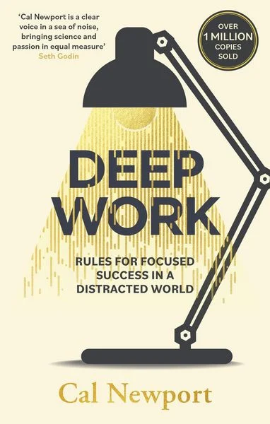
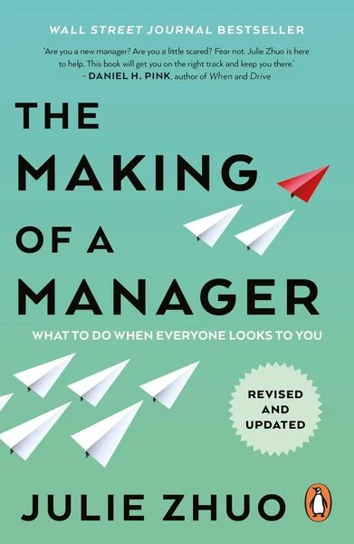
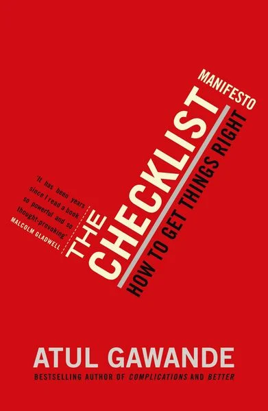
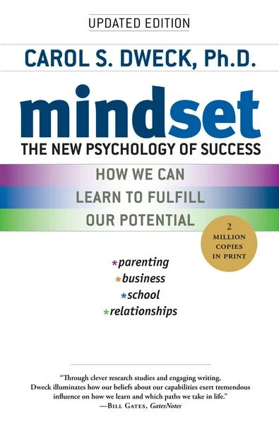
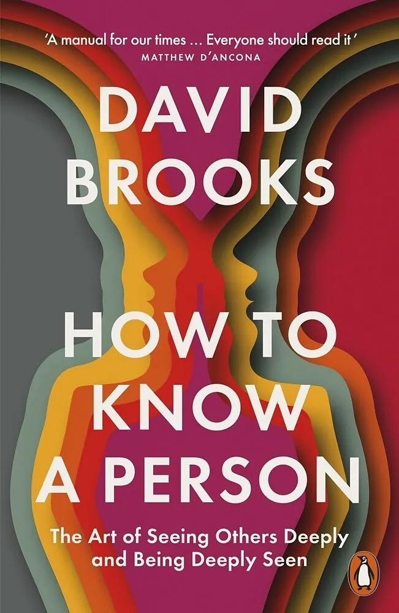

# Week 01 — Success Mindset (Mindset OS)

Part of the DevOps Micro Internship (DMI) Cohort 3 with Agentic AI

---

## Purpose (Read This First)

This week is not motivation homework.

This is you building your **Mindset OS** — the system you will use for the next 5 months (and honestly, for years).

### Expectations

* Be honest.
* Be specific.
* Be practical.
* Write like an adult professional: clear sentences, no one-liners.

You will reuse this in later weeks. So do it properly once.

---

# Assignment 1. What is something you believe to be true that most people around you would disagree with?

### Rules

* No "safe" answers.
* Must be your real belief (not copied from internet).
* Minimum 50 words.

**Hint:** What do you believe about career, money, learning, discipline, relationships, health, success, life, tech industry, etc. that most people don't agree with?

## Answer

I believe that the traditional advice we are given about life and success is mostly wrong. Most people around me follow these old rules blindly, but my experience has taught me to look at things very differently:

### On Career
Hard work alone isn't enough. Social interaction and networking are just as important for career growth. You can be the most talented person in the room, but if no one knows who you are or likes working with you, you’ll get left behind. Relationships open doors, not just a good resume.

### On Money
Saving money doesn't mean you're good with money. True financial health is about increasing your purchasing power by creating value. Money has to be planted and invested for it to grow; letting it sit in a bank account while inflation eats it away is just passive.

### On Knowledge
Having theoretical knowledge about something doesn't make you an expert. We live in a world obsessed with degrees and certificates, but real expertise comes from actually doing the work, making mistakes, and fixing them. 

### On Discipline
Discipline is not fueled by motivation. If you only work when you feel inspired, you’ll never get anything done. True discipline is a habit—it’s the ability to show up and do the work even when you have absolutely zero desire to do it.

### On Relationships
You shouldn't say every single thing that pops into your head. People think total, unfiltered honesty is always the right move. But real relationships need filters. Sometimes, being kind and holding your tongue is way better than hurting someone just to "be real."

### On Health
Getting healthy is actually very boring, and the fitness industry hates that. You don't need expensive powders, special diets, or fancy gyms. It really just comes down to sleeping enough, walking more, eating real food, and not stressing out. The rest is just people trying to sell you stuff.

### On Success
Getting what you want won't fix your life. We always think, *"Once I get that job or make that much money, I’ll finally be happy."* But the second you get it, you just get used to it. If you hate the daily grind of getting there, winning the prize at the end won't make you feel any better.

### On Life
You aren't born with one specific "purpose" you have to go out and find. People get stuck for years trying to figure out what they were "meant" to do. The truth is, life doesn't come with instructions. You have to pick something you care about and create your own meaning.

### On the Tech Industry
AI isn't going to take everyone's job; it's just going to replace people who only know how to follow basic instructions. For a long time, tech paid well just for fast coding or data entry. Now that computers can do that, the only people who will survive are the ones who actually understand how to solve human problems.

---

# Assignment 2. What are the top 3 objective truths you discovered through experimentation and results?

### Definition

Objective truths do not depend on opinions. They hold true regardless of how people feel.

Write each truth in this format:

**Truth:** (1 sentence)

**Evidence from my life:** (2–4 lines: what you tried + what happened)

---

## Truth #1

### Truth

Objective truths do not depend on opinions. They hold true regardless of how people feel.

### Evidence from my life

I recently handled an Entra ID device join issue where a customer couldn't connect their machine to the cloud. Because I keep clear notes on past tickets, I quickly checked my documentation and saw that Windows 11 Home doesn't support basic Entra ID joining. Having that written down allowed me to pinpoint the OS limitation instantly instead of spending hours running useless troubleshooting steps.

---

## Truth #2

### Truth

Uninterrupted focus on a single task produces higher quality work in less time than multitasking.

### Evidence from my life

Working as a cloud support engineer, I get assigned multiple cases daily. Putting my focus into one case problem at a time allows me to isolate the root cause much faster and close the ticket cleanly. Whenever I try to jump between three open issues at once, I end up mixing up configurations, missing obvious errors, and taking twice as long to resolve any of them.

---

## Truth #3

### Truth

Real competence only comes from building, breaking, and fixing things firsthand, not from reading about them.

### Evidence from my life

I often get cases related to conditional access policy issues which are based on if-else logic. To truly understand why a policy is blocking a user, I have to replicate the exact logic and break it in my own test environment. Recently, I had a case where a customer's complex nested rules kept failing; reading the documentation didn't fix it, but deploying the same broken setup in my lab allowed me to see the exact point of failure and resolve the issue.

---

# Assignment 3. What does your 2.0 version look like?

### Instructions

Write as if a journalist is writing about you **3 to 7 years from now** (not 20 years).

**Minimum 300 words.**

### Rules

* Write in past tense, like it already happened.
* Don't use "likes to / wants to / hopes to."
* Use specifics:

  * built
  * shipped
  * led
  * published
  * earned
  * relocated
  * contributed
* Include skills proof:

  * projects
  * portfolios
  * GitHub
  * blogs
  * certifications
  * job role
  * leadership
  * community contribution
* Add 1–3 images if you can (optional but powerful).

### Publish It Publicly On Any ONE

* LinkedIn
* Medium
* WordPress
* Blogspot
* Personal blog
* Portfolio page

Include this line:

> **P.S. This post is a part of DevOps Micro Internship with Agentic AI Cohort-3 by [Pravin Mishra](https://www.linkedin.com/in/pravin-mishra-aws-trainer/). You can start your DevOps journey by joining this [Discord community](https://discord.pravinmishra.com/) ( https://discord.pravinmishra.com/ ).**

## Your Article

# The Engineer Who Turned Curiosity into a Career in DevOps

A few years ago, Gideon Omole was working as a Cloud Support Engineer, spending most of his time troubleshooting systems and resolving cloud related issues. While he was effective in that role, he often found himself thinking beyond support tickets and operational fixes. He was more interested in how systems were designed, how deployments were automated, and how reliable infrastructure was built from the ground up. That curiosity gradually pushed him toward DevOps and cloud architecture.

Instead of waiting for a formal transition opportunity, he began building his own path. He spent his time working on hands-on cloud projects, learning Infrastructure as Code, and understanding how production systems were structured. Over time, this practical experimentation became the foundation of his career shift.

He started by building and shipping real-world applications on AWS, designing systems that went beyond simple demos. His projects included production-style architectures with VPC networking, IAM security configurations, Application Load Balancers, ECS Fargate services, S3 storage, and CloudFront distribution for frontend delivery. He automated deployments using Terraform and built CI/CD pipelines using GitHub Actions, ensuring that infrastructure and application releases were repeatable and consistent.

Each project was carefully documented and published on GitHub. His repositories included not just code, but also architecture diagrams, setup instructions, and deployment explanations. This made his work easy to understand and demonstrated how he approached real engineering problems rather than just writing scripts. Over time, his GitHub profile evolved into a living portfolio of cloud and DevOps capabilities.

As his confidence grew, Gideon began sharing what he was learning. He published technical blogs and LinkedIn articles that explained cloud concepts, DevOps workflows, networking, and Infrastructure as Code in a simple and practical way. Instead of focusing on theory, he wrote about what he actually built, the challenges he faced, and how he solved real deployment problems. This made his content relatable, especially for engineers just starting their cloud journey.

Download the Medium App
To strengthen his foundation, he earned multiple industry certifications. He began with the AWS Certified Cloud Practitioner, which gave him a solid grounding in AWS fundamentals. He then progressed to the AWS Certified Solutions Architect — Associate, where he developed strong skills in designing scalable and resilient cloud systems. He later achieved the AWS Certified DevOps Engineer — Professional, focusing on automation, CI/CD, and operational excellence in production environments.

On the Microsoft side, he earned AZ-104 (Azure Administrator Associate), where he gained hands-on experience managing compute, storage, networking, and identity services. He followed this with AZ-500 (Azure Security Engineer Associate), deepening his expertise in cloud security, threat protection, and identity management. He also earned the Microsoft Certified Trainer (MCT) certification, reflecting his ability to communicate technical concepts clearly and effectively.

These certifications complemented his hands-on experience rather than replacing it. Together, they reinforced his ability to work confidently across both AWS and Azure ecosystems.

Professionally, Gideon transitioned into a DevOps Engineering role where he worked on designing and maintaining cloud infrastructure for production systems. His responsibilities included building CI/CD pipelines, automating infrastructure provisioning, improving deployment reliability, and reducing manual operational work through Infrastructure as Code. His contributions helped improve release speed, system stability, and overall engineering efficiency.

Over time, he naturally stepped into leadership responsibilities. He guided engineers on AWS architecture decisions, Terraform best practices, and secure deployment patterns. He contributed to technical discussions that shaped infrastructure decisions and helped teams adopt more scalable and cost-efficient solutions.

Outside of formal responsibilities, he became actively involved in mentoring and community support. He helped junior engineers understand DevOps fundamentals, reviewed project setups, and provided feedback on cloud architectures. Through LinkedIn posts, GitHub documentation, and informal discussions, he consistently shared practical insights drawn from real-world experience. His focus was always on clarity and applicability rather than theory.

Looking back, Gideon’s journey reflects a steady evolution rather than a sudden transformation. It was built through consistent hands-on work, documentation, learning, and contribution. From troubleshooting cloud systems to designing and automating them, he gradually shaped himself into a DevOps engineer who not only builds reliable infrastructure but also helps others grow in the same space.

P.S. This post is a part of DevOps Micro Internship with Agentic AI Cohort-3 by Pravin Mishra (https://www.linkedin.com/in/pravin-mishra-aws-trainer/). You can start your DevOps journey by joining this Discord community (https://discord.pravinmishra.com/).

### Public Link

Paste your link here:

`https://medium.com/@gideonomole9/the-engineer-who-turned-curiosity-into-a-career-in-devops-4186f84bf75a`

---

# Assignment 4. Have you ever cut corners (unethical / dishonest / shortcut behavior — not necessarily illegal)? If yes, how did it make you feel?

### Important

You don't need to write the full story.

Focus on the feeling:

* guilt
* fear
* shame
* stress
* regret
* numbness
* etc.

This is about self-awareness, not judgment.

### Answer Format

**Yes / No**

If Yes:

**What emotion did you feel?** (minimum 50–100 words)

## Answer

No

---

# Assignment 5. What are 10 non-fiction books you plan to read in the next 1 year?

### Rules

* Mention **Title + Author**
* Any language allowed
* No fiction novels

### Tip

Choose books that improve:

* mindset
* communication
* productivity
* health
* money
* career
* leadership

## Book List

1. Atomic Habits

2. Deep Work: Rules for Focused Success in a Distracted World by Cal Newport

3. The Making of a Manager: What to Do When Everyone Looks to You

4. Psychology of Money

5. Four Thousand Weeks

6. The Checklist Manifesto

7. How Not to Die

8. High Output Management

9. Mindset: The New Psychology of Success

10. How to Know a Person

---

# Assignment 6. What are the things you will measure regularly in your life and career?

### Rules

List topics only. No need to share numbers.

### Must Include

* Learning / skill
* Output / proof
* Health / energy
* Time / focus
* Money / finance (personal or business)

### Example

* Learning hours per week
* Deep work sessions per week
* Projects shipped / documented
* Steps / workouts
* Sleep hours
* Spending tracker

## My Metrics

* Learning hours per week
* Hands-on lab and practice sessions
* Cloud and DevOps projects completed
* Certifications and courses completed
* Technical documentation and portfolio updates
* Deep work sessions and focused study time
* Sleep hours and overall energy levels
* Exercise and daily step count
* Monthly savings and investment tracking
* Personal spending and budget review

---

# Assignment 7. Brain Dump + 5-Month System Plan

## Step 1: Brain Dump (Private)

Do a brain dump of everything in your mind into a notebook.

Examples:

* Bills
* Tasks
* Worries
* Goals
* Pending messages
* Ideas
* Responsibilities

### Did You Do It?

**Yes / No**

Answer:

**Answer:**

Yes. I did a brain dump by listing my current tasks, goals, responsibilities, ideas, pending messages, career plans, financial commitments, and personal reminders in one place so I have a clear picture of everything on my mind.

---

## Step 2: Your 5-Month Routine + Focus Blocks

Create a simple plan you can realistically follow for the next 5 months.

### Weekly Routine

Example:

* Mon–Thu: 60 min deep work
* Sat: DMI session
* Sun: Weekly review

#### My Weekly Routine

* **Monday:** 1 hour of focused learning
* **Tuesday:** 1 hour of assignments and note-taking
* **Wednesday:** 1 hour of deep work on course activities
* **Thursday:** 1 hour of reviewing what I learned
* **Friday:** Complete any pending tasks and organize my notes
* **Saturday:** 2 hours of studying and working on course projects
* **Sunday:** Weekly review, plan the next week, and rest

---

### Focus Blocks

#### When Will You Do DMI Work? (Days + Time)

Sunday to Friday: 2 hours per day (7:00 PM – 9:00 PM)

#### How Many Sessions Per Week?

6 sessions per week

---

### Distraction Rules

Examples:

* Phone rules
* Social media rules
* Environment setup

#### My Distraction Rules

- Phone on silent or Do Not Disturb during study time  
- No social media while working (only check after sessions)  
- Keep phone out of reach or in another room if possible  
- Study in a quiet, clean space (no TV or background noise)  
- Close all unrelated tabs and apps before starting  
- Take breaks only after completing a full session  
- If distracted, write it down and return to focus immediately  

---

# Reflection – Week 1

### Biggest insight I got about myself this week

AI realized that my best work happens when I protect my mornings. If I can dive straight into a complex problem before getting bogged down by minor notifications or overthinking the approach, I get things done twice as fast. 

### My biggest weakness/loop I noticed

I have a habit of getting stuck in a research loop. I'll spend way too much time reading documentation, adjusting settings, or gathering information before actually starting the work. It feels like productivity, but it's really just a structured way of delaying execution.

### One system I will implement from this week (exact habit + time)

Every weekday evening at **7:00 PM**, I am going to shut down all communication apps and spend exactly 30 minutes doing pure hands-on building or lab work. 

### LinkedIn Post

Paste your LinkedIn post link here:

`__________________________`

---

## 10. Proof of Work

- LinkedIn Post URL: **ADD LINK HERE**  
- Blog / Medium : **https://medium.com/@gideonomole9/the-engineer-who-turned-curiosity-into-a-career-in-devops-4186f84bf75a**  

---

## 📌 About DMI & CloudAdvisory

DevOps Micro Internship (DMI) is a project-based DevOps program run by Pravin Mishra (The CloudAdvisory) focused on real-world execution, systems thinking, and career readiness.

It helps learners build strong DevOps foundations with hands-on experience.

## 📌 Resources

- 🌐 **DMI Official Website:** https://pravinmishra.com/dmi  
- 🎓 **DevOps for Beginners (Udemy):** https://www.udemy.com/course/devops-for-beginners-docker-k8s-cloud-cicd-4-projects/  
- 🎓 **Ultimate Agentic AI DevOps with Clude Code** https://www.udemy.com/course/ultimate-agentic-ai-devops-with-claude-code/?referralCode=448389767BC96284087B
- 🎓 **DevOps with Claude Code: Terraform, EKS, ArgoCD & Helm** https://www.udemy.com/course/devops-with-claude-code-terraform-eks-argocd-helm/?referralCode=1C5B734505D65A010FA3
- ▶️ **YouTube Playlist (DMI Cohort 3):** https://www.youtube.com/playlist?list=PLFeSNDtI4Cho  
- 🔗 **Pravin Mishra (LinkedIn):** https://www.linkedin.com/in/pravin-mishra-aws-trainer/  
- 🏢 **CloudAdvisory (LinkedIn):** https://www.linkedin.com/company/thecloudadvisory/

---

*This submission is part of DevOps Micro Internship (DMI) Cohort 3 — Agentic AI Track*