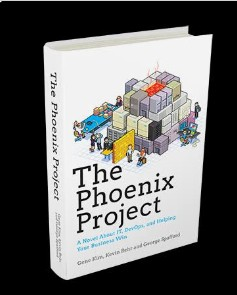
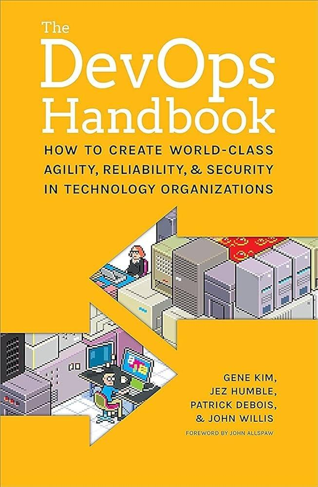
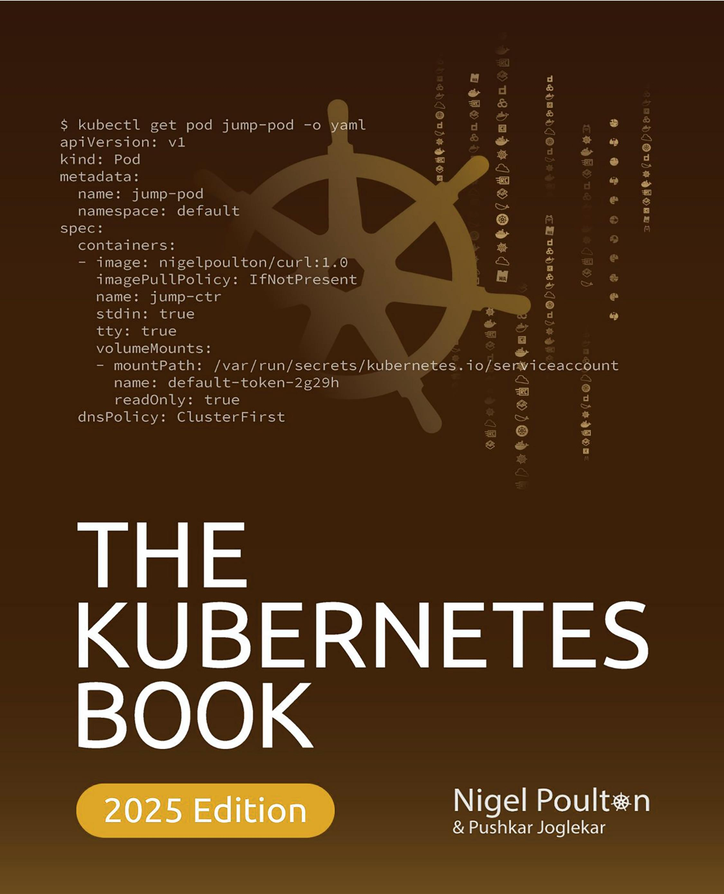
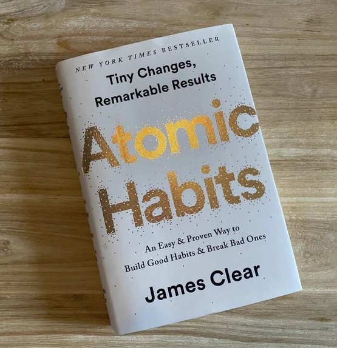
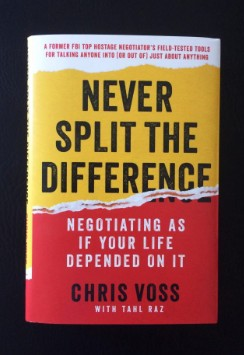
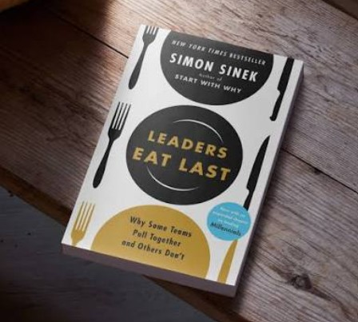
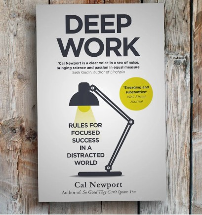
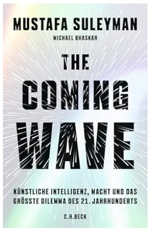

# Week 01 — Success Mindset (Mindset OS)

Part of the DevOps Micro Internship (DMI) Cohort 3 with Agentic AI

---

## Purpose (Read This First)

This week is not motivation homework.

This is you building your **Mindset OS** — the system you will use for the next 5 months (and honestly, for years).

### Expectations

* Be honest.
* Be specific.
* Be practical.
* Write like an adult professional: clear sentences, no one-liners.

You will reuse this in later weeks. So do it properly once.

---

# Assignment 1. What is something you believe to be true that most people around you would disagree with?

### Rules

* No "safe" answers.
* Must be your real belief (not copied from internet).
* Minimum 50 words.

**Hint:** What do you believe about career, money, learning, discipline, relationships, health, success, life, tech industry, etc. that most people don't agree with?

## Answer

I believe you don't need to know every tool to be a good DevOps engineer. A strong understanding of Linux, networking, automation, and problem-solving is more valuable than collecting certifications or memorising commands.
---

# Assignment 2. What are the top 3 objective truths you discovered through experimentation and results?

### Definition

Objective truths do not depend on opinions. They hold true regardless of how people feel.

Write each truth in this format:

**Truth:** (1 sentence)

**Evidence from my life:** (2–4 lines: what you tried + what happened)

---

## Truth #1

### Truth

1. Consistency beats intensity.

### Evidence from my life

Through hands-on practice, I discovered that spending a little time every day building and troubleshooting systems leads to much better understanding than trying to learn everything at once.

---

## Truth #2

### Truth

2. Reading is not the same as doing.

### Evidence from my life

I found that I only truly understood a technology after building it myself, making mistakes, and fixing them. Practical experience has been far more valuable than simply watching tutorials or reading documentation.

---

## Truth #3

### Truth

Have a Clear plan and stick to it.

### Evidence from my life

Having a clear plan and sticking to it produces better results than constantly changing direction. I've found that setting a goal, trusting the process, and believing in my ability to learn has helped me make steady progress, even when the learning curve was challenging.

---

# Assignment 3. What does your 2.0 version look like?

### Instructions

Write as if a journalist is writing about you **3 to 7 years from now** (not 20 years).

**Minimum 300 words.**

### Rules

* Write in past tense, like it already happened.
* Don't use "likes to / wants to / hopes to."
* Use specifics:

  * built
  * shipped
  * led
  * published
  * earned
  * relocated
  * contributed
* Include skills proof:

  * projects
  * portfolios
  * GitHub
  * blogs
  * certifications
  * job role
  * leadership
  * community contribution
* Add 1–3 images if you can (optional but powerful).

### Publish It Publicly On Any ONE

* LinkedIn
* Medium
* WordPress
* Blogspot
* Personal blog
* Portfolio page

Include this line:

> **P.S. This post is a part of DevOps Micro Internship with Agentic AI Cohort-3 by [Pravin Mishra](https://www.linkedin.com/in/pravin-mishra-aws-trainer/). You can start your DevOps journey by joining this [Discord community](https://discord.pravinmishra.com/) ( https://discord.pravinmishra.com/ ).**

## Your Article

# Ibitoye Oloni 2.0

Five years later, people no longer introduced Ibitoye Oloni by listing his certifications or previous employers. They simply described him as an engineer whose work inspired confidence.
Whether designing cloud infrastructure, improving deployment pipelines, or responding to critical production incidents, he had earned a reputation for delivering secure, reliable, and scalable solutions that solved real business problems. He never pursued technology simply because it was new. Instead, he applied it where it created measurable value, reduced operational costs, improved efficiency, and strengthened business resilience.

His GitHub portfolio became one of his greatest professional assets. It evolved into a collection of well-documented projects demonstrating Infrastructure as Code, Kubernetes, containerisation, CI/CD pipelines, cloud-native deployments, monitoring, observability, and automation. Every repository reflected thoughtful engineering, practical problem-solving, and a commitment to quality rather than simply showcasing technical tools.
Professionally, he established himself as a trusted Cloud and DevOps Engineer, working closely with software developers, security teams, and business stakeholders to deliver resilient platforms and reliable services. He contributed to modernising infrastructure, simplifying deployment processes, improving operational reliability, and helping organisations adopt cloud technologies with confidence.
Continuous learning remained one of the defining characteristics of his career. As technology evolved, so did his skills. He expanded his expertise across cloud engineering, cybersecurity, platform engineering, artificial intelligence, and automation, ensuring that every new skill was applied to solving real business challenges rather than remaining theoretical knowledge.

His contribution extended beyond the workplace. Through GitHub, Medium, and LinkedIn, he documented lessons learned, shared practical solutions, and published technical articles that helped other professionals navigate cloud engineering and DevOps. His willingness to share both successes and lessons learned earned the respect of aspiring engineers and experienced professionals alike.
Colleagues valued him for more than his technical expertise. They recognised his professionalism, integrity, calm decision-making, and ability to remain composed under pressure. He mentored aspiring engineers, encouraged continuous learning, and fostered a culture of collaboration where knowledge was openly shared and success was measured by collective achievement.
Looking back, his career was never defined by a single promotion, certification, or opportunity. It was built through disciplined learning, consistent execution, and an unwavering commitment to excellence. Every project delivered, every problem solved, and every lesson documented strengthened a professional reputation built on trust.
Today, organisations know Ibitoye as an engineer they can rely on. Whether improving cloud platforms, automating deployment processes, or strengthening operational resilience, his work consistently delivers value beyond technology itself. His journey demonstrates that lasting success is not built on titles or certifications alone, but on professionalism, continuous learning, and consistently delivering solutions that make a meaningful difference.
In the end, the greatest version of himself wasn’t defined by the technologies he mastered, but by the trust he earned through every solution he delivered.
**P.S. This post is a part of DevOps Micro Internship with Agentic AI Cohort-3 by Pravin Mishra. You can start your DevOps journey by joining this Discord community: https://discord.pravinmishra.com/.**

### Public Link

Paste your link here:

Linkedin: `https://www.linkedin.com/posts/ibitoye-oloni_ibitoye-oloni-20-technology-changes-quickly-share-7478415594032230402-GpUa/?utm_source=share&utm_medium=member_desktop&rcm=ACoAAABp_1YBcUgsxYJIdRCX9CFvm17K_adeV6E`

Medium.com: `https://medium.com/@toyeoloni/engineering-trust-the-next-chapter-of-ibitoye-oloni-a09aa8056919?postPublishedType=initial/`

---

# Assignment 4. Have you ever cut corners (unethical / dishonest / shortcut behavior — not necessarily illegal)? If yes, how did it make you feel?

### Important

You don't need to write the full story.

Focus on the feeling:

* guilt
* fear
* shame
* stress
* regret
* numbness
* etc.

This is about self-awareness, not judgment.

### Answer Format

**No**

If Yes:

**What emotion did you feel?** (minimum 50–100 words)

## Answer

---

# Assignment 5. What are 10 non-fiction books you plan to read in the next 1 year?

### Rules

* Mention **Title + Author**
* Any language allowed
* No fiction novels

### Tip

Choose books that improve:

* mindset
* communication
* productivity
* health
* money
* career
* leadership

## Book List

1. The Phoenix Project — Gene Kim, Kevin Behr & George Spafford

2. The DevOps Handbook — Gene Kim, Jez Humble, Patrick Debois & John Willis

3. The Kubernetes Book — Nigel Poulton

4. The Pragmatic Programmer — David Thomas & Andrew Hunt

5. Atomic Habits — James Clear

6. The Psychology of Money — Morgan Housel

7. Never Split the Difference — Chris Voss

8. Leaders Eat Last — Simon Sinek

9. Deep Work — Cal Newport

10. The Coming Wave — Mustafa Suleyman

---

# Assignment 6. What are the things you will measure regularly in your life and career?

### Rules

List topics only. No need to share numbers.

### Must Include

* Learning / skill
* Output / proof
* Health / energy
* Time / focus
* Money / finance (personal or business)

### Example

* Learning hours per week
* Deep work sessions per week
* Projects shipped / documented
* Steps / workouts
* Sleep hours
* Spending tracker

## My Metrics

Learning hours and new skills acquired
Hands-on projects completed and documented
GitHub contributions and portfolio growth
Technical articles and knowledge shared
Professional certifications completed
Deep work and focused learning sessions
Physical exercise, sleep, and overall health
Personal finances, savings, and investments
Professional relationships, mentoring, and networking
Faith, personal growth, and consistency

---

# Assignment 7. Brain Dump + 5-Month System Plan

## Step 1: Brain Dump (Private)

Do a brain dump of everything in your mind into a notebook.

Examples:

* Bills
* Tasks
* Worries
* Goals
* Pending messages
* Ideas
* Responsibilities

### Did You Do It?

**Yes / No**

Answer: Yes

My brain dump covered the key areas of my life, including my career, learning goals, personal responsibilities, finances, health, relationships, ideas, and pending tasks. Writing everything down helped me organise my thoughts, identify priorities, and create a clearer plan for the months ahead.

---

## Step 2: Your 5-Month Routine + Focus Blocks

Create a simple plan you can realistically follow for the next 5 months.

### Weekly Routine

Example:

* Mon–Thu: 60 min deep work
* Sat: DMI session
* Sun: Weekly review

#### My Weekly Routine

**Monday–Thursday:** 1.5–2 hours of focused DevOps and Cloud learning  
**Friday:** Review the week's learning and update my learning notes  
**Saturday:** Attend DevOps Micro Internship (DMI) sessions  
**Sunday:** Weekly review, plan the coming week, and spend quality time with family and personal reflection

---

### Focus Blocks

#### When Will You Do DMI Work? (Days + Time)

Monday - Thursday: 19:00 - 21:00
Saturday: 05:30 - 15:00

#### How Many Sessions Per Week?

5

---

### Distraction Rules

Examples:

* Phone rules
* Social media rules
* Environment setup

#### My Distraction Rules

- Keep my phone on Silent during deep work and study sessions.  
- Block dedicated focus periods in my calendar/planner.  
- Turn off non-essential notifications on all devices.  
- Avoid social media during scheduled learning hours.  
- Check emails and messages only at designated times.  
- Work in a distraction-free environment whenever possible.  
- Complete my planned task before switching to another activity.  
- Review my progress at the end of each week and adjust my routine if needed.  

---

# Reflection – Week 1

### Biggest insight I got about myself this week

This week reminded me that meaningful progress comes from **consistency rather than intensity**. I realised that I already have a strong foundation from my years in IT, and my focus now is to build on that by developing practical Cloud and DevOps skills. I also learned the importance of building publicly through GitHub, documenting my work, and creating a professional brand that reflects not only what I know but also what I can deliver. More importantly, I recognised that becoming a better engineer is not just about learning new technologies—it is about developing the discipline, habits, and mindset to keep learning, improving, and delivering value over the long term.

### My biggest weakness/loop I noticed

I sometimes spend too much time trying to make things perfect before moving on. Whether it's my CV, GitHub README, or a technical project, I tend to revisit and refine my work repeatedly. While attention to detail is important, I realised that consistent progress and completing work are more valuable than chasing perfection.

### One system I will implement from this week (exact habit + time)

Monday to Thursday, from 7:00 PM to 9:00 PM, I will dedicate two uninterrupted hours to focused learning and hands-on DevOps practice. During this time, my phone will remain on silent, social media will be turned off, and I will work on one planned task until it is completed. Every Sunday evening, I will review my progress and plan the following week's goals.

### LinkedIn Post

Paste your LinkedIn post link here:

`https://www.linkedin.com/posts/ibitoye-oloni_ibitoye-oloni-20-technology-changes-quickly-share-7478415594032230402-GpUa/?utm_source=share&utm_medium=member_desktop&rcm=ACoAAABp_1YBcUgsxYJIdRCX9CFvm17K_adeV6E_________________________`

---

## 10. Proof of Work

- LinkedIn Post URL: **https://www.linkedin.com/posts/ibitoye-oloni_ibitoye-oloni-20-technology-changes-quickly-share-7478415594032230402-GpUa/?utm_source=share&utm_medium=member_desktop&rcm=ACoAAABp_1YBcUgsxYJIdRCX9CFvm17K_adeV6E**  
- Medium : **https://medium.com/@toyeoloni/engineering-trust-the-next-chapter-of-ibitoye-oloni-a09aa8056919?postPublishedType=initial**  

---

## 📌 About DMI & CloudAdvisory

DevOps Micro Internship (DMI) is a project-based DevOps program run by Pravin Mishra (The CloudAdvisory) focused on real-world execution, systems thinking, and career readiness.

It helps learners build strong DevOps foundations with hands-on experience.

## 📌 Resources

- 🌐 **DMI Official Website:** https://pravinmishra.com/dmi  
- 🎓 **DevOps for Beginners (Udemy):** https://www.udemy.com/course/devops-for-beginners-docker-k8s-cloud-cicd-4-projects/  
- 🎓 **Ultimate Agentic AI DevOps with Clude Code** https://www.udemy.com/course/ultimate-agentic-ai-devops-with-claude-code/?referralCode=448389767BC96284087B
- 🎓 **DevOps with Claude Code: Terraform, EKS, ArgoCD & Helm** https://www.udemy.com/course/devops-with-claude-code-terraform-eks-argocd-helm/?referralCode=1C5B734505D65A010FA3
- ▶️ **YouTube Playlist (DMI Cohort 3):** https://www.youtube.com/playlist?list=PLFeSNDtI4Cho  
- 🔗 **Pravin Mishra (LinkedIn):** https://www.linkedin.com/in/pravin-mishra-aws-trainer/  
- 🏢 **CloudAdvisory (LinkedIn):** https://www.linkedin.com/company/thecloudadvisory/

---

*This submission is part of DevOps Micro Internship (DMI) Cohort 3 — Agentic AI Track*