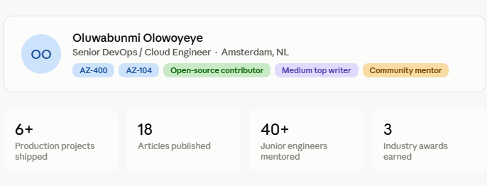
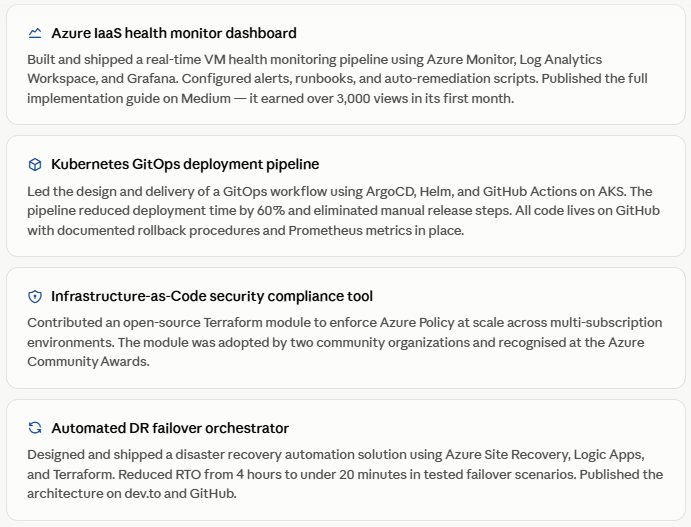
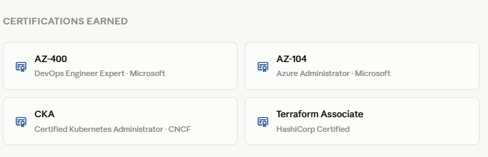

# Week 01 — Success Mindset (Mindset OS)

Part of the DevOps Micro Internship (DMI) Cohort 3 with Agentic AI

---

## Purpose (Read This First)

This week is not motivation homework.

This is you building your **Mindset OS** — the system you will use for the next 5 months (and honestly, for years).

### Expectations

* Be honest.
* Be specific.
* Be practical.
* Write like an adult professional: clear sentences, no one-liners.

You will reuse this in later weeks. So do it properly once.

---

# Assignment 1. What is something you believe to be true that most people around you would disagree with?

### Rules

* No "safe" answers.
* Must be your real belief (not copied from internet).
* Minimum 50 words.

**Hint:** What do you believe about career, money, learning, discipline, relationships, health, success, life, tech industry, etc. that most people don't agree with?

## Answer

### Comfort in Silence is the Longest Route to Stagnation

Most people mistake agreement for harmony and silence for wisdom. But I've come to believe that staying quiet when you see a pattern pulling you or your team away from meaningful goals isn't peace-keeping; it's slow self-sabotage.

Speaking up when something doesn't align with your purpose is not defiance or disruption. It's the most honest form of investment you can make in your own growth. The crowd moves by default; direction requires intention. And intention requires the courage to say, this isn't working, here's why.

Yes, you risk being seen as difficult. You risk the discomfort of standing in contrast to the majority. But the alternative drifting along a path that leads nowhere you actually want to go costs far more in the long run. Time wasted following the wrong direction at full speed is still time wasted.

The people around me often read speaking out as arrogance or impatience. I read it as self-respect. Growth doesn't come from fitting in; it comes from being honest enough with yourself and others, to say when something needs to change.

Silence is comfortable. Purpose is not. And I'll take purpose.

---

# Assignment 2. What are the top 3 objective truths you discovered through experimentation and results?

### Definition

Objective truths do not depend on opinions. They hold true regardless of how people feel.

Write each truth in this format:

**Truth:** (1 sentence)

**Evidence from my life:** (2–4 lines: what you tried + what happened)

---

## Truth #1

### Truth

Teaching others is the fastest path to mastery.

### Evidence from my life

Every time I've explained a concept to someone else, whether walking a colleague through a troubleshooting process or breaking down a technical idea, I noticed gaps in my own understanding I didn't know were there. 

The act of teaching forced precision, and that precision became competence. I don't just remember what I taught; I own it.

---

## Truth #2

### Truth

Genuinely celebrating other people's wins creates a current that flows back to you.

### Evidence from my life

I am genuinely happy for people. it's just who I am. When someone wins, no matter how small, I feel it with them. And because that joy is real, not performed, life has always given me my own reasons to celebrate. Opportunities have found me. Relationships have grown deeper. 

Cheering for others has never cost me anything, if anything, it keeps filling me back up.

---

## Truth #3

### Truth

Showing up consistently beats short bursts of hustle.

### Evidence from my life

There have been seasons where I pushed hard in short sprints, cramming, overworking, rushing to catch up and seasons where I showed up steadily, even imperfectly, day after day. The steady seasons always produced more.

The skills I built gradually through daily practice in my technical work outlasted the ones I forced overnight. Doing a little, regularly, always took me further than doing a lot, once.

---

# Assignment 3. What does your 2.0 version look like?

### Instructions

Write as if a journalist is writing about you **3 to 7 years from now** (not 20 years).

**Minimum 300 words.**

### Rules

* Write in past tense, like it already happened.
* Don't use "likes to / wants to / hopes to."
* Use specifics:

  * built
  * shipped
  * led
  * published
  * earned
  * relocated
  * contributed
* Include skills proof:

  * projects
  * portfolios
  * GitHub
  * blogs
  * certifications
  * job role
  * leadership
  * community contribution
* Add 1–3 images if you can (optional but powerful).

### Publish It Publicly On Any ONE

* LinkedIn
* Medium
* WordPress
* Blogspot
* Personal blog
* Portfolio page

Include this line:

> **P.S. This post is a part of DevOps Micro Internship with Agentic AI Cohort-3 by [Pravin Mishra](https://www.linkedin.com/in/pravin-mishra-aws-trainer/). You can start your DevOps journey by joining this [Discord community](https://discord.pravinmishra.com/) ( https://discord.pravinmishra.com/ ).**

## Your Article

### From support queue to production pipeline: how Oluwabunmi engineered her way into the cloud
She started by resolving tickets for Microsoft Azure customers. A few years later, she was the one shipping infrastructure that thousands of workloads depended on — with monitors, runbooks, and published write-ups to prove every step.

 

Oluwabunmi Olowoyeye did not wait for permission. When she was still working as a technical support engineer, troubleshooting IaaS issues for Microsoft customers and digging into Azure IaaS at odd hours, she had already started building. Not just reading documentation, not just watching tutorials, building, committing, and shipping.

By the time she transitioned fully into a DevOps engineering role, she had already proven the point most hiring managers want candidates to make she had done the work.

*“She didn’t just tell us what went wrong, she showed up to the next sprint with a working fix, a write-up, and an offer to walk the team through it.”*

*— Engineering lead, a fintech platform in Amsterdam*

That instinct, to document, to share, to make the path reusable became a throughline in Bunmi’s career. She published eighteen technical articles across Medium and dev.to covering Kubernetes disk management with KubeVirt, Git branch workflows for multi-environment deployments, and Azure infrastructure automation. Several were picked up by community newsletters. One became a pinned reference in a Microsoft Tech Community forum thread.

Her GitHub profile told the same story. Clean commit histories, descriptive READMEs, reproducible environment setups. Not a portfolio assembled for a job application, it’s an actual record of work done across real projects, over time.

The certifications mattered, but they were confirmations, not foundations. Oluwabunmi had already been doing the work that AZ-400 tested, designing CI/CD pipelines, writing deployment strategies, governing Azure environments at scale. The credential named what she had built.

Become a Medium member
She also became someone others leaned on. She volunteered as a mentor through the Women in Cloud programme and an Amsterdam-based DevOps community group, working with over forty junior engineers across two years. She did not give generic advice. She reviewed their GitHub repositories, asked about their monitoring setups, pushed them to write up what they had shipped.

In 2028, she co-organized a local DevOps meetup series that drew engineers from across the Netherlands. Three sessions, each centered on a live demo infrastructure automation, incident response, container security. No slides without working code.

She received the Azure Community Champion award in 2029, recognized for her open-source contributions and the reach of her published technical writing. She accepted it, posted a short note on LinkedIn thanking the engineers who had pushed back on her pull requests over the years, and went back to work.

*“To engineer reliable cloud solutions through automation.”*

*— How she still describes her career goal, in exactly those words*

That statement has not changed since she wrote it down years ago. What has changed is the evidence behind it: the production systems, the published articles, the mentees who shipped their own first projects, and the GitHub commit history that documents exactly how she got here.

https://github.com/Bummieboaxyl https://bummie.name.ng https://linkedn.com/Bummie

P.S. This post is a part of DevOps Micro Internship with Agentic AI Cohort-3 by Pravin Mishra. You can start your DevOps journey by joining this Discord community ( https://discord.pravinmishra.com/ ).

### Public Link

Paste your link here:

`https://medium.com/@bunmiolowoyeye20/from-support-queue-to-production-pipeline-how-oluwabunmi-engineered-her-way-into-the-cloud-3726bf46a342`

---

# Assignment 4. Have you ever cut corners (unethical / dishonest / shortcut behavior — not necessarily illegal)? If yes, how did it make you feel?

### Important

You don't need to write the full story.

Focus on the feeling:

* guilt
* fear
* shame
* stress
* regret
* numbness
* etc.

This is about self-awareness, not judgment.

### Answer Format

**Yes / No**

If Yes:

**What emotion did you feel?** (minimum 50–100 words)

## Answer

There was a moment I stepped outside of who I am  and I felt it immediately. Not loud guilt at first, just numbness. A hollow stillness where my values used to speak clearly.

Then the rest followed. Guilt that I no longer recognised myself. Shame, quiet and heavy. Stress that sat in the background of every moment. Regret for the person I had briefly become.

I am grateful to God it was quickly redressed. The weight didn't get to settle. But I never forgot how it felt because stepping outside of who you truly are, even briefly, is a feeling you don't easily shake. 

I don't belong in that web. And I never will again.

---

# Assignment 5. What are 10 non-fiction books you plan to read in the next 1 year?

### Rules

* Mention **Title + Author**
* Any language allowed
* No fiction novels

### Tip

Choose books that improve:

* mindset
* communication
* productivity
* health
* money
* career
* leadership

## Book List

1. Change your thinking, Change your life - Brain Tracy
2. Holy Spirit (Are we Flammable or Fireproof) - Reinhard Bonnke
3. When God Speaks - Gbile Akanni
4. The 5am Club - Robin Sharma
5. Add your answer here...
6. Add your answer here...
7. Add your answer here...
8. Add your answer here...
9. Add your answer here...
10. Add your answer here...

---

# Assignment 6. What are the things you will measure regularly in your life and career?

### Rules

List topics only. No need to share numbers.

### Must Include

* Learning / skill
* Output / proof
* Health / energy
* Time / focus
* Money / finance (personal or business)

### Example

* Learning hours per week
* Deep work sessions per week
* Projects shipped / documented
* Steps / workouts
* Sleep hours
* Spending tracker

## My Metrics

* Add your answer here...
* Add your answer here...
* Add your answer here...
* Add your answer here...
* Add your answer here...
* Add your answer here...
* Add your answer here...
* Add your answer here...
* Add your answer here...
* Add your answer here...

---

# Assignment 7. Brain Dump + 5-Month System Plan

## Step 1: Brain Dump (Private)

Do a brain dump of everything in your mind into a notebook.

Examples:

* Bills
* Tasks
* Worries
* Goals
* Pending messages
* Ideas
* Responsibilities

### Did You Do It?

**Yes / No**

Answer:

Add your answer here...

---

## Step 2: Your 5-Month Routine + Focus Blocks

Create a simple plan you can realistically follow for the next 5 months.

### Weekly Routine

Example:

* Mon–Thu: 60 min deep work
* Sat: DMI session
* Sun: Weekly review

#### My Weekly Routine

Add your answer here...

---

### Focus Blocks

#### When Will You Do DMI Work? (Days + Time)

Add your answer here...

#### How Many Sessions Per Week?

Add your answer here...

---

### Distraction Rules

Examples:

* Phone rules
* Social media rules
* Environment setup

#### My Distraction Rules

Add your answer here...

---

# Reflection – Week 1

### Biggest insight I got about myself this week

Add your answer here...

### My biggest weakness/loop I noticed

Add your answer here...

### One system I will implement from this week (exact habit + time)

Add your answer here...

### LinkedIn Post

Paste your LinkedIn post link here:

`__________________________`

---

## 10. Proof of Work

- LinkedIn Post URL: **ADD LINK HERE**  
- Blog / Medium : **ADD LINK HERE**  

---

## 📌 About DMI & CloudAdvisory

DevOps Micro Internship (DMI) is a project-based DevOps program run by Pravin Mishra (The CloudAdvisory) focused on real-world execution, systems thinking, and career readiness.

It helps learners build strong DevOps foundations with hands-on experience.

## 📌 Resources

- 🌐 **DMI Official Website:** https://pravinmishra.com/dmi  
- 🎓 **DevOps for Beginners (Udemy):** https://www.udemy.com/course/devops-for-beginners-docker-k8s-cloud-cicd-4-projects/  
- 🎓 **Ultimate Agentic AI DevOps with Clude Code** https://www.udemy.com/course/ultimate-agentic-ai-devops-with-claude-code/?referralCode=448389767BC96284087B
- 🎓 **DevOps with Claude Code: Terraform, EKS, ArgoCD & Helm** https://www.udemy.com/course/devops-with-claude-code-terraform-eks-argocd-helm/?referralCode=1C5B734505D65A010FA3
- ▶️ **YouTube Playlist (DMI Cohort 3):** https://www.youtube.com/playlist?list=PLFeSNDtI4Cho  
- 🔗 **Pravin Mishra (LinkedIn):** https://www.linkedin.com/in/pravin-mishra-aws-trainer/  
- 🏢 **CloudAdvisory (LinkedIn):** https://www.linkedin.com/company/thecloudadvisory/

---

*This submission is part of DevOps Micro Internship (DMI) Cohort 3 — Agentic AI Track*