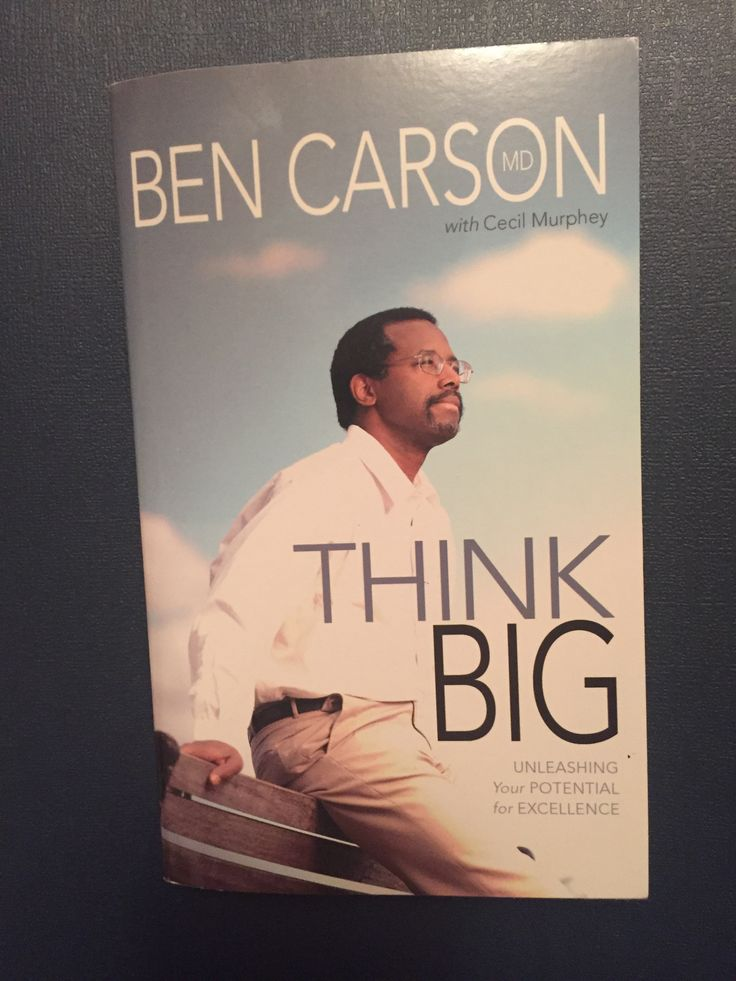
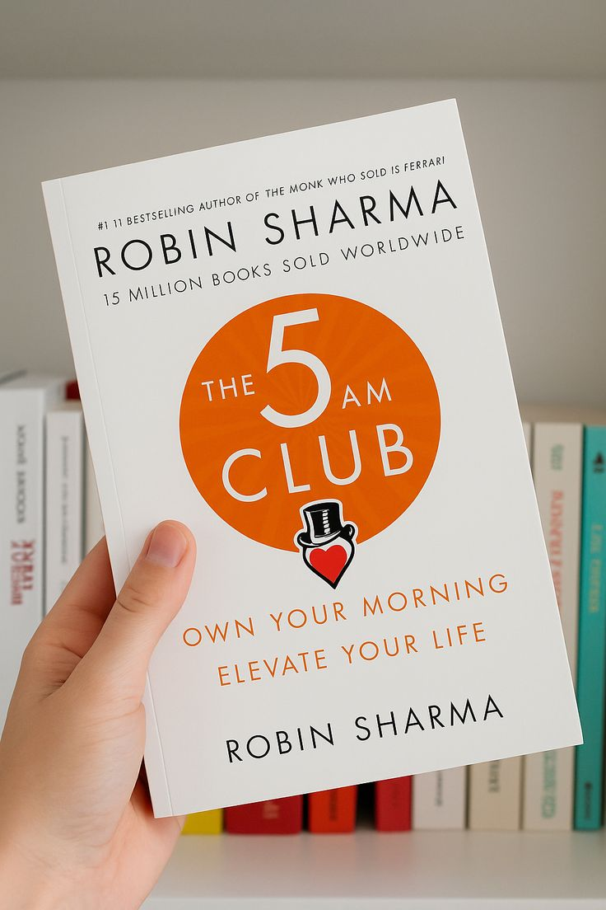
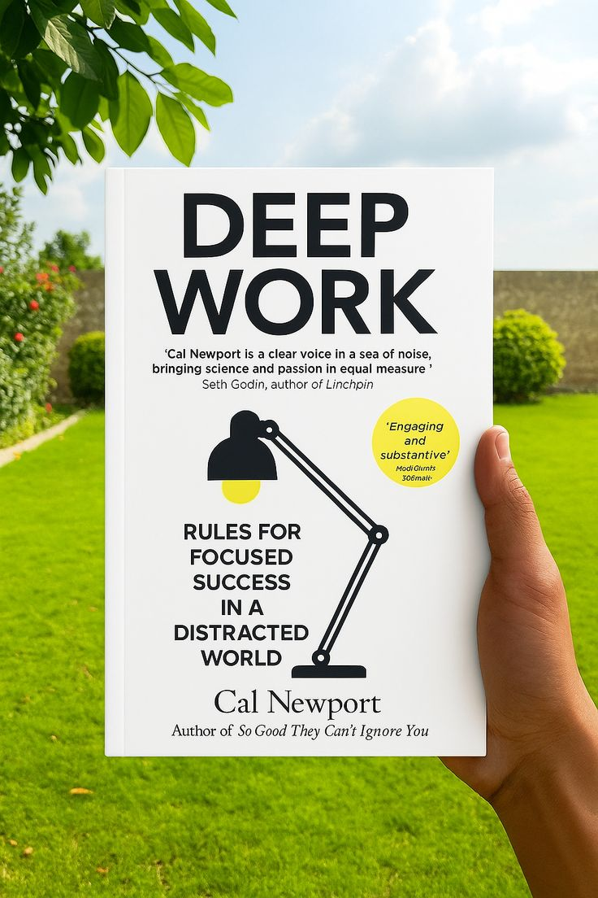
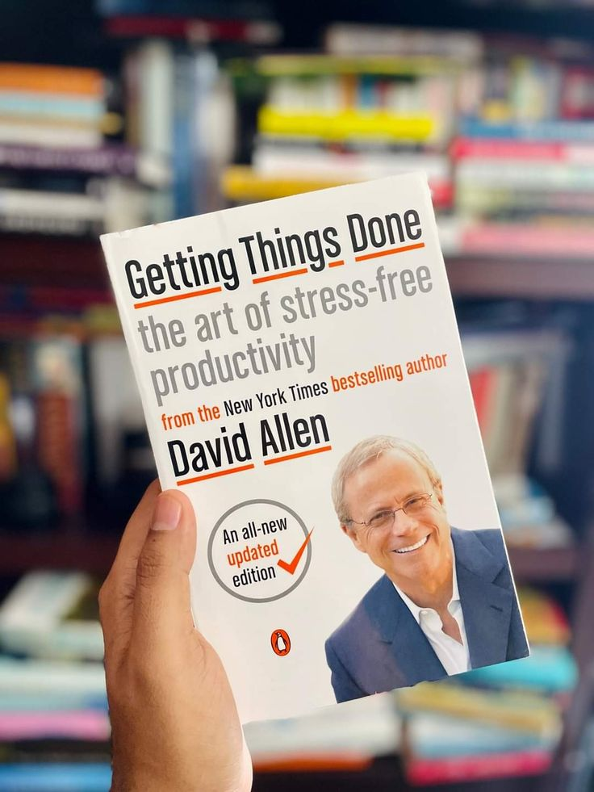
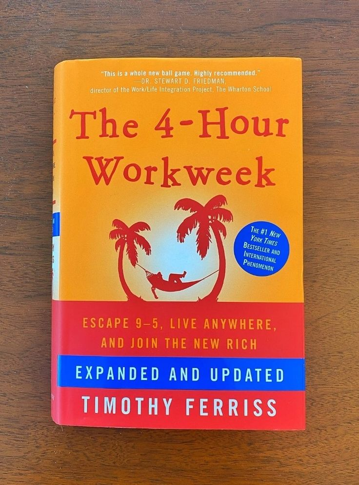
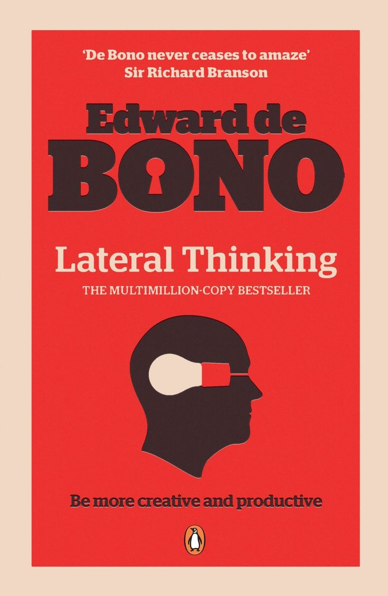
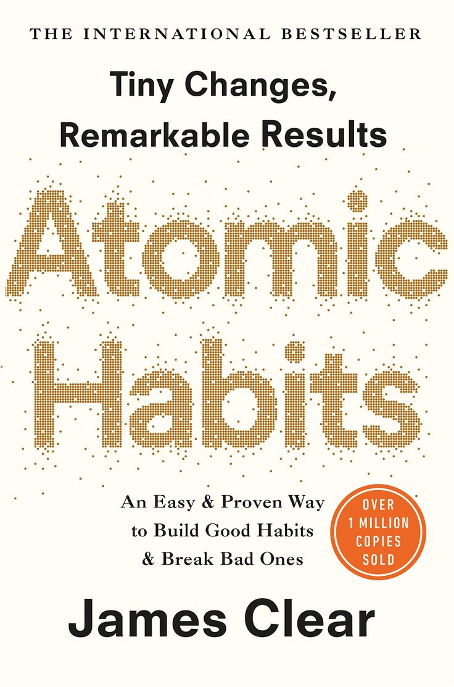

# Week 01 — Success Mindset (Mindset OS)

Part of the DevOps Micro Internship (DMI) Cohort 3 with Agentic AI

---

## Purpose (Read This First)

This week is not motivation homework.

This is you building your **Mindset OS** — the system you will use for the next 5 months (and honestly, for years).

### Expectations

* Be honest.
* Be specific.
* Be practical.
* Write like an adult professional: clear sentences, no one-liners.

You will reuse this in later weeks. So do it properly once.

---

# Assignment 1. What is something you believe to be true that most people around you would disagree with?

### Rules

* No "safe" answers.
* Must be your real belief (not copied from internet).
* Minimum 50 words.

**Hint:** What do you believe about career, money, learning, discipline, relationships, health, success, life, tech industry, etc. that most people don't agree with?

## Answer

I believe many people are judged too quickly for not having savings, especially when they don't have a steady source of income. In my view, it is difficult to build meaningful savings without consistent earnings. However, once you have a stable income, saving should become a priority. At the same time, I believe people should not neglect their health just to save every penny because good health is one of the greatest investments anyone can make.
I also believe relationships play a major role in determining how far you go in life. While many people think introverts can succeed entirely on their own, I believe those who achieve exceptional success usually have a strong network or circle of people who support, challenge, and create opportunities for them. 
Finally, I don't believe the tech industry is dying or that AI is replacing me. Instead, I see AI as a tool that will make me more productive and help me create greater value in my career.
---

# Assignment 2. What are the top 3 objective truths you discovered through experimentation and results?

### Definition

Objective truths do not depend on opinions. They hold true regardless of how people feel.

Write each truth in this format:

**Truth:** (1 sentence)

**Evidence from my life:** (2–4 lines: what you tried + what happened)

---

## Truth #1

### Truth

God answers sincere faith and dependence.

### Evidence from my life

After losing my dad five years ago, I had little support and relied on God through some of the hardest seasons of my life. Despite the challenges, I graduated from university, met the most amazing girl who has been my backbone and have continued to receive opportunities and exposure that I never imagined.

---

## Truth #2

### Truth

Consistent effort leads to measurable improvement.

### Evidence from my life

I come from a microbiology background, yet I decided to transition into DevOps. Through self-learning and consistent practice, I have built a solid foundation in the basics, comfortable on Linux terminal and git/github, proving to myself that steady effort produces real progress.

---

## Truth #3

### Truth

Meaningful success requires sacrifice and focused attention.

### Evidence from my life

I realized I cannot give my best to multiple major commitments simultaneously. Instead of taking a job while enrolled in the DMI Cohort 3 program, I chose to focus fully on developing my skills, sacrificing short-term income for a better long-term career.
---

# Assignment 3. What does your 2.0 version look like?

### Instructions

Write as if a journalist is writing about you **3 to 7 years from now** (not 20 years).

**Minimum 300 words.**

### Rules

* Write in past tense, like it already happened.
* Don't use "likes to / wants to / hopes to."
* Use specifics:

  * built
  * shipped
  * led
  * published
  * earned
  * relocated
  * contributed
* Include skills proof:

  * projects
  * portfolios
  * GitHub
  * blogs
  * certifications
  * job role
  * leadership
  * community contribution
* Add 1–3 images if you can (optional but powerful).

### Publish It Publicly On Any ONE

* LinkedIn
* Medium
* WordPress
* Blogspot
* Personal blog
* Portfolio page

Include this line:

> **P.S. This post is a part of DevOps Micro Internship with Agentic AI Cohort-3 by [Pravin Mishra](https://www.linkedin.com/in/pravin-mishra-aws-trainer/). You can start your DevOps journey by joining this [Discord community](https://discord.pravinmishra.com/) ( https://discord.pravinmishra.com/ ).**

## Your Article

**From Microbiology to Building Intelligent Cloud Systems: The Inspiring Journey of Ayomikun Philip Ajayi**

Seven years ago, Ayomikun P. Ajayi made a bold decision that changed the course of his life. After graduating with a degree in Microbiology, he chose not to settle for a career that no longer aligned with his vision. Instead, he enrolled in a DevOps Micro-internship Cohort 3 program run by Pravin Mishra, he committed himself to mastering Cloud Computing, DevOps Engineering, and Artificial Intelligence. What began as countless hours of self-learning, discipline, and consistency evolved into a remarkable career marked by technical excellence, leadership, and meaningful impact.

Today, Ayomikun has established himself as one of the leading DevOps, Cloud, and AI Engineers in Canada. After relocating, he earned globally recognized certifications, including AWS Solutions Architect Professional, AWS DevOps Engineer Professional, Certified Kubernetes Administrator (CKA), Terraform Associate, Microsoft Azure Administrator, and advanced AI and Machine Learning certifications. His expertise spans cloud architecture, Infrastructure as Code, Kubernetes, Docker, Linux, Python, CI/CD automation, observability, Generative AI, Large Language Models (LLMs), Retrieval-Augmented Generation (RAG), Model Context Protocol (MCP), and Agentic AI systems.

Throughout his career, Ayomikun designed and deployed resilient cloud platforms while integrating AI into enterprise workflows. He led engineering teams that built intelligent automation systems powered by Agentic AI, enabling businesses to automate complex decision-making, streamline operations, and reduce operational costs. His teams modernized legacy infrastructure, reduced deployment times from hours to minutes, and delivered secure, scalable systems that solved real business problems across finance, healthcare, logistics, and technology.

His technical portfolio became a showcase of innovation. His GitHub repositories featured production-ready DevOps projects, Kubernetes deployments, Terraform modules, AI-powered automation tools, intelligent CI/CD pipelines, and Agentic AI applications that orchestrate multi-step workflows with minimal human intervention. His personal portfolio documented real-world cloud transformation projects, while his technical blog and YouTube content educated thousands of engineers on DevOps, Cloud Computing, Generative AI, and AI agents.

Beyond his professional achievements, Ayomikun became a respected voice in the global technology community. He spoke at international cloud and AI conferences, contributed to open-source DevOps and AI projects, mentored aspiring engineers, and published practical guides that helped professionals transition into Cloud Engineering and Artificial Intelligence. His contributions influenced how organizations adopted AI responsibly and effectively.

His entrepreneurial journey reached another milestone when he founded an AI-first cloud technology startup that specialized in DevOps automation, enterprise AI solutions, and intelligent cloud platforms. The company helped organizations deploy Agentic AI systems, modernize infrastructure, optimize cloud spending, and build scalable products faster. Under his leadership, the startup became recognized as one of the most innovative AI and cloud solution providers serving clients across North America and Africa.

Success was not limited to his career. Ayomikun married Abigael, an accomplished Data Scientist whose expertise in data, machine learning, and analytics complemented his strengths in cloud engineering and AI systems. Together, they built a home grounded in faith, discipline, and purpose while raising three wonderful children. They supported each other’s careers, collaborated on innovative AI initiatives, and demonstrated that a strong partnership can thrive alongside demanding careers in technology.

Looking back, his journey was never defined by luck. It was built on accountability, continuous learning, consistency, sacrifice, and faith. The young graduate who once questioned whether transitioning from Microbiology into technology was possible became an internationally recognized DevOps Engineer, Cloud Architect, AI expert, entrepreneur, and technology leader. Through his work in cloud computing, Agentic AI, and intelligent automation, he helped shape the future of how businesses build, deploy, and scale software, leaving a lasting impact on the global technology ecosystem.

P.S. This post is a part of DevOps Micro Internship with Agentic AI Cohort-3 by Pravin Mishra. You can start your DevOps journey by joining this Discord community (https://discord.pravinmishra.com/).

### Public Link

Paste your link here:

`https://medium.com/@ayomikunajayi98/from-microbiology-to-building-intelligent-cloud-systems-the-inspiring-journey-of-ayomikun-philip-9c6bf52af857`

---

# Assignment 4. Have you ever cut corners (unethical / dishonest / shortcut behavior — not necessarily illegal)? If yes, how did it make you feel?

### Important

You don't need to write the full story.

Focus on the feeling:

* guilt
* fear
* shame
* stress
* regret
* numbness
* etc.

This is about self-awareness, not judgment.

### Answer Format

**Yes / No**

If Yes:

**What emotion did you feel?** (minimum 50–100 words)

## Answer

Yes.

I felt guilty, disappointed, and ashamed of myself. Instead of feeling accomplished, I felt like I had cheated myself out of the opportunity to grow. It made me question my abilities and left me feeling as though I was not intelligent enough to earn success through hard work. That experience taught me that shortcuts may produce temporary results, but they also create self-doubt and rob you of the confidence that comes from knowing you genuinely earned your achievements. Since then, I have chosen to value learning and integrity over quick wins.
---

# Assignment 5. What are 10 non-fiction books you plan to read in the next 1 year?

### Rules

* Mention **Title + Author**
* Any language allowed
* No fiction novels

### Tip

Choose books that improve:

* mindset
* communication
* productivity
* health
* money
* career
* leadership

## Book List

1. THINK BIG by Ben Carson with Cecil Murphey

2. FOLLOWING GOD'S PLAN FOR YOUR LIFE by Kenneth E. Hagan

3. THE PSYCHOLOGY OF MONEY by Morgan Housel

4. RICH DAD POOR DAD by Robert T. Kiyosaki

5. THE 5AM CLUB by Robin Sharma

6. DEEP WORK by Cal Newport

7. GETTING THINGS DONE(the art of stress-free productivity) by David Allen

8. THE 4-HOUR WORK WEEK by Timothy Ferriss

9. LATERAL THINKING by Edward De Bono

10. ATOMIC HABITS by James Clear

---

# Assignment 6. What are the things you will measure regularly in your life and career?

### Rules

List topics only. No need to share numbers.

### Must Include

* Learning / skill
* Output / proof
* Health / energy
* Time / focus
* Money / finance (personal or business)

### Example

* Learning hours per week
* Deep work sessions per week
* Projects shipped / documented
* Steps / workouts
* Sleep hours
* Spending tracker

## My Metrics

* My personal relationship with God and spiritual growth
* New technical skills learned and practiced each week
* Personal projects completed and documented
* Progress toward achieving my Computer Science degree
* Time spent learning DevOps, Cloud Computing, and AI
* Quality of my focus and time management
* Personal finances, savings, and spending habits
* Physical health, sleep, exercise, and overall energy
* Quality of my relationships and professional network
* Consistency in achieving my weekly goals and personal commitments

---

# Assignment 7. Brain Dump + 5-Month System Plan

## Step 1: Brain Dump (Private)

Do a brain dump of everything in your mind into a notebook.

Examples:

* Bills
* Tasks
* Worries
* Goals
* Pending messages
* Ideas
* Responsibilities

### Did You Do It?

**Yes / No**

Answer:

Yes

---

## Step 2: Your 5-Month Routine + Focus Blocks

Create a simple plan you can realistically follow for the next 5 months.

### Weekly Routine

Example:

* Mon–Thu: 60 min deep work
* Sat: DMI session
* Sun: Weekly review

#### My Weekly Routine

* **Sunday**
8:00 AM – 1:00 PM: Church service and fellowship.
1:00 PM – 5:00 PM: Rest, spend time with family and friends, and prepare mentally for the new week.
6:00 PM – 9:00 PM: Complete pending assignments, review the previous week's learning, and plan goals for the coming week.
* **Monday – Wednesday**
9 hours: Work.
30 minutes: Personal devotion, prayer, and Bible study.
3 hours: Deep learning and practice in DevOps, Cloud Computing, and AI.
Watch DMI live demo recordings whenever I need clarification.
Build or improve a small personal project to reinforce what I learned instead of only watching tutorials.
Spend 20–30 minutes reviewing my Computer Science coursework when necessary.
* **Thursday**
9 hours: Work.
Complete the week's DMI assignment.
Write and schedule my LinkedIn post and technical blog post documenting what I learned.
Push my weekly project updates to GitHub.
* **Friday**
9 hours: Work.
Submit my assignment before the deadline.
Revise everything covered during the week.
Identify areas where I struggled and prepare questions for Saturday's session if needed.
* **Saturday**
5:30 AM – 1:30 PM: Attend DMI live sessions with full concentration. Exercise and eat during the breaks.
1:30 PM – 4:30 PM: Rest, eat, and recharge.
4:30 PM – 7:30 PM: Rewatch important sections of the recorded session, practice the concepts, and improve my personal project based on what I learned.
Update my notes and create a simple summary for future reference.

---

### Focus Blocks

#### When Will You Do DMI Work? (Days + Time)

Monday to Saturday (20–22 focused hours weekly, excluding the live session).
#### How Many Sessions Per Week?

I will literally commit part of every single day to DMI work. At least a session every day.

---

### Distraction Rules

Examples:

* Phone rules
* Social media rules
* Environment setup

#### My Distraction Rules

## Distraction Rules

* **Phone:** Keep my phone on **Do Not Disturb (DND)** and out of reach during work and study sessions.
* **Social Media:** Use social media only for learning, networking, or publishing content.
* **Entertainment:** Reserve movies, gaming, and other high-dopamine activities for scheduled rest periods.
* **Environment:** Study in a clean, quiet, and distraction-free workspace.
* **Single-Tasking:** Focus on one task at a time until it is completed.
* **Notifications:** Turn off unnecessary notifications on all devices.
* **Breaks:** Take short, planned breaks instead of random interruptions.
* **Accountability:** Review my daily goals at the start of each day and track whether I completed them.
* **Sleep:** Maintain a consistent sleep schedule to stay mentally sharp and productive.
* **Discipline:** Prioritize long-term goals over temporary comfort or distractions.
---

# Reflection – Week 1

### Biggest insight I got about myself this week

I realized that having a successful mindset is not just about believing I can succeed. It is about intentionally building daily habits, staying disciplined, and consistently doing the work that moves me closer to my goals. Success is the result of repeated actions, not positive thinking alone.
### My biggest weakness/loop I noticed

My biggest weakness is managing my finances consistently. I realized that I need to become more intentional about budgeting, saving, and spending wisely so that my financial habits align with my long-term goals.
### One system I will implement from this week (exact habit + time)

Every Sunday from 6:00 PM to 7:00 PM, I will create a detailed plan for the coming week. I will schedule my work hours, DMI study sessions, project time, prayer and devotion, exercise, and rest. At the end of each day, I will spend 10 minutes before bed reviewing what I completed and preparing my priorities for the next day.
### LinkedIn Post

Paste your LinkedIn post link here:

`https://www.linkedin.com/posts/ayomikunphilip_im-excited-to-share-that-i-began-the-devops-ugcPost-7477203295124676608-hG-R/?utm_source=social_share_send&utm_medium=member_desktop_web&rcm=ACoAAF4cLMMBGj_ND3_b5bGU28ywvq8aZAW62fs`
---

## 10. Proof of Work

- LinkedIn Post URL: **https://www.linkedin.com/posts/ayomikunphilip_im-excited-to-share-that-i-began-the-devops-ugcPost-7477203295124676608-hG-R/?utm_source=social_share_send&utm_medium=member_desktop_web&rcm=ACoAAF4cLMMBGj_ND3_b5bGU28ywvq8aZAW62fs**  
- Blog / Medium : **https://medium.com/@ayomikunajayi98/from-microbiology-to-building-intelligent-cloud-systems-the-inspiring-journey-of-ayomikun-philip-9c6bf52af857?sharedUserId=ayomikunajayi98**  

---

## 📌 About DMI & CloudAdvisory

DevOps Micro Internship (DMI) is a project-based DevOps program run by Pravin Mishra (The CloudAdvisory) focused on real-world execution, systems thinking, and career readiness.

It helps learners build strong DevOps foundations with hands-on experience.

## 📌 Resources

- 🌐 **DMI Official Website:** https://pravinmishra.com/dmi  
- 🎓 **DevOps for Beginners (Udemy):** https://www.udemy.com/course/devops-for-beginners-docker-k8s-cloud-cicd-4-projects/  
- 🎓 **Ultimate Agentic AI DevOps with Clude Code** https://www.udemy.com/course/ultimate-agentic-ai-devops-with-claude-code/?referralCode=448389767BC96284087B
- 🎓 **DevOps with Claude Code: Terraform, EKS, ArgoCD & Helm** https://www.udemy.com/course/devops-with-claude-code-terraform-eks-argocd-helm/?referralCode=1C5B734505D65A010FA3
- ▶️ **YouTube Playlist (DMI Cohort 3):** https://www.youtube.com/playlist?list=PLFeSNDtI4Cho  
- 🔗 **Pravin Mishra (LinkedIn):** https://www.linkedin.com/in/pravin-mishra-aws-trainer/  
- 🏢 **CloudAdvisory (LinkedIn):** https://www.linkedin.com/company/thecloudadvisory/

---

*This submission is part of DevOps Micro Internship (DMI) Cohort 3 — Agentic AI Track*