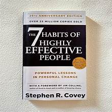
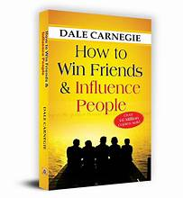
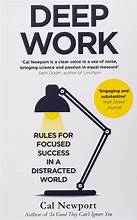
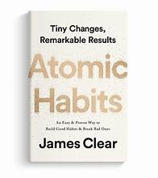
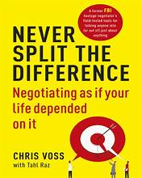
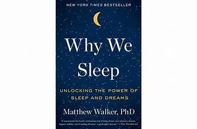
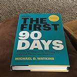
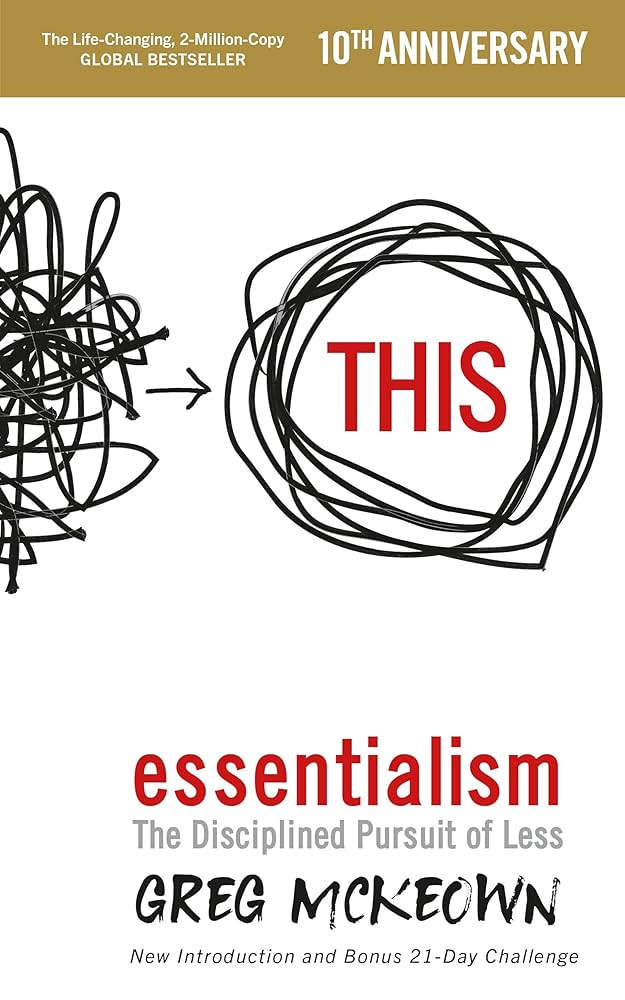
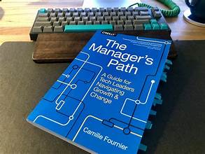

# Week 01 — Success Mindset (Mindset OS)

Part of the DevOps Micro Internship (DMI) Cohort 3 with Agentic AI

---

## Purpose (Read This First)

This week is not motivation homework.

This is you building your **Mindset OS** — the system you will use for the next 5 months (and honestly, for years).

### Expectations

* Be honest.
* Be specific.
* Be practical.
* Write like an adult professional: clear sentences, no one-liners.

You will reuse this in later weeks. So do it properly once.

---

# Assignment 1. What is something you believe to be true that most people around you would disagree with?

### Rules

* No "safe" answers.
* Must be your real belief (not copied from internet).
* Minimum 50 words.

**Hint:** What do you believe about career, money, learning, discipline, relationships, health, success, life, tech industry, etc. that most people don't agree with?

## Answer

Many people around me think the more certifications you earn, the better your career prospects. I disagree. Certifications can help you get noticed, but they don't prove that you can solve real problems. Employers and clients ultimately care about what you have built, improved, or delivered. Someone with fewer certificates but a strong portfolio of practical work often has an advantage over someone with many credentials but little hands-on experience. That is why I focus on applying what I learn through projects, documenting my work, and continuously improving my practical skills rather than chasing every new certification.

---

# Assignment 2. What are the top 3 objective truths you discovered through experimentation and results?

### Definition

Objective truths do not depend on opinions. They hold true regardless of how people feel.

Write each truth in this format:

**Truth:** (1 sentence)

**Evidence from my life:** (2–4 lines: what you tried + what happened)

---

## Truth #1 

### Truth

Consistent practical experience creates more career opportunities than passive learning.

### Evidence from my life

I completed several courses and certifications, but interviews became much easier only after I started building cloud, networking, and automation projects. Demonstrating real implementations gave me more confidence and helped employers see my practical skills.

---

## Truth #2

### Truth

Persistence eventually produces results, even after repeated setbacks.

### Evidence from my life

I experienced job loss, financial challenges, and many unsuccessful applications. Instead of giving up, I kept improving my skills, applying for roles, and preparing for interviews, which opened new opportunities that would not have existed if I had stopped.

---

## Truth #3

### Truth

Continuous learning is one of the best long-term investments.

### Evidence from my life

I expanded my knowledge from networking into cloud computing, cybersecurity, and DevOps. This broader skill set qualified me for more diverse roles and increased my ability to solve complex infrastructure and security problems.

---

# Assignment 3. What does your 2.0 version look like?

### Instructions

Write as if a journalist is writing about you **3 to 7 years from now** (not 20 years).

**Minimum 300 words.**

### Rules

* Write in past tense, like it already happened.
* Don't use "likes to / wants to / hopes to."
* Use specifics:

  * built
  * shipped
  * led
  * published
  * earned
  * relocated
  * contributed
* Include skills proof:

  * projects
  * portfolios
  * GitHub
  * blogs
  * certifications
  * job role
  * leadership
  * community contribution
* Add 1–3 images if you can (optional but powerful).

### Publish It Publicly On Any ONE

* LinkedIn
* Medium
* WordPress
* Blogspot
* Personal blog
* Portfolio page

Include this line:

> **P.S. This post is a part of DevOps Micro Internship with Agentic AI Cohort-3 by [Pravin Mishra](https://www.linkedin.com/in/pravin-mishra-aws-trainer/). You can start your DevOps journey by joining this [Discord community](https://discord.pravinmishra.com/) ( https://discord.pravinmishra.com/ ).**

## Your Article

Three years ago, Timothy Olubiyi set out to rebuild his career.
Today, he stands as one of Nigeria's emerging voices in cloud infrastructure and cybersecurity — not because the road was smooth, but because he stayed consistent through days and nights building his career.

Here's what that consistency built:
🔹 Technical delivery: He designed secure cloud environments, automated deployments with Infrastructure as Code, and shipped DevOps and cloud security projects with measurable gains in speed, reliability, and security. His portfolio wasn't a set of demos — it was a reference employers, students, and communities actually used, because every project solved a real infrastructure or security problem.
🔹 Infrastructure leadership: He led modernization efforts that moved business workloads to the cloud — improving availability, cutting costs, and tightening security controls. His range across networking, cloud computing, DevSecOps, and cybersecurity lets him bridge traditional infrastructure with cloud-native practice.
🔹 Community impact: He ran workshops, mentored junior engineers, and published implementation-first guides on networking, cloud architecture, automation, and cybersecurity — the kind of content that gets shared because it teaches, not just talks.
🔹 Global reach: That growth opened international doors — an advanced engineering role working with global teams on secure, scalable, resilient cloud platforms. He finds delight in mentoring Nigerian professionals, contributing to open source, and running virtual trainings.

The most remarkable part of Timothy's story isn't the certifications or the titles.
It's how consistently he turned setbacks into fuel — every challenge sharpening his technical skill, his leadership, and his character. His career is proof that discipline and execution can reshape a future in just a few years.

Today, Timothy isn't only a respected Cloud and DevSecOps Engineer. He's a mentor, a project leader, and a contributor to the wider tech ecosystem.

This post is part of the DevOps Micro Internship with Agentic AI, Cohort 3, by #PravinMishra (https://lnkd.in/eg-CVMe8).
Start your own DevOps journey — join the community: https://lnkd.in/eFsbcwnr

#DevOps #CloudComputing #CyberSecurity #AWS #CareerGrowth #Mentorship

### Public Link

[Assignment-3](https://medium.com/@timothyolubiyi/the-making-of-a-cloud-devsecops-engineer-a-3-year-journey-c5e84230e8f3)

[Assignment-3](https://www.linkedin.com/posts/timothy-olubiyi-05b9ba123_pravinmishra-devops-cloudcomputing-share-7478792094447382528-yDzR/?utm_source=share&utm_medium=member_desktop&rcm=ACoAAB6VGscB2AplIT7PcrwZvA0ECup4mNaUoIw)

`Add your URL here`

---

# Assignment 4. Have you ever cut corners (unethical / dishonest / shortcut behavior — not necessarily illegal)? If yes, how did it make you feel?

### Important

You don't need to write the full story.

Focus on the feeling:

* guilt
* fear
* shame
* stress
* regret
* numbness
* etc.

This is about self-awareness, not judgment.

### Answer Format

**Yes / No**

If Yes:

**What emotion did you feel?** (minimum 50–100 words)

## Answer

No

---

# Assignment 5. What are 10 non-fiction books you plan to read in the next 1 year?

### Rules

* Mention **Title + Author**
* Any language allowed
* No fiction novels

### Tip

Choose books that improve:

* mindset
* communication
* productivity
* health
* money
* career
* leadership

## Book List

1. The 7 Habits of Highly Effective People — Stephen R. Covey (Leadership & Personal Effectiveness)
# 
2. How to Win Friends and Influence People — Dale Carnegie (Communication & Relationships)
# 
3. Deep Work — Cal Newport (Focus & Productivity)
# 
4. Atomic Habits — James Clear (Mindset & Productivity)
# 
5. Never Split the Difference — Chris Voss (Negotiation & Communication)
# 
6. Why We Sleep — Matthew Walker (Health & Performance)
# 
7. The First 90 Days — Michael D. Watkins (Career & Leadership)
# 
8. The Psychology of Money — Morgan Housel (Money & Wealth Building)
# 
9. Essentialism — Greg McKeown (Mindset & Productivity)
# 
10. The Manager's Path — Camille Fournier

---

# Assignment 6. What are the things you will measure regularly in your life and career?

### Rules

List topics only. No need to share numbers.

### Must Include

* Learning / skill
* Output / proof
* Health / energy
* Time / focus
* Money / finance (personal or business)

### Example

* Learning hours per week
* Deep work sessions per week
* Projects shipped / documented
* Steps / workouts
* Sleep hours
* Spending tracker

## My Metrics

* Hands-on lab sessions
* Learning hours per week and new skills acquired
* Projects completed with documentation published
* Sleep hours, Daily steps, Energy level, Stress level
* Time spent on high-priority tasks
* Distraction-free hours, goals achieved
* Job applications submitted and interviews attended
* Leadership responsibilities taken, and Mentoring
* Performance feedback received
* Family and relationship quality time

---

# Assignment 7. Brain Dump + 5-Month System Plan

## Step 1: Brain Dump (Private)

Do a brain dump of everything in your mind into a notebook.

Examples:

* Bills
* Tasks
* Worries
* Goals
* Pending messages
* Ideas
* Responsibilities

### Did You Do It?

**Yes / No**

Answer:

Yes

---

## Step 2: Your 5-Month Routine + Focus Blocks

Create a simple plan you can realistically follow for the next 5 months.

### Weekly Routine

Example:

* Mon–Thu: 60 min deep work
* Sat: DMI session
* Sun: Weekly review

#### My Weekly Routine

Monday–Thursday

- 60–90 min deep work (learning or project building)
- 30 min certification study or reading
- 20–30 min exercise or walk

Friday

- Review completed work
- Update GitHub, portfolio, or LinkedIn
- Apply for 2–5 relevant jobs
- Network with one industry professional

Saturday

- Attend DMI session or complete a hands-on lab
- Build or improve one cloud/DevOps/cybersecurity project
- Read 30–60 minutes from a non-fiction book

Sunday

- Weekly review and planning
- Organize notes and documentation
- Prepare goals for the coming week
- Spend quality time with family and rest

---

### Focus Blocks

#### When Will You Do DMI Work? (Days + Time)

Monday - Friday (7:00PM WAT - 9:00PM WAT)

#### How Many Sessions Per Week?

3 Sessions Per Week
---

### Distraction Rules

Examples:

* Phone rules
* Social media rules
* Environment setup

#### My Distraction Rules

Phone Rules:
- Keep the phone on Do Not Disturb during deep work sessions.
- Place the phone out of reach while studying or working.
- Check messages only during scheduled breaks.

Social Media Rules:
- Use social media only after completing daily priorities.
- Limit social media to 20–30 minutes per day.
- Use social media intentionally for networking and learning, not mindless browsing.

Environment Setup:
- Keep your workspace clean and organized.
- Close unnecessary browser tabs and applications.
- Have a dedicated area for work and study whenever possible.
- Keep a bottle of water and notebook nearby.

---

# Reflection – Week 1

### Biggest insight I got about myself this week

**Biggest Insight I Got About Myself This Week**

This week, I realized that consistency matters more than motivation. I perform at my best when I follow a clear routine and focus on one important task at a time instead of trying to do everything at once. Every small step—whether learning a new skill, building a project, reading, or applying for opportunities—moves me closer to my long-term goals.

I also recognized that my greatest strength is my willingness to keep learning and adapting. Challenges don't stop my progress; they push me to improve. Going forward, I will focus on building momentum through daily discipline, protecting my time from distractions, and creating tangible proof of my growth through projects, certifications, and continuous learning.

### My biggest weakness/loop I noticed

One pattern I noticed is that I sometimes spend too much time planning, researching, or preparing instead of taking action. I can get caught in a cycle of wanting everything to be perfect before I start, which slows my progress.

I also noticed that distractions, especially from my phone and social media, can interrupt my focus and make it harder to complete deep work. When this happens, I end the day feeling busy but without enough meaningful results.

Going forward, I will focus on taking consistent action, even when things are not perfect. I will prioritize completing important tasks over refining them endlessly, protect my deep work time, and measure success by the projects I finish, the skills I build, and the progress I make each week.

### One system I will implement from this week (exact habit + time)

Habit: Complete one 90-minute deep work session focused on my highest-priority task (cloud, DevOps, cybersecurity learning, project work, or job preparation) before checking social media.

Time: Monday–Friday, 7:00 PM – 9:00 PM WAT

### LinkedIn Post

https://www.linkedin.com/posts/timothy-olubiyi-05b9ba123_pravinmishra-devops-cloudcomputing-share-7478792094447382528-yDzR/?utm_source=share&utm_medium=member_desktop&rcm=ACoAAB6VGscB2AplIT7PcrwZvA0ECup4mNaUoIw

`Add your URL here`

---

## 10. Proof of Work

- LinkedIn Post URL: **ADD LINK HERE**  
- Blog / Medium : **[week-01](https://medium.com/@timothyolubiyi/what-does-my-2-0-version-look-like-ed099108850d)**  

---

## 📌 About DMI & CloudAdvisory

DevOps Micro Internship (DMI) is a project-based DevOps program run by Pravin Mishra (The CloudAdvisory) focused on real-world execution, systems thinking, and career readiness.

It helps learners build strong DevOps foundations with hands-on experience.

## 📌 Resources

- 🌐 **DMI Official Website:** https://pravinmishra.com/dmi  
- 🎓 **DevOps for Beginners (Udemy):** https://www.udemy.com/course/devops-for-beginners-docker-k8s-cloud-cicd-4-projects/  
- 🎓 **Ultimate Agentic AI DevOps with Clude Code** https://www.udemy.com/course/ultimate-agentic-ai-devops-with-claude-code/?referralCode=448389767BC96284087B
- 🎓 **DevOps with Claude Code: Terraform, EKS, ArgoCD & Helm** https://www.udemy.com/course/devops-with-claude-code-terraform-eks-argocd-helm/?referralCode=1C5B734505D65A010FA3
- ▶️ **YouTube Playlist (DMI Cohort 3):** https://www.youtube.com/playlist?list=PLFeSNDtI4Cho  
- 🔗 **Pravin Mishra (LinkedIn):** https://www.linkedin.com/in/pravin-mishra-aws-trainer/  
- 🏢 **CloudAdvisory (LinkedIn):** https://www.linkedin.com/company/thecloudadvisory/

---

*This submission is part of DevOps Micro Internship (DMI) Cohort 3 — Agentic AI Track*