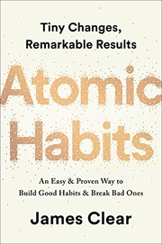
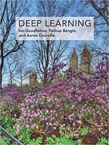
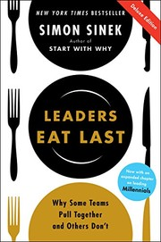
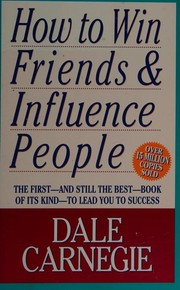
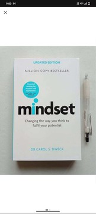
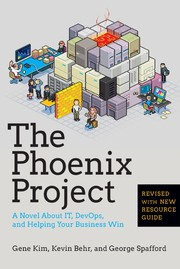

# Week 01 — Success Mindset (Mindset OS)

Part of the DevOps Micro Internship (DMI) Cohort 3 with Agentic AI

---

## Purpose (Read This First)

This week is not motivation homework.

This is you building your **Mindset OS** — the system you will use for the next 5 months (and honestly, for years).

### Expectations

* Be honest.
* Be specific.
* Be practical.
* Write like an adult professional: clear sentences, no one-liners.

You will reuse this in later weeks. So do it properly once.

---

# Assignment 1. What is something you believe to be true that most people around you would disagree with?

### Rules

* No "safe" answers.
* Must be your real belief (not copied from internet).
* Minimum 50 words.

**Hint:** What do you believe about career, money, learning, discipline, relationships, health, success, life, tech industry, etc. that most people don't agree with?

## Answer
I firmly believe that true success is not measured by the relentless accumulation of wealth, social status, or participation in the modern "hustle culture," but rather by the preservation of one's moral character and inner spiritual peace.
Most people around me would strongly disagree with this. Society today equates constant busyness, material growth, and aggressive ambition with human worth. They believe that if you are not relentlessly chasing the next big career milestone or financial target, you are falling behind in life.

# Assignment 2. What are the top 3 objective truths you discovered through experimentation and results?

### Definition

Objective truths do not depend on opinions. They hold true regardless of how people feel.

## Truth #1

### Truth

Objective truths do not depend on opinions. They hold true regardless of how people feel.

### Evidence from my life

I experimented by dedicating two focused hours every single day to learning a new skill, compared to my previous habit of pulling 14-hour daily habits sessions right before a deadline. The daily two-hour approach resulted in zero burnout, much higher quality output, and a deeper understanding of the subject.

---

## Truth #2

### Truth

Detaching from the need for external validation and working in complete silence significantly reduces anxiety and increases the actual quality of the final outcome.

### Evidence from my life

I recently achieved a significant personal goal without telling anyone or sharing any updates, whereas previously I would share every milestone for praise. The silent approach eliminated the stress of others' opinions, allowed for deeper focus, and resulted in a far superior final outcome.

---

## Truth #3

### Truth

Offering genuine help without any expectation of return builds deeper trust and yields more unexpected long-term benefits than purely transactional relationships.

### Evidence from my life

I helped someone overcome a difficult challenge purely with the intention of doing good, expecting absolutely nothing in return, unlike past instances where I only helped to get a favor. This unconditional approach created a deeply loyal bond, while my past transactional interactions faded once the utility ended.

---

# Assignment 3. What does your 2.0 version look like?

### Instructions

Write as if a journalist is writing about you **3 to 7 years from now** (not 20 years).

**Minimum 300 words.**

By Muhammad Awais:
Five years ago, he was a young professional with a vision that blended cutting-edge technology with unwavering faith. Today, he stands as one of Pakistan's most respected AI specialists, having built and shipped multiple agentic AI systems that transformed how businesses automate complex workflows.
He earned his reputation not through flashy titles, but through relentless execution. He led a team of engineers at a leading tech firm, where he architected DevOps pipelines integrated with agentic AI, reducing deployment times by 70%. His GitHub portfolio, filled with open-source contributions on AI/ML frameworks, became a go-to resource for developers across South Asia.
But his most ambitious project was deeply personal. He built an education platform that provided free, high-quality technical courses to underprivileged students in rural Pakistan. The platform shipped over 500 hours of content, reaching more than 10,000 learners. He published weekly technical blogs on his platform, breaking down complex AI concepts into digestible insights, earning him a loyal following of over 25,000 readers.
His commitment to community extended beyond code. He contributed to a local Islamic organization, where he led digital literacy programs for youth, teaching them how to use technology ethically and responsibly. He mentored over 200 students, many of whom went on to secure positions at top tech companies.
In a deeply spiritual milestone, he performed Hajj with his parents, a moment he described as the pinnacle of his life's journey. He chose to remain in Pakistan, living with his family, rejecting lucrative offers to relocate abroad. His decision was rooted in his belief that true success was measured not by geography, but by the impact one left on their community and the strength of their family bonds.
Today, he is recognized not just as an AI expert, but as a leader who proved that faith, family, and innovation could coexist harmoniously. His story became a testament to the power of purpose-driven work.

### Rules

* Write in past tense, like it already happened.
* Don't use "likes to / wants to / hopes to."
* Use specifics:

  * built
  * shipped
  * led
  * published
  * earned
  * relocated
  * contributed
* Include skills proof:

  * projects
  * portfolios
  * GitHub
  * blogs
  * certifications
  * job role
  * leadership
  * community contribution
* Add 1–3 images if you can (optional but powerful).

### Publish It Publicly On Any ONE

* Medium

Use the credit note that matches your track:

Add the following credit note at the end of your post **(If you are DMI Cohort 3 student)**:

> **P.S. This post is part of the DevOps Micro Internship (DMI) with Agentic AI — Cohort 3 — by [Pravin Mishra](https://www.linkedin.com/in/pravin-mishra-aws-trainer/). My graded progress is public: https://dmi.pravinmishra.com/s/YOUR-GITHUB-USERNAME.html · Start your DevOps journey: https://dmi.pravinmishra.com/?utm_source=student&utm_medium=ps-blog&utm_campaign=cohort3**

**Tag [Pravin Mishra](https://www.linkedin.com/in/pravin-mishra-aws-trainer/) in your LinkedIn post, then tag Lead Co-Mentor — [Anjana Muthunayake](https://www.linkedin.com/in/anjana-muthunayake/).**

Add the following credit note at the end of your post **(If you are DMI Self-paced track student)**:

> **P.S. This post is part of the DevOps Micro Internship (DMI) — Self-Paced Engineer Track — by [Muhammad Awais](). My graded progress is public: (https://github.com/Student61233/devops-micro-internship-pravinmishra/blob/main/week-01-success-mindset/assignment-01-mindset-os.md) · Start your DevOps journey: https://medium.com/@imranmayo5821/the-architect-of-intelligent-systems-a-journey-of-faith-code-and-community-a39e5cafc99b

Add the following credit note at the end of your post **(If you are DMI Campus student)**:

> **P.S. This post is part of the DevOps Micro Internship (DMI) — Campus — by [Pravin Mishra](https://www.linkedin.com/in/pravin-mishra-aws-trainer/). My graded progress is public: https://dmi.pravinmishra.com/s/YOUR-GITHUB-USERNAME.html · Start your DevOps journey: https://dmi.pravinmishra.com/?utm_source=student&utm_medium=ps-blog&utm_campaign=campus**

**Tag [Pravin Mishra](https://www.linkedin.com/in/pravin-mishra-aws-trainer/) in your LinkedIn post, then tag Lead Co-Mentor — [Anjana Muthunayake](https://www.linkedin.com/in/anjana-muthunayake/).**

Hashtags:

#DMIByPravinMishra #AgenticAI #DevOps

## Your Article

The Architect of Intelligent Systems: A Journey of Faith, Code, and Community

### Public Link

[https://medium.com/@imranmayo5821/the-architect-of-intelligent-systems-a-journey-of-faith-code-and-community-a39e5cafc99b]

`Add your URL here`

---

# Assignment 4. Have you ever cut corners (unethical / dishonest / shortcut behavior — not necessarily illegal)? If yes, how did it make you feel?

### Important

You don't need to write the full story.

Focus on the feeling:

* guilt
* fear
* shame
* stress
* regret
* numbness
* etc.

This is about self-awareness, not judgment.

### Answer Format

**Yes / No**

If Yes:

**What emotion did you feel?** (minimum 50–100 words)

## Answer

I experienced overwhelming guilt and deep regret. At the time, I convinced myself that the shortcut was harmless and that everyone else was doing the same thing. But internally, I felt a heavy weight on my conscience. Every time I thought about what I had done, I felt shame and disappointment in myself. I realized that I had compromised my own values and integrity for temporary convenience. 

---

# Assignment 5. What are 10 non-fiction books you plan to read in the next 1 year?

### Rules

* Mention **Title + Author**
* Any language allowed
* No fiction novels

### Tip

Choose books that improve:

* mindset
* communication
* productivity
* health
* money
* career
* leadership

## Book List

1. Atomic Habits by James Clear (productivity and consistency)

2. Deep Learning by Ian Goodfellow, Yoshua Bengio, and Aaron Courville (AI/ML technical foundation)

3. Purification of the Heart by Hamza Yusuf (spiritual development and Islamic wisdom)
4. Leaders Eat Last by Simon Sinek (leadership philosophy)

5. How to Win Friends and Influence People by Dale Carnegie (communication and relationships)

6. Mindset: The New Psychology of Success by Carol S. Dweck (growth mindset)

7. The Sealed Nectar (Ar-Raheeq Al-Makhtum) by Safiur Rahman Mubarakpuri (Prophet's biography and Islamic history)

8. The Psychology of Money by Morgan Housel (financial wisdom and money management)

9. The Phoenix Project by Gene Kim, Kevin Behr, and George Spafford (DevOps and IT operations)

10. Start With Why by Simon Sinek (purpose-driven work and impact)

---

# Assignment 6. What are the things you will measure regularly in your life and career?

### Rules

List topics only. No need to share numbers.

### Must Include

* Learning / skill
* Output / proof
* Health / energy
* Time / focus
* Money / finance (personal or business)

### Example

* Learning hours per week
* Deep work sessions per week
* Projects shipped / documented
* Steps / workouts
* Sleep hours
* Spending tracker

## My Metrics

Learning / Skill:
Weekly hours dedicated to learning AI, Agentic AI, and DevOps.
Weekly hours dedicated to Islamic studies and Quranic learning.

Output / Proof:
Open-source code contributions and GitHub commits.
Technical blog posts published and educational content shipped.
Community mentorship and teaching sessions delivered.

Health / Energy:
Daily physical workouts or step count.
Average daily sleep hours and overall energy levels.

Time / Focus:
Daily deep work sessions completed without distractions.
Time spent in daily spiritual reflection and mindfulness.

Money / Finance:
Monthly personal savings and halal investment tracker.
Regular charity (Sadaqah) and community financial contributions.

---

# Assignment 7. Brain Dump + 5-Month System Plan

## Step 1: Brain Dump (Private)

Do a brain dump of everything in your mind into a notebook.

Examples:

* Bills
* Tasks
* Worries
* Goals
* Pending messages
* Ideas
* Responsibilities

### Did You Do It?

**Yes**

Answer:
Step 1:

My Brain Dump:
Tasks & Responsibilities:
Finalizing the research, development, and documentation for the University Final Year Project (FYP).

Goals:
Mastering AI and DevOps pipelines.
Staying consistently updated with the latest emerging technologies and integrating them into my workflow.

Worries:
None at the moment. I am feeling mentally clear, focused, and at peace with my current trajectory.

Ideas:
Exploring and building practical, real-world applications using Computer Vision.
Developing autonomous AI Agents to automate complex tasks.

Money / Admin:
All routine responsibilities and expenses are currently in order; no pending administrative or financial tasks.

---

## Step 2: Your 5-Month Routine + Focus Blocks

Create a simple plan you can realistically follow for the next 5 months.

### Weekly Routine

Example:

* Mon–Thu: 60 min deep work
* Sat: DMI session
* Sun: Weekly review

Step 2:

 5-Month System Plan:

Month 1: Foundation & FYP Setup:
Finalize the FYP proposal and set up the core development environment.
Start the first module of advanced DevOps and AI integration.

Month 2: Computer Vision Exploration:
Dedicate weekly deep-work sessions to learning Computer Vision frameworks.
Build a small, functional prototype for an image/video processing task.

Month 3: AI Agents Development:
Shift focus to Agentic AI. Study LLM integrations and autonomous agent workflows.
Draft the architecture for an AI agent that can solve a specific real-world problem.

Month 4: FYP Core Execution:
Merge the learned skills (AI, DevOps, Computer Vision) into the core development of the FYP.
Write and publish one technical blog post documenting the progress and challenges.

Month 5: Testing, Deployment & Finalization:
Complete the FYP testing phase and deploy the project using DevOps pipelines.
Finalize all university documentation and prepare for the final presentation.

---

### Focus Blocks

#### When Will You Do DMI Work? (Days + Time)

Days: Monday to Friday
Time: 6:00 AM to 9:00 AM (Post-Fajr, during peak focus hours before daily distractions)

#### How Many Sessions Per Week?

Only One

---

### Distraction Rules

Examples:

* Phone rules
* Social media rules
* Environment setup

#### My Distraction Rules

Phone on "Do Not Disturb": 
During deep work hours, my phone is on silent/DND mode. No social media scrolling or unnecessary browsing.

Salah as a Boundary:
 Not a Break: Work pauses for prayer times. Salah is a sacred reset for my focus, not an interruption.

Single-Tasking Only: 
I will work on one specific goal (e.g., FYP, Computer Vision learning) at a time. No multitasking.

Communicate Focus Hours:
 I will inform my family that during my designated work hours, I am unavailable unless it is a genuine emergency.

---

# Reflection – Week 1

### Biggest insight I got about myself this week

I realized that my deepest focus and highest productivity happen when I align my work with my spiritual routine (like working post-Fajr), rather than forcing late-night hustle. True progress comes from consistent, peaceful effort, not chaotic multitasking.

### My biggest weakness/loop I noticed

Add your answer here...

### One system I will implement from this week (exact habit + time)

Thinking

### LinkedIn Post

Paste your LinkedIn post link here:

[`https://lnkd.in/p/dmGDYDTm]

---

## 10. Proof of Work

- LinkedIn Post URL: **[https://lnkd.in/p/dmGDYDTm]**  
- Blog / Medium : **[https://medium.com/@imranmayo5821/the-architect-of-intelligent-systems-a-journey-of-faith-code-and-community-a39e5cafc99b]**  

---

## 📌 About DMI & CloudAdvisory

DevOps Micro Internship (DMI) is a project-based DevOps program run by Pravin Mishra (The CloudAdvisory) focused on real-world execution, systems thinking, and career readiness.

It helps learners build strong DevOps foundations with hands-on experience.

## 📌 Resources

- 🌐 **DMI Official Website:** https://dmi.pravinmishra.com?utm_source=github&utm_medium=readme  
- 🎓 **University:** https://university.pravinmishra.com?utm_source=github&utm_medium=readme  
- 💬 **Discord Community:** https://discord.pravinmishra.com?utm_source=github&utm_medium=readme  
- 📝 **Blog:** https://dmi.pravinmishra.com/blog?utm_source=github&utm_medium=readme  
- ▶️ **YouTube Playlist (DMI Cohort 3):** https://www.youtube.com/playlist?list=PLFeSNDtI4Cho  
- 🔗 **Pravin Mishra (LinkedIn):** https://www.linkedin.com/in/pravin-mishra-aws-trainer/  
- 🏢 **CloudAdvisory (LinkedIn):** https://www.linkedin.com/company/thecloudadvisory/

---

*This submission is part of DevOps Micro Internship (DMI) Cohort 3 — Agentic AI Track*