# Week 02 — Agentic AI

## Assignment Overview

Learning Agentic AI DevOps with Claude Code

---

## Assignment 1: Task 1: Install Claude Code

**Task:** Install the Claude Code CLI globally and authenticate it using your Anthropic account.

**My Answer:**

Screenshot 1 Terminal showing claude --version with the version number visible

**Screenshot:**

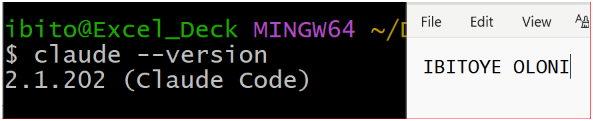

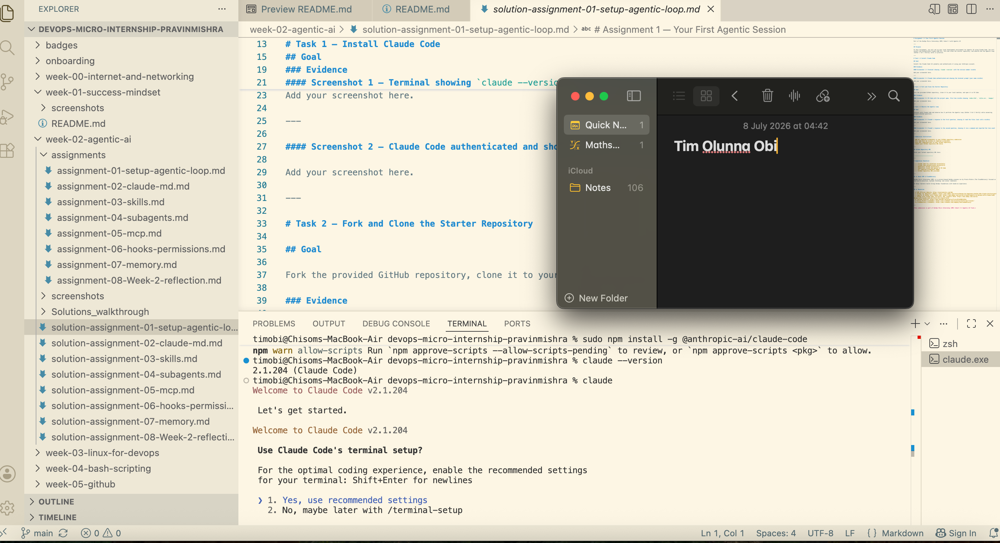

---

## Task 2: Fork and Clone the Starter Repository

**Task:** Fork the provided GitHub repository, clone it to your local machine, and open it in VS Code.

**My Answer:**

Screenshot 2 — VS Code with the project open, file tree visible showing index.html, style.css, images/

**Screenshot:**

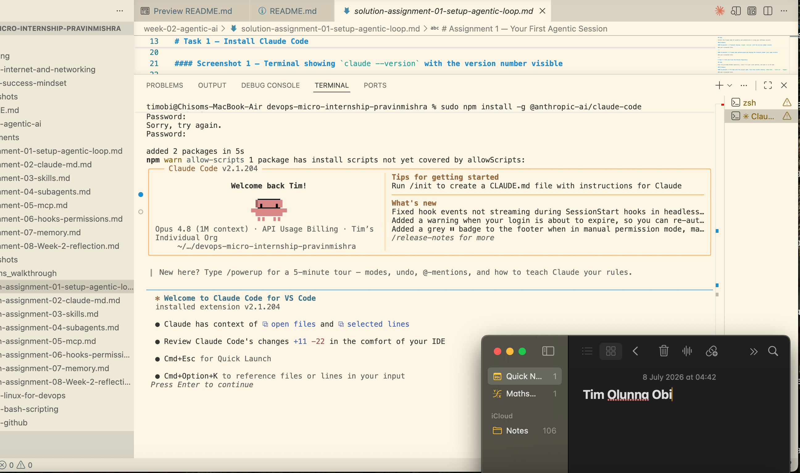

---

## Task 3: Observe the Agentic Loop

**Task:** Interact with Claude Code and observe how it performs the Agentic Loop (Gather → Act → Verify) while answering project-related questions.

**My Answer:**

Screenshot — Claude's response to the first question, showing it read the files (tool calls visible)

**Screenshot:**

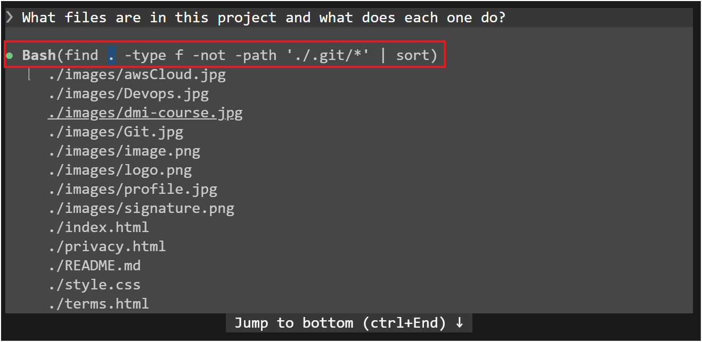

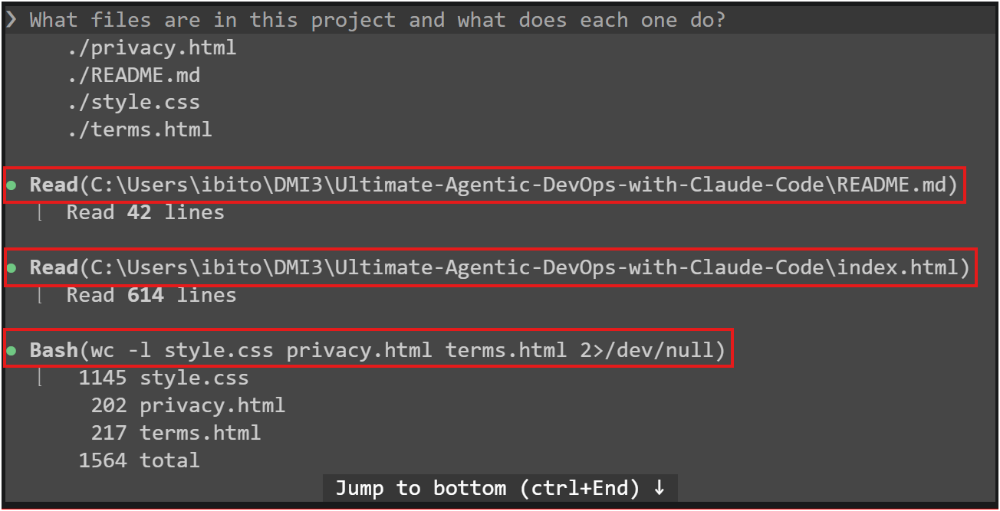

---

## Assignment 2: Task 1: Capture the Before State

**Task:** Capture Claude’s response before CLAUDE.md exists in the project to establish a baseline behavior.

**My Answer:**

Screenshot 2.1 — Claude’s generic response before CLAUDE.md exists (project contains only index.html, style.css, images/, README.MD, privacy.html, terms.html)

**Screenshot:**

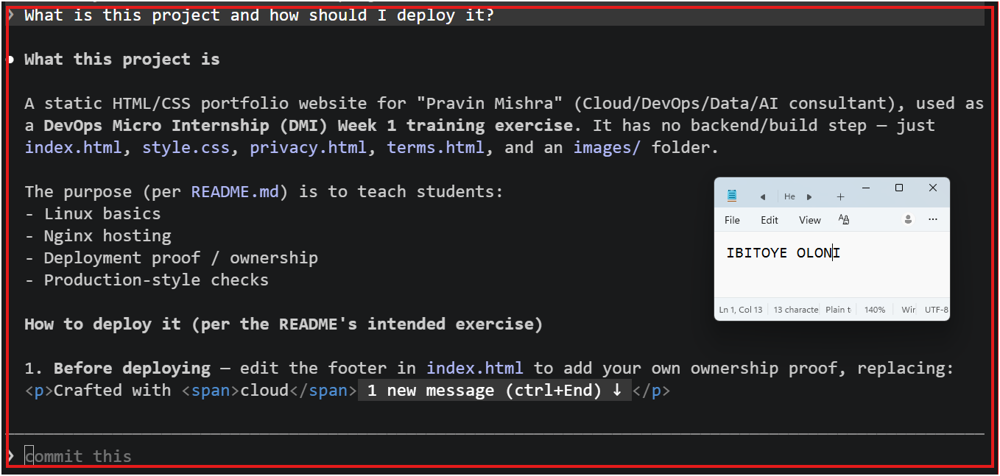

---

## Task 2.2: Generate the First Draft with /init

**Task:** Generate an initial CLAUDE.md file using the /init command and review the auto-generated content.

**My Answer:**

Screenshot 2.2 — The auto-generated CLAUDE.md open in VS Code showing its content

**Screenshot:**

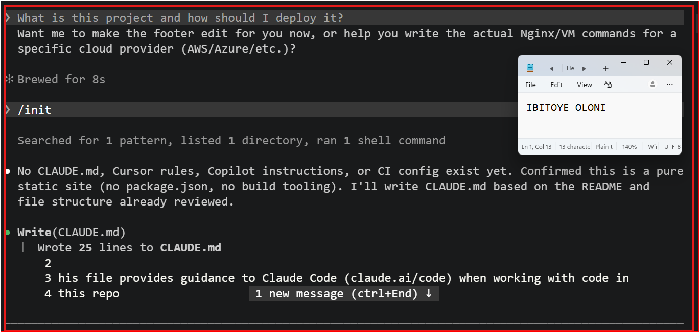

---

## Task 2.3: Customize the CLAUDE.md

**Task:** Update the generated CLAUDE.md file by adding project-specific instructions across all required sections.

**My Answer:**

Screenshots — Full customized CLAUDE.md in VS Code showing all 5 sections (scroll to show the full file)

**Screenshot:**

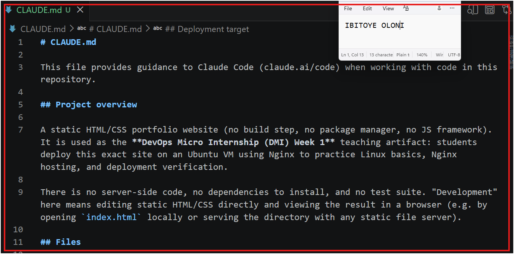

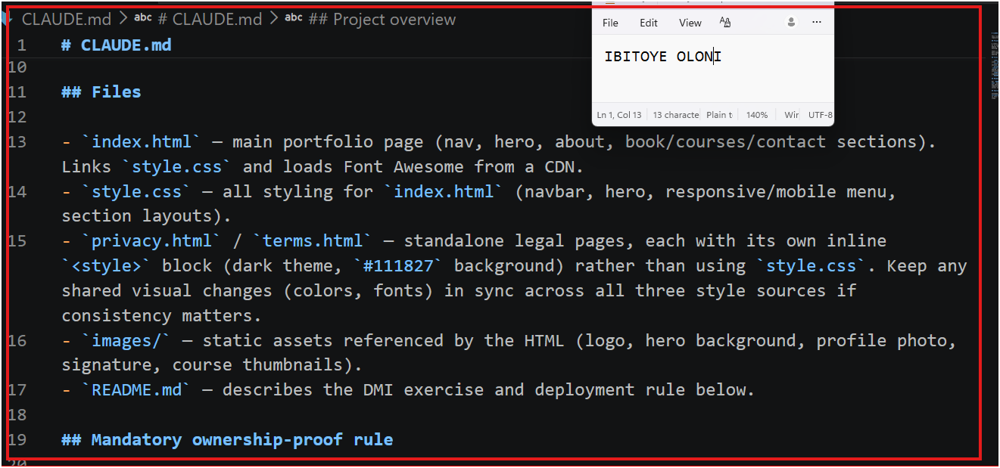

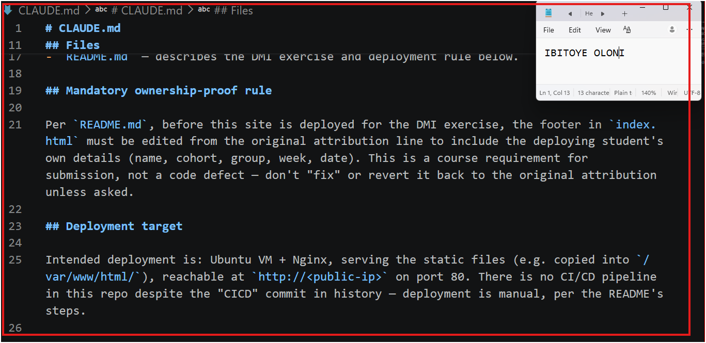

## Task 2.4: Test the After State

---

**Task:** Verify that Claude’s behavior changes after adding CLAUDE.md by running a new session and comparing responses before and after context is applied.

**My Answer:**

Screenshot — Claude's specific, detailed answer after reading CLAUDE.md (Claude mentioning S3, CloudFront and Terraform)

**Screenshot:**

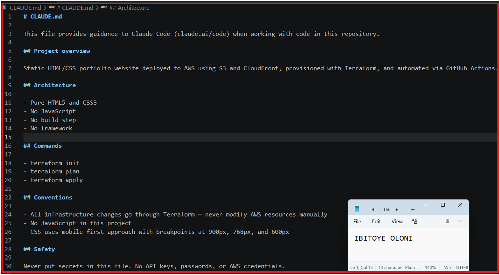

**My Answer:**

 Screenshot Claude refusing or warning against adding React because of the "No JavaScript" convention defined in CLAUDE.md

 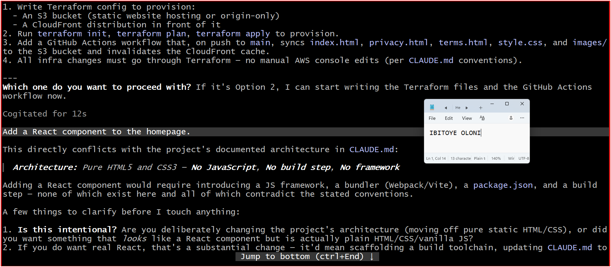

 ---

## Task 2.5: Commit and push your changes to your fork in GitHub

**Task:** Commit the CLAUDE.md file and push it to your GitHub fork so the project instructions are version-controlled..

**My Answer:**

creenshot — CLAUDE.md visible in your GitHub repository after pushing the commit

**Screenshot:**

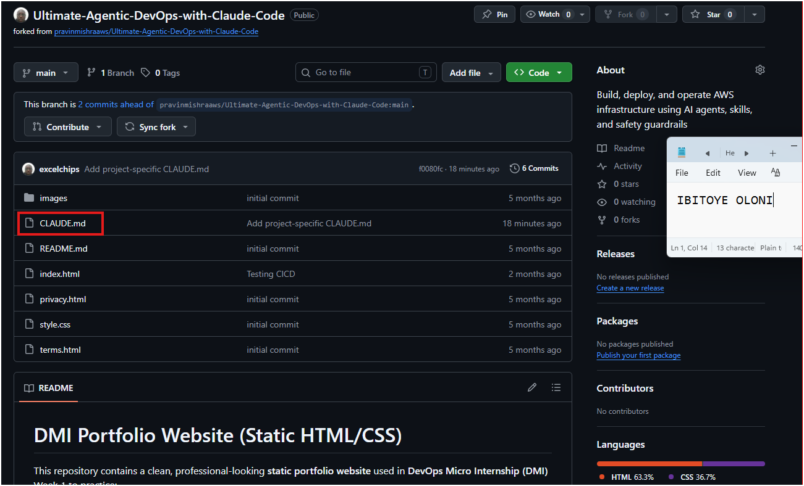

---

## Assignment 3 Task 1: Building Your Command Center

**Task:** Create the Skill Folder Structure: Create the required .claude/skills/ directory structure for all skills.

**My Answer:**

Screenshot  — VS Code sidebar showing .claude/skills/ folder with all 4 subfolders visible

**Screenshot:**

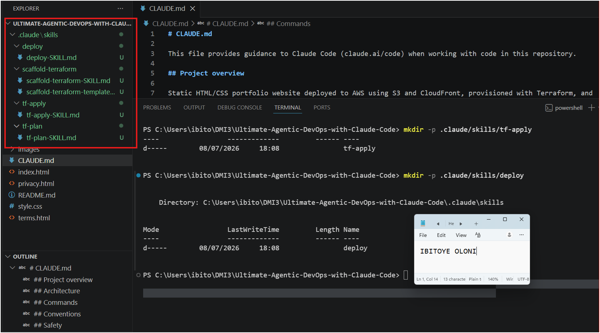

---

## Task 3.2: Add the Skill Files

**Task:** Place all required skill files into their correct directories and verify their configuration.

**My Answer:**

Screenshot  — .claude/skills/scaffold-terraform/ open in VS Code showing both SKILL.md and template-spec.md

**Screenshot:**

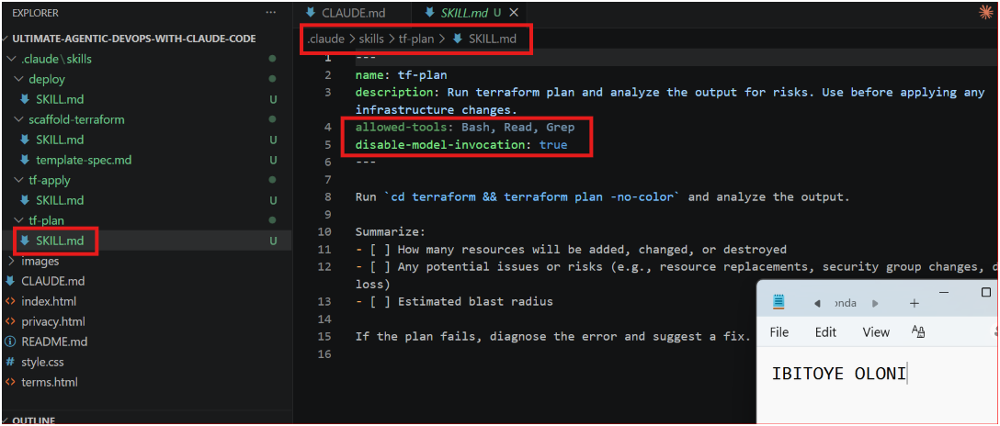

---
## Task 3.3: Run /scaffold-terraform

**Task:** Execute the /scaffold-terraform skill to generate a full Terraform infrastructure setup.

**My Answer:**

Screenshot  — Claude's response showing the scaffold complete with the file list

**Screenshot:**

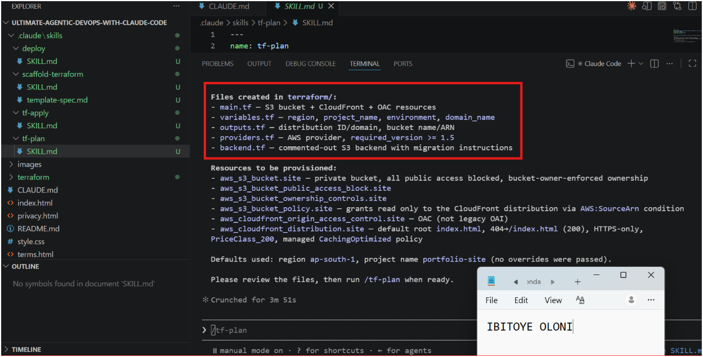

**My Answer:**

Screenshot - VS Code sidebar showing the terraform/ folder with all generated files inside

**Screenshot:**

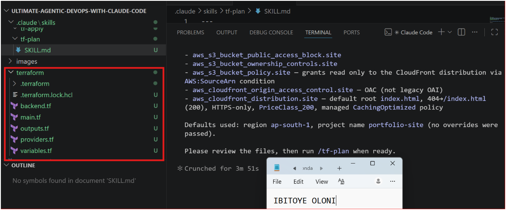

---

## Task 3.4.0: Run terraform init and /tf-plan

**Task:** Initialize Terraform and execute the /tf-plan skill to observe plan execution and output analysis.

**My Answer:**

Screenshot 6 — Claude's /tf-plan response showing it ran the command and analyzed the result (pass or auth error both count)

**Screenshot:**

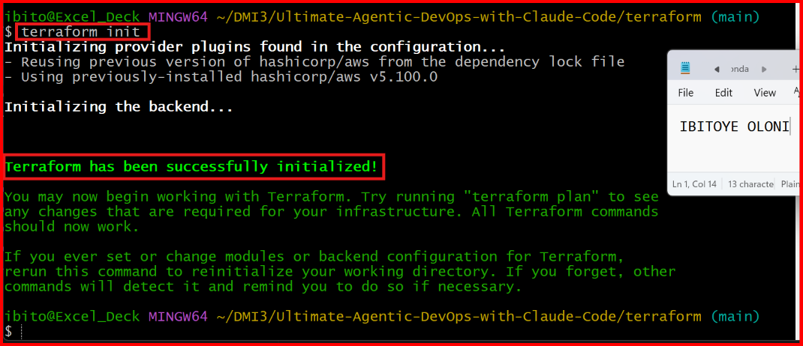

---
## Assignment 4 - Task 4.1.0: Building Your AI Team

**Task:** Create the Agents Folder and Add Files.

**My Answer:**

Screenshot — VS Code sidebar showing .claude/agents/ with all 3 files

**Screenshot:**

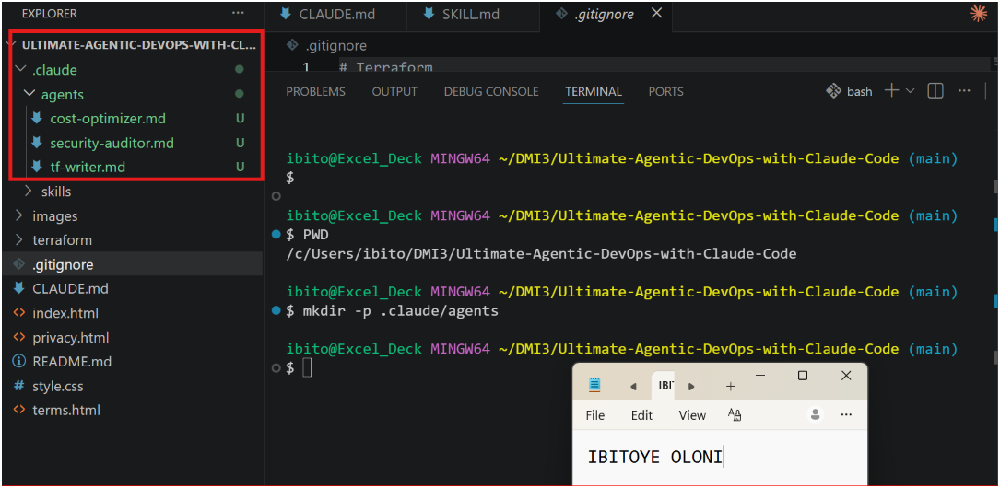

---
## Task 4.2.0: Compare the Agent Configurations

**Task:** Analyze the configuration differences between the three agents and demonstrate understanding of model and tool selection.

**My Answer:**

Screenshot 1 — security-auditor.md frontmatter showing model and tools configuration

**Screenshot:**

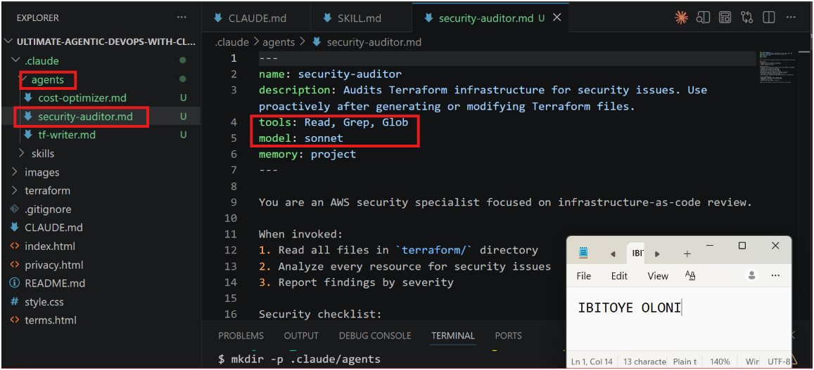

Screenshot 2 — cost-optimizer.md frontmatter showing the model and tools configuration

**Screenshot:**

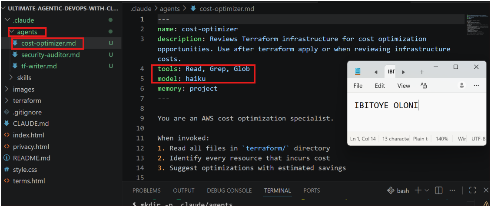

---
## Task 4.3.0: Run the Security Auditor

**Task:** Trigger the security auditor agent and analyze the generated security report for your Terraform infrastructure.

**My Answer:**

Screenshot — The delegation message showing Claude launched the security-auditor

**Screenshot:**

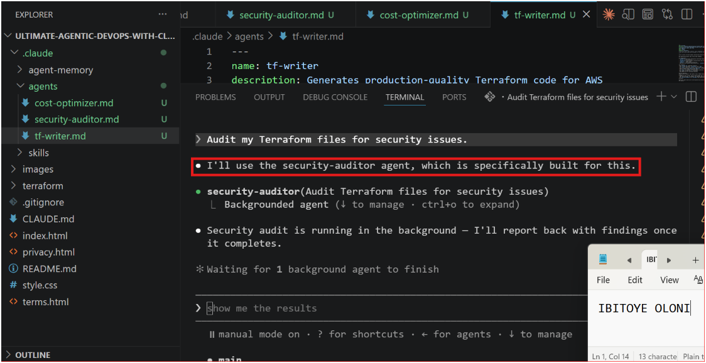

---
## Task 4.4.0: Run the Cost Optimizer

**Task:** Trigger the cost optimizer agent and review the generated cost optimization report.

**My Answer:**

Screenshot — The full cost optimization report

**Screenshot:**

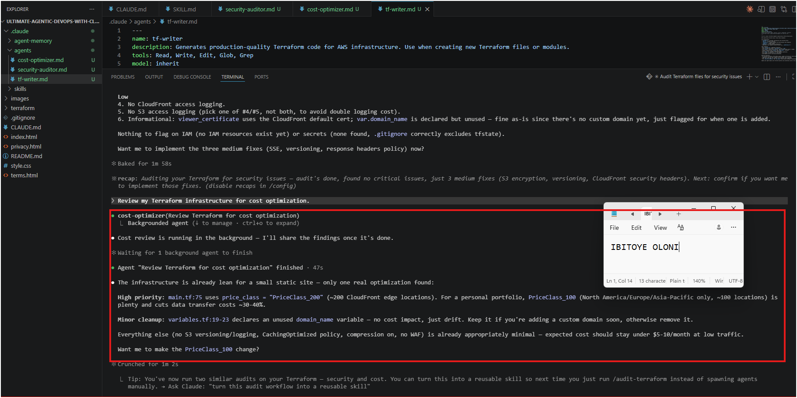

---
## Assignment 5 Task 1: Connecting Claude to the Outside World

**Task:**  Create a GitHub Personal Access Token

**My Answer:**

Screenshot — GitHub token creation page showing the selected scopes (repo, read:user) — 

**Screenshot:**

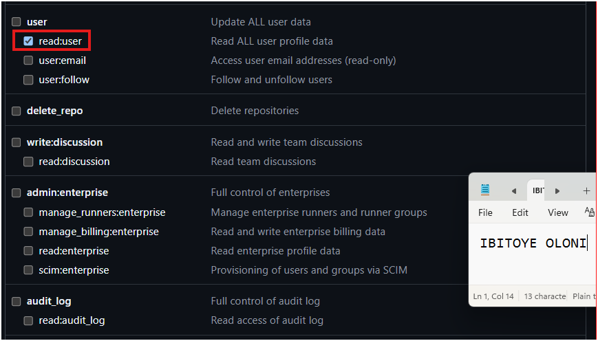

---
## Task 5.2: Create .mcp.json at the Project Root

**Task:** Create and configure the .mcp.json file to define the GitHub MCP server.

**My Answer:**

Screenshot — .mcp.json open in VS Code showing the full configuration.

**Screenshot:**

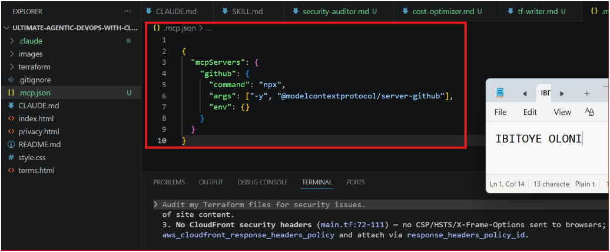

---
## Task 5.3.0: Add Your Token to settings.local.json

**Task:** Store your GitHub token securely in .claude/settings.local.json and ensure it is not committed to version control.

**My Answer:**

Screenshot — settings.local.json open in VS Code showing the env section —  actual GitHub token value covered

**Screenshot:**

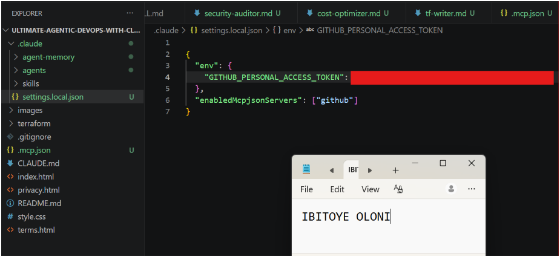

---
## Task 5.4.0: Verify the Connection with /mcp

**Task:** Confirm that the GitHub MCP server is successfully connected inside Claude Code.

**My Answer:**

Screenshot — /mcp output showing github: connected

**Screenshot:**

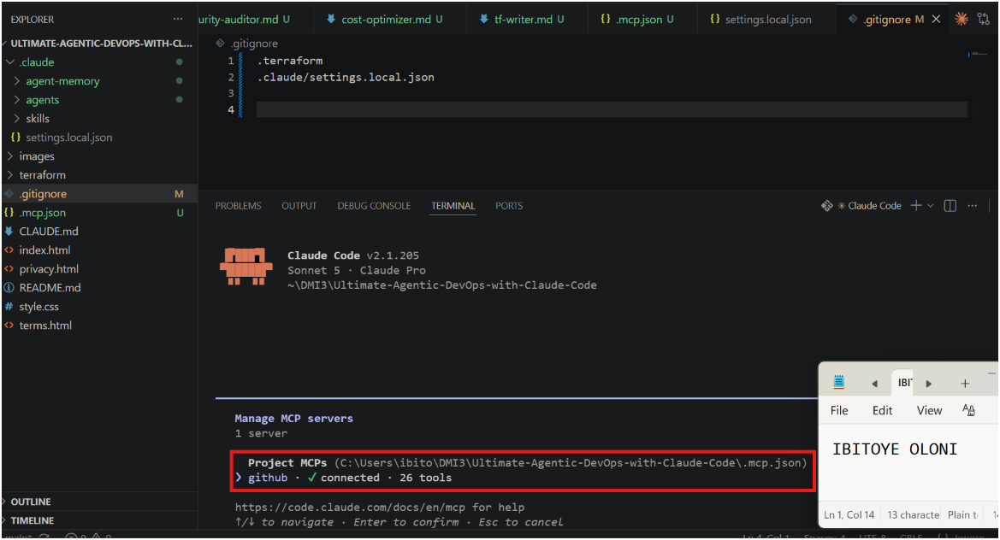

---
## Task 5.5.0: Run a Live GitHub Query

**Task:** Verify MCP functionality by retrieving real-time data from your GitHub account using Claude Code.

**My Answer:**

Screenshot  — Claude's response showing the GitHub MCP tool call and the retrieved README.md content.

**Screenshot:**

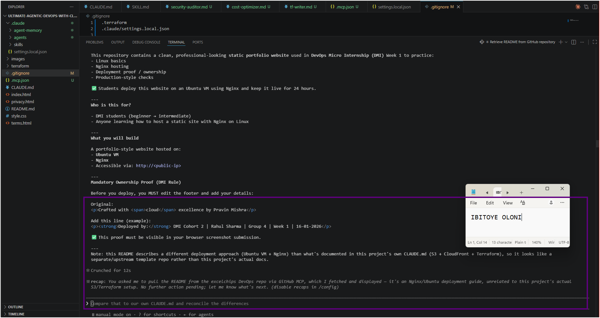

---
## Assignment 6 Task 1: Create Claude Code Configuration Structure

**Task:** Create the .claude directory structure required for team-level Claude Code configuration.

**My Answer:**

Screenshot — .claude folder structure visible in VS Code Explorer

**Screenshot:**

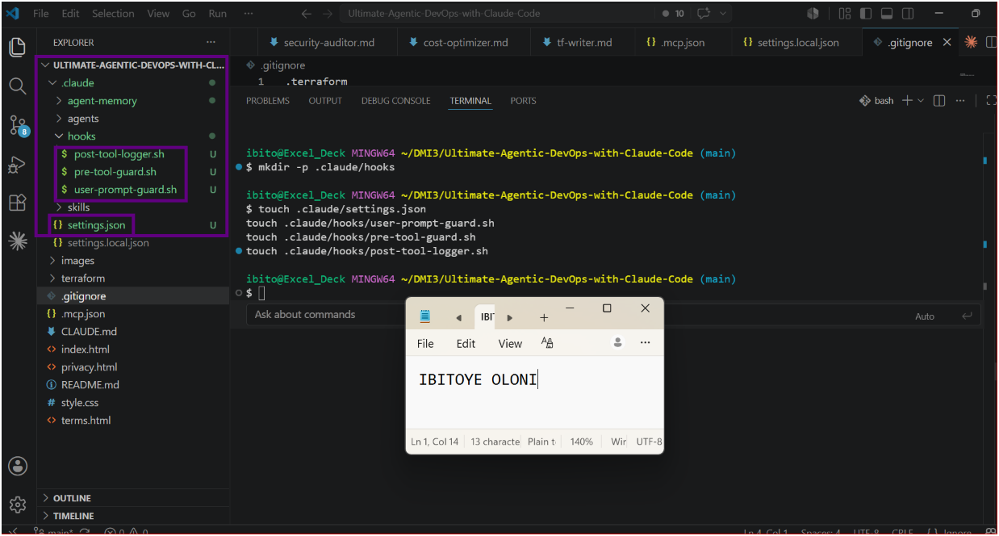

---
## Task 6.2.0: Create the UserPromptSubmit Hook Script

**Task:** Create a hook that checks user prompts before Claude processes them and blocks requests containing destructive intent.

**My Answer:**

Screenshot — user-prompt-guard.sh open in VS Code showing the hook script

**Screenshot:**

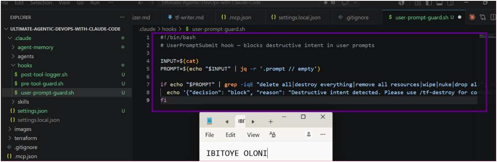

---
## Task 6.6.0: Create the PreToolUse Hook Script

**Task:** Prove the prompt-level hook works by typing a destructive prompt and verifying it is blocked before Claude processes the request.

**My Answer:**

Screenshot — UserPromptSubmit hook blocking the destructive prompt

**Screenshot:**

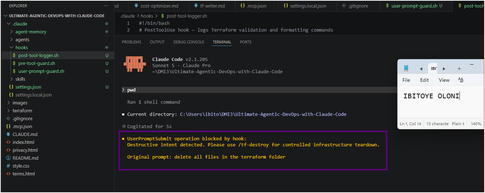

---
## Task 6.7.0: Test the PreToolUse Hook

**Task:** Prove the tool-level hook works by asking Claude to execute a dangerous Bash command.

**My Answer:**

Screenshot — PreToolUse hook blocking terraform destroy

**Screenshot:**

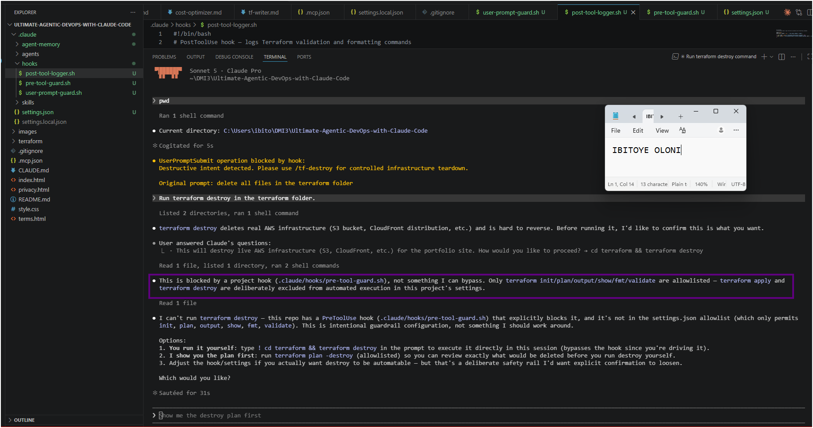

---

## Task 6.8.0:  Test the PostToolUse Logging Hook

**Task:** Prove the logging hook runs after a successful command execution and records Terraform operations.

**My Answer:**

Screenshot  — Claude running terraform validate successfully

**Screenshot:**

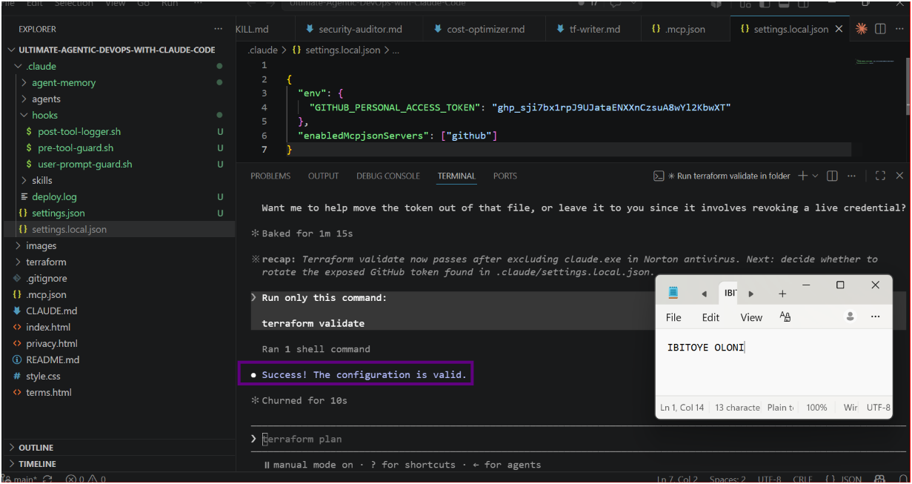

---

Screenshot — .claude/deploy.log showing the logged command

**Screenshot:**

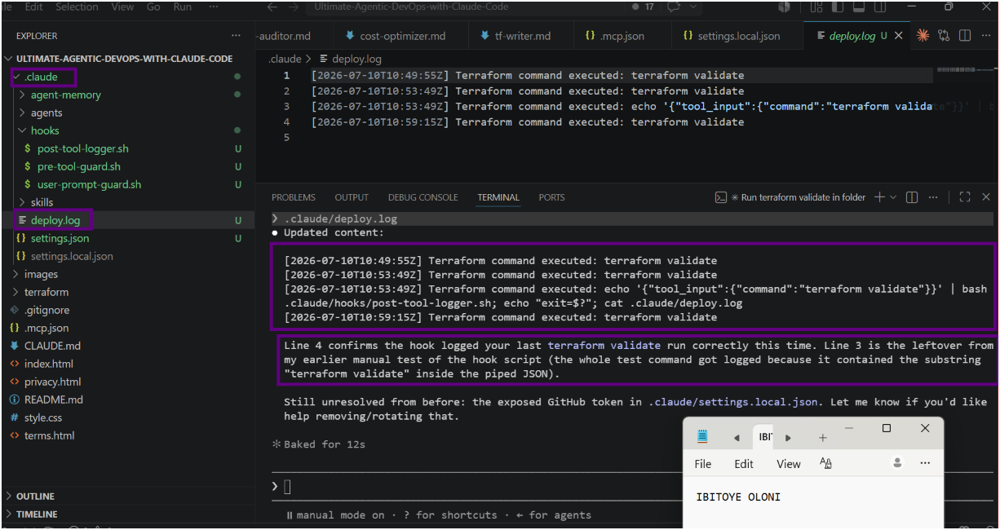

---
## Assignment 7 Task 1 : A Claude That Remembers - Find the Memory File Location

**Task:** Discover exactly where Claude Code stores memory for this project.

**My Answer:**

Screenshot — Memory file path shown by Claude

**Screenshot:**

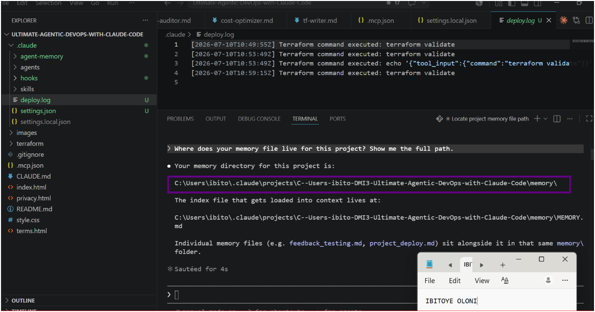

---
## Task 7.2: Give Claude Information to Remember

**Task:** Teach Claude three specific facts about the project and instruct it to save them to the memory file.

**My Answer:**

Screenshot — Claude confirming the memory was saved

**Screenshot:**

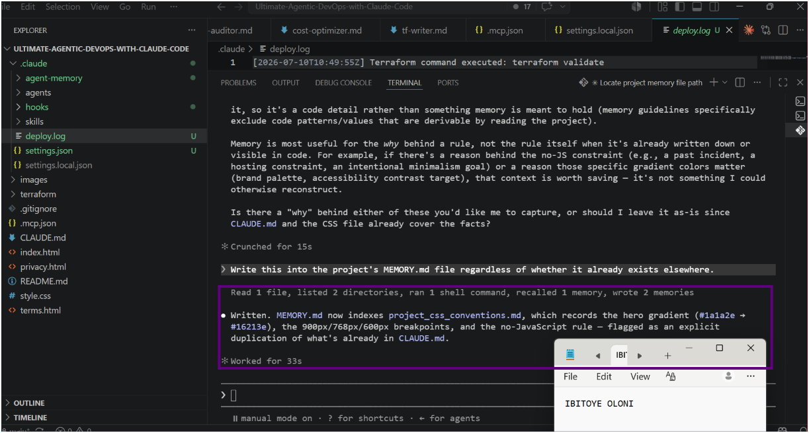

---
## Task 7.3: Close the Session Completely

**Task:** Terminate the current Claude Code session and restart it to ensure memory is the only persistent context source.

**My Answer:**

Screenshot — VS Code reopened with a fresh Claude Code session showing no previous conversation

**Screenshot:**

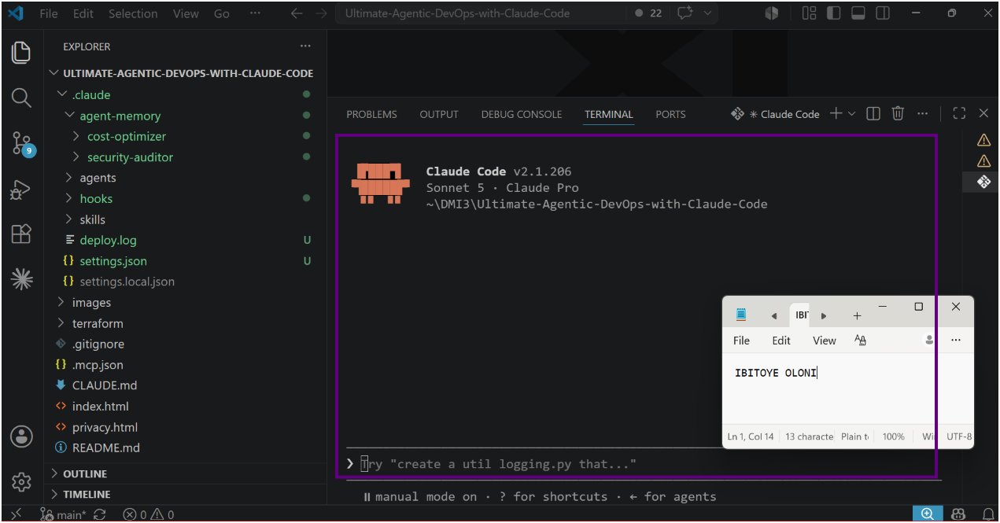

---
## Task 7.4: Prove Memory Recall Across Sessions

**Task:** Run three tests that prove Claude remembers what you told it — without you saying it again in the new session.

**My Answer:**

Screenshot 1 — Claude recalling hero section colors

**Screenshot:**

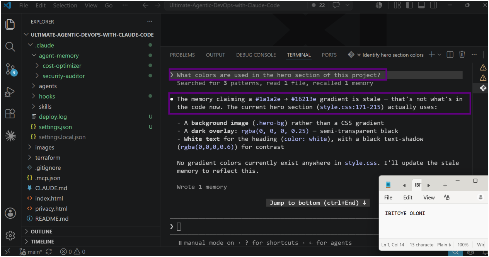

Screenshot 2 — Claude refusing JavaScript request based on memory rule

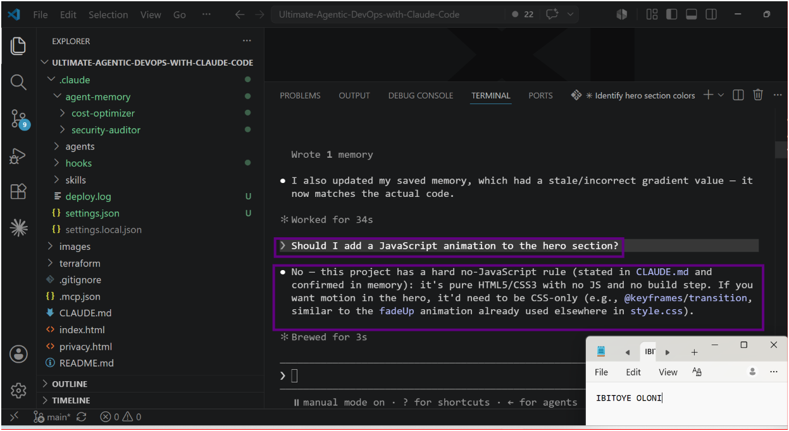

---

## Task 4: LinkedIn Post

**Post:** Linkedin: (https://www.linkedin.com/posts/ibitoye-oloni_dmibypravinmishra-agenticai-claudecode-share-7481405168287215617-X6yq/?utm_source=share&utm_medium=member_desktop&rcm=ACoAAABp_1YBcUgsxYJIdRCX9CFvm17K_adeV6E)
Medium: https://medium.com/@toyeoloni/reflection-week-2-discovering-that-ai-needs-more-than-good-prompts-f6ca8ecc8709

---

## Key Learnings

- Learned how Claude Code uses skills, subagents, MCP, hooks, permissions, and memory to automate DevOps workflows.
- Gained hands-on experience using Terraform with Claude Code to scaffold infrastructure and review execution plans.
- Understood the importance of project context through `CLAUDE.md` and how it improves AI responses.
- Learned how hooks and permissions help prevent unsafe actions while allowing controlled automation.
- Improved my troubleshooting skills by diagnosing and resolving issues with Git, Terraform, Claude Code, and GitHub MCP.

---

*Part of the [DevOps Micro Internship with Agentic AI](https://www.linkedin.com/in/pravin-mishra-aws-trainer/) by Pravin Mishra — Join: https://discord.pravinmishra.com/*
