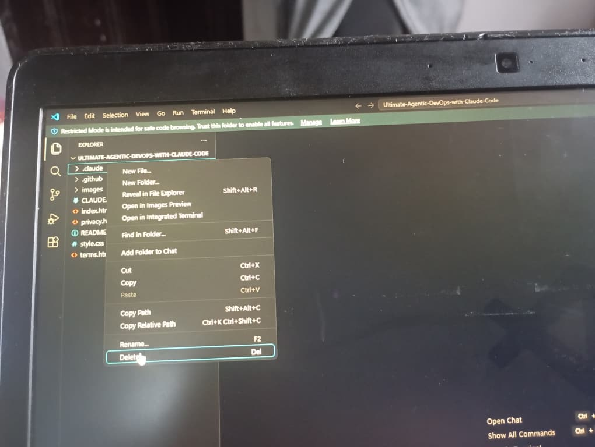
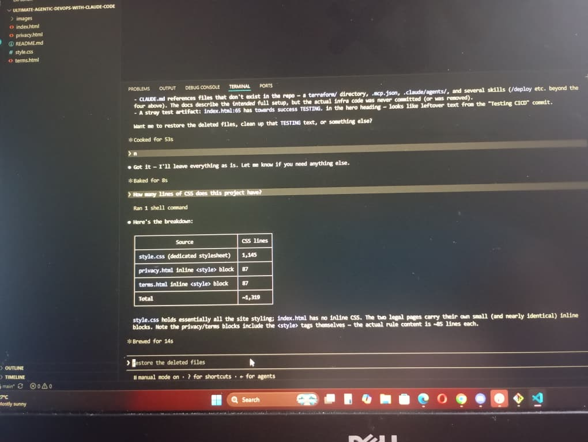

# Week 02 — <!-- Topic My first Agentic session -->

## Assignment Overview

<!-- One line describing what this week covered -->
Set up the Agentic AI development environment.
---

## Task 1: <!-- -->Your First Agentic Session

**Task:** <!-- Copy the task description here -->

**My Answer:**

<!---->In this assignment, you will set up your local development environment for Agentic AI using Claude Code. You will install and authenticate Claude Code CLI, fork and clone the starter repository, and observe how the Agentic Loop (Gather → Act → Verify) works in practice.

**Screenshot:**

---

## Task 2: <!-- -->Fork and Clone the Starter Repository

**Task:** <!--  -->Fork the provided GitHub repository, clone it to your local machine, and open it in VS Code

**My Answer:**

<!--Fork the provided GitHub repository, clone it to your local machine, and open it in VS Code -->

**Screenshot:**

---

## Task 3: <!--Observe the Agentic Loop-->

**Task:** <!-- -->

**My Answer:**

<!-- -->
interact with Claude Code and observe how it performs the Agentic Loop (Gather → Act → Verify) while answering project-related questions.
**Screenshot:**

---

## Task 4: LinkedIn Post
https://www.linkedin.com/posts/eze-favour-52732752_dmibypravinmishra-agenticai-claudecode-share-7481376003861184512-4pkO/?utm_source=social_share_send&utm_medium=android_app&rcm=ACoAAAsVGC8BeMs7INDCBrG_mYeb0V1cNjGv7mk&utm_campaign=copy_link
**Post:** <!- -->

---

## Key Learnings

<!-- 3-5 bullet points on what you learned this week -->
Explored how AI coding assistants like Claude Code can automate DevOps workflows such as writing code, debugging, and infrastructure management.
- Understood how Agentic AI is transforming Cloud and DevOps by improving productivity, reducing manual tasks, and accelerating software delivery.
- Gained hands-on experience using AI to solve real-world DevOps challenges through structured prompts, iterative refinement, and automation.
- 
Learned the importance of human oversight when working with AI agents to ensure security, accuracy, and reliability in production environments.
---

*Part of the [DevOps Micro Internship with Agentic AI](https://www.linkedin.com/in/pravin-mishra-aws-trainer/) by Pravin Mishra — Join: https://discord.pravinmishra.com/*
