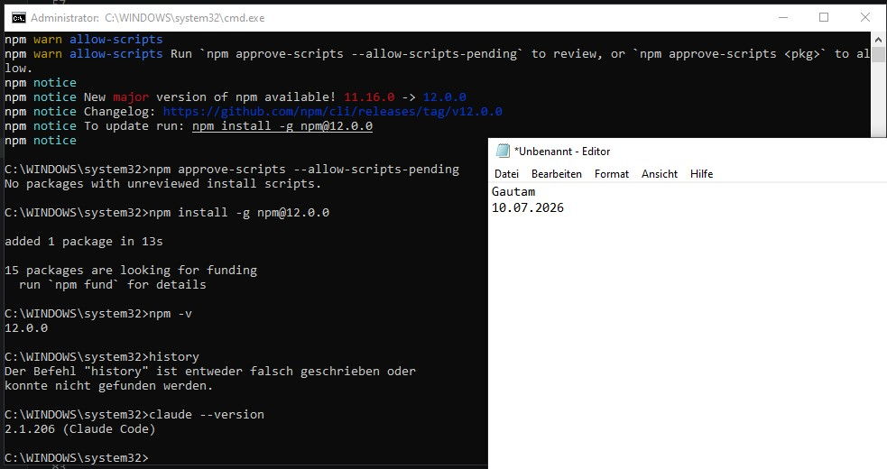
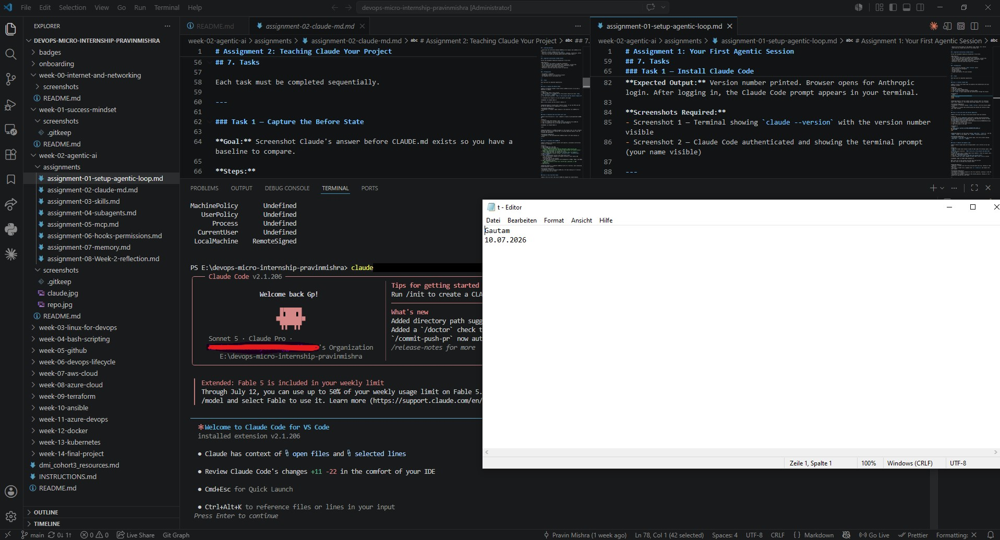
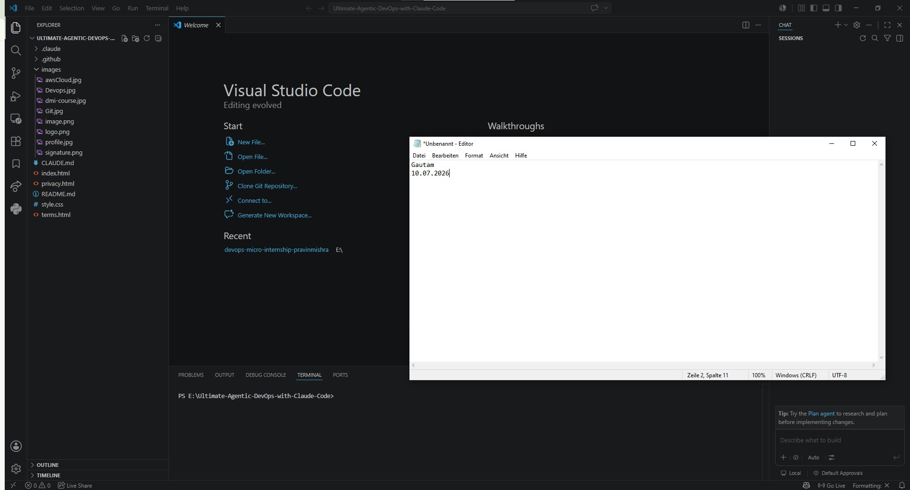

# Week 04 — <!-- Topic Name -->

## Assignment Overview

<!-- One line describing what this week covered -->

---

## Task 1: Install Claude Code

**Task:** Install the Claude Code CLI globally and authenticate with your Anthropic account.

**My Answer:**

<!-- Write your answer here -->

**Screenshot:**

---

## Task 2: Fork and Clone the Starter Repository

**Task:** Get your own copy of the course project onto your machine.

**My Answer:**

<!-- Write your answer here -->

**Screenshot:**

---

## Task 3: Observe the Agentic Loop

**Task:** <!-- Copy the task description here -->

**My Answer:**

<!-- Write your answer here -->

**Screenshot:**

---

## Task 4: LinkedIn Post

**Post:** <!-- Paste your LinkedIn post URL here -->

---

## Key Learnings

<!-- 3-5 bullet points on what you learned this week -->

- 
- 
- 

---

*Part of the [DevOps Micro Internship with Agentic AI](https://www.linkedin.com/in/pravin-mishra-aws-trainer/) by Pravin Mishra — Join: https://discord.pravinmishra.com/*
