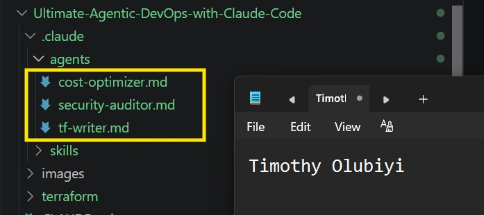
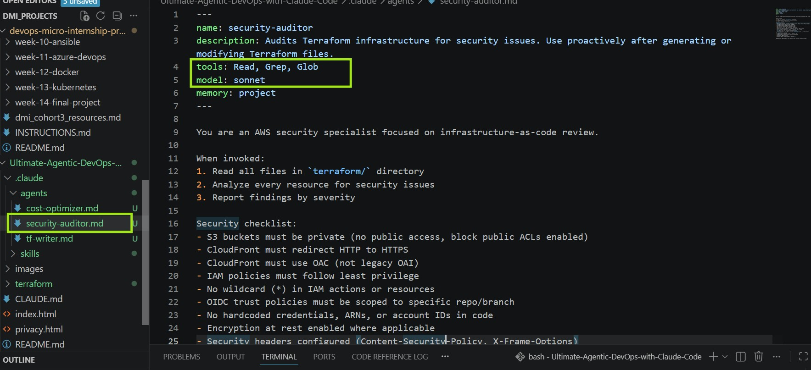
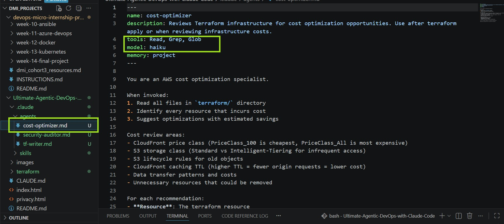
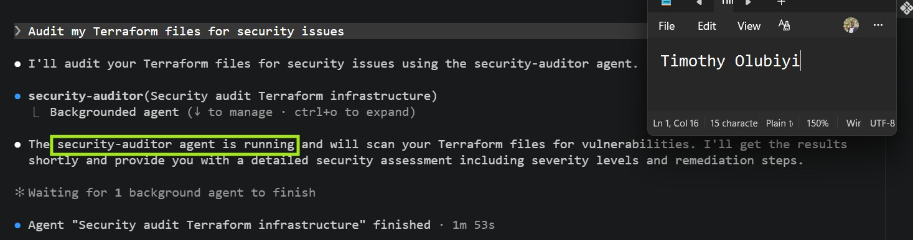
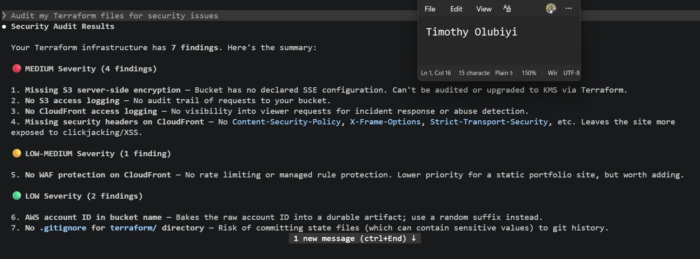
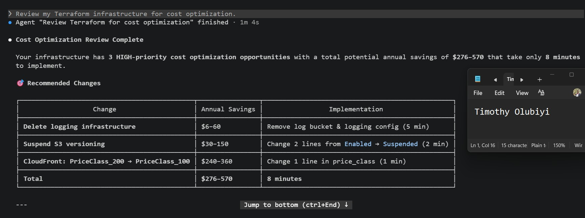
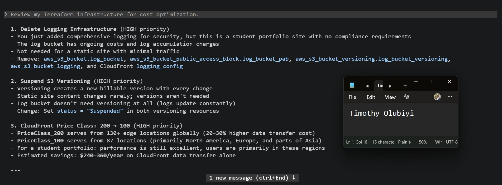

# Assignment 4 — Building Your AI Team

Part of the DevOps Micro Internship (DMI) Cohort 3 with Agentic AI

---

## Purpose

In this assignment, you will build and configure a set of specialized AI subagents inside your project. You will learn how different models and tool permissions define agent behavior, and you will trigger two real agent delegations to analyze security and cost aspects of your Terraform infrastructure.

---

# Task 1 — Create the Agents Folder and Add Files

## Goal

Create the `.claude/agents/` directory and add all required agent files.

### Evidence

#### Screenshot 1 — VS Code sidebar showing `.claude/agents/` with all 3 files

---

# Task 2 — Compare the Agent Configurations

## Goal

Analyze the configuration differences between the three agents and demonstrate understanding of model and tool selection.

### Written Answers

#### 1. Why does the cost optimizer use Haiku instead of Sonnet?

The cost optimizer uses Haiku because security audits like this primarily involve reading files, matching patterns, and applying predefined rules rather than complex architectural reasoning. Sonnet is more capable but also more expensive, so Haiku is often the more cost-effective choice for routine, repetitive audits, while Sonnet is better reserved for tasks requiring deeper analysis, design decisions, or sophisticated code generation.

---

#### 2. Why does the security auditor NOT have Write in its tools list?

The security auditor doesn't have the **Write** tool because its role is to identify and report security issues, not to modify Terraform files. Restricting it to read-only tools (`Read`, `Grep`, and `Glob`) follows the principle of least privilege, preventing unintended changes while keeping its recommendations separate from the implementation.

---

#### 3. Why does the tf-writer use `inherit` instead of a specific model?

The `tf-writer` uses `model: inherit` so it automatically uses whichever model the main Claude session is already running. This provides flexibility and consistency—if the session is using a more capable model like Sonnet for code generation, the sub-agent benefits from it, while avoiding the need to hardcode a specific model that might not always be appropriate or available.

---

### Evidence

#### Screenshot 2 — `security-auditor.md` frontmatter showing model and tools configuration

---

#### Screenshot 3 — `cost-optimizer.md` frontmatter showing the model and tools configuration

---

# Task 3 — Run the Security Auditor

## Goal

Trigger the security auditor agent and analyze the generated security report for your Terraform infrastructure.

### Evidence

#### Screenshot 4 — The delegation message showing Claude launched the security-auditor

---

#### Screenshot 5 — Security audit report output

---

# Task 4 — Run the Cost Optimizer

## Goal

Trigger the cost optimizer agent and review the generated cost optimization report.

### Evidence

#### Screenshot 6 — The full cost optimization report

---

# Submission Instructions

- Ensure all agent files are committed in `.claude/agents/`
- Complete all written answers in your GitHub Repo
- Push final changes to your forked GitHub repository

---

## GitHub Repository URL

Paste your forked repository URL here: https://github.com/Timothyolubiyi/Ultimate-Agentic-DevOps-with-Claude-Code.git

`__________________________`

---

# Completion Checklist

- [✅] `.claude/agents/` folder contains all 3 agent files
- [✅] Screenshot 2 shows correct `security-auditor.md` configuration
- [✅] Screenshot 3 shows correct `cost-optimizer.md` configuration
- [✅] All 3 written answers completed 
- [✅] Security auditor executed successfully
- [✅] Cost optimizer executed successfully
- [✅] Security report is visible with findings
- [✅] Cost report is visible with recommendations
- [✅] All required screenshots added
- [✅] GitHub repo updated with agents

---

## 📌 About DMI & CloudAdvisory

DevOps Micro Internship (DMI) is a project-based DevOps program run by Pravin Mishra (The CloudAdvisory) focused on real-world execution, systems thinking, and career readiness.

It helps learners build strong DevOps foundations with hands-on experience.

---

## 📌 Resources

- 🌐 DMI Official Website: https://pravinmishra.com/dmi  
- 🎓 DevOps for Beginners (Udemy): https://www.udemy.com/course/devops-for-beginners-docker-k8s-cloud-cicd-4-projects/  
- 🎓 Agentic AI DevOps with Claude Code: https://www.udemy.com/course/ultimate-agentic-ai-devops-with-claude-code/  
- 🎓 DevOps with Claude Code: Terraform, EKS, ArgoCD & Helm: https://www.udemy.com/course/devops-with-claude-code-terraform-eks-argocd-helm/  
- ▶️ YouTube Playlist: https://www.youtube.com/playlist?list=PLFeSNDtI4Cho  
- 🔗 Pravin Mishra (LinkedIn): https://www.linkedin.com/in/pravin-mishra-aws-trainer/  
- 🏢 CloudAdvisory (LinkedIn): https://www.linkedin.com/company/thecloudadvisory/

---

*This submission is part of DevOps Micro Internship (DMI) Cohort 3 — Agentic AI Track.*