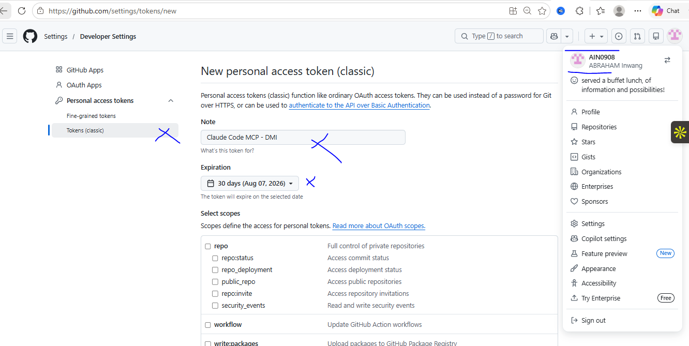
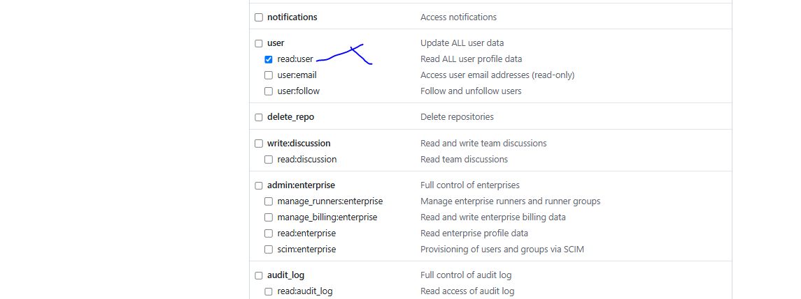
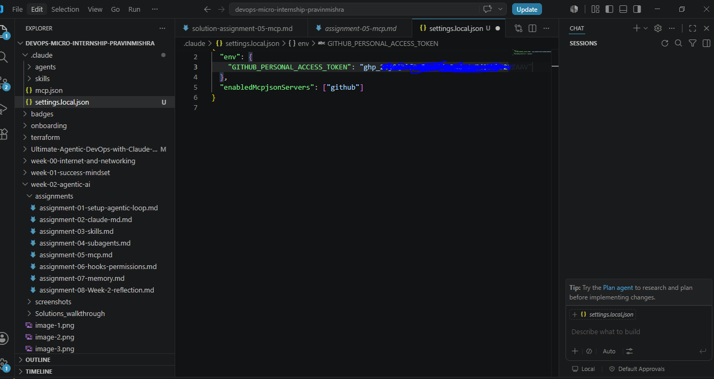
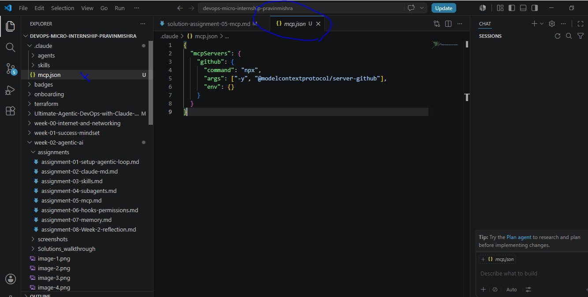
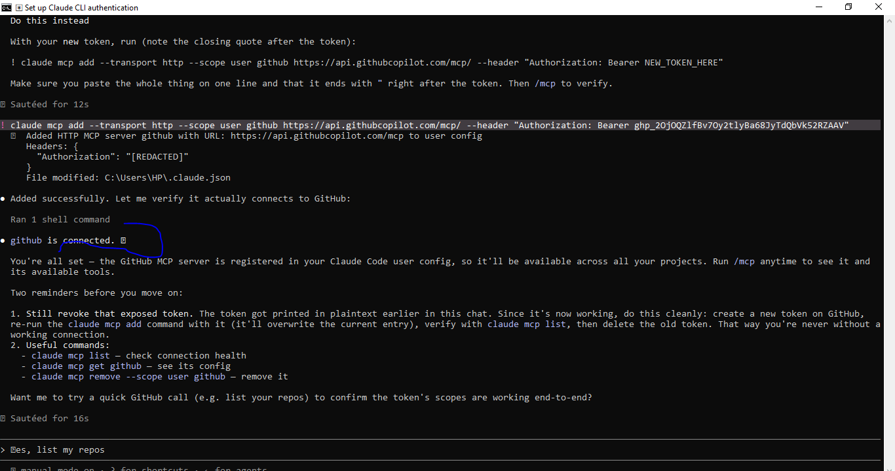
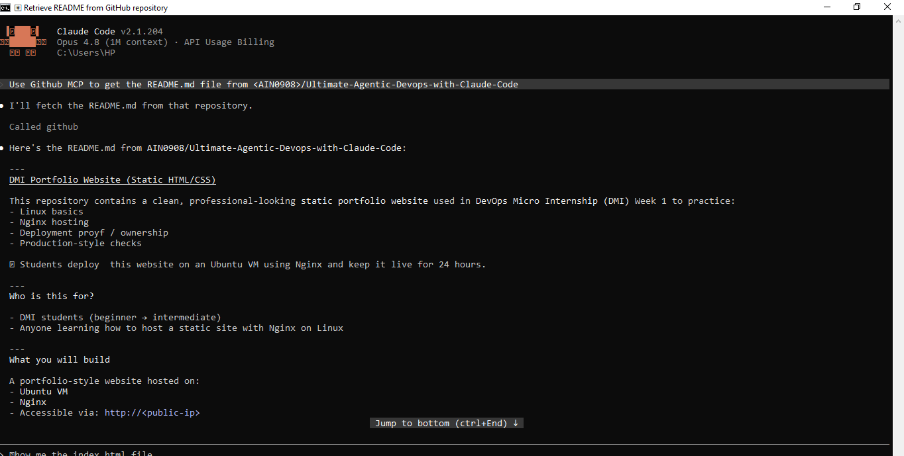

# Assignment 4 — Building Your AI Team

Part of the DevOps Micro Internship (DMI) Cohort 3 with Agentic AI

---

## Purpose

In this assignment, you will build and configure a set of specialized AI subagents inside your project. You will learn how different models and tool permissions define agent behavior, and you will trigger two real agent delegations to analyze security and cost aspects of your Terraform infrastructure.

---

# Task 1 — Create the Agents Folder and Add Files

## Goal

Create the `.claude/agents/` directory and add all required agent files.

### Evidence

#### Screenshot 1 — VS Code sidebar showing `.claude/agents/` with all 3 files

---

# Task 2 — Compare the Agent Configurations

## Goal

Analyze the configuration differences between the three agents and demonstrate understanding of model and tool selection.

### Written Answers

#### 1. Why does the cost optimizer use Haiku instead of Sonnet?

Cost review is pattern-matching against a fixed checklist (price class, storage class, TTL, lifecycle rules) rather than deep reasoning — reading Terraform files and mapping known configs to known cost-saving alternatives. Haiku is fast and cheap enough for that kind of structured, repetitive check, so there's no need to pay Sonnet's higher cost for it

---

#### 2. Why does the security auditor NOT have Write in its tools list?

Its job is to audit and report, not modify code. Tools are Read, Grep, Glob — read-only, so it can inspect the Terraform files and flag issues, but it can't silently change security-critical infrastructure code itself. Any fix it proposes goes back to a human (or to tf-writer) to actually apply, keeping a review/approval step between "finding an issue" and "changing the code" — important for something as consequential as security config.

---

#### 3. Why does the tf-writer use `inherit` instead of a specific model?

`model: inherit` means it uses whatever model is driving the parent session/conversation, rather than being pinned to one tier. This makes sense for a code-generation agent because:

Code generation benefits from the strongest reasoning available when the task is complex, but doesn't need to be locked to always-Sonnet if the parent session is running a lighter or heavier model.
It keeps behavior consistent with the user's active session — if you're working in Sonnet, tf-writer generates code at that same reasoning level, rather than silently downgrading or upgrading.
Unlike cost-optimizer/security-auditor (which have fixed, well-scoped tasks suited to a fixed model), tf-writer's output quality directly depends on reasoning depth for things like `locals`, validation logic, and best-practice tradeoffs — so it inherits rather than assumes a fixed tier is always right.

---

### Evidence

#### Screenshot 2 — `security-auditor.md` frontmatter showing model and tools configuration

---

#### Screenshot 3 — `cost-optimizer.md` frontmatter showing the model and tools configuration

---

# Task 3 — Run the Security Auditor

## Goal

Trigger the security auditor agent and analyze the generated security report for your Terraform infrastructure.

### Evidence

#### Screenshot 4 — The delegation message showing Claude launched the security-auditor

---

#### Screenshot 5 — Security audit report output

---

# Task 4 — Run the Cost Optimizer

## Goal

Trigger the cost optimizer agent and review the generated cost optimization report.

### Evidence

#### Screenshot 6 — The full cost optimization report

---

# Submission Instructions

- Ensure all agent files are committed in `.claude/agents/`
- Complete all written answers in your GitHub Repo
- Push final changes to your forked GitHub repository

---

## GitHub Repository URL

Paste your forked repository URL here:

[`GitHub Subagent repo added`](https://github.com/Sola-Royal/Ultimate-Agentic-DevOps-with-Claude-Code)

---

# Completion Checklist

- [ ] `.claude/agents/` folder contains all 3 agent files
- [ ] Screenshot 2 shows correct `security-auditor.md` configuration
- [ ] Screenshot 3 shows correct `cost-optimizer.md` configuration
- [ ] All 3 written answers completed 
- [ ] Security auditor executed successfully
- [ ] Cost optimizer executed successfully
- [ ] Security report is visible with findings
- [ ] Cost report is visible with recommendations
- [ ] All required screenshots added
- [ ] GitHub repo updated with agents

---

## 📌 About DMI & CloudAdvisory

DevOps Micro Internship (DMI) is a project-based DevOps program run by Pravin Mishra (The CloudAdvisory) focused on real-world execution, systems thinking, and career readiness.

It helps learners build strong DevOps foundations with hands-on experience.

---

## 📌 Resources

- 🌐 DMI Official Website: https://pravinmishra.com/dmi  
- 🎓 DevOps for Beginners (Udemy): https://www.udemy.com/course/devops-for-beginners-docker-k8s-cloud-cicd-4-projects/  
- 🎓 Agentic AI DevOps with Claude Code: https://www.udemy.com/course/ultimate-agentic-ai-devops-with-claude-code/  
- 🎓 DevOps with Claude Code: Terraform, EKS, ArgoCD & Helm: https://www.udemy.com/course/devops-with-claude-code-terraform-eks-argocd-helm/  
- ▶️ YouTube Playlist: https://www.youtube.com/playlist?list=PLFeSNDtI4Cho  
- 🔗 Pravin Mishra (LinkedIn): https://www.linkedin.com/in/pravin-mishra-aws-trainer/  
- 🏢 CloudAdvisory (LinkedIn): https://www.linkedin.com/company/thecloudadvisory/

---

*This submission is part of DevOps Micro Internship (DMI) Cohort 3 — Agentic AI Track.*