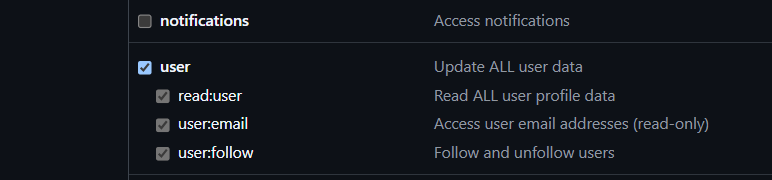
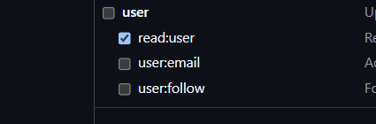
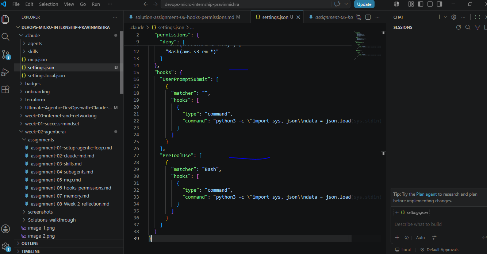

# Assignment 6 — Safety Rails for Your AI Agent

Part of the DevOps Micro Internship (DMI) Cohort 3 with Agentic AI

---

## Purpose

In this assignment, you will configure safety and control mechanisms for Claude Code using permissions and hooks. You will define team-level command restrictions and implement prompt-level and tool-level hooks to prevent destructive actions before they execute.

---

# Task 1 — Create Claude Code Configuration Structure

## Goal

Create the `.claude` directory structure required for team-level Claude Code configuration.

### Evidence

#### Screenshot 1 — `.claude` folder structure visible in VS Code Explorer

Add your screenshot here.

# Task 2 — Add the UserPromptSubmit Hook

## Goal

Add a hook that intercepts user prompts before Claude starts execution and blocks destructive intent.

### Evidence

#### Screenshot 2 — settings.json showing UserPromptSubmit hook

---

# Task 3 — Add the PreToolUse Hook

## Goal

Extend `settings.json` with a PreToolUse hook that blocks dangerous Bash commands before execution.

### Evidence

#### Screenshot 3 — full settings.json with permissions and hooks

---

# Task 4 — Test the UserPromptSubmit Hook

## Goal

Verify that destructive prompts are blocked before Claude begins execution.

### Evidence

#### Screenshot 4 — blocked prompt due to UserPromptSubmit hook

Add your screenshot here.

---

# Task 5 — Test the PreToolUse Hook

## Goal

Verify that dangerous commands are intercepted before execution by the PreToolUse hook.

### Evidence

#### Screenshot 5 — PreToolUse hook blocking terraform destroy

#### Screenshot 9 — `.claude/deploy.log` showing the logged command

---

# Submission Instructions

Complete all tasks in sequence.

Your submission must include:
- All 9 required screenshots

---

# Completion Checklist

- [ ] `.claude` folder structure created correctly
- [ ] `user-prompt-guard.sh` created with UserPromptSubmit hook logic
- [ ] `pre-tool-guard.sh` created with PreToolUse hook logic
- [ ] `post-tool-logger.sh` created with PostToolUse logging logic
- [ ] `settings.json` created with allow and deny permissions
- [ ] `settings.json` configured to connect all three hooks:
  - [ ] UserPromptSubmit
  - [ ] PreToolUse
  - [ ] PostToolUse
- [ ] Destructive prompt test shows UserPromptSubmit blocked the request
- [ ] Terraform destroy command test shows PreToolUse intercepted the command
- [ ] Terraform validate test shows PostToolUse created the log entry
- [ ] All required screenshots are captured

---

## 📌 About DMI & CloudAdvisory

DevOps Micro Internship (DMI) is a project-based DevOps program run by Pravin Mishra (The CloudAdvisory) focused on real-world execution, systems thinking, and career readiness.

It helps learners build strong DevOps foundations with hands-on experience.

---

## 📌 Resources

- 🌐 DMI Official Website: https://pravinmishra.com/dmi  
- 🎓 DevOps for Beginners (Udemy): https://www.udemy.com/course/devops-for-beginners-docker-k8s-cloud-cicd-4-projects/  
- 🎓 Agentic AI DevOps with Claude Code: https://www.udemy.com/course/ultimate-agentic-ai-devops-with-claude-code/  
- 🎓 DevOps with Claude Code: Terraform, EKS, ArgoCD & Helm: https://www.udemy.com/course/devops-with-claude-code-terraform-eks-argocd-helm/  
- ▶️ YouTube Playlist: https://www.youtube.com/playlist?list=PLFeSNDtI4Cho  
- 🔗 Pravin Mishra (LinkedIn): https://www.linkedin.com/in/pravin-mishra-aws-trainer/  
- 🏢 CloudAdvisory (LinkedIn): https://www.linkedin.com/company/thecloudadvisory/

---

*This submission is part of DevOps Micro Internship (DMI) Cohort 3 — Agentic AI Track.*