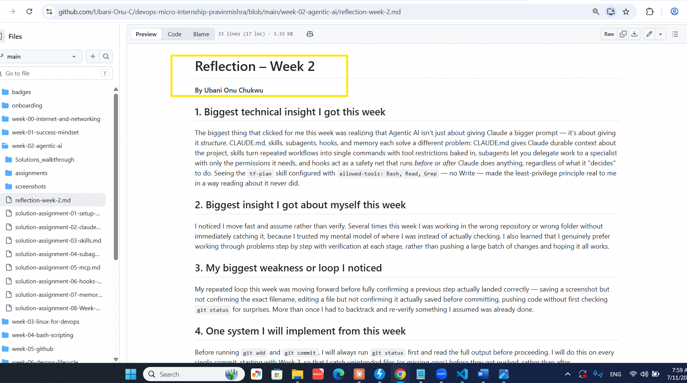
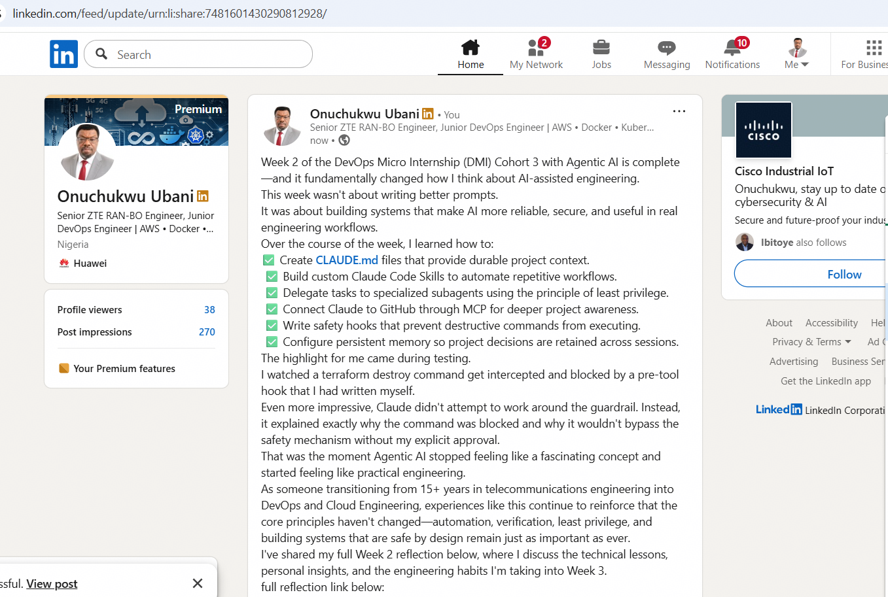

# Assignment 8 — Week 2 Reflection Blog

Part of the DevOps Micro Internship (DMI) Cohort 3 with Agentic AI

---

# Purpose

In this assignment, you will reflect on your Week 2 learning journey and write a short blog capturing your experience working with Agentic AI tools such as Claude Code, Skills, Subagents, MCP, Hooks, Permissions, and Memory.

You will also publish a LinkedIn post summarizing your learning and share both links for evaluation.

---

# Task 1 — Write Your Reflection Blog

## Goal

Write a reflection blog covering your Week 2 learning experience.

### Blog Requirements

Your blog must include:

* Title: **Reflection – Week 2**
* Minimum 300 words
* At least 2–3 topics from Week 2 (Claude Code, Skills, Subagents, MCP, Hooks, Permissions, Memory)
* Honest personal reflection (learning, challenges, mindset)
* One habit/system you plan to implement
* Your full name clearly visible

### Allowed Platforms

You can publish your blog on:

* Hashnode
* Medium
* Dev.to
* LinkedIn Article
* GitHub Markdown file
* Substack

---

### Evidence

#### Screenshot 1 — Blog published and visible

---

### Submission Field

Blog Link:

`https://github.com/Ubani-Onu-C/devops-micro-internship-pravinmishra/blob/main/week-02-agentic-ai/reflection-week-2.md`

---

# Task 2 — Create LinkedIn Post

## Goal

Share your Week 2 learning publicly on LinkedIn.

---

### LinkedIn Post Requirements

Your post must include:

* One screenshot from any Week 2 assignment
* Short reflection (what you learned or built)
* Required P.S. line exactly as given below

---

### Required P.S. Line (Must Include Exactly)

> **P.S. This post is a part of DevOps Micro Internship with Agentic AI Cohort-3 by [Pravin Mishra](https://www.linkedin.com/in/pravin-mishra-aws-trainer/). You can start your DevOps journey by joining [DMI waiting list](https://forms.gle/3hvrWJBDzsDeJoPs6) (https://forms.gle/3hvrWJBDzsDeJoPs6).**

---

### Suggested Hashtags

#DMIByPravinMishra #AgenticAI #ClaudeCode #DevOps #LearningInPublic

---

### Evidence

#### Screenshot 2 — LinkedIn post published

---

### Submission Field

LinkedIn Post Content (copy-paste here):
Week 2 of the DevOps Micro Internship (DMI) Cohort 3 with Agentic AI is complete—and it fundamentally changed how I think about AI-assisted engineering.
This week wasn't about writing better prompts.
It was about building systems that make AI more reliable, secure, and useful in real engineering workflows.
Over the course of the week, I learned how to:
✅ Create CLAUDE.md files that provide durable project context.
✅ Build custom Claude Code Skills to automate repetitive workflows.
✅ Delegate tasks to specialized subagents using the principle of least privilege.
✅ Connect Claude to GitHub through MCP for deeper project awareness.
✅ Write safety hooks that prevent destructive commands from executing.
✅ Configure persistent memory so project decisions are retained across sessions.
The highlight for me came during testing.
I watched a terraform destroy command get intercepted and blocked by a pre-tool hook that I had written myself.
Even more impressive, Claude didn't attempt to work around the guardrail. Instead, it explained exactly why the command was blocked and why it wouldn't bypass the safety mechanism without my explicit approval.
That was the moment Agentic AI stopped feeling like a fascinating concept and started feeling like practical engineering.
As someone transitioning from 15+ years in telecommunications engineering into DevOps and Cloud Engineering, experiences like this continue to reinforce that the core principles haven't changed—automation, verification, least privilege, and building systems that are safe by design remain just as important as ever.
I've shared my full Week 2 reflection below, where I discuss the technical lessons, personal insights, and the engineering habits I'm taking into Week 3.
A huge thank you to Pravin Mishra for creating this incredible learning platform and to my amazing mentor Anjana Muthunayake for their guidance, encouragement, and continuous support throughout this journey.
P.S. This post is part of my journey through the DevOps Micro Internship (DMI) Cohort 3 with Agentic AI, led by Pravin Mishra. If you're interested in learning modern DevOps with Agentic AI, I highly recommend checking out the community. ( https://lnkd.in/eRacCQDM ).
#DMIByPravinMishra #AgenticAI #ClaudeCode #DevOps #CloudEngineering #InfrastructureAsCode #PlatformEngineering #LearningInPublic #AIEngineering

### LinkedIn Post Link:

`https://www.linkedin.com/posts/onuchukwu-ubani-10004741_dmibypravinmishra-agenticai-claudecode-activity-7481601432354287616-OgxQ?utm_source=share&utm_medium=member_desktop&rcm=ACoAAAi6A9ABP5zuoQ8QP1g4mp_mBXViSDgTxy0`

---

# Submission Instructions

* Blog must be publicly accessible
* LinkedIn post must be visible (public or unlisted where applicable)
* All required fields must be filled
* Screenshot proofs must be added to GitHub repository
* Do not include sensitive information in blog or post

---

# Completion Checklist

* [x] Blog written with required structure
* [x] Blog includes at least 2–3 Week 2 topics
* [x] Blog is publicly accessible
* [x] LinkedIn post created
* [ ] Required P.S. line included (posted with a personalized variant instead of the exact required line)
* [x] LinkedIn post content copied in submission field
* [x] Blog link added
* [x] LinkedIn post link added
* [x] Screenshots added to GitHub repo

---

# About DMI & CloudAdvisory

DevOps Micro Internship (DMI) is a project-based DevOps program run by Pravin Mishra (The CloudAdvisory), focused on real-world execution, systems thinking, and agentic AI workflows.

It helps learners build strong DevOps foundations through hands-on experience.

---

# Resources

* 🌐 DMI Official Website: [https://pravinmishra.com/dmi](https://pravinmishra.com/dmi)
* 🎓 DevOps for Beginners (Udemy): [https://www.udemy.com/course/devops-for-beginners-docker-k8s-cloud-cicd-4-projects/](https://www.udemy.com/course/devops-for-beginners-docker-k8s-cloud-cicd-4-projects/)
* 🎓 Agentic AI DevOps with Claude Code: [https://www.udemy.com/course/ultimate-agentic-ai-devops-with-claude-code/](https://www.udemy.com/course/ultimate-agentic-ai-devops-with-claude-code/)
* 🎓 DevOps with Claude Code: Terraform, EKS, ArgoCD & Helm: [https://www.udemy.com/course/devops-with-claude-code-terraform-eks-argocd-helm/](https://www.udemy.com/course/devops-with-claude-code-terraform-eks-argocd-helm/)
* ▶️ YouTube Playlist: [https://www.youtube.com/playlist?list=PLFeSNDtI4Cho](https://www.youtube.com/playlist?list=PLFeSNDtI4Cho)
* 🔗 Pravin Mishra (LinkedIn): [https://www.linkedin.com/in/pravin-mishra-aws-trainer/](https://www.linkedin.com/in/pravin-mishra-aws-trainer/)
* 🏢 CloudAdvisory (LinkedIn): [https://www.linkedin.com/company/thecloudadvisory/](https://www.linkedin.com/company/thecloudadvisory/)