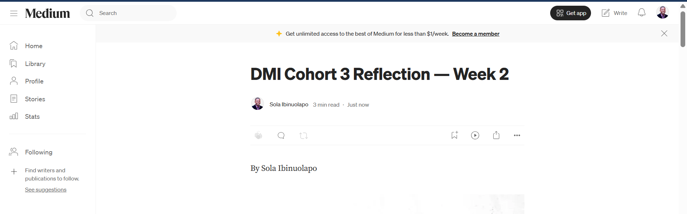
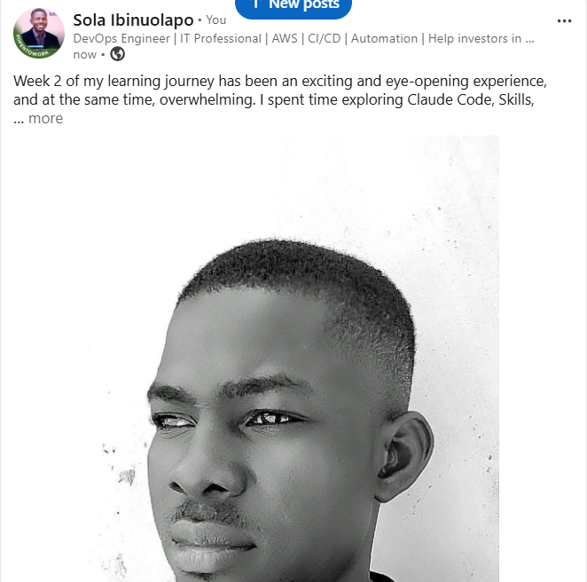

# Assignment 8 — Week 2 Reflection Blog

Part of the DevOps Micro Internship (DMI) Cohort 3 with Agentic AI

---

# Purpose

In this assignment, you will reflect on your Week 2 learning journey and write a short blog capturing your experience working with Agentic AI tools such as Claude Code, Skills, Subagents, MCP, Hooks, Permissions, and Memory.

You will also publish a LinkedIn post summarizing your learning and share both links for evaluation.

---

# Task 1 — Write Your Reflection Blog

## Goal

Write a reflection blog covering your Week 2 learning experience.

### Blog Requirements

Your blog must include:

* Title: **Reflection – Week 2**
* Minimum 300 words
* At least 2–3 topics from Week 2 (Claude Code, Skills, Subagents, MCP, Hooks, Permissions, Memory)
* Honest personal reflection (learning, challenges, mindset)
* One habit/system you plan to implement
* Your full name clearly visible

### Allowed Platforms

You can publish your blog on:

* Hashnode
* Medium
* Dev.to
* LinkedIn Article
* GitHub Markdown file
* Substack

---

### Evidence

#### Screenshot 1 — Blog published and visible



---

### Submission Field

Blog Link: 

[`Medium post`](https://hesolaroyal.medium.com/dmi-cohort-3-reflection-week-2-9f3e1dc2128e)

---

# Task 2 — Create LinkedIn Post

## Goal

Share your Week 2 learning publicly on LinkedIn.

---

### LinkedIn Post Requirements

Your post must include:

* One screenshot from any Week 2 assignment
* Short reflection (what you learned or built)
* Required P.S. line exactly as given below

---

### Required P.S. Line (Must Include Exactly)

P.S. This post is a part of DevOps Micro Internship with Agentic AI Cohort-3 by Pravin Mishra. You can start your DevOps journey by joining this Discord community ( [https://discord.pravinmishra.com/](https://discord.pravinmishra.com/) ).

---

### Suggested Hashtags

#DMIByPravinMishra #AgenticAI #ClaudeCode #DevOps #LearningInPublic

---

### Evidence

#### Screenshot 2 — LinkedIn post published



---

### Submission Field

LinkedIn Post Content (copy-paste here):

```
Week 2 of my learning journey has been an exciting and eye-opening experience, and at the same time, overwhelming. I spent time exploring Claude Code, Skills, Subagents, MCP, Hooks, Permissions, and Memory, and each topic helped me understand how powerful and intentional modern tools can be when used thoughtfully.

What stood out most to me is that learning is not only about gaining new knowledge but also about building better habits, improving how I work, and becoming more reflective in the process. One of the biggest challenges this week was delaying watching the learning videos until the end before starting the assignment. I know for sure that I am improving; a big thanks to Joy Ukpabi  Anjana Muthunayake Nkechi Anna Ahanonye Tanisha Borana for their guidance. Any moment from now, I must start it from sunday. my mindset to stay curious and patient instead of feeling pressured to understand everything immediately. That shift has been valuable.

One habit I plan to implement is writing short reflections after each learning session so I can capture what I learned, what challenged me, and how I can apply it moving forward.

I’m grateful for the growth that comes with each step, and I'm starting week 3 immediately because it has already been delayed. A big thanks to Pravin Mishra for this idea and vision to transform people; God is really using you mightily 

P.S. This post is part of the DevOps Micro Internship with Agentic AI Cohort 3 by Pravin Mishra. You can begin your DevOps journey by joining the DMI waiting list. (https://forms.gle/3hvrWJBDzsDeJoPs6)

#TechLeadership #CloudComputing #DevOps #AgenticAI #DigitalTransformation #Nigeria, #GovTech, #CloudArchitect, #TerraformCertified, #NigerianTechDiaspora, #PublicSectorInnovation #hesolaroyal #NationalTreasure #DMI #DMIByPravinMishra #AgenticAI #ClaudeCode #DevOps #LearningInPublic
```

---

### LinkedIn Post Link:

[`Linkedin Post`](https://www.linkedin.com/posts/solaibinuolapo_techleadership-cloudcomputing-devops-share-7483045008934219776-OrVL/?utm_source=share&utm_medium=member_desktop&rcm=ACoAADUrROwBSs3BHxwzwdeWVUk2kf9iszgkWjM)

---

# Submission Instructions

* Blog must be publicly accessible
* LinkedIn post must be visible (public or unlisted where applicable)
* All required fields must be filled
* Screenshot proofs must be added to GitHub repository
* Do not include sensitive information in blog or post

---

# Completion Checklist

* [ ] Blog written with required structure
* [ ] Blog includes at least 2–3 Week 2 topics
* [ ] Blog is publicly accessible
* [ ] LinkedIn post created
* [ ] Required P.S. line included
* [ ] LinkedIn post content copied in submission field
* [ ] Blog link added
* [ ] LinkedIn post link added
* [ ] Screenshots added to GitHub repo

---

# About DMI & CloudAdvisory

DevOps Micro Internship (DMI) is a project-based DevOps program run by Pravin Mishra (The CloudAdvisory), focused on real-world execution, systems thinking, and agentic AI workflows.

It helps learners build strong DevOps foundations through hands-on experience.

---

# Resources

* 🌐 DMI Official Website: [https://pravinmishra.com/dmi](https://pravinmishra.com/dmi)
* 🎓 DevOps for Beginners (Udemy): [https://www.udemy.com/course/devops-for-beginners-docker-k8s-cloud-cicd-4-projects/](https://www.udemy.com/course/devops-for-beginners-docker-k8s-cloud-cicd-4-projects/)
* 🎓 Agentic AI DevOps with Claude Code: [https://www.udemy.com/course/ultimate-agentic-ai-devops-with-claude-code/](https://www.udemy.com/course/ultimate-agentic-ai-devops-with-claude-code/)
* 🎓 DevOps with Claude Code: Terraform, EKS, ArgoCD & Helm: [https://www.udemy.com/course/devops-with-claude-code-terraform-eks-argocd-helm/](https://www.udemy.com/course/devops-with-claude-code-terraform-eks-argocd-helm/)
* ▶️ YouTube Playlist: [https://www.youtube.com/playlist?list=PLFeSNDtI4Cho](https://www.youtube.com/playlist?list=PLFeSNDtI4Cho)
* 🔗 Pravin Mishra (LinkedIn): [https://www.linkedin.com/in/pravin-mishra-aws-trainer/](https://www.linkedin.com/in/pravin-mishra-aws-trainer/)
* 🏢 CloudAdvisory (LinkedIn): [https://www.linkedin.com/company/thecloudadvisory/](https://www.linkedin.com/company/thecloudadvisory/)

