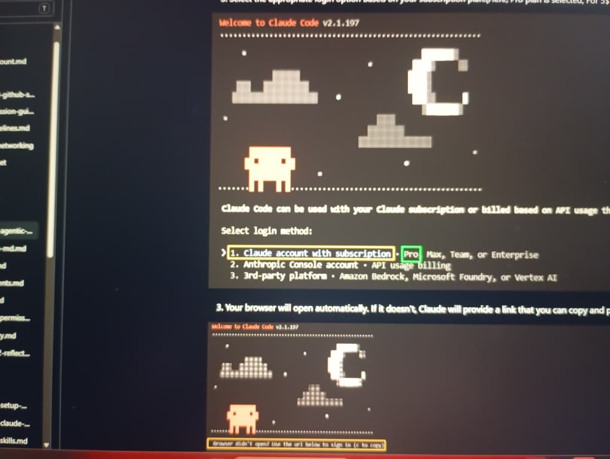

# Assignment 8 — Week 2 Reflection Blog

Part of the DevOps Micro Internship (DMI) Cohort 3 with Agentic AI

---

# Purpose

In this assignment, you will reflect on your Week 2 learning journey and write a short blog capturing your experience working with Agentic AI tools such as Claude Code, Skills, Subagents, MCP, Hooks, Permissions, and Memory.

You will also publish a LinkedIn post summarizing your learning and share both links for evaluation.

---

# Task 1 — Write Your Reflection Blog

## Goal

Write a reflection blog covering your Week 2 learning experience.

### Blog Requirements

Your blog must include:

* Title: **Reflection – Week 2**
* Minimum 300 words
* At least 2–3 topics from Week 2 (Claude Code, Skills, Subagents, MCP, Hooks, Permissions, Memory)
* Honest personal reflection (learning, challenges, mindset)
* One habit/system you plan to implement
* Your full name clearly visible

### Allowed Platforms

You can publish your blog on:

* Hashnode
* Medium
* Dev.to
* LinkedIn Article
* GitHub Markdown file
* Substack

---

### Evidence

#### Screenshot 1 — Blog published and visible

.

---

### Submission Field

Blog Link:

**https://medium.com/@poffor762/my-biggest-technical-insight-this-week-ai-works-best-when-it-has-context-254f5347c319**

---

# Task 2 — Create LinkedIn Post

## Goal

Share your Week 2 learning publicly on LinkedIn.

---

### LinkedIn Post Requirements

Your post must include:

* One screenshot from any Week 2 assignment
* Short reflection (what you learned or built)
* Required P.S. line exactly as given below

---

### Required P.S. Line (Must Include Exactly)

P.S. This post is a part of DevOps Micro Internship with Agentic AI Cohort-3 by Pravin Mishra. You can start your DevOps journey by joining this Discord community ( [https://discord.pravinmishra.com/](https://discord.pravinmishra.com/) ).

---

### Suggested Hashtags

#DMIByPravinMishra #AgenticAI #ClaudeCode #DevOps #LearningInPublic

---

### Evidence

#### Screenshot 2 — LinkedIn post published

---

### Submission Field

LinkedIn Post Content (💡  I'm reflecting on how much my perspective on AI and DevOps has evolved, as Week 2 comes to a close.

◽ This week was more about understanding how to build smarter and more consistent engineering workflows. Working with Claude Code, Skills, and Memory showed me that effective AI-assisted development is driven by clear instructions, reusable workflows, and well-defined project context, not just better prompts.

◽ One of the biggest lessons I learned is that documentation is an essential part of engineering. Files like CLAUDE.md and project memory help ensure consistency across sessions, while reusable skills simplify repetitive tasks and make workflows more reliable.

◽ I encountered challenges,  failed commands, configuration issues, and moments where I had to slow down, carefully read the documentation, and troubleshoot step by step. Those experiences strengthened both my technical confidence and my problem-solving approach.

◽ My biggest takeaway from Week 2 is that becoming a better DevOps Engineer isn't just about learning more commands, it's about building systems, developing disciplined habits, and embracing continuous improvement.

Its been an incredible learning journey with Pravin Mishra, for creating such a practical and engaging learning experience. I'm equally grateful to our Lead Co-Mentor, Anjana Muthunayake, and our Group Co-Mentors,Bhupendra Bhati, Ranbir Kaur, and Greg Odi, for their continuous guidance, encouragement, and support throughout this journey.

📸 Sharing my Week 2 assignment screenshots below as part of this learning milestone.

P.S. This post is a part of DevOps Micro Internship with Agentic AI Cohort-3 by Pravin Mishra. You can start your DevOps journey by joining this Discord community 

🔗 ( https://lnkd.in/eKxkzSht ).

#DMIByPravinMishra #AgenticAI #ClaudeCode #DevOps #LearningInPublic

 Peace Nwadinachi Offor):

---

### LinkedIn Post Link:

**https://www.linkedin.com/posts/peace-offor-aa736a147_devops-cloudcomputing-tech-share-7481292200098807808-imD9/?utm_source=share&utm_medium=member_desktop&rcm=ACoAACN4g58BM2OoiPOU_M6YmR_9gplw4hlL_RQ**

---

# Submission Instructions

* Blog must be publicly accessible
* LinkedIn post must be visible (public or unlisted where applicable)
* All required fields must be filled
* Screenshot proofs must be added to GitHub repository
* Do not include sensitive information in blog or post

---

# Completion Checklist

* [ ] Blog written with required structure
* [ ] Blog includes at least 2–3 Week 2 topics
* [ ] Blog is publicly accessible
* [ ] LinkedIn post created
* [ ] Required P.S. line included
* [ ] LinkedIn post content copied in submission field
* [ ] Blog link added
* [ ] LinkedIn post link added
* [ ] Screenshots added to GitHub repo

---

# About DMI & CloudAdvisory

DevOps Micro Internship (DMI) is a project-based DevOps program run by Pravin Mishra (The CloudAdvisory), focused on real-world execution, systems thinking, and agentic AI workflows.

It helps learners build strong DevOps foundations through hands-on experience.

---

# Resources

* 🌐 DMI Official Website: [https://pravinmishra.com/dmi](https://pravinmishra.com/dmi)
* 🎓 DevOps for Beginners (Udemy): [https://www.udemy.com/course/devops-for-beginners-docker-k8s-cloud-cicd-4-projects/](https://www.udemy.com/course/devops-for-beginners-docker-k8s-cloud-cicd-4-projects/)
* 🎓 Agentic AI DevOps with Claude Code: [https://www.udemy.com/course/ultimate-agentic-ai-devops-with-claude-code/](https://www.udemy.com/course/ultimate-agentic-ai-devops-with-claude-code/)
* 🎓 DevOps with Claude Code: Terraform, EKS, ArgoCD & Helm: [https://www.udemy.com/course/devops-with-claude-code-terraform-eks-argocd-helm/](https://www.udemy.com/course/devops-with-claude-code-terraform-eks-argocd-helm/)
* ▶️ YouTube Playlist: [https://www.youtube.com/playlist?list=PLFeSNDtI4Cho](https://www.youtube.com/playlist?list=PLFeSNDtI4Cho)
* 🔗 Pravin Mishra (LinkedIn): [https://www.linkedin.com/in/pravin-mishra-aws-trainer/](https://www.linkedin.com/in/pravin-mishra-aws-trainer/)
* 🏢 CloudAdvisory (LinkedIn): [https://www.linkedin.com/company/thecloudadvisory/](https://www.linkedin.com/company/thecloudadvisory/)

