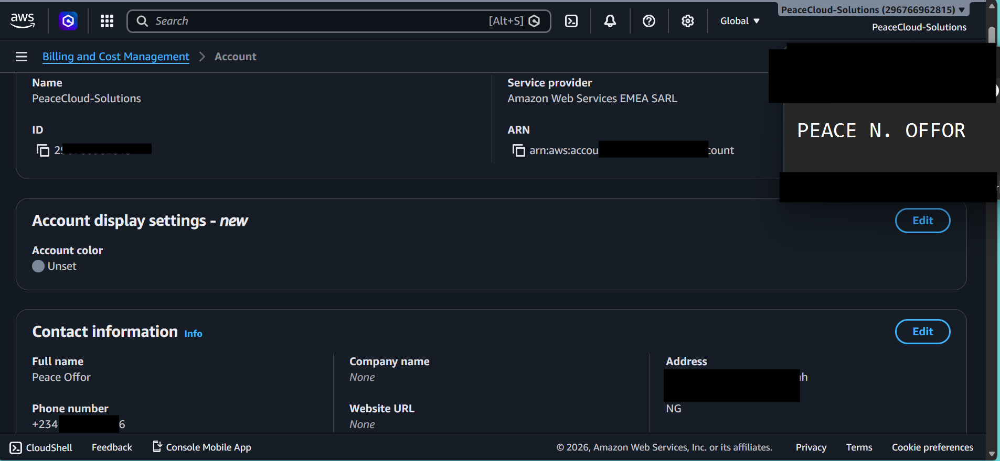

# Assignment 1 — AWS Free Tier Account Setup (EpicReads Cloud Onboarding)

Part of the DevOps Micro Internship (DMI) Cohort 3 with Agentic AI

---

## Purpose

In this assignment, you will create and verify an AWS Free Tier account as part of onboarding EpicReads — an online bookstore moving to the cloud. You will demonstrate an understanding of AWS fundamentals, Free Tier services, and account setup by answering conceptual questions and capturing proof of a working AWS Console login.

---

# Task 1 — Understanding AWS & Free Tier

## Goal

Demonstrate understanding of AWS basics and Free Tier usage by answering the following questions in your own words (3–4 lines each).

### Answers

#### Question 1 — What is an AWS account, and why do you need it at this stage?

An AWS account gives me access to Amazon Web Services, where I can create, manage, and experiment with cloud resources such as virtual servers, storage, and databases. At this stage, I need it to gain practical, hands-on experience rather than relying only on theoretical knowledge. It also allows me to use the AWS Free Tier so I can learn and build cloud projects while keeping costs to a minimum..

---

#### Question 2 — What is AWS Free Tier, and how long does it last?

The AWS Free Tier is a program that allows me to use selected AWS services at no cost within specific usage limits. It helps me learn, practice, and build cloud projects without incurring unnecessary expenses. Most Free Tier benefits last for 12 months after I create my AWS account, while some services remain free indefinitely and others offer short-term free trials.

---

#### Question 3 — Name three AWS Free Tier services and their free usage limits.

1. Amazon EC2 – I can use up to 750 hours per month of eligible `t2.micro` or `t3.micro` instances (depending on the region) during the 12-month Free Tier period.

2. Amazon S3 – I get 5 GB of Standard Storage, along with limited requests and data transfer each month under the 12-month Free Tier.

3. Amazon RDS – I can use up to 750 hours per month of a single eligible database instance, plus 20 GB of database storage and 20 GB of backup storage** during the 12-month Free Tier period.

---

# Task 2 — Create AWS Free Tier Account

## Goal

Create a valid AWS Free Tier account and sign in to the AWS Management Console.

> No screenshots required for this task. Completion is verified through Task 3.

---

# Task 3 — Verify AWS Account

## Goal

Confirm that your AWS account setup is complete by navigating to the Account section and capturing proof.

### Evidence

#### Screenshot 1 — AWS Account page showing account name (email may be blurred)

.

---

# Submission Instructions

- Add all required screenshots in your GitHub repository submission
- Full name must be visible in required screenshots
- Do not expose sensitive information (keys, passwords, account IDs)

---

# Completion Checklist

- [-] Task 1 answers written in own words
- [-] AWS Free Tier account created successfully
- [-] Signed in to AWS Management Console
- [-] Screenshot of AWS Account page captured (full name visible, no sensitive data)
- [-] All required screenshots added to repository

---

## 📌 About DMI & CloudAdvisory

DevOps Micro Internship (DMI) is a project-based DevOps program run by Pravin Mishra (The CloudAdvisory) focused on real-world execution, systems thinking, and career readiness.

It helps learners build strong DevOps foundations with hands-on experience.

---

## 📌 Resources

- 🌐 DMI Official Website: https://pravinmishra.com/dmi  
- 🎓 DevOps for Beginners (Udemy): https://www.udemy.com/course/devops-for-beginners-docker-k8s-cloud-cicd-4-projects/  
- 🎓 Agentic AI DevOps with Claude Code: https://www.udemy.com/course/ultimate-agentic-ai-devops-with-claude-code/  
- 🎓 DevOps with Claude Code: Terraform, EKS, ArgoCD & Helm: https://www.udemy.com/course/devops-with-claude-code-terraform-eks-argocd-helm/  
- ▶️ YouTube Playlist: https://www.youtube.com/playlist?list=PLFeSNDtI4Cho  
- 🔗 Pravin Mishra (LinkedIn): https://www.linkedin.com/in/pravin-mishra-aws-trainer/  
- 🏢 CloudAdvisory (LinkedIn): https://www.linkedin.com/company/thecloudadvisory/

---

*This submission is part of DevOps Micro Internship (DMI) Cohort 3 — Agentic AI Track.*