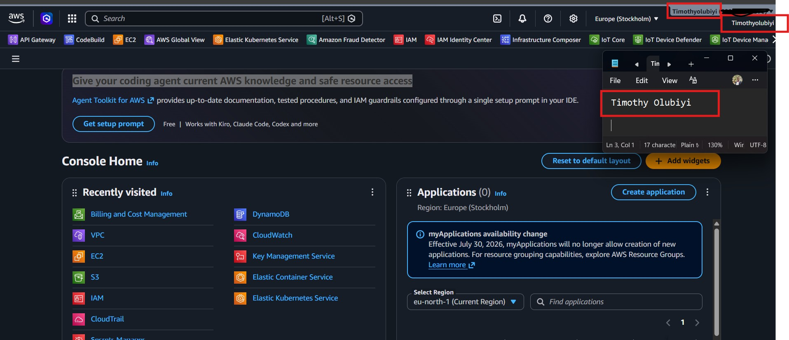

# Assignment 1 — AWS Free Tier Account Setup (EpicReads Cloud Onboarding)

Part of the DevOps Micro Internship (DMI) Cohort 3 with Agentic AI

---

## Purpose

In this assignment, you will create and verify an AWS Free Tier account as part of onboarding EpicReads — an online bookstore moving to the cloud. You will demonstrate an understanding of AWS fundamentals, Free Tier services, and account setup by answering conceptual questions and capturing proof of a working AWS Console login.

---

# Task 1 — Understanding AWS & Free Tier

## Goal

Demonstrate understanding of AWS basics and Free Tier usage by answering the following questions in your own words (3–4 lines each).

### Answers

#### Question 1 — What is an AWS account, and why do you need it at this stage?

AWS account is a secure account that provides access to AWS's cloud platform and its wide range of cloud services, including computing, storage, databases, networking, security, and monitoring.

At this stage, an AWS account is needed because it serves as the foundation for all cloud-based learning and practical exercises. It allows me to access the AWS Management Console, use eligible Free Tier services, and complete hands-on labs without requiring on-premises infrastructure.

For the EpicReads onboarding project, having an AWS account enables me to:

- Access the AWS Management Console.
- Create and manage cloud resources using AWS Free Tier services.
- Complete practical cloud and DevOps assignments.
- Gain hands-on experience with core AWS services such as EC2, S3, IAM, and VPC.
- uild practical cloud skills and prepare for AWS certifications and real-world projects.

---

#### Question 2 — What is AWS Free Tier, and how long does it last?

AWS Free Tier offered by Amazon Web Services allows new users to explore and use selected AWS services at no cost, within specified usage limits. It help users learn AWS, build applications, and experiment with cloud services without incurring charges, provided they stay within the Free Tier limits.

It is 12-month AWS Free Tier, which begins when you create your AWS account. To avoid unexpected charges, you should monitor your usage and ensure it stays within the Free Tier limits

---

#### Question 3 — Name three AWS Free Tier services and their free usage limits.

  AWS Service	                       Free Tier Usage Limit
1. Amazon EC2: 750 hours per month of a t2.micro or t3.micro instance   (depending on the Region) for the first 12 months.

2. Amazon S3:  5 GB of Standard Storage, 20,000 GET requests, and 2,000 PUT/COPY/POST/LIST requests per month for the first 12 months.

3. Amazon RDS: 750 hours per month of a db.t3.micro (or db.t2.micro in some Regions) database instance, plus 20 GB of General Purpose (SSD) storage and 20 GB of backup storage for the first 12 months.
---

# Task 2 — Create AWS Free Tier Account

## Goal

Create a valid AWS Free Tier account and sign in to the AWS Management Console.

> No screenshots required for this task. Completion is verified through Task 3.

---

# Task 3 — Verify AWS Account

## Goal

Confirm that your AWS account setup is complete by navigating to the Account section and capturing proof.

### Evidence

#### Screenshot 1 — AWS Account page showing account name (email may be blurred)

---

# Submission Instructions

- Add all required screenshots in your GitHub repository submission
- Full name must be visible in required screenshots
- Do not expose sensitive information (keys, passwords, account IDs)

---

# Completion Checklist

- [✅] Task 1 answers written in own words
- [✅] AWS Free Tier account created successfully
- [✅] Signed in to AWS Management Console
- [✅] Screenshot of AWS Account page captured (full name visible, no sensitive data)
- [✅] All required screenshots added to repository

---

## 📌 About DMI & CloudAdvisory

DevOps Micro Internship (DMI) is a project-based DevOps program run by Pravin Mishra (The CloudAdvisory) focused on real-world execution, systems thinking, and career readiness.

It helps learners build strong DevOps foundations with hands-on experience.

---

## 📌 Resources

- 🌐 DMI Official Website: https://pravinmishra.com/dmi  
- 🎓 DevOps for Beginners (Udemy): https://www.udemy.com/course/devops-for-beginners-docker-k8s-cloud-cicd-4-projects/  
- 🎓 Agentic AI DevOps with Claude Code: https://www.udemy.com/course/ultimate-agentic-ai-devops-with-claude-code/  
- 🎓 DevOps with Claude Code: Terraform, EKS, ArgoCD & Helm: https://www.udemy.com/course/devops-with-claude-code-terraform-eks-argocd-helm/  
- ▶️ YouTube Playlist: https://www.youtube.com/playlist?list=PLFeSNDtI4Cho  
- 🔗 Pravin Mishra (LinkedIn): https://www.linkedin.com/in/pravin-mishra-aws-trainer/  
- 🏢 CloudAdvisory (LinkedIn): https://www.linkedin.com/company/thecloudadvisory/

---

*This submission is part of DevOps Micro Internship (DMI) Cohort 3 — Agentic AI Track.*