# Assignment 3 — Production Maintenance Drill (OPS Checklist)

Part of the DevOps Micro Internship (DMI) Cohort 3 with Agentic AI

---

## Purpose

In this assignment, you will treat your already deployed React application (on Ubuntu VM with Nginx) as a live production system. You will perform structured operational checks covering network validation, service health, log analysis, resource monitoring, configuration verification, and incident simulation with recovery — mirroring real on-call DevOps responsibilities.

---

# Task 1 — Server Access & Networking Validation

## Goal

Verify that the deployed React application is reachable from the browser and confirm basic network connectivity of the Ubuntu VM.

### Evidence

#### Screenshot 1 — Browser showing the React app with your Full Name visible on the UI

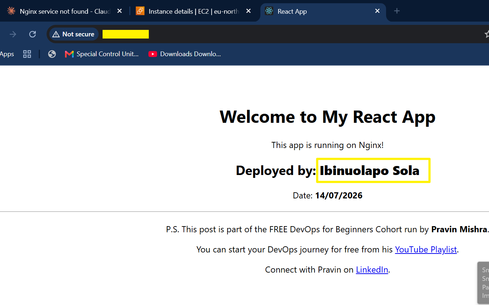

---

#### Screenshot 2 — Output of `ip a`

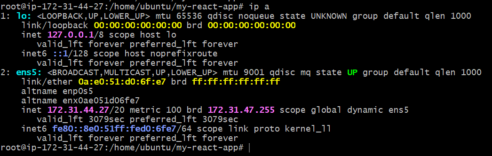

---

#### Screenshot 3 — Output of `sudo ss -tulpen`

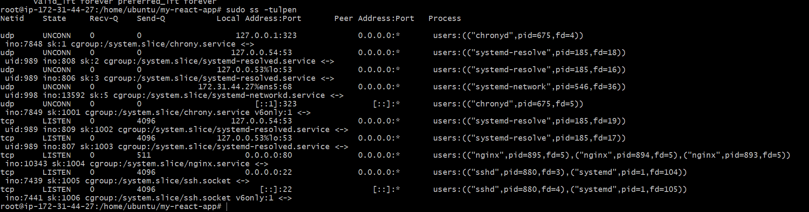

---

#### Screenshot 4 — Output of `sudo ufw status`

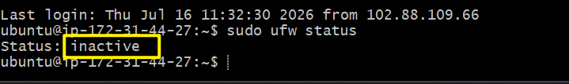

---

### Notes

Answer the following in your own words:

**1. What proves Nginx is listening on 0.0.0.0:80?**

`sudo ss -tulpen` is what will show what port nginx is listening to and other port that your server open to probably you don't know. I t will also show the process ID of which port is listening to `"nginx",pid=895,fd=5`, nginx is confirmed witht the process ID. not just open, the socket is actilvely open incoming connection. 

---

**2. What proves SSH is active on port 22?**

For us to be able to connect to our local machine using EC2 instance means `port 22` is acrive. showing the server nd username like this "ubuntu@ip-172-**-44-27:~$". 
secondly, using this command `sudo ss -tulpen` also give us proof of its active listening to port 22, and `sshd` is reachable and working.
---

**3. Did you find any unexpected open ports? Explain briefly.**

Yes, This is chronyd, the system's time-sync daemon (like NTP). It listens on UDP port 323, but only on 127.0.0.1 (localhost), meaning it only talks to processes on the same machine, not the outside network. Port 323 is chrony's internal monitoring/control port (used by tools like chronyc to check sync status), not something used for actual internet time-syncing (that happens outbound on port 123, not shown here since it's not a listening socket).

---

# Task 2 — Service Health & Systemd Validation (Nginx)

## Goal

Verify that Nginx is properly installed, running, enabled at boot, and safely configured.

### Evidence

#### Screenshot 1 — Output of `systemctl status nginx --no-pager`

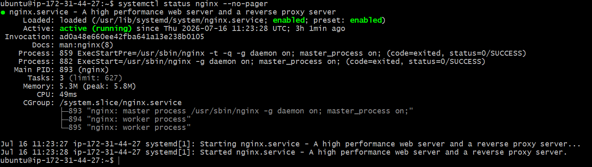

---

#### Screenshot 2 — Output of `sudo nginx -t`

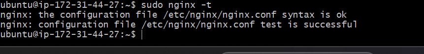

---

#### Screenshot 3 — Output of `sudo ss -lptn '( sport = :80 )'`

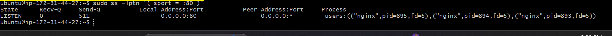

---

### Notes

Answer the following in your own words:

**1. What happens if Nginx fails to restart in production?**

what i can think of is the configuration which actually happen to me before i could figure it out. I Went to point nginx at the build folder... and broke the config. Turns out I'd pasted a full shell command (echo + tee) directly into the config file instead of running it in the terminal. nginx had no idea what to do with "echo 'server {"
I also encountered changes in Ip adress which was part of of what i have to sync. I also use the commands `sudo nginx -t` which shows something is wrong.
---

**2. What's your basic rollback plan?**

When I found out the configuration was wrong I had to delete it and input the correct one.
I rewrote the config properly, pointing root at the build directory with a try_files fallback for React Router, Then hit the classic EC2, public IP changes on restart if you don't have an Elastic IP attached. Chased my own tail for a bit testing an IP that no longer existed. 

then i use the commands for texting `sudo nginx -t` which confirm it was configure perfectly. 

---

# Task 3 — Logs & Request Trace

## Goal

Verify real traffic flow and analyze logs to understand system behavior and errors.

### Evidence

#### Screenshot 1 — Output of `sudo tail -n 30 /var/log/nginx/access.log`

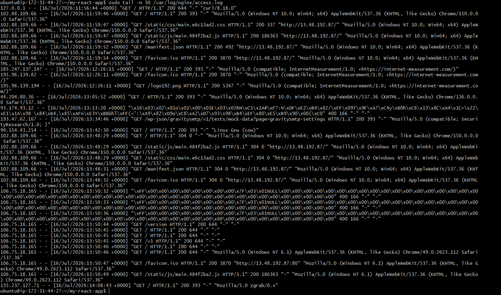

---

#### Screenshot 2 — Output of `sudo tail -n 30 /var/log/nginx/error.log`

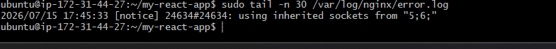

---

#### Screenshot 3 — Output of `sudo journalctl -u nginx --no-pager -n 50`

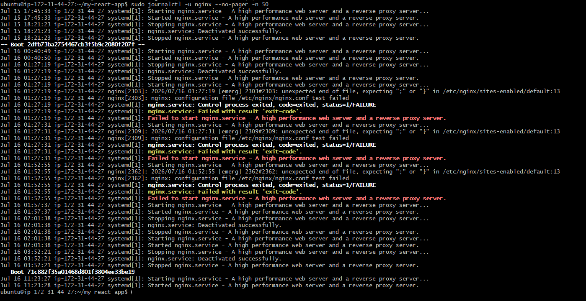

---

### Notes

Answer the following in your own words:

**1. Were there any errors in the logs?**

- If yes, mention 1–2 example error lines from the logs and explain what each one means in simple terms.
- If no, explain what it means if the error log is empty or shows no recent errors during your check.

This is not an error, it's just a normal notice. Nginx labels messages by importance level `(notice, warn, error, crit)`, and notice is the lowest, harmless level. This particular message simply means that when nginx restarted, it reused its existing network connections instead of creating new ones, so that no requests were interrupted during the restart.

What it means that the log had no real errors:
An empty or error-free log is a good sign. It means nginx has been running smoothly, no crashes, no missing files, no permission problems, and no failed requests. Since I had already confirmed that nginx was correctly serving my React app (correct files in place, correct configuration, and successful responses when tested), the clean error log simply confirms that everything is working the way it should, with nothing left unresolved.
---

**2. If there were no errors, what does that indicate about the system?**

An error-free log is a good sign. it means the system is healthy and working as expected, and there's nothing currently that needs to be fixed or investigated further.

---

**3. Based on the access logs, were your curl requests visible in the log entries? What does that prove about traffic flow?**

I can tell it's my curl command because of two things: the address (`127.0.0.1 (which means "localhost"`. the request came from the server itself), and the "curl/8.18.0" at the end, which identifies the exact tool used to make the request. The 200 means the request succeeded.

What this proves about traffic flow?
It proves that nginx correctly logs every request it receives, no matter where the request comes from, whether it's a command I typed on the server itself, or a real visitor from somewhere else on the internet. This confirms that the request path is working end-to-end. my curl command reached nginx, nginx processed it, and it recorded the result in the log with an accurate status code.
This also gives me something to compare against. Right after my own curl line, I can see real external visitors reaching the site too, like:
`102.88.109.66 - - [16/Jul/2026:11:59:46 +0000] "GET / HTTP/1.1" 200 393 "-" "Mozilla/5.0 ..."`
Seeing both my own local test and genuine outside traffic in the same log, both returning 200 OK, proves that the whole chain is working — from the browser making a request, through the internet, into the server, and successfully served by nginx. It's not just working locally; it's actually reachable and functioning for real users too.

---

# Task 4 — System Resource Health Check (Capacity Red Flags)

## Goal

Assess server capacity and detect potential performance or failure risks.

### Evidence

#### Screenshot 1 — Output of `uptime`

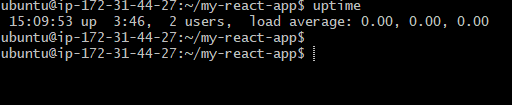

---

#### Screenshot 2 — Output of `free -h`

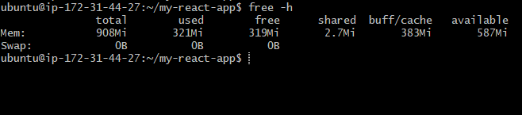

---

#### Screenshot 3 — Output of `df -h`

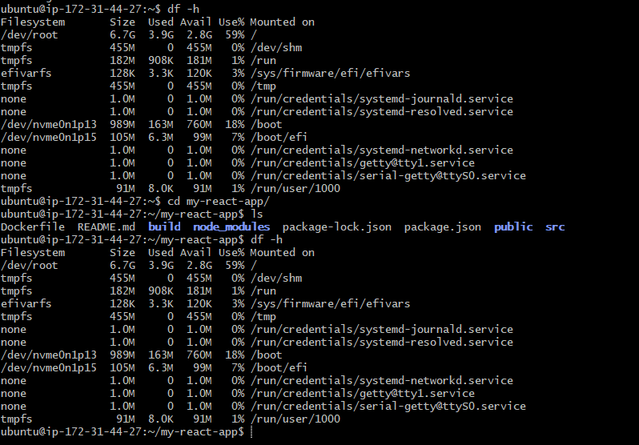

---

#### Screenshot 4 — Output of `sudo du -sh /var/* | sort -h`

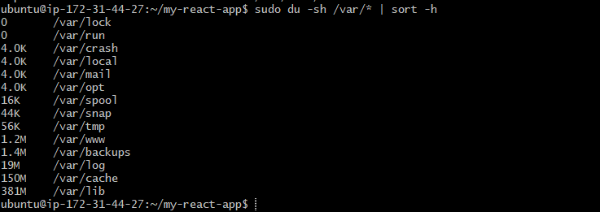

---

### Notes

Answer the following in your own words:

**1. Which resource looks most critical right now? (CPU/load, memory, or disk) Explain why.**

Out of the three, disk space is the resource to watch most closely, even though nothing is in a bad state yet.
Here's the reasoning for each:

CPU/load: completely healthy. The load average was 0.00, 0.00, 0.00, meaning the server is sitting idle with no processes waiting for CPU time. Not a concern at all right now.
Memory: also healthy. Out of 908MB total RAM, only 321MB is in use, and 587MB is still available. Swap usage is 0B, meaning the server isn't struggling to find memory. Plenty of headroom here too.
Disk: this is the one with the least breathing room. The main volume (/dev/root) is a 6.7GB disk, and it's already 59% full, leaving only 2.8GB free. Compared to memory (which still has roughly 65% free) and CPU (0% load), disk is proportionally the most "used up" resource on this server.

Why this matters going forward: unlike CPU and memory, which free up automatically once a process finishes, disk space only grows over time unless something is deleted. Every new npm run build, every new project cloned, every log file that accumulates, and every system update adds to that 59%, it doesn't reset. If this server keeps being used for more projects or builds without ever clearing old files, disk space is the resource most likely to become a real problem first, simply because it has the smallest remaining margin and no natural way to shrink back down.

---

**2. What happens if disk becomes 100% full in a production server?**

A full disk doesn't just mean "no more storage", it can overturn into log failures, service crashes, database corruption, and a server that becomes very difficult to even fix remotely, since the tools needed to diagnose and repair the problem also need disk space to run. This is why keeping disk usage well below 100% (with monitoring and alerts, ideally) is considered a critical part of running any production server.

---

# Task 5 — Configuration & Deployment Verification

## Goal

Ensure the correct React build is deployed and Nginx is serving it properly.

### Evidence

#### Screenshot 1 — Output of `ls -lah /var/www/html | head -n 20`

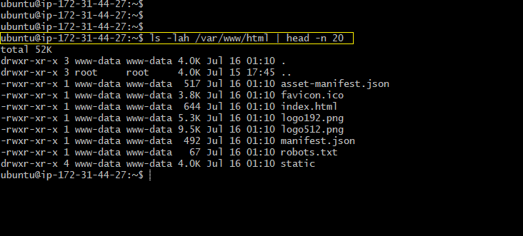

---

#### Screenshot 2 — Output of `grep -R "Deployed by" -n /var/www/html 2>/dev/null | head`

`The Screenshot is much but few below`
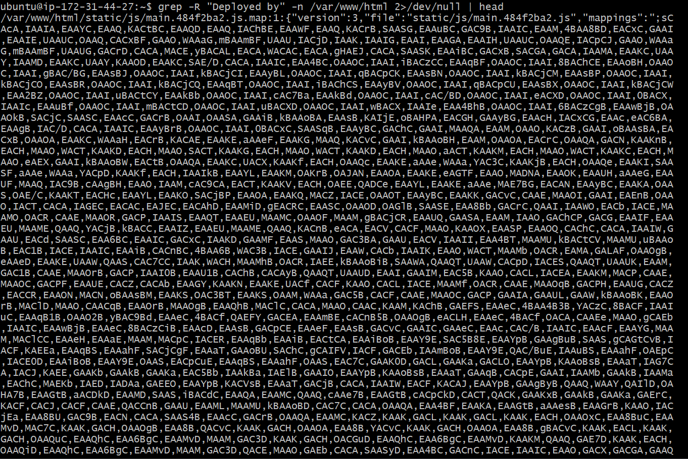
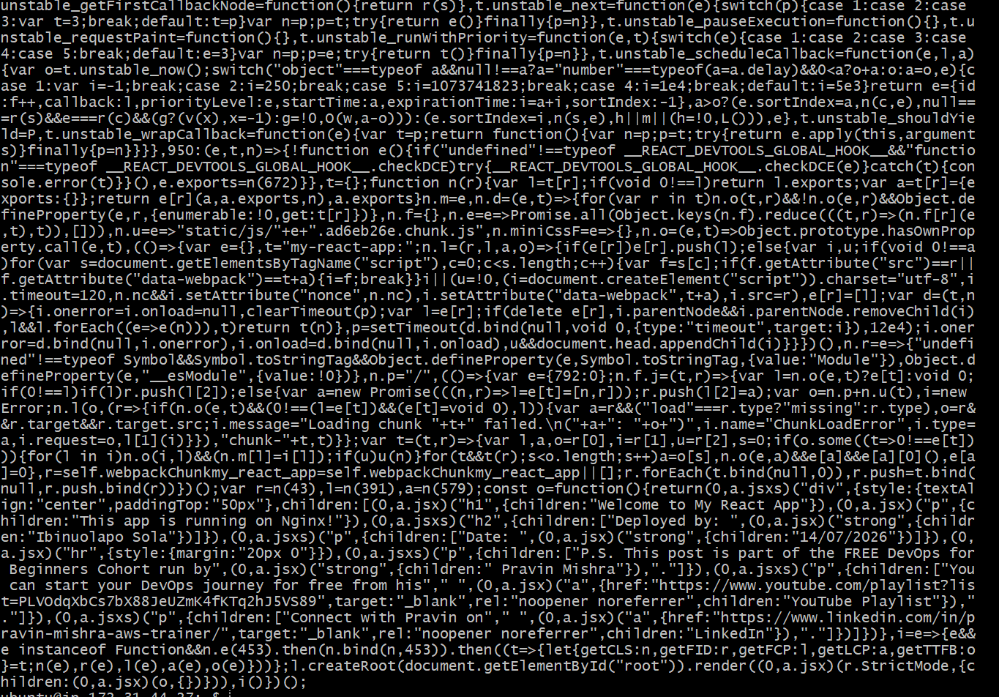

---

#### Screenshot 3 — Output of `grep -n "try_files" /etc/nginx/sites-available/default`

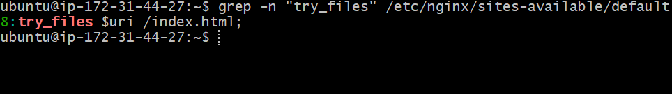

---

### Notes

Answer the following in your own words:

**1. How do you confirm that the correct version of the application is deployed?**

To confirm that the correct version of my React app is actually running on the server, I can check a few things:

1. Check the build folder's timestamp. Running `ls -la build/ (or ls -la /var/www/html/)` shows when the files were last modified. If I just made changes and rebuilt, the timestamp should match the time I ran npm run build, confirming the newest version was actually copied over.
2. Check the filenames of the static assets. React's build process generates unique hashed filenames for JS and CSS files every time you build, like `main.484f2ba2.js. If I make a change to my code and rebuild, this hash changes. So by comparing the filename currently being served ``(checked with curl -s http://localhost | grep static)` against the filename in my latest local build, I can confirm whether the server is serving the old version or the new one.
3. Test the actual content in the browser. If I added a visible change (like new text or a new button), I can simply open the site in the browser and check if that change appears. If it doesn't show up, the old build is probably still being served, possibly due to browser caching or the new files not being copied over correctly.
4. Force a hard refresh or clear cache. Sometimes the correct version is deployed, but the browser is showing a cached older version. Doing a hard refresh `(Ctrl+Shift+R)` rules this out.
Check version control, if used. If the project is tracked with Git, running `git log -1` on the server shows the exact commit currently deployed, which I can compare to what's expected.

---

# Task 6 — Nginx Configuration Failure Simulation

## Goal

Simulate a real-world Nginx misconfiguration and recover the service safely.

### Evidence

#### Screenshot 1 — Output of `sudo nginx -t` showing the syntax error (broken config)

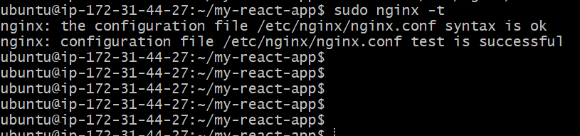

---

#### Screenshot 2 — Output of `sudo nginx -t` showing syntax ok (fixed config)

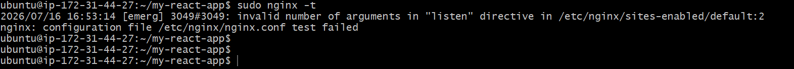

---

#### Screenshot 3 — Output of `curl -I http://<public-ip>` confirming recovery (200 OK)

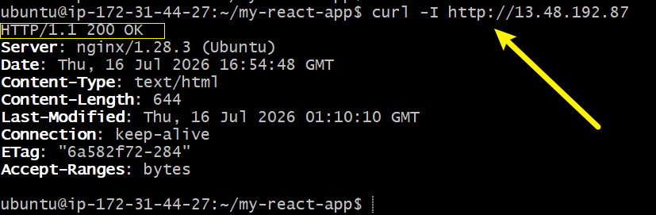

---

### Notes

Answer the following in your own words:

**1. What caused the configuration failure?**

I remove the server port `80`, immediately it is saying error... and when i added it back it shows working. 

---

**2. How did you fix the issue?**

Write your answer here.

---

**3. How can you avoid this kind of issue in real production systems?**

I use `sudo nano /etc/nginx/sites-available/default` to check the configuration, and when i spot the error, I resolved it. I make sure none of the syntax was missing.

---

# Task 7 — Web Application Failure Simulation

## Goal

Simulate missing deployment content and recover the application safely.

### Evidence

#### Screenshot 1 — Output of `curl -I http://<public-ip>` showing failure (non-200 response)

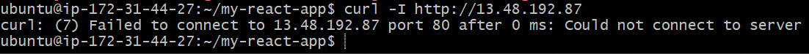

---

#### Screenshot 2 — Output of `curl -I http://<public-ip>` confirming recovery (200 OK)

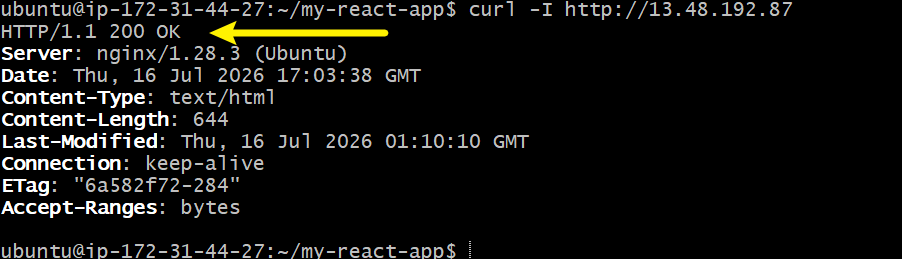

---

### Notes

Answer the following in your own words:

**1. What caused the application to break in this scenario?**

The application broke because of a syntax error introduced while editing the nginx configuration file. After running `sudo nano /etc/nginx/sites-available/default` to make a change, testing the config with `sudo nginx -t` returned:

nginx: [emerg] invalid number of arguments in "listen" directive in /etc/nginx/sites-enabled/default:2

This means the `listen` directive on line 2 of the config file had the wrong number of arguments — most likely something like a missing semicolon, an extra or missing value after listen, or a stray character accidentally typed while editing. Because nginx failed its own configuration test, when `sudo systemctl restart nginx` was run, the restart failed too ("Job for nginx.service failed because the control process exited with error code"), and the site briefly went completely down — confirmed by:

`curl: (7) Failed to connect to 13.48.192.87 port 80 after 0 ms: Could not connect to server`

At that point nginx wasn't running at all, so there was nothing listening on port 80 to respond to requests.

---

**2. How did you fix the issue and restore the application?**

The fix was to go back into the configuration file, correct the broken `listen` line, and verify the fix before attempting to restart the service again:

1. Reopened the file: `sudo nano /etc/nginx/sites-available/default`
2. Corrected the syntax error in the listen directive
3. Restarted nginx: `sudo systemctl restart nginx`
4. Confirmed the fix worked with: `curl -I http://13.48.192.87, which returned a clean HTTP/1.1 200 OK` again

The key lesson from the log is the importance of running `sudo nginx -t` before restarting nginx — this test catches syntax errors ahead of time, without ever taking the live service down. In this case, the config test had already caught the error, but the restart was attempted anyway. Once the file was corrected and the config was clean, nginx restarted successfully and the site was reachable again.

---

**3. What steps would you take to prevent this kind of issue in real production systems?**

- I will always run `sudo nginx -t` after every config change, before restarting or reloading. This validates the syntax without touching the live service, so a broken config never gets a chance to take the site down.
- I will Use `systemctl reload nginx` instead of restart where possible. Reload applies config changes without fully stopping the service, reducing downtime risk if something is wrong.
- Keep a backup of the working config before editing `(e.g. sudo cp default default.bak)`, so a broken edit can be instantly reverted instead of debugged under pressure.
Edit configs in a staging/test environment first, rather than directly on the live production server, so mistakes never affect real users.
- Use version control (Git) for configuration files, so every change is tracked and any bad edit can be rolled back to a known-good version.
- Set up monitoring/alerts (e.g. a simple uptime checker) that immediately notifies you if the server stops responding, so downtime is caught in seconds rather than discovered manually.

---

# Task 8 — Security & Reliability Review

## Goal

Review and reflect on the security and reliability practices applied during this assignment.

### Security & Reliability Notes

Answer the following in your own words:

**1. Why is SSH key-based authentication more secure than sharing passwords?**

Because the access `key phrase(.pem)` is store in your computer. Even if the person has the link to ssh in to local computer, it cannot log in because of the access key. 

---

**2. Why should only required ports be open on a production server?**

Every additional open port is one more thing that can be attacked, scanned, or exploited. Keeping only the necessary ports open (like 80 and 22) minimizes risk without sacrificing any functionality the server actually needs.

---

**3. Why is it important for Nginx to be enabled on boot?**

there are several reasons why Nginx to be enabled on boot:
- in case anything happen to server and it turned off, it will be automatically turn on once the server isn back without need to do that mannually.
- EC2 instances (and servers in general) can reboot due to routine maintenance from the cloud provider, unexpected crashes, power issues, or even accidental restarts. If nginx isn't enabled to start automatically, the server could come back online with the operating system running fine, but the actual website completely down, with no one aware until a user reports it or someone happens to check.
- The faster a service comes back after a reboot, the shorter the outage. This is exactly why `systemctl enable` exists.

---

**4. What are the risks of sharing secrets, keys, or credentials publicly?**

- With access to credentials (like database passwords or API keys), an attacker could read, copy, modify, or delete sensitive data. user information, application data, business records, or anything else stored on or accessible through that system.
- Unauthorized access to the server or account. Anyone who obtains a leaked SSH key or password can log into the server directly, with the same level of access as the legitimate owner. In this project, the .pem file used to SSH into the EC2 instance is a perfect example, if that file were ever exposed publicly, anyone could connect to this exact server without needing a password at all.
- An attacker with access could shut down services, deploy malicious code, redirect traffic, or use the compromised server as a launching point to attack other systems potentially making the original owner's server complicit in a larger attack without their knowledge.
- It's often hard to fully undo

---

**5. Why should cloud resources be stopped or terminated when they are no longer needed?**

- Avoiding unnecessary costs. An EC2 instance, for example, is billed for every hour it's running, even if it's sitting completely idle with 0% load. A forgotten test server left running for weeks or months can quietly rack up a real bill for something nobody is even using anymore.
- Reducing the attack surface
- In a team or company setting, unused resources left running can also cause confusion for other engineers, who might not know if a server is still needed or safe to delete, leading to wasted effort or accidental disruption of something someone else depended on.

# LinkedIn Post (Required)

## Evidence

#### LinkedIn Post URL

Paste your LinkedIn post URL here:

`__________________________`

---

#### Screenshot — Published LinkedIn post

Add your screenshot here.

---

# Submission Instructions

- Add all required screenshots in your submission
- Full name must be visible in required screenshots
- Do not expose sensitive information (keys, passwords, account IDs)

---

# Completion Checklist

- [ ] Task 1: Screenshots (browser, ip a, ss -tulpen, ufw status) + Notes answered
- [ ] Task 2: Screenshots (nginx status, nginx -t, ss port 80) + Notes answered
- [ ] Task 3: Screenshots (access log, error log, journalctl) + Notes answered
- [ ] Task 4: Screenshots (uptime, free -h, df -h, du -sh) + Notes answered
- [ ] Task 5: Screenshots (ls html, grep deployed by, grep try_files) + Notes answered
- [ ] Task 6: Screenshots (nginx -t fail, nginx -t pass, curl recovery) + Notes answered
- [ ] Task 7: Screenshots (curl failure, curl recovery) + Notes answered
- [ ] Task 8: Security & Reliability Notes answered
- [ ] LinkedIn post published and URL submitted
- [ ] Full Name visible in all required screenshots
- [ ] No sensitive data exposed

---

## 📌 About DMI & CloudAdvisory

DevOps Micro Internship (DMI) is a project-based DevOps program run by Pravin Mishra (The CloudAdvisory) focused on real-world execution, systems thinking, and career readiness.

It helps learners build strong DevOps foundations with hands-on experience.

---

## 📌 Resources

- 🌐 DMI Official Website: https://pravinmishra.com/dmi  
- 🎓 DevOps for Beginners (Udemy): https://www.udemy.com/course/devops-for-beginners-docker-k8s-cloud-cicd-4-projects/  
- 🎓 Agentic AI DevOps with Claude Code: https://www.udemy.com/course/ultimate-agentic-ai-devops-with-claude-code/  
- 🎓 DevOps with Claude Code: Terraform, EKS, ArgoCD & Helm: https://www.udemy.com/course/devops-with-claude-code-terraform-eks-argocd-helm/  
- ▶️ YouTube Playlist: https://www.youtube.com/playlist?list=PLFeSNDtI4Cho  
- 🔗 Pravin Mishra (LinkedIn): https://www.linkedin.com/in/pravin-mishra-aws-trainer/  
- 🏢 CloudAdvisory (LinkedIn): https://www.linkedin.com/company/thecloudadvisory/

---

*This submission is part of DevOps Micro Internship (DMI) Cohort 3 — Agentic AI Track.*