# Assignment 3 — Production Maintenance Drill (OPS Checklist)

Part of the DevOps Micro Internship (DMI) Cohort 3 with Agentic AI

---

## Purpose

In this assignment, you will treat your already deployed React application (on Ubuntu VM with Nginx) as a live production system. You will perform structured operational checks covering network validation, service health, log analysis, resource monitoring, configuration verification, and incident simulation with recovery — mirroring real on-call DevOps responsibilities.

---

# Task 1 — Server Access & Networking Validation

## Goal

Verify that the deployed React application is reachable from the browser and confirm basic network connectivity of the Ubuntu VM.

### Evidence

#### Screenshot 1 — Browser showing the React app with your Full Name visible on the UI

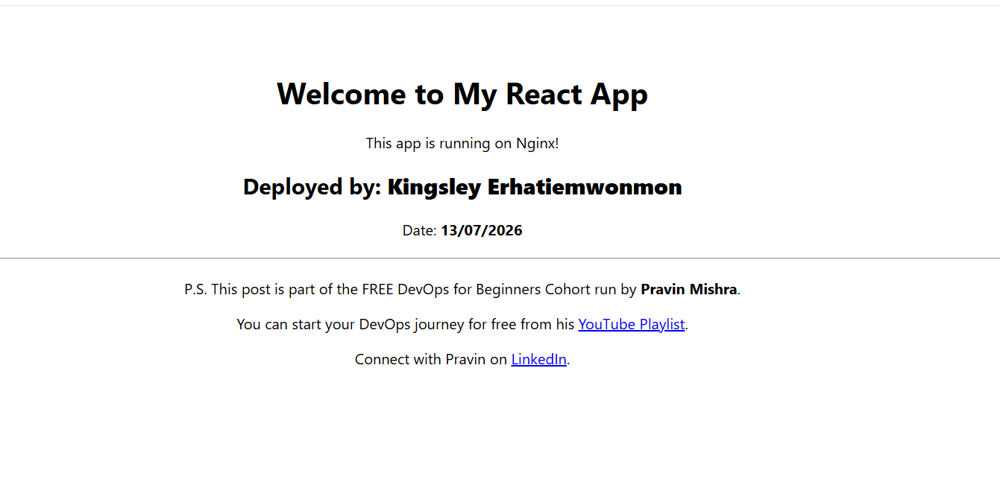

---

#### Screenshot 2 — Output of `ip a`

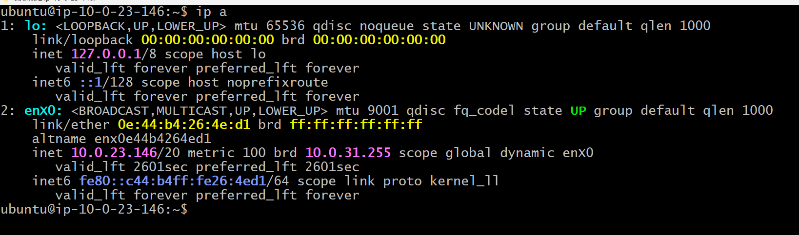

---

#### Screenshot 3 — Output of `sudo ss -tulpen`

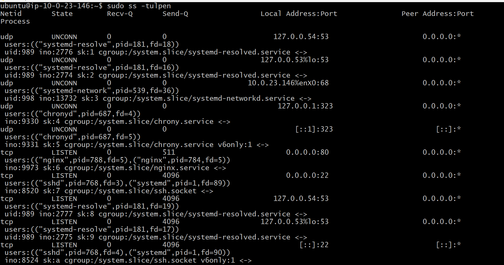

---

#### Screenshot 4 — Output of `sudo ufw status`

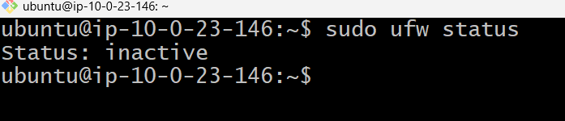

---

### Notes

Answer the following in your own words:

**1. What proves Nginx is listening on 0.0.0.0:80?**

Nginx is proven to be listening on 0.0.0.0:80 by the output of the sudo ss -tulpen command, which shows:

tcp LISTEN 0 511 0.0.0.0:80 0.0.0.0:* users:(("nginx",pid=788,...))

This output confirms that the Nginx process is in the LISTEN state on TCP port 80. The address 0.0.0.0:80 means Nginx is listening on all IPv4 network interfaces, allowing it to accept HTTP requests from external clients, provided the AWS Security Group permits traffic on port 80.

---

**2. What proves SSH is active on port 22?**

SSH is proven to be active on port 22 by the output of the sudo ss -tulpen command, which shows:

tcp LISTEN 0 4096 0.0.0.0:22 0.0.0.0:* users:(("sshd",pid=768,...))

This output confirms that the SSH daemon (sshd) is in the LISTEN state on TCP port 22, meaning it is actively accepting incoming SSH connections. This is also why I was able to connect remotely to the EC2 instance using SSH from Git Bash.

---

**3. Did you find any unexpected open ports? Explain briefly.**

No, I did not find any unexpected open ports. The listening ports matched the services running on the server:

Port 80 was open for Nginx, serving the React application.
Port 22 was open for SSH, allowing remote administration.
Port 53 was used by systemd-resolved for DNS resolution and was bound to the local loopback address (127.0.0.53/127.0.0.54), so it was not exposed to external networks.
Ports 68 and 323 were used internally by DHCP and Chrony for network configuration and time synchronization.

These are expected services on an Ubuntu EC2 instance and do not indicate any unexpected open ports.

---

# Task 2 — Service Health & Systemd Validation (Nginx)

## Goal

Verify that Nginx is properly installed, running, enabled at boot, and safely configured.

### Evidence

#### Screenshot 1 — Output of `systemctl status nginx --no-pager`

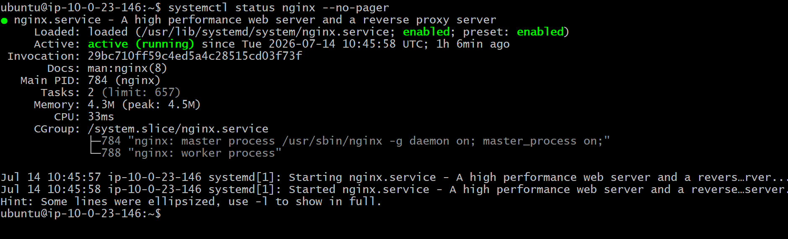

---

#### Screenshot 2 — Output of `sudo nginx -t`

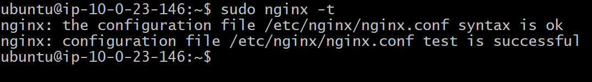

---

#### Screenshot 3 — Output of `sudo ss -lptn '( sport = :80 )'`

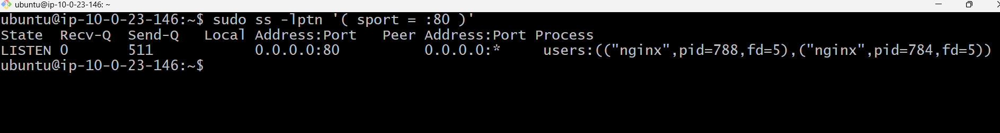

---

### Notes

Answer the following in your own words:

**1. What happens if Nginx fails to restart in production?**

If Nginx fails to restart in production, it may stop serving the website or application to users. This can cause downtime, meaning visitors may see errors such as 502 Bad Gateway, 503 Service Unavailable, or they may not be able to access the site at all. That's why it's important to test the Nginx configuration with sudo nginx -t before restarting the service, so any configuration errors can be fixed before they affect users.

---

**2. What's your basic rollback plan?**

My basic rollback plan is to restore the last working version of the application and restart Nginx. If the problem was caused by a configuration change, I would restore the previous Nginx configuration, test it with sudo nginx -t, and then restart the service. This helps return the website to a stable working state while I investigate and fix the issue.

---

# Task 3 — Logs & Request Trace

## Goal

Verify real traffic flow and analyze logs to understand system behavior and errors.

### Evidence

#### Screenshot 1 — Output of `sudo tail -n 30 /var/log/nginx/access.log`

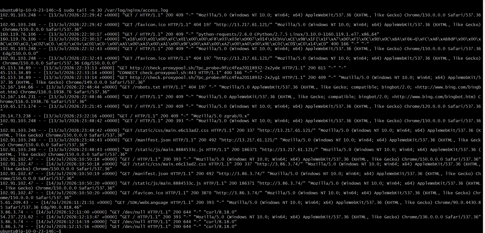

---

#### Screenshot 2 — Output of `sudo tail -n 30 /var/log/nginx/error.log`

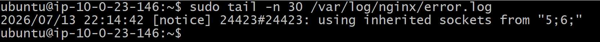

---

#### Screenshot 3 — Output of `sudo journalctl -u nginx --no-pager -n 50`

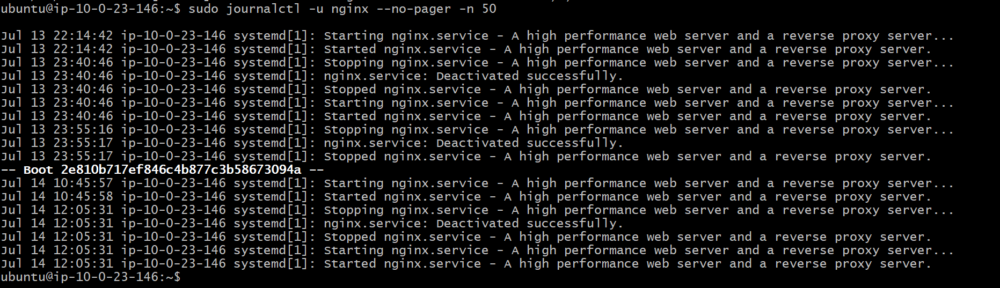

---

### Notes

Answer the following in your own words:

**1. Were there any errors in the logs?**

- If yes, mention 1–2 example error lines from the logs and explain what each one means in simple terms.
- If no, explain what it means if the error log is empty or shows no recent errors during your check.

No, I did not find any critical errors in the Nginx error log during my check. The only entry was:

2026/07/13 22:14:42 [notice] 24423#24423: using inherited sockets from "5;6;"

This is a notice, not an error. It means Nginx reused existing network sockets during startup or reload, allowing it to restart smoothly without interrupting active connections.

The journalctl logs also showed that Nginx started and restarted successfully, with messages such as:

Started nginx.service - A high performance web server and a reverse proxy server.

Since there were no recent errors in the Nginx error log and the service started successfully, it indicates that Nginx was running normally and serving the React application without any configuration or runtime problems.

---

**2. If there were no errors, what does that indicate about the system?**

If there were no errors in the logs, it indicates that the system was operating normally during the time of the check. Nginx was able to start successfully, serve requests without issues, and there were no configuration or runtime problems recorded. This suggests that the web server was stable and the React application was being delivered correctly to users.

---

**3. Based on the access logs, were your curl requests visible in the log entries? What does that prove about traffic flow?**

Yes. My curl requests were visible in the Nginx access logs. For example:

3.86.3.74 - - [14/Jul/2026:12:11:00 +0000] "GET /dev/null HTTP/1.1" 200 644 "-" "curl/8.18.0"
3.86.3.74 - - [14/Jul/2026:12:14:59 +0000] "GET /dev/null HTTP/1.1" 200 644 "-" "curl/8.18.0"
3.86.3.74 - - [14/Jul/2026:12:15:56 +0000] "GET /dev/null HTTP/1.1" 200 644 "-" "curl/8.18.0"

This proves that the requests successfully reached the Nginx web server, were processed, and were recorded in the access log. It confirms that network traffic was flowing correctly from the client to the server and that Nginx was receiving and responding to incoming HTTP requests.

---

# Task 4 — System Resource Health Check (Capacity Red Flags)

## Goal

Assess server capacity and detect potential performance or failure risks.

### Evidence

#### Screenshot 1 — Output of `uptime`

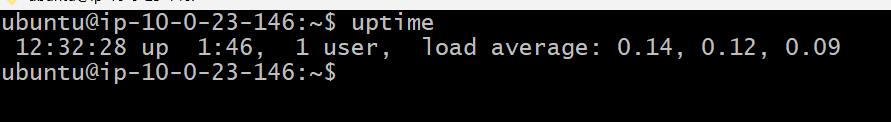

---

#### Screenshot 2 — Output of `free -h`

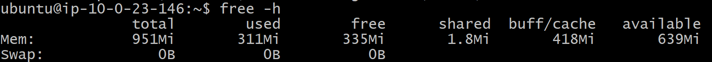

---

#### Screenshot 3 — Output of `df -h`

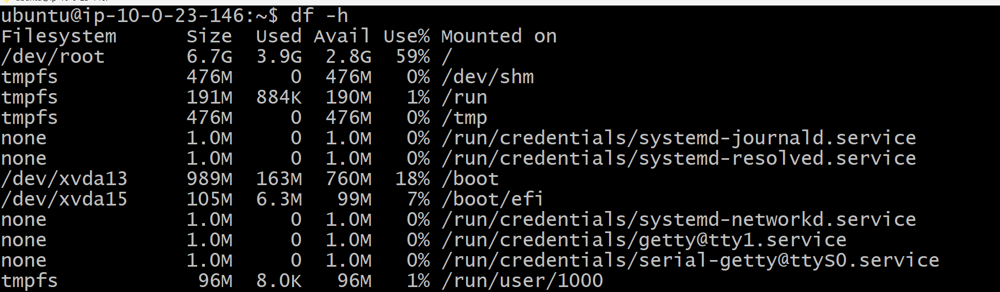

---

#### Screenshot 4 — Output of `sudo du -sh /var/* | sort -h`

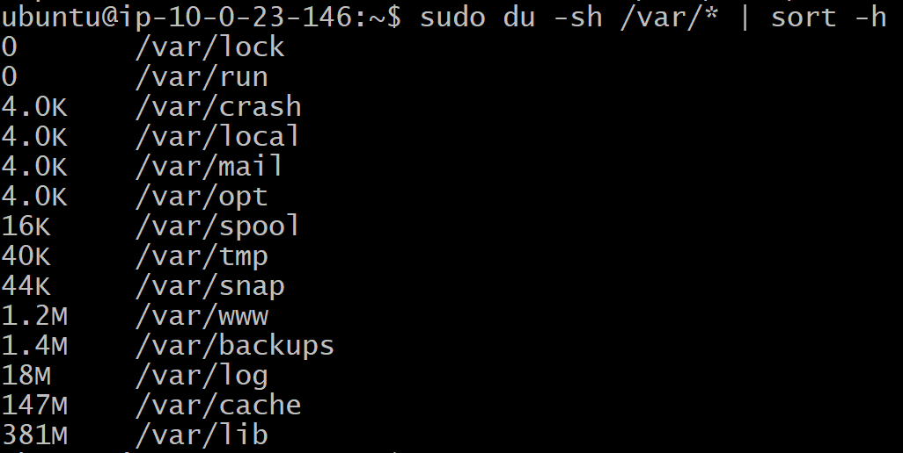

---

### Notes

Answer the following in your own words:

**1. Which resource looks most critical right now? (CPU/load, memory, or disk) Explain why.**

At the moment, disk usage looks the most critical resource, although it is not yet at a concerning level. The root filesystem is 59% used, which is higher than the CPU load and memory usage. The CPU load averages are very low (0.11, 0.11, 0.09), showing the server is not under heavy processing. Memory usage is also healthy, with 635 MiB available out of 951 MiB. While the server still has 2.8 GB of free disk space, disk usage is the resource I would monitor most closely as the application and log files continue to grow.

---

**2. What happens if disk becomes 100% full in a production server?**

If the disk becomes 100% full on a production server, the server may no longer function properly. Applications may be unable to write logs or temporary files, databases may fail to save new data, and users could experience errors or service outages. In some cases, services like Nginx or other applications may fail to start or operate correctly until disk space is freed. This is why it's important to monitor disk usage regularly and clean up unnecessary files before the disk becomes full.

---

# Task 5 — Configuration & Deployment Verification

## Goal

Ensure the correct React build is deployed and Nginx is serving it properly.

### Evidence

#### Screenshot 1 — Output of `ls -lah /var/www/html | head -n 20`

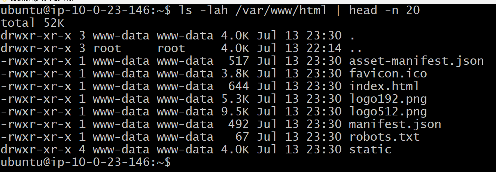

---

#### Screenshot 2 — Output of `grep -R "Deployed by" -n /var/www/html 2>/dev/null | head`

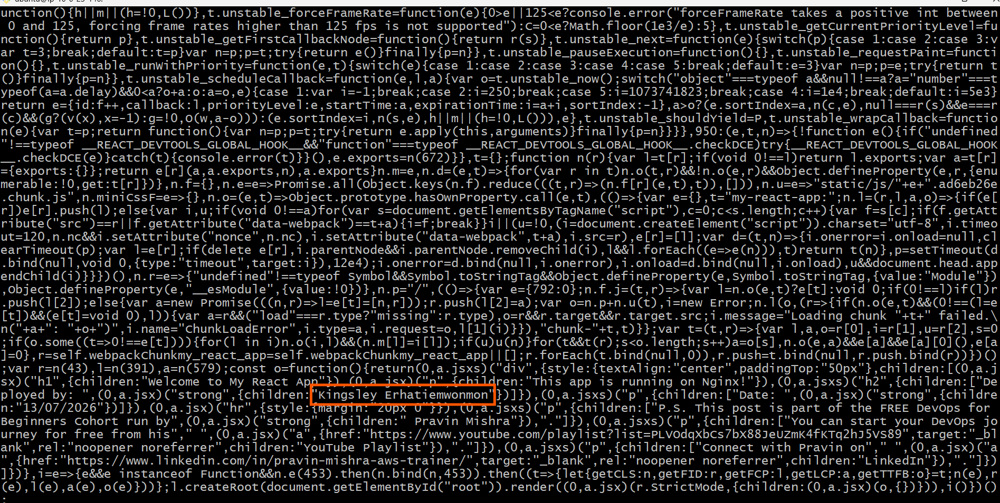

---

#### Screenshot 3 — Output of `grep -n "try_files" /etc/nginx/sites-available/default`

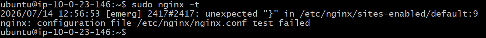

---

### Notes

Answer the following in your own words:

**1. How do you confirm that the correct version of the application is deployed?**

I confirm that the correct version of the application is deployed by opening the application in a web browser and checking that it displays the latest changes, such as my full name and deployment date that I added to the React application. I can also verify this by checking the Nginx access logs to confirm that the updated application files (such as index.html, CSS, and JavaScript files) are being served successfully with HTTP 200 responses.

---

# Task 6 — Nginx Configuration Failure Simulation

## Goal

Simulate a real-world Nginx misconfiguration and recover the service safely.

### Evidence

#### Screenshot 1 — Output of `sudo nginx -t` showing the syntax error (broken config)

---

#### Screenshot 2 — Output of `sudo nginx -t` showing syntax ok (fixed config)

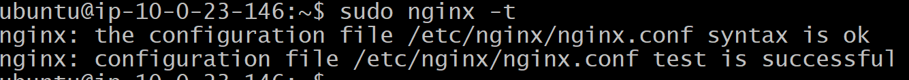

---

#### Screenshot 3 — Output of `curl -I http://<public-ip>` confirming recovery (200 OK)

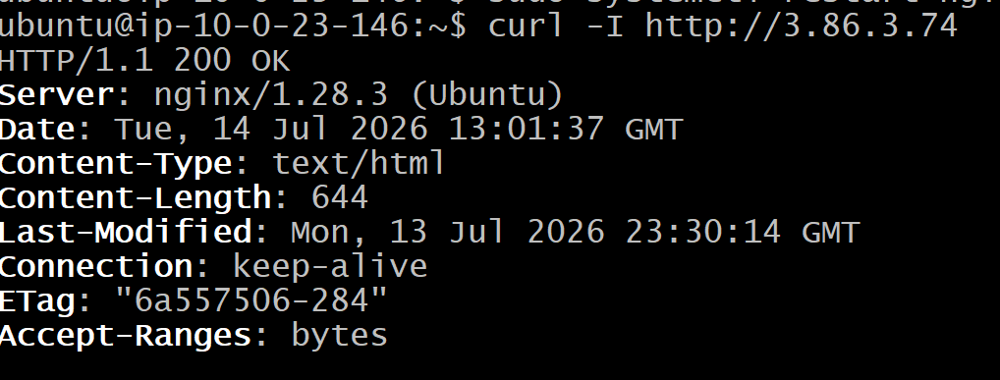

---

### Notes

Answer the following in your own words:

**1. What caused the configuration failure?**

The configuration failure was caused by removing a required semicolon (;) from the Nginx configuration file. Without the semicolon, the configuration contained a syntax error, causing the validation to fail.

---

**2. How did you fix the issue?**

I fixed the issue by adding the missing semicolon (;) back to the Nginx configuration file. I then ran sudo nginx -t to verify that the configuration syntax was correct, and after the test passed successfully, I restarted Nginx to apply the corrected configuration.

---

**3. How can you avoid this kind of issue in real production systems?**

To avoid this kind of issue in a production environment, I would always test the Nginx configuration using sudo nginx -t before restarting or reloading the service. This checks for syntax errors, such as missing semicolons, and ensures the configuration is valid before the changes are applied.

---

# Task 7 — Web Application Failure Simulation

## Goal

Simulate missing deployment content and recover the application safely.

### Evidence

#### Screenshot 1 — Output of `curl -I http://<public-ip>` showing failure (non-200 response)

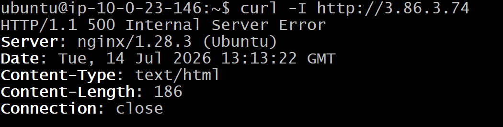

---

#### Screenshot 2 — Output of `curl -I http://<public-ip>` confirming recovery (200 OK)

---

### Notes

Answer the following in your own words:

**1. What caused the application to break in this scenario?**

The application broke because I moved the /var/www/html directory, which contained the deployed React application, and replaced it with an empty folder. As a result, Nginx could not find the required website files to serve, causing it to return a 500 Internal Server Error.

---

**2. How did you fix the issue and restore the application?**

I fixed the issue by deleting the empty /var/www/html directory and restoring the original website files from the backup (/var/www/html_backup). After restoring the files, I restarted the Nginx service and verified the application by running curl -I http://3.86.3.74, which returned HTTP/1.1 200 OK, confirming that the application had been restored successfully.

---

**3. What steps would you take to prevent this kind of issue in real production systems?**

To prevent this kind of issue in a production environment, I would back up the application files before making changes, avoid modifying or deleting the web root directly, and test changes in a staging environment first. I would also verify the application after deployment and have a rollback plan so the previous working version can be restored quickly if any issues occur.

---

# Task 8 — Security & Reliability Review

## Goal

Review and reflect on the security and reliability practices applied during this assignment.

### Security & Reliability Notes

Answer the following in your own words:

**1. Why is SSH key-based authentication more secure than sharing passwords?**

SSH key-based authentication is more secure than sharing passwords because it uses a pair of cryptographic keys instead of a password that can be guessed or stolen. The private key stays only with the user, while the public key is stored on the server. This makes SSH connections much more resistant to brute-force attacks and unauthorized access.

---

**2. Why should only required ports be open on a production server?**

Only the required ports should be open on a production server to reduce the risk of unauthorized access and cyberattacks. Closing unnecessary ports limits the number of ways attackers can reach the server, improving its security while ensuring that only essential services, such as SSH (port 22) and HTTP/HTTPS (ports 80 and 443), are accessible.

---

**3. Why is it important for Nginx to be enabled on boot?**

It is important for Nginx to be enabled on boot so that the web server starts automatically whenever the server is restarted or rebooted. This ensures the website or application becomes available without requiring manual intervention, improving reliability and reducing downtime.

---

**4. What are the risks of sharing secrets, keys, or credentials publicly?**

Sharing secrets, keys, or credentials publicly can allow unauthorized people to access your servers, cloud resources, or applications. This can lead to data breaches, service disruption, unauthorized changes, financial loss, and the compromise of sensitive information. Keeping credentials private is essential for maintaining the security of a production environment.

---

**5. Why should cloud resources be stopped or terminated when they are no longer needed?**

Cloud resources should be stopped or terminated when they are no longer needed to avoid unnecessary costs and reduce security risks. Unused resources can continue to incur charges and may become potential targets for unauthorized access if they are left running. Properly managing cloud resources helps optimize costs and maintain a secure cloud environment.

---

# LinkedIn Post (Required)

## Evidence

#### LinkedIn Post URL

Paste your LinkedIn post URL here:

https://www.linkedin.com/posts/kingsley-erhatiemwonmon_dmibypravinmishra-devops-aws-ugcPost-7482908736039342080-h19f/?utm_source=share&utm_medium=member_desktop&rcm=ACoAAClDkSEBa4Zo6dTWVIEEl8FJLczvH_zPHtY

---

#### Screenshot — Published LinkedIn post

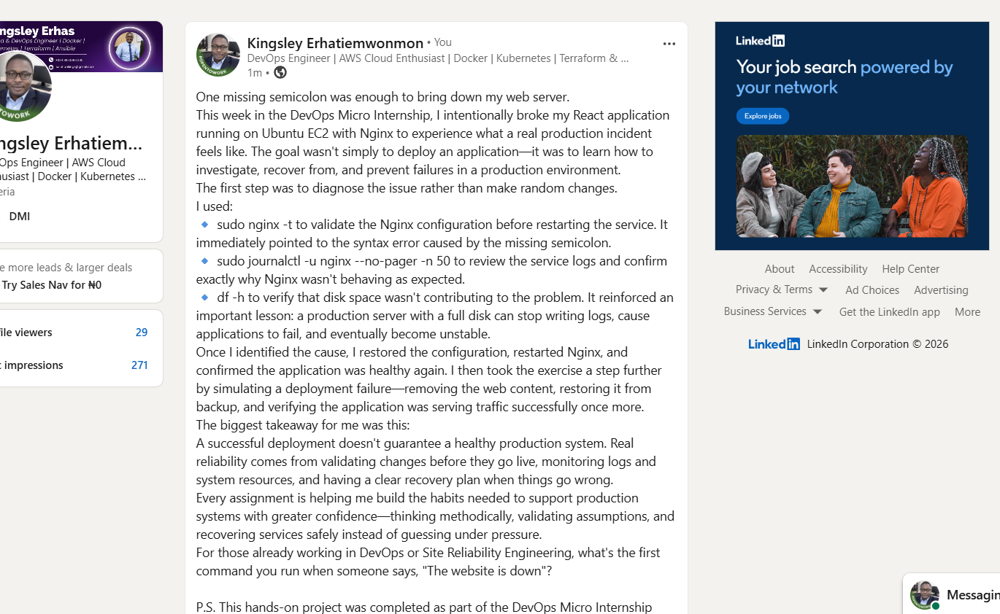

---

# Submission Instructions

- Add all required screenshots in your submission
- Full name must be visible in required screenshots
- Do not expose sensitive information (keys, passwords, account IDs)

---

# Completion Checklist

- [ ] Task 1: Screenshots (browser, ip a, ss -tulpen, ufw status) + Notes answered
- [ ] Task 2: Screenshots (nginx status, nginx -t, ss port 80) + Notes answered
- [ ] Task 3: Screenshots (access log, error log, journalctl) + Notes answered
- [ ] Task 4: Screenshots (uptime, free -h, df -h, du -sh) + Notes answered
- [ ] Task 5: Screenshots (ls html, grep deployed by, grep try_files) + Notes answered
- [ ] Task 6: Screenshots (nginx -t fail, nginx -t pass, curl recovery) + Notes answered
- [ ] Task 7: Screenshots (curl failure, curl recovery) + Notes answered
- [ ] Task 8: Security & Reliability Notes answered
- [ ] LinkedIn post published and URL submitted
- [ ] Full Name visible in all required screenshots
- [ ] No sensitive data exposed

---

## 📌 About DMI & CloudAdvisory

DevOps Micro Internship (DMI) is a project-based DevOps program run by Pravin Mishra (The CloudAdvisory) focused on real-world execution, systems thinking, and career readiness.

It helps learners build strong DevOps foundations with hands-on experience.

---

## 📌 Resources

- 🌐 DMI Official Website: https://pravinmishra.com/dmi  
- 🎓 DevOps for Beginners (Udemy): https://www.udemy.com/course/devops-for-beginners-docker-k8s-cloud-cicd-4-projects/  
- 🎓 Agentic AI DevOps with Claude Code: https://www.udemy.com/course/ultimate-agentic-ai-devops-with-claude-code/  
- 🎓 DevOps with Claude Code: Terraform, EKS, ArgoCD & Helm: https://www.udemy.com/course/devops-with-claude-code-terraform-eks-argocd-helm/  
- ▶️ YouTube Playlist: https://www.youtube.com/playlist?list=PLFeSNDtI4Cho  
- 🔗 Pravin Mishra (LinkedIn): https://www.linkedin.com/in/pravin-mishra-aws-trainer/  
- 🏢 CloudAdvisory (LinkedIn): https://www.linkedin.com/company/thecloudadvisory/

---

*This submission is part of DevOps Micro Internship (DMI) Cohort 3 — Agentic AI Track.*