# Assignment 3 — Production Maintenance Drill (OPS Checklist)

Part of the DevOps Micro Internship (DMI) Cohort 3 with Agentic AI

---

## Purpose

In this assignment, you will treat your already deployed React application (on Ubuntu VM with Nginx) as a live production system. You will perform structured operational checks covering network validation, service health, log analysis, resource monitoring, configuration verification, and incident simulation with recovery — mirroring real on-call DevOps responsibilities.

---

# Task 1 — Server Access & Networking Validation

## Goal

Verify that the deployed React application is reachable from the browser and confirm basic network connectivity of the Ubuntu VM.

### Evidence

#### Screenshot 1 — Browser showing the React app with your Full Name visible on the UI

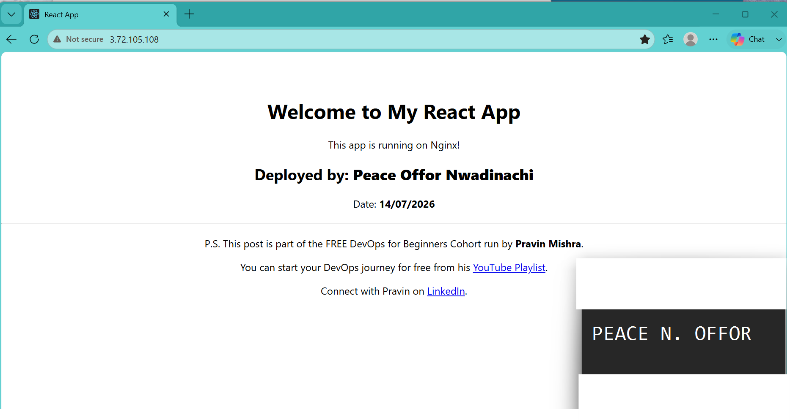.

---

#### Screenshot 2 — Output of `ip a`

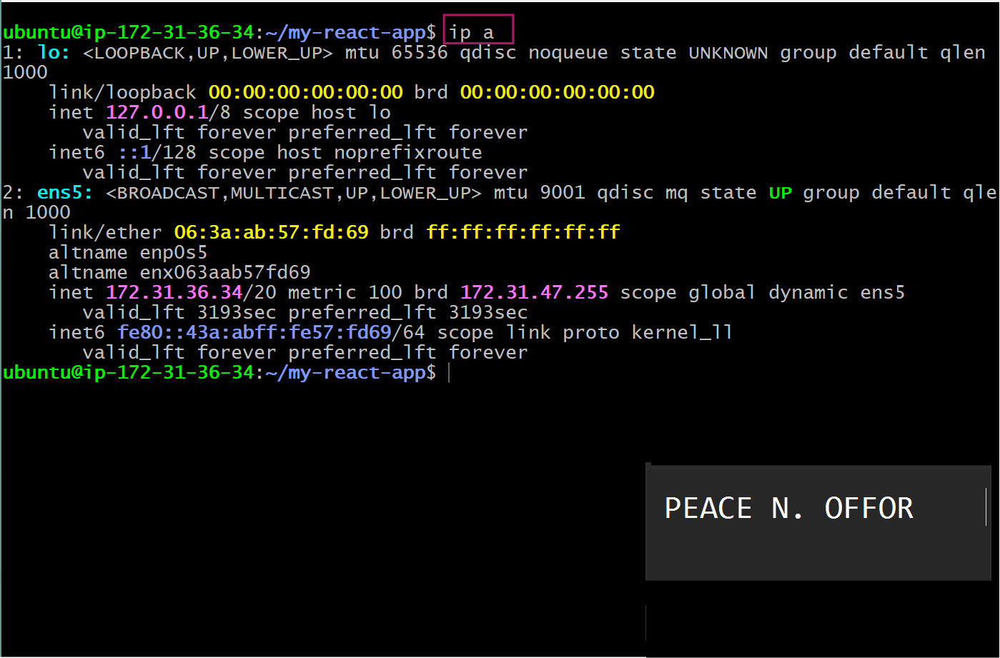.

---

#### Screenshot 3 — Output of `sudo ss -tulpen`

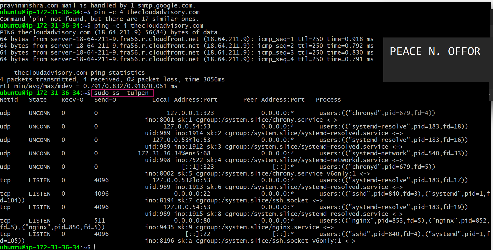.

---

#### Screenshot 4 — Output of `sudo ufw status`

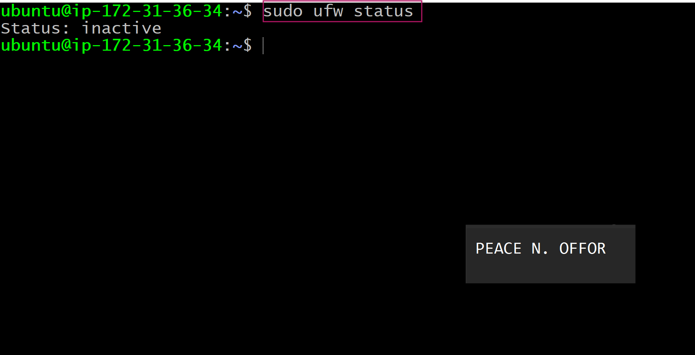.

---

### Notes

Answer the following in your own words:

1. What proves Nginx is listening on 0.0.0.0:80?

The sudo ss -tulpen output showed Nginx listening on 0.0.0.0:80. This means Nginx is accepting HTTP connections on port 80 from any network interface, allowing users to access the React application through the server's public IP address..

---

2. What proves SSH is active on port 22?

The sudo ss -tulpen output also showed the SSH service listening on port 22. This confirms that remote SSH connections are enabled and that the server can be managed securely from another computer.

---

**3. Did you find any unexpected open ports? Explain briefly.**

No. I only observed the expected ports. Port 22 was open for SSH administration, while port 80 was open for Nginx to serve the React application. I did not identify any unexpected services listening on additional ports..

---

# Task 2 — Service Health & Systemd Validation (Nginx)

## Goal

Verify that Nginx is properly installed, running, enabled at boot, and safely configured.

### Evidence

#### Screenshot 1 — Output of `systemctl status nginx --no-pager`

Add your screenshot here.

---

#### Screenshot 2 — Output of `sudo nginx -t`

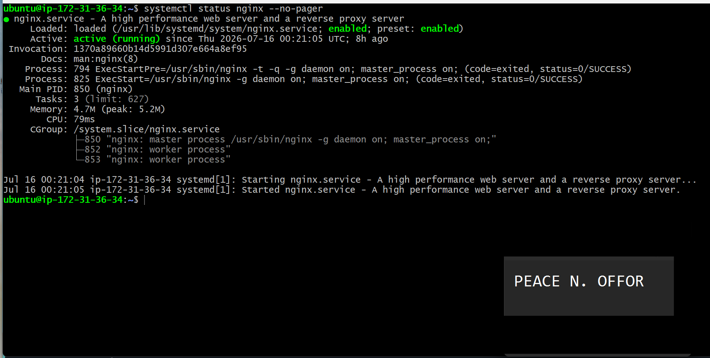.

---

#### Screenshot 3 — Output of `sudo ss -lptn '( sport = :80 )'`

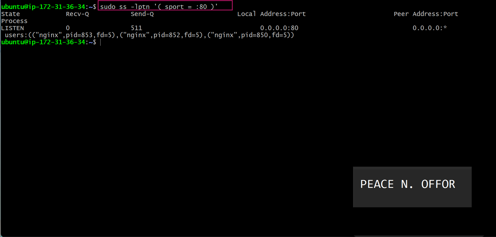.

---

### Notes

Answer the following in your own words:

**1. What happens if Nginx fails to restart in production?**

If Nginx fails to restart in production, users may not be able to access the application or website because the web server is no longer serving requests. This can lead to downtime, failed user requests, and potential business impact. The first step is to check the error logs and configuration for the cause, fix the issue, test the configuration with nginx -t, and then restart the service again.

---

**2. What's your basic rollback plan?**

My basic rollback plan is to restore the last known working version of the application and Nginx configuration if a deployment causes problems. I would stop the failed deployment, replace the current files with the previous backup, restore the previous Nginx configuration if needed, test the configuration using nginx -t, restart Nginx, and verify that the application is working correctly before considering the rollback complete.

---

# Task 3 — Logs & Request Trace

## Goal

Verify real traffic flow and analyze logs to understand system behavior and errors.

### Evidence

#### Screenshot 1 — Output of `sudo tail -n 30 /var/log/nginx/access.log`

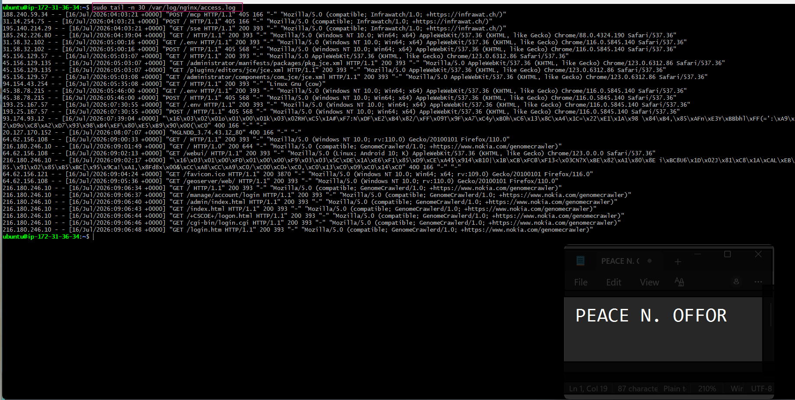.

---

#### Screenshot 2 — Output of `sudo tail -n 30 /var/log/nginx/error.log`

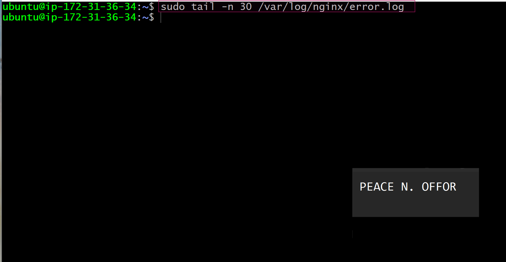.

---

#### Screenshot 3 — Output of `sudo journalctl -u nginx --no-pager -n 50`

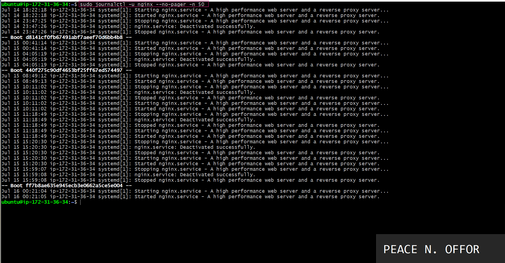.

---

### Notes

Answer the following in your own words:

**1. Were there any errors in the logs?**

- If yes, mention 1–2 example error lines from the logs and explain what each one means in simple terms.
- If no, explain what it means if the error log is empty or shows no recent errors during your check.

During my checks, I did not find any recent errors in the Nginx error log. An empty error log, or one without new entries, indicates that Nginx did not encounter any issues while handling requests at that time. This means the web server started successfully, processed requests normally, and did not experience problems such as configuration errors, permission issues, or application failures during the period I was monitoring it..

---

**2. If there were no errors, what does that indicate about the system?**

The absence of errors indicates that the system is operating as expected. It suggests that Nginx is running correctly, the configuration is valid, and the application is being served without any server-side problems. While this does not guarantee that every part of the application is perfect, it is a strong sign that the web server is healthy and stable during the period of observation.

---

**3. Based on the access logs, were your curl requests visible in the log entries? What does that prove about traffic flow?**

Yes, my curl requests were visible in the Nginx access logs. This confirms that the requests successfully reached the web server, were processed by Nginx, and generated a response that was recorded in the logs. It proves that the network path between the client and the server is functioning correctly, the web server is actively handling incoming traffic, and the logging system is accurately recording requests for monitoring and troubleshooting purposes.

---

# Task 4 — System Resource Health Check (Capacity Red Flags)

## Goal

Assess server capacity and detect potential performance or failure risks.

### Evidence

#### Screenshot 1 — Output of `uptime`

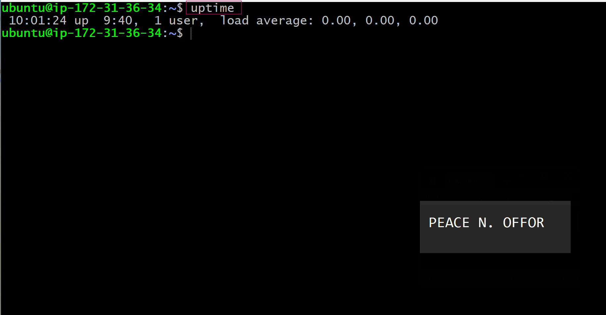.

---

#### Screenshot 2 — Output of `free -h`

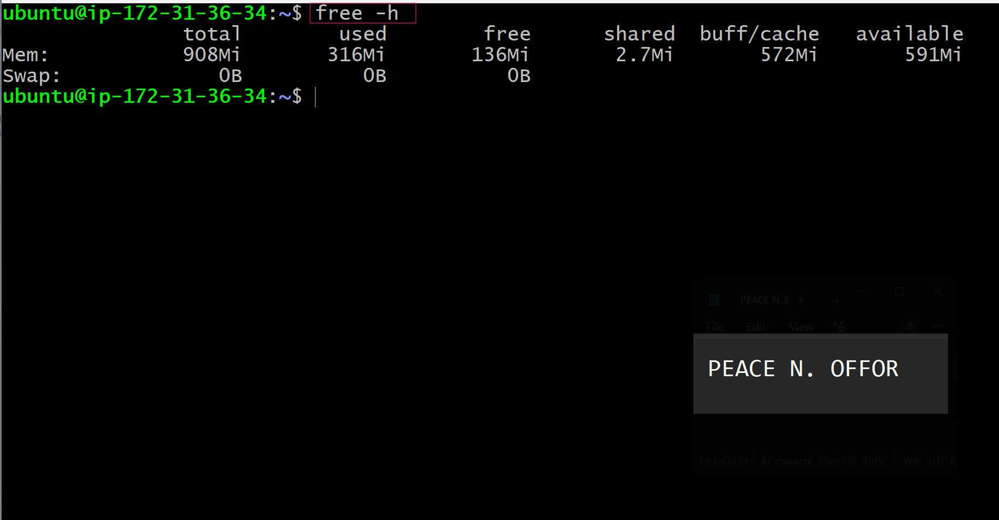..

---

#### Screenshot 3 — Output of `df -h`

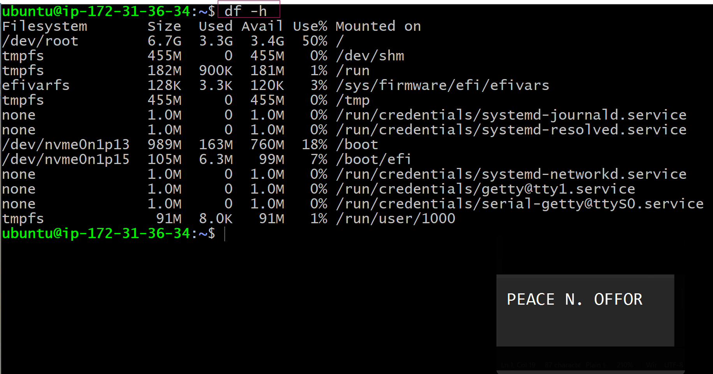.

---

#### Screenshot 4 — Output of `sudo du -sh /var/* | sort -h`

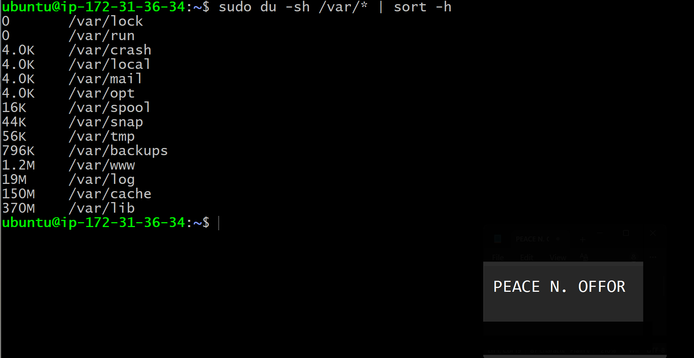.

---

### Notes

Answer the following in your own words:

**1. Which resource looks most critical right now? (CPU/load, memory, or disk) Explain why.**

Based on the results of my system health checks, none of the resources appeared to be critically exhausted at the time of the assessment. However, disk space is the resource I would monitor most closely because its usage can increase over time as application files, system logs, and temporary data accumulate. The df -h output shows the overall disk usage, while the du command helps identify which directories under /var are consuming the most space. Monitoring these values regularly would allow me to respond before storage becomes a risk to system availability.

---

**2. What happens if disk becomes 100% full in a production server?**

If a production server's disk reaches 100% capacity, applications may stop working correctly because they can no longer write files, logs, or temporary data. Services such as Nginx, databases, and system processes may begin to fail, software updates may not install, and users could experience errors or a complete service outage. Recovery may require deleting unnecessary files, rotating large logs, moving data, or expanding the server's storage before the affected services can operate normally again.

---

# Task 5 — Configuration & Deployment Verification

## Goal

Ensure the correct React build is deployed and Nginx is serving it properly.

### Evidence

#### Screenshot 1 — Output of `ls -lah /var/www/html | head -n 20`

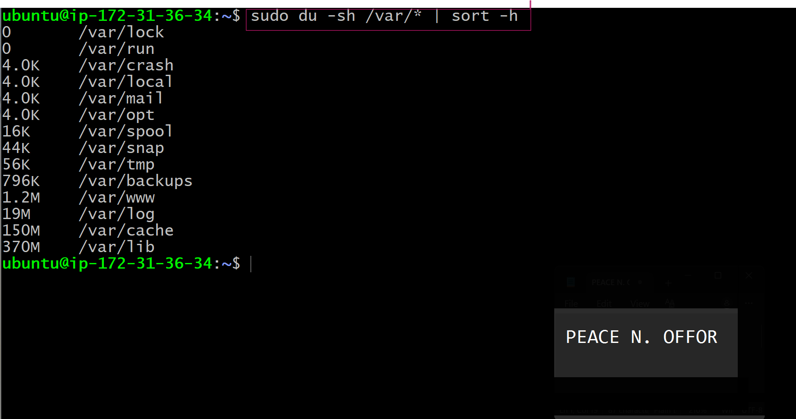.

---

#### Screenshot 2 — Output of `grep -R "Deployed by" -n /var/www/html 2>/dev/null | head`

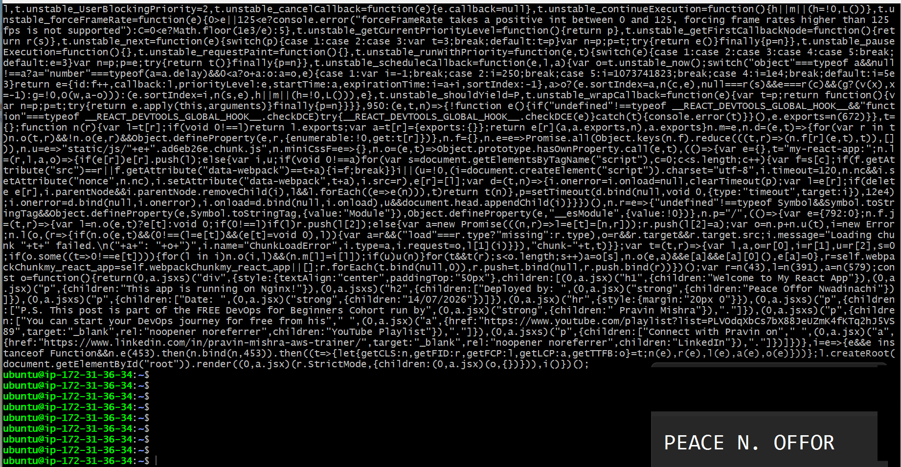.

---

#### Screenshot 3 — Output of `grep -n "try_files" /etc/nginx/sites-available/default`

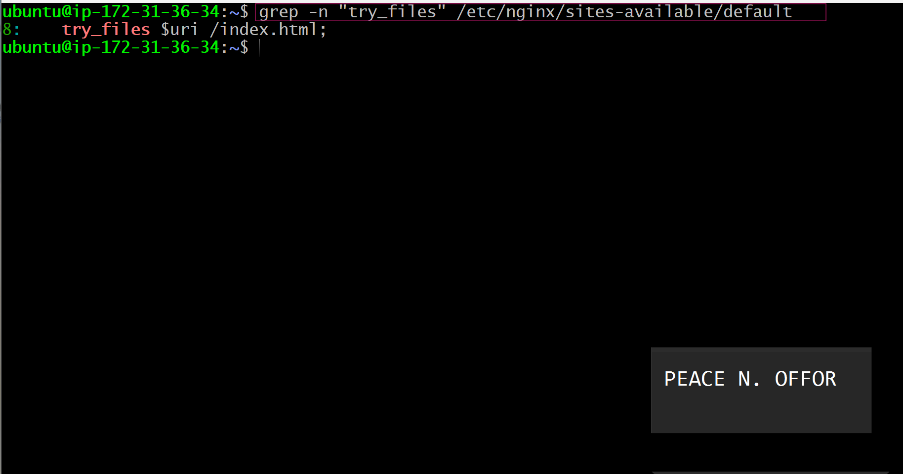.

---

### Notes

Answer the following in your own words:

**1. How do you confirm that the correct version of the application is deployed?**

I confirm that the correct version of the application is deployed by accessing the application in a web browser and verifying that the latest changes are visible, such as my updated full name, the current date, or any new features I recently added. I also check that the deployment files in the Nginx web root (/var/www/html) match the latest build, confirm that the Nginx configuration is pointing to the correct directory, and ensure the try_files directive is configured correctly for the React application. Finally, I perform a browser refresh or use curl to verify that the server is delivering the latest version of the application successfully and responding as expected.

---

# Task 6 — Nginx Configuration Failure Simulation

## Goal

Simulate a real-world Nginx misconfiguration and recover the service safely.

### Evidence

#### Screenshot 1 — Output of `sudo nginx -t` showing the syntax error (broken config)

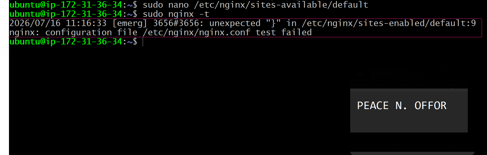.

---

#### Screenshot 2 — Output of `sudo nginx -t` showing syntax ok (fixed config)

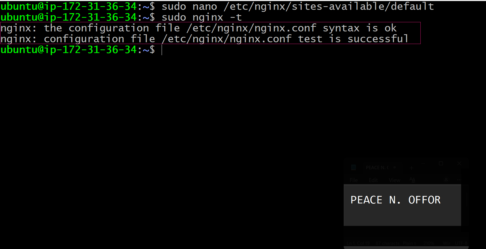.

---

#### Screenshot 3 — Output of `curl -I http://<public-ip>` confirming recovery (200 OK)

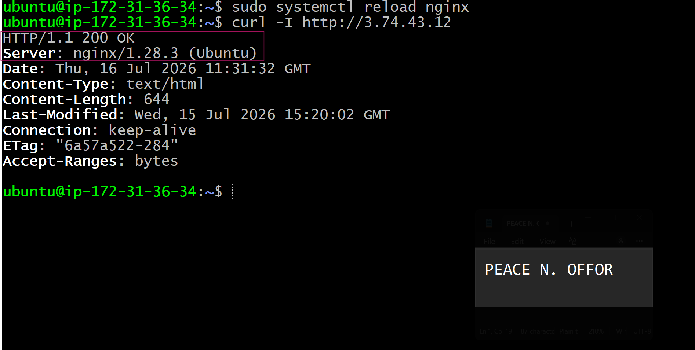.

---

### Notes

Answer the following in your own words:

**1. What caused the configuration failure?**

The configuration failure was caused by an intentional syntax error introduced into the Nginx configuration file. Because the configuration contained an invalid or incomplete directive, Nginx could not successfully validate or load it. When I ran sudo nginx -t, the test identified the location of the error and confirmed that the configuration was not valid.

---

**2. How did you fix the issue?**

I fixed the issue by opening the Nginx configuration file, locating the incorrect line, and restoring the correct syntax. After saving the changes, I ran sudo nginx -t again to confirm that the configuration syntax was valid. Once the test returned a successful result, I restarted or reloaded Nginx and used curl -I to verify that the application was responding with a 200 OK status.

---

**3. How can you avoid this kind of issue in real production systems?**

In a real production environment, I would always test Nginx configuration changes with sudo nginx -t before restarting or reloading the service. I would also keep the configuration files in version control, create backups of the last working configuration, and test changes in a staging environment before applying them to production. Using automated deployment checks, peer reviews, monitoring, and a clear rollback plan would further reduce the risk of downtime caused by configuration mistakes.

---

# Task 7 — Web Application Failure Simulation

## Goal

Simulate missing deployment content and recover the application safely.

### Evidence

#### Screenshot 1 — Output of `curl -I http://<public-ip>` showing failure (non-200 response)

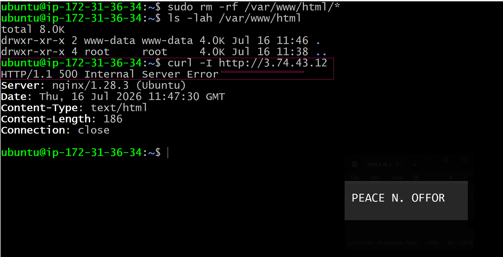.

---

#### Screenshot 2 — Output of `curl -I http://<public-ip>` confirming recovery (200 OK)

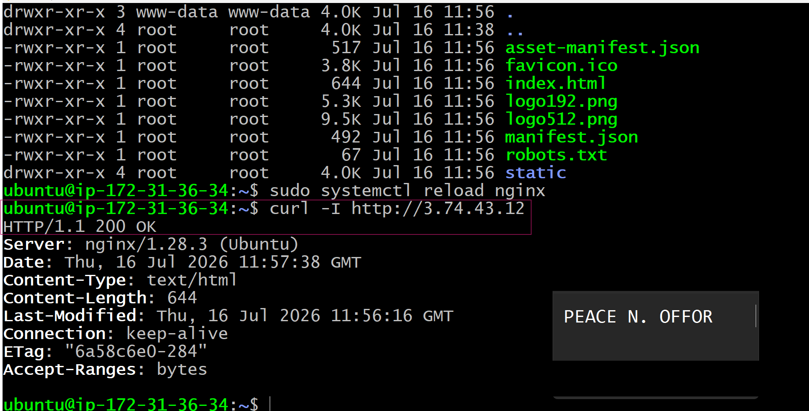.

---

### Notes

Answer the following in your own words:

**1. What caused the application to break in this scenario?**

The application broke because the deployed website files were removed or moved from the Nginx web root directory (/var/www/html). Nginx was still running, but it could no longer find the required application files, such as index.html and the static assets. As a result, the server returned a non-200 response when I tested it with curl.

---

**2. How did you fix the issue and restore the application?**

I restored the application by copying the correct React build files back into the Nginx web root directory, /var/www/html. I then confirmed that the files had the correct permissions, checked the Nginx configuration, and restarted or reloaded Nginx. After the recovery, I ran curl -I again and received a 200 OK response, confirming that the application had been restored successfully.

---

**3. What steps would you take to prevent this kind of issue in real production systems?**

To prevent this issue in a real production environment, I would use an automated deployment process instead of manually removing or copying files. I would also keep backups of the last working build, deploy new versions to a separate directory, and only switch traffic after confirming that the new version works correctly. Health checks, monitoring, restricted file permissions, version control, and a tested rollback plan would also help detect failures quickly and restore service with minimal downtime.

---

# Task 8 — Security & Reliability Review

## Goal

Review and reflect on the security and reliability practices applied during this assignment.

### Security & Reliability Notes

Answer the following in your own words:

**1. Why is SSH key-based authentication more secure than sharing passwords?**

SSH key-based authentication is more secure because it uses a pair of cryptographic keys instead of a password that can be guessed, reused, or intercepted. The private key remains on the user's device and is never transmitted to the server during authentication. This significantly reduces the risk of unauthorized access and makes brute-force attacks much more difficult.

---

**2. Why should only required ports be open on a production server?**

Only the ports required for the application's operation should be open because every open port increases the server's attack surface. Closing unnecessary ports reduces the number of potential entry points that attackers can exploit, improves overall security, and makes it easier to monitor and manage legitimate network traffic.

---

**3. Why is it important for Nginx to be enabled on boot?**

Enabling Nginx to start automatically on boot ensures that the web server becomes available immediately after the server is restarted, whether due to maintenance, updates, or unexpected outages. This minimizes downtime, improves service reliability, and reduces the need for manual intervention to bring the application back online.

---

**4. What are the risks of sharing secrets, keys, or credentials publicly?**

Sharing secrets, SSH keys, API keys, passwords, or other credentials publicly can give unauthorized users access to servers, cloud resources, or sensitive data. This can result in data breaches, service disruption, unauthorized changes, financial losses, and compromised systems. Sensitive credentials should always be stored securely, rotated when necessary, and never committed to public repositories.

---

**5. Why should cloud resources be stopped or terminated when they are no longer needed?**

Cloud resources should be stopped or terminated when they are no longer needed to avoid unnecessary costs and reduce security risks. Unused resources can continue generating charges and may become targets for unauthorized access if left running. Regularly cleaning up unused infrastructure helps control expenses, improves resource management, and maintains a more secure cloud environment.

---

# LinkedIn Post (Required)

## Evidence

#### LinkedIn Post URL

Paste your LinkedIn post URL here:

`https://www.linkedin.com/posts/peace-offor-aa736a147_devops-nginx-linux-activity-7483515394683637760-fCmr?utm_source=share&utm_medium=member_desktop&rcm=ACoAACN4g58BM2OoiPOU_M6YmR_9gplw4hlL_RQ`

---

#### Screenshot — Published LinkedIn post

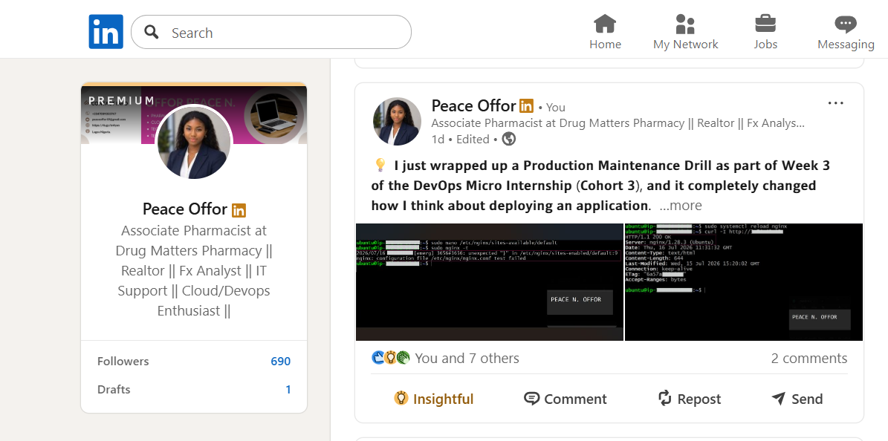.

---

# Submission Instructions

- Add all required screenshots in your submission
- Full name must be visible in required screenshots
- Do not expose sensitive information (keys, passwords, account IDs)

---

# Completion Checklist

- [-] Task 1: Screenshots (browser, ip a, ss -tulpen, ufw status) + Notes answered
- [-] Task 2: Screenshots (nginx status, nginx -t, ss port 80) + Notes answered
- [-] Task 3: Screenshots (access log, error log, journalctl) + Notes answered
- [-] Task 4: Screenshots (uptime, free -h, df -h, du -sh) + Notes answered
- [-] Task 5: Screenshots (ls html, grep deployed by, grep try_files) + Notes answered
- [-] Task 6: Screenshots (nginx -t fail, nginx -t pass, curl recovery) + Notes answered
- [-] Task 7: Screenshots (curl failure, curl recovery) + Notes answered
- [-] Task 8: Security & Reliability Notes answered
- [-] LinkedIn post published and URL submitted
- [-] Full Name visible in all required screenshots
- [-] No sensitive data exposed

---

## 📌 About DMI & CloudAdvisory

DevOps Micro Internship (DMI) is a project-based DevOps program run by Pravin Mishra (The CloudAdvisory) focused on real-world execution, systems thinking, and career readiness.

It helps learners build strong DevOps foundations with hands-on experience.

---

## 📌 Resources

- 🌐 DMI Official Website: https://pravinmishra.com/dmi  
- 🎓 DevOps for Beginners (Udemy): https://www.udemy.com/course/devops-for-beginners-docker-k8s-cloud-cicd-4-projects/  
- 🎓 Agentic AI DevOps with Claude Code: https://www.udemy.com/course/ultimate-agentic-ai-devops-with-claude-code/  
- 🎓 DevOps with Claude Code: Terraform, EKS, ArgoCD & Helm: https://www.udemy.com/course/devops-with-claude-code-terraform-eks-argocd-helm/  
- ▶️ YouTube Playlist: https://www.youtube.com/playlist?list=PLFeSNDtI4Cho  
- 🔗 Pravin Mishra (LinkedIn): https://www.linkedin.com/in/pravin-mishra-aws-trainer/  
- 🏢 CloudAdvisory (LinkedIn): https://www.linkedin.com/company/thecloudadvisory/

---

*This submission is part of DevOps Micro Internship (DMI) Cohort 3 — Agentic AI Track.*