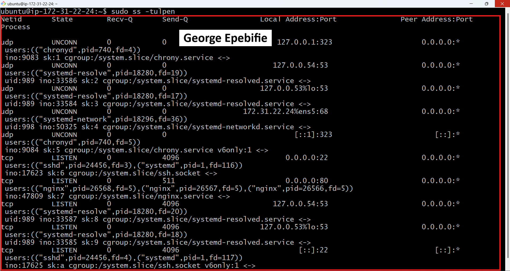
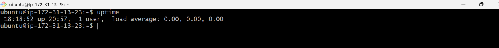

# Assignment 3 — Production Maintenance Drill (OPS Checklist)

Part of the DevOps Micro Internship (DMI) Cohort 3 with Agentic AI

---

## Purpose

In this assignment, you will treat your already deployed React application (on Ubuntu VM with Nginx) as a live production system. You will perform structured operational checks covering network validation, service health, log analysis, resource monitoring, configuration verification, and incident simulation with recovery — mirroring real on-call DevOps responsibilities.

---

# Task 1 — Server Access & Networking Validation

## Goal

Verify that the deployed React application is reachable from the browser and confirm basic network connectivity of the Ubuntu VM.

### Evidence

#### Screenshot 1 — Browser showing the React app with your Full Name visible on the UI

---

#### Screenshot 2 — Output of `ip a`

---

#### Screenshot 3 — Output of `sudo ss -tulpen`

---

#### Screenshot 4 — Output of `sudo ufw status`

---

### Notes

Answer the following in your own words:

**1. What proves Nginx is listening on 0.0.0.0:80?**

What proves Nginx is listening on **0.0.0.0:80** is that the React application is successfully accessible through the server's public IP address in a web browser. Listening on **0.0.0.0:80** means Nginx is accepting HTTP requests on port 80 from all network interfaces, allowing external users to access the application.

---

**2. What proves SSH is active on port 22?**

What proves SSH is active on **port 22** is that I can successfully establish a remote connection to the Ubuntu VM. This confirms that the SSH service is running and listening for incoming connections on the default SSH port, **22**.

---

**3. Did you find any unexpected open ports? Explain briefly.**

No. I did not find any unexpected open ports. Only the required ports, such as **22** for SSH and **80** for Nginx, were open, which matched the services running on the Ubuntu VM.

---

# Task 2 — Service Health & Systemd Validation (Nginx)

## Goal

Verify that Nginx is properly installed, running, enabled at boot, and safely configured.

### Evidence

#### Screenshot 1 — Output of `systemctl status nginx --no-pager`

---

#### Screenshot 2 — Output of `sudo nginx -t`

---

#### Screenshot 3 — Output of `sudo ss -lptn '( sport = :80 )'`

---

### Notes

Answer the following in your own words:

**1. What happens if Nginx fails to restart in production?**

If Nginx fails to restart in production, the website or application becomes unavailable to users because the web server is no longer serving requests. This can lead to downtime, failed user requests, and potential business impact until the issue is identified and resolved.

---

**2. What's your basic rollback plan?**

Before making any changes to the Nginx configuration, I would first validate the configuration to make sure there are no syntax errors. This helps catch most issues before restarting the service.

If Nginx fails to restart, I would check the error logs to identify what caused the problem. If the issue is due to a configuration change I made, I would restore the last working configuration from a backup or version control, validate it again, and then restart Nginx.

Keeping a backup of the working configuration before making any changes is my basic rollback plan because it allows me to quickly restore the server without spending too much time troubleshooting during downtime.

---

# Task 3 — Logs & Request Trace

## Goal

Verify real traffic flow and analyze logs to understand system behavior and errors.

### Evidence

#### Screenshot 1 — Output of `sudo tail -n 30 /var/log/nginx/access.log`

---

#### Screenshot 2 — Output of `sudo tail -n 30 /var/log/nginx/error.log`

---

#### Screenshot 3 — Output of `sudo journalctl -u nginx --no-pager -n 50`

---

### Notes

Answer the following in your own words:

**1. Were there any errors in the logs?**

- If yes, mention 1–2 example error lines from the logs and explain what each one means in simple terms.
- If no, explain what it means if the error log is empty or shows no recent errors during your check.

I didn't find any errors in the Nginx error log or the `journalctl` output. The error log didn't return any output, while the `journalctl` logs only showed normal events like Nginx starting, stopping, reloading, and shutting down successfully. There were no failure messages or error statuses, which indicates that Nginx was running normally.

---

**2. If there were no errors, what does that indicate about the system?**

It indicates that the system is healthy and running as expected. Nginx is functioning properly, the configuration is valid, and there are no issues affecting the web server or the deployed application.

---

**3. Based on the access logs, were your curl requests visible in the log entries? What does that prove about traffic flow?**

Yes, my `curl` requests were visible in the Nginx access logs. This proves that the requests successfully reached the Nginx server, were processed, and were logged correctly, confirming that the traffic flow from the client to the web server was working as expected.

---

# Task 4 — System Resource Health Check (Capacity Red Flags)

## Goal

Assess server capacity and detect potential performance or failure risks.

### Evidence

#### Screenshot 1 — Output of `uptime`

---

#### Screenshot 2 — Output of `free -h`

---

#### Screenshot 3 — Output of `df -h`

---

#### Screenshot 4 — Output of `sudo du -sh /var/* | sort -h`

---

### Notes

Answer the following in your own words:

**1. Which resource looks most critical right now? (CPU/load, memory, or disk) Explain why.**

Based on the screenshots, **memory** looks like the most critical resource, although it is **not under heavy pressure yet**.

The VM has **908 MB** of RAM, with **360 MB used**, **233 MB free**, and **548 MB available**. Since the system has less than 1 GB of memory and no swap space configured, memory is the resource I'd monitor most closely. If memory usage increases significantly, the system could become slow or run out of RAM.

The **disk** is in good condition, with **59%** of the root filesystem used and about **2.8 GB** still available. There are no signs of disk space issues.

There's no CPU or load information shown in the screenshots, so there isn't any evidence of CPU pressure at the moment.

---

**2. What happens if disk becomes 100% full in a production server?**

If the disk becomes **100% full** on a production server, the server may stop functioning properly. Applications may be unable to write logs or temporary files, new data cannot be saved, and services like Nginx or databases may fail or crash. This can lead to downtime until disk space is freed.

---

# Task 5 — Configuration & Deployment Verification

## Goal

Ensure the correct React build is deployed and Nginx is serving it properly.

### Evidence

#### Screenshot 1 — Output of `ls -lah /var/www/html | head -n 20`

---

#### Screenshot 2 — Output of `grep -R "Deployed by" -n /var/www/html 2>/dev/null | head`

---

#### Screenshot 3 — Output of `grep -n "try_files" /etc/nginx/sites-available/default`

---

### Notes

Answer the following in your own words:

**1. How do you confirm that the correct version of the application is deployed?**

The correct version of the application was confirmed through multiple verification steps rather than a single command.

First, `ls -lah /var/www/html` was used to verify that the production build files were present. The `index.html` file, the `static/` folder containing the compiled JavaScript and CSS files, and the other Create React App build files were all found and owned by `www-data`.

Next, `grep -R "Deployed by"` was used to confirm that the custom identifying text was included in the deployed JavaScript bundle. This verified that the live application was the intended build and not an older or cached version.

The Nginx configuration was also checked using `grep -n "try_files"` to ensure it was correctly configured to serve `index.html` for unknown routes, allowing the React single-page application to handle client-side routing properly.

Finally, these results were validated against the earlier `curl` test, which confirmed that the server was serving the same `index.html` file over HTTP. This proved that the files stored on the server matched the application being delivered to users.

---

# Task 6 — Nginx Configuration Failure Simulation

## Goal

Simulate a real-world Nginx misconfiguration and recover the service safely.

### Evidence

#### Screenshot 1 — Output of `sudo nginx -t` showing the syntax error (broken config)

---

#### Screenshot 2 — Output of `sudo nginx -t` showing syntax ok (fixed config)

---

#### Screenshot 3 — Output of `curl -I http://<public-ip>` confirming recovery (200 OK)

---

### Notes

Answer the following in your own words:

**1. What caused the configuration failure?**

The configuration failure was caused by removing a semicolon from the Nginx configuration file. The missing semicolon created a syntax error, causing the configuration test to fail.

---

**2. How did you fix the issue?**

The issue was fixed by adding the missing semicolon back to the Nginx configuration file. After saving the changes, sudo nginx -t was run again, and the configuration test passed successfully.

---

**3. How can you avoid this kind of issue in real production systems?**

Configuration issues like this can be avoided by validating configuration files with sudo nginx -t before reloading or restarting Nginx. Using version control to track configuration changes, following proper change review processes, and testing updates in a staging environment before deploying them to production also help prevent syntax errors from affecting live systems.

---

# Task 7 — Web Application Failure Simulation

## Goal

Simulate missing deployment content and recover the application safely.

### Evidence

#### Screenshot 1 — Output of `curl -I http://<public-ip>` showing failure (non-200 response)

---

#### Screenshot 2 — Output of `curl -I http://<public-ip>` confirming recovery (200 OK)

---

### Notes

Answer the following in your own words:

**1. What caused the application to break in this scenario?**

The web root directory (`/var/www/html`), which is the location Nginx serves files from, was emptied by removing all the deployed application files. Although Nginx was still running with a valid configuration, there was no `index.html` or other application files available to serve. As a result, Nginx returned a **500 Internal Server Error** instead of loading the React application.

---

**2. How did you fix the issue and restore the application?**

The original deployment had already been backed up by moving it to the `html_backup` directory instead of deleting it. Recovery was done by removing the empty `html` directory and restoring the backup to its original location. After that, Nginx was restarted to ensure it was serving the restored files correctly. The recovery was then verified using `curl -I`, which returned a `200 OK` response with the same `Content-Length`, `Last-Modified`, and `ETag` values as before, confirming that the exact same application build had been successfully restored.

---

**3. What steps would you take to prevent this kind of issue in real production systems?**

This kind of issue can be avoided by keeping a backup of the application before every deployment so it can be restored quickly if anything goes wrong. Instead of replacing the live application directly, the new version should be prepared separately and only made live after it has been confirmed to be working. Automated checks can also make sure that all the required files are in place before the deployment is completed. Finally, the website should be tested automatically after every deployment to confirm that it loads successfully, so any problems can be detected and fixed immediately.

---

# Task 8 — Security & Reliability Review

## Goal

Review and reflect on the security and reliability practices applied during this assignment.

### Security & Reliability Notes

Answer the following in your own words:

**1. Why is SSH key-based authentication more secure than sharing passwords?**

SSH key-based authentication is more secure because it uses a unique private key instead of a password. Private keys are much harder to guess or steal, reducing the risk of unauthorized access to the server.

---

**2. Why should only required ports be open on a production server?**

Only the ports needed for the application should be open to reduce security risks. Closing unused ports limits the number of ways attackers can try to access the server.

---

**3. Why is it important for Nginx to be enabled on boot?**

Enabling Nginx on boot ensures that the web server starts automatically whenever the server restarts. This keeps the website available without requiring manual intervention.

---

**4. What are the risks of sharing secrets, keys, or credentials publicly?**

Sharing secrets, keys, or credentials publicly can allow unauthorized people to access servers, applications, or cloud accounts. This can lead to data loss, security breaches, or unauthorized changes.

---

**5. Why should cloud resources be stopped or terminated when they are no longer needed?**

Stopping or terminating unused cloud resources helps reduce unnecessary costs and minimizes security risks by ensuring that unused systems are not left running.

---

# LinkedIn Post (Required)

## Evidence

#### LinkedIn Post URL

Paste your LinkedIn post URL here:

https://www.linkedin.com/posts/ayomikunphilip_dmibypravinmishra-agenticai-claudecode-share-7483109392414916608-C8IK/?utm_source=social_share_send&utm_medium=member_desktop_web&rcm=ACoAAF4cLMMBGj_ND3_b5bGU28ywvq8aZAW62fs

---

#### Screenshot — Published LinkedIn post

---

# Submission Instructions

- Add all required screenshots in your submission
- Full name must be visible in required screenshots
- Do not expose sensitive information (keys, passwords, account IDs)

---

# Completion Checklist

- [ ] Task 1: Screenshots (browser, ip a, ss -tulpen, ufw status) + Notes answered
- [ ] Task 2: Screenshots (nginx status, nginx -t, ss port 80) + Notes answered
- [ ] Task 3: Screenshots (access log, error log, journalctl) + Notes answered
- [ ] Task 4: Screenshots (uptime, free -h, df -h, du -sh) + Notes answered
- [ ] Task 5: Screenshots (ls html, grep deployed by, grep try_files) + Notes answered
- [ ] Task 6: Screenshots (nginx -t fail, nginx -t pass, curl recovery) + Notes answered
- [ ] Task 7: Screenshots (curl failure, curl recovery) + Notes answered
- [ ] Task 8: Security & Reliability Notes answered
- [ ] LinkedIn post published and URL submitted
- [ ] Full Name visible in all required screenshots
- [ ] No sensitive data exposed

---

## 📌 About DMI & CloudAdvisory

DevOps Micro Internship (DMI) is a project-based DevOps program run by Pravin Mishra (The CloudAdvisory) focused on real-world execution, systems thinking, and career readiness.

It helps learners build strong DevOps foundations with hands-on experience.

---

## 📌 Resources

- 🌐 DMI Official Website: https://pravinmishra.com/dmi  
- 🎓 DevOps for Beginners (Udemy): https://www.udemy.com/course/devops-for-beginners-docker-k8s-cloud-cicd-4-projects/  
- 🎓 Agentic AI DevOps with Claude Code: https://www.udemy.com/course/ultimate-agentic-ai-devops-with-claude-code/  
- 🎓 DevOps with Claude Code: Terraform, EKS, ArgoCD & Helm: https://www.udemy.com/course/devops-with-claude-code-terraform-eks-argocd-helm/  
- ▶️ YouTube Playlist: https://www.youtube.com/playlist?list=PLFeSNDtI4Cho  
- 🔗 Pravin Mishra (LinkedIn): https://www.linkedin.com/in/pravin-mishra-aws-trainer/  
- 🏢 CloudAdvisory (LinkedIn): https://www.linkedin.com/company/thecloudadvisory/

---

*This submission is part of DevOps Micro Internship (DMI) Cohort 3 — Agentic AI Track.*