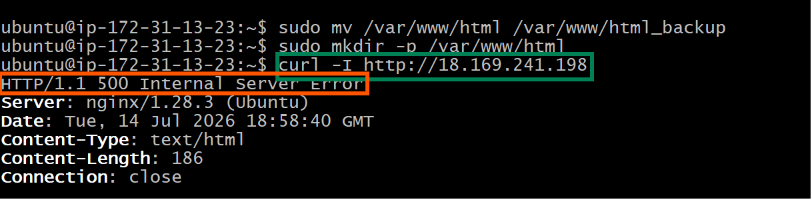
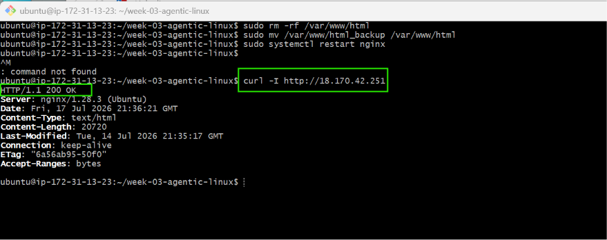
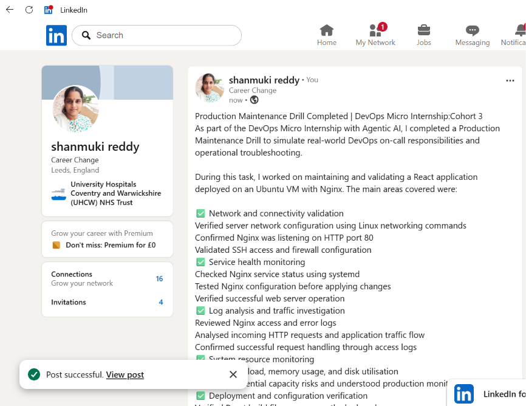

# Assignment 3 — Production Maintenance Drill (OPS Checklist)

Part of the DevOps Micro Internship (DMI) Cohort 3 with Agentic AI

---

## Purpose

In this assignment, you will treat your already deployed React application (on Ubuntu VM with Nginx) as a live production system. You will perform structured operational checks covering network validation, service health, log analysis, resource monitoring, configuration verification, and incident simulation with recovery — mirroring real on-call DevOps responsibilities.

---

# Task 1 — Server Access & Networking Validation

## Goal

Verify that the deployed React application is reachable from the browser and confirm basic network connectivity of the Ubuntu VM.

### Evidence

#### Screenshot 1 — Browser showing the React app with your Full Name visible on the UI

---

#### Screenshot 2 — Output of `ip a`

---

#### Screenshot 3 — Output of `sudo ss -tulpen`

---

#### Screenshot 4 — Output of `sudo ufw status`

---

### Notes

Answer the following in your own words:

**1. What proves Nginx is listening on 0.0.0.0:80?**

The sudo ss -tulpen output proves that Nginx is listening on port 80 when it shows a TCP listening entry similar to:

   **tcp LISTEN 0 511 0.0.0.0:80 0.0.0.0:* users:(("nginx",pid=xxxx,fd=xx))**

The LISTEN state confirms that a service is actively waiting for incoming TCP connections. The address 0.0.0.0:80 means that Nginx is bound to port 80 on all IPv4 network interfaces available on the server, rather than only accepting connections from the local machine (127.0.0.1). This allows external clients, such as users accessing the public IP address of the VM through a browser, to establish HTTP connections.

The process information showing nginx confirms that Nginx is the application currently holding and listening on port 80. This verifies that web traffic is being handled by the correct service and that no other application has taken control of the HTTP port.

---

**2. What proves SSH is active on port 22?**

SSH activity is confirmed in the sudo ss -tulpen output by a line similar to:

      **tcp LISTEN 0 128 0.0.0.0:22 0.0.0.0:* users:(("sshd",pid=xxxx))**

The presence of 0.0.0.0:22 shows that the SSH daemon is listening on TCP port 22 across all IPv4 interfaces. Port 22 is the default port used by the Secure Shell (SSH) protocol, which is used for remote administration of Linux servers.

The process name sshd identifies the service responsible for handling SSH connections. This confirms that remote server access is available and that administrators can securely connect to the Ubuntu VM using SSH authentication.

---

**3. Did you find any unexpected open ports? Explain briefly.**

After reviewing the output of sudo ss -tulpen, only expected production services such as SSH (port 22) and HTTP traffic through Nginx (port 80) were exposed.
No unexpected open ports were identifies.This is important because every listening network service increase the server's attack surface.

---

# Task 2 — Service Health & Systemd Validation (Nginx)

## Goal

Verify that Nginx is properly installed, running, enabled at boot, and safely configured.

### Evidence

#### Screenshot 1 — Output of `systemctl status nginx --no-pager`

---

#### Screenshot 2 — Output of `sudo nginx -t`

---

#### Screenshot 3 — Output of `sudo ss -lptn '( sport = :80 )'`

---

### Notes

Answer the following in your own words:

**1. What happens if Nginx fails to restart in production?**

If Nginx fails to restart in a production environment, the web application may become unavailable because the service responsible for handling HTTP requests is no longer running or cannot load its configuration.

Users attempting to access the application may experience connection failures, timeouts, or server errors depending on the failure condition. Common causes include invalid Nginx configuration syntax, missing files, incorrect permissions, exhausted system resources, or port conflicts with another process.

Before restarting Nginx after any configuration change, administrators should run:

**sudo nginx -t**

This validates the configuration syntax and prevents applying a broken configuration that could cause unnecessary downtime.

---

**2. What's your basic rollback plan?**

If a deployment or configuration change causes an issue, the safest approach is to roll back to the last known working version from backup or version control. After restoring, validate the configuration with `nginx -t`, restart the Nginx service, and confirm that the application is responding normally again. This helps minimise downtime and brings the production system back to a stable state.
---

# Task 3 — Logs & Request Trace

## Goal

Verify real traffic flow and analyze logs to understand system behavior and errors.

### Evidence

#### Screenshot 1 — Output of `sudo tail -n 30 /var/log/nginx/access.log`

---

#### Screenshot 2 — Output of `sudo tail -n 30 /var/log/nginx/error.log`

---

#### Screenshot 3 — Output of `sudo journalctl -u nginx --no-pager -n 50`

---

### Notes

Answer the following in your own words:

**1. Were there any errors in the logs?**

- If yes, mention 1–2 example error lines from the logs and explain what each one means in simple terms.
- If no, explain what it means if the error log is empty or shows no recent errors during your check.

No critical Nginx errors were found during the log review. The journalctl output only shows normal service lifecycle events, such as Nginx starting, stopping, and restarting successfully.

    **nginx.service: Deactivated successfully.**
    **Started nginx.service - A high performance web server and a reverse proxy server.**

These messages are informational and indicate that Nginx stopped and started correctly rather than failing.

However, the access log contains several suspicious requests, such as:

            **GET /aa2.php HTTP/1.1**
            **GET /wp-load.php HTTP/1.1**
            **GET /sh3ll.php HTTP/1.1**

These appear to be automated internet scans searching for vulnerable PHP or WordPress files. They returned HTTP status 200, meaning Nginx responded successfully, but this does not necessarily mean those files existed or that the system was compromised. The requests should still be monitored because they represent common reconnaissance activity from automated scanners.

---

**2. If there were no errors, what does that indicate about the system?**

The absence of Nginx errors indicates that the web server is currently operating normally. Nginx is starting successfully, listening on port 80, and handling incoming HTTP requests without reporting configuration, permission, or runtime failures.

It suggests that the deployed React application is being served correctly and that there are no immediate server-side issues affecting availability. However, normal operation should still be supported by continuous monitoring because access logs show that external scanners are reaching the server.

---

**3. Based on the access logs, were your curl requests visible in the log entries? What does that prove about traffic flow?**

Yes, the HTTP requests from the application check were visible in the access logs. Entries such as:

        **GET / HTTP/1.1" 200**
        **GET /static/js/main.4a151f44.js HTTP/1.1" 200**
        **GET /static/css/main.e6c13ad2.css HTTP/1.1" 200**

show that the browser successfully requested the React application's main page and static assets.

This proves that traffic successfully flowed through the complete path:

Client → Network → Ubuntu VM → Nginx → React build files → Client response

The HTTP status code 200 confirms that Nginx successfully processed the requests and returned the required application files.

---

# Task 4 — System Resource Health Check (Capacity Red Flags)

## Goal

Assess server capacity and detect potential performance or failure risks.

### Evidence

#### Screenshot 1 — Output of `uptime`

---

#### Screenshot 2 — Output of `free -h`

---

#### Screenshot 3 — Output of `df -h`

---

#### Screenshot 4 — Output of `sudo du -sh /var/* | sort -h`

---

### Notes

Answer the following in your own words:

**1. Which resource looks most critical right now? (CPU/load, memory, or disk) Explain why.**

Disk usage is the resource to monitor most closely because it is at 60% utilisation. CPU load is very low (0.00) and memory has enough available capacity, so there are currently no performance concerns.

---

**2. What happens if disk becomes 100% full in a production server?**

A full disk can cause services to fail because the system cannot write logs, create temporary files, store data, or perform updates. This can lead to application downtime and system instability.

---

# Task 5 — Configuration & Deployment Verification

## Goal

Ensure the correct React build is deployed and Nginx is serving it properly.

### Evidence

#### Screenshot 1 — Output of `ls -lah /var/www/html | head -n 20`

---

#### Screenshot 2 — Output of `grep -R "Deployed by" -n /var/www/html 2>/dev/null | head`

---

#### Screenshot 3 — Output of `grep -n "try_files" /etc/nginx/sites-available/default`

---

### Notes

Answer the following in your own words:

**1. How do you confirm that the correct version of the application is deployed?**

The correct version can be confirmed by checking the deployed files in /var/www/html, verifying that the React build files such as index.html, static/js, and static/css are present. The deployment marker was also found inside the application JavaScript bundle, showing the expected application details and confirming that the correct React build was deployed.

Additionally, the Nginx configuration contains:

            **try_files $uri /index.html;**

which confirms that Nginx is correctly configured to serve the React single-page application.

---

# Task 6 — Nginx Configuration Failure Simulation

## Goal

Simulate a real-world Nginx misconfiguration and recover the service safely.

### Evidence

#### Screenshot 1 — Output of `sudo nginx -t` showing the syntax error (broken config)

---

#### Screenshot 2 — Output of `sudo nginx -t` showing syntax ok (fixed config)

---

#### Screenshot 3 — Output of `curl -I http://<public-ip>` confirming recovery (200 OK)

---

### Notes

Answer the following in your own words:

**1. What caused the configuration failure?**
The failure was caused by removing the semicolon (;) from the Nginx try_files directive. This created invalid Nginx configuration syntax, causing nginx -t to fail and preventing Nginx from safely reloading the configuration.

---

**2. How did you fix the issue?**

I restored the missing semicolon in the Nginx configuration file, ran sudo nginx -t to confirm that the syntax was valid, restarted the Nginx service, and verified recovery using curl -I to confirm the application returned an HTTP 200 response.

---

**3. How can you avoid this kind of issue in real production systems?**

This can be avoided by always testing Nginx configuration changes with nginx -t before restarting, using version control for configuration files, reviewing changes before deployment, and using automated CI/CD checks to detect configuration errors before they reach production.
---

# Task 7 — Web Application Failure Simulation

## Goal

Simulate missing deployment content and recover the application safely.

### Evidence

#### Screenshot 1 — Output of `curl -I http://<public-ip>` showing failure (non-200 response)

---

#### Screenshot 2 — Output of `curl -I http://<public-ip>` confirming recovery (200 OK)

---

### Notes

Answer the following in your own words:

**1. What caused the application to break in this scenario?**

The application failed because the deployed web files were removed from /var/www/html and replaced with an empty directory. As a result, Nginx could no longer find the required React application files, causing the server to return a 500 Internal Server Error.

---

**2. How did you fix the issue and restore the application?**

I restored the application by removing the empty /var/www/html directory and moving the backup directory back to its original location. I then restarted Nginx and verified recovery using curl -I, which returned HTTP 200 OK, confirming that the application was available again.

---

**3. What steps would you take to prevent this kind of issue in real production systems?**

To prevent this issue, I would use automated deployments with backups, maintain version control for application releases, test deployments before making them live, and use monitoring and health checks to detect failures quickly. A rollback process should also be available to restore the last working version safely.

---

# Task 8 — Security & Reliability Review

## Goal

Review and reflect on the security and reliability practices applied during this assignment.

### Security & Reliability Notes

Answer the following in your own words:

**1. Why is SSH key-based authentication more secure than sharing passwords?**

SSH key-based authentication uses cryptographic keys instead of passwords, making it much harder for attackers to gain access through brute-force attacks. The private key remains securely stored on the user's device and is never shared with the server.

---

**2. Why should only required ports be open on a production server?**

Only required ports should be open to reduce the attack surface. Closing unnecessary ports prevents attackers from accessing unused services and reduces potential security vulnerabilities.

---

**3. Why is it important for Nginx to be enabled on boot?**

Enabling Nginx on boot ensures that the web server automatically starts after a system restart. This helps maintain application availability without requiring manual intervention.
---

**4. What are the risks of sharing secrets, keys, or credentials publicly?**

Publicly exposed secrets or credentials can allow unauthorised users to access servers, cloud resources, or sensitive data. This can lead to data breaches, service abuse, financial loss, and security incidents.

---

**5. Why should cloud resources be stopped or terminated when they are no longer needed?**

Unused cloud resources should be stopped or terminated to avoid unnecessary costs and reduce security risks. Removing unused resources also prevents forgotten services from becoming potential targets for attackers.

---

# LinkedIn Post (Required)

## Evidence

#### LinkedIn Post URL

Paste your LinkedIn post URL here:

`https://www.linkedin.com/posts/shanmuki-reddy_dmibypravinmishra-devops-agenticai-ugcPost-7484000667553058816-gMyA/?utm_source=share&utm_medium=member_desktop&rcm=ACoAAE0LbgwBcO3gizrVfuqLPvGD60OHg7LFHRw `

---

#### Screenshot — Published LinkedIn post

---

# Submission Instructions

- Add all required screenshots in your submission
- Full name must be visible in required screenshots
- Do not expose sensitive information (keys, passwords, account IDs)

---

# Completion Checklist

- [ ] Task 1: Screenshots (browser, ip a, ss -tulpen, ufw status) + Notes answered
- [ ] Task 2: Screenshots (nginx status, nginx -t, ss port 80) + Notes answered
- [ ] Task 3: Screenshots (access log, error log, journalctl) + Notes answered
- [ ] Task 4: Screenshots (uptime, free -h, df -h, du -sh) + Notes answered
- [ ] Task 5: Screenshots (ls html, grep deployed by, grep try_files) + Notes answered
- [ ] Task 6: Screenshots (nginx -t fail, nginx -t pass, curl recovery) + Notes answered
- [ ] Task 7: Screenshots (curl failure, curl recovery) + Notes answered
- [ ] Task 8: Security & Reliability Notes answered
- [ ] LinkedIn post published and URL submitted
- [ ] Full Name visible in all required screenshots
- [ ] No sensitive data exposed

---

## 📌 About DMI & CloudAdvisory

DevOps Micro Internship (DMI) is a project-based DevOps program run by Pravin Mishra (The CloudAdvisory) focused on real-world execution, systems thinking, and career readiness.

It helps learners build strong DevOps foundations with hands-on experience.

---

## 📌 Resources

- 🌐 DMI Official Website: https://pravinmishra.com/dmi  
- 🎓 DevOps for Beginners (Udemy): https://www.udemy.com/course/devops-for-beginners-docker-k8s-cloud-cicd-4-projects/  
- 🎓 Agentic AI DevOps with Claude Code: https://www.udemy.com/course/ultimate-agentic-ai-devops-with-claude-code/  
- 🎓 DevOps with Claude Code: Terraform, EKS, ArgoCD & Helm: https://www.udemy.com/course/devops-with-claude-code-terraform-eks-argocd-helm/  
- ▶️ YouTube Playlist: https://www.youtube.com/playlist?list=PLFeSNDtI4Cho  
- 🔗 Pravin Mishra (LinkedIn): https://www.linkedin.com/in/pravin-mishra-aws-trainer/  
- 🏢 CloudAdvisory (LinkedIn): https://www.linkedin.com/company/thecloudadvisory/

---

*This submission is part of DevOps Micro Internship (DMI) Cohort 3 — Agentic AI Track.*