# Assignment 3 — Production Maintenance Drill (OPS Checklist)

Part of the DevOps Micro Internship (DMI) Cohort 3 with Agentic AI

---

## Purpose

In this assignment, you will treat your already deployed React application (on Ubuntu VM with Nginx) as a live production system. You will perform structured operational checks covering network validation, service health, log analysis, resource monitoring, configuration verification, and incident simulation with recovery — mirroring real on-call DevOps responsibilities.

---

# Task 1 — Server Access & Networking Validation

## Goal

Verify that the deployed React application is reachable from the browser and confirm basic network connectivity of the Ubuntu VM.

### Evidence

#### Screenshot 1 — Browser showing the React app with your Full Name visible on the UI

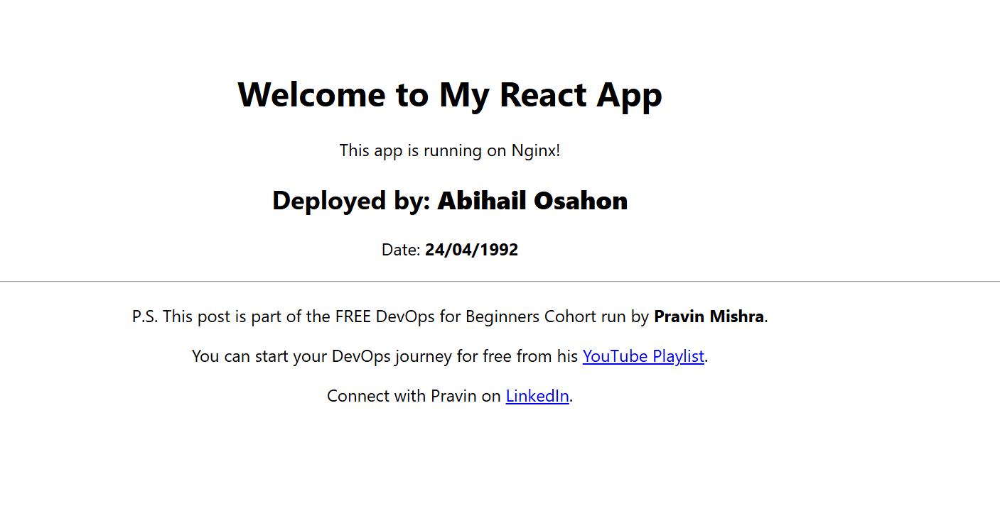

---

#### Screenshot 2 — Output of `ip a`

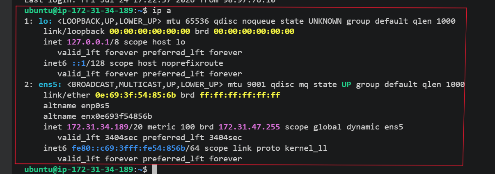

---

#### Screenshot 3 — Output of `sudo ss -tulpen`

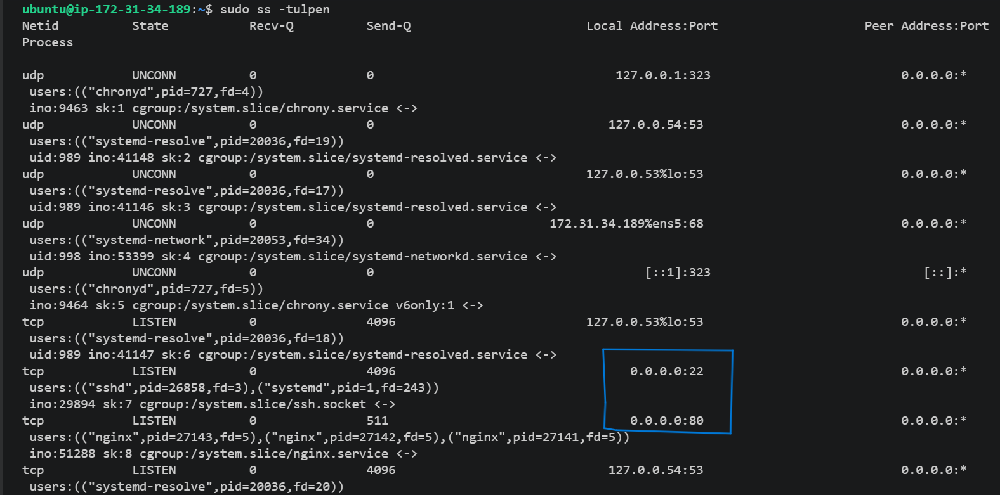

---

#### Screenshot 4 — Output of `sudo ufw status`

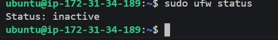

---

### Notes

Answer the following in your own words:

**1. What proves Nginx is listening on 0.0.0.0:80?**

What proves Nginx is listening on 0.0.0.0:80 is the output from sudo ss -tulpen. It shows 0.0.0.0:80 in the LISTEN state with Nginx using that port, which means Nginx is ready to accept HTTP requests from any network interface on the server.

---

**2. What proves SSH is active on port 22?**

The output from sudo ss -tulpen also proves that SSH is active on port 22. It shows 0.0.0.0:22 in the LISTEN state with the sshd process attached, which confirms that the SSH service is running and ready to accept remote connections.

---

**3. Did you find any unexpected open ports? Explain briefly.**

No, I did not find any unexpected open ports. The only open ports were 22 for SSH and 80 for Nginx, which are expected for this server. The other entries shown, like port 53 for DNS and 323 for the Chrony time service, are system services used by Ubuntu and are not unexpected.

---

# Task 2 — Service Health & Systemd Validation (Nginx)

## Goal

Verify that Nginx is properly installed, running, enabled at boot, and safely configured.

### Evidence

#### Screenshot 1 — Output of `systemctl status nginx --no-pager`

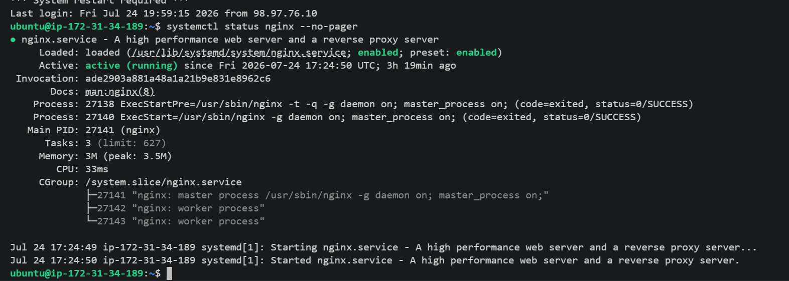

---

#### Screenshot 2 — Output of `sudo nginx -t`

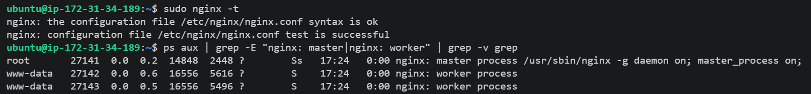

---

#### Screenshot 3 — Output of `sudo ss -lptn '( sport = :80 )'`

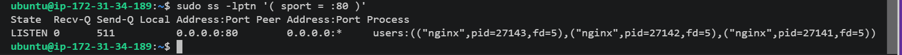

---

### Notes

Answer the following in your own words:

**1. What happens if Nginx fails to restart in production?**

If Nginx fails to restart in production, the website or application will become unavailable to users because it will stop serving HTTP requests. This can lead to downtime, affect the user experience, and may require immediate troubleshooting to restore the service.

---

**2. What's your basic rollback plan?**

My basic rollback plan is to first check what caused Nginx to fail, fix any configuration issues, and test the configuration with sudo nginx -t. If the problem started after a recent change, I would restore the last working Nginx configuration or redeploy the previous stable version of the application, then restart Nginx and verify that the website is accessible again.

---

# Task 3 — Logs & Request Trace

## Goal

Verify real traffic flow and analyze logs to understand system behavior and errors.

### Evidence

#### Screenshot 1 — Output of `sudo tail -n 30 /var/log/nginx/access.log`

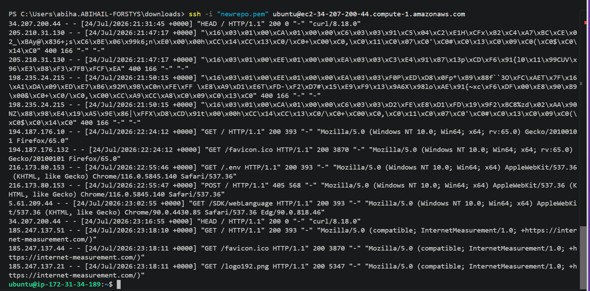

---

#### Screenshot 2 — Output of `sudo tail -n 30 /var/log/nginx/error.log`

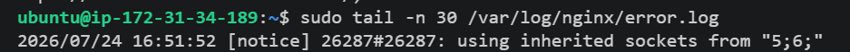

---

#### Screenshot 3 — Output of `sudo journalctl -u nginx --no-pager -n 50`

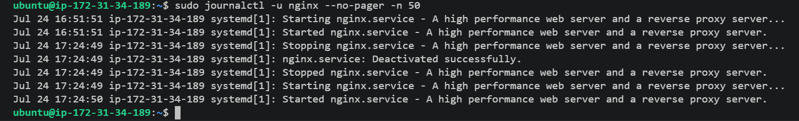

---

### Notes

Answer the following in your own words:

**1. Were there any errors in the logs?**

- If yes, mention 1–2 example error lines from the logs and explain what each one means in simple terms.
- If no, explain what it means if the error log is empty or shows no recent errors during your check.

I did not find any actual errors in the Nginx error log. The only message I saw was:

2026/07/24 16:51:52 [notice] 26287#26287: using inherited sockets from "5;6;"

This is an informational notice, not an error. It means Nginx reused existing network sockets during a restart or reload, which helps keep the service running smoothly without interrupting active connections. Since there were no error messages, it indicates that Nginx was operating normally during my checks.

---

**2. If there were no errors, what does that indicate about the system?**

If there are no errors in the log, it indicates that the system is running normally. It means Nginx handled requests without any issues during my checks, and there were no problems serious enough to be recorded in the error log.

---

**3. Based on the access logs, were your curl requests visible in the log entries? What does that prove about traffic flow?**

Yes, my curl requests were visible in the access log. This proves that the requests successfully reached the Nginx server, were processed, and were recorded in the log. It confirms that traffic is flowing correctly between the client and the server and that Nginx is handling incoming requests as expected.

---

# Task 4 — System Resource Health Check (Capacity Red Flags)

## Goal

Assess server capacity and detect potential performance or failure risks.

### Evidence

#### Screenshot 1 — Output of `uptime`

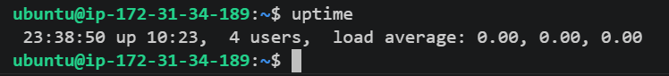

---

#### Screenshot 2 — Output of `free -h`

1[Free -h](./screenshots/week3assignment3/task4image2.png)

---

#### Screenshot 3 — Output of `df -h`

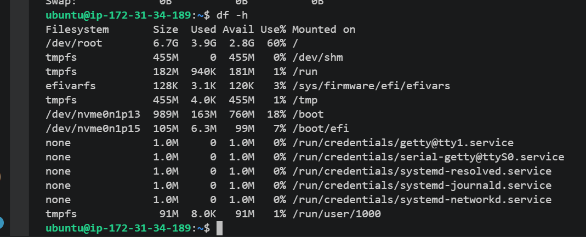

---

#### Screenshot 4 — Output of `sudo du -sh /var/* | sort -h`

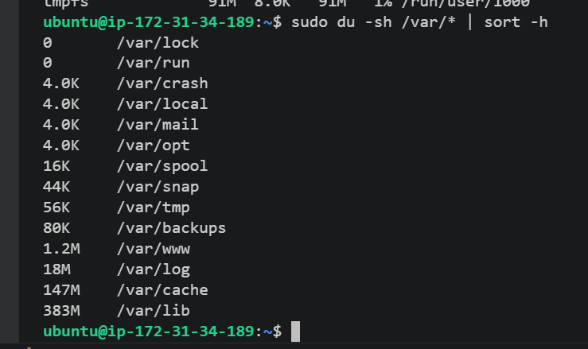

---

### Notes

Answer the following in your own words:

**1. Which resource looks most critical right now? (CPU/load, memory, or disk) Explain why.**

Out of the three resources, disk usage looks the most critical right now. The root partition is using about 60% of its available space, while the CPU load is 0.00 and memory still has around 548 MB available. Although 60% is not a problem yet, I would keep an eye on it to make sure the disk does not fill up over time, especially as logs and application files continue to grow.

---

**2. What happens if disk becomes 100% full in a production server?**

If the disk becomes 100% full, the server can start having serious problems. Applications may not be able to write files, logs may stop updating, new data cannot be saved, and some services could fail or crash. In a production environment, this can lead to downtime and affect users until enough disk space is freed.

---

# Task 5 — Configuration & Deployment Verification

## Goal

Ensure the correct React build is deployed and Nginx is serving it properly.

### Evidence

#### Screenshot 1 — Output of `ls -lah /var/www/html | head -n 20`

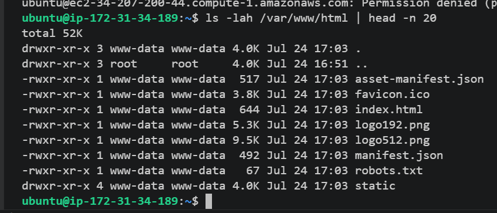

---

#### Screenshot 2 — Output of `grep -R "Deployed by" -n /var/www/html 2>/dev/null | head`

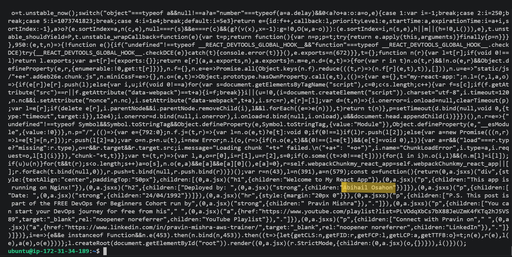

---

#### Screenshot 3 — Output of `grep -n "try_files" /etc/nginx/sites-available/default`

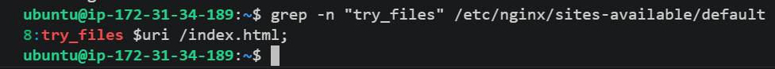

---

### Notes

Answer the following in your own words:

**1. How do you confirm that the correct version of the application is deployed?**

I confirm that the correct version of the application is deployed by opening it in the browser and checking that the expected changes are visible. I also verify that Nginx is serving the application correctly and, if needed, compare the deployed files with the latest version in the project to make sure they match.

---

# Task 6 — Nginx Configuration Failure Simulation

## Goal

Simulate a real-world Nginx misconfiguration and recover the service safely.

### Evidence

#### Screenshot 1 — Output of `sudo nginx -t` showing the syntax error (broken config)

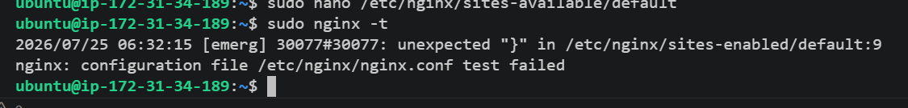

---

#### Screenshot 2 — Output of `sudo nginx -t` showing syntax ok (fixed config)

!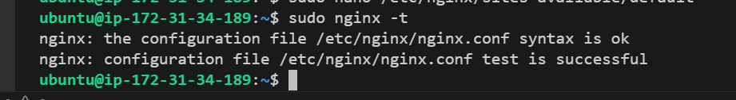

---

#### Screenshot 3 — Output of `curl -I http://<public-ip>` confirming recovery (200 OK)

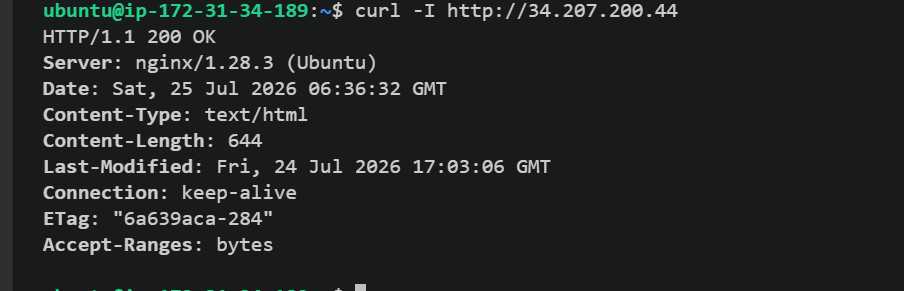

---

### Notes

Answer the following in your own words:

**1. What caused the configuration failure?**

The configuration failed because I removed the semicolon at the end of the try_files directive. Since Nginx requires each directive to end with a semicolon, the missing semicolon caused a syntax error, which was detected when I ran sudo nginx -t.

---

**2. How did you fix the issue?**

I fixed the issue by adding the missing semicolon back to the try_files directive, saving the configuration file, and running sudo nginx -t again. The test returned "syntax is ok" and "test is successful," confirming that the configuration was valid again.

---

**3. How can you avoid this kind of issue in real production systems?**

To avoid this kind of issue in a real production system, I would always test the Nginx configuration with sudo nginx -t before restarting or reloading the service. I would also review configuration changes carefully and, if possible, test them in a staging environment before applying them to the production server.

---

# Task 7 — Web Application Failure Simulation

## Goal

Simulate missing deployment content and recover the application safely.

### Evidence

#### Screenshot 1 — Output of `curl -I http://<public-ip>` showing failure (non-200 response)

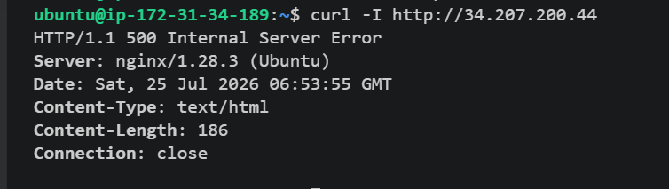

---

#### Screenshot 2 — Output of `curl -I http://<public-ip>` confirming recovery (200 OK)

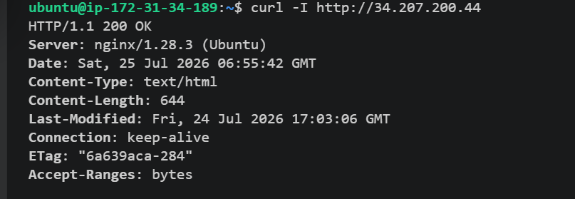

---

### Notes

Answer the following in your own words:

**1. What caused the application to break in this scenario?**

The application broke because there was a server-side configuration issue. In this scenario, the Nginx configuration had been intentionally modified during the assignment, which caused the server to return a 500 Internal Server Error instead of serving the application. This shows that an incorrect server configuration can prevent the application from working properly.

---

**2. How did you fix the issue and restore the application?**

I fixed the issue by correcting the Nginx configuration, saving the file, and running sudo nginx -t to verify that the configuration was valid. After the test returned "syntax is ok" and "test is successful," I reloaded Nginx. I then confirmed the application was restored by running curl -I http://34.207.200.44, which returned HTTP/1.1 200 OK, showing that the application was serving requests successfully again.

---

**3. What steps would you take to prevent this kind of issue in real production systems?**

To prevent this kind of issue in a real production system, I would always test the Nginx configuration with sudo nginx -t before reloading or restarting the service. I would also review configuration changes carefully, keep backups of working configurations, and test changes in a staging environment before deploying them to production. This helps catch errors early and reduces the risk of downtime.

---

# Task 8 — Security & Reliability Review

## Goal

Review and reflect on the security and reliability practices applied during this assignment.

### Security & Reliability Notes

Answer the following in your own words:

**1. Why is SSH key-based authentication more secure than sharing passwords?**

SSH key-based authentication is more secure because it uses a pair of cryptographic keys instead of a password that can be guessed or stolen. It also reduces the risk of brute-force attacks and makes it harder for unauthorized users to gain access to the server.

---

**2. Why should only required ports be open on a production server?**

Only the required ports should be open to reduce the server's attack surface. Keeping unnecessary ports closed helps prevent unauthorized access and lowers the risk of attackers exploiting services that are not needed.

---

**3. Why is it important for Nginx to be enabled on boot?**

Enabling Nginx on boot ensures that the web server starts automatically whenever the server restarts. This helps keep the application available without requiring someone to manually start the service after every reboot.

---

**4. What are the risks of sharing secrets, keys, or credentials publicly?**

Sharing secrets, API keys, passwords, or credentials publicly can allow unauthorized users to access systems, steal data, make unwanted changes, or misuse cloud resources. It can also lead to security breaches and unexpected costs if the credentials are abused.

---

**5. Why should cloud resources be stopped or terminated when they are no longer needed?**

Cloud resources should be stopped or terminated when they are no longer needed to avoid unnecessary charges and reduce security risks. Removing unused resources also helps keep the cloud environment clean and easier to manage.

---

# LinkedIn Post (Required)

## Evidence

#### LinkedIn Post URL

https://www.linkedin.com/posts/abihail-osahon-096564232_devops-aws-linux-ugcPost-7486687149120118784-iCwR/?utm_source=share&utm_medium=member_desktop&rcm=ACoAADoaXXIBPrMQ_TL1SPeACNDTKQQWRcfVxDU

`__________________________`

---

#### Screenshot — Published LinkedIn post

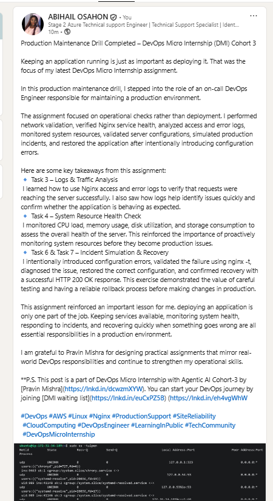

---

# Submission Instructions

- Add all required screenshots in your submission
- Full name must be visible in required screenshots
- Do not expose sensitive information (keys, passwords, account IDs)

---

# Completion Checklist

- [ ] Task 1: Screenshots (browser, ip a, ss -tulpen, ufw status) + Notes answered
- [ ] Task 2: Screenshots (nginx status, nginx -t, ss port 80) + Notes answered
- [ ] Task 3: Screenshots (access log, error log, journalctl) + Notes answered
- [ ] Task 4: Screenshots (uptime, free -h, df -h, du -sh) + Notes answered
- [ ] Task 5: Screenshots (ls html, grep deployed by, grep try_files) + Notes answered
- [ ] Task 6: Screenshots (nginx -t fail, nginx -t pass, curl recovery) + Notes answered
- [ ] Task 7: Screenshots (curl failure, curl recovery) + Notes answered
- [ ] Task 8: Security & Reliability Notes answered
- [ ] LinkedIn post published and URL submitted
- [ ] Full Name visible in all required screenshots
- [ ] No sensitive data exposed

---

## 📌 About DMI & CloudAdvisory

DevOps Micro Internship (DMI) is a project-based DevOps program run by Pravin Mishra (The CloudAdvisory) focused on real-world execution, systems thinking, and career readiness.

It helps learners build strong DevOps foundations with hands-on experience.

---

## 📌 Resources

- 🌐 DMI Official Website: https://pravinmishra.com/dmi  
- 🎓 DevOps for Beginners (Udemy): https://www.udemy.com/course/devops-for-beginners-docker-k8s-cloud-cicd-4-projects/  
- 🎓 Agentic AI DevOps with Claude Code: https://www.udemy.com/course/ultimate-agentic-ai-devops-with-claude-code/  
- 🎓 DevOps with Claude Code: Terraform, EKS, ArgoCD & Helm: https://www.udemy.com/course/devops-with-claude-code-terraform-eks-argocd-helm/  
- ▶️ YouTube Playlist: https://www.youtube.com/playlist?list=PLFeSNDtI4Cho  
- 🔗 Pravin Mishra (LinkedIn): https://www.linkedin.com/in/pravin-mishra-aws-trainer/  
- 🏢 CloudAdvisory (LinkedIn): https://www.linkedin.com/company/thecloudadvisory/

---

*This submission is part of DevOps Micro Internship (DMI) Cohort 3 — Agentic AI Track.*