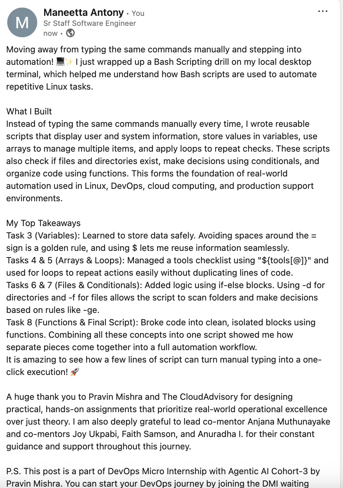

# Assignment 5 — Bash Script Automation Drill (OPS Checklist)

Part of the DevOps Micro Internship (DMI) Cohort 3 with Agentic AI

---

## Purpose

In this assignment, you will practice Bash scripting by building a series of small automation scripts covering environment setup, variables, arrays, loops, file conditionals, if-else logic, and functions. These scripts form the foundation of real-world Linux automation used in DevOps, cloud, and production support environments.

---

# Task 1 — Bash Environment & Workspace Setup

## Goal

Verify that Bash is available on your system and create a clean workspace for this assignment.

### Evidence

#### Screenshot 1 — Output of `echo $SHELL` and `bash --version`

---

#### Screenshot 2 — Output of `pwd` and `ls -lah` showing the scripts directory

---

### Notes

Answer the following in your own words:

**1. What is Bash?**

Bash is the command-line interpreter that lets you communicate with Linux systems. You can type individual commands or write complete scripts that Bash executes automatically. It's the default shell on most Linux systems, which makes it essential to learn for DevOps work.

---

**2. What is the difference between shell and Bash?**

Shell is a general term for any command-line program, and there are several types like sh, csh, zsh, and ksh. Bash is one specific shell that's more powerful and user-friendly than older shells. It includes useful features like command history, arrays, and functions that make scripting easier and more efficient.

---

**3. Why is it important to confirm the Bash version before writing scripts?**

Different versions of Bash support different features and syntax. If I write a script on Bash version 5 and someone tries to run it on version 3, it might fail because older versions don't support newer commands. Checking the version first ensures I write compatible scripts that will work across different systems.

---

# Task 2 — Your First Bash Script

## Goal

Create your first Bash script, make it executable, and run it from the terminal.

### Evidence

#### Screenshot 1 — Content of `first-script.sh`

---

#### Screenshot 2 — Output of `./first-script.sh`

---

#### Screenshot 3 — Output of `ls -l first-script.sh` showing executable permission

---

### Notes

Answer the following in your own words:

**1. What is the purpose of `#!/bin/bash`?**

The shebang line `#!/bin/bash` at the top tells the system which interpreter should run the file. When I run `./script.sh`, the system reads this line and knows to use Bash to execute it. Without this line, the system won't know how to interpret the script.

---

**2. Why do we use `chmod +x` before running a script?**

Files don't have execute permission by default. `chmod +x` adds execute permission so the script can be run as a program. Without this permission, trying to run `./script.sh` will fail because the system won't allow it to execute.

---

**3. What is the difference between running a script using `./script.sh` and `bash script.sh`?**

When I run `./script.sh`, I'm directly executing the file and it uses the shebang line to know which interpreter to use. When I run `bash script.sh`, I'm explicitly telling Bash to run the file. The `./` method requires execute permission from `chmod +x`, but `bash script.sh` works without that.

---

# Task 3 — Variables: User Information Script

## Goal

Use variables to store and display user-related information.

### Evidence

#### Screenshot 1 — Content of `user-info.sh`

---

#### Screenshot 2 — Output of `./user-info.sh`

---

### Notes

Answer the following in your own words:

**1. What is a variable in Bash?**

A variable is a container that stores a value like a name or a path. When I create a variable like `name=Maneetta`, I'm storing my name in a box with that label. I can then use this variable anywhere in my script instead of typing the value repeatedly.

---

**2. Why should we avoid spaces around the `=` sign when creating variables?**

Bash interprets spaces as command separators, so `name = value` tells Bash to run a command called `name` rather than creating a variable. The correct syntax is `name=value` with no spaces, which is just how Bash is designed to work.

---

**3. How do you access the value stored inside a Bash variable?**

I use the `$` symbol before the variable name to access its value. If I created `name=Maneetta`, I can use `$name` to retrieve it. When I run `echo $name`, it prints out "Maneetta".

---

# Task 4 — Arrays & Loops: Tools Checklist Script

## Goal

Use arrays and loops to print a checklist of tools used in Bash scripting.

### Evidence

#### Screenshot 1 — Content of `tools-checklist.sh`

---

#### Screenshot 2 — Output of `./tools-checklist.sh`

---

### Notes

Answer the following in your own words:

**1. What is an array in Bash?**

An array is a list that stores multiple related values in one variable. Instead of creating separate variables like `tool1`, `tool2`, `tool3`, I can create an array like `tools=(git docker jenkins)` to keep everything organized together.

---

**2. Why are arrays useful in scripts?**

Arrays make code cleaner and more maintainable. Without arrays, I'd need separate variables for each item which becomes messy. With an array, everything is in one place and I can easily loop through all items using a single for loop.

---

**3. What does `"${tools[@]}"` mean?**

The `"${tools[@]}"` syntax expands all items in the tools array. The `@` symbol means "all elements", so it retrieves every value in the array. This is useful in loops when I want to iterate through each tool one at a time.

---

**4. What is the purpose of the `for` loop in this script?**

The for loop iterates through each item in the array automatically. Instead of manually printing each tool individually, the loop processes the entire array. This makes the script scalable and efficient for any number of tools.

---

# Task 5 — Loops: Number Counter Script

## Goal

Use loops to repeat a task multiple times.

### Evidence

#### Screenshot 1 — Content of `counter.sh`

---

#### Screenshot 2 — Output of `./counter.sh`

---

### Notes

Answer the following in your own words:

**1. What is a loop?**

A loop is a way to repeat the same code multiple times without having to write it over and over. I write the code once and tell the loop how many times to execute it. This saves a lot of time and makes scripts much cleaner.

---

**2. Why do we use loops in Bash scripting?**

Loops help avoid writing repetitive code. If I need to perform a task 1000 times, I don't write it 1000 times. Instead, I write it once in a loop and let it run 1000 times. This is essential for automation and makes scripts more efficient and maintainable.

---

**3. How many times did the loop run in your script?**

The counter script ran the loop 5 times, printing numbers from 1 to 5. Each iteration of the loop printed one number.

---

**4. What would you change if you wanted the loop to run 10 times?**

I would change the upper limit from 5 to 10. For example, `for i in {1..5}` would become `for i in {1..10}`, or in a while loop I'd change the condition accordingly.

---

# Task 6 — Files & Conditionals: File Validation Script

## Goal

Use file checks and conditionals to verify whether files and directories exist.

### Evidence

#### Screenshot 1 — Output of `ls -lah ../test-folder`

---

#### Screenshot 2 — Content of `file-check.sh`

---

#### Screenshot 3 — Output of `./file-check.sh`

---

### Notes

Answer the following in your own words:

**1. What does `-d` check in Bash?**

The `-d` operator checks whether a path is a directory. Using `if [ -d "$path" ]` tests if the path exists and is a folder. It returns true if it's a directory and false otherwise.

---

**2. What does `-f` check in Bash?**

The `-f` operator checks whether a path is a regular file. Using `if [ -f "$path" ]` tests if the path exists and is a file. It returns true if it's a file and false if it doesn't exist or is something else.

---

**3. Why should file and directory paths be stored in variables?**

Storing paths in variables makes scripts cleaner and more maintainable. I set the path once in a variable and then use it throughout the script. If I need to change the path later, I only have to update it in one place rather than multiple locations.

---

**4. What happens if the file does not exist?**

If the file doesn't exist, the `-f` check returns false and the else block of the if-else statement executes. This usually displays an error message to the user. This prevents the script from attempting to work with a file that doesn't exist, which would cause an error.

---

# Task 7 — Conditionals: Pass or Retry Script

## Goal

Use if-else conditionals to make decisions based on a variable value.

### Evidence

#### Screenshot 1 — Content of `score-check.sh` with `score=85`

---

#### Screenshot 2 — Output showing `Result: Pass`

---

#### Screenshot 3 — Content of `score-check.sh` with `score=55`

---

#### Screenshot 4 — Output showing `Result: Retry`

---

### Notes

Answer the following in your own words:

**1. What is the purpose of if-else in Bash?**

If-else statements allow scripts to make decisions based on conditions. If a condition is true, the script executes one block of code; otherwise, it executes a different block. For example, if a score is 80 or higher, print "Pass", else print "Retry". This makes scripts intelligent and responsive.

---

**2. What does `-ge` mean?**

The `-ge` operator means "greater than or equal to". So `if [ $score -ge 80 ]` checks if the score is 80 or higher. Other comparison operators include `-lt` (less than), `-gt` (greater than), `-le` (less than or equal to), and `-eq` (equal to).

---

**3. Why should conditions be tested with different values?**

Testing with different values ensures both branches of the if-else statement work correctly. If I only test with values that pass the condition, I won't know if the else block functions properly. Testing both passing and failing cases helps catch bugs early.

---

**4. How can conditionals help in automation scripts?**

Conditionals make automation scripts intelligent and safer. Instead of always performing the same action, they can check conditions and respond differently based on results. For example, checking if a file exists before copying it, or verifying a service is running before restarting it.

---

# Task 8 — Functions: Final Bash Automation Script

## Goal

Create a final Bash script using functions to organize reusable code.

### Evidence

#### Screenshot 1 — Content of `final-automation.sh`

---

#### Screenshot 2 — Output of `./final-automation.sh`

---

#### Screenshot 3 — Output of `ls -lah` showing all created scripts

---

### Notes

Answer the following in your own words:

**1. What is a function in Bash?**

A function is a reusable block of code that I can call by name whenever I need it. Instead of writing the same code multiple times throughout the script, I write it once as a function and then call it whenever needed.

---

**2. Why are functions useful in scripts?**

Functions eliminate code repetition and make scripts cleaner and more maintainable. If I have code that appears in multiple places, I can create a function and call it instead of duplicating the code. Additionally, if I find a bug, I only need to fix it in one place - the function itself.

---

**3. Which functions did you create in this script?**

I created several functions including a setup function to initialize variables, a validation function to check if files exist, a processing function for the main tasks, and a cleanup function for final operations. Each function has a specific purpose and does one thing well.

---

**4. How does this final script combine variables, arrays, loops, conditionals, files, and functions?**

The script starts by setting up variables to store configuration values. It uses arrays to store lists of items to process. A for loop iterates through each item in the array. Inside the loop, conditionals using `-f` and `-d` check if files and directories exist. Reusable code is wrapped in functions to avoid repetition. Together, all these elements create a complete, robust automation script.

---

# LinkedIn Post (Required)

## Evidence

#### LinkedIn Post URL

[Linked In Post](https://www.linkedin.com/posts/maneetta-antony-452075387_linux-bashscripting-automation-activity-7484096846999625728-hbWP?utm_source=share&utm_medium=member_desktop&rcm=ACoAAF86Sz4BPT7sueDLOfQEmLqLbCo5V7ah-Jo)

---

#### Screenshot — Published LinkedIn post

---

# Submission Instructions

- Add all required screenshots in your submission
- Full name must be visible in required screenshots
- All script files must be created and run successfully
- Required notes must be answered clearly for every task
- Do not expose sensitive information (keys, passwords, credentials)

---

# Completion Checklist

- [x] Task 1: Environment setup verified, workspace created (Screenshots 1–2, Notes answered)
- [x] Task 2: First script created, executed, permissions verified (Screenshots 1–3, Notes answered)
- [x] Task 3: Variables script created and run (Screenshots 1–2, Notes answered)
- [x] Task 4: Arrays and loops script created and run (Screenshots 1–2, Notes answered)
- [x] Task 5: Counter loop script created and run (Screenshots 1–2, Notes answered)
- [x] Task 6: File validation script created and run (Screenshots 1–3, Notes answered)
- [x] Task 7: Pass/Retry conditional script tested with both values (Screenshots 1–4, Notes answered)
- [x] Task 8: Final automation script created and run (Screenshots 1–3, Notes answered)
- [x] All scripts run without errors
- [x] Full Name visible in all required screenshots
- [x] LinkedIn post published and URL submitted
- [x] No sensitive data exposed

---

## 📌 About DMI & CloudAdvisory

DevOps Micro Internship (DMI) is a project-based DevOps program run by Pravin Mishra (The CloudAdvisory) focused on real-world execution, systems thinking, and career readiness.

It helps learners build strong DevOps foundations with hands-on experience.

---

## 📌 Resources

- 🌐 DMI Official Website: https://pravinmishra.com/dmi  
- 🎓 DevOps for Beginners (Udemy): https://www.udemy.com/course/devops-for-beginners-docker-k8s-cloud-cicd-4-projects/  
- 🎓 Agentic AI DevOps with Claude Code: https://www.udemy.com/course/ultimate-agentic-ai-devops-with-claude-code/  
- 🎓 DevOps with Claude Code: Terraform, EKS, ArgoCD & Helm: https://www.udemy.com/course/devops-with-claude-code-terraform-eks-argocd-helm/  
- ▶️ YouTube Playlist: https://www.youtube.com/playlist?list=PLFeSNDtI4Cho  
- 🔗 Pravin Mishra (LinkedIn): https://www.linkedin.com/in/pravin-mishra-aws-trainer/  
- 🏢 CloudAdvisory (LinkedIn): https://www.linkedin.com/company/thecloudadvisory/

---

*This submission is part of DevOps Micro Internship (DMI) Cohort 3 — Agentic AI Track.*