# Assignment 5 — Bash Script Automation Drill (OPS Checklist)

Part of the DevOps Micro Internship (DMI) Cohort 3 with Agentic AI

---

## Purpose

In this assignment, you will practice Bash scripting by building a series of small automation scripts covering environment setup, variables, arrays, loops, file conditionals, if-else logic, and functions. These scripts form the foundation of real-world Linux automation used in DevOps, cloud, and production support environments.

---

# Task 1 — Bash Environment & Workspace Setup

## Goal

Verify that Bash is available on your system and create a clean workspace for this assignment.

### Evidence

#### Screenshot 1 — Output of `echo $SHELL` and `bash --version`

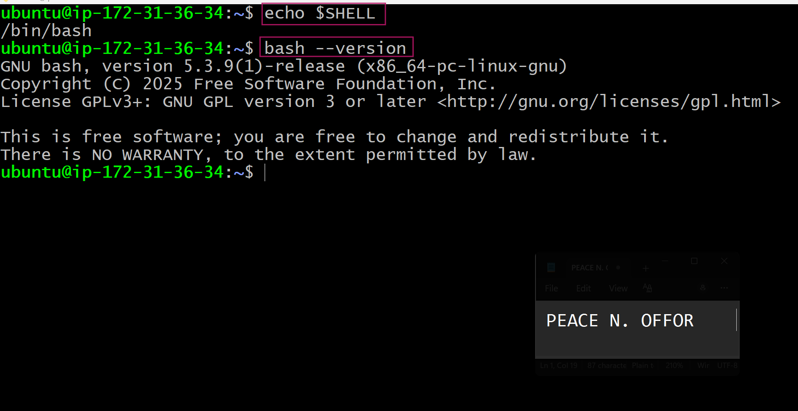.

---

#### Screenshot 2 — Output of `pwd` and `ls -lah` showing the scripts directory

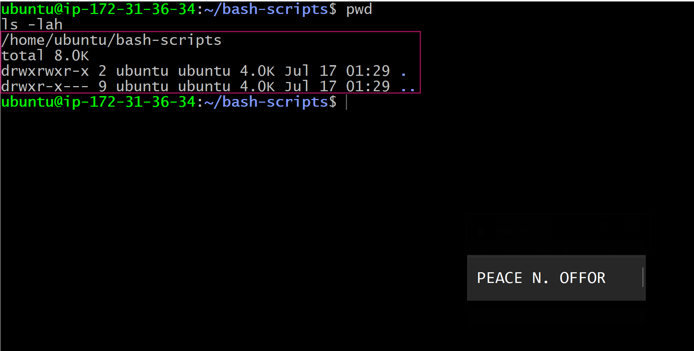.

---

### Notes

Answer the following in your own words:

**1. What is Bash?**

Bash is a command-line shell that lets me interact with a Linux system by running commands. It also allows me to write scripts that automate repetitive tasks instead of doing everything manually.

---

**2. What is the difference between shell and Bash?**

A shell is the general interface that accepts commands and communicates with the operating system. Bash is one of the most widely used shell programs on Linux, so while every Bash is a shell, not every shell is Bash.

---

**3. Why is it important to confirm the Bash version before writing scripts?**

I confirm the Bash version because different versions support different features. Knowing the version helps me avoid writing scripts that might not work correctly on another system.

---

# Task 2 — Your First Bash Script

## Goal

Create your first Bash script, make it executable, and run it from the terminal.

### Evidence

#### Screenshot 1 — Content of `first-script.sh`

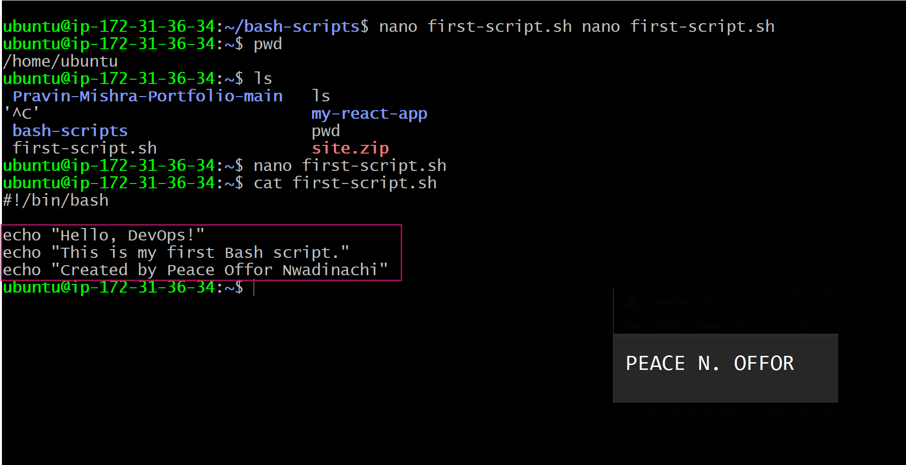 .

---

#### Screenshot 2 — Output of `./first-script.sh`

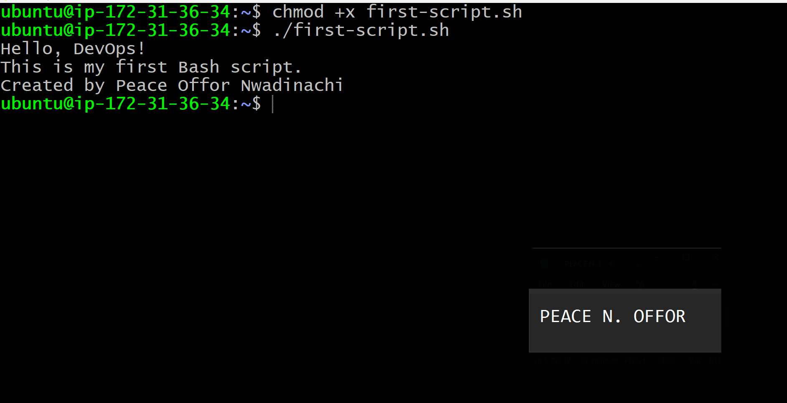.

---

#### Screenshot 3 — Output of `ls -l first-script.sh` showing executable permission

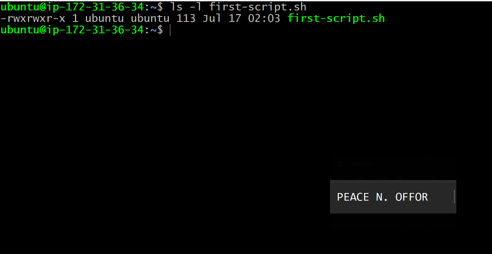.

---

### Notes

Answer the following in your own words:

**1. What is the purpose of `#!/bin/bash`?**

The #!/bin/bash line tells the operating system that the script should be executed using the Bash interpreter. It ensures the commands are run in the c.

---

**2. Why do we use `chmod +x` before running a script?**

I use chmod +x to make the script executable. Without that permission, I can't run it directly from the terminal using ./script.sh.

---

**3. What is the difference between running a script using `./script.sh` and `bash script.sh`?**

Using ./script.sh runs the script as an executable, so it needs execute permission. Running bash script.sh tells Bash to interpret the file directly, so execute permission isn't required.

---

# Task 3 — Variables: User Information Script

## Goal

Use variables to store and display user-related information.

### Evidence

#### Screenshot 1 — Content of `user-info.sh`

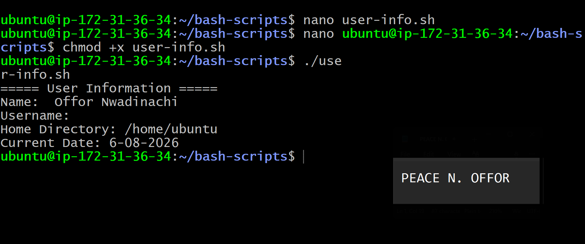.

---

#### Screenshot 2 — Output of `./user-info.sh`

.

---

### Notes

Answer the following in your own words:

**1. What is a variable in Bash?**

A variable is a simple way to store information that I want to use later in a script, such as a name, file path, or number.

---

**2. Why should we avoid spaces around the `=` sign when creating variables?**

Bash treats spaces differently from many programming languages. If I add spaces around the = sign, Bash won't recognize it as a variable assignment and the script may fail.

---

**3. How do you access the value stored inside a Bash variable?**

I access the value by placing a dollar sign ($) before the variable name, such as echo "$username".

---

# Task 4 — Arrays & Loops: Tools Checklist Script

## Goal

Use arrays and loops to print a checklist of tools used in Bash scripting.

### Evidence

#### Screenshot 1 — Content of `tools-checklist.sh`

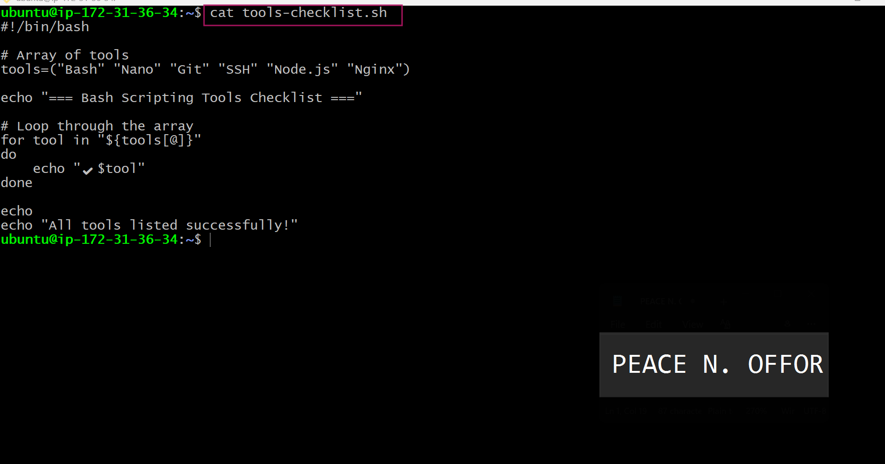.

---

#### Screenshot 2 — Output of `./tools-checklist.sh`

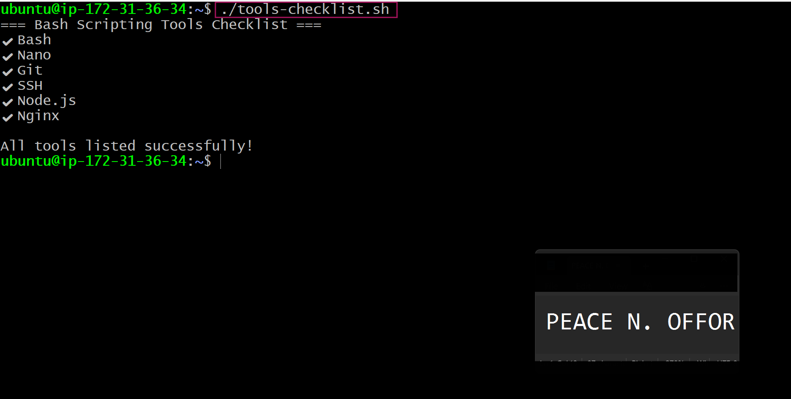.

---

### Notes

Answer the following in your own words:

**1. What is an array in Bash?**

An array is a collection of related values stored under a single variable name, making it easier to manage multiple items.

---

**2. Why are arrays useful in scripts?**

Arrays help me organize similar pieces of information and process them efficiently without creating many separate variables.

---

**3. What does `"${tools[@]}"` mean?**

It represents every item stored in the tools array, allowing me to work with each value one at a time.

---

**4. What is the purpose of the `for` loop in this script?**

The for loop goes through each tool in the array and prints it automatically instead of requiring me to write a separate command for every item.

---

# Task 5 — Loops: Number Counter Script

## Goal

Use loops to repeat a task multiple times.

### Evidence

#### Screenshot 1 — Content of `counter.sh`

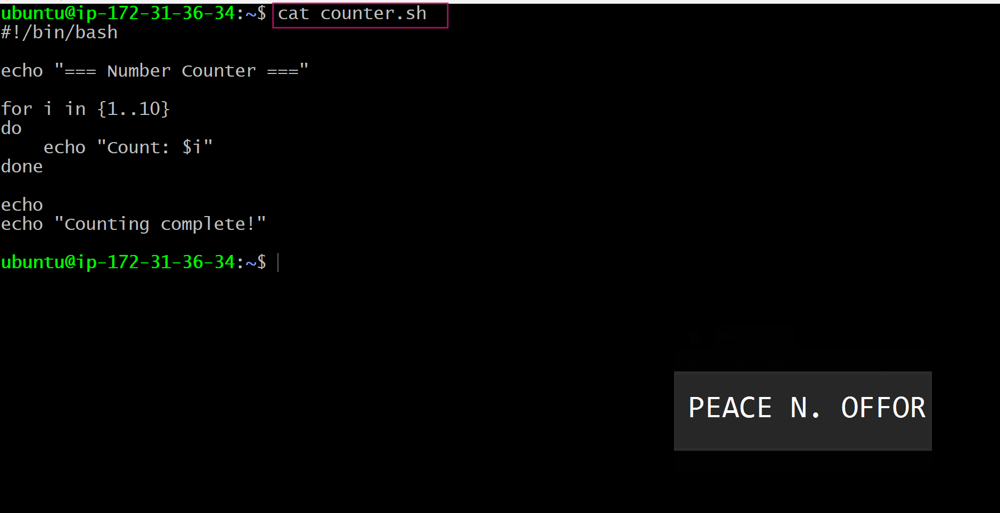.

---

#### Screenshot 2 — Output of `./counter.sh`

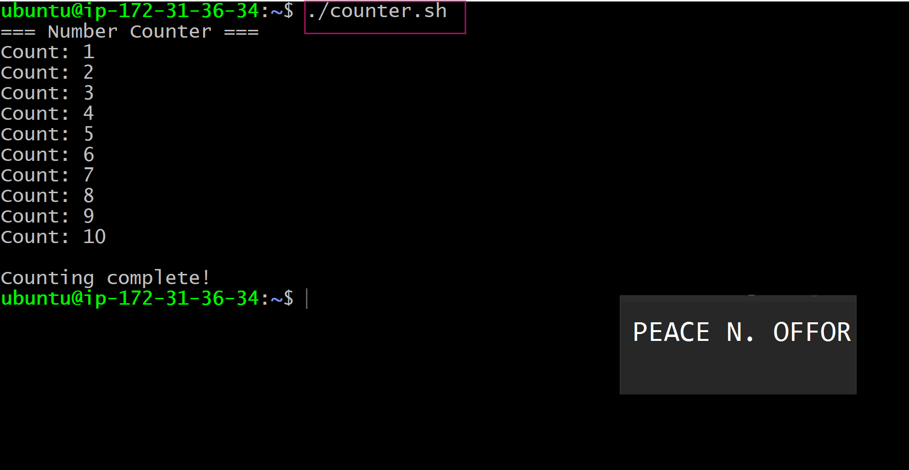.

---

### Notes

Answer the following in your own words:

**1. What is a loop?**

A loop is a way of repeating the same task multiple times without writing the same command repeatedly.

---

**2. Why do we use loops in Bash scripting?**

Loops save time and make scripts much cleaner, especially when the same action needs to be performed several times.

---

**3. How many times did the loop run in your script?**

In my script, the loop ran five times because it counted from 1 to 5.

---

**4. What would you change if you wanted the loop to run 10 times?**

I would simply change the range from 1..5 to 1..10 so the loop repeats ten times.

---

# Task 6 — Files & Conditionals: File Validation Script

## Goal

Use file checks and conditionals to verify whether files and directories exist.

### Evidence

#### Screenshot 1 — Output of `ls -lah ../test-folder`

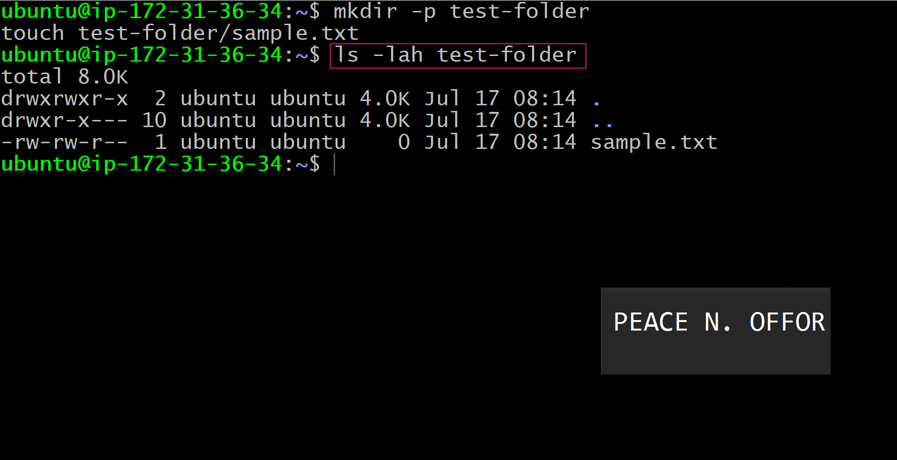.

---

#### Screenshot 2 — Content of `file-check.sh`

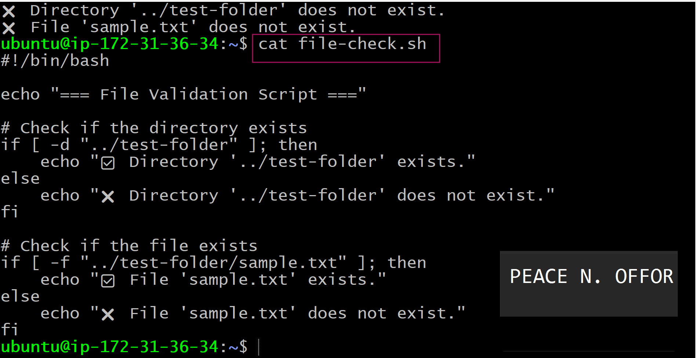.

---

#### Screenshot 3 — Output of `./file-check.sh`

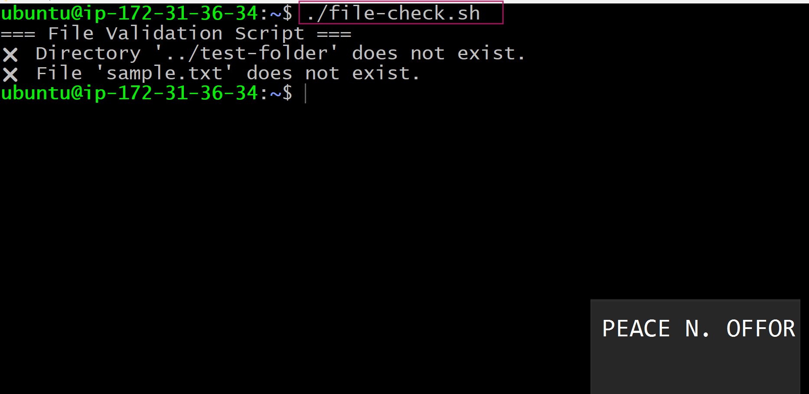.

---

### Notes

Answer the following in your own words:

**1. What does `-d` check in Bash?**

The -d option checks whether a specified path exists and is a directory.

---

**2. What does `-f` check in Bash?**

The -f option checks whether the specified path exists and is a regular file.

---

**3. Why should file and directory paths be stored in variables?**

Using variables makes the script easier to update and maintain. If the path changes, I only need to modify it in one place.

---

**4. What happens if the file does not exist?**

If the file doesn't exist, the condition evaluates to false and the script follows the alternative instructions defined in the else block.

---

# Task 7 — Conditionals: Pass or Retry Script

## Goal

Use if-else conditionals to make decisions based on a variable value.

### Evidence

#### Screenshot 1 — Content of `score-check.sh` with `score=85`

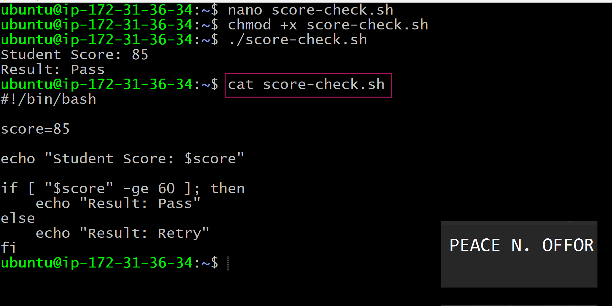.

---

#### Screenshot 2 — Output showing `Result: Pass`

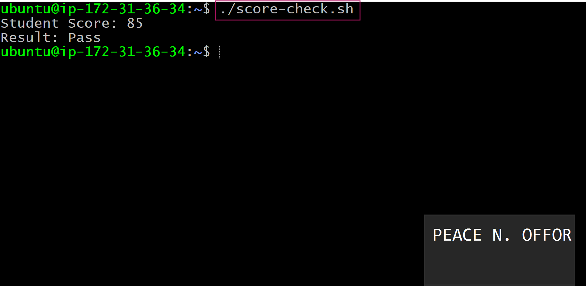.

---

#### Screenshot 3 — Content of `score-check.sh` with `score=55`

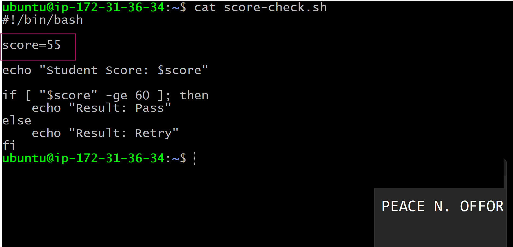.

---

#### Screenshot 4 — Output showing `Result: Retry`

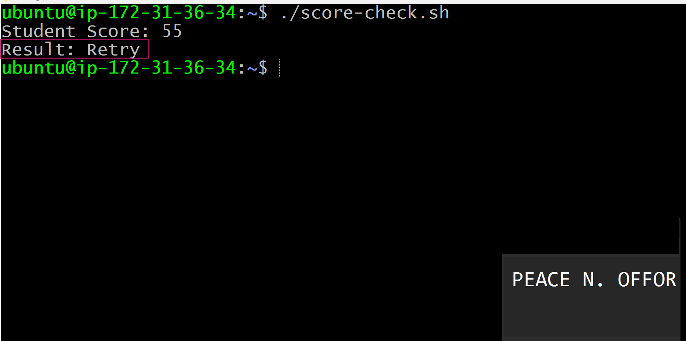.

---

### Notes

Answer the following in your own words:

**1. What is the purpose of if-else in Bash?**

An if-else statement allows the script to make decisions based on whether a condition is true or false.

---

**2. What does `-ge` mean?**

-ge means "greater than or equal to" when comparing numerical values.

---

**3. Why should conditions be tested with different values?**

Testing different values helps me confirm that every part of the script behaves as expected and catches mistakes before the script is used in a real situation.

---

**4. How can conditionals help in automation scripts?**

Conditionals allow automation scripts to react to different situations, such as checking if a file exists, whether a service is running, or if a command completed successfully.

---

# Task 8 — Functions: Final Bash Automation Script

## Goal

Create a final Bash script using functions to organize reusable code.

### Evidence

#### Screenshot 1 — Content of `final-automation.sh`

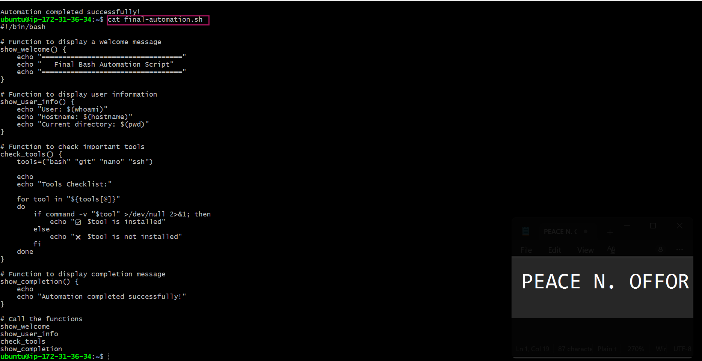.

---

#### Screenshot 2 — Output of `./final-automation.sh`

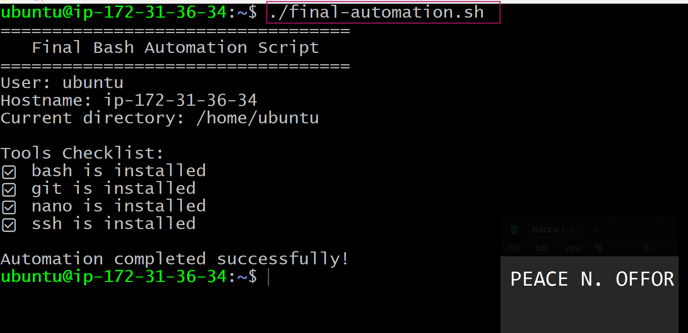.

---

#### Screenshot 3 — Output of `ls -lah` showing all created scripts

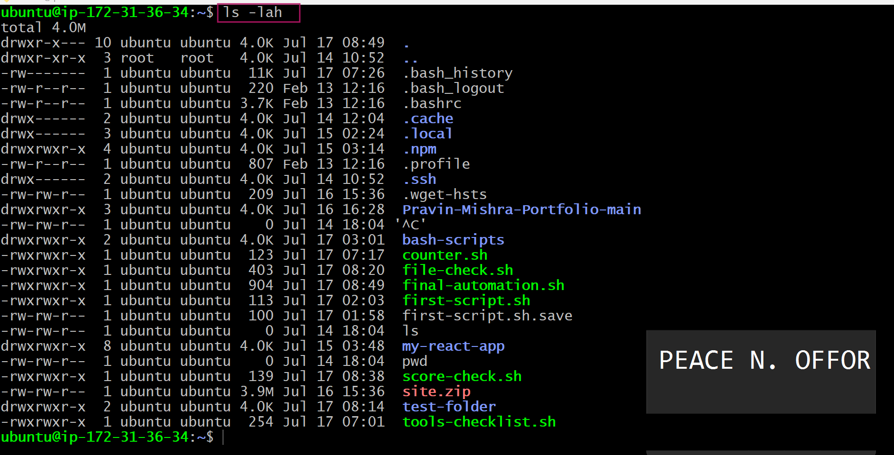.

---

### Notes

Answer the following in your own words:

**1. What is a function in Bash?**

A function is a reusable block of commands that performs a specific task whenever it is called.

---

**2. Why are functions useful in scripts?**

Functions keep scripts organized and reduce repeated code, making them easier to read, update, and troubleshoot.

---

**3. Which functions did you create in this script?**

I created functions to display information, check files, list tools, and organize the different tasks performed by the script.

---

**4. How does this final script combine variables, arrays, loops, conditionals, files, and functions?**

The final script brings together everything I learned. It stores information in variables, manages multiple items with arrays, repeats tasks using loops, makes decisions with conditionals, checks files and directories, and organizes the code into reusable functions. Combining these features makes the script cleaner, more efficient, and much easier to maintain..

---

# LinkedIn Post (Required)

## Evidence

#### LinkedIn Post URL

Paste your LinkedIn post URL here:

`https://www.linkedin.com/posts/peace-offor-aa736a147_dmibypravinmishra-devops-linux-activity-7483814176931430401-cNq5?utm_source=share&utm_medium=member_desktop&rcm=ACoAACN4g58BM2OoiPOU_M6YmR_9gplw4hlL_RQ`

---

#### Screenshot — Published LinkedIn post

.

---

# Submission Instructions

- Add all required screenshots in your submission
- Full name must be visible in required screenshots
- All script files must be created and run successfully
- Required notes must be answered clearly for every task
- Do not expose sensitive information (keys, passwords, credentials)

---

# Completion Checklist

- [-] Task 1: Environment setup verified, workspace created (Screenshots 1–2, Notes answered)
- [-] Task 2: First script created, executed, permissions verified (Screenshots 1–3, Notes answered)
- [-] Task 3: Variables script created and run (Screenshots 1–2, Notes answered)
- [-] Task 4: Arrays and loops script created and run (Screenshots 1–2, Notes answered)
- [-] Task 5: Counter loop script created and run (Screenshots 1–2, Notes answered)
- [-] Task 6: File validation script created and run (Screenshots 1–3, Notes answered)
- [-] Task 7: Pass/Retry conditional script tested with both values (Screenshots 1–4, Notes answered)
- [-] Task 8: Final automation script created and run (Screenshots 1–3, Notes answered)
- [-] All scripts run without errors
- [-] Full Name visible in all required screenshots
- [-] LinkedIn post published and URL submitted
- [-] No sensitive data exposed

---

## 📌 About DMI & CloudAdvisory

DevOps Micro Internship (DMI) is a project-based DevOps program run by Pravin Mishra (The CloudAdvisory) focused on real-world execution, systems thinking, and career readiness.

It helps learners build strong DevOps foundations with hands-on experience.

---

## 📌 Resources

- 🌐 DMI Official Website: https://pravinmishra.com/dmi  
- 🎓 DevOps for Beginners (Udemy): https://www.udemy.com/course/devops-for-beginners-docker-k8s-cloud-cicd-4-projects/  
- 🎓 Agentic AI DevOps with Claude Code: https://www.udemy.com/course/ultimate-agentic-ai-devops-with-claude-code/  
- 🎓 DevOps with Claude Code: Terraform, EKS, ArgoCD & Helm: https://www.udemy.com/course/devops-with-claude-code-terraform-eks-argocd-helm/  
- ▶️ YouTube Playlist: https://www.youtube.com/playlist?list=PLFeSNDtI4Cho  
- 🔗 Pravin Mishra (LinkedIn): https://www.linkedin.com/in/pravin-mishra-aws-trainer/  
- 🏢 CloudAdvisory (LinkedIn): https://www.linkedin.com/company/thecloudadvisory/

---

*This submission is part of DevOps Micro Internship (DMI) Cohort 3 — Agentic AI Track.*