# Assignment 5 — Bash Script Automation Drill (OPS Checklist)

Part of the DevOps Micro Internship (DMI) Cohort 3 with Agentic AI

---

## Purpose

In this assignment, you will practice Bash scripting by building a series of small automation scripts covering environment setup, variables, arrays, loops, file conditionals, if-else logic, and functions. These scripts form the foundation of real-world Linux automation used in DevOps, cloud, and production support environments.

---

# Task 1 — Bash Environment & Workspace Setup

## Goal

Verify that Bash is available on your system and create a clean workspace for this assignment.

### Evidence

#### Screenshot 1 — Output of `echo $SHELL` and `bash --version`

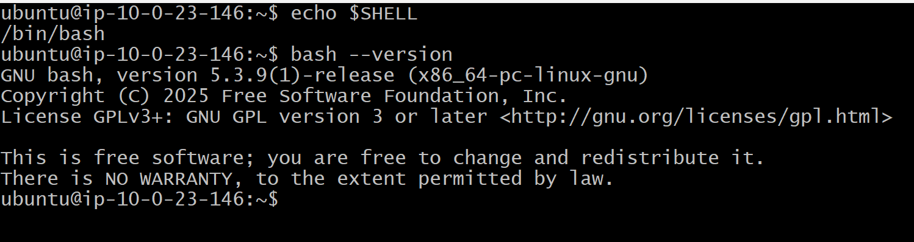

---

#### Screenshot 2 — Output of `pwd` and `ls -lah` showing the scripts directory

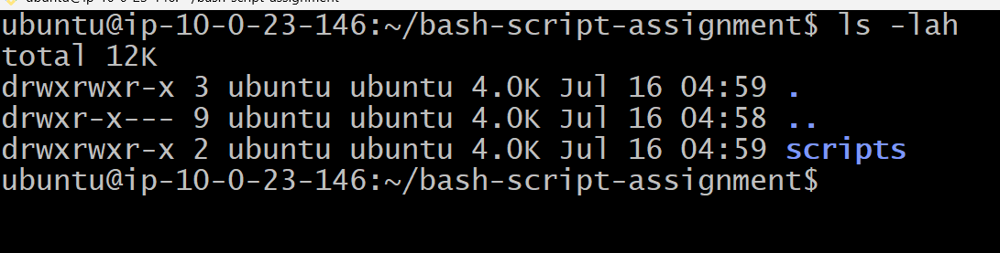

---

### Notes

Answer the following in your own words:

**1. What is Bash?**

Bash (Bourne Again Shell) is a command-line shell and scripting language used in Linux and other Unix-based systems. It allows users to interact with the operating system by typing commands to perform tasks such as managing files, running programs, and configuring systems. Bash can also be used to write shell scripts that automate repetitive tasks and simplify system administration.

---

**2. What is the difference between shell and Bash?**

The difference is that shell is the general concept, while Bash is a specific type of shell.

A shell is a program that provides a way for users to communicate with the operating system by entering commands. There are different types of shells, such as Bash, Zsh, Fish, and the C shell (csh).
Bash (Bourne Again Shell) is one specific shell that is widely used in Linux systems. It understands shell commands and also provides scripting features that allow users to automate tasks by writing Bash scripts.

---

**3. Why is it important to confirm the Bash version before writing scripts?**

Confirming the Bash version before writing scripts is important because different Bash versions may support different features and commands. A script written using newer Bash features may fail or behave unexpectedly if it is run on an older version of Bash. Checking the version helps ensure compatibility, prevents errors, and makes the script more reliable across different systems.

---

# Task 2 — Your First Bash Script

## Goal

Create your first Bash script, make it executable, and run it from the terminal.

### Evidence

#### Screenshot 1 — Content of `first-script.sh`

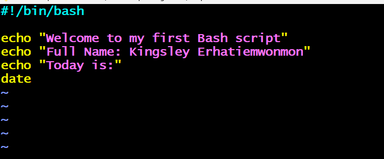

---

#### Screenshot 2 — Output of `./first-script.sh`

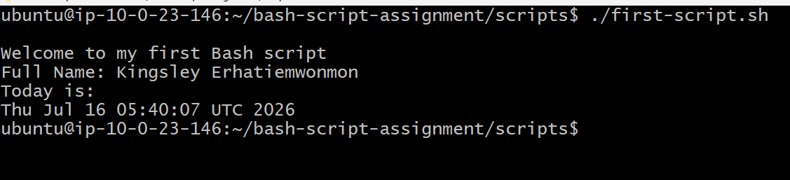

---

#### Screenshot 3 — Output of `ls -l first-script.sh` showing executable permission

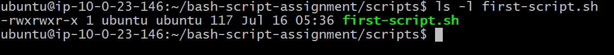

---

### Notes

Answer the following in your own words:

**1. What is the purpose of `#!/bin/bash`?**

#!/bin/bash tells the operating system that the script should be executed using the Bash shell interpreter. It ensures that Bash-specific commands and features are handled correctly when the script runs, making the script behave consistently across systems.

---

**2. Why do we use `chmod +x` before running a script?**

We use chmod +x to give a script execute permission, allowing the operating system to run it as a program. Without this permission, the script may exist but cannot be executed directly using a command like ./script.sh.

---

**3. What is the difference between running a script using `./script.sh` and `bash script.sh`?**

The difference is that ./script.sh runs the script as an executable file and requires execute permission (chmod +x), while bash script.sh runs the script by directly passing it to the Bash interpreter and does not require execute permission. Using ./script.sh relies on the shebang line (#!/bin/bash) to determine the interpreter, while bash script.sh explicitly tells Bash to run the script.

---

# Task 3 — Variables: User Information Script

## Goal

Use variables to store and display user-related information.

### Evidence

#### Screenshot 1 — Content of `user-info.sh`

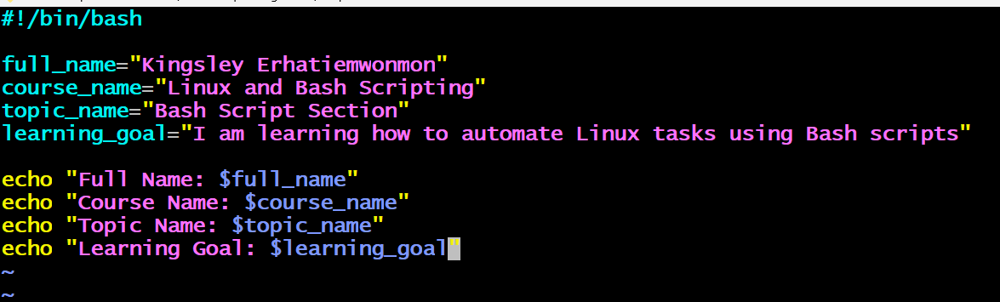

---

#### Screenshot 2 — Output of `./user-info.sh`

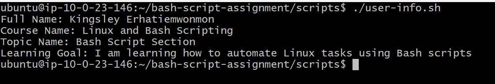

---

### Notes

Answer the following in your own words:

**1. What is a variable in Bash?**

A variable in Bash is a named storage location used to hold and reference data such as text, numbers, or command results. Variables allow scripts to store information temporarily and reuse it throughout the script, making automation tasks more flexible and easier to manage.

---

**2. Why should we avoid spaces around the `=` sign when creating variables?**

We should avoid spaces around the = sign when creating variables in Bash because Bash does not recognize spaces in variable assignments. Spaces make Bash interpret the statement as a command instead of assigning a value to a variable, which can cause errors.

---

**3. How do you access the value stored inside a Bash variable?**

You access the value stored inside a Bash variable by placing a $ sign before the variable name. This tells Bash to use the value stored in that variable instead of the variable name itself.

---

# Task 4 — Arrays & Loops: Tools Checklist Script

## Goal

Use arrays and loops to print a checklist of tools used in Bash scripting.

### Evidence

#### Screenshot 1 — Content of `tools-checklist.sh`

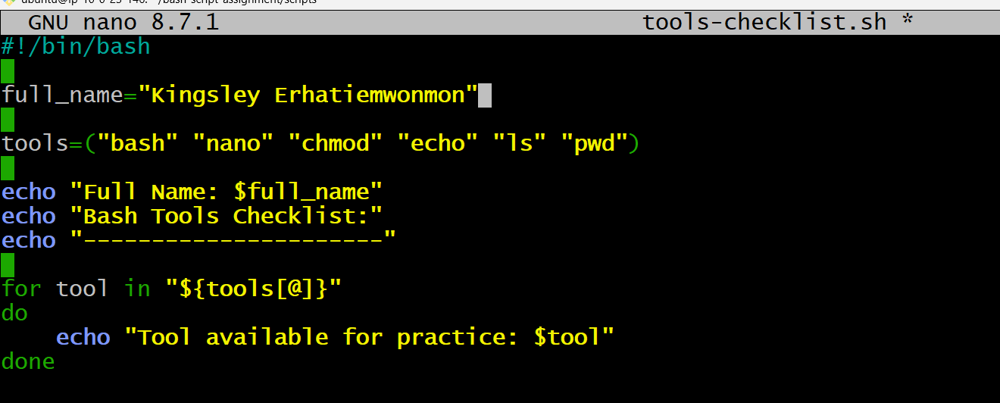

---

#### Screenshot 2 — Output of `./tools-checklist.sh`

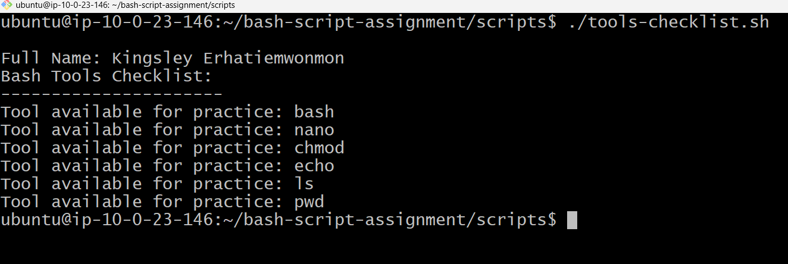

---

### Notes

Answer the following in your own words:

**1. What is an array in Bash?**

An array in Bash is a variable that can store multiple values under a single name. Each value is stored at a specific index, allowing you to easily access and manage a collection of related data.

---

**2. Why are arrays useful in scripts?**

Arrays are useful in scripts because they allow you to store and manage multiple related values using one variable instead of creating many separate variables. They make it easier to loop through data, organize information, and perform operations on groups of values efficiently.

---

**3. What does `"${tools[@]}"` mean?**

"${tools[@]}" is a Bash array expansion that accesses all the elements in the tools array while keeping each element as a separate item. It is commonly used in loops and commands because it preserves spaces and special characters within individual array values.

---

**4. What is the purpose of the `for` loop in this script?**

The purpose of the for loop in the script is to go through each item in the array one by one and perform the same action on each value. It helps automate repetitive tasks without writing separate commands for every item.

---

# Task 5 — Loops: Number Counter Script

## Goal

Use loops to repeat a task multiple times.

### Evidence

#### Screenshot 1 — Content of `counter.sh`

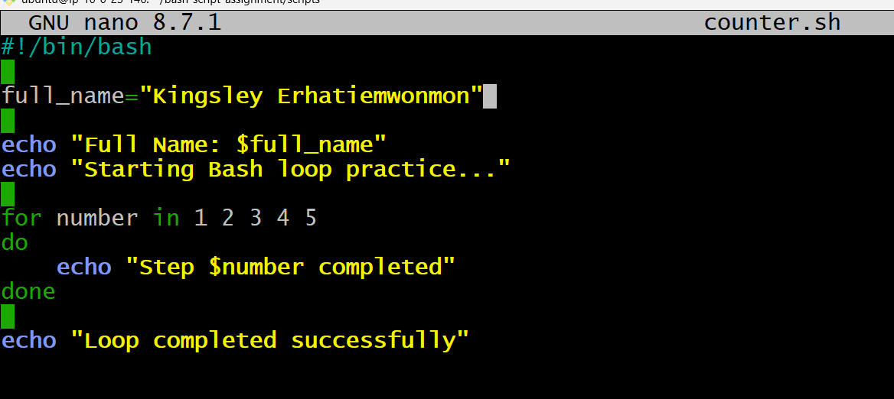

---

#### Screenshot 2 — Output of `./counter.sh`

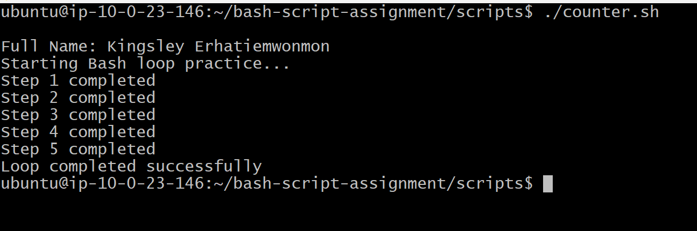

---

### Notes

Answer the following in your own words:

**1. What is a loop?**

A loop is a programming structure that repeatedly executes a set of commands until a specific condition is met or until all items in a collection have been processed. It helps automate repetitive tasks and reduces the need to write the same code multiple times.

---

**2. Why do we use loops in Bash scripting?**

We use loops in Bash scripting to automate repetitive tasks by running the same commands multiple times with different values. They make scripts shorter, faster to write, and easier to maintain when working with multiple files, users, or data.

---

**3. How many times did the loop run in your script?**

Based on the output, the loop ran 5 times. Each iteration processed one step, from Step 1 to Step 5, and then the loop finished successfully.

---

**4. What would you change if you wanted the loop to run 10 times?**

If I wanted the loop to run 10 times, I would change the numbers in the for loop from 1–5 to 1–10. This would make the script repeat the same action 10 times and display steps from Step 1 to Step 10.

---

# Task 6 — Files & Conditionals: File Validation Script

## Goal

Use file checks and conditionals to verify whether files and directories exist.

### Evidence

#### Screenshot 1 — Output of `ls -lah ../test-folder`

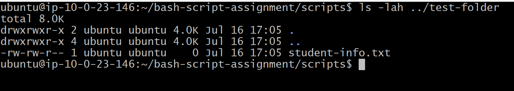

---

#### Screenshot 2 — Content of `file-check.sh`

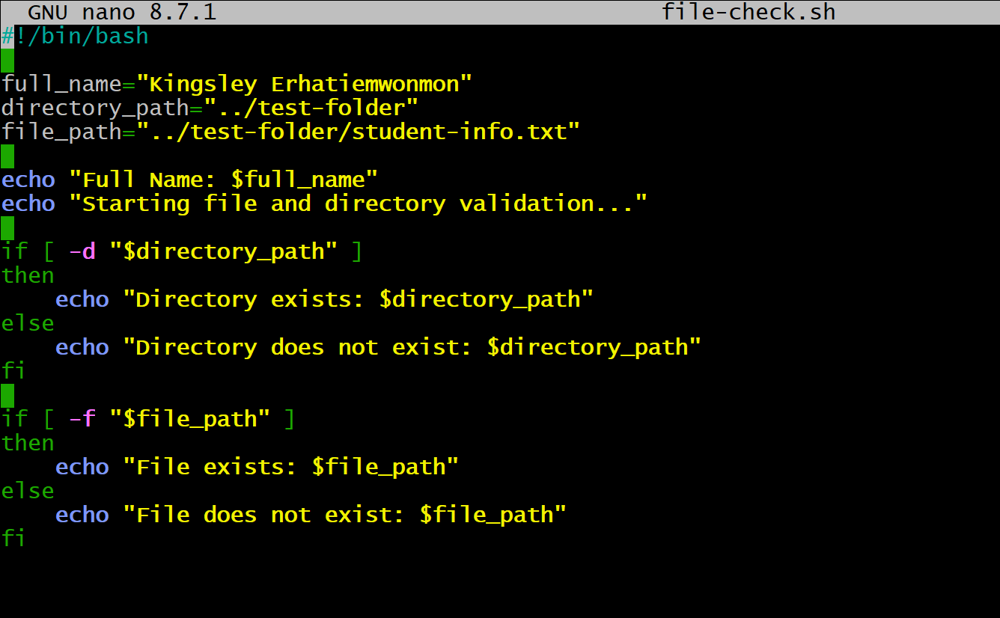

---

#### Screenshot 3 — Output of `./file-check.sh`

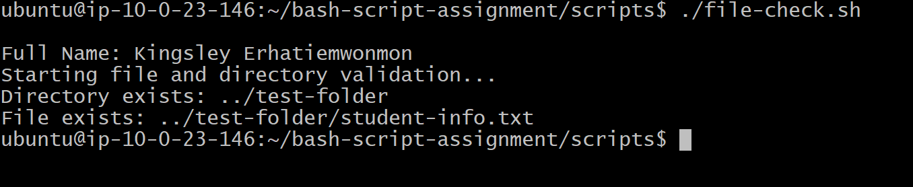

---

### Notes

Answer the following in your own words:

**1. What does `-d` check in Bash?**

-d checks whether a specified path exists and is a directory in Bash. It is commonly used in conditional statements to verify that a folder is available before performing actions on it.

---

**2. What does `-f` check in Bash?**

-f checks whether a specified path exists and is a regular file in Bash. It is used to confirm that a file is available before reading, modifying, or performing other operations on it.

---

**3. Why should file and directory paths be stored in variables?**

File and directory paths should be stored in variables because it makes scripts easier to read, update, and maintain. If the path changes, we only need to modify the variable instead of searching through the entire script to change every occurrence.

---

**4. What happens if the file does not exist?**

If the file does not exist, the script will detect that the file is missing and can display a message or perform an alternative action instead of trying to access a file that is unavailable.

---

# Task 7 — Conditionals: Pass or Retry Script

## Goal

Use if-else conditionals to make decisions based on a variable value.

### Evidence

#### Screenshot 1 — Content of `score-check.sh` with `score=85`

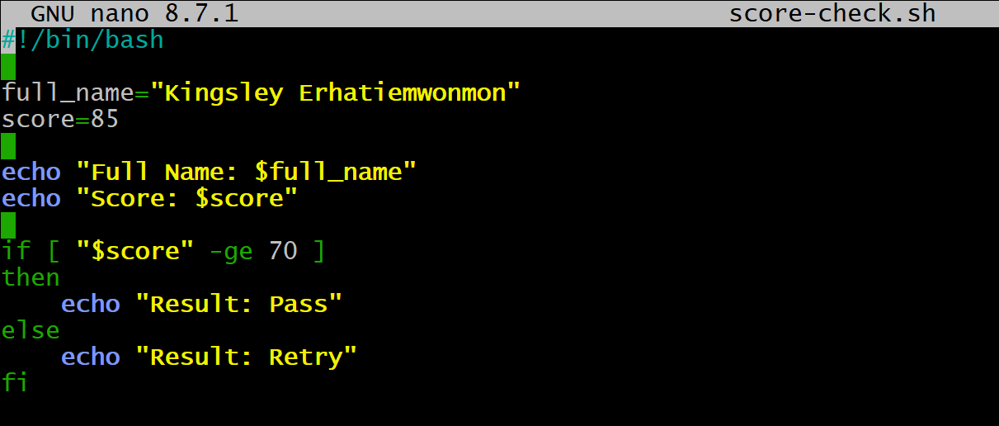

---

#### Screenshot 2 — Output showing `Result: Pass`

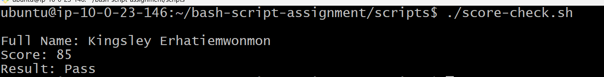

---

#### Screenshot 3 — Content of `score-check.sh` with `score=55`

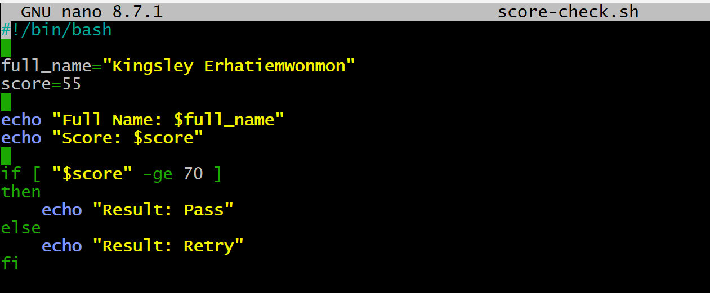

---

#### Screenshot 4 — Output showing `Result: Retry`

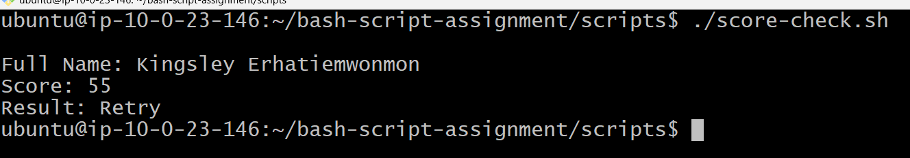

---

### Notes

Answer the following in your own words:

**1. What is the purpose of if-else in Bash?**

The purpose of if-else in Bash is to make decisions in a script by checking whether a condition is true or false. It allows the script to execute one set of commands when the condition is true and a different set of commands when the condition is false.

---

**2. What does `-ge` mean?**

-ge means "greater than or equal to" in Bash. It is used in numeric comparisons to check whether one value is greater than or equal to another value.

---

**3. Why should conditions be tested with different values?**

Conditions should be tested with different values to make sure the script behaves correctly in different situations. It helps identify errors and confirms that the script can handle both expected and unexpected inputs.

---

**4. How can conditionals help in automation scripts?**

Conditionals help in automation scripts by allowing the script to make decisions based on different situations. They enable scripts to perform specific actions only when certain conditions are met, making automation more flexible and reliable.

---

# Task 8 — Functions: Final Bash Automation Script

## Goal

Create a final Bash script using functions to organize reusable code.

### Evidence

#### Screenshot 1 — Content of `final-automation.sh`

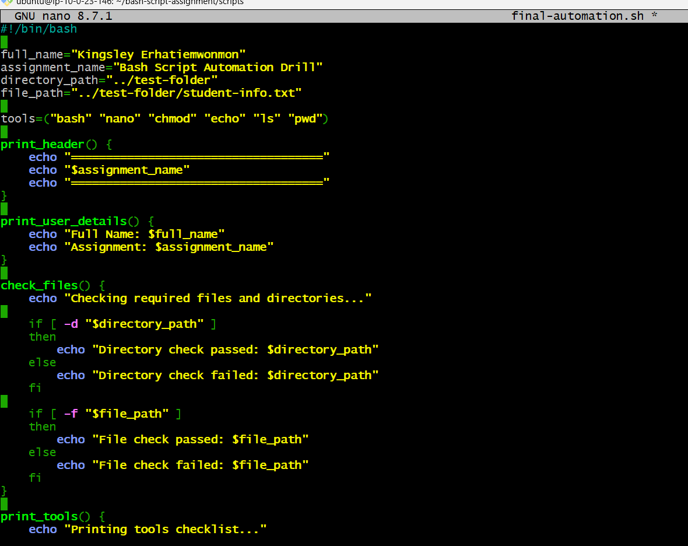

---

#### Screenshot 2 — Output of `./final-automation.sh`

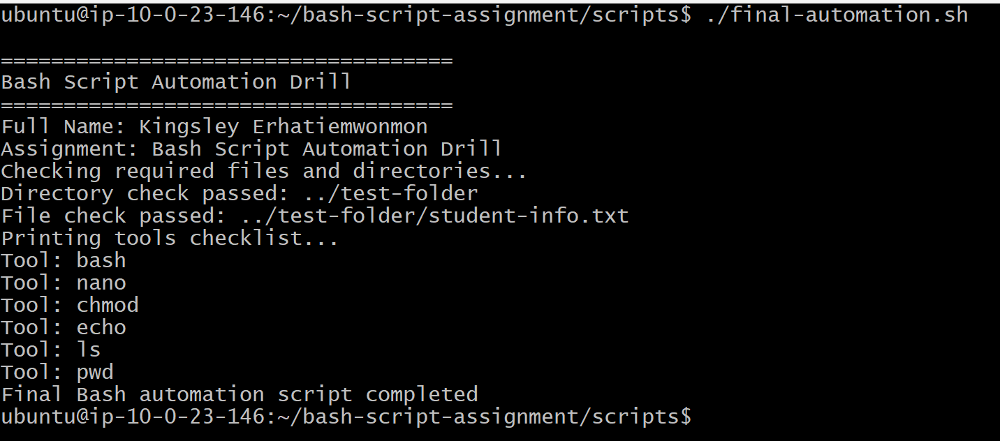

---

#### Screenshot 3 — Output of `ls -lah` showing all created scripts

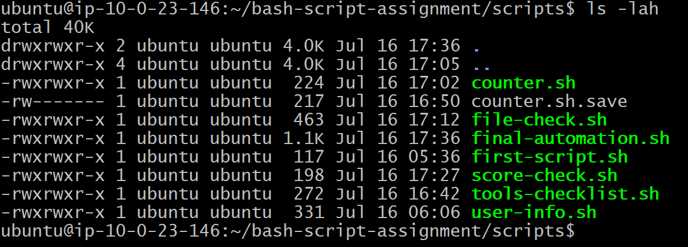

---

### Notes

Answer the following in your own words:

**1. What is a function in Bash?**

A function in Bash is a reusable block of commands grouped together under a name. It allows you to run the same set of instructions multiple times without rewriting the code, making scripts more organized and easier to maintain.

---

**2. Why are functions useful in scripts?**

Functions are useful in scripts because they help organize code into smaller, reusable sections. They reduce repetition, make scripts easier to read and debug, and allow changes to be made in one place instead of multiple locations.

---

**3. Which functions did you create in this script?**

In this script, I created functions that group related commands together and can be called whenever needed. The functions created were used to perform specific tasks, making the script more organized and easier to manage.

---

**4. How does this final script combine variables, arrays, loops, conditionals, files, and functions?**

This final script combines variables, arrays, loops, conditionals, files, and functions by using variables to store information, arrays to manage multiple values, loops to repeat tasks, conditionals to make decisions, files to store or check data, and functions to organize reusable sections of code. Together, these features make the script more structured, efficient, and easier to maintain.

---

# LinkedIn Post (Required)

## Evidence

#### LinkedIn Post URL

Paste your LinkedIn post URL here:

https://www.linkedin.com/posts/kingsley-erhatiemwonmon_devops-linux-bashscripting-ugcPost-7483583814166892544-FwHj/?utm_source=share&utm_medium=member_desktop&rcm=ACoAAClDkSEBa4Zo6dTWVIEEl8FJLczvH_zPHtY

---

#### Screenshot — Published LinkedIn post

---

# Submission Instructions

- Add all required screenshots in your submission
- Full name must be visible in required screenshots
- All script files must be created and run successfully
- Required notes must be answered clearly for every task
- Do not expose sensitive information (keys, passwords, credentials)

---

# Completion Checklist

- [ ] Task 1: Environment setup verified, workspace created (Screenshots 1–2, Notes answered)
- [ ] Task 2: First script created, executed, permissions verified (Screenshots 1–3, Notes answered)
- [ ] Task 3: Variables script created and run (Screenshots 1–2, Notes answered)
- [ ] Task 4: Arrays and loops script created and run (Screenshots 1–2, Notes answered)
- [ ] Task 5: Counter loop script created and run (Screenshots 1–2, Notes answered)
- [ ] Task 6: File validation script created and run (Screenshots 1–3, Notes answered)
- [ ] Task 7: Pass/Retry conditional script tested with both values (Screenshots 1–4, Notes answered)
- [ ] Task 8: Final automation script created and run (Screenshots 1–3, Notes answered)
- [ ] All scripts run without errors
- [ ] Full Name visible in all required screenshots
- [ ] LinkedIn post published and URL submitted
- [ ] No sensitive data exposed

---

## 📌 About DMI & CloudAdvisory

DevOps Micro Internship (DMI) is a project-based DevOps program run by Pravin Mishra (The CloudAdvisory) focused on real-world execution, systems thinking, and career readiness.

It helps learners build strong DevOps foundations with hands-on experience.

---

## 📌 Resources

- 🌐 DMI Official Website: https://pravinmishra.com/dmi  
- 🎓 DevOps for Beginners (Udemy): https://www.udemy.com/course/devops-for-beginners-docker-k8s-cloud-cicd-4-projects/  
- 🎓 Agentic AI DevOps with Claude Code: https://www.udemy.com/course/ultimate-agentic-ai-devops-with-claude-code/  
- 🎓 DevOps with Claude Code: Terraform, EKS, ArgoCD & Helm: https://www.udemy.com/course/devops-with-claude-code-terraform-eks-argocd-helm/  
- ▶️ YouTube Playlist: https://www.youtube.com/playlist?list=PLFeSNDtI4Cho  
- 🔗 Pravin Mishra (LinkedIn): https://www.linkedin.com/in/pravin-mishra-aws-trainer/  
- 🏢 CloudAdvisory (LinkedIn): https://www.linkedin.com/company/thecloudadvisory/

---

*This submission is part of DevOps Micro Internship (DMI) Cohort 3 — Agentic AI Track.*