# Assignment 5 — Bash Script Automation Drill (OPS Checklist)

Part of the DevOps Micro Internship (DMI) Cohort 3 with Agentic AI

---

## Purpose

In this assignment, you will practice Bash scripting by building a series of small automation scripts covering environment setup, variables, arrays, loops, file conditionals, if-else logic, and functions. These scripts form the foundation of real-world Linux automation used in DevOps, cloud, and production support environments.

---

# Task 1 — Bash Environment & Workspace Setup

## Goal

Verify that Bash is available on your system and create a clean workspace for this assignment.

### Evidence

#### Screenshot 1 — Output of `echo $SHELL` and `bash --version`

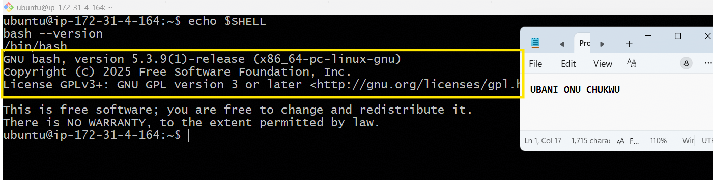

---

#### Screenshot 2 — Output of `pwd` and `ls -lah` showing the scripts directory

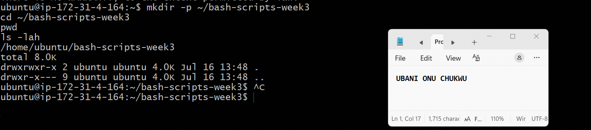

---

### Notes

**1. What is Bash?**

Bash (Bourne Again SHell) is a command-line interpreter and scripting language used on Linux and Unix-based systems. It lets you interact with the operating system directly through commands, and also lets you write scripts to automate repetitive tasks — which is exactly what this assignment focuses on.

---

**2. What is the difference between shell and Bash?**

"Shell" is the general term for any command-line interface that lets a user interact with the OS (examples include sh, zsh, ksh, and Bash). Bash is one specific, widely-used implementation of a shell — it's the default shell on most Linux distributions, including this Ubuntu server, and adds extra scripting features beyond the original Bourne shell (sh).

---

**3. Why is it important to confirm the Bash version before writing scripts?**

Different Bash versions support different features — for example, associative arrays were introduced in Bash 4.0, and some newer syntax may not work on older systems. Confirming the version upfront avoids writing scripts that fail or behave unexpectedly when run on a server with an older or different Bash version than what I tested on.

---

# Task 2 — Your First Bash Script

## Goal

Create your first Bash script, make it executable, and run it from the terminal.

### Evidence

#### Screenshot 1 — Content of `first-script.sh`

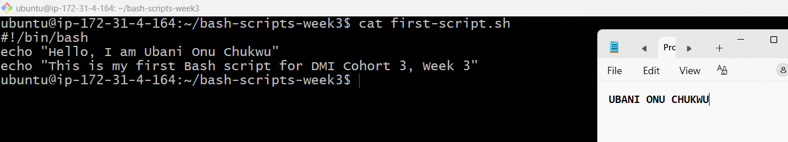

---

#### Screenshot 2 — Output of `./first-script.sh`

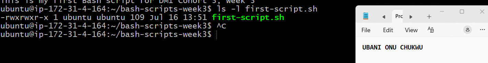

---

#### Screenshot 3 — Output of `ls -l first-script.sh` showing executable permission

---

### Notes

**1. What is the purpose of `#!/bin/bash`?**

This is called a "shebang" line. It tells the operating system which interpreter to use to execute the script — in this case, `/bin/bash`. Without it, the system wouldn't know whether to run the file as a Bash script, a Python script, or something else, especially when running it directly with `./script.sh`.

---

**2. Why do we use `chmod +x` before running a script?**

By default, newly created files don't have execute permission, even if they contain valid script code. `chmod +x` adds the execute permission bit, which allows the file to be run directly as a program (e.g., `./first-script.sh`) rather than just being readable/editable text.

---

**3. What is the difference between running a script using `./script.sh` and `bash script.sh`?**

`./script.sh` runs the file directly as an executable, relying on the shebang line (`#!/bin/bash`) to determine the interpreter, and requires the execute permission to be set. `bash script.sh` explicitly tells the shell to run the file using Bash, regardless of the shebang or file permissions — so it works even if the execute bit isn't set, but it ignores whatever interpreter the shebang specifies.

---

# Task 3 — Variables: User Information Script

## Goal

Use variables to store and display user-related information.

### Evidence

#### Screenshot 1 — Content of `user-info.sh`

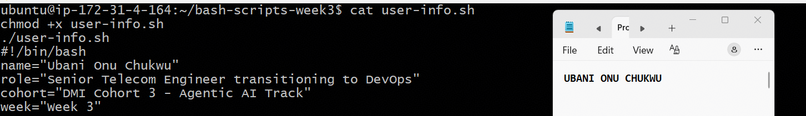

---

#### Screenshot 2 — Output of `./user-info.sh`

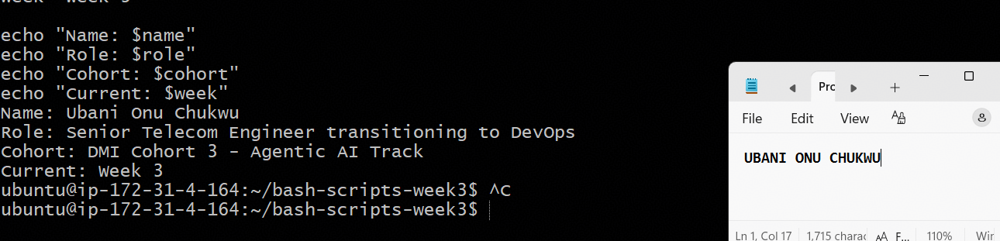

---

### Notes

**1. What is a variable in Bash?**

A variable is a named container that stores a value — text, a number, or a command's output — which can be reused throughout a script. In `user-info.sh`, `name`, `role`, `cohort`, and `week` are all variables holding string values that get displayed via `echo`.

---

**2. Why should we avoid spaces around the `=` sign when creating variables?**

Bash interprets `name = "value"` (with spaces) as trying to run a command called `name` with arguments `=` and `"value"`, rather than assigning a variable — it will throw a "command not found" error. Bash requires the exact syntax `name="value"` (no spaces) to correctly recognize it as a variable assignment.

---

**3. How do you access the value stored inside a Bash variable?**

By prefixing the variable name with a `$` sign, e.g., `$name` or `${name}` (the curly braces are useful when the variable is next to other text, to clearly separate the variable name from surrounding characters).

---

# Task 4 — Arrays & Loops: Tools Checklist Script

## Goal

Use arrays and loops to print a checklist of tools used in Bash scripting.

### Evidence

#### Screenshot 1 — Content of `tools-checklist.sh`

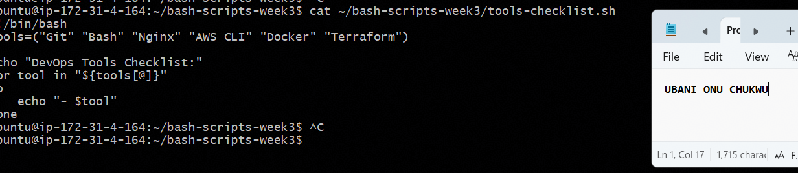

---

#### Screenshot 2 — Output of `./tools-checklist.sh`

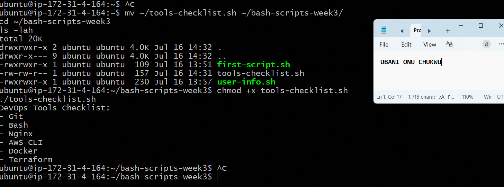

---

### Notes

**1. What is an array in Bash?**

An array is a variable that can hold multiple values (a list) instead of just one. In `tools-checklist.sh`, the `tools` array holds six separate string values — "Git", "Bash", "Nginx", "AWS CLI", "Docker", "Terraform" — all under one variable name.

---

**2. Why are arrays useful in scripts?**

Arrays let you group related data together and process it efficiently — instead of writing six separate variables and six separate `echo` statements, one array plus one loop can handle any number of items. This makes scripts shorter, more maintainable, and easy to extend (just add another item to the array).

---

**3. What does `"${tools[@]}"` mean?**

This expands to all elements of the `tools` array, treating each element as a separate word — even if an element contains spaces (like "AWS CLI"). The `@` symbol means "all elements," and wrapping it in quotes (`"..."`) ensures multi-word items aren't accidentally split into separate items during the loop.

---

**4. What is the purpose of the `for` loop in this script?**

The `for` loop iterates through each item in the `tools` array one at a time, assigning it to the `tool` variable on each pass, and running `echo "- $tool"` for each one — this is what prints the full checklist without needing to write a separate `echo` line for every tool.

---

# Task 5 — Loops: Number Counter Script

## Goal

Use loops to repeat a task multiple times.

### Evidence

#### Screenshot 1 — Content of `counter.sh`

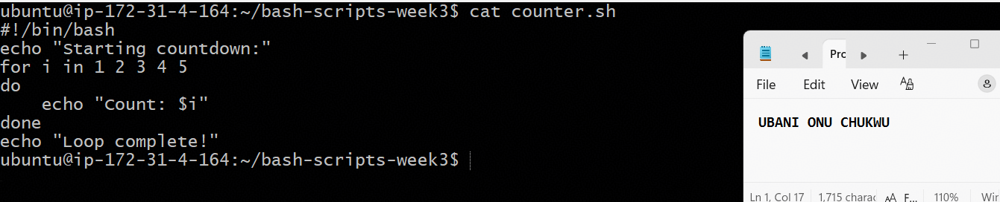

---

#### Screenshot 2 — Output of `./counter.sh`

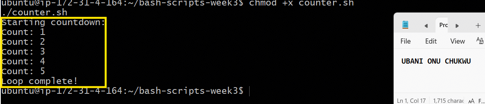

---

### Notes

**1. What is a loop?**

A loop is a programming construct that repeats a block of code multiple times, either a fixed number of times or until a certain condition is met, instead of writing the same instructions over and over manually.

---

**2. Why do we use loops in Bash scripting?**

Loops save time and reduce repetition — instead of writing five separate `echo "Count: X"` lines, one `for` loop with a range handles it in four lines total. They're essential for automation tasks like processing multiple files, servers, or list items without manually repeating code for each one.

---

**3. How many times did the loop run in your script?**

The loop ran 5 times, once for each number in the sequence `1 2 3 4 5`, printing "Count: 1" through "Count: 5" before printing "Loop complete!"

---

**4. What would you change if you wanted the loop to run 10 times?**

I could either list out `1 2 3 4 5 6 7 8 9 10` manually, or more efficiently use a range expression: `for i in {1..10}`, which Bash expands automatically into the sequence of numbers from 1 to 10 without needing to type each one.

---

# Task 6 — Files & Conditionals: File Validation Script

## Goal

Use file checks and conditionals to verify whether files and directories exist.

### Evidence

#### Screenshot 1 — Output of `ls -lah ../test-folder`

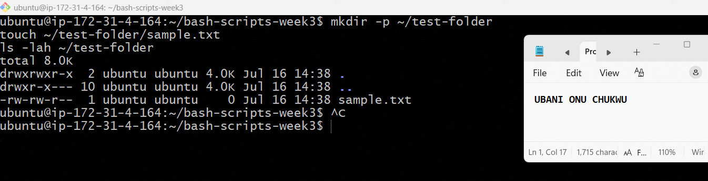

---

#### Screenshot 2 — Content of `file-check.sh`

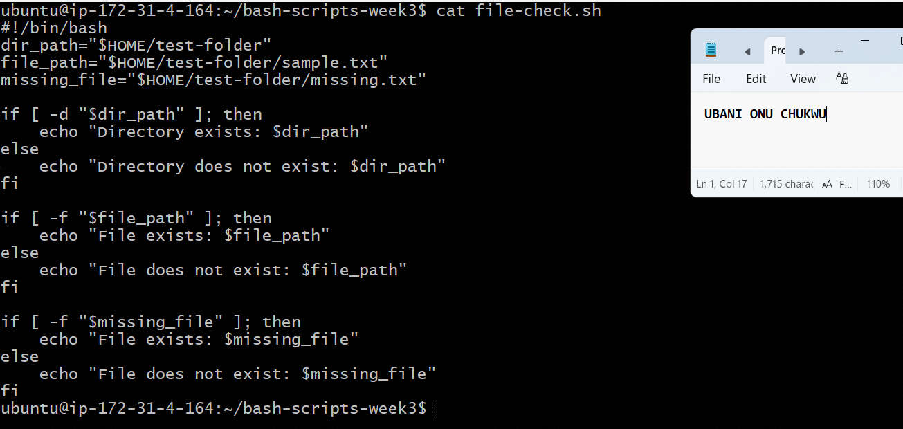

---

#### Screenshot 3 — Output of `./file-check.sh`

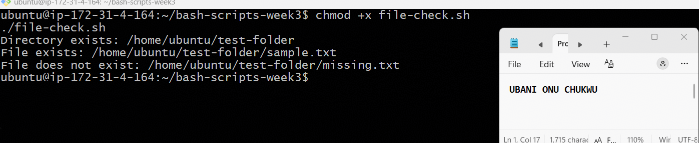

---

### Notes

**1. What does `-d` check in Bash?**

`-d` checks whether a given path exists **and** is a directory. If the path doesn't exist, or exists but is a regular file (not a directory), the check returns false.

---

**2. What does `-f` check in Bash?**

`-f` checks whether a given path exists **and** is a regular file (not a directory, symlink, or other special file type).

---

**3. Why should file and directory paths be stored in variables?**

Storing paths in variables (like `dir_path`, `file_path`) avoids repeating the same long path string multiple times in the script — if the location ever changes, I only need to update it in one place. It also makes the script more readable and less error-prone than hardcoding paths everywhere they're used.

---

**4. What happens if the file does not exist?**

The `-f` test returns false, so the script's `else` branch runs instead, printing "File does not exist: [path]" — exactly what happened with `missing.txt`, which I never created. This lets scripts safely handle missing files instead of crashing or behaving unpredictably.

---

# Task 7 — Conditionals: Pass or Retry Script

## Goal

Use if-else conditionals to make decisions based on a variable value.

### Evidence

#### Screenshot 1 — Content of `score-check.sh` with `score=85`

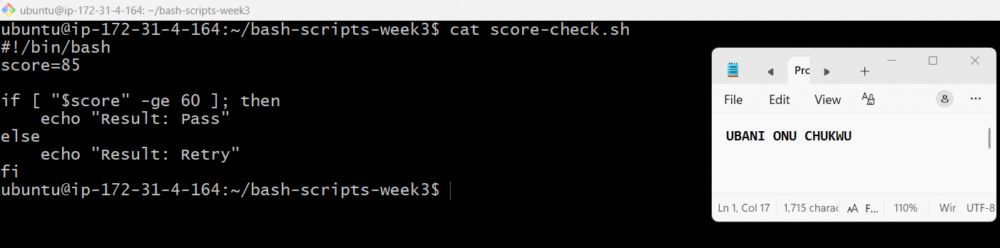

---

#### Screenshot 2 — Output showing `Result: Pass`

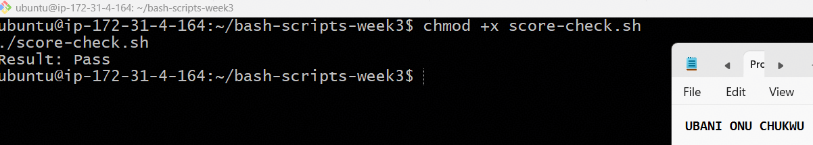

---

#### Screenshot 3 — Content of `score-check.sh` with `score=55`

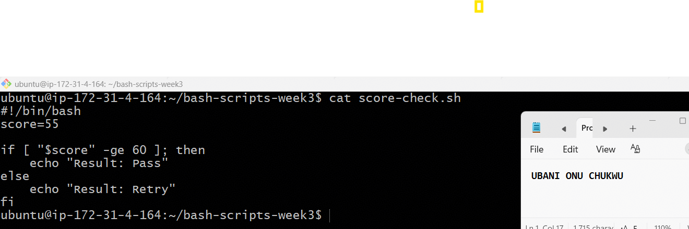

---

#### Screenshot 4 — Output showing `Result: Retry`

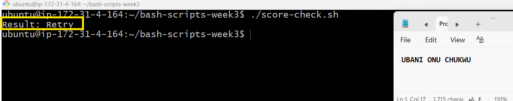

---

### Notes

**1. What is the purpose of if-else in Bash?**

If-else lets a script make decisions and execute different code paths based on a condition. In `score-check.sh`, it checks whether `score` meets a threshold and prints a different result depending on the outcome — this is the core logic behind automated pass/fail checks, health checks, and validation scripts.

---

**2. What does `-ge` mean?**

`-ge` stands for "greater than or equal to" — it's a numeric comparison operator in Bash. `[ "$score" -ge 60 ]` evaluates to true if `score` is 60 or higher.

---

**3. Why should conditions be tested with different values?**

Testing only one value (like `score=85`) only proves the "Pass" branch works — it doesn't confirm the "Retry" branch is written correctly. Testing both `score=85` (Pass) and `score=55` (Retry) verifies the entire conditional logic works as intended in both directions, catching bugs that a single test case would miss.

---

**4. How can conditionals help in automation scripts?**

Conditionals let scripts respond intelligently to different situations without human intervention — for example, checking if a service is running before restarting it, verifying disk space before deploying a build, or checking exit codes to decide whether to proceed or roll back. This is exactly the kind of logic used in Assignment 03's failure-simulation drills (checking `nginx -t` output before restarting).

---

# Task 8 — Functions: Final Bash Automation Script

## Goal

Create a final Bash script using functions to organize reusable code.

### Evidence

#### Screenshot 1 — Content of `final-automation.sh`

---

#### Screenshot 2 — Output of `./final-automation.sh`

---

#### Screenshot 3 — Output of `ls -lah` showing all created scripts

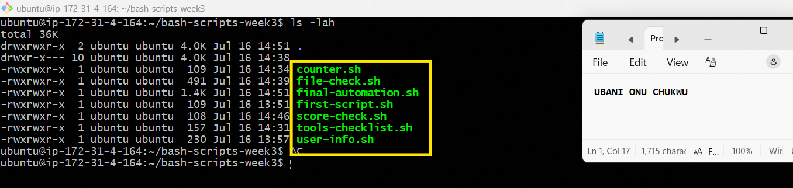

---

### Notes

**1. What is a function in Bash?**

A function is a named, reusable block of code that groups related commands together, so they can be called (executed) by name whenever needed, rather than rewriting the same logic repeatedly. In `final-automation.sh`, `print_banner`, `list_tools`, `check_environment`, and `score_check` are all functions.

---

**2. Why are functions useful in scripts?**

Functions make scripts more organized, readable, and maintainable by breaking complex logic into smaller, named pieces — each with a clear responsibility. They also enable reusability: `score_check` is called twice with different arguments (85 and 55) without duplicating the if-else logic, and functions can be reused across different scripts too.

---

**3. Which functions did you create in this script?**

Four functions: `print_banner` (displays a header with name/cohort info), `list_tools` (loops through the tools array and prints each item), `check_environment` (validates the test directory and file exist using conditionals), and `score_check` (takes a score as an argument and prints Pass/Retry based on the threshold).

---

**4. How does this final script combine variables, arrays, loops, conditionals, files, and functions?**

Variables store reusable data (`name`, `cohort`, file paths). The `tools` array holds a list processed by a `for` loop inside `list_tools`. `check_environment` uses `-d` and `-f` conditionals to validate the file system. `score_check` uses if-else logic and accepts a function argument (`$1`) to make it reusable with different values. All four functions are tied together and called sequentially in the "Main execution" section, producing one complete automation report — mirroring how real DevOps scripts combine these building blocks to check environment health, validate deployments, and report results in a single run.

---

# LinkedIn Post (Required)

## Evidence

#### LinkedIn Post URL

https://www.linkedin.com/posts/onuchukwu-ubani-10004741_devops-linux-bash-share-7483810209736396800-L-MM/?utm_source=share&utm_medium=member_desktop&rcm=ACoAAAi6A9ABP5zuoQ8QP1g4mp_mBXViSDgTxy0

---

#### Screenshot — Published LinkedIn post

---

# Submission Instructions

- Add all required screenshots in your submission
- Full name must be visible in required screenshots
- All script files must be created and run successfully
- Required notes must be answered clearly for every task
- Do not expose sensitive information (keys, passwords, credentials)

---

# Completion Checklist

- [x] Task 1: Environment setup verified, workspace created (Screenshots 1–2, Notes answered)
- [x] Task 2: First script created, executed, permissions verified (Screenshots 1–3, Notes answered)
- [x] Task 3: Variables script created and run (Screenshots 1–2, Notes answered)
- [x] Task 4: Arrays and loops script created and run (Screenshots 1–2, Notes answered)
- [x] Task 5: Counter loop script created and run (Screenshots 1–2, Notes answered)
- [x] Task 6: File validation script created and run (Screenshots 1–3, Notes answered)
- [x] Task 7: Pass/Retry conditional script tested with both values (Screenshots 1–4, Notes answered)
- [x] Task 8: Final automation script created and run (Screenshots 1–3, Notes answered)
- [x] All scripts run without errors
- [x] Full Name visible in all required screenshots
- [x] LinkedIn post published and URL submitted
- [x] No sensitive data exposed

---

## 📌 About DMI & CloudAdvisory

DevOps Micro Internship (DMI) is a project-based DevOps program run by Pravin Mishra (The CloudAdvisory) focused on real-world execution, systems thinking, and career readiness.

It helps learners build strong DevOps foundations with hands-on experience.

---

## 📌 Resources

- 🌐 DMI Official Website: https://pravinmishra.com/dmi
- 🎓 DevOps for Beginners (Udemy): https://www.udemy.com/course/devops-for-beginners-docker-k8s-cloud-cicd-4-projects/
- 🎓 Agentic AI DevOps with Claude Code: https://www.udemy.com/course/ultimate-agentic-ai-devops-with-claude-code/
- 🎓 DevOps with Claude Code: Terraform, EKS, ArgoCD & Helm: https://www.udemy.com/course/devops-with-claude-code-terraform-eks-argocd-helm/
- ▶️ YouTube Playlist: https://www.youtube.com/playlist?list=PLFeSNDtI4Cho
- 🔗 Pravin Mishra (LinkedIn): https://www.linkedin.com/in/pravin-mishra-aws-trainer/
- 🏢 CloudAdvisory (LinkedIn): https://www.linkedin.com/company/thecloudadvisory/

---

*This submission is part of DevOps Micro Internship (DMI) Cohort 3 — Agentic AI Track.*