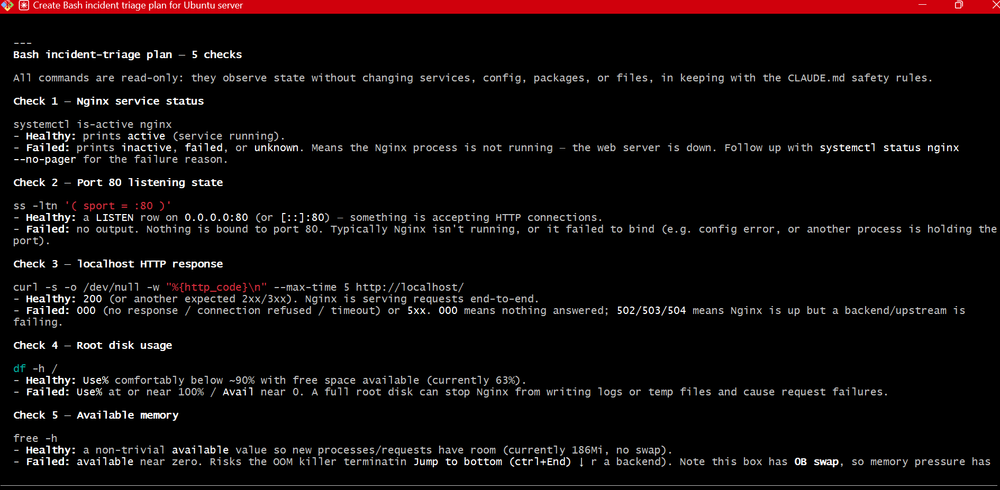

# Assignment 5 — Bash Script Automation Drill (OPS Checklist)

Part of the DevOps Micro Internship (DMI) Cohort 3 with Agentic AI

---

## Purpose

In this assignment, you will practice Bash scripting by building a series of small automation scripts covering environment setup, variables, arrays, loops, file conditionals, if-else logic, and functions. These scripts form the foundation of real-world Linux automation used in DevOps, cloud, and production support environments.

---

# Task 1 — Bash Environment & Workspace Setup

## Goal

Verify that Bash is available on your system and create a clean workspace for this assignment.

### Evidence

#### Screenshot 1 — Output of `echo $SHELL` and `bash --version`

#### Screenshot 2 — Output of `pwd` and `ls -lah` showing the scripts directory

### Notes

Answer the following in your own words:

**1. What is Bash?**

The first thing I learnt about Bash was the full meaning, Bourne again shell. Bash is a full program that lets you control your computer by typing commands instead of clicking buttons.

Think of it as a text-based remote control for your operating system.

For example, instead of:

Opening File Explorer and clicking through folders,

you can type: 
Bash
cd Documents

**2. What is the difference between shell and Bash?**

A shell and Bash are related, but they're not the same thing.

Think of it like this
Shell = the general category.
Bash = one specific type of shell.

A shell is a program that sits between you and the operating system. It reads the commands you type and tells the operating system what to do.

Bash stands for Bourne Again SHell. It is one of the most popular shells, especially on Linux and macOS.

Bash isn't the only shell. Others include:

sh – the original Bourne Shell
zsh – popular on modern macOS
fish – designed to be user-friendly
PowerShell – Microsoft's shell for Windows

**3. Why is it important to confirm the Bash version before writing scripts?**

It's important because different versions of Bash support different features. A script that works on one version may fail on another.

For example:

Newer Bash versions support more modern syntax and features.

Older Bash versions may not recognize those features and will produce errors.

# Task 2 — Your First Bash Script

## Goal

Create your first Bash script, make it executable, and run it from the terminal.

### Evidence

#### Screenshot 1 — Content of `first-script.sh`

#### Screenshot 2 — Output of `./first-script.sh`

#### Screenshot 3 — Output of `ls -l first-script.sh` showing executable permission

### Notes

Answer the following in your own words:

**1. What is the purpose of `#!/bin/bash`?**

#!/bin/bash tells the computer which program should run the script.

In a little research, I saw that it should be seen as this

When writing a letter in French. At the top, you write:

"Read this in French."

Similarly, when you put: #!/bin/bash at the top of a script, you are telling the computer:

"Run this file using Bash."

**2. Why do we use `chmod +x` before running a script?**

Without that permission, the computer knows the script exists, but it won't let you run it directly. We use chmod +x to give a script permission to be executed

**3. What is the difference between running a script using `./script.sh` and `bash script.sh`?**

The difference is how the script is started.

./script.sh

When you run:

./script.sh

you're telling the computer:

"Run this file directly."

For this to work:

The script must have execute permission (chmod +x script.sh).
If the script starts with #!/bin/bash, the computer uses Bash to run it.
bash script.sh

When you run: bash script.sh you're telling Bash:

"Open this file and run its contents."

In summary,

The script does not need execute permission.

The #!/bin/bash line is not necessary because you're already telling Bash to run it.

# Task 3 — Variables: User Information Script

## Goal

Use variables to store and display user-related information.

### Evidence

#### Screenshot 1 — Content of `user-info.sh`

---

#### Screenshot 2 — Output of `./user-info.sh`

### Notes

Answer the following in your own words:

**1. What is a variable in Bash?**

A variable in Bash is a named container that stores a value so you can use it later in your script.

Think of it like this

Imagine a labeled box.

The label is the variable name.

The item inside the box is the value. For example

name="Abraham"

name is the variable.

"Abraham" is the value stored in it.

**2. Why should we avoid spaces around the `=` sign when creating variables?**

In Bash, you should not put spaces around the = sign because Bash has a strict syntax for variable assignment.

**3. How do you access the value stored inside a Bash variable?**

You access the value stored in a Bash variable by placing a $ (dollar sign) before the variable name.

The $ tells Bash:

"Don't print the variable name—print the value stored inside it."

# Task 4 — Arrays & Loops: Tools Checklist Script

## Goal

Use arrays and loops to print a checklist of tools used in Bash scripting.

### Evidence

#### Screenshot 1 — Content of `tools-checklist.sh`

#### Screenshot 2 — Output of `./tools-checklist.sh`

### Notes

Answer the following in your own words:

**1. What is an array in Bash?**

An array in Bash is a variable that can store multiple values instead of just one.

While a regular variable is like one box that holds one item, an array is like a row of boxes, where each box holds a different item.

**2. Why are arrays useful in scripts?**

Arrays are useful because they let you store and work with multiple related values using a single variable.

Imagine you have a shopping list.

Instead of writing: 

item1="Milk"
item2="Bread"
item3="Eggs"

items=("Milk" "Bread" "Eggs")

**3. What does `"${tools[@]}"` mean?**

"${tools[@]}" means "all the elements (items) in the tools array."

Let's break it down:

tools → the name of the array.
@ → means all the elements in the array.
${...} → tells Bash you're referring to a variable or array.
"..." → keeps each element together, even if it contains spaces.

**4. What is the purpose of the `for` loop in this script?**

The purpose of a for loop is to repeat a block of code for each item in a list or array.

Think of it like this

Imagine you have a list of names:

Alice
Bob
Charlie

Instead of writing:

echo "Alice"
echo "Bob"
echo "Charlie"

you can use a for loop to do it automatically.

# Task 5 — Loops: Number Counter Script

## Goal

Use loops to repeat a task multiple times.

### Evidence

#### Screenshot 1 — Content of `counter.sh`

!(image-62.png)

#### Screenshot 2 — Output of `./counter.sh`

!(image-63.png)

### Notes

Answer the following in your own words:

**1. What is a loop?**

A loop is a programming feature that repeats a block of code multiple times. A loop does exactly that—it repeats the same task automatically.

**2. Why do we use loops in Bash scripting?**

We use loops in Bash scripting to repeat the same set of commands automatically, saving time and reducing repetitive code.

**3. How many times did the loop run in your script?**

The loop ran five times because we gave it five values:
1 2 3 4 5

It ran once for each number.

**4. What would you change if you wanted the loop to run 10 times?**

for number in 1 2 3 4 5 6 7 8 9 10
do
   	echo "Step $number completed"
done

# Task 6 — Files & Conditionals: File Validation Script

## Goal

Use file checks and conditionals to verify whether files and directories exist.

### Evidence

#### Screenshot 1 — Output of `ls -lah ../test-folder`

---

#### Screenshot 2 — Content of `file-check.sh`

#### Screenshot 3 — Output of `./file-check.sh`

### Notes

Answer the following in your own words:

**1. What does `-d` check in Bash?**

In Bash, -d checks whether a directory exists. If the answer is yes, the test is true. If the answer is no, the test is false

**2. What does `-f` check in Bash?**

In Bash, -f checks whether a file exists and is a regular file.
A regular file is a normal file, such as a text file, script, image, or document. It does not match directories

**3. Why should file and directory paths be stored in variables?**

Storing file and directory paths in variables makes your Bash scripts easier to read, update, and reuse.

A few advantages include:
Easier to update – If the folder changes, you only update the variable once.

Less repetitive – You don't have to type the same long path over and over.

**4. What happens if the file does not exist?**

If a file does not exist, what happens depends on what your script is trying to do

If the file doesn't exist, the output will be "File does not exist."

# Task 7 — Conditionals: Pass or Retry Script

## Goal

Use if-else conditionals to make decisions based on a variable value.

### Evidence

#### Screenshot 1 — Content of `score-check.sh` with `score=85`

#### Screenshot 2 — Output showing `Result: Pass`

#### Screenshot 3 — Content of `score-check.sh` with `score=55`

#### Screenshot 4 — Output showing `Result: Retry`

### Notes

Answer the following in your own words:

**1. What is the purpose of if-else in Bash?**

The purpose of an if-else statement in Bash is to make decisions.

It allows your script to do one thing if a condition is true and another thing if the condition is false.

Think of it like this

Imagine you're leaving home:

If it's raining, take an umbrella.
Else, wear sunglasses.

You're making a decision based on a condition

**2. What does `-ge` mean?**

-ge means "greater than or equal to." It is used to compare numbers in Bash.

**3. Why should conditions be tested with different values?**

You should test conditions with different values to make sure your script works correctly in every situation, not just one.

Think of it like this

Imagine you're testing a light switch.

You don't just check if it turns on—you also check if it turns off.

Similarly, in Bash, you should test both when a condition is true and when it is false.

**4. How can conditionals help in automation scripts?**

Conditionals help in automation scripts by allowing the script to make decisions automatically based on different situations.

Conditionals help automation scripts make decisions automatically, allowing them to perform different actions depending on whether a condition is true or false.

# Task 8 — Functions: Final Bash Automation Script

## Goal

Create a final Bash script using functions to organize reusable code.

### Evidence

#### Screenshot 1 — Content of `final-automation.sh`

#### Screenshot 2 — Output of `./final-automation.sh`

#### Screenshot 3 — Output of `ls -lah` showing all created scripts

### Notes

Answer the following in your own words:

**1. What is a function in Bash?**

A function in Bash is a named block of commands that performs a specific task.

Instead of writing the same commands multiple times, you put them inside a function and call the function whenever you need it.

**2. Why are functions useful in scripts?**

Functions are useful in Bash scripts because they let you reuse code, making your scripts shorter, cleaner, and easier to maintain.

Think of it like this

Imagine you have a TV remote.

Instead of opening the TV and pressing buttons inside every time you want to change the channel, you simply press the Channel Up button.

**3. Which functions did you create in this script?**

Four functions

print_header prints the assignment header.
print_user_details prints my full name and the assignment name.
check_files checks whether the required directory and file exist.
print_tools uses a loop to print each tool stored in the array.

**4. How does this final script combine variables, arrays, loops, conditionals, files, and functions?**

The script uses variables to store my name, the assignment name, and the required paths. It uses an array to store the tool names and a loop to print them one by one.

It uses if-else conditionals with -d and -f to check the required directory and file. Finally, the related commands are organized into functions, and those functions are called in the correct order to run the complete automation script.

# LinkedIn Post (Required)

## Evidence

#### LinkedIn Post URL

*https://www.linkedin.com/posts/abraham-inwang-695a67216_today-as-part-of-real-dev-practice-i-practiced-share-7483563469473157123-3ODF/?utm_source=share&utm_medium=member_desktop&rcm=ACoAADaeMREBp9wR-dEl9T_L6Ru07p5uCgcZniE

#### Screenshot — Published LinkedIn post

# Submission Instructions

- Add all required screenshots in your submission
- Full name must be visible in required screenshots
- All script files must be created and run successfully
- Required notes must be answered clearly for every task
- Do not expose sensitive information (keys, passwords, credentials)

---

# Completion Checklist

- [✅ Completed] Task 1: Environment setup verified, workspace created (Screenshots 1–2, Notes answered)
- [✅ Completed] Task 2: First script created, executed, permissions verified (Screenshots 1–3, Notes answered)
- [✅ Completed] Task 3: Variables script created and run (Screenshots 1–2, Notes answered)
- [✅ Completed] Task 4: Arrays and loops script created and run (Screenshots 1–2, Notes answered)
- [✅ Completed ] Task 5: Counter loop script created and run (Screenshots 1–2, Notes answered)
- [✅ Completed ] Task 6: File validation script created and run (Screenshots 1–3, Notes answered)
- [✅ Completed] Task 7: Pass/Retry conditional script tested with both values (Screenshots 1–4, Notes answered)
- [✅ Completed] Task 8: Final automation script created and run (Screenshots 1–3, Notes answered)
- [✅ Completed] All scripts run without errors
- [✅ Completed] Full Name visible in all required screenshots
- [✅ Completed ] LinkedIn post published and URL submitted
- [✅ Completed] No sensitive data exposed

---

## 📌 About DMI & CloudAdvisory

DevOps Micro Internship (DMI) is a project-based DevOps program run by Pravin Mishra (The CloudAdvisory) focused on real-world execution, systems thinking, and career readiness.

It helps learners build strong DevOps foundations with hands-on experience.

---

## 📌 Resources

- 🌐 DMI Official Website: https://pravinmishra.com/dmi  
- 🎓 DevOps for Beginners (Udemy): https://www.udemy.com/course/devops-for-beginners-docker-k8s-cloud-cicd-4-projects/  
- 🎓 Agentic AI DevOps with Claude Code: https://www.udemy.com/course/ultimate-agentic-ai-devops-with-claude-code/  
- 🎓 DevOps with Claude Code: Terraform, EKS, ArgoCD & Helm: https://www.udemy.com/course/devops-with-claude-code-terraform-eks-argocd-helm/  
- ▶️ YouTube Playlist: https://www.youtube.com/playlist?list=PLFeSNDtI4Cho  
- 🔗 Pravin Mishra (LinkedIn): https://www.linkedin.com/in/pravin-mishra-aws-trainer/  
- 🏢 CloudAdvisory (LinkedIn): https://www.linkedin.com/company/thecloudadvisory/

---

*This submission is part of DevOps Micro Internship (DMI) Cohort 3 — Agentic AI Track.*