# Assignment 5 — Bash Script Automation Drill (OPS Checklist)

Part of the DevOps Micro Internship (DMI) Cohort 3 with Agentic AI

---

## Purpose

In this assignment, you will practice Bash scripting by building a series of small automation scripts covering environment setup, variables, arrays, loops, file conditionals, if-else logic, and functions. These scripts form the foundation of real-world Linux automation used in DevOps, cloud, and production support environments.

---

# Task 1 — Bash Environment & Workspace Setup

## Goal

Verify that Bash is available on your system and create a clean workspace for this assignment.

### Evidence

#### Screenshot 1 — Output of `echo $SHELL` and `bash --version`

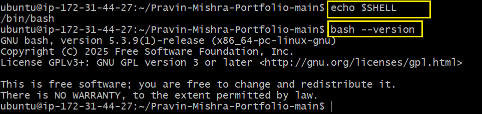

---

#### Screenshot 2 — Output of `pwd` and `ls -lah` showing the scripts directory

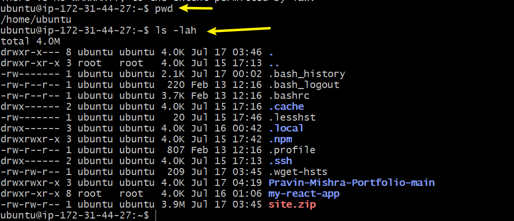

---

### Notes

Answer the following in your own words:

**1. What is Bash?**

Bash is a scritping language for Shell. its a text file contained linux commands in order for execution. it it takes linux commands in and execute it as it is programmed.
it has a unique identity that tells OS its from bash not from zsh which is `!#/bin/bash`
echo "Sola is a DMI student"
echo "DMI is in week 3 now"
echo "Sola wants to be the champion of the week and get excited"

---

**2. What is the difference between shell and Bash?**

Shell is a program that act as a bridge between user and the operating system while bash is one specific type of shell program. shell understand shebang as a unique identifier for bash. once the shell read `#!/bin/bash`, the interpreter knows the commands is coming from bash script.
---

**3. Why is it important to confirm the Bash version before writing scripts?**

its important in order to know the syntax you are supplying to the shell scripting. or else it might lead to error. Checking the version with `bash --version` first ensures your script's syntax is actually compatible with what's installed on that specific server, preventing unexpected errors.

---

# Task 2 — Your First Bash Script

## Goal

Create your first Bash script, make it executable, and run it from the terminal.

### Evidence

#### Screenshot 1 — Content of `first-script.sh`

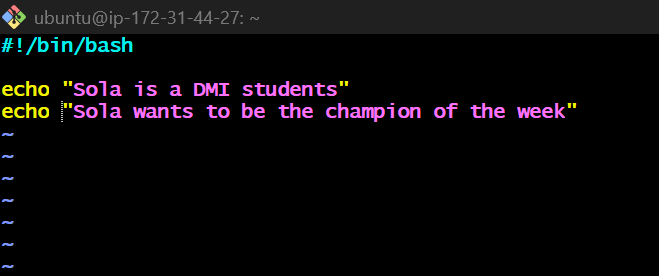

---

#### Screenshot 2 — Output of `./first-script.sh`

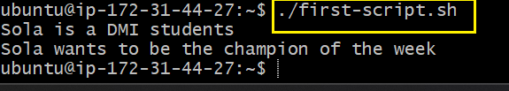

---

#### Screenshot 3 — Output of `ls -l first-script.sh` showing executable permission

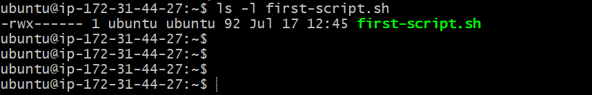

---

### Notes

Answer the following in your own words:

**1. What is the purpose of `#!/bin/bash`?**

`#!/bin/bash` means the executable program is coming from bash script. `#!/bin/bash` it is a bash interpreter itself That shell understand and identify with as soon it received a command from bash. its an instruction that points to the interpreter.
if there was a line of commands without `#!/bin/bash` the shell will not interprete it as bash sytntax.

---

**2. Why do we use `chmod +x` before running a script?**

We use  `chmod +x` to give permission to a file to be executable. if we have a file permissions string like this `-rw-------`it not yet an executable file even if you exdcute it the permision will be denied(`Permission denied`) but if we have it like this `-rwx------`, it can be executed perfecly. 

---

**3. What is the difference between running a script using `./script.sh` and `bash script.sh`?**

`./script.sh` run a script with whatever interpreter that is there but the file m,us contain permision. when using `bash script.sh`, it tells the sysytem to run the script regardless of the permision because we passed `script.sh` as an argument to the bash commands.

`./script.sh` relies on shebang why `bash script.sh` does not. using

---

# Task 3 — Variables: User Information Script

## Goal

Use variables to store and display user-related information.

### Evidence

#### Screenshot 1 — Content of `user-info.sh`

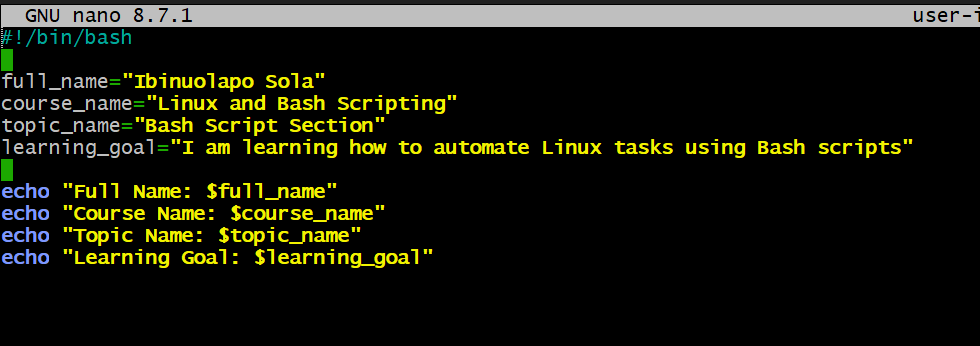

---

#### Screenshot 2 — Output of `./user-info.sh`

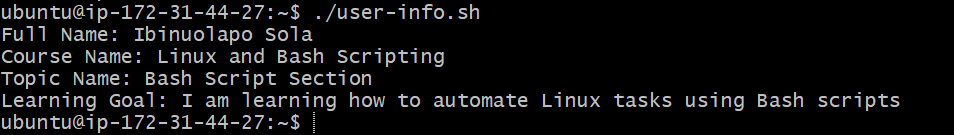

---

### Notes

Answer the following in your own words:

**1. What is a variable in Bash?**

varable is a location that hold a value. it stores value like text, a number or the output of a command. 
e,g `name="Sola"`
`echo "Hello, $name"` so the name is a variable that hold sola as a name

---

**2. Why should we avoid spaces around the `=` sign when creating variables?**

`=` is used when creating a variable, its used to assigned a valued to a variable. it is usully called assignment.

---

**3. How do you access the value stored inside a Bash variable?**

we access a Bash variable's value by putting a `$` sign in front of its name. For example, if we defined `name="Sola"` i will address it like this `echo $name`, and it will output Sola

---

# Task 4 — Arrays & Loops: Tools Checklist Script

## Goal

Use arrays and loops to print a checklist of tools used in Bash scripting.

### Evidence

#### Screenshot 1 — Content of `tools-checklist.sh`

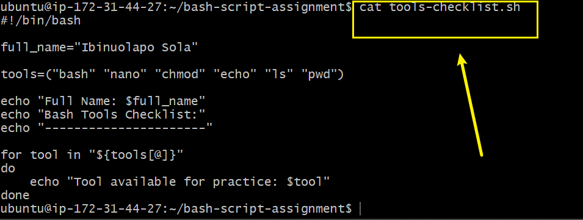

---

#### Screenshot 2 — Output of `./tools-checklist.sh`

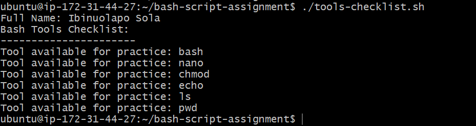

---

### Notes

Answer the following in your own words:

**1. What is an array in Bash?**

An array in Bash is a variable that can hold multiple values at once, instead of just a single value like a normal variable. Each value in the array is stored at a specific position, called an index, starting from 0.
example creating an array `tools=("bash" "nano" "chmod" "echo" "ls" "pwd")`
---

**2. Why are arrays useful in scripts?**

it help us to avoid repetitive variable task.
Arrays let us store and manage a list of related values under one variable name, instead of creating a separate variable for each one. This makes scripts shorter, more organized, and much easier to work with when dealing with multiple items.
---

**3. What does `"${tools[@]}"` mean?**

`${tools[@]}` means expand every item in the tools array as a separate, individual value", it's the standard way to access all elements of an array at once, rather than just one item by index.

---

**4. What is the purpose of the `for` loop in this script?**

The `for` loop's purpose is to automate a repeated task. for example  counting from 1 to 5 and printing a status message for each step. using one small block of code instead of five separate echo lines.

---

# Task 5 — Loops: Number Counter Script

## Goal

Use loops to repeat a task multiple times.

### Evidence

#### Screenshot 1 — Content of `counter.sh`

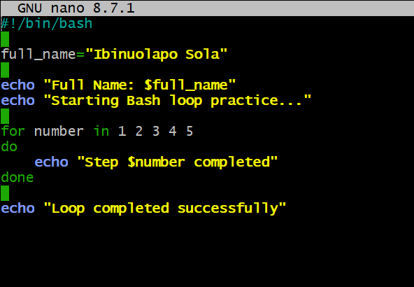

---

#### Screenshot 2 — Output of `./counter.sh`

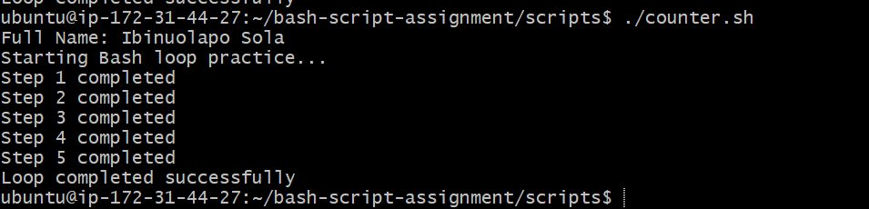

---

### Notes

Answer the following in your own words:

**1. What is a loop?**

A loop is a way of repeating a set of commands over and over again automatically, instead of writing the same commands out multiple times by hand. It runs the same block of code over and over, either a fixed number of times, for every item in a list, or until a certain condition is met.

---

**2. Why do we use loops in Bash scripting?**

we use to automate an instruction repeatedly.
Runnig the same command or set of multiple times without writing them out individually for each case. 

---

**3. How many times did the loop run in your script?**

5 times

---

**4. What would you change if you wanted the loop to run 10 times?**

I would extend the list of numbers to go up to 10, instead of stopping at 5.
like this `for number in 1 2 3 4 5 6 7 8 9 10`

---

# Task 6 — Files & Conditionals: File Validation Script

## Goal

Use file checks and conditionals to verify whether files and directories exist.

### Evidence

#### Screenshot 1 — Output of `ls -lah ../test-folder`

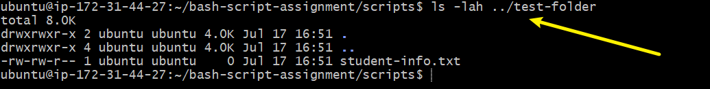

---

#### Screenshot 2 — Content of `file-check.sh`

Add your screenshot here.

---

#### Screenshot 3 — Output of `./file-check.sh`

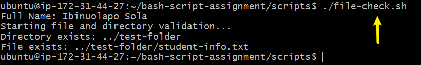

---

### Notes

Answer the following in your own words:

**1. What does `-d` check in Bash?**

`-d` checks if a path is a directory (basically a folder). If the folder exists, the check passes. If it doesn't exist, or if that path actually points to a file instead of a folder, the check fails.

---

**2. What does `-f` check in Bash?**

`-f` checks if a path is a regular file (not a folder, not a symlink, just a normal file). So if the file is really there, this returns true. If it's missing, or the path is actually a folder, it returns false.

---

**3. Why should file and directory paths be stored in variables?**

Storing paths in variables makes the script easier to read and easier to maintain. If the path changes later, you only update it in one place (the variable) instead of hunting through the whole script to change it everywhere it's used. It also reduces typos, since you're referencing `$file_path` instead of retyping the full path each time.

---

**4. What happens if the file does not exist?**

The `[ -f "$file_path" ]` check fails, so the script goes into the `else` block and prints the "does not exist" message instead of the "exists" one. The script doesn't crash or error out — it just tells you the file wasn't found and keeps running.

---

# Task 7 — Conditionals: Pass or Retry Script

## Goal

Use if-else conditionals to make decisions based on a variable value.

### Evidence

#### Screenshot 1 — Content of `score-check.sh` with `score=85`

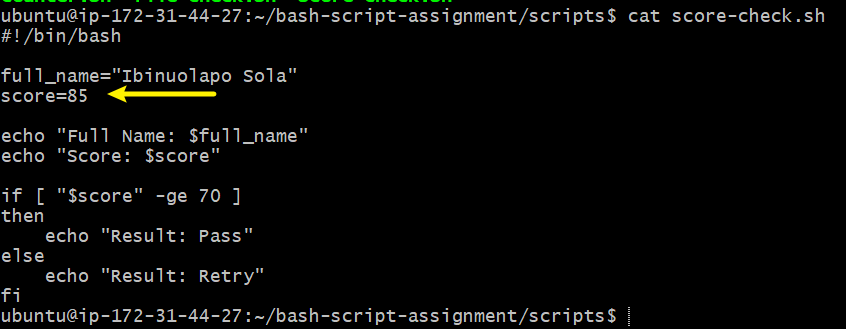

---

#### Screenshot 2 — Output showing `Result: Pass`

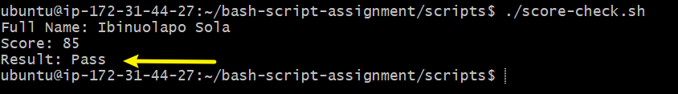

---

#### Screenshot 3 — Content of `score-check.sh` with `score=55`

---

#### Screenshot 4 — Output showing `Result: Retry`

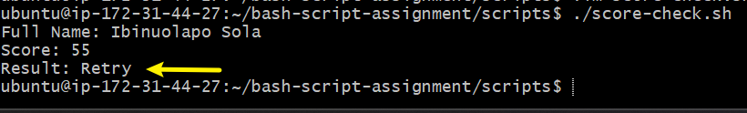

---

### Notes

Answer the following in your own words:

**1. What is the purpose of if-else in Bash?**

`if-else` lets a script make a decision instead of just running the same commands every time no matter what. It checks a condition, and if that condition is true, it runs one set of commands, but if it's false, it runs a different set instead. This is what lets a script react to different situations, like whether a score passed a threshold or whether a file exists.

---

**2. What does `-ge` mean?**

`-ge` means "greater than or equal to." It's used for comparing numbers in Bash, so `[ "$score" -ge 70 ]` checks whether the value in `$score` is 70 or higher. It's different from `>=`, which doesn't work inside single square brackets in Bash.

---

**3. Why should conditions be tested with different values?**

Testing with different values like a score right at the boundary, a score well below it, or a score well above it helps confirm the logic actually works the way it's supposed to in every situation, not just the one case you happened to try first. It catches most cases, like what happens with a score of exactly 70, that might otherwise slip through unnoticed and cause the script to behave wrong later.

---

**4. How can conditionals help in automation scripts?**

Conditionals let automation scripts make decisions on their own instead of needing a person to check things manually and decide what to run next. For example, a deployment script can check if a file or folder exists before trying to use it, or a CI/CD pipeline can check if tests passed before deciding whether to move on to the deployment stage. This makes scripts smarter and more reliable, since they can adapt to different situations automatically instead of blindly running the same steps every time.

---

# Task 8 — Functions: Final Bash Automation Script

## Goal

Create a final Bash script using functions to organize reusable code.

### Evidence

#### Screenshot 1 — Content of `final-automation.sh`

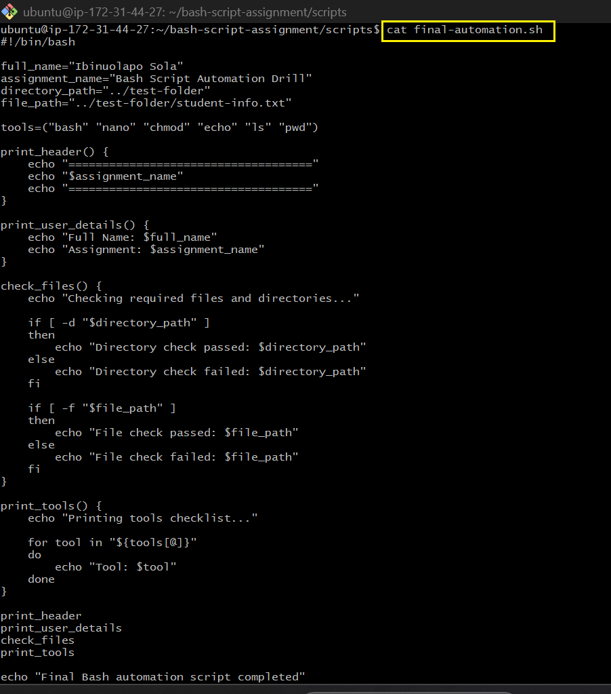

---

#### Screenshot 2 — Output of `./final-automation.sh`

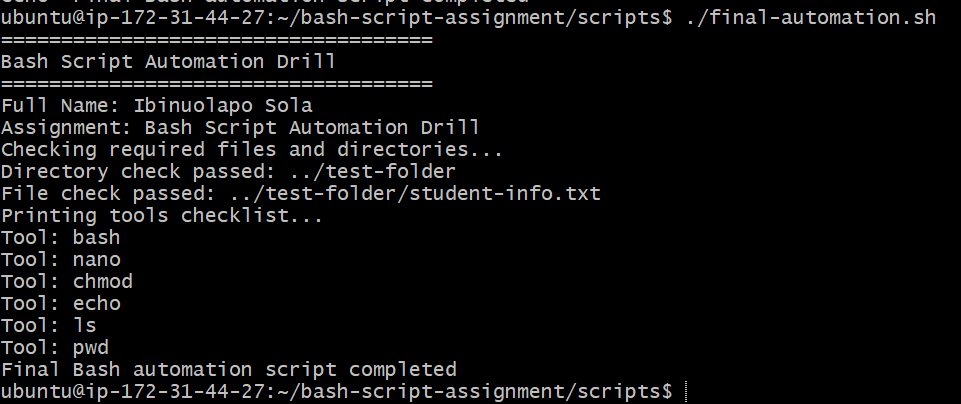

---

#### Screenshot 3 — Output of `ls -lah` showing all created scripts

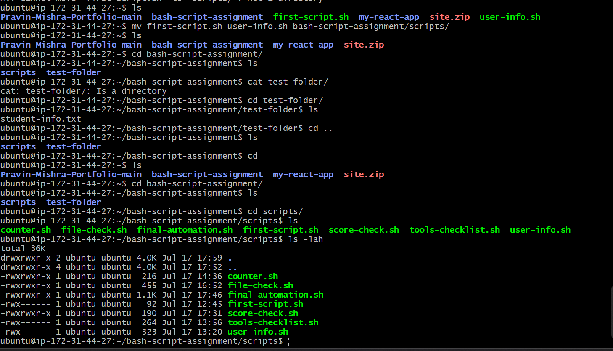

---

### Notes

Answer the following in your own words:

**1. What is a function in Bash?**

A function in Bash is a named block of code that groups a set of commands together so I can run them all just by calling the function's name, instead of retyping the same lines over and over. I define it once with a name and the commands inside `{ }`, then call it wherever I need that behavior.

---

**2. Why are functions useful in scripts?**

Functions make scripts easier to read and organize, since each function handles one specific job instead of having everything crammed into one long block of code. They also save time and reduce mistakes, because I only have to write the logic once and can reuse it by just calling the function name. On top of that, if I need to fix or update something, I only have to change it inside the function instead of hunting for every place it appears in the script.

---

**3. Which functions did you create in this script?**

I created four functions: `print_header`, which prints the assignment title banner; `print_user_details`, which prints my full name and the assignment name; `check_files`, which checks whether the required directory and file exist; and `print_tools`, which loops through the tools array and prints each tool in the checklist.

---

**4. How does this final script combine variables, arrays, loops, conditionals, files, and functions?**

The script uses variables to store my name, the assignment title, and the file/directory paths. It uses an array (`tools`) to hold the list of tools, and a `for` loop inside `print_tools` to go through that array and print each tool one by one. It uses conditionals (`if`/`else`) inside `check_files` to test whether the directory and file actually exist with `-d` and `-f`. And it wraps all of this logic into functions, so the main part of the script just calls `print_header`, `print_user_details`, `check_files`, and `print_tools` in order, which keeps everything organized and easy to follow instead of one long unbroken script.

---

# LinkedIn Post (Required)

## Evidence

#### LinkedIn Post URL

Paste your LinkedIn post URL here:

`__________________________`

---
re.

---
#### Screenshot — Published LinkedIn post

Add your screenshot he

# Submission Instructions

- Add all required screenshots in your submission
- Full name must be visible in required screenshots
- All script files must be created and run successfully
- Required notes must be answered clearly for every task
- Do not expose sensitive information (keys, passwords, credentials)

---

# Completion Checklist

- [ ] Task 1: Environment setup verified, workspace created (Screenshots 1–2, Notes answered)
- [ ] Task 2: First script created, executed, permissions verified (Screenshots 1–3, Notes answered)
- [ ] Task 3: Variables script created and run (Screenshots 1–2, Notes answered)
- [ ] Task 4: Arrays and loops script created and run (Screenshots 1–2, Notes answered)
- [ ] Task 5: Counter loop script created and run (Screenshots 1–2, Notes answered)
- [ ] Task 6: File validation script created and run (Screenshots 1–3, Notes answered)
- [ ] Task 7: Pass/Retry conditional script tested with both values (Screenshots 1–4, Notes answered)
- [ ] Task 8: Final automation script created and run (Screenshots 1–3, Notes answered)
- [ ] All scripts run without errors
- [ ] Full Name visible in all required screenshots
- [ ] LinkedIn post published and URL submitted
- [ ] No sensitive data exposed

---

## 📌 About DMI & CloudAdvisory

DevOps Micro Internship (DMI) is a project-based DevOps program run by Pravin Mishra (The CloudAdvisory) focused on real-world execution, systems thinking, and career readiness.

It helps learners build strong DevOps foundations with hands-on experience.

---

## 📌 Resources

- 🌐 DMI Official Website: https://pravinmishra.com/dmi  
- 🎓 DevOps for Beginners (Udemy): https://www.udemy.com/course/devops-for-beginners-docker-k8s-cloud-cicd-4-projects/  
- 🎓 Agentic AI DevOps with Claude Code: https://www.udemy.com/course/ultimate-agentic-ai-devops-with-claude-code/  
- 🎓 DevOps with Claude Code: Terraform, EKS, ArgoCD & Helm: https://www.udemy.com/course/devops-with-claude-code-terraform-eks-argocd-helm/  
- ▶️ YouTube Playlist: https://www.youtube.com/playlist?list=PLFeSNDtI4Cho  
- 🔗 Pravin Mishra (LinkedIn): https://www.linkedin.com/in/pravin-mishra-aws-trainer/  
- 🏢 CloudAdvisory (LinkedIn): https://www.linkedin.com/company/thecloudadvisory/

---

*This submission is part of DevOps Micro Internship (DMI) Cohort 3 — Agentic AI Track.*