# Assignment 5 — Bash Script Automation Drill (OPS Checklist)

Part of the DevOps Micro Internship (DMI) Cohort 3 with Agentic AI

---

## Purpose

In this assignment, you will practice Bash scripting by building a series of small automation scripts covering environment setup, variables, arrays, loops, file conditionals, if-else logic, and functions. These scripts form the foundation of real-world Linux automation used in DevOps, cloud, and production support environments.

---

# Task 1 — Bash Environment & Workspace Setup

## Goal

Verify that Bash is available on your system and create a clean workspace for this assignment.

### Evidence

#### Screenshot 1 — Output of `echo $SHELL` and `bash --version`

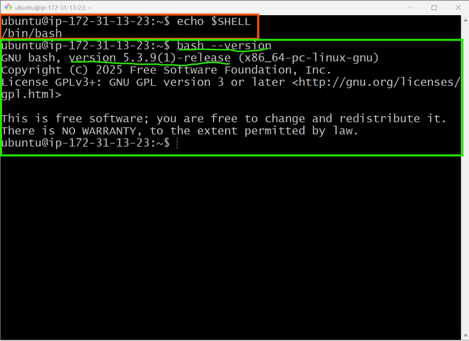

---

#### Screenshot 2 — Output of `pwd` and `ls -lah` showing the scripts directory

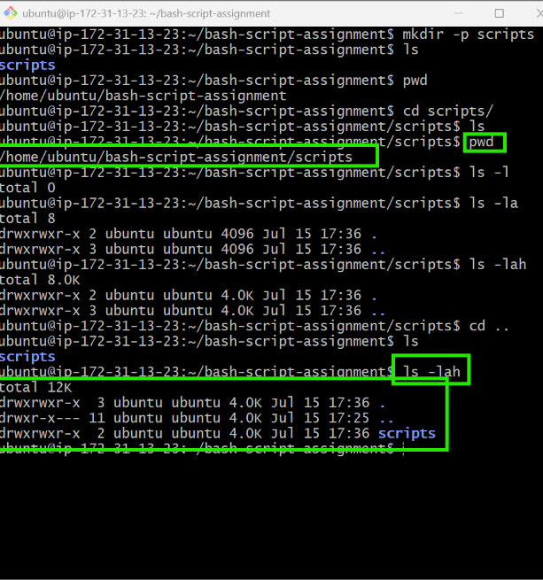

---

### Notes

Answer the following in your own words:

**1. What is Bash?**

Bash (Bourne Again SHell) is a Linux command-line interpreter and scripting language. It allows users to interact with the operating system by executing commands and automating tasks through shell scripts. Bash is the default shell on many Linux distributions and includes features for command execution, variables, loops, functions, and automation.

---

**2. What is the difference between shell and Bash?**

A shell is a general term for any command-line interpreter that provides an interface between the user and the operating system. There are several types of shells, such as Bash, Zsh, Fish, and KornShell (ksh).

Bash is one specific shell. It is an enhanced version of the original Bourne Shell (sh) and provides additional features such as command history, command-line editing, arrays, improved scripting capabilities, and better automation support. In other words, all Bash programs are shells, but not all shells are Bash.

---

**3. Why is it important to confirm the Bash version before writing scripts?**

Confirming the Bash version is important because different versions support different features. Some commands and scripting features may not work on older Bash versions. Verifying the version helps ensure that scripts are compatible with the target system, reduces unexpected errors, and makes troubleshooting easier when scripts behave differently across environments.

Your terminal output also shows that you successfully completed the workspace setup:

    # Created the scripts directory.
    # Verified the working directory using pwd.
    # Listed the contents with ls -lah.
    # Confirmed the scripts directory exists and is currently empty, ready for the remaining tasks.

---

# Task 2 — Your First Bash Script

## Goal

Create your first Bash script, make it executable, and run it from the terminal.

### Evidence

#### Screenshot 1 — Content of `first-script.sh`

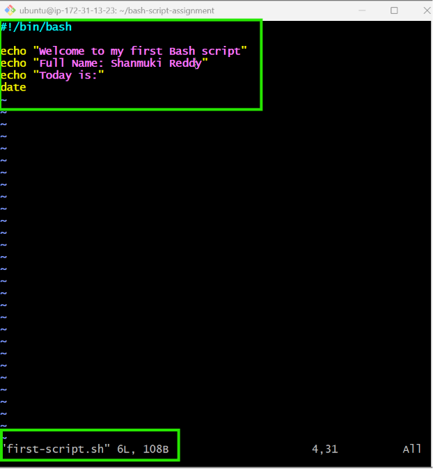

---

#### Screenshot 2 — Output of `./first-script.sh`

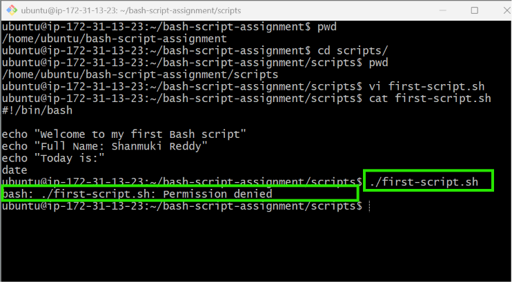

---

#### Screenshot 3 — Output of `ls -l first-script.sh` showing executable permission

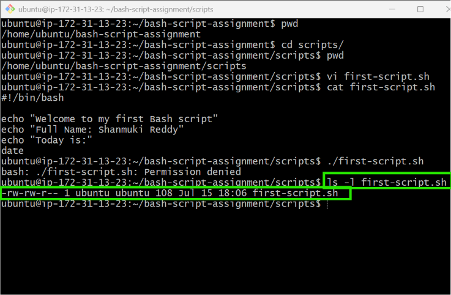
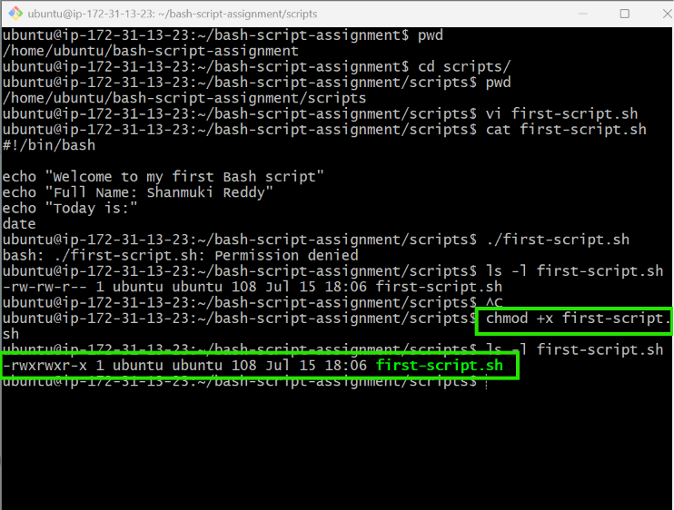

---

### Notes

Answer the following in your own words:

**1. What is the purpose of `#!/bin/bash`?**

#!/bin/bash is called the shebang. It tells the operating system to execute the script using the Bash interpreter located at /bin/bash. This ensures the script runs with Bash regardless of the user's default shell.
---

**2. Why do we use `chmod +x` before running a script?**

The chmod +x command gives a file execute permission. Without this permission, Linux treats the file as a normal text file and will not allow it to be run directly using ./script.sh.

---

**3. What is the difference between running a script using `./script.sh` and `bash script.sh`?**

./script.sh executes the script directly. The script must have execute permission (chmod +x) and the shebang (#!/bin/bash) tells the system which interpreter to use.
bash script.sh runs the script by explicitly invoking the Bash interpreter. The script does not need execute permission because Bash reads the file as input, although it must still be readable.

---

# Task 3 — Variables: User Information Script

## Goal

Use variables to store and display user-related information.

### Evidence

#### Screenshot 1 — Content of `user-info.sh`
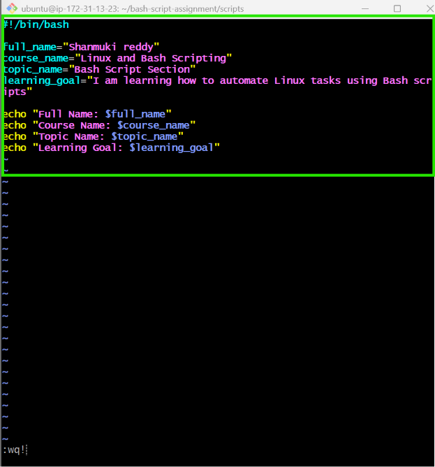
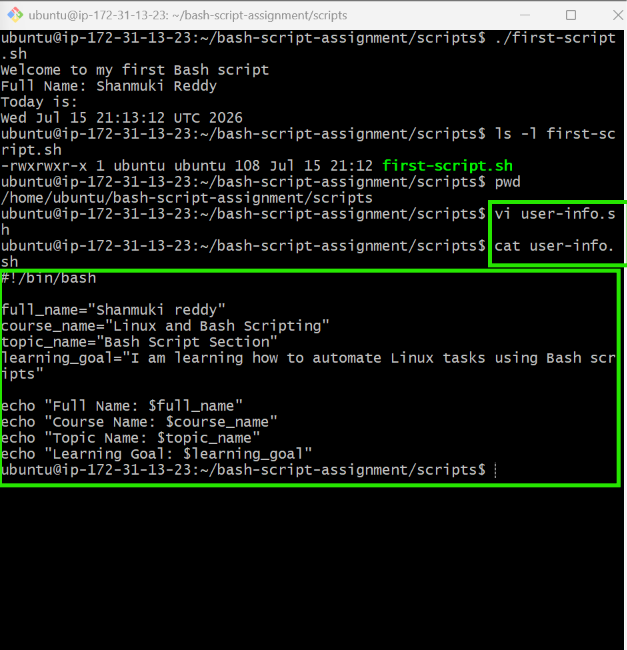
---

#### Screenshot 2 — Output of `./user-info.sh`

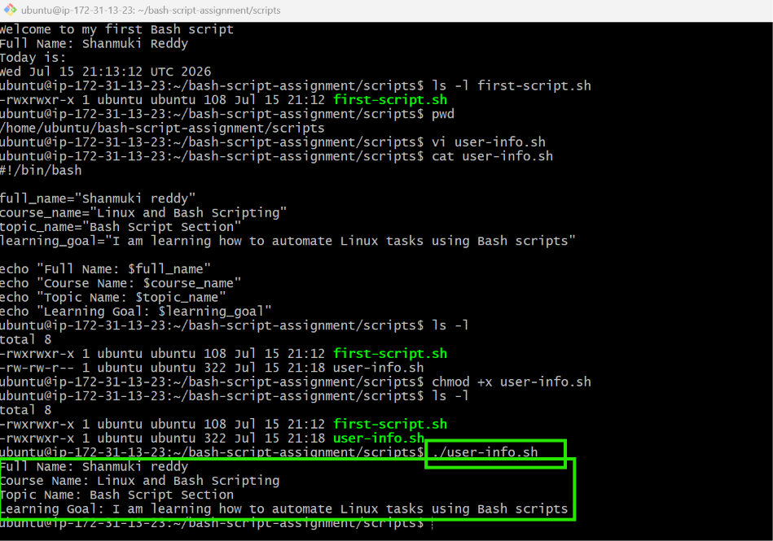
---

### Notes

Answer the following in your own words:

**1. What is a variable in Bash?**

A variable in Bash is a named storage location used to hold data, such as text, numbers, or command output. Variables allow you to store values and reuse them throughout a script, making scripts more flexible and easier to maintain.

---

**2. Why should we avoid spaces around the `=` sign when creating variables?**

When creating variables in Bash, you should avoid using spaces around the '=' sign because Bash requires variable assignments to follow a strict syntax. The variable name, the '=' sign, and the value must be written together without any spaces. If spaces are added, Bash interprets the variable name as a command and the remaining text as separate arguments, which results in an error instead of assigning the value. Writing variables correctly ensures that your script runs without syntax errors and behaves as expected

---

**3. How do you access the value stored inside a Bash variable?**

You access the value of a Bash variable by placing a $ before the variable name.The $ tells Bash to substitute the variable with its stored value.
---

# Task 4 — Arrays & Loops: Tools Checklist Script

## Goal

Use arrays and loops to print a checklist of tools used in Bash scripting.

### Evidence

#### Screenshot 1 — Content of `tools-checklist.sh`
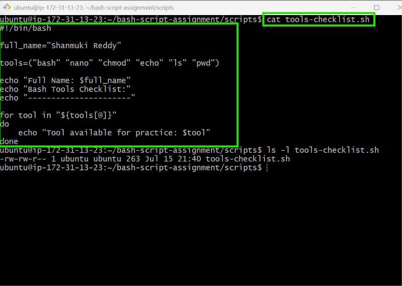

---

#### Screenshot 2 — Output of `./tools-checklist.sh`

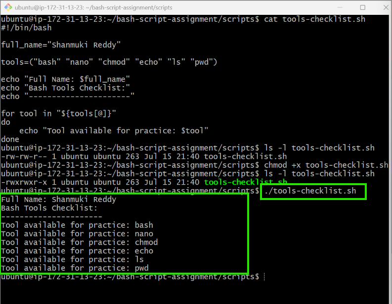

---

### Notes

Answer the following in your own words:

**1. What is an array in Bash?**

An array in Bash is a variable that can store multiple values under a single name. Each value is stored at a different index, allowing you to group related data together and access individual elements when needed.

---

**2. Why are arrays useful in scripts?**
Arrays are useful in Bash scripts because they allow you to store and manage multiple related values in one variable instead of creating separate variables for each item. This makes scripts more organised, easier to maintain, and more efficient when processing lists of data such as file names, commands, or tools.

---

**3. What does `"${tools[@]}"` mean?**

"${tools[@]}"refers to all the elements stored in the tools array. When used in a loop, it expands each array element individually, allowing the script to process every item one at a time while preserving any spaces within the values.

---

**4. What is the purpose of the `for` loop in this script?**

Add your answer here.

---

# Task 5 — Loops: Number Counter Script

## Goal

Use loops to repeat a task multiple times.

### Evidence

#### Screenshot 1 — Content of `counter.sh`

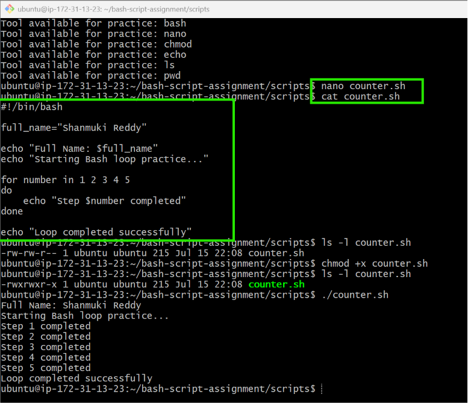

---

#### Screenshot 2 — Output of `./counter.sh`
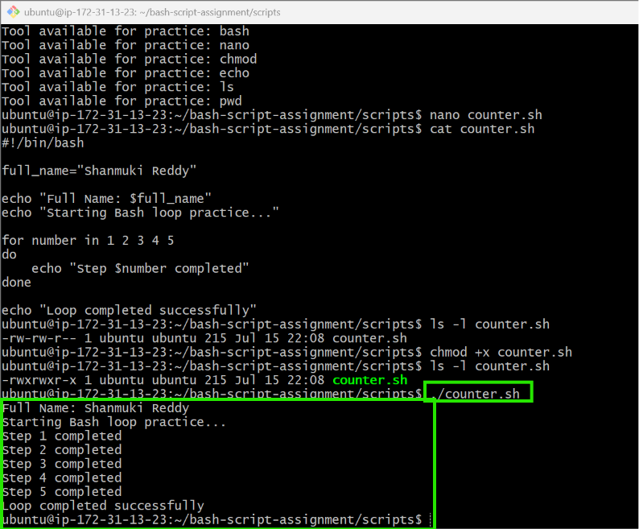

---

### Notes

Answer the following in your own words:

**1. What is a loop?**
A loop is a programming structure that repeats a set of commands multiple times. In Bash scripting, loops allow tasks to be automated by executing the same instructions repeatedly without writing the same code again and again.

---

**2. Why do we use loops in Bash scripting?**

We use loops in Bash scripting to automate repetitive tasks, reduce code duplication, and improve efficiency. Loops are commonly used for processing multiple files, checking system information, running commands repeatedly, and handling lists of items.

---

**3. How many times did the loop run in your script?**

The loop ran 5 times because the script used the values 1 2 3 4 5 in the for loop. Each value was processed once, producing five completed steps.

---

**4. What would you change if you wanted the loop to run 10 times?**
To make the loop run 10 times, I would change the list of numbers in the for loop from 1 2 3 4 5 to 1 2 3 4 5 6 7 8 9 10. 

---

# Task 6 — Files & Conditionals: File Validation Script

## Goal

Use file checks and conditionals to verify whether files and directories exist.

### Evidence

#### Screenshot 1 — Output of `ls -lah ../test-folder`

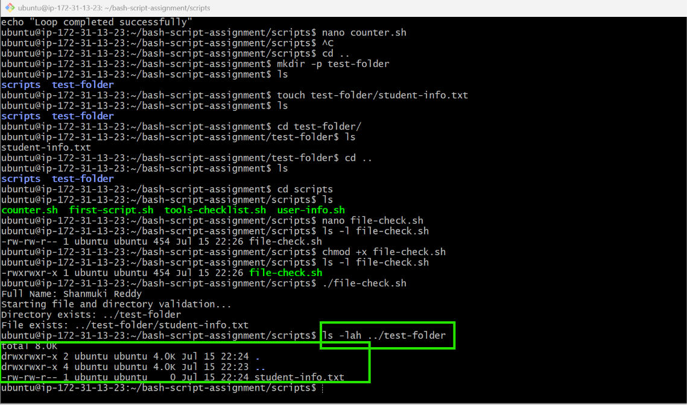
---

#### Screenshot 2 — Content of `file-check.sh`

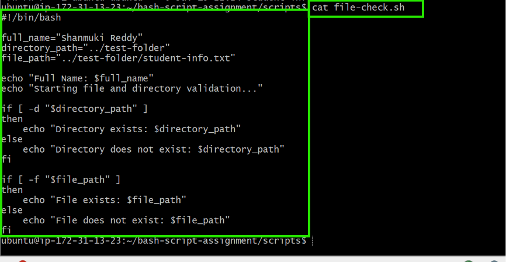

---

#### Screenshot 3 — Output of `./file-check.sh`

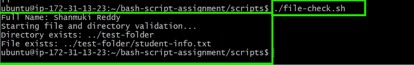

---

### Notes

Answer the following in your own words:

**1. What does `-d` check in Bash?**

The -d option checks whether a specified path exists and is a directory. It is commonly used with if statements in Bash scripts to verify that required folders are available before performing operations on them.

---

**2. What does `-f` check in Bash?**

The -f option checks whether a specified path exists and is a regular file. It helps scripts confirm that a required file is present before attempting to read, modify, or process it.

---

**3. Why should file and directory paths be stored in variables?**

File and directory paths should be stored in variables because it makes scripts easier to read, maintain, and update. Instead of repeating the same path multiple times, a variable allows the path to be changed in one place, reducing errors and making the script more flexible.
---

**4. What happens if the file does not exist?**

If the file does not exist, the condition using -f will return false, and the script will execute the else section. It will display a message indicating that the file does not exist instead of causing the script to fail.

---

# Task 7 — Conditionals: Pass or Retry Script

## Goal

Use if-else conditionals to make decisions based on a variable value.

### Evidence

#### Screenshot 1 — Content of `score-check.sh` with `score=85`

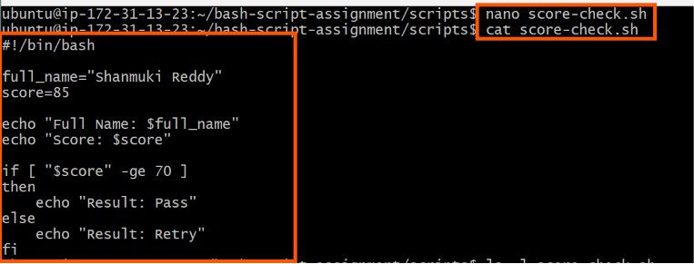
---

#### Screenshot 2 — Output showing `Result: Pass`

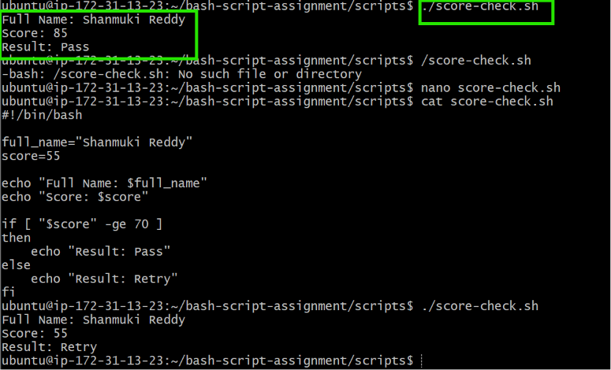

---

#### Screenshot 3 — Content of `score-check.sh` with `score=55`
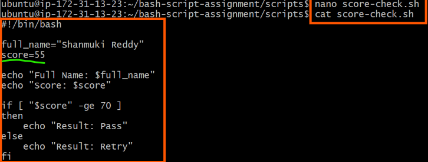

---

#### Screenshot 4 — Output showing `Result: Retry`

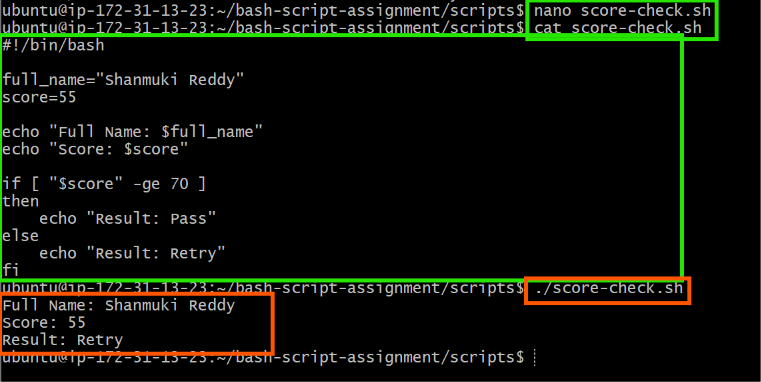

---

### Notes

Answer the following in your own words:

**1. What is the purpose of if-else in Bash?**

The if-else statement is used to make decisions in a Bash script based on whether a condition is true or false. It allows the script to execute one set of commands if the condition is met and a different set of commands if it is not, making scripts more flexible and suitable for automation.

---

**2. What does `-ge` mean?**

The -ge operator means greater than or equal to. It is used to compare two integer values in Bash. If the first value is greater than or equal to the second value, the condition evaluates to true.

---

**3. Why should conditions be tested with different values?**

Conditions should be tested with different values to ensure that all possible outcomes work as expected. Testing both true and false conditions helps identify errors, confirms that the script behaves correctly in different situations, and makes the script more reliable.

---

**4. How can conditionals help in automation scripts?**

Conditionals help automation scripts make decisions based on different situations, such as checking whether a file exists, validating user input, or responding to command results. This allows scripts to handle different scenarios automatically without requiring manual intervention.

---

# Task 8 — Functions: Final Bash Automation Script

## Goal

Create a final Bash script using functions to organize reusable code.

### Evidence

#### Screenshot 1 — Content of `final-automation.sh`

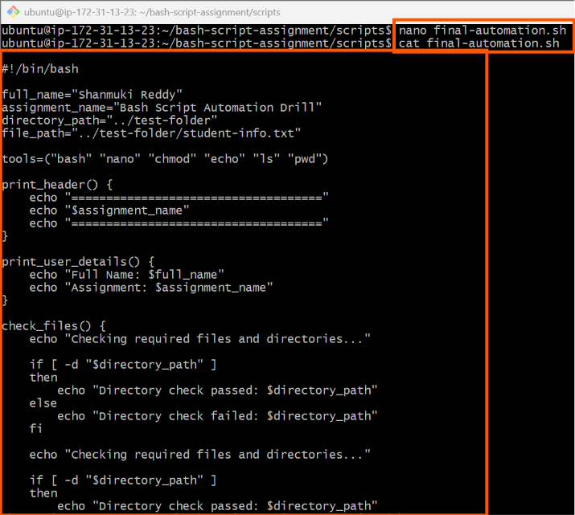
---

#### Screenshot 2 — Output of `./final-automation.sh`

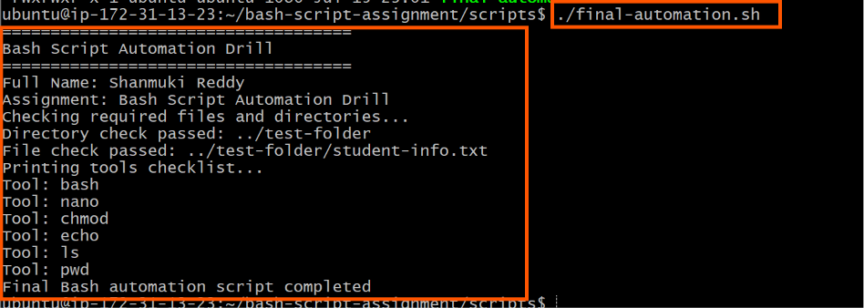

---

#### Screenshot 3 — Output of `ls -lah` showing all created scripts

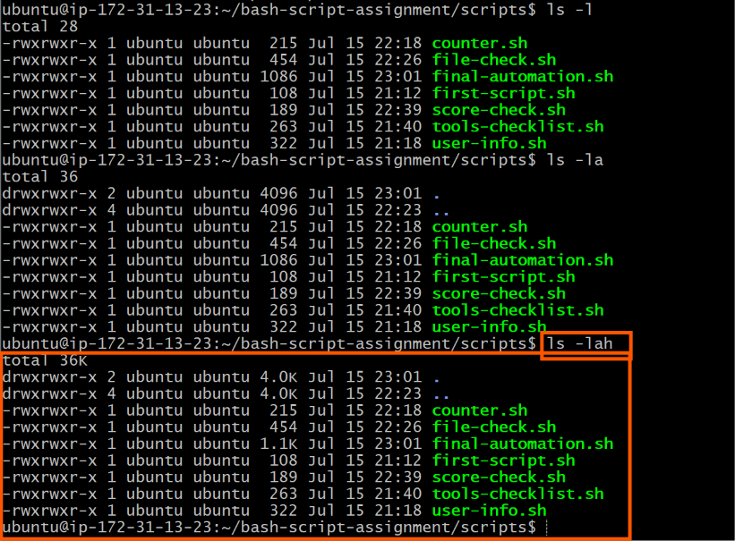

---

### Notes

Answer the following in your own words:

**1. What is a function in Bash?**

A function in Bash is a reusable block of code that performs a specific task. Instead of writing the same commands multiple times, you can place them inside a function and call the function whenever it is needed. This makes scripts more organised and easier to manage.

---

**2. Why are functions useful in scripts?**
Functions are useful because they reduce code duplication, improve readability, and make scripts easier to maintain. If changes are needed, you only need to update the code in one place rather than throughout the entire script.

---

**3. Which functions did you create in this script?**

In this script, I created the 4 functions:

print_header – Prints the assignment title and header.
print_user_details – Displays my full name and assignment details.
check_files – Checks whether the required directory and file exist.
print_tools – Uses a loop to print each tool from the array.

---

**4. How does this final script combine variables, arrays, loops, conditionals, files, and functions?**

The final script combines several Bash scripting concepts into one automation script. It uses variables to store information such as my name, assignment name, and file paths. It uses an array to store the list of tools and a for loop to print each tool. Conditionals (if-else) check whether the required directory and file exist. These tasks are organised into functions, making the script modular, reusable, and easier to read and maintain.

---

# LinkedIn Post (Required)

## Evidence

#### LinkedIn Post URL

Paste your LinkedIn post URL here:

`https://www.linkedin.com/posts/shanmuki-reddy_linux-bash-shellscripting-ugcPost-7483300760240431104-fvhE/?utm_source=share&utm_medium=member_desktop&rcm=ACoAAE0LbgwBcO3gizrVfuqLPvGD60OHg7LFHRw`

---

#### Screenshot — Published LinkedIn post

---

# Submission Instructions

- Add all required screenshots in your submission
- Full name must be visible in required screenshots
- All script files must be created and run successfully
- Required notes must be answered clearly for every task
- Do not expose sensitive information (keys, passwords, credentials)

---

# Completion Checklist

- [ ] Task 1: Environment setup verified, workspace created (Screenshots 1–2, Notes answered)
- [ ] Task 2: First script created, executed, permissions verified (Screenshots 1–3, Notes answered)
- [ ] Task 3: Variables script created and run (Screenshots 1–2, Notes answered)
- [ ] Task 4: Arrays and loops script created and run (Screenshots 1–2, Notes answered)
- [ ] Task 5: Counter loop script created and run (Screenshots 1–2, Notes answered)
- [ ] Task 6: File validation script created and run (Screenshots 1–3, Notes answered)
- [ ] Task 7: Pass/Retry conditional script tested with both values (Screenshots 1–4, Notes answered)
- [ ] Task 8: Final automation script created and run (Screenshots 1–3, Notes answered)
- [ ] All scripts run without errors
- [ ] Full Name visible in all required screenshots
- [ ] LinkedIn post published and URL submitted
- [ ] No sensitive data exposed

---

## 📌 About DMI & CloudAdvisory

DevOps Micro Internship (DMI) is a project-based DevOps program run by Pravin Mishra (The CloudAdvisory) focused on real-world execution, systems thinking, and career readiness.

It helps learners build strong DevOps foundations with hands-on experience.

---

## 📌 Resources

- 🌐 DMI Official Website: https://pravinmishra.com/dmi  
- 🎓 DevOps for Beginners (Udemy): https://www.udemy.com/course/devops-for-beginners-docker-k8s-cloud-cicd-4-projects/  
- 🎓 Agentic AI DevOps with Claude Code: https://www.udemy.com/course/ultimate-agentic-ai-devops-with-claude-code/  
- 🎓 DevOps with Claude Code: Terraform, EKS, ArgoCD & Helm: https://www.udemy.com/course/devops-with-claude-code-terraform-eks-argocd-helm/  
- ▶️ YouTube Playlist: https://www.youtube.com/playlist?list=PLFeSNDtI4Cho  
- 🔗 Pravin Mishra (LinkedIn): https://www.linkedin.com/in/pravin-mishra-aws-trainer/  
- 🏢 CloudAdvisory (LinkedIn): https://www.linkedin.com/company/thecloudadvisory/

---

*This submission is part of DevOps Micro Internship (DMI) Cohort 3 — Agentic AI Track.*