# Assignment 5 — Bash Script Automation Drill (OPS Checklist)

Part of the DevOps Micro Internship (DMI) Cohort 3 with Agentic AI

---

## Purpose

In this assignment, you will practice Bash scripting by building a series of small automation scripts covering environment setup, variables, arrays, loops, file conditionals, if-else logic, and functions. These scripts form the foundation of real-world Linux automation used in DevOps, cloud, and production support environments.

---

# Task 1 — Bash Environment & Workspace Setup

## Goal

Verify that Bash is available on your system and create a clean workspace for this assignment.

### Evidence

#### Screenshot 1 — Output of `echo $SHELL` and `bash --version`

---

#### Screenshot 2 — Output of `pwd` and `ls -lah` showing the scripts directory

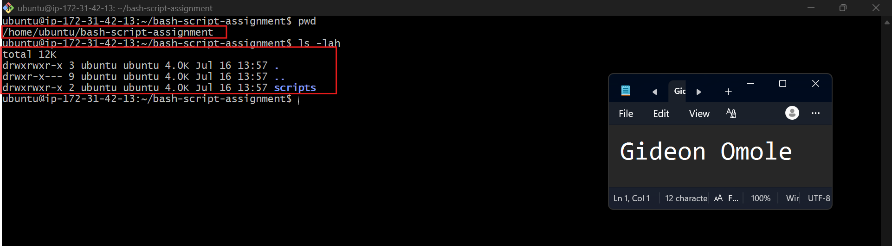

---

### Notes

Answer the following in your own words:

**1. What is Bash?**

Bash (short for "Bourne Again Shell") is a command-line program that lets you talk to your computer's operating system by typing commands instead of clicking around a graphical interface. It's the default shell on most Linux distributions and on macOS. You can use it to run programs, move and manage files, automate repetitive tasks, and write scripts that chain a bunch of commands together.

---

**2. What is the difference between shell and Bash?**

"Shell" is the general term for any program that gives you a command-line interface to interact with an operating system — it's the category, not a specific product. Bash is just one implementation of a shell. There are others, like Zsh, Ksh, Fish, and the original Bourne shell (sh), each with their own syntax quirks and features. So basically, every Bash is a shell, but not every shell is Bash. Think of "shell" like "car" and "Bash" like "Toyota Corolla" — one is the category, the other is a specific option within it.

---

**3. Why is it important to confirm the Bash version before writing scripts?**

Because not all systems run the same version of Bash, and newer versions support features that older ones don't. If you write a script using a newer feature and someone runs it on an older version, it might not work. Checking the version first helps avoid these compatibility issues.

---

# Task 2 — Your First Bash Script

## Goal

Create your first Bash script, make it executable, and run it from the terminal.

### Evidence

#### Screenshot 1 — Content of `first-script.sh`

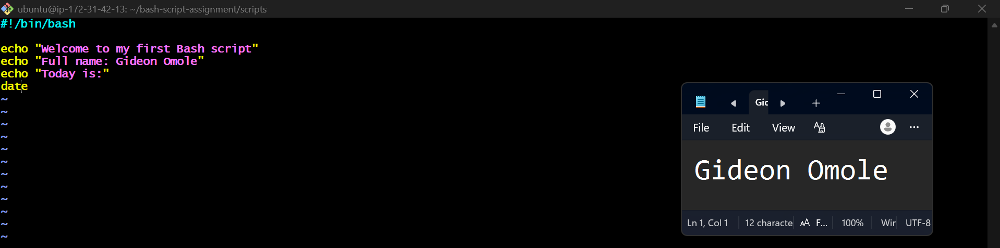

---

#### Screenshot 2 — Output of `./first-script.sh`

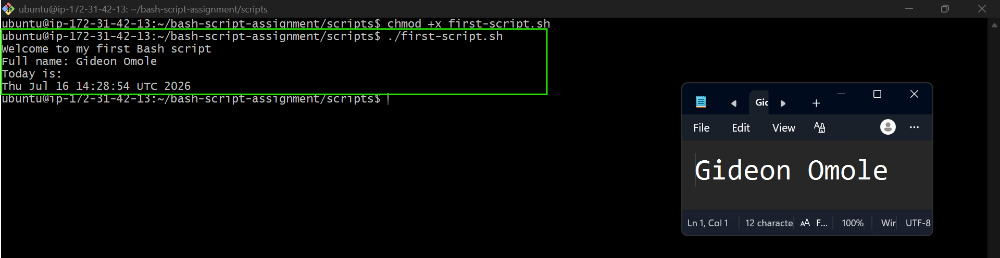

---

#### Screenshot 3 — Output of `ls -l first-script.sh` showing executable permission

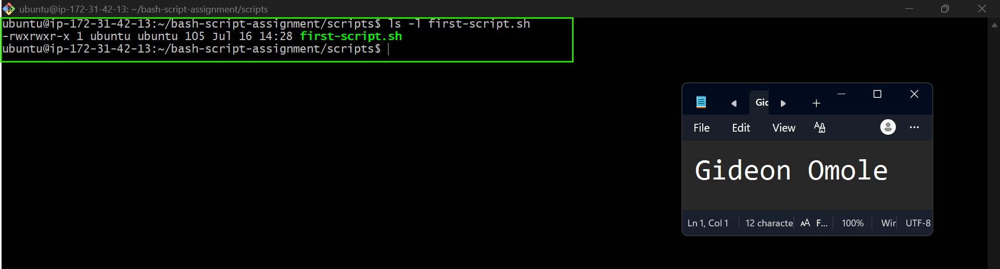

---

### Notes

Answer the following in your own words:

**1. What is the purpose of `#!/bin/bash`?**

It's called a shebang, and it goes at the very top of a script. It tells the system which program should be used to run the file — in this case, Bash. Without it, the system might try to run the script with the wrong interpreter, which could cause errors or unexpected behavior.

---

**2. Why do we use `chmod +x` before running a script?**

By default, a new file usually isn't marked as executable. `chmod +x` gives it permission to run as a program. Without this step, trying to execute the script directly (like with `./script.sh`) will give you a "permission denied" error.

---

**3. What is the difference between running a script using `./script.sh` and `bash script.sh`?**

`./script.sh` runs the script directly using whatever interpreter is listed in its shebang line, and it requires the file to have execute permission first. `bash script.sh` skips the shebang entirely and just tells Bash to run the file, regardless of whether it's executable or what interpreter is listed at the top. Basically, one relies on the file's own permissions and shebang, while the other forces Bash to run it no matter what.

---

# Task 3 — Variables: User Information Script

## Goal

Use variables to store and display user-related information.

### Evidence

#### Screenshot 1 — Content of `user-info.sh`

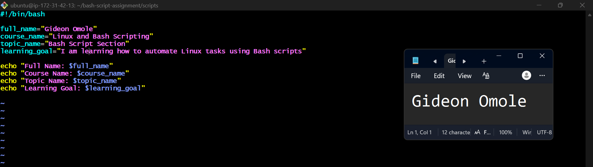

---

#### Screenshot 2 — Output of `./user-info.sh`

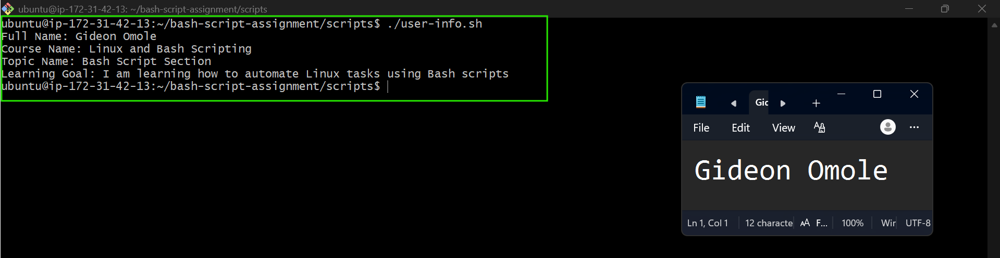

---

### Notes

Answer the following in your own words:

**1. What is a variable in Bash?**

A variable is basically a name you assign to a piece of data so you can reuse it later without retyping it. It could hold text, a number, a file path, or the output of a command. For example, `name="John"` stores the text "John" in a variable called `name`.

---

**2. Why should we avoid spaces around the `=` sign when creating variables?**

if you add spaces around the `=`, like `name = "John"`, Bash thinks you're trying to run a command called `name` with arguments `=` and `"John"`, which causes an error. Writing it as `name="John"` with no spaces is the correct way to assign a value.

---

**3. How do you access the value stored inside a Bash variable?**

You put a `$` symbol in front of the variable name, like `$name` or `${name}`. This tells Bash to substitute in the value stored in that variable instead of treating it as plain text.

---

# Task 4 — Arrays & Loops: Tools Checklist Script

## Goal

Use arrays and loops to print a checklist of tools used in Bash scripting.

### Evidence

#### Screenshot 1 — Content of `tools-checklist.sh`

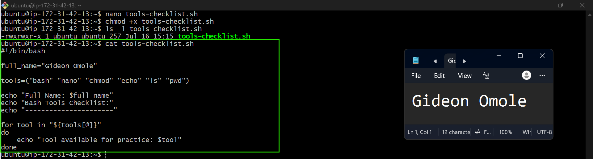

---

#### Screenshot 2 — Output of `./tools-checklist.sh`

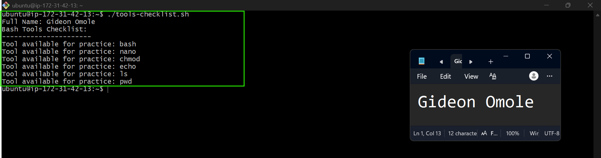

---

### Notes

Answer the following in your own words:

**1. What is an array in Bash?**

An array is a variable that can hold more than one value at a time, instead of just one. Each value has its own position, so you can store a list of items under one name.

---

**2. Why are arrays useful in scripts?**

They let you group related items together and work with them easily, instead of creating a separate variable for each one. This makes scripts shorter and easier to manage.

---

**3. What does `"${tools[@]}"` mean?**

It means "all the items in the `tools` array." It's used to get every value stored in the array, usually so you can loop through them.

---

**4. What is the purpose of the `for` loop in this script?**

It goes through each item in a list one at a time and runs the same commands on each one, so you don't have to repeat code for every item.

---

# Task 5 — Loops: Number Counter Script

## Goal

Use loops to repeat a task multiple times.

### Evidence

#### Screenshot 1 — Content of `counter.sh`

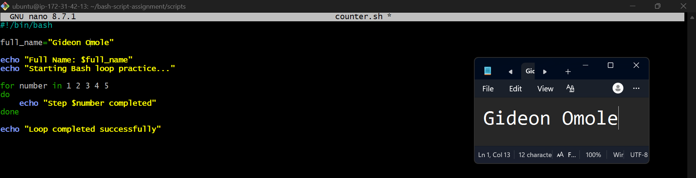

---

#### Screenshot 2 — Output of `./counter.sh`

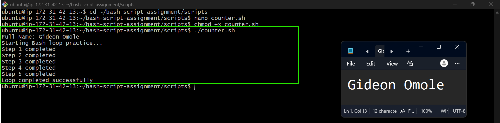

---

### Notes

Answer the following in your own words:

**1. What is a loop?**

A loop is a way to repeat a set of commands multiple times without having to write them out again and again. It keeps running until a certain condition is met or until it's gone through a list of items.

---

**2. Why do we use loops in Bash scripting?**

They save time and effort by letting us automate repetitive tasks. Instead of manually typing the same command over and over, a loop does it for us, which makes scripts shorter, cleaner, and less prone to mistakes.

---

**3. How many times did the loop run in your script?**

The loop ran 5 times, since the list `1 2 3 4 5` has 5 numbers in it. Each number caused the loop to run once, printing "Step $number completed" for each.

---

**4. What would you change if you wanted the loop to run 10 times?**

I'd change the list of numbers to go up to 10, like this:

`for number in 1 2 3 4 5 6 7 8 9 10`

Or use a shorter range instead:

`for number in {1..10}`

Either way, the loop would then run 10 times instead of 5.Want to be notified when Claude responds?

---

# Task 6 — Files & Conditionals: File Validation Script

## Goal

Use file checks and conditionals to verify whether files and directories exist.

### Evidence

#### Screenshot 1 — Output of `ls -lah ../test-folder`

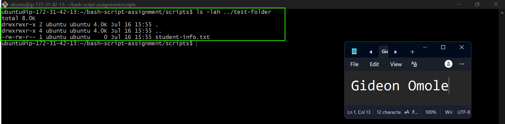

---

#### Screenshot 2 — Content of `file-check.sh`

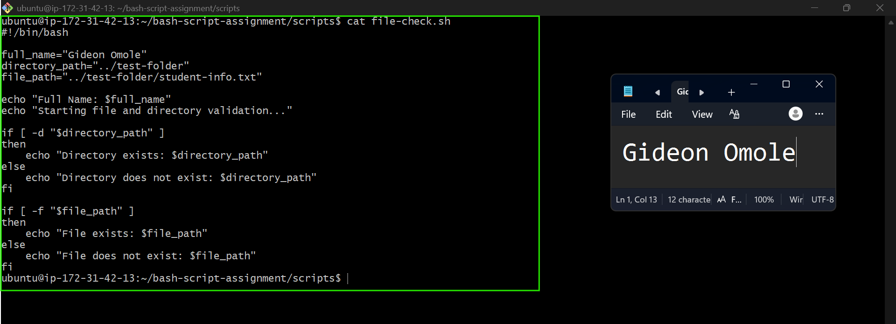

---

#### Screenshot 3 — Output of `./file-check.sh`

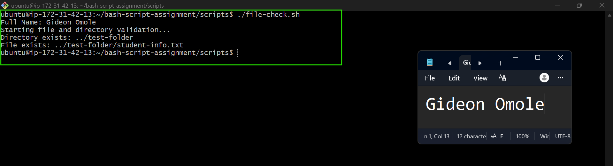

---

### Notes

Answer the following in your own words:

**1. What does `-d` check in Bash?**

The `-d` flag checks whether a given path exists and is a directory. If it is, the condition returns true; if the path doesn't exist or isn't a directory, it returns false.

---

**2. What does `-f` check in Bash?**

The `-f` flag checks whether a given path exists and is a regular file (not a directory). If it exists as a file, the condition returns true; otherwise, it returns false.

---

**3. Why should file and directory paths be stored in variables?**

Storing paths in variables makes the script easier to read and maintain. If the path ever changes, you only need to update it in one place instead of hunting through the whole script. It also reduces typos since you're referencing the same variable instead of retyping the path multiple times.

---

**4. What happens if the file does not exist?**

The `-f` check would fail, so the condition falls into the `else` block, and the script prints the "File does not exist" message instead of the success message. The script doesn't crash — it just handles the missing file gracefully and lets you know.

---

# Task 7 — Conditionals: Pass or Retry Script

## Goal

Use if-else conditionals to make decisions based on a variable value.

### Evidence

#### Screenshot 1 — Content of `score-check.sh` with `score=85`

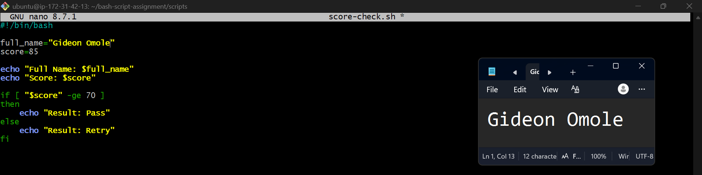

---

#### Screenshot 2 — Output showing `Result: Pass`

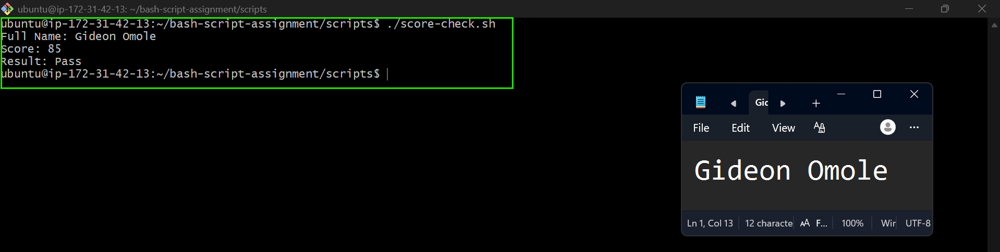

---

#### Screenshot 3 — Content of `score-check.sh` with `score=55`

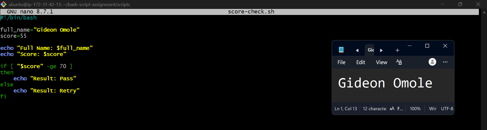

---

#### Screenshot 4 — Output showing `Result: Retry`

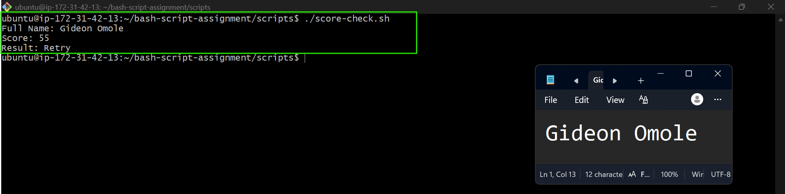
---

### Notes

Answer the following in your own words:

**1. What is the purpose of if-else in Bash?**

If-else lets a script make decisions and take different actions depending on whether a condition is true or false. If the condition is true, the code inside the `if` block runs; if it's false, the code inside the `else` block runs instead. It's what gives a script the ability to respond differently to different situations.

---

**2. What does `-ge` mean?**

`-ge` stands for "greater than or equal to." It's used to compare two numbers, and the condition is true if the first number is greater than or equal to the second one. In this script, `[ "$score" -ge 70 ]` checks if the score is 70 or higher.

---

**3. Why should conditions be tested with different values?**

Testing with different values makes sure the script actually works the way it's supposed to in every situation, not just one. In this case, testing both a passing score and a failing score confirms that both the `if` and `else` parts of the condition work correctly, instead of just assuming they do.

---

**4. How can conditionals help in automation scripts?**

Conditionals let scripts make smart decisions on their own instead of just running the same steps blindly every time. This means a script can check for certain conditions (like whether a file exists, a value meets a threshold, or a process succeeded) and respond appropriately, which makes automation more reliable and reduces the need for manual checking.

---

# Task 8 — Functions: Final Bash Automation Script

## Goal

Create a final Bash script using functions to organize reusable code.

### Evidence

#### Screenshot 1 — Content of `final-automation.sh`

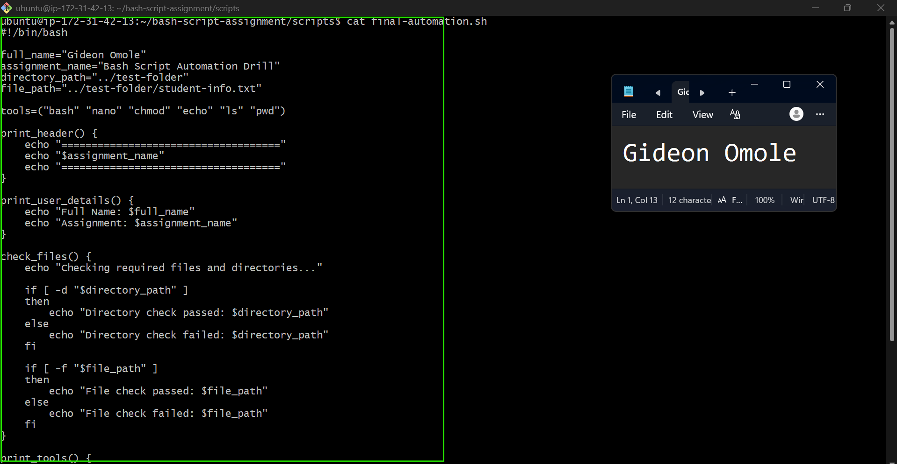

---

#### Screenshot 2 — Output of `./final-automation.sh`

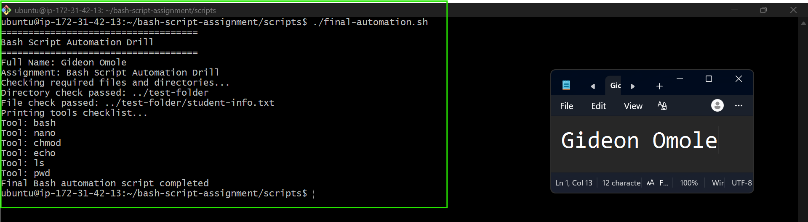

---

#### Screenshot 3 — Output of `ls -lah` showing all created scripts

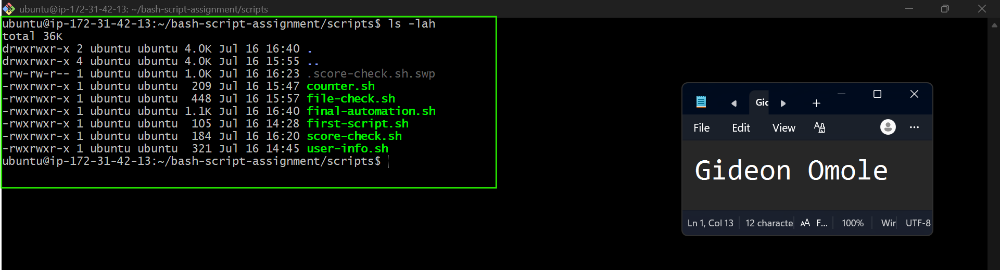

---

### Notes

Answer the following in your own words:

**1. What is a function in Bash?**

A function is a block of code that you give a name to, so you can reuse it whenever you need it instead of writing the same commands over and over. You define it once, then just call its name whenever you want to run that block of code.

---

**2. Why are functions useful in scripts?**

They make scripts more organized and easier to read by breaking tasks into smaller, named pieces. They also save time since you can reuse the same function multiple times instead of repeating code, and if something needs to change, you only have to update it in one place.

---

**3. Which functions did you create in this script?**

Four functions were created: `print_header`, which prints the assignment title in a banner; `print_user_details`, which prints the full name and assignment name; `check_files`, which checks whether the required directory and file exist; and `print_tools`, which loops through the `tools` array and prints each tool name..

---

**4. How does this final script combine variables, arrays, loops, conditionals, files, and functions?**

The script uses variables like `full_name`, `assignment_name`, `directory_path`, and `file_path` to store reusable values. It uses an array, `tools`, to hold a list of command names. Inside the `print_tools` function, a `for` loop goes through each item in that array and prints it out. Inside `check_files`, conditionals (`if-else` with `-d` and `-f`) check whether the directory and file actually exist. All of this logic is organized into separate functions, which are then called one after another at the bottom of the script to run the whole program in order. This combination lets the script stay organized while still using every core concept — variables, arrays, loops, conditionals, file checks, and functions — together in one working script.

---

# LinkedIn Post (Required)

## Evidence

#### LinkedIn Post URL

Paste your LinkedIn post URL here:

`https://lnkd.in/p/ebZN5UDx`

---

#### Screenshot — Published LinkedIn post

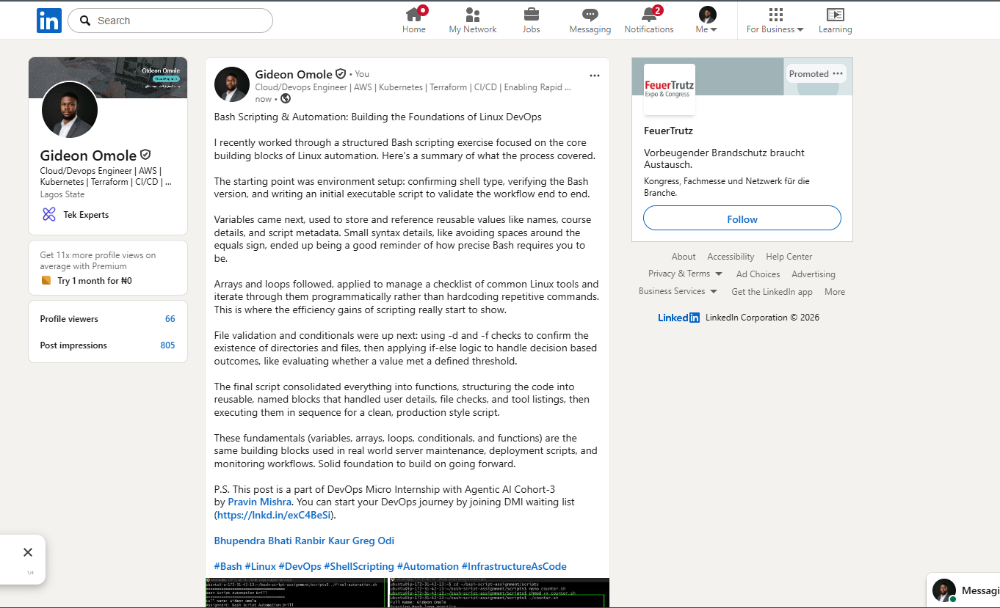

---

# Submission Instructions

- Add all required screenshots in your submission
- Full name must be visible in required screenshots
- All script files must be created and run successfully
- Required notes must be answered clearly for every task
- Do not expose sensitive information (keys, passwords, credentials)

---

# Completion Checklist

- [ ] Task 1: Environment setup verified, workspace created (Screenshots 1–2, Notes answered)
- [ ] Task 2: First script created, executed, permissions verified (Screenshots 1–3, Notes answered)
- [ ] Task 3: Variables script created and run (Screenshots 1–2, Notes answered)
- [ ] Task 4: Arrays and loops script created and run (Screenshots 1–2, Notes answered)
- [ ] Task 5: Counter loop script created and run (Screenshots 1–2, Notes answered)
- [ ] Task 6: File validation script created and run (Screenshots 1–3, Notes answered)
- [ ] Task 7: Pass/Retry conditional script tested with both values (Screenshots 1–4, Notes answered)
- [ ] Task 8: Final automation script created and run (Screenshots 1–3, Notes answered)
- [ ] All scripts run without errors
- [ ] Full Name visible in all required screenshots
- [ ] LinkedIn post published and URL submitted
- [ ] No sensitive data exposed

---

## 📌 About DMI & CloudAdvisory

DevOps Micro Internship (DMI) is a project-based DevOps program run by Pravin Mishra (The CloudAdvisory) focused on real-world execution, systems thinking, and career readiness.

It helps learners build strong DevOps foundations with hands-on experience.

---

## 📌 Resources

- 🌐 DMI Official Website: https://pravinmishra.com/dmi  
- 🎓 DevOps for Beginners (Udemy): https://www.udemy.com/course/devops-for-beginners-docker-k8s-cloud-cicd-4-projects/  
- 🎓 Agentic AI DevOps with Claude Code: https://www.udemy.com/course/ultimate-agentic-ai-devops-with-claude-code/  
- 🎓 DevOps with Claude Code: Terraform, EKS, ArgoCD & Helm: https://www.udemy.com/course/devops-with-claude-code-terraform-eks-argocd-helm/  
- ▶️ YouTube Playlist: https://www.youtube.com/playlist?list=PLFeSNDtI4Cho  
- 🔗 Pravin Mishra (LinkedIn): https://www.linkedin.com/in/pravin-mishra-aws-trainer/  
- 🏢 CloudAdvisory (LinkedIn): https://www.linkedin.com/company/thecloudadvisory/

---

*This submission is part of DevOps Micro Internship (DMI) Cohort 3 — Agentic AI Track.*