# Assignment 5 — Bash Script Automation Drill (OPS Checklist)

Part of the DevOps Micro Internship (DMI) Cohort 3 with Agentic AI

---

## Purpose

In this assignment, you will practice Bash scripting by building a series of small automation scripts covering environment setup, variables, arrays, loops, file conditionals, if-else logic, and functions. These scripts form the foundation of real-world Linux automation used in DevOps, cloud, and production support environments.

---

# Task 1 — Bash Environment & Workspace Setup

## Goal

Verify that Bash is available on your system and create a clean workspace for this assignment.

### Evidence

#### Screenshot 1 — Output of `echo $SHELL` and `bash --version`

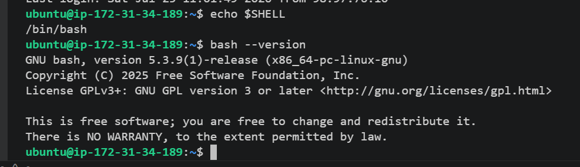

---

#### Screenshot 2 — Output of `pwd` and `ls -lh` showing the scripts directory

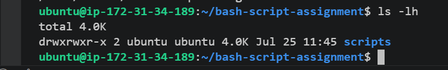

---

### Notes

Answer the following in your own words:

**1. What is Bash?**

Bash (Bourne Again Shell) is a command-line shell and scripting language used mainly on Linux and Unix-based operating systems. It allows users to interact with the operating system by running commands, managing files and directories, automating repetitive tasks through scripts, and administering systems efficiently. In DevOps, Bash is widely used to automate deployments, configure servers, and perform routine maintenance tasks.

---

**2. What is the difference between shell and Bash?**

A shell is a program that provides an interface for users to interact with an operating system by executing commands. Bash (Bourne Again Shell) is one specific type of shell. In other words, a shell is the general category, while Bash is a particular shell that is widely used on Linux and Unix systems. There are other shells as well, such as sh, zsh, ksh, and fish, each with its own features.

---

**3. Why is it important to confirm the Bash version before writing scripts?**

It is important to confirm the Bash version because different versions support different features and syntax. A script that works on a newer version of Bash may fail on an older version if it uses unsupported commands or functionality. Checking the Bash version helps ensure that your script is compatible with the target system and reduces the risk of errors during execution.

---

# Task 2 — Your First Bash Script

## Goal

Create your first Bash script, make it executable, and run it from the terminal.

### Evidence

#### Screenshot 1 — Content of `first-script.sh`

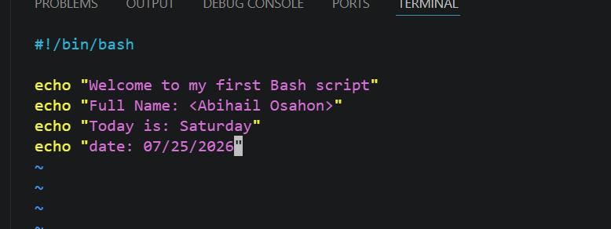

---

#### Screenshot 2 — Output of `./first-script.sh`

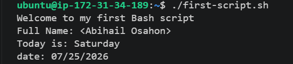

---

#### Screenshot 3 — Output of `ls -l first-script.sh` showing executable permission

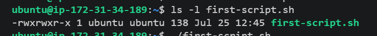

---

### Notes

Answer the following in your own words:

**1. What is the purpose of `#!/bin/bash`?**

#!/bin/bash is also referred to as a shebang. It is placed at the top of a script to tell the operating system to use the Bash interpreter to execute the script. This ensures the script runs with Bash, even if the system's default shell is different, helping to avoid compatibility issues and ensuring that Bash-specific commands and features work as expected.

---

**2. Why do we use `chmod +x` before running a script?**

We use chmod +x to make a script executable by granting it execute permission. Without this permission, the operating system will not allow the script to run directly. Once the execute permission is added, the script can be run using ./script_name.sh instead of having to invoke the interpreter manually.

---

**3. What is the difference between running a script using `./script.sh` and `bash script.sh`?**

./script.sh runs the script as an executable file. The script must have execute permission (using chmod +x), and the operating system uses the shebang (for example, #!/bin/bash) to determine which interpreter should execute the script.

In contrast, bash script.sh runs the script by explicitly invoking the Bash interpreter. The script does not need execute permission because Bash reads and executes the file directly. The shebang is not required in this case, since you have already specified that Bash should interpret the script.

---

# Task 3 — Variables: User Information Script

## Goal

Use variables to store and display user-related information.

### Evidence

#### Screenshot 1 — Content of `user-info.sh`

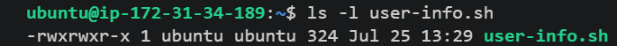

---

#### Screenshot 2 — Output of `./user-info.sh`

---

### Notes

Answer the following in your own words:

**1. What is a variable in Bash?**

A variable in Bash is a named storage location used to hold data, such as text, numbers, or command output. Variables allow you to store values that can be reused throughout a script, making scripts more flexible, readable, and easier to maintain. They are created by assigning a value to a name and can be accessed later using the $ symbol.

---

**2. Why should we avoid spaces around the `=` sign when creating variables?**

We should avoid spaces around the = sign because Bash requires variable assignments to have no spaces. If spaces are added, Bash interprets the statement incorrectly, treating the variable name and value as separate commands or arguments, which results in an error.

---

**3. How do you access the value stored inside a Bash variable?**

You access the value stored inside a Bash variable by placing the $ symbol before the variable name. The $ tells Bash to retrieve the value stored in the variable rather than treating it as plain text.

---

# Task 4 — Arrays & Loops: Tools Checklist Script

## Goal

Use arrays and loops to print a checklist of tools used in Bash scripting.

### Evidence

#### Screenshot 1 — Content of `tools-checklist.sh`

---

#### Screenshot 2 — Output of `./tools-checklist.sh`

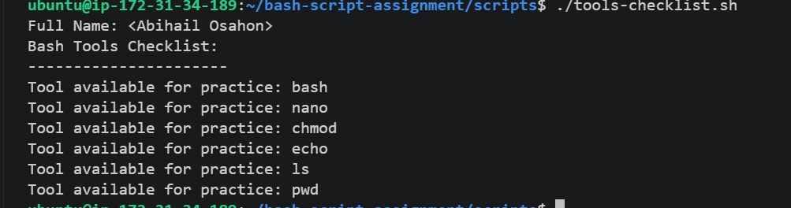

---

### Notes

Answer the following in your own words:

**1. What is an array in Bash?**

An array in Bash is a variable that can store multiple values under a single name. Each value is stored at a specific position, called an index, starting from 0. Arrays make it easier to organize and manage collections of related data, such as a list of names, files, or numbers, within a Bash script.

---

**2. Why are arrays useful in scripts?**

Arrays are useful in scripts because they allow you to store and manage multiple related values in a single variable. This makes scripts more organized, reduces the need for multiple individual variables, and makes it easier to loop through, access, and process groups of data efficiently.

---

**3. What does `"${tools[@]}"` mean?**

"${tools[@]}" is used to access all the elements of the tools array in Bash. The @ symbol represents every element in the array, and the double quotes ensure that each element is treated as a separate value, even if it contains spaces. This syntax is commonly used when looping through or displaying all the items stored in an array.

---

**4. What is the purpose of the `for` loop in this script?**

The purpose of the for loop is to iterate through each element in the array and execute a set of commands for every item. Instead of writing the same code multiple times, the loop automatically processes each value one by one, making the script more efficient, readable, and easier to maintain.

---

# Task 5 — Loops: Number Counter Script

## Goal

Use loops to repeat a task multiple times.

### Evidence

#### Screenshot 1 — Content of `counter.sh`

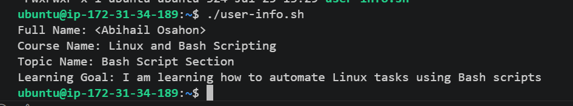

---

#### Screenshot 2 — Output of `./counter.sh`

---

### Notes

Answer the following in your own words:

**1. What is a loop?**

A loop is a programming construct that repeatedly executes a block of code until a specified condition is met or until all items in a collection have been processed. In Bash, loops are used to automate repetitive tasks, making scripts shorter, more efficient, and easier to maintain.

---

**2. Why do we use loops in Bash scripting?**

We use loops in Bash scripting to automate repetitive tasks by executing the same block of code multiple times. Loops reduce the need to write duplicate code, make scripts more efficient and easier to maintain, and allow us to process multiple files, variables, or commands with minimal effort.

---

**3. How many times did the loop run in your script?**

The loop ran five times because it executed once for each step, printing "Step 1 completed" through "Step 5 completed." After completing the fifth iteration, the script displayed "Loop completed successfully."

---

**4. What would you change if you wanted the loop to run 10 times?**

To make the loop run 10 times, I would change the loop's range or condition to iterate from 1 to 10 instead of 1 to 5. e.g for i in {1..5} I would change it to: for i in {1..10}. This would make the loop execute 10 times, displaying "Step 1 completed" through "Step 10 completed."

---

# Task 6 — Files & Conditionals: File Validation Script

## Goal

Use file checks and conditionals to verify whether files and directories exist.

### Evidence

#### Screenshot 1 — Output of `ls -lah ../test-folder`

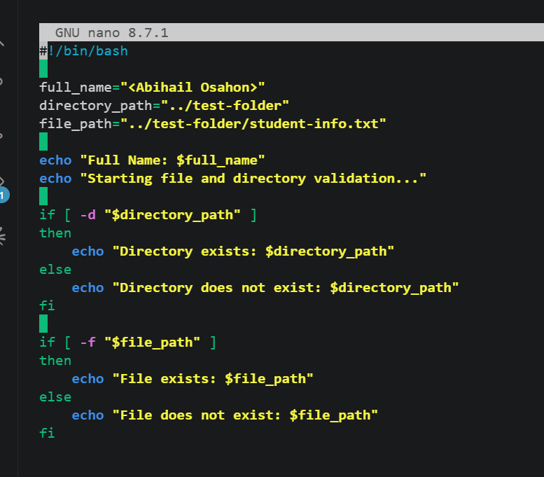

---

#### Screenshot 2 — Content of `file-check.sh`

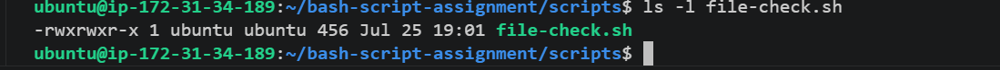

---

#### Screenshot 3 — Output of `./file-check.sh`

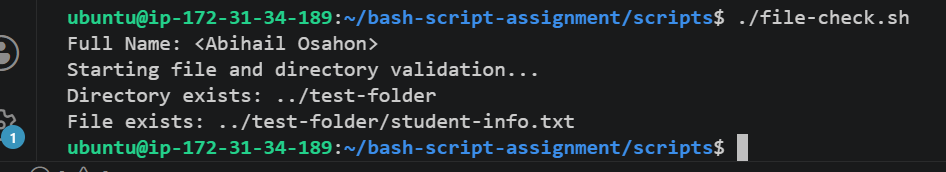

---

### Notes

Answer the following in your own words:

**1. What does `-d` check in Bash?**

The -d test operator in Bash checks whether a specified path exists and is a directory. It is commonly used in conditional statements to verify that a directory exists before performing operations on it, helping to prevent errors in scripts.

---

**2. What does `-f` check in Bash?**

The -f test operator in Bash checks whether a specified path exists and is a regular file. It is commonly used in conditional statements to verify that a file exists before reading, modifying, or executing it, helping to avoid errors in a script.

---

**3. Why should file and directory paths be stored in variables?**

File and directory paths should be stored in variables because it makes Bash scripts easier to read, maintain, and update. If a path changes, you only need to update the variable instead of modifying every occurrence in the script. Using variables also reduces duplication and minimizes the risk of errors.

---

**4. What happens if the file does not exist?**

If the file does not exist, the -f condition evaluates to false, and the script executes the alternative branch (such as the else block, if one is provided). This allows the script to display a message, skip the operation, or take another appropriate action instead of failing with an error.

---

# Task 7 — Conditionals: Pass or Retry Script

## Goal

Use if-else conditionals to make decisions based on a variable value.

### Evidence

#### Screenshot 1 — Content of `score-check.sh` with `score=85`

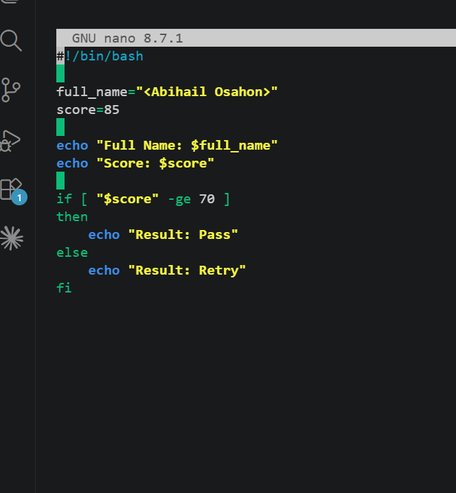

---

#### Screenshot 2 — Output showing `Result: Pass`

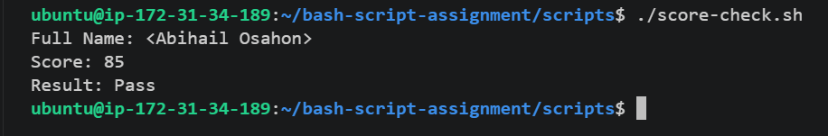

---

#### Screenshot 3 — Content of `score-check.sh` with `score=55`

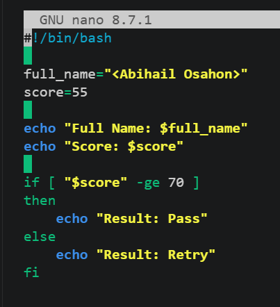

---

#### Screenshot 4 — Output showing `Result: Retry`

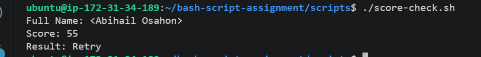

---

### Notes

Answer the following in your own words:

**1. What is the purpose of if-else in Bash?**

The if-else statement in Bash is used to make decisions based on a condition. It checks whether a condition is true or false and executes one block of code if the condition is true, or a different block of code if the condition is false. This allows scripts to respond differently depending on the situation, making them more flexible and efficient.

---

**2. What does `-ge` mean?**

The -ge operator in Bash means "greater than or equal to." It is used to compare two integer values in conditional statements. If the first number is greater than or equal to the second number, the condition evaluates to true; otherwise, it evaluates to false.

---

**3. Why should conditions be tested with different values?**

Conditions should be tested with different values to ensure that the script behaves correctly in all possible scenarios. Testing different inputs helps verify that both the true and false conditions work as expected, identifies potential errors, and improves the reliability of the script before it is used in a production environment.

---

**4. How can conditionals help in automation scripts?**

Conditionals help in automation scripts by allowing the script to make decisions based on specific conditions. They enable the script to perform different actions depending on the situation, such as checking whether a file exists, verifying if a service is running, or handling errors automatically. This makes automation scripts more intelligent, flexible, and reliable.

---

# Task 8 — Functions: Final Bash Automation Script

## Goal

Create a final Bash script using functions to organize reusable code.

### Evidence

#### Screenshot 1 — Content of `final-automation.sh`

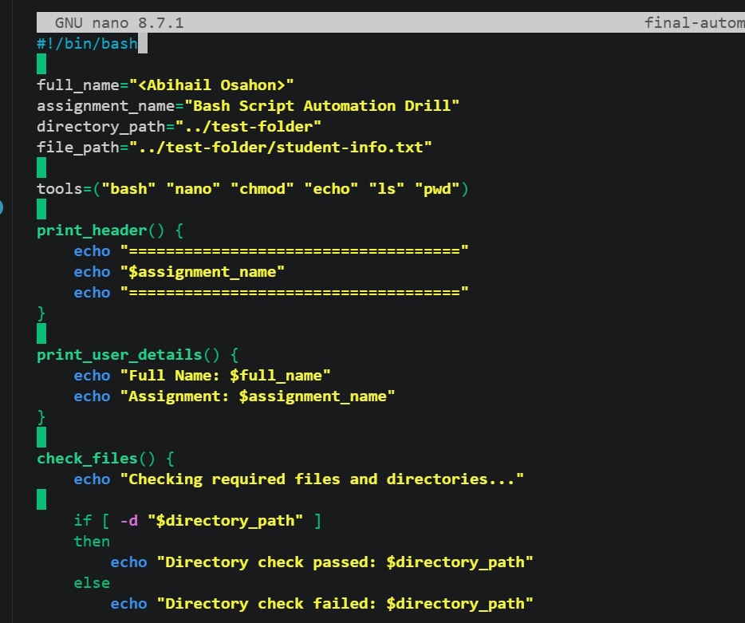

---

#### Screenshot 2 — Output of `./final-automation.sh`

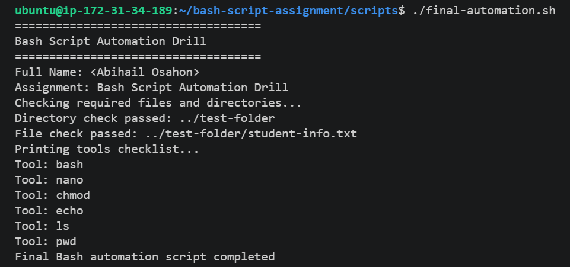

---

#### Screenshot 3 — Output of `ls -lah` showing all created scripts

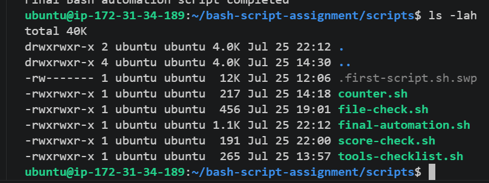

---

### Notes

Answer the following in your own words:

**1. What is a function in Bash?**

A function in Bash is a reusable block of code that performs a specific task. Instead of writing the same commands multiple times, you can define them once inside a function and call the function whenever needed. This makes scripts more organized, easier to maintain, and reduces code duplication.

---

**2. Why are functions useful in scripts?**

Functions are useful in scripts because they allow you to reuse the same block of code whenever it is needed, instead of writing it multiple times. This makes scripts more organized, easier to read, easier to maintain, and reduces the chances of errors by keeping repeated code in one place.

---

**3. Which functions did you create in this script?**

I created four functions in my script: print_header(), print_user_details(), check_files(), and print_tools(). These functions display the assignment header, print my details, check whether the required directory and file exist, and list the tools stored in the array. Using functions helped organize the script into reusable sections, making it easier to read and maintain.

---

**4. How does this final script combine variables, arrays, loops, conditionals, files, and functions?**

The final script combines several Bash concepts to perform an organized automation task. It uses variables to store my name, assignment name, and file and directory paths. It uses an array to store a list of Bash tools and a for loop to display each tool. Conditionals (if statements) check whether the required directory and file exist before displaying the appropriate message. The script works with files and directories by verifying their existence using the stored paths. Finally, it uses functions to separate tasks such as printing the header, displaying user details, checking files, and listing tools, making the script more organized, reusable, and easier to maintain.

---

# LinkedIn Post (Required)

## Evidence

#### LinkedIn Post URL

https://www.linkedin.com/posts/abihail-osahon-096564232_devops-linux-bash-ugcPost-7486951400334311424-69BG/?utm_source=share&utm_medium=member_desktop&rcm=ACoAADoaXXIBPrMQ_TL1SPeACNDTKQQWRcfVxDU

`__________________________`

---

#### Screenshot — Published LinkedIn post

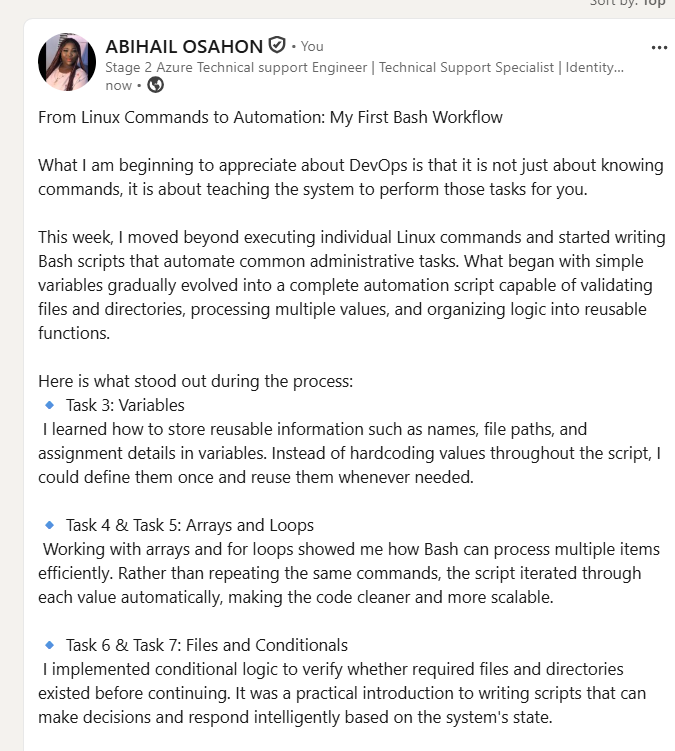
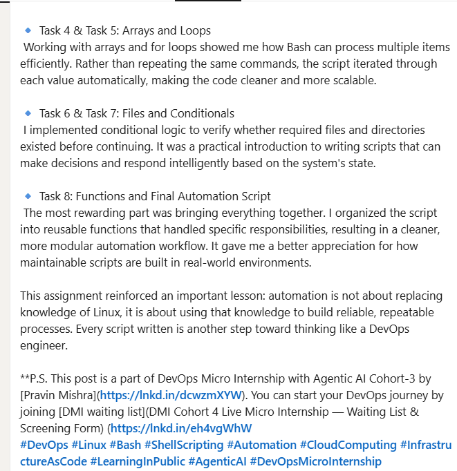

---

# Submission Instructions

- Add all required screenshots in your submission
- Full name must be visible in required screenshots
- All script files must be created and run successfully
- Required notes must be answered clearly for every task
- Do not expose sensitive information (keys, passwords, credentials)

---

# Completion Checklist

- [ ] Task 1: Environment setup verified, workspace created (Screenshots 1–2, Notes answered)
- [ ] Task 2: First script created, executed, permissions verified (Screenshots 1–3, Notes answered)
- [ ] Task 3: Variables script created and run (Screenshots 1–2, Notes answered)
- [ ] Task 4: Arrays and loops script created and run (Screenshots 1–2, Notes answered)
- [ ] Task 5: Counter loop script created and run (Screenshots 1–2, Notes answered)
- [ ] Task 6: File validation script created and run (Screenshots 1–3, Notes answered)
- [ ] Task 7: Pass/Retry conditional script tested with both values (Screenshots 1–4, Notes answered)
- [ ] Task 8: Final automation script created and run (Screenshots 1–3, Notes answered)
- [ ] All scripts run without errors
- [ ] Full Name visible in all required screenshots
- [ ] LinkedIn post published and URL submitted
- [ ] No sensitive data exposed

---

## 📌 About DMI & CloudAdvisory

DevOps Micro Internship (DMI) is a project-based DevOps program run by Pravin Mishra (The CloudAdvisory) focused on real-world execution, systems thinking, and career readiness.

It helps learners build strong DevOps foundations with hands-on experience.

---

## 📌 Resources

- 🌐 DMI Official Website: https://pravinmishra.com/dmi  
- 🎓 DevOps for Beginners (Udemy): https://www.udemy.com/course/devops-for-beginners-docker-k8s-cloud-cicd-4-projects/  
- 🎓 Agentic AI DevOps with Claude Code: https://www.udemy.com/course/ultimate-agentic-ai-devops-with-claude-code/  
- 🎓 DevOps with Claude Code: Terraform, EKS, ArgoCD & Helm: https://www.udemy.com/course/devops-with-claude-code-terraform-eks-argocd-helm/  
- ▶️ YouTube Playlist: https://www.youtube.com/playlist?list=PLFeSNDtI4Cho  
- 🔗 Pravin Mishra (LinkedIn): https://www.linkedin.com/in/pravin-mishra-aws-trainer/  
- 🏢 CloudAdvisory (LinkedIn): https://www.linkedin.com/company/thecloudadvisory/

---

*This submission is part of DevOps Micro Internship (DMI) Cohort 3 — Agentic AI Track.*