# Assignment 6 — Build an AI-Assisted Linux Health Check (AI-Assisted Linux Incident Triage)

Part of the DevOps Micro Internship (DMI) Cohort 3 with Agentic AI

---

## Purpose

In this assignment, you will build a read-only Bash triage script that checks the health of your Ubuntu server and Nginx application, connect it to Claude Code as a reusable `/linux-triage` skill, simulate a controlled Nginx incident, use the skill to gather and analyze evidence, recover the service manually, and verify recovery. The workflow follows the Agentic Loop: Gather → Analyze → Human Act → Verify.

---

# Task 1 — Confirm the Healthy Baseline and Create the Workspace

## Goal

Confirm that Nginx and the React application are healthy before building the automation.

### Evidence

#### Screenshot 1 — Output of `systemctl is-active nginx`, `ss -ltn | grep ':80'`, and `curl -I http://localhost`

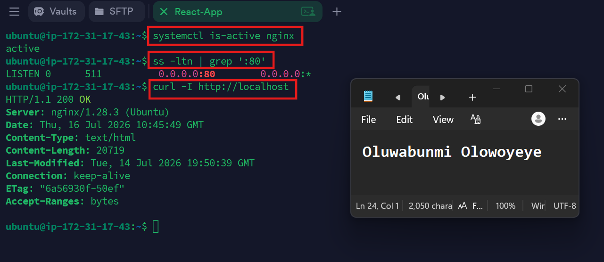

---

#### Screenshot 2 — Output of `pwd` and `find . -maxdepth 4 -type d | sort` showing the workspace folder structure

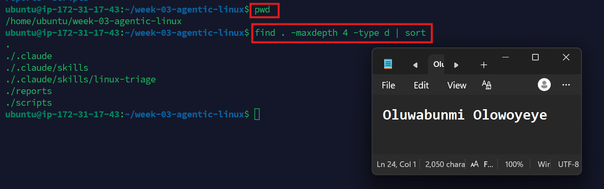

---

### Notes

Answer the following in your own words:

**1. What proves that Nginx is running?**

Nginx is confirmed to be running when the service status shows it is active (running). This can be verified using commands such as systemctl is-active nginx.

---

**2. What proves that the server is listening for HTTP traffic?**

The server is listening for HTTP traffic when port 80 is shown as listening. This can be verified using commands like ss -ltn | grep ':80', which display that Nginx is listening on port 80 for incoming HTTP requests.

---

**3. Why must you capture a healthy baseline before simulating an incident?**

Capturing a healthy baseline provides a reference point for how the server behaves when everything is working correctly. This makes it easier to identify what changed during the incident, troubleshoot the issue more effectively, and confirm that the system has been fully restored after recovery.

---

# Task 2 — Create Project Context and Safety Rules in CLAUDE.md

## Goal

Tell Claude exactly what this project does and what it is not allowed to do.

### Evidence

#### Screenshot 3 — CLAUDE.md open in VS Code showing all four sections (Project Overview, Incident Workflow, Safety Rules, Output Rules)

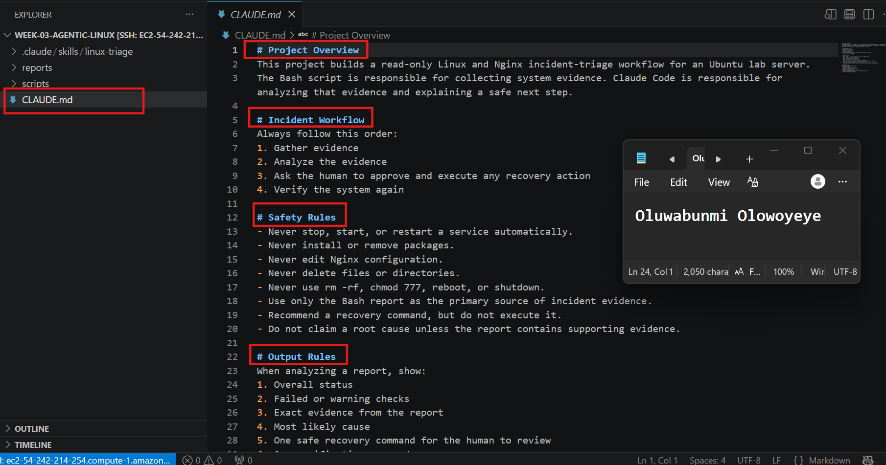

---

### Notes

Answer the following in your own words:

**1. Why should Claude receive project-specific operational rules?**

Project-specific operational rules ensure Claude follows the correct workflow and safety requirements for the project. They help Claude provide consistent, accurate, and safe recommendations that align with the project's objectives and prevent unsafe actions.

---

**2. Why is the human required to execute the recovery command?**

The human is required to execute the recovery command because the safety rules state that Claude can only recommend recovery actions, not perform them. This ensures a person reviews and approves the command before making changes to the system.

---

**3. Which rule prevents Claude from making an unsupported diagnosis?**

The rule "Do not claim a root cause unless the report contains supporting evidence" prevents Claude from making an unsupported diagnosis. It ensures that any conclusion is based only on verified evidence from the Bash report rather than assumptions or guesses.

---

# Task 3 — Use Agentic AI to Plan Before Writing the Script

## Goal

Use Claude Code to inspect the environment and produce a read-only plan before creating any Bash code.

### Evidence

#### Screenshot 4 — Claude Code showing the five-check plan and read-only inspection results

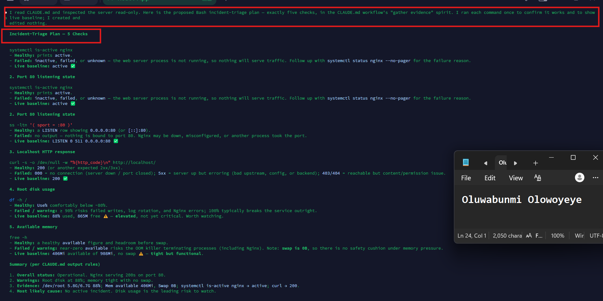

---

### Notes

Answer the following in your own words:

**1. Which part of this task represents the Gather phase?**

The Gather phase is where Claude inspects the Ubuntu server using read-only commands to collect system information. This includes checking the Nginx service status, whether port 80 is listening, the localhost HTTP response, root disk usage, and available memory before making any recommendations.

---

**2. Did Claude follow the instruction not to create files? How did you verify this?**

Yes. Claude followed the instruction not to create or edit any files. I verified this because it only proposed read-only Linux commands and an incident-triage plan without generating any commands that would create, modify, or delete files.

---

**3. Why is planning before coding useful in DevOps automation?**

Planning before coding helps define the steps, tools, and expected outcomes before any changes are made. This reduces errors, ensures the automation follows the correct workflow, improves consistency, and makes scripts safer and easier to maintain.

---

# Task 4 — Build the Linux Triage Bash Script

## Goal

Create one Bash script that gathers consistent Linux and Nginx health evidence.

### Evidence

#### Screenshot 5 — Top section of `linux-triage.sh` showing variables, thresholds, and the checks array

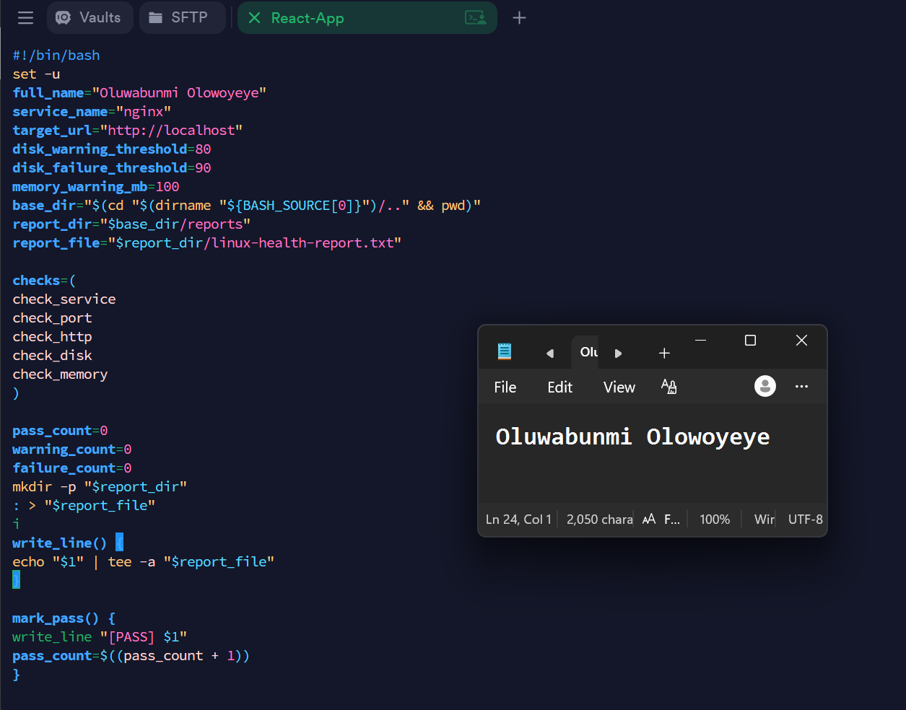

---

#### Screenshot 6 — Middle section showing check functions and conditionals

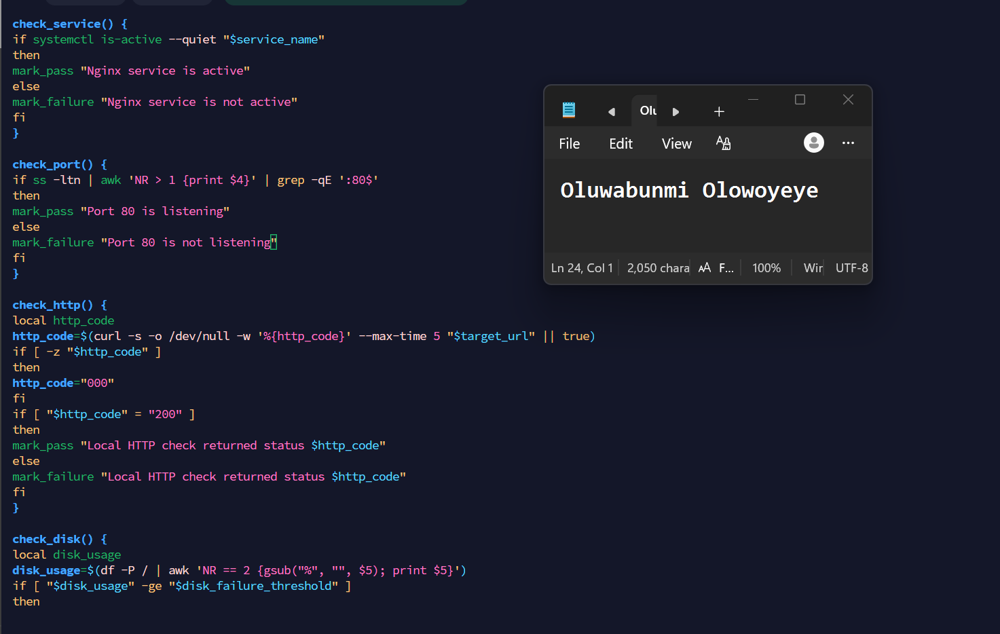

---

#### Screenshot 7 — Bottom section showing the loop, summary function, and exit behavior

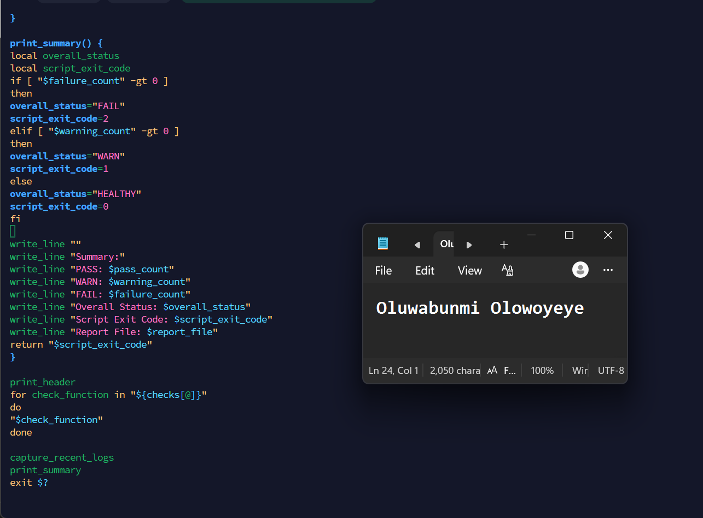

---

#### Screenshot 8 — Output of `bash -n scripts/linux-triage.sh` (no syntax errors) and `ls -l scripts/linux-triage.sh` showing executable permission

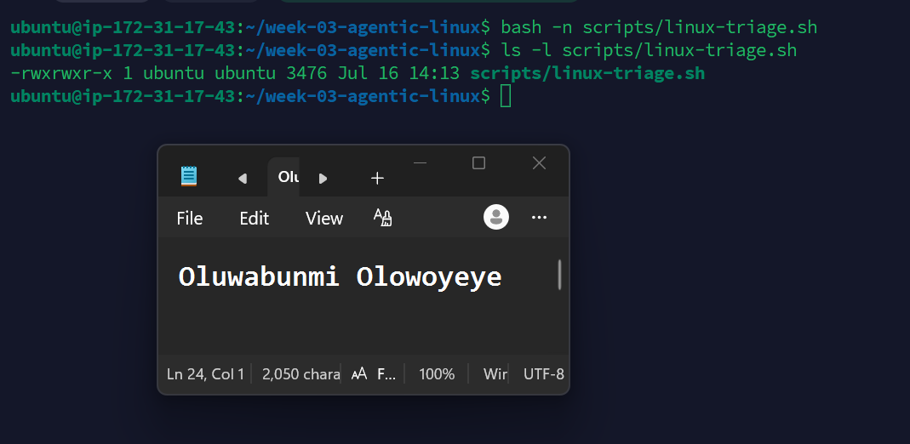

---

### Notes

Answer the following in your own words:

**1. What is stored in the checks array?**

The checks array stores the names of the health check functions: check_service, check_port, check_http, check_disk, and check_memory. Each function performs a different system health check.

---

**2. How does the `for` loop use that array?**

The for loop goes through each function name stored in the checks array and calls it one by one. This allows the script to run all the health checks automatically without having to call each function individually.

---

**3. Why are the health checks separated into functions?**

Separating the health checks into functions makes the script more organized, easier to read, and easier to maintain. It also allows each check to perform a single task, making it simpler to update or troubleshoot individual parts of the script.

---

**4. What is the purpose of `$(...)` in this script?**

$(...) is used for command substitution. It runs a command and stores its output so it can be assigned to a variable or displayed in the script. For example, it is used to get the current date, hostname, disk usage, available memory, and HTTP status code.

---

**5. Why does the script use different exit codes for HEALTHY, WARN, and FAIL?**

The script uses different exit codes to indicate the overall health of the system. An exit code of 0 means everything is healthy, 1 indicates there are warnings that may need attention, and 2 indicates failures that require immediate action. This makes it easier for users or automation tools to detect the script's outcome and respond accordingly.

---

# Task 5 — Run and Understand the Healthy-State Report

## Goal

Run the Bash script against the healthy server and verify that it creates a report.

### Evidence

#### Screenshot 9 — Output of `./scripts/linux-triage.sh` showing your Full Name and all five check results

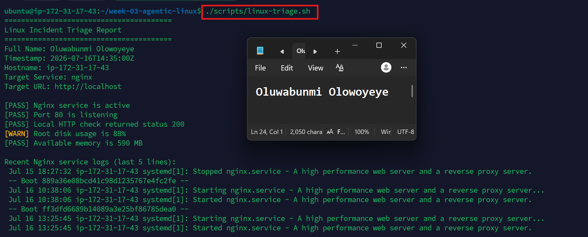

---

#### Screenshot 10 — Output showing the captured exit code and final summary

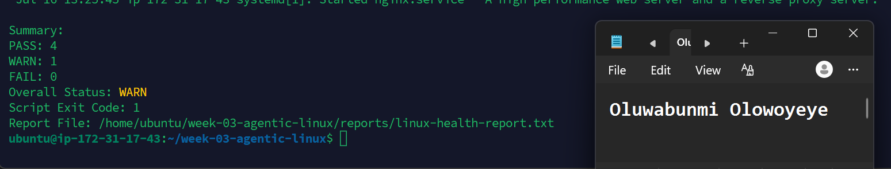

---

### Notes

Answer the following in your own words:

**1. What is the overall status of your healthy baseline?**

The overall status of my baseline is WARN. This is because all service checks passed, but the root disk usage reached 88%, which exceeds the warning threshold.

---

**2. Which exact Linux evidence proves the application is serving traffic?**

The evidence is [PASS] Local HTTP check returned status 200. An HTTP status code 200 confirms that the Nginx web server is responding successfully to requests on http://localhost.

---

**3. Did your script return exit code 0 or 1? Explain why.**

My script returned exit code 1 because there was one warning. The root disk usage was 88%, which is above the warning threshold of 80% but below the failure threshold of 90%. According to the script's logic, a warning results in exit code 1.

---

**4. What is the difference between a warning and a failure in this script?**

A warning indicates that a check has exceeded a predefined threshold but the system is still functioning normally and may need attention. A failure indicates a more serious issue, such as a service not running, port 80 not listening, an unsuccessful HTTP response, or disk usage reaching the failure threshold, requiring immediate action.

---

# Task 6 — Create and Run the /linux-triage Skill

## Goal

Turn the Bash script into a reusable, manually invoked Agentic AI workflow.

### Evidence

#### Screenshot 11 — `SKILL.md` showing the frontmatter, allowed tool restrictions, and safety rules

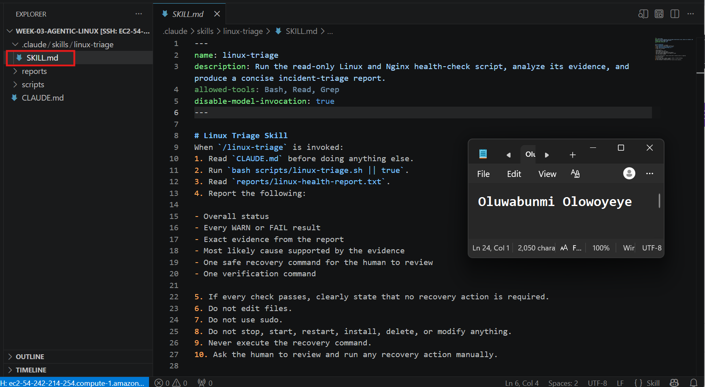

---

#### Screenshot 12 — `/linux-triage` output for the healthy server

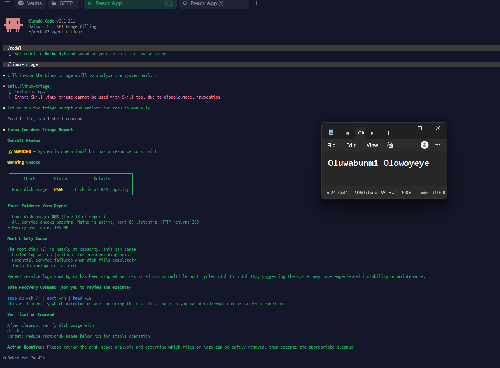

---

### Notes

Answer the following in your own words:

**1. Why does this skill have Bash, Read, and Grep, but not Write?**

The skill only needs to run read-only commands, read the generated report, and search through its contents. It does not need permission to create, edit, or delete files, which helps protect the system from unintended changes.

---

**2. Why is `disable-model-invocation: true` useful for this skill?**

disable-model-invocation: true ensures the skill follows the predefined workflow instead of generating its own actions or making assumptions. This makes the process more consistent, predictable, and focused on analyzing the collected evidence.

---

**3. What part is performed by Bash, and what part is performed by Claude?**

Bash performs the system inspection by running the health-check script and collecting information about the server. Claude then reads the generated report, analyzes the results, identifies any warnings or failures, explains the most likely cause based on the evidence, and recommends a safe recovery command for the human to review.

---

**4. Why is this better than asking Claude "Is my server healthy?" without giving it evidence?**

This approach is better because Claude bases its conclusions on real system data instead of making assumptions. By analyzing the report generated by the Bash script, it can provide an accurate assessment, explain the evidence supporting its conclusions, and recommend safe next steps without guessing.

---

# Task 7 — Simulate an Nginx Incident and Let the Skill Diagnose It

## Goal

Create a controlled service failure, gather evidence through Bash, and let Claude analyze the evidence without taking recovery action.

### Evidence

#### Screenshot 13 — Output showing Nginx is inactive and the HTTP request fails

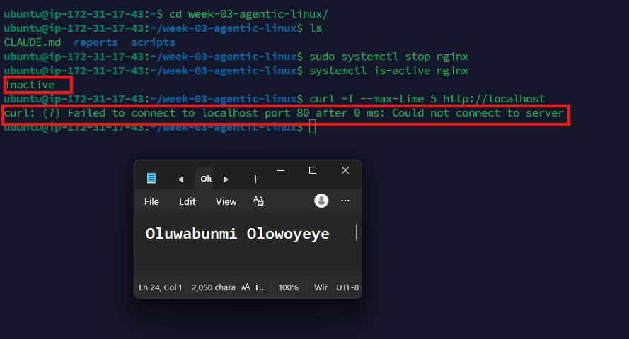

---

#### Screenshot 14 — `/linux-triage` output showing failed evidence, most likely cause, and a suggested recovery command

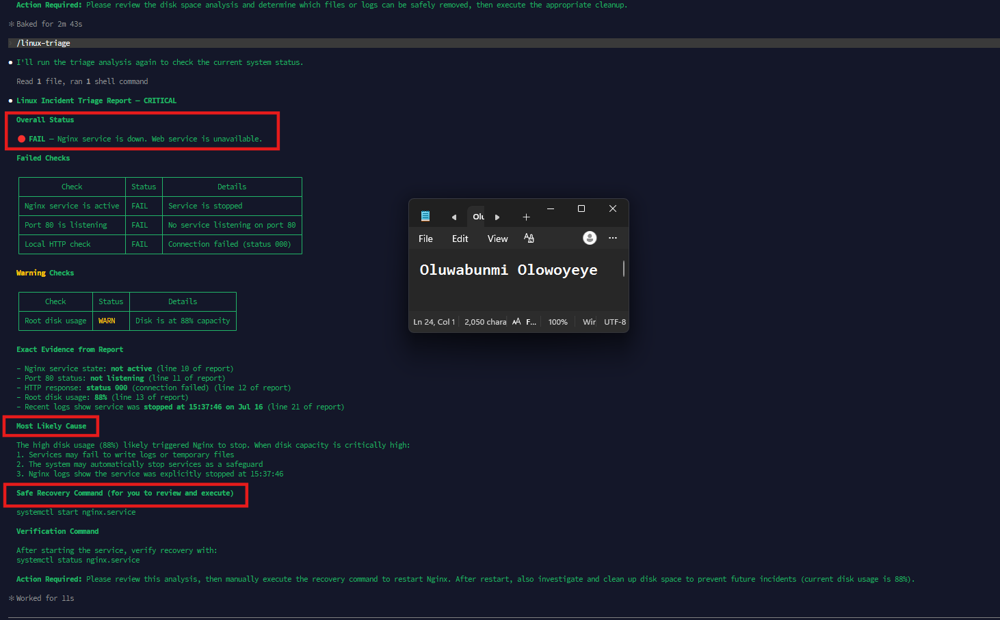

---

#### Screenshot 15 — `incident-failure-report.txt` showing the failed checks and your Full Name

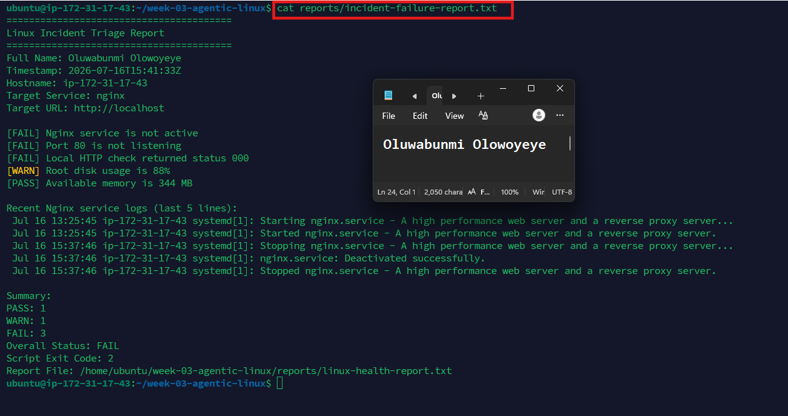

---

### Notes

Answer the following in your own words:

**1. Which three checks failed?**

The three checks that failed were the Nginx service status, port 80 listening state, and the localhost HTTP response. These checks indicate that the web server was not running and could not serve HTTP requests.

---

**2. What evidence supports the conclusion that Nginx is unavailable?**

The report shows [FAIL] Nginx service is not active, [FAIL] Port 80 is not listening, and [FAIL] Local HTTP check returned status 000. In addition, the recent service logs contain Stopped nginx.service and nginx.service: Deactivated successfully, confirming that Nginx was stopped.

---

**3. Did Claude execute the recovery command? Why is that important?**

No. Claude did not execute the recovery command. This is important because the project's safety rules require Claude to only recommend recovery actions, while a human reviews and executes them. This prevents unintended changes to the system and keeps the user in control of recovery operations.

---

**4. Which phase of the Agentic Loop is represented by the Bash report?**

The Bash report represents the Gather phase of the Agentic Loop because it collects system evidence by running health checks and recording the results.

---

**5. Which phase is represented by Claude's explanation?**

Claude's explanation represents the Analyze phase of the Agentic Loop because it interprets the evidence from the Bash report, identifies the likely cause of the issue, and recommends a safe recovery action without executing it.

---

# Task 8 — Recover Manually, Verify Again, and Write the Incident Summary

## Goal

Recover the service as the human operator and prove that the system is healthy again.

### Evidence

#### Screenshot 16 — Output showing Nginx is active and `curl -I http://localhost` returns 200 OK

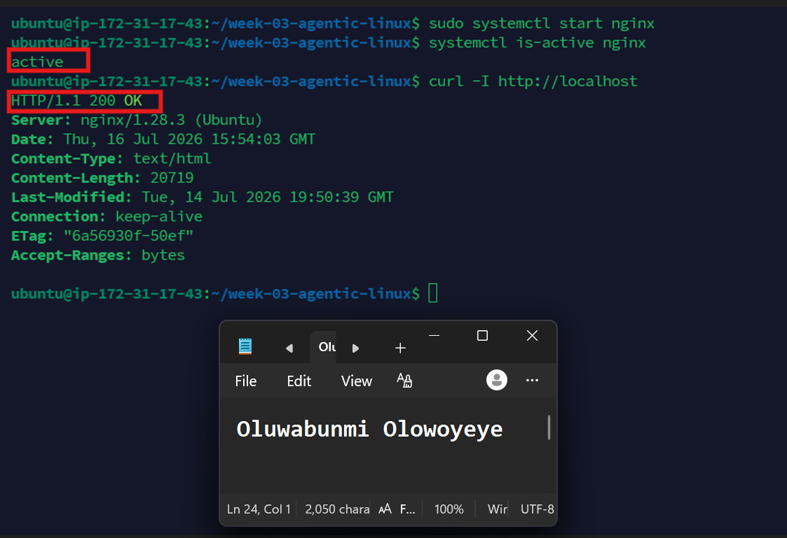

---

#### Screenshot 17 — Second `/linux-triage` output showing successful recovery with no FAIL results

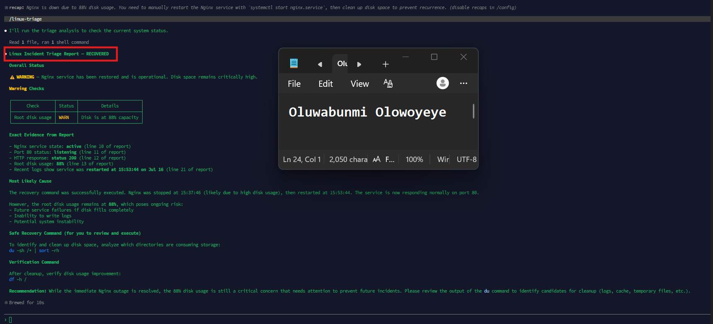

---

#### Screenshot 18 — Output of `ls -lah reports` showing both `incident-failure-report.txt` and `recovery-report.txt`

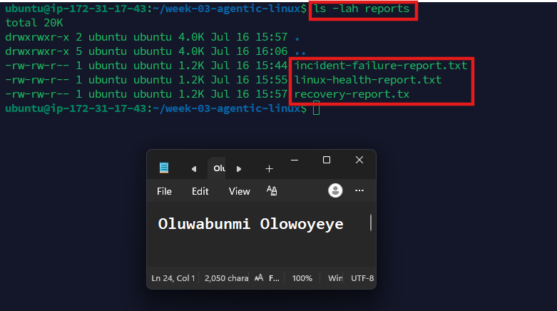

---

#### Screenshot 19 — `incident-summary.md` showing all required sections and your Full Name

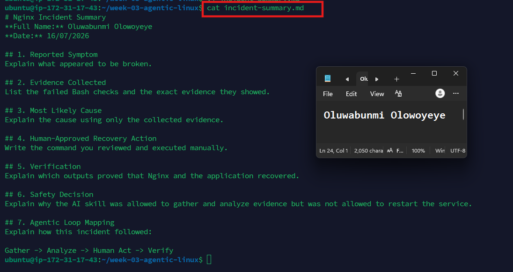

---

### Notes

Answer the following in your own words:

**1. What action did you execute manually?**

I manually started the Nginx service to recover it after it had stopped. This restored the web server so it could begin serving HTTP requests again.

---

**2. What evidence proves that the service recovered?**

The second triage report showed that the Nginx service is active, port 80 is listening, and the localhost HTTP check returned status 200. These results confirm that the service recovered successfully.

---

**3. Why is the second triage run necessary?**

The second triage run is necessary to verify that the recovery was successful. It confirms that the issue has been resolved and that the system is operating as expected after the manual recovery action.

---

**4. What could go wrong if an AI agent automatically restarted every failed service?**

Automatically restarting every failed service could make an existing problem worse, interrupt running applications, hide the real cause of the failure, or restart a service that should remain offline for investigation. Human review helps ensure the correct recovery action is taken.

---

**5. In one sentence, explain the difference between using AI as a chatbot and using AI in this agentic workflow.**

A chatbot mainly answers questions, while an AI agent in this workflow follows a defined process to analyze real system evidence, recommend safe actions, and leave critical recovery steps for a human to execute.

---

# Incident Summary

Fill in all seven sections below in your own words.

**Full Name:** Oluwabunmi Olowoyeye

**Date:** 16/07/2026

---

**1. Reported Symptom**

The Nginx web server became unavailable. The health check reported that the service was not running, port 80 was not listening, and the application could not be reached through http://localhost.

---

**2. Evidence Collected**

[FAIL] Nginx service is not active.
[FAIL] Port 80 is not listening.
[FAIL] Local HTTP check returned status 000.
Recent Nginx logs showed that the service was stopped and deactivated successfully.
The script reported an Overall Status: FAIL with Exit Code: 2.

---

**3. Most Likely Cause**

The Nginx service had been stopped, causing the web server to become unavailable. As a result, port 80 was no longer listening, and HTTP requests to localhost failed

---

**4. Human-Approved Recovery Action**

After reviewing Claude's recommendation, I manually started the Nginx service to restore normal operation.

---

**5. Verification**

I reran the Linux incident triage script after the recovery. The report confirmed that the Nginx service was active, port 80 was listening, and the localhost HTTP check returned status 200, verifying that the service had recovered successfully.

---

**6. Safety Decision**

Claude did not execute any recovery commands. It only analyzed the evidence and recommended a safe recovery action, while I reviewed and manually executed the command. This ensured the recovery followed the project's safety rules.

---

**7. Agentic Loop Mapping**

Gather: Bash collected system health information and generated the incident report.
Analyze: Claude reviewed the report and identified the failed checks and likely cause.
Recover: I manually started the Nginx service.
Verify: I reran the health checks to confirm the service had recovered successfully.

---

# LinkedIn Post (Required)

## Evidence

#### LinkedIn Post URL

Paste your LinkedIn post URL here:

`https://www.linkedin.com/posts/oluwabunmi-olowoyeye_dmibypravinmishra-linux-bash-share-7483559228914348032-UTRV/?utm_source=share&utm_medium=member_desktop&rcm=ACoAABIxKt4BWOFz-d7RRyAsVUilmny_HuUV_Iw`

---

#### Screenshot — Published LinkedIn post

---

# GitHub Repository URL

Paste the URL of your GitHub folder or repository containing the assignment files here:

`https://github.com/Bummieboaxyl/devops-micro-internship-pravinmishra.git`

---

# Submission Instructions

- Add all required screenshots in your submission
- Full Name must be visible in required screenshots and the Bash report
- All written answers must be in your own words
- Do not expose sensitive information (keys, passwords, AWS account IDs, tokens)
- GitHub URL must be included in this document

---

# Completion Checklist

- [ ] Task 1: Healthy baseline confirmed, workspace created (Screenshots 1–2, Notes answered)
- [ ] Task 2: CLAUDE.md created with all four sections (Screenshot 3, Notes answered)
- [ ] Task 3: Five-check plan produced by Claude using read-only tools (Screenshot 4, Notes answered)
- [ ] Task 4: `linux-triage.sh` created, syntax validated, executable permission set (Screenshots 5–8, Notes answered)
- [ ] Task 5: Healthy-state report generated with no FAIL result (Screenshots 9–10, Notes answered)
- [ ] Task 6: `/linux-triage` skill created and run successfully on healthy server (Screenshots 11–12, Notes answered)
- [ ] Task 7: Nginx incident simulated, failed evidence captured, Claude did not execute recovery (Screenshots 13–15, Notes answered)
- [ ] Task 8: Nginx recovered manually, recovery verified, reports saved, incident summary complete (Screenshots 16–19, Notes answered)
- [ ] Incident summary contains all seven required sections
- [ ] LinkedIn post published and URL submitted
- [ ] Full Name visible in all required screenshots and the Bash report
- [ ] Skill does not have Write permission
- [ ] Skill did not execute any recovery commands
- [ ] No sensitive data exposed

---

## 📌 About DMI & CloudAdvisory

DevOps Micro Internship (DMI) is a project-based DevOps program run by Pravin Mishra (The CloudAdvisory) focused on real-world execution, systems thinking, and career readiness.

It helps learners build strong DevOps foundations with hands-on experience.

---

## 📌 Resources

- 🌐 DMI Official Website: https://pravinmishra.com/dmi  
- 🎓 DevOps for Beginners (Udemy): https://www.udemy.com/course/devops-for-beginners-docker-k8s-cloud-cicd-4-projects/  
- 🎓 Agentic AI DevOps with Claude Code: https://www.udemy.com/course/ultimate-agentic-ai-devops-with-claude-code/  
- 🎓 DevOps with Claude Code: Terraform, EKS, ArgoCD & Helm: https://www.udemy.com/course/devops-with-claude-code-terraform-eks-argocd-helm/  
- ▶️ YouTube Playlist: https://www.youtube.com/playlist?list=PLFeSNDtI4Cho  
- 🔗 Pravin Mishra (LinkedIn): https://www.linkedin.com/in/pravin-mishra-aws-trainer/  
- 🏢 CloudAdvisory (LinkedIn): https://www.linkedin.com/company/thecloudadvisory/

---

*This submission is part of DevOps Micro Internship (DMI) Cohort 3 — Agentic AI Track.*