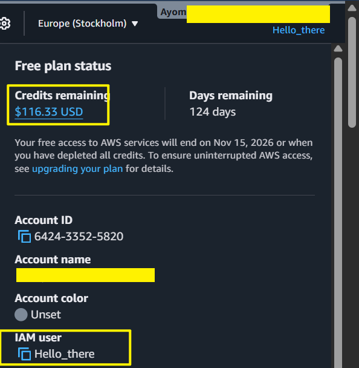
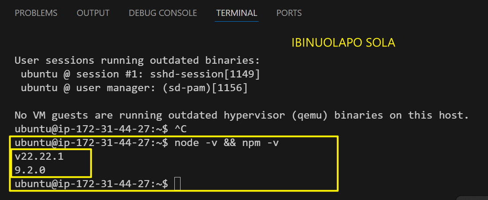
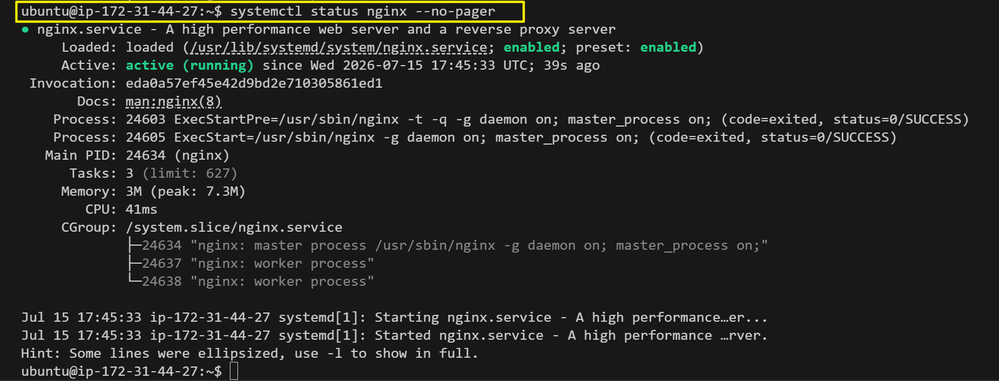
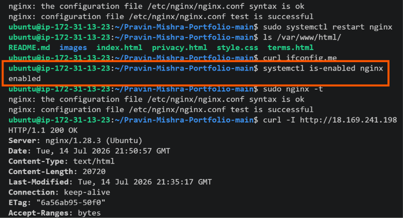
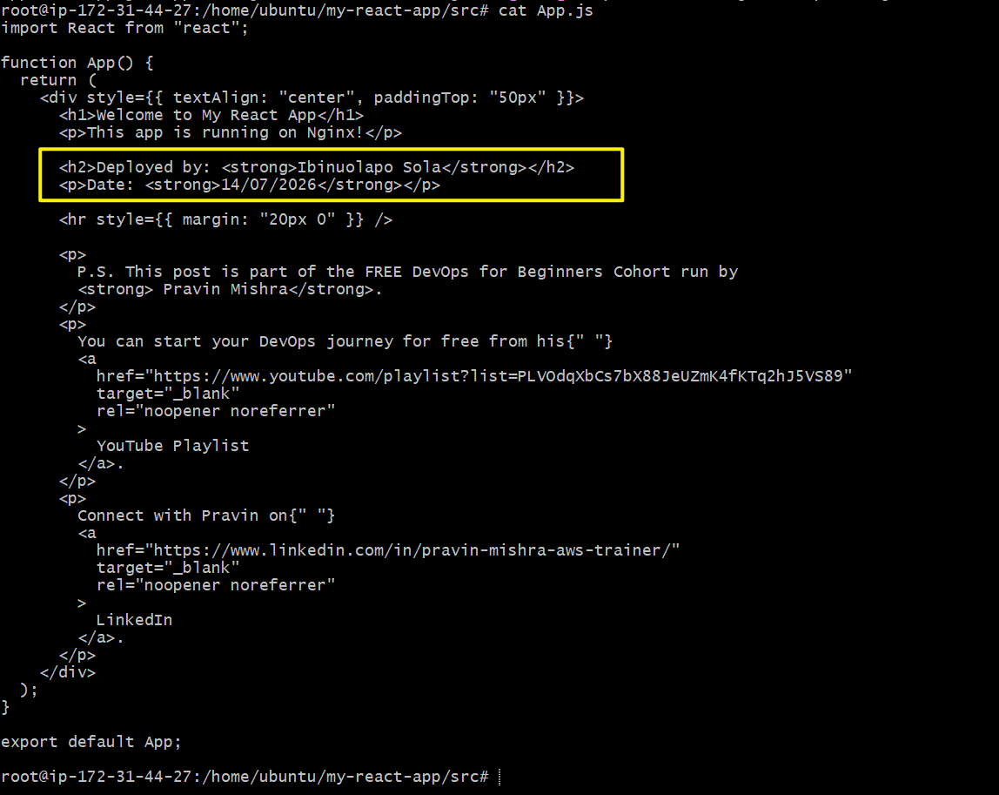
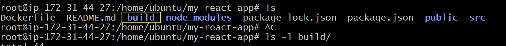
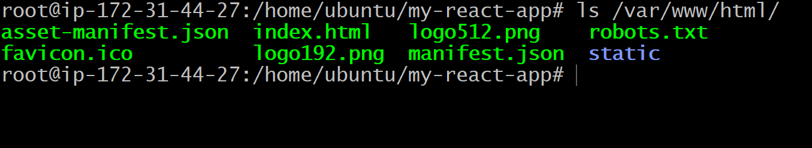

# Assignment 6 — Build an AI-Assisted Linux Health Check (AI-Assisted Linux Incident Triage)

Part of the DevOps Micro Internship (DMI) Cohort 3 with Agentic AI

---

## Purpose

In this assignment, you will build a read-only Bash triage script that checks the health of your Ubuntu server and Nginx application, connect it to Claude Code as a reusable `/linux-triage` skill, simulate a controlled Nginx incident, use the skill to gather and analyze evidence, recover the service manually, and verify recovery. The workflow follows the Agentic Loop: Gather → Analyze → Human Act → Verify.
 
---

# Task 1 — Confirm the Healthy Baseline and Create the Workspace

## Goal

Confirm that Nginx and the React application are healthy before building the automation.

### Evidence

#### Screenshot 1 — Output of `systemctl is-active nginx`, `ss -ltn | grep ':80'`, and `curl -I http://localhost`

#### Screenshot 2 — Output of `pwd` and `find . -maxdepth 4 -type d | sort` showing the workspace folder structure

### Notes

Answer the following in your own words:

**1. What proves that Nginx is running?**

In the process of trying to understand how to know that Nginx is listening, I ran sudo ss -tlnp | grep nginx. The result showed LISTEN 0      128    0.0.0.0:80     *:*    users:(("nginx",pid=1234,fd=6))

This line proves Nginx is bound to all interfaces (0.0.0.0) on port 80.

The most definitive proof is seeing 0.0.0.0:80 in the output of ss or netstat. That shows the kernel has bound Nginx to all interfaces on port 80, meaning it’s reachable from any IP assigned to the VM.

**2. What proves that the server is listening for HTTP traffic?**

Security group rules: The inbound rules show port 80 (HTTP) open to 0.0.0.0/0. This means the AWS firewall allows HTTP requests from anywhere.

Instance Connect session: Since we can log in, we can check if a web server process (like Apache or Nginx) is running and bound to port 80.

**3. Why must you capture a healthy baseline before simulating an incident?**

You must capture a healthy baseline before simulating an incident because it establishes the “normal” state of systems, behaviors, or performance. 

Without this baseline, you cannot accurately measure the impact of the incident, identify deviations, or prove recovery.

# Task 2 — Create Project Context and Safety Rules in CLAUDE.md

## Goal

Tell Claude exactly what this project does and what it is not allowed to do.

### Evidence

#### Screenshot 3 — CLAUDE.md open in VS Code showing all four sections (Project Overview, Incident Workflow, Safety Rules, Output Rules)

### Notes

Answer the following in your own words:

**1. Why should Claude receive project-specific operational rules?**

Claude should receive project-specific operational rules because they help it behave consistently and produce outputs that match the needs of a particular project. 

Without those rules, Claude relies only on its general training and may make assumptions that don't fit your workflow.

**2. Why is the human required to execute the recovery command?**

The human is required to execute the recovery command because recovery operations often have significant or irreversible effects. Requiring a person to run the command provides an important safety check.

**3. Which rule prevents Claude from making an unsupported diagnosis?**

The rule that prevents Claude from making an unsupported diagnosis is the requirement to avoid presenting uncertain or unverified conclusions as facts and to stay within the available evidence.

# Task 3 — Use Agentic AI to Plan Before Writing the Script

## Goal

Use Claude Code to inspect the environment and produce a read-only plan before creating any Bash code.

### Evidence

#### Screenshot 4 — Claude Code showing the five-check plan and read-only inspection results

### Notes

Answer the following in your own words:

**1. Which part of this task represents the Gather phase?**

The read-only inspection of the Ubuntu server corresponds to the Gather phase, where Claude executes commands to collect details about Nginx, port 80 activity, HTTP responses, disk utilization, and available memory.

**2. Did Claude follow the instruction not to create files? How did you verify this?**

Claude adhered to the instructions by performing only read‑only checks. I confirmed this by listing the workspace files and verifying that no Bash script or other new files had been created.

This keeps the technical precision while making the flow more professional and concise.

**3. Why is planning before coding useful in DevOps automation?**

Planning before coding in DevOps automation is essential because it ensures alignment with business goals, prevents wasted effort, and reduces risks like inefficient workflows, security gaps, and integration issues. 

A well-structured plan sets the foundation for smooth automation, faster delivery, and reliable operations.

# Task 4 — Build the Linux Triage Bash Script

## Goal

Create one Bash script that gathers consistent Linux and Nginx health evidence.

### Evidence

#### Screenshot 5 — Top section of `linux-triage.sh` showing variables, thresholds, and the checks array

#### Screenshot 6 — Middle section showing check functions and conditionals

#### Screenshot 7 — Bottom section showing the loop, summary function, and exit behavior

#### Screenshot 8 — Output of `bash -n scripts/linux-triage.sh` (no syntax errors) and `ls -l scripts/linux-triage.sh` showing executable permission

### Notes

Answer the following in your own words:

**1. What is stored in the checks array?**

The checks array stores the names of the five functions that check the Nginx service, port 80, HTTP response, disk usage, and available memory.

**2. How does the `for` loop use that array?**

The for loop iterates through each function name in the array, executing them sequentially. This ensures the script performs all five health checks in the specified order.

**3. Why are the health checks separated into functions?**

  
Each function is responsible for a single check, which makes the script more readable, easier to test, simpler to update, and straightforward to troubleshoot without impacting the other checks.

**4. What is the purpose of `$(...)` in this script?**

The $(...) syntax executes a command and captures its output. In this script, it’s used to gather the timestamp, hostname, HTTP status code, disk usage, available memory, and recent Nginx logs.

**5. Why does the script use different exit codes for HEALTHY, WARN, and FAIL?**

  
The exit code reflects the Ubuntu server’s overall status after completing the five health checks. It provides a quick way for users or automation tools to interpret the outcome without reviewing the full report:

0 indicates all checks passed.

1 signals that a warning was detected.

2 shows that at least one check failed.

This system makes it easy to gauge the severity of issues immediately after running the triage script.

# Task 5 — Run and Understand the Healthy-State Report

## Goal

Run the Bash script against the healthy server and verify that it creates a report.

### Evidence

#### Screenshot 9 — Output of `./scripts/linux-triage.sh` showing your Full Name and all five check results

#### Screenshot 10 — Output showing the captured exit code and final summary

### Notes

Answer the following in your own words:

**1. What is the overall status of your healthy baseline?**

The overall status of my baseline is Healthy. 

Actually, my report contains a failed check, so I proceeded to understand why.

The FAIL check detected a problem or threshold breach.
“Root disk usage is 92%” → FAIL means disk usage is critically high and could cause 

**2. Which exact Linux evidence proves the application is serving traffic?**

Port 80 listening confirms that the server is ready to receive HTTP traffic. The HTTP status 200 confirms that the application responded successfully through Nginx.

**3. Did your script return exit code 0 or 1? Explain why.**

The script exit code is 2 because at least one of the health checks failed.

2 → One or more checks failed (critical issue found).

**4. What is the difference between a warning and a failure in this script?**

A warning means the server and application are still working, but the script found a resource condition that needs attention. This happens when root disk usage is between 80% and 89%, or available memory is below 100 MB.

A failure means a serious health check did not pass. This happens when Nginx is inactive, port 80 is not listening, the application does not return HTTP 200, or root disk usage reaches 90% or higher.

# Task 6 — Create and Run the /linux-triage Skill

## Goal

Turn the Bash script into a reusable, manually invoked Agentic AI workflow.

### Evidence

#### Screenshot 11 — `SKILL.md` showing the frontmatter, allowed tool restrictions, and safety rules

---

#### Screenshot 12 — `/linux-triage` output for the healthy server

---

### Notes

Answer the following in your own words:

**1. Why does this skill have Bash, Read, and Grep, but not Write?**

---

**2. Why is `disable-model-invocation: true` useful for this skill?**

---

**3. What part is performed by Bash, and what part is performed by Claude?**

---

**4. Why is this better than asking Claude "Is my server healthy?" without giving it evidence?**

---

# Task 7 — Simulate an Nginx Incident and Let the Skill Diagnose It

## Goal

Create a controlled service failure, gather evidence through Bash, and let Claude analyze the evidence without taking recovery action.

### Evidence

#### Screenshot 13 — Output showing Nginx is inactive and the HTTP request fails

---

#### Screenshot 14 — `/linux-triage` output showing failed evidence, most likely cause, and a suggested recovery command

---

#### Screenshot 15 — `incident-failure-report.txt` showing the failed checks and your Full Name

---

### Notes

Answer the following in your own words:

**1. Which three checks failed?**

---

**2. What evidence supports the conclusion that Nginx is unavailable?**

---

**3. Did Claude execute the recovery command? Why is that important?**

---

**4. Which phase of the Agentic Loop is represented by the Bash report?**

---

**5. Which phase is represented by Claude's explanation?**

---

# Task 8 — Recover Manually, Verify Again, and Write the Incident Summary

## Goal

Recover the service as the human operator and prove that the system is healthy again.

### Evidence

#### Screenshot 16 — Output showing Nginx is active and `curl -I http://localhost` returns 200 OK

---

#### Screenshot 17 — Second `/linux-triage` output showing successful recovery with no FAIL results

---

#### Screenshot 18 — Output of `ls -lah reports` showing both `incident-failure-report.txt` and `recovery-report.txt`

---

#### Screenshot 19 — `incident-summary.md` showing all required sections and your Full Name

---

### Notes

Answer the following in your own words:

**1. What action did you execute manually?**

---

**2. What evidence proves that the service recovered?**

---

**3. Why is the second triage run necessary?**

---

**4. What could go wrong if an AI agent automatically restarted every failed service?**

---

**5. In one sentence, explain the difference between using AI as a chatbot and using AI in this agentic workflow.**

---

# Incident Summary

Fill in all seven sections below in your own words.

**Full Name:** Add your full name here

**Date:** DD/MM/YYYY

---

**1. Reported Symptom**

---

**2. Evidence Collected**

---

**3. Most Likely Cause**

---

**4. Human-Approved Recovery Action**

---

**5. Verification**

---

**6. Safety Decision**

---

**7. Agentic Loop Mapping**

---

# LinkedIn Post (Required)

## Evidence

#### LinkedIn Post URL

---

#### Screenshot — Published LinkedIn post

---

# GitHub Repository URL

Paste the URL of your GitHub folder or repository containing the assignment files here:

---

# Submission Instructions

- Add all required screenshots in your submission
- Full Name must be visible in required screenshots and the Bash report
- All written answers must be in your own words
- Do not expose sensitive information (keys, passwords, AWS account IDs, tokens)
- GitHub URL must be included in this document

---

# Completion Checklist

- [ ] Task 1: Healthy baseline confirmed, workspace created (Screenshots 1–2, Notes answered)
- [ ] Task 2: CLAUDE.md created with all four sections (Screenshot 3, Notes answered)
- [ ] Task 3: Five-check plan produced by Claude using read-only tools (Screenshot 4, Notes answered)
- [ ] Task 4: `linux-triage.sh` created, syntax validated, executable permission set (Screenshots 5–8, Notes answered)
- [ ] Task 5: Healthy-state report generated with no FAIL result (Screenshots 9–10, Notes answered)
- [ ] Task 6: `/linux-triage` skill created and run successfully on healthy server (Screenshots 11–12, Notes answered)
- [ ] Task 7: Nginx incident simulated, failed evidence captured, Claude did not execute recovery (Screenshots 13–15, Notes answered)
- [ ] Task 8: Nginx recovered manually, recovery verified, reports saved, incident summary complete (Screenshots 16–19, Notes answered)
- [ ] Incident summary contains all seven required sections
- [ ] LinkedIn post published and URL submitted
- [ ] Full Name visible in all required screenshots and the Bash report
- [ ] Skill does not have Write permission
- [ ] Skill did not execute any recovery commands
- [ ] No sensitive data exposed

---

## 📌 About DMI & CloudAdvisory

DevOps Micro Internship (DMI) is a project-based DevOps program run by Pravin Mishra (The CloudAdvisory) focused on real-world execution, systems thinking, and career readiness.

It helps learners build strong DevOps foundations with hands-on experience.

---

## 📌 Resources

- 🌐 DMI Official Website: https://pravinmishra.com/dmi  
- 🎓 DevOps for Beginners (Udemy): https://www.udemy.com/course/devops-for-beginners-docker-k8s-cloud-cicd-4-projects/  
- 🎓 Agentic AI DevOps with Claude Code: https://www.udemy.com/course/ultimate-agentic-ai-devops-with-claude-code/  
- 🎓 DevOps with Claude Code: Terraform, EKS, ArgoCD & Helm: https://www.udemy.com/course/devops-with-claude-code-terraform-eks-argocd-helm/  
- ▶️ YouTube Playlist: https://www.youtube.com/playlist?list=PLFeSNDtI4Cho  
- 🔗 Pravin Mishra (LinkedIn): https://www.linkedin.com/in/pravin-mishra-aws-trainer/  
- 🏢 CloudAdvisory (LinkedIn): https://www.linkedin.com/company/thecloudadvisory/

---

*This submission is part of DevOps Micro Internship (DMI) Cohort 3 — Agentic AI Track.*