# Assignment 6 — Build an AI-Assisted Linux Health Check (AI-Assisted Linux Incident Triage)

Part of the DevOps Micro Internship (DMI) Cohort 3 with Agentic AI

---

## Purpose

In this assignment, you will build a read-only Bash triage script that checks the health of your Ubuntu server and Nginx application, connect it to Claude Code as a reusable `/linux-triage` skill, simulate a controlled Nginx incident, use the skill to gather and analyze evidence, recover the service manually, and verify recovery. The workflow follows the Agentic Loop: Gather → Analyze → Human Act → Verify.

---

# Task 1 — Confirm the Healthy Baseline and Create the Workspace

## Goal

Confirm that Nginx and the React application are healthy before building the automation.

### Evidence

#### Screenshot 1 — Output of `systemctl is-active nginx`, `ss -ltn | grep ':80'`, and `curl -I http://localhost`

---

#### Screenshot 2 — Output of `pwd` and `find . -maxdepth 4 -type d | sort` showing the workspace folder structure

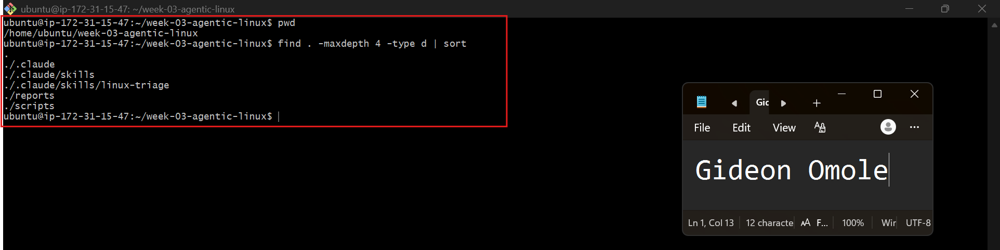

---

### Notes

Answer the following in your own words:

**1. What proves that Nginx is running?**

The systemctl is-active nginx command returning active is the proof. It tells you directly that the Nginx service is up and running, not crashed or stopped.

---

**2. What proves that the server is listening for HTTP traffic?**

Seeing port 80 show up in the ss -ltn | grep ':80' output. This means a process is actually bound to that port and ready to accept connections, not just running in the background.

---

**3. Why must you capture a healthy baseline before simulating an incident?**

You need to know what "normal" looks like before you break something on purpose. Without a baseline, you can't tell if a problem was caused by your simulated incident or if it was already there — and you won't be able to confirm your fix actually restored things properly.

---

# Task 2 — Create Project Context and Safety Rules in CLAUDE.md

## Goal

Tell Claude exactly what this project does and what it is not allowed to do.

### Evidence

#### Screenshot 3 — CLAUDE.md open in VS Code showing all four sections (Project Overview, Incident Workflow, Safety Rules, Output Rules)

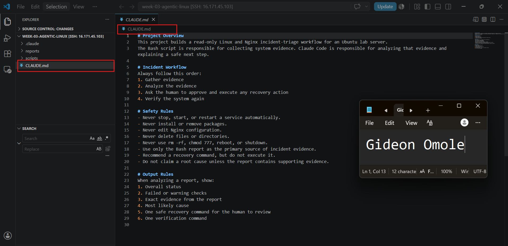

---

### Notes

Answer the following in your own words:

**1. Why should Claude receive project-specific operational rules?**

Without clear rules, Claude might try to be "helpful" in ways that are actually risky — like restarting a service or editing a config file on its own. Giving it project-specific rules keeps its behavior predictable and scoped to exactly what this project needs: gathering and analyzing evidence, not taking unsupervised action on a live server.

---

**2. Why is the human required to execute the recovery command?**

Because Claude is analyzing evidence, not verifying real-world consequences. A human needs to be the one who reviews the recommended command and decides if it's safe to run, since Claude can't be held accountable for downtime or damage, and it may not have full context on the server, business impact, or timing.

---

**3. Which rule prevents Claude from making an unsupported diagnosis?**

The rule: "Do not claim a root cause unless the report contains supporting evidence." This forces Claude to base its analysis strictly on what the Bash report actually shows, rather than guessing or assuming a cause.

---

# Task 3 — Use Agentic AI to Plan Before Writing the Script

## Goal

Use Claude Code to inspect the environment and produce a read-only plan before creating any Bash code.

### Evidence

#### Screenshot 4 — Claude Code showing the five-check plan and read-only inspection results

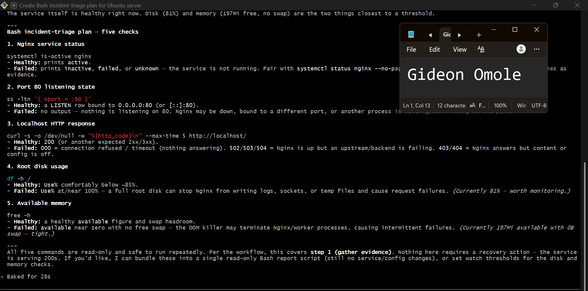

---

### Notes

Answer the following in your own words:

**1. Which part of this task represents the Gather phase?**

The five read-only commands Claude ran against the server checking Nginx status, port 80, the localhost HTTP response, disk usage, and memory are the Gather phase. Claude collected raw evidence directly from the system before doing any analysis or proposing next steps, which matches step 1 ("Gather evidence") in the CLAUDE.md workflow.

---

**2. Did Claude follow the instruction not to create files? How did you verify this?**

Yes. Every command Claude ran was read-only (`systemctl is-active`, `ss`, `curl`, `df`, `free`) — none of them write, edit, or create files. I verified this by checking that each Bash call only reads system state and prints output, with no `touch`, `>`, `nano`, `mkdir`, or similar file-creation commands anywhere in the transcript. Claude also explicitly said it was working read-only and offered to bundle the checks into a script only if I approved it, rather than creating one on its own.

---

**3. Why is planning before coding useful in DevOps automation?**

Planning first means you define exactly what "healthy" and "failed" look like for each check before you write any automation around it. This avoids wasted effort, catches missing edge cases early (like the disk and memory warnings Claude flagged here), and makes sure the eventual script is actually useful and safe — rather than jumping straight into code and discovering gaps or risky logic later, once it's already running against a live system.

---

# Task 4 — Build the Linux Triage Bash Script

## Goal

Create one Bash script that gathers consistent Linux and Nginx health evidence.

### Evidence

#### Screenshot 5 — Top section of `linux-triage.sh` showing variables, thresholds, and the checks array

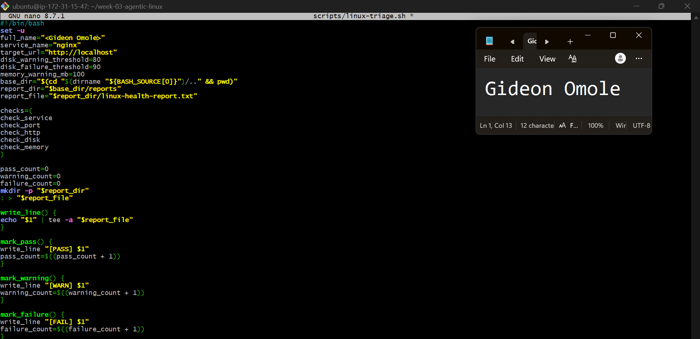

---

#### Screenshot 6 — Middle section showing check functions and conditionals

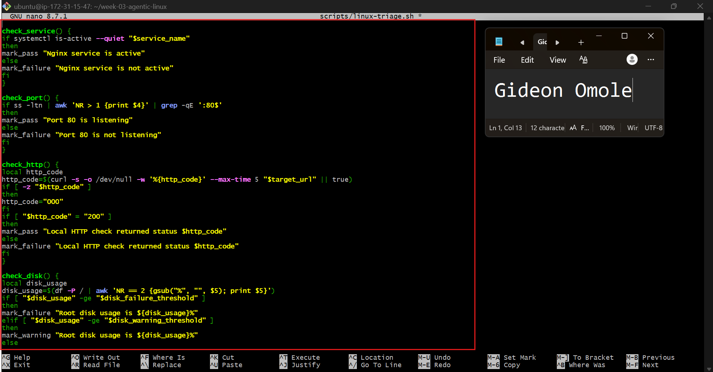

---

#### Screenshot 7 — Bottom section showing the loop, summary function, and exit behavior

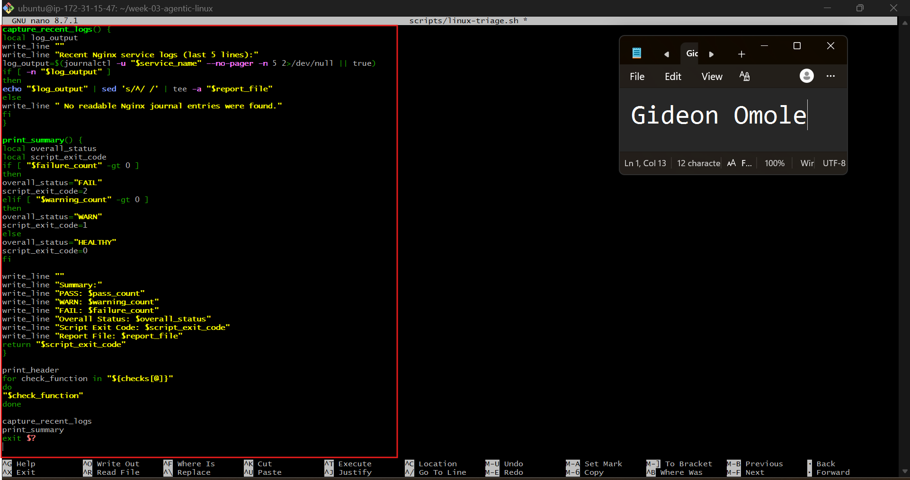

---

#### Screenshot 8 — Output of `bash -n scripts/linux-triage.sh` (no syntax errors) and `ls -l scripts/linux-triage.sh` showing executable permission

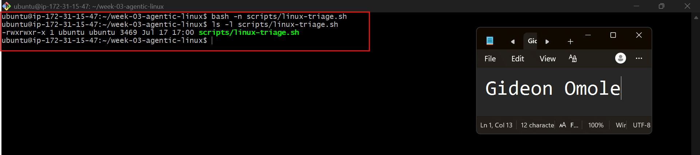

---

### Notes

Answer the following in your own words:

**1. What is stored in the checks array?**

The `checks` array stores the names of the five check functions (`check_service`, `check_port`, `check_http`, `check_disk`, `check_memory`) as a list of strings. It doesn't run them — it just holds the names so they can be called later in order.

---

**2. How does the `for` loop use that array?**

The `for` loop goes through each item in the `checks` array one at a time, storing it in the variable `check_function`, and then calls it as a command using `"$check_function"`. This is what actually triggers each health check to run, in the order they appear in the array.

---

**3. Why are the health checks separated into functions?**

Separating each check into its own function keeps the script organized and easy to read. Each function has one clear job (like checking the port or checking memory). It also makes the script easier to maintain or extend, since you can add, remove, or modify a single check without touching the rest of the script, and the `for` loop can call any number of checks without needing repeated code.

---

**4. What is the purpose of `$(...)` in this script?**

It runs a command and grabs its output so you can use it, like saving it into a variable. For example, it's used to get the current date and time so it can be printed in the report.

---

**5. Why does the script use different exit codes for HEALTHY, WARN, and FAIL?**

So other programs or tools can quickly tell how serious the result was, just from a number without reading the whole report. `0` means everything's fine, `1` means something needs attention, and `2` means something's actually broken.

---

# Task 5 — Run and Understand the Healthy-State Report

## Goal

Run the Bash script against the healthy server and verify that it creates a report.

### Evidence

#### Screenshot 9 — Output of `./scripts/linux-triage.sh` showing your Full Name and all five check results

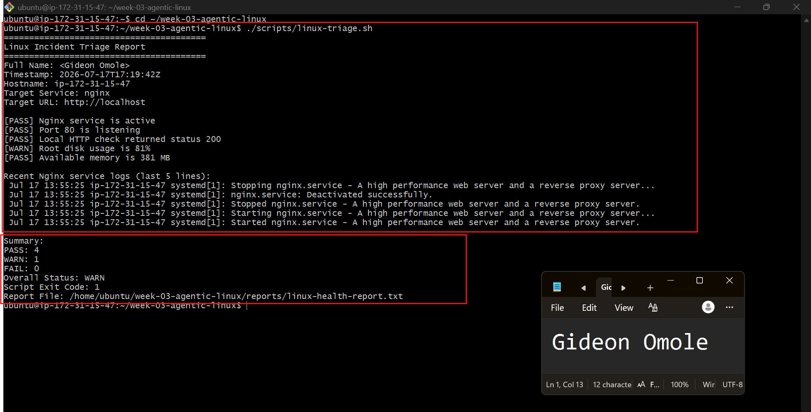

---

#### Screenshot 10 — Output showing the captured exit code and final summary

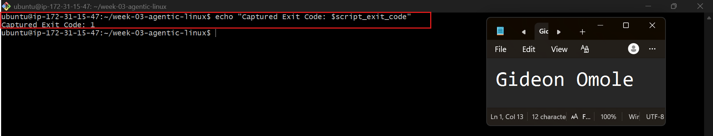

---

### Notes

Answer the following in your own words:

**1. What is the overall status of your healthy baseline?**

The overall status is **WARN**. Four out of five checks passed cleanly (Nginx service, port 80, HTTP response, and memory), but root disk usage came back at 81%, which crossed the warning threshold and pulled the overall result down to WARN instead of HEALTHY.

---

**2. Which exact Linux evidence proves the application is serving traffic?**

The line `[PASS] Local HTTP check returned status 200` is the proof. This means `curl` sent a real HTTP request to `http://localhost` and got back a `200 OK` response, confirming the app is actually responding to requests — not just that Nginx is running or that a port is open.

---

**3. Did your script return exit code 0 or 1? Explain why.**

The script returned **exit code 1**. That's because one check (root disk usage) came back as a WARNING rather than a PASS or FAIL. The script is designed to return `0` only when everything is fully healthy, `1` when there's at least one warning, and `2` if anything actually fails — so a single warning was enough to bump the exit code up to 1.

---

**4. What is the difference between a warning and a failure in this script?**

A warning means something is trending in the wrong direction but isn't broken yet like disk usage at 81%, which is high but the app is still working fine. A failure means something is actually not functioning, like Nginx being down or the HTTP check returning an error code. Warnings are meant to flag things worth watching, while failures mean something needs to be fixed right away.

---

# Task 6 — Create and Run the /linux-triage Skill

## Goal

Turn the Bash script into a reusable, manually invoked Agentic AI workflow.

### Evidence

#### Screenshot 11 — `SKILL.md` showing the frontmatter, allowed tool restrictions, and safety rules

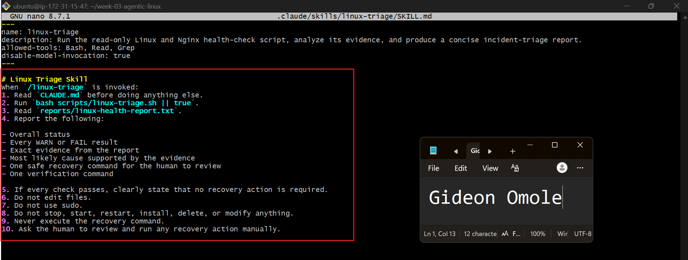

---

#### Screenshot 12 — `/linux-triage` output for the healthy server

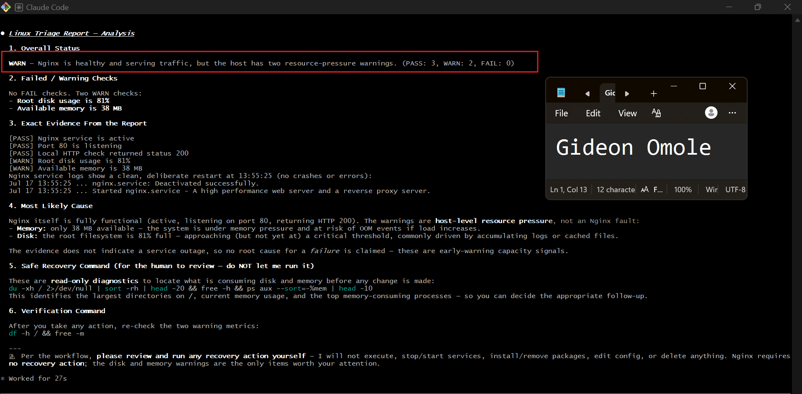

---

### Notes

Answer the following in your own words:

**1. Why does this skill have Bash, Read, and Grep, but not Write?**

Because the skill only needs to run commands and read the results not change anything. Bash lets it run the script, Read and Grep let it look through the report, but leaving out Write means Claude physically can't create or edit files even by accident. It's a safety guardrail built right into the tool permissions.

---

**2. Why is `disable-model-invocation: true` useful for this skill?**

This stops Claude from randomly deciding to run this skill on its own during a normal conversation. It makes sure the triage only runs when a human deliberately types `/linux-triage`, so nothing happens on the server without someone actually asking for it.

---

**3. What part is performed by Bash, and what part is performed by Claude?**

Bash does all the actual work on the server running the checks, gathering real evidence like service status, disk space, and memory, and writing it into the report file. Claude doesn't touch the server directly; it just reads that report afterward and explains what it means, in plain language, without making any changes itself.

---

**4. Why is this better than asking Claude "Is my server healthy?" without giving it evidence?**

If you just ask Claude that question directly, it has no real data to go on and could end up guessing or making something up. By having Bash collect actual evidence first and having Claude read that report, every answer Claude gives is backed by real numbers and real output from the server — not assumptions. It makes the analysis trustworthy instead of a guess.

---

# Task 7 — Simulate an Nginx Incident and Let the Skill Diagnose It

## Goal

Create a controlled service failure, gather evidence through Bash, and let Claude analyze the evidence without taking recovery action.

### Evidence

#### Screenshot 13 — Output showing Nginx is inactive and the HTTP request fails

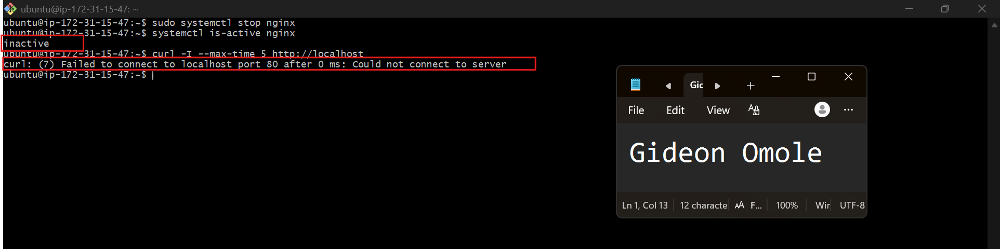

---

#### Screenshot 14 — `/linux-triage` output showing failed evidence, most likely cause, and a suggested recovery command

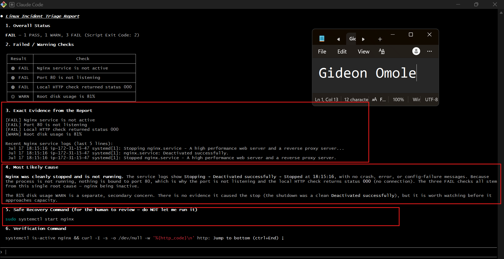

---

#### Screenshot 15 — `incident-failure-report.txt` showing the failed checks and your Full Name

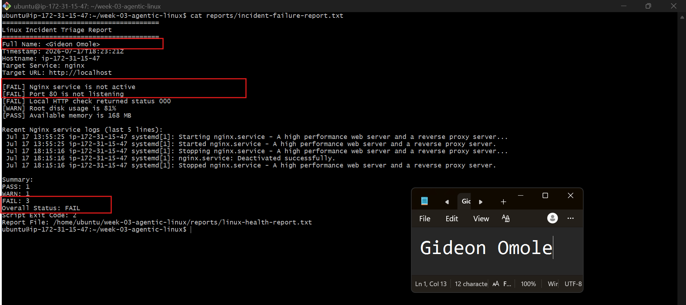

---

### Notes

Answer the following in your own words:

**1. Which three checks failed?**

The Nginx service status check, the port 80 listening check, and the local HTTP check all failed. Since Nginx was stopped, nothing was running to listen on port 80 or respond to HTTP requests, so all three checks that depend on the service being up came back as FAIL.

---

**2. What evidence supports the conclusion that Nginx is unavailable?**

The `systemctl is-active nginx` command returned `inactive` instead of `active`, and the `curl` request to `http://localhost` either timed out or returned a connection error instead of an HTTP 200. These aren't assumptions they're direct output from the server showing the service isn't running and isn't responding to requests.

---

**3. Did Claude execute the recovery command? Why is that important?**

No, Claude only recommended the recovery command (like `sudo systemctl start nginx`) and asked the human to review and run it manually. This matters because Claude doesn't have full context on timing, risk, or business impact — letting a human stay in control of any action that changes the system keeps things safe and avoids Claude making a live change on its own.

---

**4. Which phase of the Agentic Loop is represented by the Bash report?**

The Bash report represents the Gather phase. It's purely collecting raw evidence from the system service status, port state, HTTP response without interpreting what any of it means.

---

**5. Which phase is represented by Claude's explanation?**

Claude's explanation represents the **Analyze** phase. It takes the raw evidence from the Bash report and turns it into a clear, human-readable explanation of what's wrong, why it's likely happening, and what the safe next step would be.

---

# Task 8 — Recover Manually, Verify Again, and Write the Incident Summary

## Goal

Recover the service as the human operator and prove that the system is healthy again.

### Evidence

#### Screenshot 16 — Output showing Nginx is active and `curl -I http://localhost` returns 200 OK

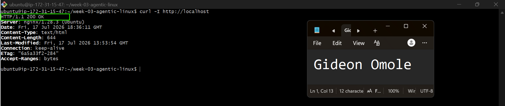

---

#### Screenshot 17 — Second `/linux-triage` output showing successful recovery with no FAIL results

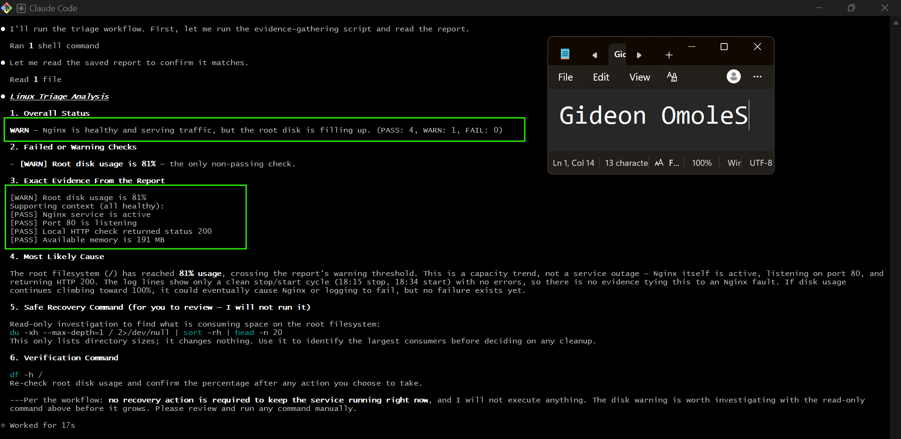

---

#### Screenshot 18 — Output of `ls -lah reports` showing both `incident-failure-report.txt` and `recovery-report.txt`

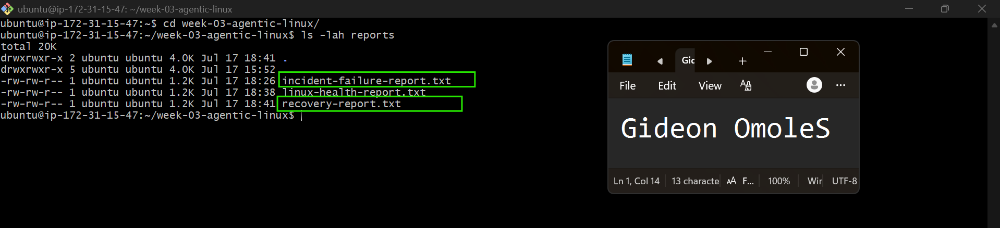

---

#### Screenshot 19 — `incident-summary.md` showing all required sections and your Full Name

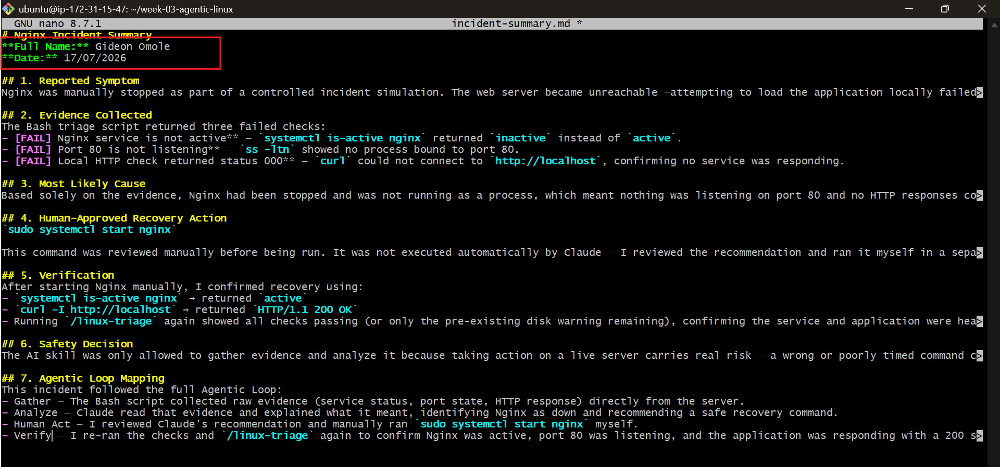

---

### Notes

Answer the following in your own words:

**1. What action did you execute manually?**

I ran `sudo systemctl start nginx` myself in a regular terminal, after reviewing Claude's recommendation. Claude never ran this command. I made the decision and typed it in myself.

---

**2. What evidence proves that the service recovered?**

`systemctl is-active nginx` returned `active`, and `curl -I http://localhost` returned a `200 OK` response. Running `/linux-triage` again also showed the previously failed checks now passing, which confirmed the service was back up and actually serving traffic, not just running.

---

**3. Why is the second triage run necessary?**

Just restarting the service doesn't automatically prove it worked — you need fresh evidence to confirm it. Running the triage again collects new, current data straight from the server, so the recovery can be verified with real proof instead of just assuming the fix worked.

---

**4. What could go wrong if an AI agent automatically restarted every failed service?**

It could end up masking a deeper problem instead of fixing it. For example, restarting a service repeatedly without understanding why it keeps failing (like a config error or a resource issue) could hide the real cause, cause data loss, restart something at a bad time, or even make an outage worse if it keeps looping without a human noticing.

---

**5. In one sentence, explain the difference between using AI as a chatbot and using AI in this agentic workflow.**

A chatbot just answers questions based on what you tell it, while this agentic workflow has AI actively gathering real evidence from the system and using that evidence to reason through a problem before a human decides what action to take.

---

# Incident Summary

Fill in all seven sections below in your own words.

**Full Name:** Gideon Omole

**Date:** 17/07/2026

---

**1. Reported Symptom**

Nginx was manually stopped as part of a controlled incident simulation. The web server became unreachable attempting to load the application locally failed to return a response, and the service was no longer running on the host.

---

**2. Evidence Collected**

The Bash triage script returned three failed checks:
- **[FAIL] Nginx service is not active** — `systemctl is-active nginx` returned `inactive` instead of `active`.
- **[FAIL] Port 80 is not listening** — `ss -ltn` showed no process bound to port 80.
- **[FAIL] Local HTTP check returned status 000** — `curl` could not connect to `http://localhost`, confirming no service was responding.

---

**3. Most Likely Cause**

Based solely on the evidence, Nginx had been stopped and was not running as a process, which meant nothing was listening on port 80 and no HTTP responses could be returned. The evidence pointed directly to the service being down, not to a configuration error or resource exhaustion, since no other failures (disk, memory) were present at the time.

---

**4. Human-Approved Recovery Action**

This command was reviewed manually before being run. It was not executed automatically by Claude — I reviewed the recommendation and ran it myself in a separate terminal.

---

**5. Verification**

After starting Nginx manually, I confirmed recovery using:
- `systemctl is-active nginx` → returned `active`
- `curl -I http://localhost` → returned `HTTP/1.1 200 OK`
- Running `/linux-triage` again showed all checks passing (or only the pre-existing disk warning remaining), confirming the service and application were healthy again.

---

**6. Safety Decision**

The AI skill was only allowed to gather evidence and analyze it because taking action on a live server carries real risk — a wrong or poorly timed command could cause more damage than the original problem. Restarting a service is an action with real consequences, so a human needed to review the evidence and make the final call, rather than letting Claude execute changes on its own.

---

**7. Agentic Loop Mapping**

This whole process followed a clear pattern:
- **Gather** – the Bash script pulled the actual evidence from the server (service status, port, HTTP response)
- **Analyze** – Claude looked at that evidence and explained what was wrong and why
- **Human Act** – I reviewed what Claude found and manually restarted the service myself
- **Verify** – I checked again afterward to confirm everything was actually back to normal

---

# LinkedIn Post (Required)

## Evidence

#### LinkedIn Post URL

Paste your LinkedIn post URL here:

`https://www.linkedin.com/posts/gideon-omole-5ba318180_dmibypravinmishra-linux-bash-ugcPost-7483963699251093504-fb35/?utm_source=share&utm_medium=member_desktop&rcm=ACoAACrC7l4BK-z0pGwSRQMO8ZJ5pFZyqybbIk4`

---

#### Screenshot — Published LinkedIn post

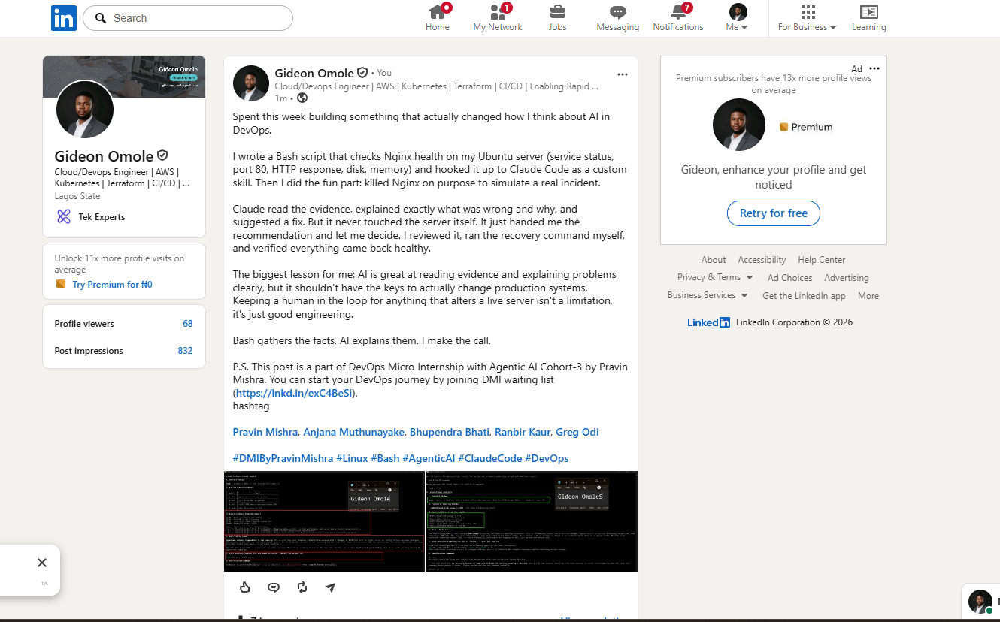

---

# GitHub Repository URL

Paste the URL of your GitHub folder or repository containing the assignment files here:

`https://github.com/Gideon-Omole/devops-micro-internship-pravinmishra/tree/main/week-03-linux-and-bash-for-devops`

---

# Submission Instructions

- Add all required screenshots in your submission
- Full Name must be visible in required screenshots and the Bash report
- All written answers must be in your own words
- Do not expose sensitive information (keys, passwords, AWS account IDs, tokens)
- GitHub URL must be included in this document

---

# Completion Checklist

- [ ] Task 1: Healthy baseline confirmed, workspace created (Screenshots 1–2, Notes answered)
- [ ] Task 2: CLAUDE.md created with all four sections (Screenshot 3, Notes answered)
- [ ] Task 3: Five-check plan produced by Claude using read-only tools (Screenshot 4, Notes answered)
- [ ] Task 4: `linux-triage.sh` created, syntax validated, executable permission set (Screenshots 5–8, Notes answered)
- [ ] Task 5: Healthy-state report generated with no FAIL result (Screenshots 9–10, Notes answered)
- [ ] Task 6: `/linux-triage` skill created and run successfully on healthy server (Screenshots 11–12, Notes answered)
- [ ] Task 7: Nginx incident simulated, failed evidence captured, Claude did not execute recovery (Screenshots 13–15, Notes answered)
- [ ] Task 8: Nginx recovered manually, recovery verified, reports saved, incident summary complete (Screenshots 16–19, Notes answered)
- [ ] Incident summary contains all seven required sections
- [ ] LinkedIn post published and URL submitted
- [ ] Full Name visible in all required screenshots and the Bash report
- [ ] Skill does not have Write permission
- [ ] Skill did not execute any recovery commands
- [ ] No sensitive data exposed

---

## 📌 About DMI & CloudAdvisory

DevOps Micro Internship (DMI) is a project-based DevOps program run by Pravin Mishra (The CloudAdvisory) focused on real-world execution, systems thinking, and career readiness.

It helps learners build strong DevOps foundations with hands-on experience.

---

## 📌 Resources

- 🌐 DMI Official Website: https://pravinmishra.com/dmi  
- 🎓 DevOps for Beginners (Udemy): https://www.udemy.com/course/devops-for-beginners-docker-k8s-cloud-cicd-4-projects/  
- 🎓 Agentic AI DevOps with Claude Code: https://www.udemy.com/course/ultimate-agentic-ai-devops-with-claude-code/  
- 🎓 DevOps with Claude Code: Terraform, EKS, ArgoCD & Helm: https://www.udemy.com/course/devops-with-claude-code-terraform-eks-argocd-helm/  
- ▶️ YouTube Playlist: https://www.youtube.com/playlist?list=PLFeSNDtI4Cho  
- 🔗 Pravin Mishra (LinkedIn): https://www.linkedin.com/in/pravin-mishra-aws-trainer/  
- 🏢 CloudAdvisory (LinkedIn): https://www.linkedin.com/company/thecloudadvisory/

---

*This submission is part of DevOps Micro Internship (DMI) Cohort 3 — Agentic AI Track.*