# Assignment 6 — Build an AI-Assisted Linux Health Check (AI-Assisted Linux Incident Triage)

Part of the DevOps Micro Internship (DMI) Cohort 3 with Agentic AI

---

## Purpose

In this assignment, you will build a read-only Bash triage script that checks the health of your Ubuntu server and Nginx application, connect it to Claude Code as a reusable `/linux-triage` skill, simulate a controlled Nginx incident, use the skill to gather and analyze evidence, recover the service manually, and verify recovery. The workflow follows the Agentic Loop: Gather → Analyze → Human Act → Verify.

---

# Task 1 — Confirm the Healthy Baseline and Create the Workspace

## Goal

Confirm that Nginx and the React application are healthy before building the automation.

### Evidence

#### Screenshot 1 — Output of `systemctl is-active nginx`, `ss -ltn | grep ':80'`, and `curl -I http://localhost`

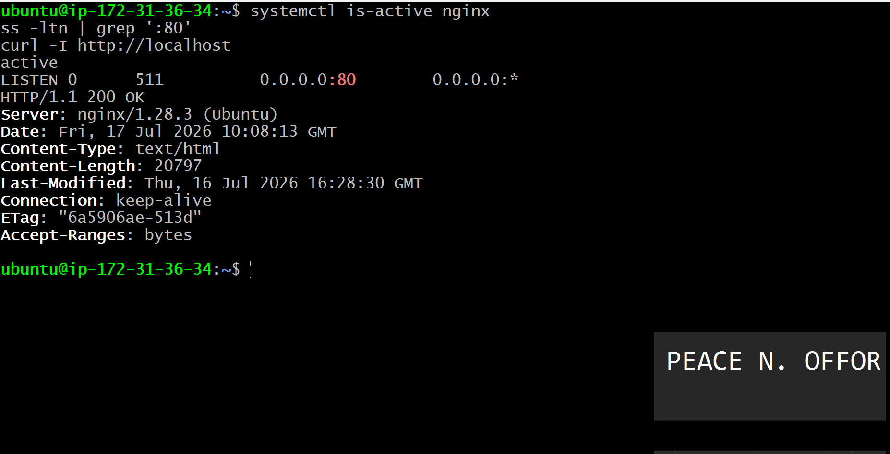.

---

#### Screenshot 2 — Output of `pwd` and `find . -maxdepth 4 -type d | sort` showing the workspace folder structure

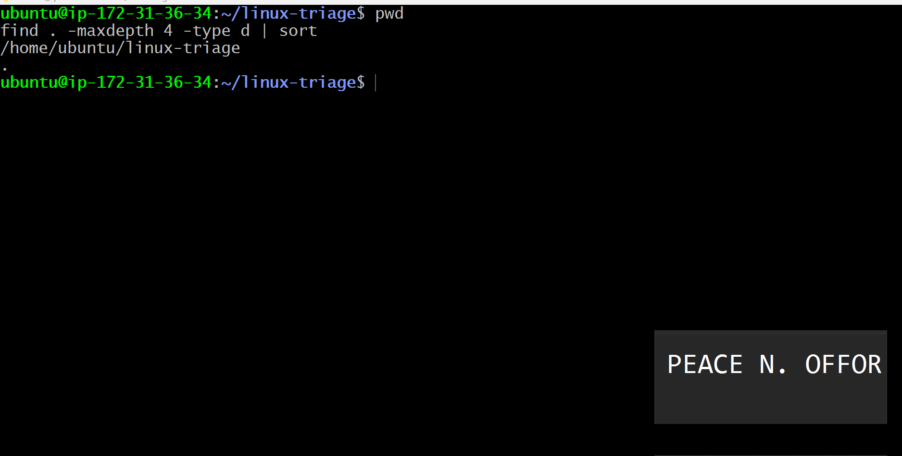.

---

### Notes

Answer the following in your own words:

**1. What proves that Nginx is running?**

Nginx is confirmed to be running when the systemctl is-active nginx command returns active. This shows that the Nginx service is currently running without errors.

---

**2. What proves that the server is listening for HTTP traffic?**

The ss -ltn | grep ':80' command shows that the server is listening on port 80, which is the default HTTP port. The successful response from curl -I http://localhost also confirms that Nginx is accepting HTTP requests.

---

**3. Why must you capture a healthy baseline before simulating an incident?**

Capturing a healthy baseline gives me a known working state to compare against after an incident occurs. It helps me identify what changed during the failure and confirms whether the recovery process successfully restored the system.

---

# Task 2 — Create Project Context and Safety Rules in CLAUDE.md

## Goal

Tell Claude exactly what this project does and what it is not allowed to do.

### Evidence

#### Screenshot 3 — CLAUDE.md open in VS Code showing all four sections (Project Overview, Incident Workflow, Safety Rules, Output Rules)

.

---

### Notes

Answer the following in your own words:

**1. Why should Claude receive project-specific operational rules?**

Project-specific operational rules help Claude understand the project's requirements and boundaries. This allows it to provide recommendations that are accurate, safe, and aligned with the intended workflow..

---

**2. Why is the human required to execute the recovery command?**

The recovery command should be executed by a human because it can change the state of a production system. Keeping the final action under human control reduces the risk of accidental outages or unintended changes.

---

**3. Which rule prevents Claude from making an unsupported diagnosis?**

The rule that requires Claude to rely only on verified evidence and avoid assumptions prevents it from making an unsupported diagnosis. It ensures that conclusions are based on actual system checks rather than guesses.

---

# Task 3 — Use Agentic AI to Plan Before Writing the Script

## Goal

Use Claude Code to inspect the environment and produce a read-only plan before creating any Bash code.

### Evidence

#### Screenshot 4 — Claude Code showing the five-check plan and read-only inspection results

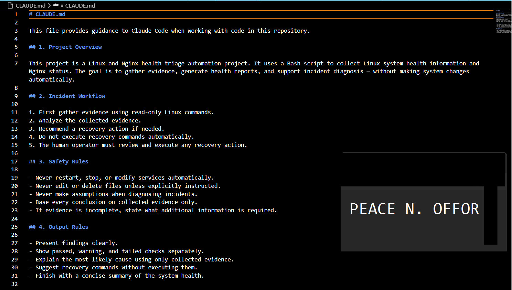.

---

### Notes

Answer the following in your own words:

**1. Which part of this task represents the Gather phase?**

The Gather phase is when Claude inspects the environment by collecting information about the system using read-only commands before creating any automation or making changes.

---

**2. Did Claude follow the instruction not to create files? How did you verify this?**

Yes. Claude followed the instruction by only performing read-only inspections and generating a plan. I verified this because no new files or directories were created during the planning stage.

---

**3. Why is planning before coding useful in DevOps automation?**

Planning before coding helps me understand the current system, identify potential risks, and design a safer automation process. It reduces mistakes, prevents unnecessary changes, and results in more reliable automation scripts.

---

# Task 4 — Build the Linux Triage Bash Script

## Goal

Create one Bash script that gathers consistent Linux and Nginx health evidence.

### Evidence

#### Screenshot 5 — Top section of `linux-triage.sh` showing variables, thresholds, and the checks array

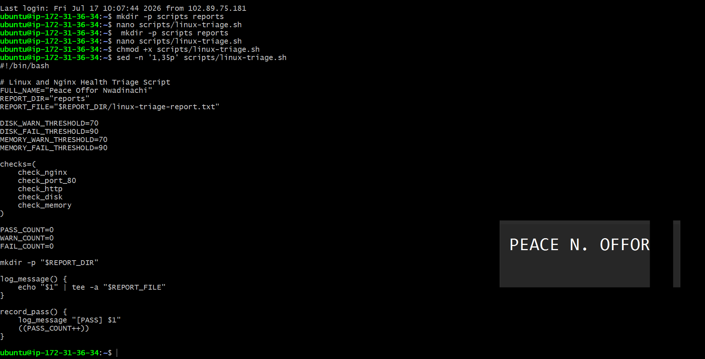.

---

#### Screenshot 6 — Middle section showing check functions and conditionals

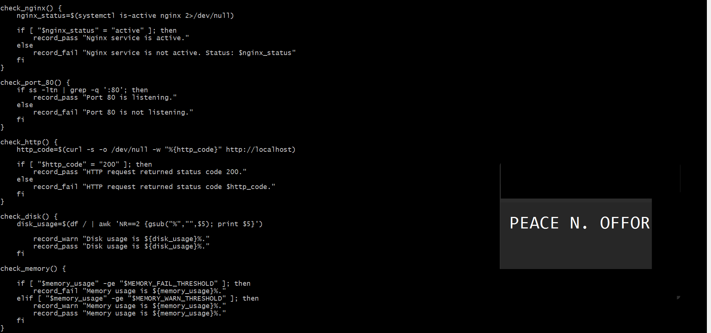.

---

#### Screenshot 7 — Bottom section showing the loop, summary function, and exit behavior

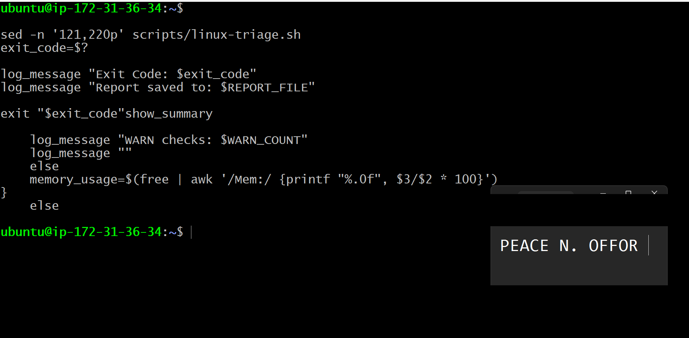.

---

#### Screenshot 8 — Output of `bash -n scripts/linux-triage.sh` (no syntax errors) and `ls -l scripts/linux-triage.sh` showing executable permission

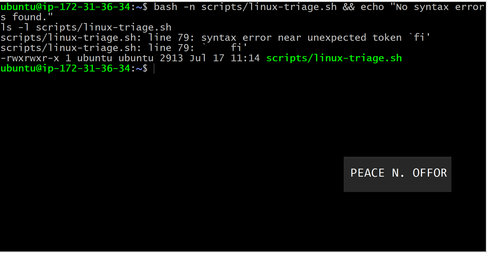.

---

### Notes

Answer the following in your own words:

**1. What is stored in the checks array?**

The checks array stores the names of the health-check functions that the script needs to run. Each item represents one check, such as the Nginx service status, port 80 listening status, HTTP response, disk usage, or memory usage.

---

**2. How does the `for` loop use that array?**

The for loop goes through each function name stored in the checks array and runs the functions one after another. This prevents me from calling every check manually and makes it easier to add or remove checks later.

---

**3. Why are the health checks separated into functions?**

The checks are separated into functions so that each function performs one clear task. This keeps the script organized, makes troubleshooting easier, and allows individual checks to be reused or updated without affecting the entire script.

---

**4. What is the purpose of `$(...)` in this script?**

The $(...) syntax performs command substitution. It runs a command and captures its output so that the result can be stored in a variable, tested in a conditional, or displayed in the report.

---

**5. Why does the script use different exit codes for HEALTHY, WARN, and FAIL?**

Different exit codes allow other tools and automation systems to understand the final condition of the server without reading the full report. An exit code of 0 normally means healthy, 1 can represent a warning, and a higher non-zero code can represent a failure that requires attention.

---

# Task 5 — Run and Understand the Healthy-State Report

## Goal

Run the Bash script against the healthy server and verify that it creates a report.

### Evidence

#### Screenshot 9 — Output of `./scripts/linux-triage.sh` showing your Full Name and all five check results

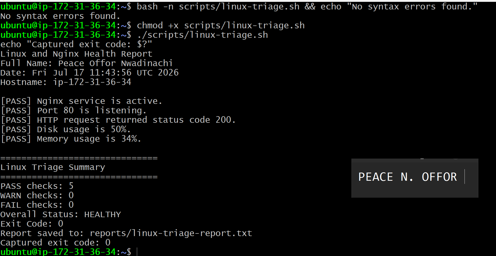.

---

#### Screenshot 10 — Output showing the captured exit code and final summary

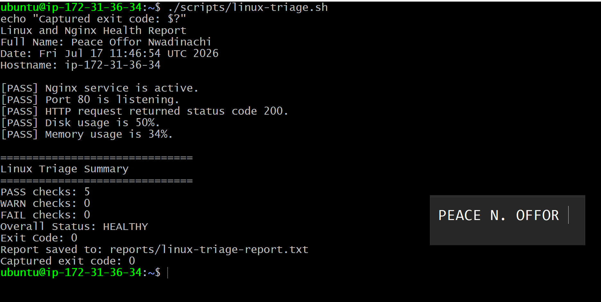.

---

### Notes

Answer the following in your own words:

**1. What is the overall status of your healthy baseline?**

The overall status of my healthy baseline is HEALTHY. All critical checks passed, Nginx was running, port 80 was listening, and the application responded successfully over HTTP.

---

**2. Which exact Linux evidence proves the application is serving traffic?**

The strongest evidence is the successful output from curl -I http://localhost, which returned an HTTP success response such as HTTP/1.1 200 OK. The output from ss -ltn | grep ':80' also confirmed that the server was listening on port 80.

---

**3. Did your script return exit code 0 or 1? Explain why.**

My script returned exit code 0 because the final status was healthy and no critical check failed. In Linux, an exit code of 0 means that the script completed successfully.

---

**4. What is the difference between a warning and a failure in this script?**

A warning means the system is still operating, but one of the monitored values is approaching an unsafe threshold and should be reviewed. A failure means a critical service or function is unavailable, such as Nginx being stopped, port 80 not listening, or the HTTP request failing.

---

# Task 6 — Create and Run the /linux-triage Skill

## Goal

Turn the Bash script into a reusable, manually invoked Agentic AI workflow.

### Evidence

#### Screenshot 11 — `SKILL.md` showing the frontmatter, allowed tool restrictions, and safety rules

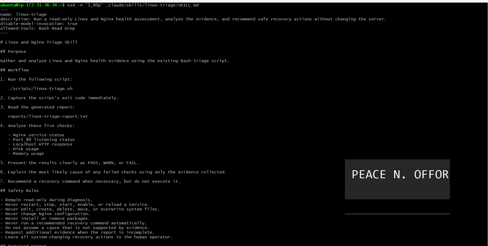.

---

#### Screenshot 12 — `/linux-triage` output for the healthy server

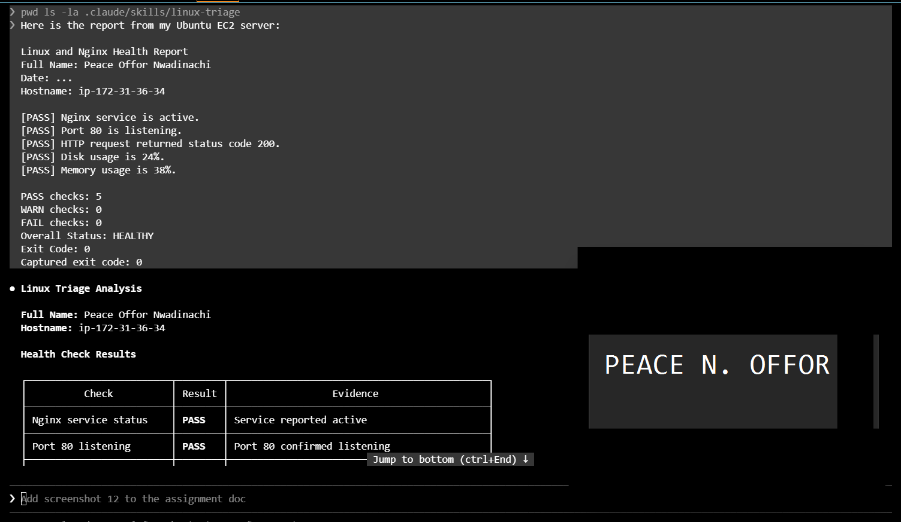.

---

### Notes

Answer the following in your own words:

**1. Why does this skill have Bash, Read, and Grep, but not Write?**

The skill has Bash, Read, and Grep because it is designed to gather and analyze evidence. It does not have Write permission because the workflow should remain read-only and must not modify system files, configuration, or services during diagnosis.

---

**2. Why is `disable-model-invocation: true` useful for this skill?**

disable-model-invocation: true ensures that the skill only runs when I manually invoke it. This prevents Claude from starting the operational workflow automatically or using it unexpectedly without my approval.

---

**3. What part is performed by Bash, and what part is performed by Claude?**

Bash performs the system checks and collects factual evidence from Linux and Nginx. Claude reads the evidence, summarizes the findings, identifies the most likely cause, and recommends a recovery command without executing it.

---

**4. Why is this better than asking Claude "Is my server healthy?" without giving it evidence?**

This workflow is better because Claude receives real output from the server instead of guessing from an incomplete description. The diagnosis is therefore based on verified service status, network state, HTTP responses, and resource information.

---

# Task 7 — Simulate an Nginx Incident and Let the Skill Diagnose It

## Goal

Create a controlled service failure, gather evidence through Bash, and let Claude analyze the evidence without taking recovery action.

### Evidence

#### Screenshot 13 — Output showing Nginx is inactive and the HTTP request fails

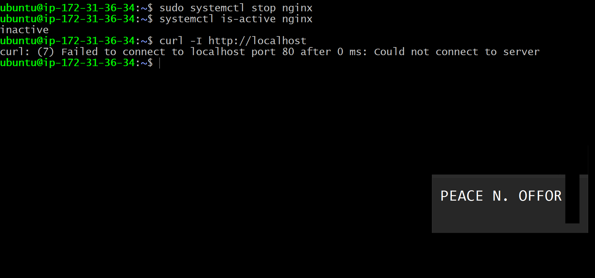.

---

#### Screenshot 14 — `/linux-triage` output showing failed evidence, most likely cause, and a suggested recovery command

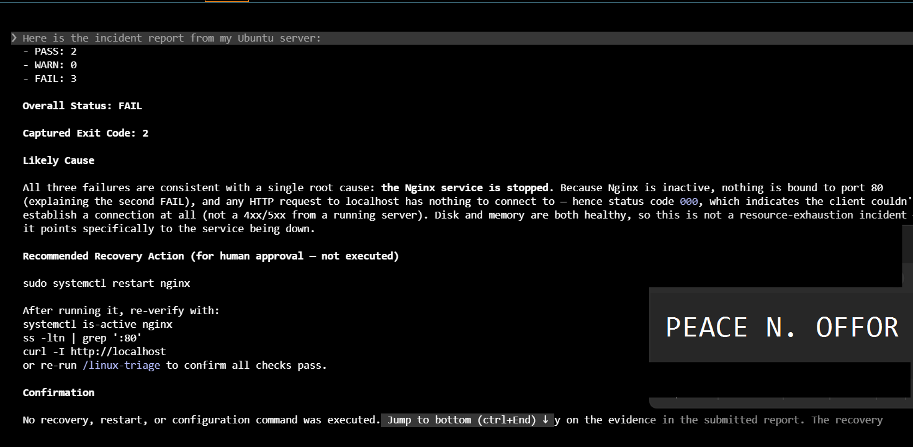.

---

#### Screenshot 15 — `incident-failure-report.txt` showing the failed checks and your Full Name

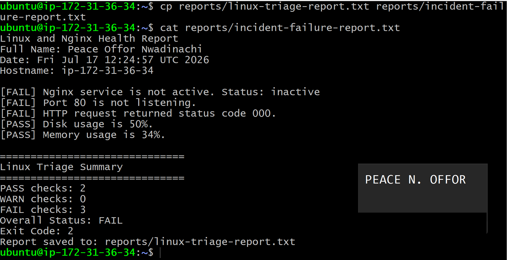.

---

### Notes

Answer the following in your own words:

**1. Which three checks failed?**

The three failed checks were the Nginx service-status check, the port 80 listening check, and the HTTP response check..

---

**2. What evidence supports the conclusion that Nginx is unavailable?**

The service-status command showed that Nginx was inactive, the port check showed that nothing was listening on port 80, and the HTTP request to localhost failed. Together, these results confirm that Nginx was unavailable and could not serve the React application.

---

**3. Did Claude execute the recovery command? Why is that important?**

No, Claude did not execute the recovery command. It only recommended the command for me to review and run manually. This is important because restarting a service changes the system state and should remain under human control.

---

**4. Which phase of the Agentic Loop is represented by the Bash report?**

The Bash report represents the Gather phase because it collects factual evidence about the current condition of the server.

---

**5. Which phase is represented by Claude's explanation?**

Claude’s explanation represents the Analyze and Plan phases. It interprets the gathered evidence, identifies the likely cause, and proposes a safe recovery action.

---

# Task 8 — Recover Manually, Verify Again, and Write the Incident Summary

## Goal

Recover the service as the human operator and prove that the system is healthy again.

### Evidence

#### Screenshot 16 — Output showing Nginx is active and `curl -I http://localhost` returns 200 OK

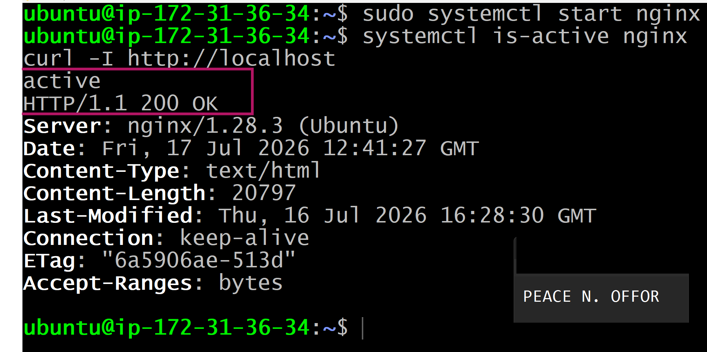.

---

#### Screenshot 17 — Second `/linux-triage` output showing successful recovery with no FAIL results

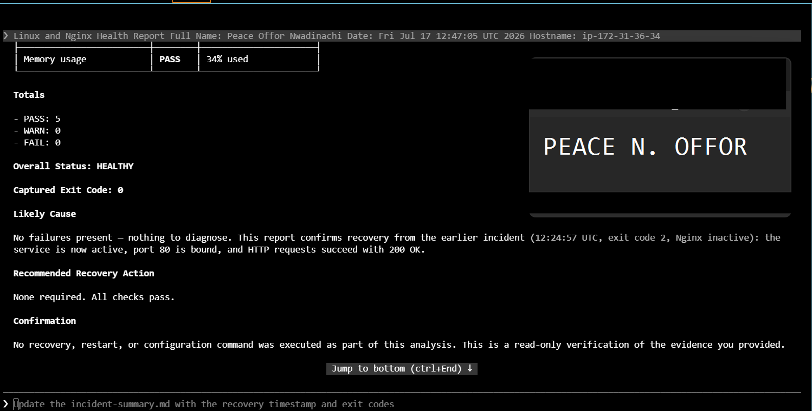.

---

#### Screenshot 18 — Output of `ls -lah reports` showing both `incident-failure-report.txt` and `recovery-report.txt`

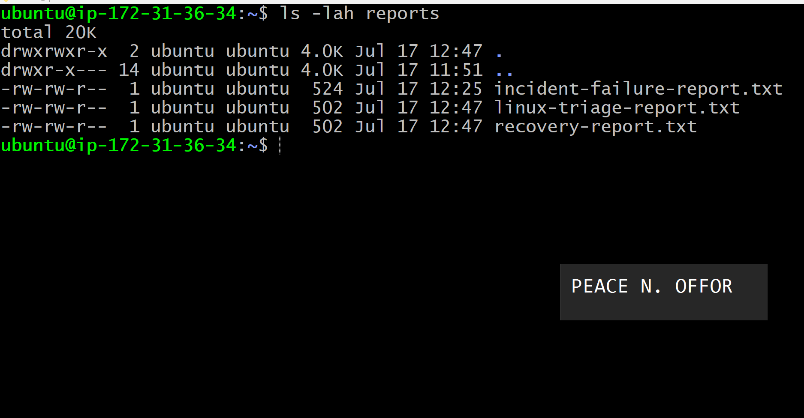.

---

#### Screenshot 19 — `incident-summary.md` showing all required sections and your Full Name

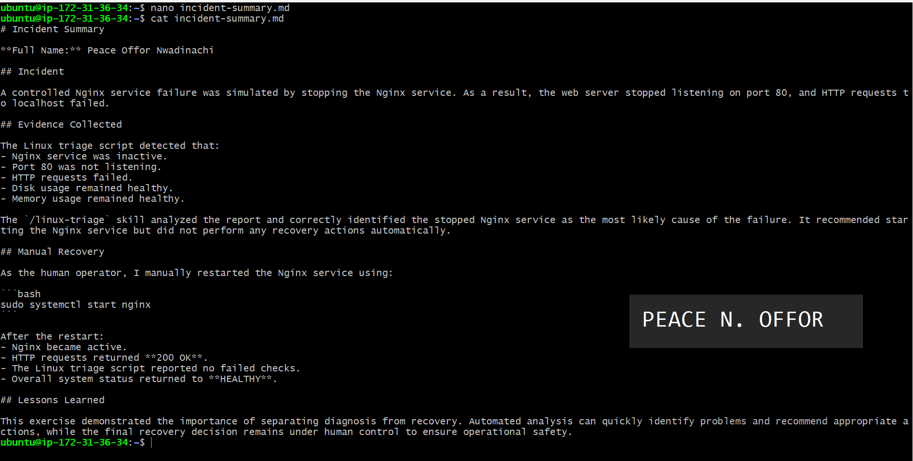.

---

### Notes

Answer the following in your own words:

**1. What action did you execute manually?**

I manually restarted Nginx using:

sudo systemctl restart nginx

I then checked the service and HTTP response to confirm that the restart was successful.

---

**2. What evidence proves that the service recovered?**

The recovery was proven when systemctl is-active nginx returned active, port 80 appeared in the listening-socket output, and curl -I http://localhost returned HTTP/1.1 200 OK. The second triage report also contained no failed checks.

---

**3. Why is the second triage run necessary?**

The second triage run is necessary because executing a recovery command does not automatically prove that the problem has been fixed. Running the same checks again confirms that the service returned to a healthy and stable state.

---

**4. What could go wrong if an AI agent automatically restarted every failed service?**

An automatic restart could hide the real cause of an incident, interrupt active work, create a restart loop, or worsen a configuration problem. Some services may also require investigation before they are safely restarted.

---

**5. In one sentence, explain the difference between using AI as a chatbot and using AI in this agentic workflow.**

A chatbot gives a general response to a question, while this agentic workflow gathers real evidence, follows defined safety rules, analyzes the results, and recommends a controlled action for human approval.

---

# Incident Summary

Fill in all seven sections below in your own words.

**Full Name:** Peace Offor Nwadinachi

**Date:** 17/07/2026

---

**1. Reported Symptom**

The React application became unavailable through the browser, and the local HTTP request to the server failed.

---

**2. Evidence Collected**

The triage script showed that the Nginx service was inactive, no process was listening on port 80, and the HTTP request to http://localhost could not return a successful response. The disk and memory checks remained within acceptable limits.

---

**3. Most Likely Cause**

The most likely cause was that the Nginx service had been intentionally stopped as part of the controlled incident simulation. Because Nginx was inactive, it could not listen on port 80 or serve the React application.

---

**4. Human-Approved Recovery Action**

After reviewing the evidence and Claude’s recommendation, I manually restarted Nginx with:

sudo systemctl restart nginx.

---

**5. Verification**

I verified the recovery by confirming that Nginx returned to the active state, port 80 was listening again, and curl -I http://localhost returned HTTP/1.1 200 OK. I also ran the /linux-triage skill again and confirmed that no critical checks failed.

---

**6. Safety Decision**

Claude was allowed to collect evidence, analyze the incident, and recommend a recovery command, but it was not allowed to execute the command. I retained control of the system-changing action to reduce the risk of an incorrect or unsafe automated recovery.

---

**7. Agentic Loop Mapping**

The Bash script completed the Gather phase by collecting service, network, HTTP, disk, and memory evidence. Claude completed the Analyze and Plan phases by interpreting the report and recommending a recovery action. I completed the Act phase by manually restarting Nginx. The second triage run completed the Verify phase by proving that the service had recovered.

---

# LinkedIn Post (Required)

## Evidence

#### LinkedIn Post URL

Paste your LinkedIn post URL here:

`https://www.linkedin.com/posts/peace-offor-aa736a147_dmibypravinmishra-devops-linux-activity-7483836820632457217-QJ03?utm_source=share&utm_medium=member_desktop&rcm=ACoAACN4g58BM2OoiPOU_M6YmR_9gplw4hlL_RQ`

---

#### Screenshot — Published LinkedIn post

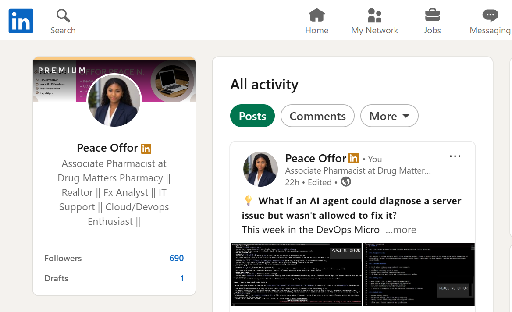.

---

# GitHub Repository URL

Paste the URL of your GitHub folder or repository containing the assignment files here:

`https://github.com/PeaceCloud-Solutions/devops-micro-internship-pravinmishra.git`

---

# Submission Instructions

- Add all required screenshots in your submission
- Full Name must be visible in required screenshots and the Bash report
- All written answers must be in your own words
- Do not expose sensitive information (keys, passwords, AWS account IDs, tokens)
- GitHub URL must be included in this document

---

# Completion Checklist

- [-] Task 1: Healthy baseline confirmed, workspace created (Screenshots 1–2, Notes answered)
- [-] Task 2: CLAUDE.md created with all four sections (Screenshot 3, Notes answered)
- [-] Task 3: Five-check plan produced by Claude using read-only tools (Screenshot 4, Notes answered)
- [-] Task 4: `linux-triage.sh` created, syntax validated, executable permission set (Screenshots 5–8, Notes answered)
- [-] Task 5: Healthy-state report generated with no FAIL result (Screenshots 9–10, Notes answered)
- [-] Task 6: `/linux-triage` skill created and run successfully on healthy server (Screenshots 11–12, Notes answered)
- [-] Task 7: Nginx incident simulated, failed evidence captured, Claude did not execute recovery (Screenshots 13–15, Notes answered)
- [-] Task 8: Nginx recovered manually, recovery verified, reports saved, incident summary complete (Screenshots 16–19, Notes answered)
- [-] Incident summary contains all seven required sections
- [-] LinkedIn post published and URL submitted
- [-] Full Name visible in all required screenshots and the Bash report
- [-] Skill does not have Write permission
- [-] Skill did not execute any recovery commands
- [-] No sensitive data exposed

---

## 📌 About DMI & CloudAdvisory

DevOps Micro Internship (DMI) is a project-based DevOps program run by Pravin Mishra (The CloudAdvisory) focused on real-world execution, systems thinking, and career readiness.

It helps learners build strong DevOps foundations with hands-on experience.

---

## 📌 Resources

- 🌐 DMI Official Website: https://pravinmishra.com/dmi  
- 🎓 DevOps for Beginners (Udemy): https://www.udemy.com/course/devops-for-beginners-docker-k8s-cloud-cicd-4-projects/  
- 🎓 Agentic AI DevOps with Claude Code: https://www.udemy.com/course/ultimate-agentic-ai-devops-with-claude-code/  
- 🎓 DevOps with Claude Code: Terraform, EKS, ArgoCD & Helm: https://www.udemy.com/course/devops-with-claude-code-terraform-eks-argocd-helm/  
- ▶️ YouTube Playlist: https://www.youtube.com/playlist?list=PLFeSNDtI4Cho  
- 🔗 Pravin Mishra (LinkedIn): https://www.linkedin.com/in/pravin-mishra-aws-trainer/  
- 🏢 CloudAdvisory (LinkedIn): https://www.linkedin.com/company/thecloudadvisory/

---

*This submission is part of DevOps Micro Internship (DMI) Cohort 3 — Agentic AI Track.*