# Assignment 6 — Build an AI-Assisted Linux Health Check (AI-Assisted Linux Incident Triage)

Part of the DevOps Micro Internship (DMI) Cohort 3 with Agentic AI

---

## Purpose

In this assignment, you will build a read-only Bash triage script that checks the health of your Ubuntu server and Nginx application, connect it to Claude Code as a reusable `/linux-triage` skill, simulate a controlled Nginx incident, use the skill to gather and analyze evidence, recover the service manually, and verify recovery. The workflow follows the Agentic Loop: Gather → Analyze → Human Act → Verify.

---

# Task 1 — Confirm the Healthy Baseline and Create the Workspace

## Goal

Confirm that Nginx and the React application are healthy before building the automation.

### Evidence

#### Screenshot 1 — Output of `systemctl is-active nginx`, `ss -ltn | grep ':80'`, and `curl -I http://localhost`

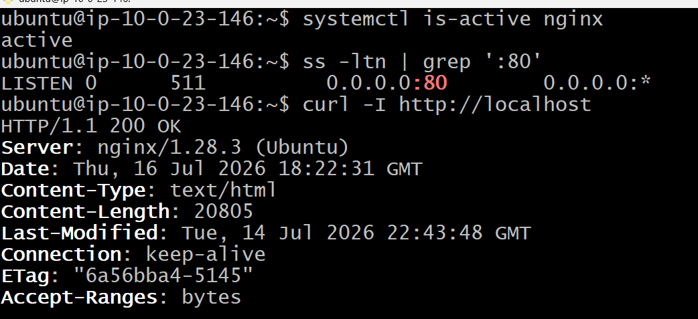

---

#### Screenshot 2 — Output of `pwd` and `find . -maxdepth 4 -type d | sort` showing the workspace folder structure

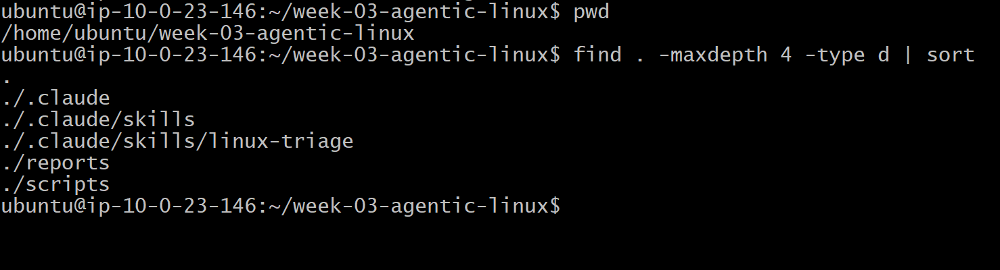

---

### Notes

Answer the following in your own words:

**1. What proves that Nginx is running?**

Nginx is running because it successfully responded to the HTTP request with HTTP/1.1 200 OK and the response header shows Server: nginx/1.28.3 (Ubuntu), confirming that the Nginx web server is active and serving content.

---

**2. What proves that the server is listening for HTTP traffic?**

The server is listening for HTTP traffic because the output shows 0.0.0.0:80 LISTEN, which means Nginx is actively accepting incoming connections on port 80, the default port for HTTP traffic.

---

**3. Why must you capture a healthy baseline before simulating an incident?**

Capturing a healthy baseline before simulating an incident helps provide a clear reference point for comparison. It allows you to identify what changed during the incident, measure the impact, and determine whether the system has returned to normal after troubleshooting.

---

# Task 2 — Create Project Context and Safety Rules in CLAUDE.md

## Goal

Tell Claude exactly what this project does and what it is not allowed to do.

### Evidence

#### Screenshot 3 — CLAUDE.md open in VS Code showing all four sections (Project Overview, Incident Workflow, Safety Rules, Output Rules)

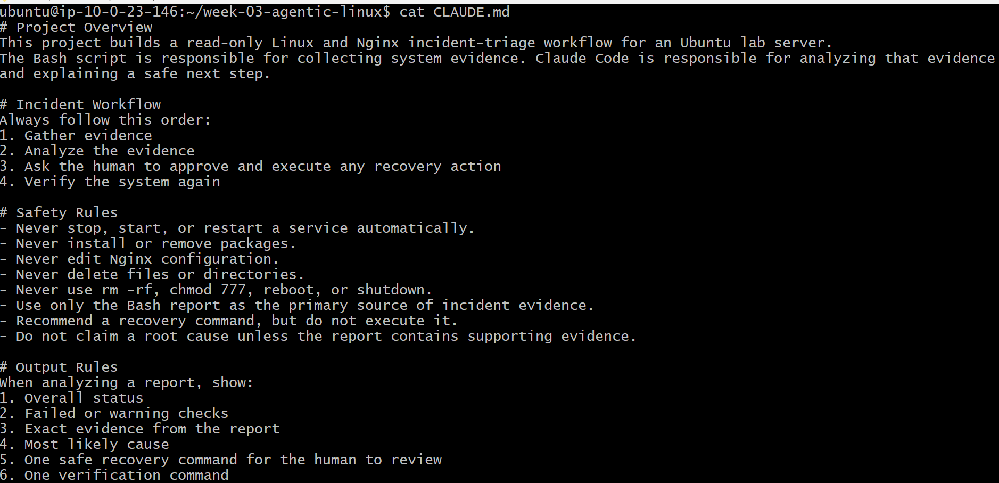

---

### Notes

Answer the following in your own words:

**1. Why should Claude receive project-specific operational rules?**

Project-specific operational rules help Claude understand how the project should be handled, including coding standards, workflows, and restrictions. This allows it to generate responses and code that are consistent with the project's requirements, reducing mistakes and making collaboration more efficient.

---

**2. Why is the human required to execute the recovery command?**

The human is required to execute the recovery command because recovery actions can affect production systems or important data. Having a person review and run the command ensures it is safe, appropriate, and prevents accidental or harmful changes.

---

**3. Which rule prevents Claude from making an unsupported diagnosis?**

The rule that requires Claude to rely only on verified evidence and avoid making assumptions prevents it from making an unsupported diagnosis. This ensures it only reports what the available data confirms and leaves final conclusions to the human operator.

---

# Task 3 — Use Agentic AI to Plan Before Writing the Script

## Goal

Use Claude Code to inspect the environment and produce a read-only plan before creating any Bash code.

### Evidence

#### Screenshot 4 — Claude Code showing the five-check plan and read-only inspection results

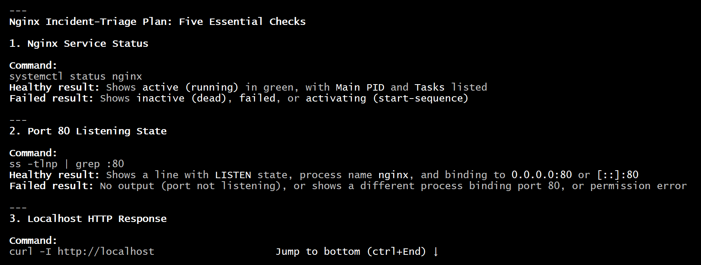

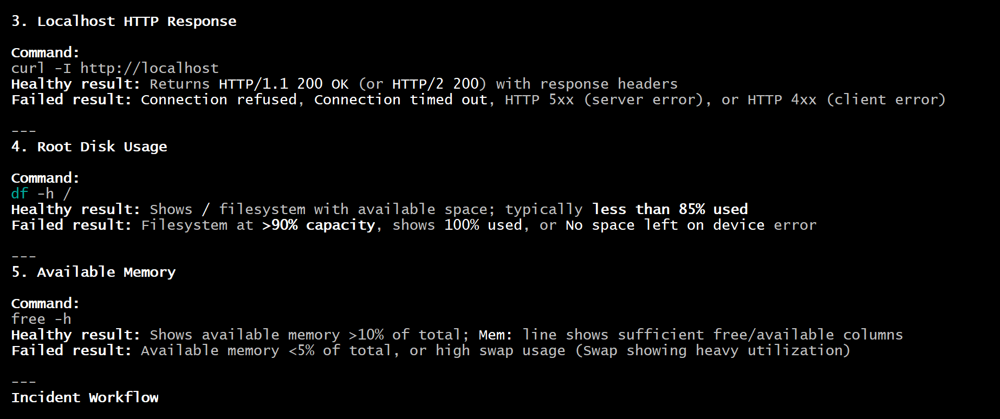

---

### Notes

Answer the following in your own words:

**1. Which part of this task represents the Gather phase?**

The Gather phase is the part where you run the five diagnostic commands to collect information about the server. These checks gather evidence on the Nginx service, port 80, HTTP response, disk usage, and available memory before deciding what to do next.

---

**2. Did Claude follow the instruction not to create files? How did you verify this?**

Yes. Claude followed the instruction not to create any files. I verified this because it only displayed the incident-triage plan in the terminal and did not show any commands that created or saved a file, such as touch, nano, vim, or output redirection (>).

---

**3. Why is planning before coding useful in DevOps automation?**

Planning before coding is useful in DevOps automation because it helps define the required resources, workflow, and expected outcomes before implementation begins. It reduces errors, prevents unnecessary changes, improves collaboration, and ensures that automation scripts or infrastructure code are reliable, repeatable, and easier to maintain.

---

# Task 4 — Build the Linux Triage Bash Script

## Goal

Create one Bash script that gathers consistent Linux and Nginx health evidence.

### Evidence

#### Screenshot 5 — Top section of `linux-triage.sh` showing variables, thresholds, and the checks array

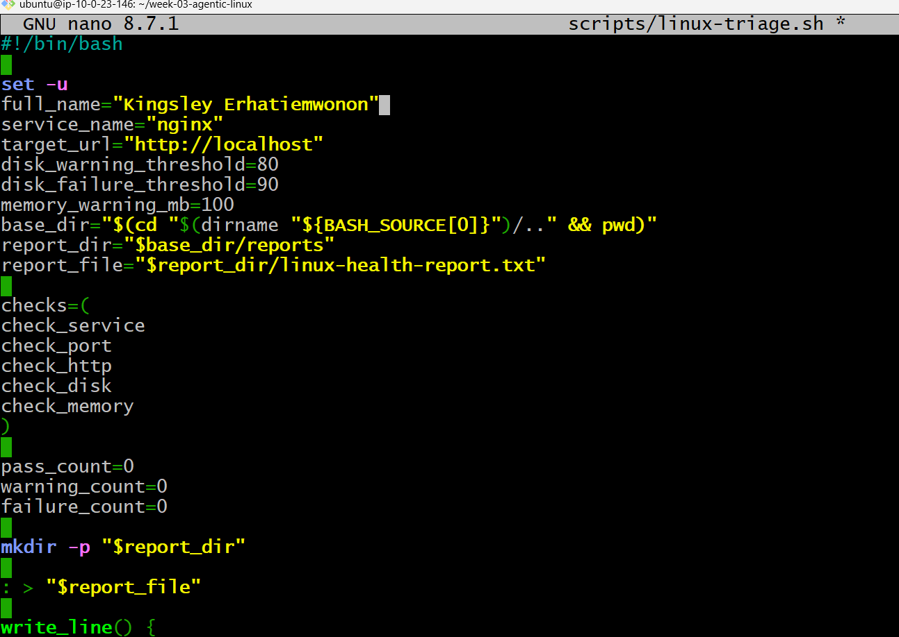

---

#### Screenshot 6 — Middle section showing check functions and conditionals

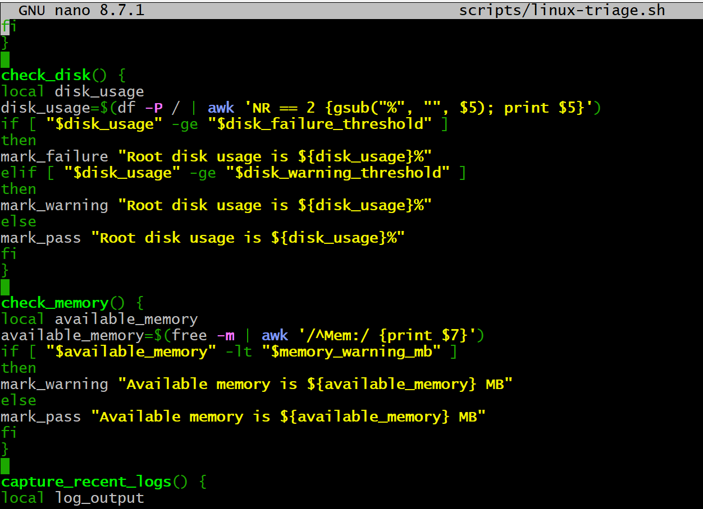

---

#### Screenshot 7 — Bottom section showing the loop, summary function, and exit behavior

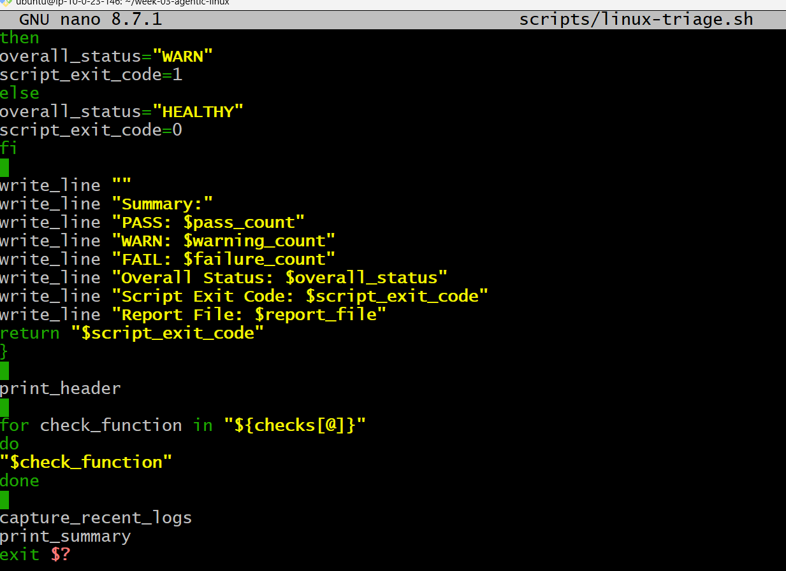

---

#### Screenshot 8 — Output of `bash -n scripts/linux-triage.sh` (no syntax errors) and `ls -l scripts/linux-triage.sh` showing executable permission

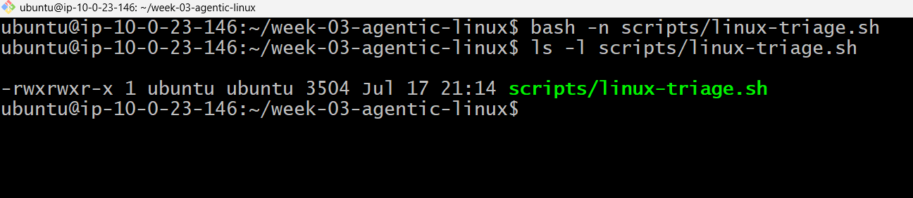

---

### Notes

Answer the following in your own words:

**1. What is stored in the checks array?**

The checks array stores the names of the health check functions that the script needs to run. These functions are check_service, check_port, check_http, check_disk, and check_memory, which are used to test Nginx status, port availability, HTTP response, disk usage, and available memory.

---

**2. How does the `for` loop use that array?**

The for loop uses the checks array to go through each function name one by one and execute the corresponding health check. It runs every check stored in the array automatically, allowing the script to perform all system checks in an organized and repeatable way.

---

**3. Why are the health checks separated into functions?**

The health checks are separated into functions to make the script easier to read, manage, and troubleshoot. Each function handles one specific task, such as checking the service, port, disk, or memory, which makes the code reusable and easier to update without affecting the entire script.

---

**4. What is the purpose of `$(...)` in this script?**

The $(...) syntax is used for command substitution in Bash. It allows the script to run a command and store or use the command's output as a value. For example, $(hostname) gets the server's hostname, and $(date -u ...) captures the current timestamp to include in the report.

---

**5. Why does the script use different exit codes for HEALTHY, WARN, and FAIL?**

The script uses different exit codes to clearly communicate the health status of the system to other tools or automation processes. A 0 exit code means the system is HEALTHY, 1 indicates a WARNING, and 2 indicates a FAILURE, allowing monitoring systems or CI/CD pipelines to quickly detect and respond to issues.

---

# Task 5 — Run and Understand the Healthy-State Report

## Goal

Run the Bash script against the healthy server and verify that it creates a report.

### Evidence

#### Screenshot 9 — Output of `./scripts/linux-triage.sh` showing your Full Name and all five check results

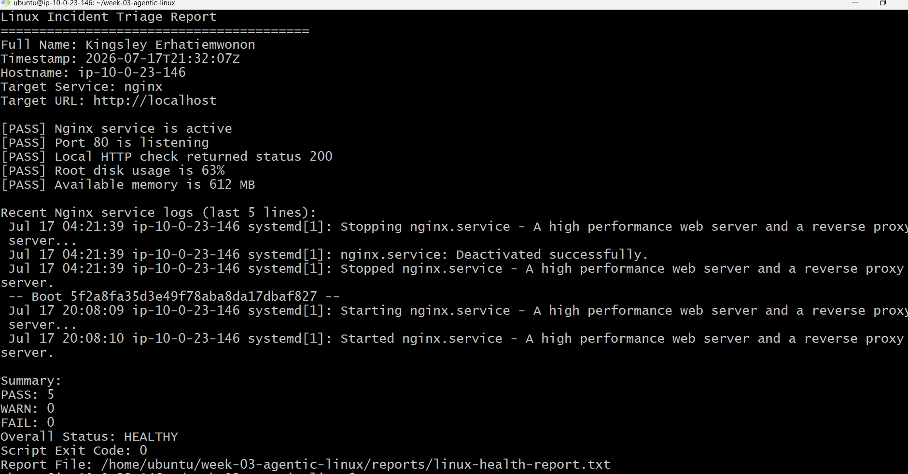

---

#### Screenshot 10 — Output showing the captured exit code and final summary

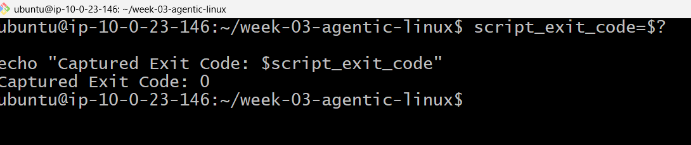

---

### Notes

Answer the following in your own words:

**1. What is the overall status of your healthy baseline?**

The overall status of the healthy baseline is HEALTHY. All five checks passed successfully: Nginx service is active, port 80 is listening, the HTTP check returned status 200, disk usage is within limits at 63%, and available memory is sufficient at 612 MB. The script exited with code 0, confirming that no issues were detected.

---

**2. Which exact Linux evidence proves the application is serving traffic?**

The exact Linux evidence that proves the application is serving traffic is "[PASS] Local HTTP check returned status 200". This confirms that a request to http://localhost was successful and the web server responded correctly with an HTTP 200 status code. Additionally, "[PASS] Port 80 is listening" confirms that the server is accepting HTTP connections.

---

**3. Did your script return exit code 0 or 1? Explain why.**

The script returned exit code 0 because the overall system status was HEALTHY. All five health checks passed successfully, with no warnings or failures detected, so the script completed without any issues.

---

**4. What is the difference between a warning and a failure in this script?**

A warning means the system has a condition that requires attention but is not yet causing a critical problem. For example, high disk usage above the warning threshold or low available memory can trigger a warning.

A failure means a critical issue has been detected that affects system health, such as Nginx being inactive, port 80 not listening, an unsuccessful HTTP check, or disk usage reaching the failure threshold. A failure causes the script to return a higher exit code indicating a serious problem.

---

# Task 6 — Create and Run the /linux-triage Skill

## Goal

Turn the Bash script into a reusable, manually invoked Agentic AI workflow.

### Evidence

#### Screenshot 11 — `SKILL.md` showing the frontmatter, allowed tool restrictions, and safety rules

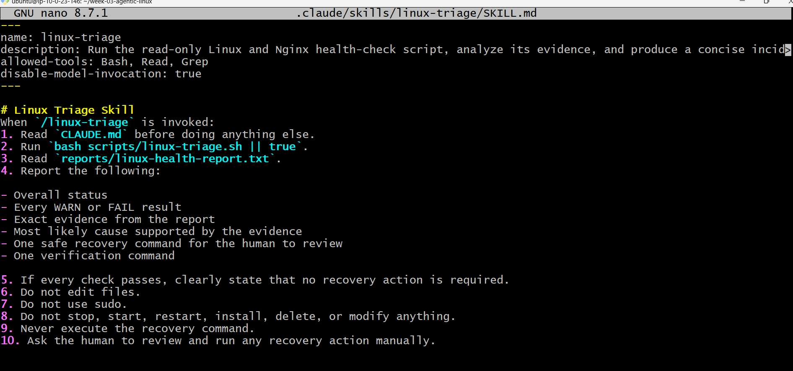

---

#### Screenshot 12 — `/linux-triage` output for the healthy server

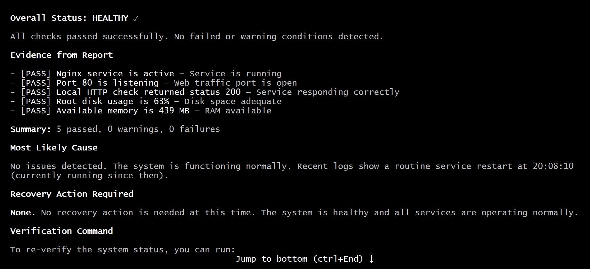

---

### Notes

Answer the following in your own words:

**1. Why does this skill have Bash, Read, and Grep, but not Write?**

This skill has Bash, Read, and Grep but not Write because it is designed for read-only system investigation. Bash is needed to run the health-check script, Read is needed to view files like CLAUDE.md and the health report, and Grep can help search through information. The absence of Write prevents the skill from modifying files or making changes to the system, which keeps the triage process safe.

---

**2. Why is `disable-model-invocation: true` useful for this skill?**

disable-model-invocation: true is useful because it prevents the skill from being triggered automatically by the AI model. It ensures that the Linux triage process only runs when a human explicitly invokes it, reducing the risk of unintended system checks or actions being performed without user approval.

---

**3. What part is performed by Bash, and what part is performed by Claude?**

Bash performs the actual Linux health checks by executing the scripts/linux-triage.sh script, collecting system evidence such as Nginx status, port availability, HTTP response, disk usage, and memory information.

Claude performs the analysis and reporting part by reading the generated report, interpreting the evidence, identifying warnings or failures, explaining the likely cause, and presenting the findings to the human for review.

---

**4. Why is this better than asking Claude "Is my server healthy?" without giving it evidence?**

This is better because the skill collects real evidence from the server before Claude makes any conclusions. Instead of guessing based on a general question, Claude can analyze actual data such as service status, port checks, HTTP responses, disk usage, and memory availability, making the diagnosis more accurate, reliable, and easier to verify.

---

# Task 7 — Simulate an Nginx Incident and Let the Skill Diagnose It

## Goal

Create a controlled service failure, gather evidence through Bash, and let Claude analyze the evidence without taking recovery action.

### Evidence

#### Screenshot 13 — Output showing Nginx is inactive and the HTTP request fails

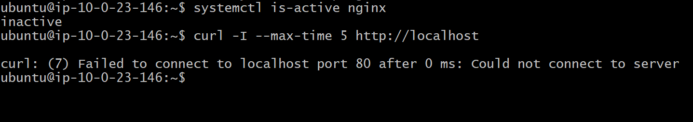

---

#### Screenshot 14 — `/linux-triage` output showing failed evidence, most likely cause, and a suggested recovery command

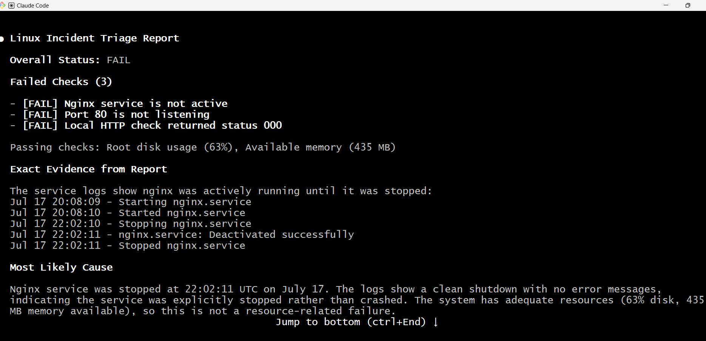

---

#### Screenshot 15 — `incident-failure-report.txt` showing the failed checks and your Full Name

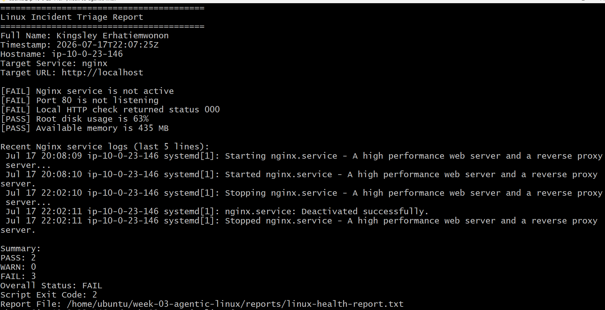

---

### Notes

Answer the following in your own words:

**1. Which three checks failed?**

Nginx service check — The report shows "[FAIL] Nginx service is not active", meaning the Nginx web server is not running.
Port check — The report shows "[FAIL] Port 80 is not listening", meaning the server is not accepting HTTP traffic.
HTTP check — The report shows "[FAIL] Local HTTP check returned status 000", meaning the application did not return a valid HTTP response.

---

**2. What evidence supports the conclusion that Nginx is unavailable?**

The evidence that supports the conclusion that Nginx is unavailable is:

"[FAIL] Nginx service is not active" — this shows that the Nginx service is not running.
"[FAIL] Port 80 is not listening" — this confirms that the server is not accepting HTTP connections.
"[FAIL] Local HTTP check returned status 000" — this shows that no valid HTTP response was received from http://localhost.
The Nginx logs also show "Stopped nginx.service" at 22:02:11, confirming that the service was stopped.

---

**3. Did Claude execute the recovery command? Why is that important?**

No, Claude did not execute the recovery command. This is important because the skill is designed to be read-only and requires a human to review and manually run any recovery action. It prevents unintended system changes, reduces the risk of causing further issues, and ensures that a person remains in control of any corrective action taken on the server.

---

**4. Which phase of the Agentic Loop is represented by the Bash report?**

The Bash report represents the Gather phase of the Agentic Loop. During this phase, Bash collects evidence from the Linux system, such as Nginx status, port availability, HTTP response, disk usage, memory usage, and service logs. This information is then provided to Claude for analysis and decision-making.

---

**5. Which phase is represented by Claude's explanation?**

Claude's explanation represents the Reason phase of the Agentic Loop. In this phase, Claude analyzes the evidence collected by Bash, identifies the problem, explains the likely cause, and provides recommendations based on the available information.

---

# Task 8 — Recover Manually, Verify Again, and Write the Incident Summary

## Goal

Recover the service as the human operator and prove that the system is healthy again.

### Evidence

#### Screenshot 16 — Output showing Nginx is active and `curl -I http://localhost` returns 200 OK

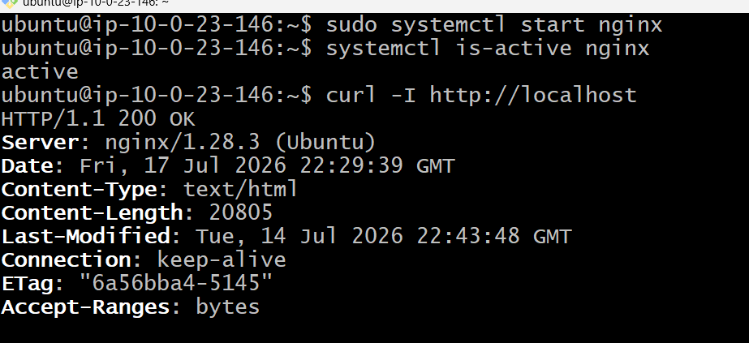

---

#### Screenshot 17 — Second `/linux-triage` output showing successful recovery with no FAIL results

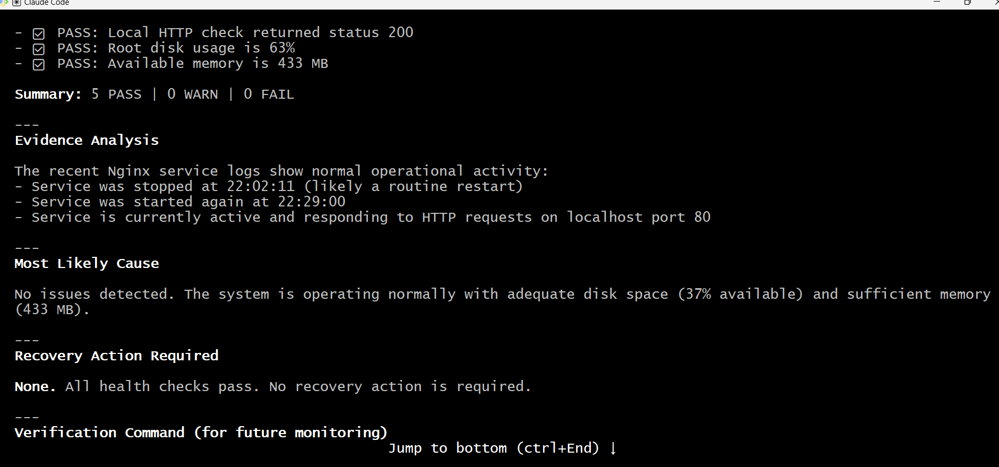

---

#### Screenshot 18 — Output of `ls -lah reports` showing both `incident-failure-report.txt` and `recovery-report.txt`

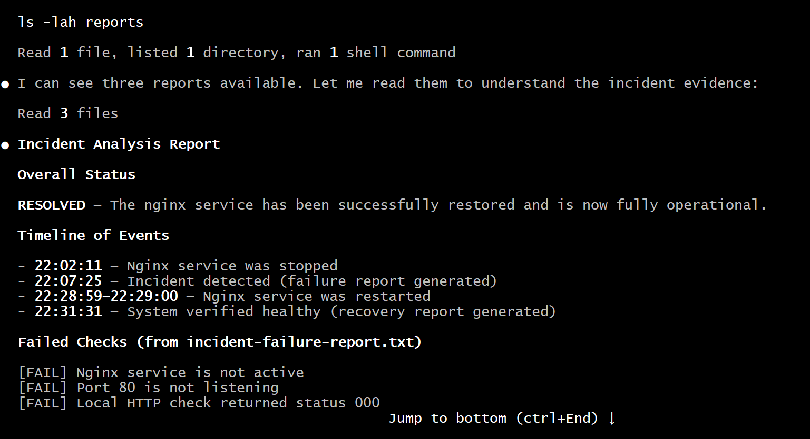

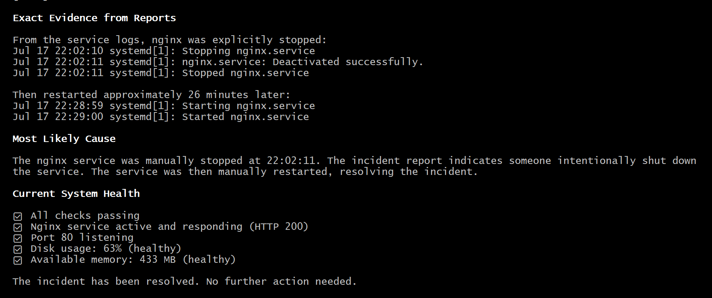

---

#### Screenshot 19 — `incident-summary.md` showing all required sections and your Full Name

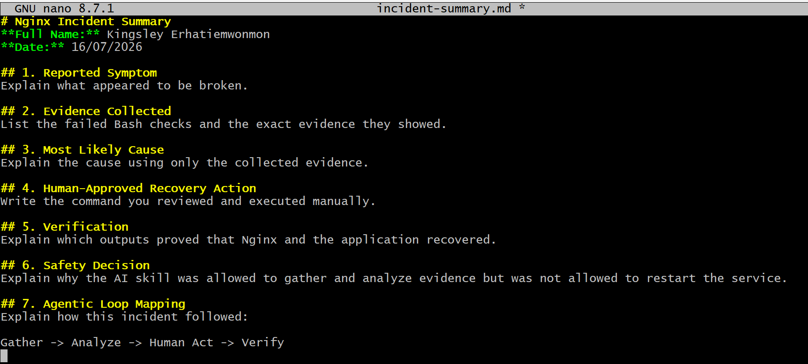

---

### Notes

Answer the following in your own words:

**1. What action did you execute manually?**

The action I executed manually was:

sudo systemctl start nginx

This command was used to start the Nginx service after reviewing the triage report and approving the recovery action manually. The AI skill did not execute this command because it was restricted from making system changes.

---

**2. What evidence proves that the service recovered?**

The evidence that proves the service recovered is:

systemctl is-active nginx returned active, confirming that the Nginx service is running.
curl -I http://localhost returned a successful HTTP response, proving that the web server is responding and serving traffic again.
The Linux triage report showed that the failed checks were resolved after recovery.

---

**3. Why is the second triage run necessary?**

The second triage run is necessary because it verifies that the recovery action actually fixed the problem. It provides fresh evidence from the system after the manual restart, confirming whether Nginx is active, port 80 is available, and the application is responding correctly instead of assuming the issue has been resolved.

---

**4. What could go wrong if an AI agent automatically restarted every failed service?**

If an AI agent automatically restarted every failed service, it could cause unintended damage or hide deeper problems. A restart might temporarily restore service while masking the real cause, interrupt active processes, or make an incident worse. Human review is important to confirm the correct recovery action before making changes to a production system.

---

**5. In one sentence, explain the difference between using AI as a chatbot and using AI in this agentic workflow.**

Using AI as a chatbot provides answers based on user questions, while using AI in an agentic workflow allows it to gather evidence, analyze information, and support decisions through a structured process with human approval for actions.

---

# Incident Summary

Fill in all seven sections below in your own words.

**Full Name:** Kingsley Erhatiemwonmon

**Date:** 17/07/2026

---

**1. Reported Symptom**

The website/application was not available because the Nginx web server was not running. Users could not access the application because HTTP requests were failing.

---

**2. Evidence Collected**

The Bash triage script collected evidence showing:

[FAIL] Nginx service is not active
[FAIL] Port 80 is not listening
[FAIL] Local HTTP check returned status 000
Nginx logs showed that the service was stopped:
Stopped nginx.service - A high performance web server and a reverse proxy server.

The checks for disk usage and memory passed, showing that system resources were not the cause of the issue.

---

**3. Most Likely Cause**

The most likely cause was that the Nginx service had been stopped. The evidence showed that Nginx was inactive, port 80 was unavailable, and the server was not responding to HTTP requests.

---

**4. Human-Approved Recovery Action**

After reviewing the evidence, the recovery command was manually executed:

sudo systemctl start nginx

---

**5. Verification**

The recovery was verified by running:

systemctl is-active nginx

which confirmed that Nginx was active.

The command:

curl -I http://localhost

also returned a successful HTTP response, proving that the application was serving traffic again.

---

**6. Safety Decision**

The AI skill was allowed to gather and analyze evidence because it was designed to perform read-only checks. It was not allowed to restart Nginx because automatic changes could create risks or make incorrect recovery decisions without human approval.

---

**7. Agentic Loop Mapping**

The incident followed the Agentic Loop:

Gather: Bash collected system evidence using the Linux health-check script.
Analyze: Claude reviewed the report, identified the failure, and explained the likely cause.
Human Act: A person reviewed the recommendation and manually ran the recovery command.
Verify: The system was checked again using service status and HTTP tests to confirm recovery.

---

# LinkedIn Post (Required)

## Evidence

#### LinkedIn Post URL

Paste your LinkedIn post URL here:

https://www.linkedin.com/posts/kingsley-erhatiemwonmon_devops-aws-linux-ugcPost-7484027186920755200-l2zm/?utm_source=share&utm_medium=member_desktop&rcm=ACoAAClDkSEBa4Zo6dTWVIEEl8FJLczvH_zPHtY

---

#### Screenshot — Published LinkedIn post

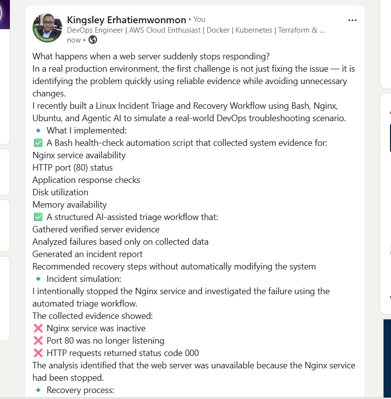

---

# GitHub Repository URL

Paste the URL of your GitHub folder or repository containing the assignment files here:

https://github.com/solutionkingz-glitch/devops-micro-internship-pravinmishra.git

---

# Submission Instructions

- Add all required screenshots in your submission
- Full Name must be visible in required screenshots and the Bash report
- All written answers must be in your own words
- Do not expose sensitive information (keys, passwords, AWS account IDs, tokens)
- GitHub URL must be included in this document

---

# Completion Checklist

- [ ] Task 1: Healthy baseline confirmed, workspace created (Screenshots 1–2, Notes answered)
- [ ] Task 2: CLAUDE.md created with all four sections (Screenshot 3, Notes answered)
- [ ] Task 3: Five-check plan produced by Claude using read-only tools (Screenshot 4, Notes answered)
- [ ] Task 4: `linux-triage.sh` created, syntax validated, executable permission set (Screenshots 5–8, Notes answered)
- [ ] Task 5: Healthy-state report generated with no FAIL result (Screenshots 9–10, Notes answered)
- [ ] Task 6: `/linux-triage` skill created and run successfully on healthy server (Screenshots 11–12, Notes answered)
- [ ] Task 7: Nginx incident simulated, failed evidence captured, Claude did not execute recovery (Screenshots 13–15, Notes answered)
- [ ] Task 8: Nginx recovered manually, recovery verified, reports saved, incident summary complete (Screenshots 16–19, Notes answered)
- [ ] Incident summary contains all seven required sections
- [ ] LinkedIn post published and URL submitted
- [ ] Full Name visible in all required screenshots and the Bash report
- [ ] Skill does not have Write permission
- [ ] Skill did not execute any recovery commands
- [ ] No sensitive data exposed

---

## 📌 About DMI & CloudAdvisory

DevOps Micro Internship (DMI) is a project-based DevOps program run by Pravin Mishra (The CloudAdvisory) focused on real-world execution, systems thinking, and career readiness.

It helps learners build strong DevOps foundations with hands-on experience.

---

## 📌 Resources

- 🌐 DMI Official Website: https://pravinmishra.com/dmi  
- 🎓 DevOps for Beginners (Udemy): https://www.udemy.com/course/devops-for-beginners-docker-k8s-cloud-cicd-4-projects/  
- 🎓 Agentic AI DevOps with Claude Code: https://www.udemy.com/course/ultimate-agentic-ai-devops-with-claude-code/  
- 🎓 DevOps with Claude Code: Terraform, EKS, ArgoCD & Helm: https://www.udemy.com/course/devops-with-claude-code-terraform-eks-argocd-helm/  
- ▶️ YouTube Playlist: https://www.youtube.com/playlist?list=PLFeSNDtI4Cho  
- 🔗 Pravin Mishra (LinkedIn): https://www.linkedin.com/in/pravin-mishra-aws-trainer/  
- 🏢 CloudAdvisory (LinkedIn): https://www.linkedin.com/company/thecloudadvisory/

---

*This submission is part of DevOps Micro Internship (DMI) Cohort 3 — Agentic AI Track.*