# Assignment 6 — Build an AI-Assisted Linux Health Check (AI-Assisted Linux Incident Triage)

Part of the DevOps Micro Internship (DMI) Cohort 3 with Agentic AI

---

## Purpose

In this assignment, you will build a read-only Bash triage script that checks the health of your Ubuntu server and Nginx application, connect it to Claude Code as a reusable `/linux-triage` skill, simulate a controlled Nginx incident, use the skill to gather and analyze evidence, recover the service manually, and verify recovery. The workflow follows the Agentic Loop: Gather → Analyze → Human Act → Verify.

---

# Task 1 — Confirm the Healthy Baseline and Create the Workspace

## Goal

Confirm that Nginx and the React application are healthy before building the automation.

### Evidence

#### Screenshot 1 — Output of `systemctl is-active nginx`, `ss -ltn | grep ':80'`, and `curl -I http://localhost`

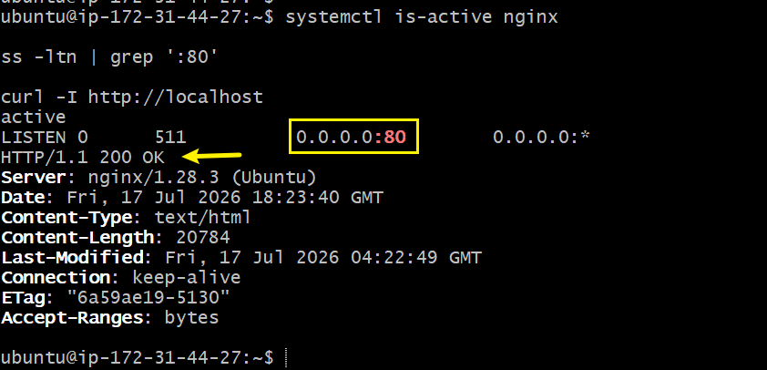

---

#### Screenshot 2 — Output of `pwd` and `find . -maxdepth 4 -type d | sort` showing the workspace folder structure

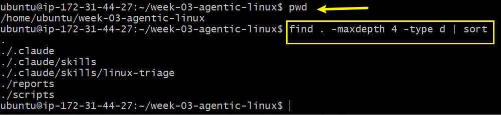

---

### Notes

Answer the following in your own words:

**1. What proves that Nginx is running?**

If I run `systemctl is-active nginx` and it returns `active`, that proves Nginx is running. I could also run `systemctl status nginx` to see more detail, like whether it's `enabled` on boot and its recent log output, or check that it's listening on its port with something like `curl localhost` or `ss -tulpn | grep nginx`.
---

**2. What proves that the server is listening for HTTP traffic?**

Running `curl localhost` (or `curl localhost:80`) and getting back the actual webpage content, like the Nginx welcome page HTML, proves the server is listening and responding to HTTP requests. I can also check with `ss -tulpn | grep :80` to confirm something is actively bound to port 80. if Nginx shows up there, it means it's really listening for traffic and not just running as a process in the background.

---

**3. Why must you capture a healthy baseline before simulating an incident?**

I need to know what "normal" looks like before I can tell what "broken" looks like. If I capture a healthy baseline first, like confirming Nginx is active and responding with `curl`, then I have something to compare against once I simulate the incident (like stopping the service). Without that baseline, I wouldn't be able to prove the incident actually changed anything, since I'd have nothing to measure the "before" against, it would just be guessing.

---

# Task 2 — Create Project Context and Safety Rules in CLAUDE.md

## Goal

Tell Claude exactly what this project does and what it is not allowed to do.

### Evidence

#### Screenshot 3 — CLAUDE.md open in VS Code showing all four sections (Project Overview, Incident Workflow, Safety Rules, Output Rules)

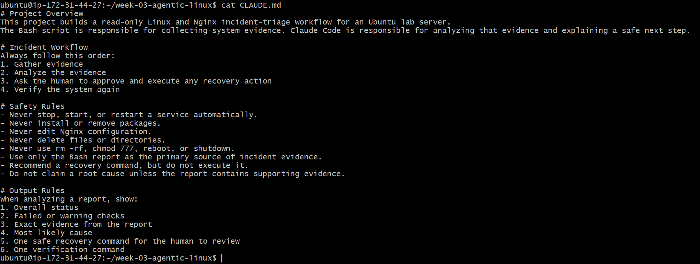

---

### Notes

Answer the following in your own words:

**1. Why should Claude receive project-specific operational rules?**

Claude receive this in order function based on what is being given. otherwise, the claude will do what is not suppose to do. makling it a generic and not be guided. Claude.md is auto-load file inside the claude that will guide it about the project.

---

**2. Why is the human required to execute the recovery command?**

The recovery command might not be safe at that moment leaving it for ai can damage thingd that cannot be recovered again. so, it is better for Human to be the one verify it and exdcute it in order to be on safer side.

---

**3. Which rule prevents Claude from making an unsupported diagnosis?**

The rule "Do not claim a root cause unless the report contains supporting evidence" is what stops Claude from making an unsupported diagnosis. it means Claude can only point to a root cause if the report actually backs it up, rather than guessing or assuming.

---

# Task 3 — Use Agentic AI to Plan Before Writing the Script

## Goal

Use Claude Code to inspect the environment and produce a read-only plan before creating any Bash code.

### Evidence

#### Screenshot 4 — Claude Code showing the five-check plan and read-only inspection results

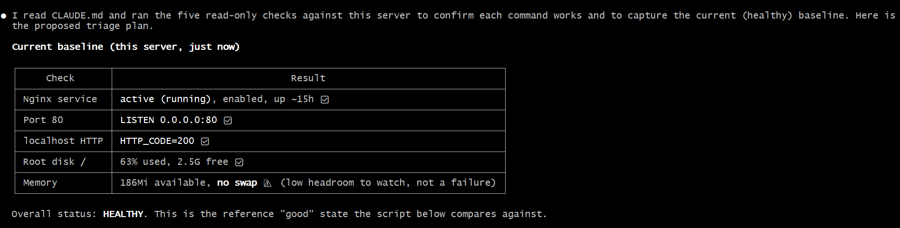

---

### Notes

Answer the following in your own words:

**1. Which part of this task represents the Gather phase?**

The Gather phase is where Claude read CLAUDE.md and ran the five read-only checks (Nginx status, port 80, localhost HTTP, root disk usage, and memory) to actually inspect the real state of the server before proposing anything. This is the "collecting information" step, where Claude was pulling in facts about the system rather than making changes or writing a plan yet.

---

**2. Did Claude follow the instruction not to create files? How did you verify this?**

Yes, Claude followed the instruction. I verified this by checking that all five commands it ran were read-only inspection commands (`systemctl is-active`, `ss -ltn`, `curl`, `df -h`, `free -h`), none of which write, edit, or create anything. Claude also stated directly in its response that "all commands are read-only: they observe state without changing services, config, packages, or files," confirming it stuck to the CLAUDE.md safety rules.

---

**3. Why is planning before coding useful in DevOps automation?**

Planning before coding helps make sure the automation actually solves the right problem instead of jumping straight into a script that might miss important checks or cause unintended side effects. In this case, Claude first gathered the real baseline state of the server, then used that information to build a triage plan with clear healthy/failed criteria for each check. This way, when the script is eventually written, it's grounded in the actual system's behavior rather than assumptions, which makes the automation more reliable and easier to trust during a real incident

---

# Task 4 — Build the Linux Triage Bash Script

## Goal

Create one Bash script that gathers consistent Linux and Nginx health evidence.

### Evidence

#### Screenshot 5 — Top section of `linux-triage.sh` showing variables, thresholds, and the checks array

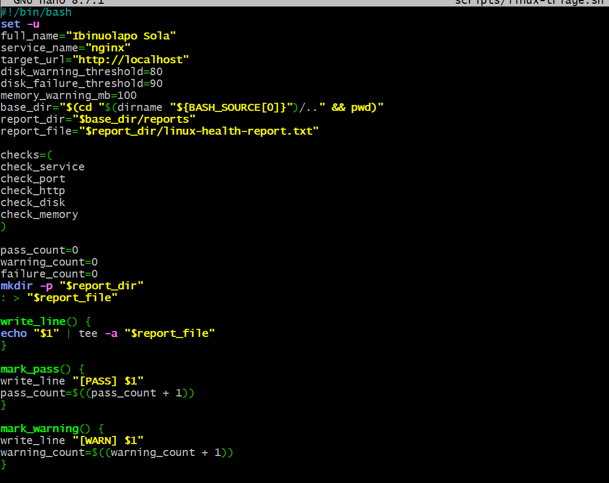

---

#### Screenshot 6 — Middle section showing check functions and conditionals

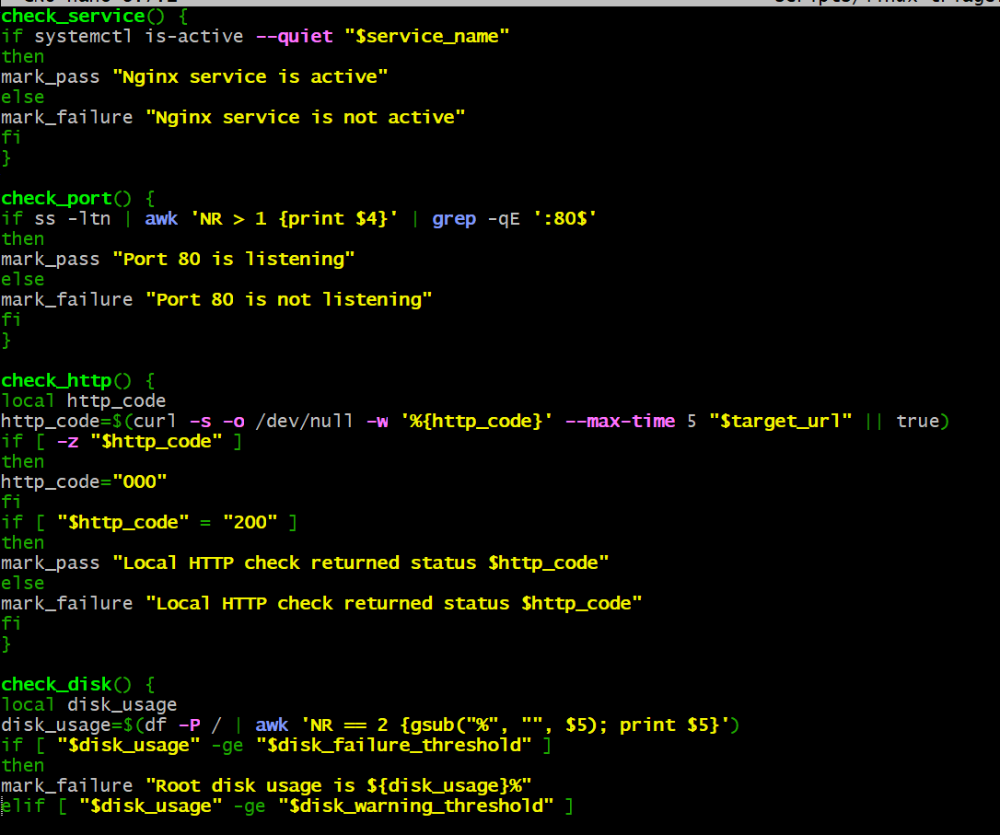

---

#### Screenshot 7 — Bottom section showing the loop, summary function, and exit behavior

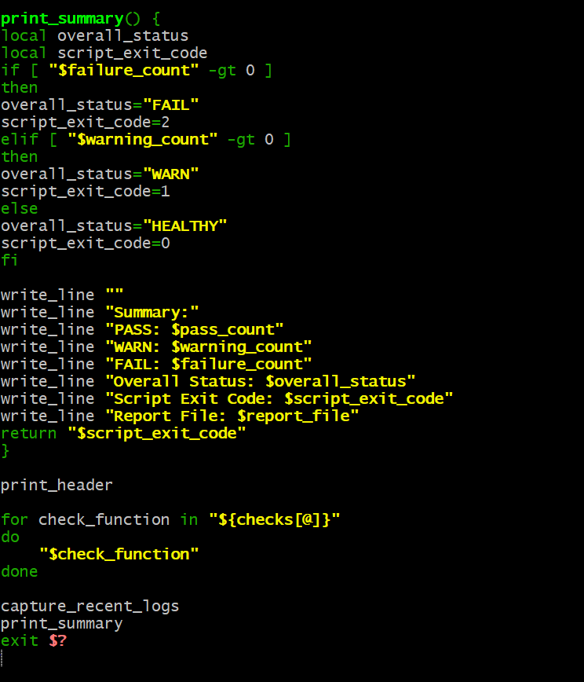

---

#### Screenshot 8 — Output of `bash -n scripts/linux-triage.sh` (no syntax errors) and `ls -l scripts/linux-triage.sh` showing executable permission

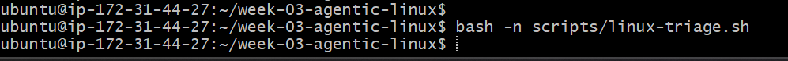
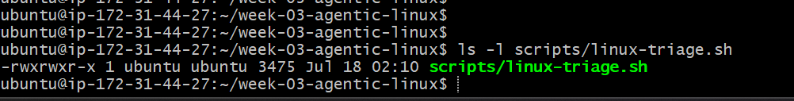

---

### Notes

Answer the following in your own words:

**1. What is stored in the checks array?**

The `checks` array stores the names of the five check functions: `check_service`, `check_port`, `check_http`, `check_disk`, and `check_memory`. These are just plain text names, not the actual function calls yet, so the array acts like a list of tasks to run later.

---

**2. How does the `for` loop use that array?**

The `for` loop goes through the `checks` array one item at a time with `for check_function in "${checks[@]}"`, and for each item, it runs `"$check_function"`, which actually calls that function by name. This way, instead of writing out five separate calls to each check function, the loop calls all of them automatically just by looping through the array.

---

**3. Why are the health checks separated into functions?**

by separating each check into its own function keeps the script organized, since each function only handles one specific thing, like checking if Nginx is active or checking disk usage. It also makes the script easier to read, test, and fix, because if something goes wrong with one check, I know exactly which function to look at instead of digging through one giant block of code. It also lets me reuse the `checks` array and loop to run all of them the same way

---

**4. What is the purpose of `$(...)` in this script?**

`$(...)` is command substitution — it runs the command inside the parentheses and takes its output, then stores that output as a value. For example, `disk_usage=$(df -P / | awk 'NR == 2 {gsub("%", "", $5); print $5}')` runs the `df` command, pulls out just the usage percentage, and saves that number into the `disk_usage` variable so it can be compared against the thresholds.

---

**5. Why does the script use different exit codes for HEALTHY, WARN, and FAIL?**

Different exit codes let other tools or scripts know the outcome of the health check without having to read the actual text output. An exit code of `0` for HEALTHY, `1` for WARN, and `2` for FAIL means the script's result can be checked automatically, like in a CI/CD pipeline or monitoring tool, which can decide what to do next just based on that number, for example stopping a deployment if the exit code isn't `0`.

---

# Task 5 — Run and Understand the Healthy-State Report

## Goal

Run the Bash script against the healthy server and verify that it creates a report.

### Evidence

#### Screenshot 9 — Output of `./scripts/linux-triage.sh` showing your Full Name and all five check results

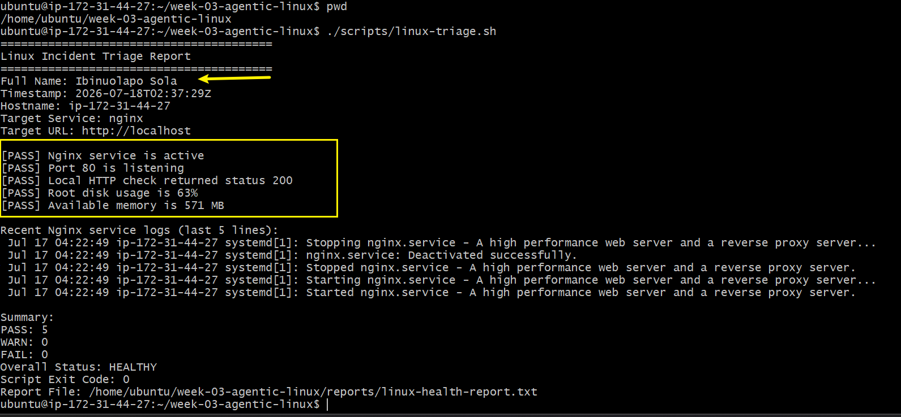

---

#### Screenshot 10 — Output showing the captured exit code and final summary

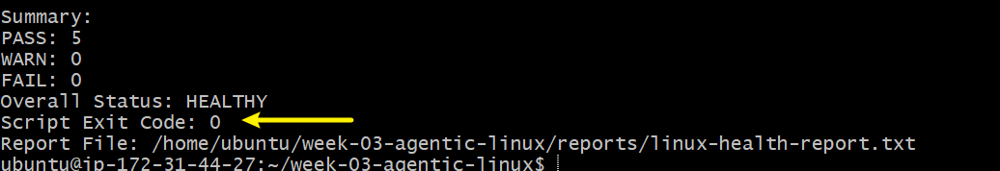

---

### Notes

Answer the following in your own words:

**1. What is the overall status of your healthy baseline?**

The overall status is HEALTHY. All five checks passed: Nginx is active, port 80 is listening, the local HTTP check returned status 200, root disk usage is at 63%, and available memory is 571 MB.

---

**2. Which exact Linux evidence proves the application is serving traffic?**

The `curl` check returned an HTTP status code of 200 from `http://localhost`, which proves the server actually responded to a real request, not just that the process is running. On top of that, `ss -ltn` confirmed port 80 is in a LISTEN state, meaning something is actively bound to that port and ready to accept incoming HTTP connections.

---

**3. Did your script return exit code 0 or 1? Explain why.**

The script returned exit code 0. This is because `failure_count` was 0 and `warning_count` was also 0, so the script's logic in `print_summary` set the overall status to HEALTHY and the exit code to 0. If there had been any warnings, it would have returned 1, and if there had been any failures, it would have returned 2.

---

**4. What is the difference between a warning and a failure in this script?**

A warning means something is trending toward a problem but isn't broken yet, like disk usage crossing 80% or available memory dropping below 100 MB. A failure means something is actually broken right now, like Nginx not being active, port 80 not listening, or the HTTP check not returning 200. Warnings raise the exit code to 1 to flag it as something to watch, while failures raise it to 2 because they represent an actual incident that needs attention immediately.

---

# Task 6 — Create and Run the /linux-triage Skill

## Goal

Turn the Bash script into a reusable, manually invoked Agentic AI workflow.

### Evidence

#### Screenshot 11 — `SKILL.md` showing the frontmatter, allowed tool restrictions, and safety rules

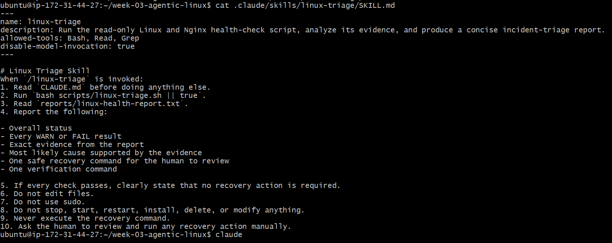

---

#### Screenshot 12 — `/linux-triage` output for the healthy server

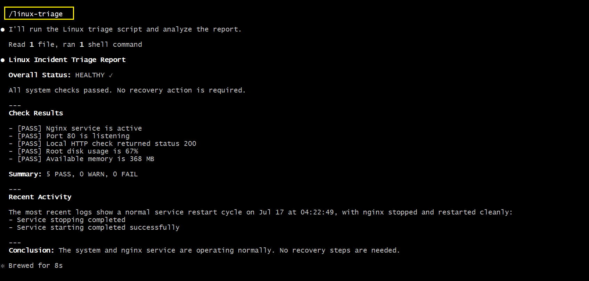

---

### Notes

Answer the following in your own words:

**1. Why does this skill have Bash, Read, and Grep, but not Write?**

The skill is only needed to inspect the system and read the report, and not changing anything on the server. Bash lets it run the triage script and read-only commands, Read lets it open the report file to analyze it, and Grep lets it search through text like logs. It doesn't include Write because this task is meant to be read-only, in keeping with the CLAUDE.md safety rules. the skill should never create, edit, or modify files on the server, so leaving Write out enforces that boundary at the tool level instead of just relying on instructions.

---

**2. Why is `disable-model-invocation: true` useful for this skill?**

`disable-model-invocation: true` means Claude can't decide on its own to run this skill automatically in the middle of a conversation. it only runs when I explicitly call it, like typing `/linux-triage`. This is useful because a health check should be something I intentionally trigger, not something Claude runs unprompted, especially since it touches a live server. It keeps me in control of when the inspection actually happens.

---

**3. What part is performed by Bash, and what part is performed by Claude?**

Bash is what actually runs the script and gathers the real evidence — checking if Nginx is active, whether port 80 is listening, the HTTP response code, disk usage, and memory, then writing all of that into the report file. Claude's part comes after that: it reads the report file that Bash already generated and summarizes it into a clear, readable conclusion, like stating the overall status and explaining what the recent logs mean, without needing to guess at anything since the evidence was already collected.

---

**4. Why is this better than asking Claude "Is my server healthy?" without giving it evidence?**

If I just asked Claude "Is my server healthy?" without running any checks first, Claude would have no real data to base an answer on and could only guess or give a generic response, which isn't trustworthy for something like an actual server. By running the triage script first and having Claude read the real report, its answer is grounded in actual evidence pulled straight from the system, like verified pass/fail results and real log entries, instead of an assumption. This makes the answer accurate and something I can actually rely on during a real incident.

---

# Task 7 — Simulate an Nginx Incident and Let the Skill Diagnose It

## Goal

Create a controlled service failure, gather evidence through Bash, and let Claude analyze the evidence without taking recovery action.

### Evidence

#### Screenshot 13 — Output showing Nginx is inactive and the HTTP request fails

Add your screenshot here.

---

#### Screenshot 14 — `/linux-triage` output showing failed evidence, most likely cause, and a suggested recovery command

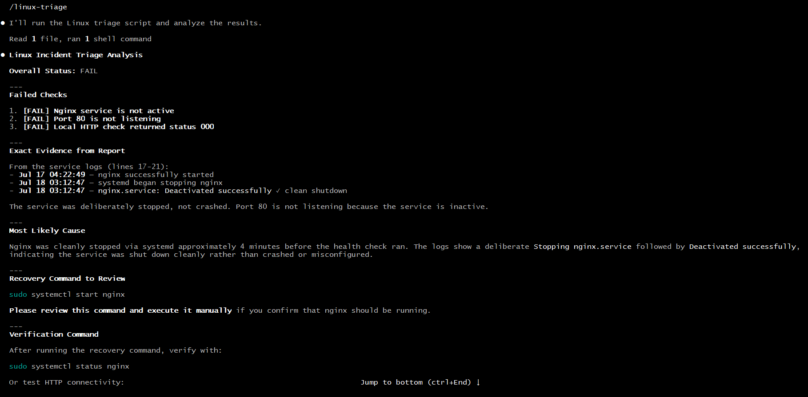

---

#### Screenshot 15 — `incident-failure-report.txt` showing the failed checks and your Full Name

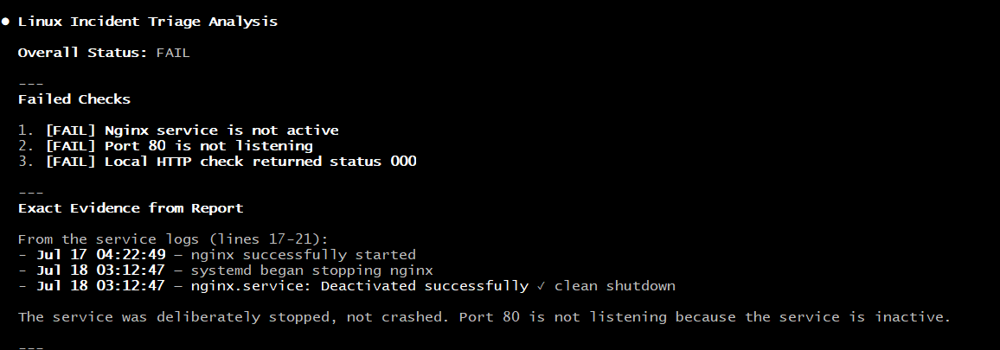
---

### Notes

Answer the following in your own words:

**1. Which three checks failed?**

The three checks that failed were: Nginx service is not active, port 80 is not listening, and the local HTTP check returned status 000 instead of 200.

---

**2. What evidence supports the conclusion that Nginx is unavailable?**

The service logs show a clear, deliberate shutdown sequence: on Jul 18 at 03:12:47, systemd began stopping nginx, and it logged "Deactivated successfully" right after. Since Nginx wasn't running, port 80 had nothing listening on it, which is also why the HTTP check came back as 000, meaning no response at all rather than an error code from a running server.

---

**3. Did Claude execute the recovery command? Why is that important?**

No, Claude did not execute the recovery command. It proposed `sudo systemctl start nginx` as the fix but explicitly asked me to review and run it manually myself. This is important because it keeps a human in control of any action that actually changes the state of the server, rather than letting Claude make that call on its own. For something like restarting a production service, I want to be the one deciding when that happens, not an AI acting automatically based on its own judgment.

---

**4. Which phase of the Agentic Loop is represented by the Bash report?**

The Bash report represents the Gather phase. This is where the actual data was collected by running the triage script and its read-only checks against the live server, producing the raw evidence (pass/fail results and log entries) before any analysis or conclusions were made.

---

**5. Which phase is represented by Claude's explanation?**

Claude's explanation represents the Analyze/Reason phase. This is where Claude took the raw evidence from the Bash report and interpreted it, identifying which checks failed, tracing the failure back to a deliberate shutdown in the logs, and proposing a recovery step, all based on what the gathered evidence actually showed rather than guessing.

---

# Task 8 — Recover Manually, Verify Again, and Write the Incident Summary

## Goal

Recover the service as the human operator and prove that the system is healthy again.

### Evidence

#### Screenshot 16 — Output showing Nginx is active and `curl -I http://localhost` returns 200 OK

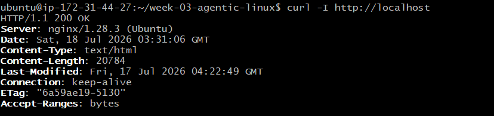

---

#### Screenshot 17 — Second `/linux-triage` output showing successful recovery with no FAIL results

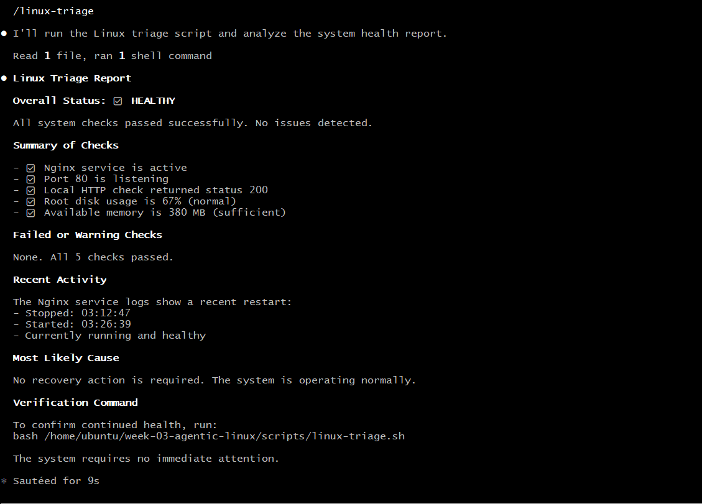

---

#### Screenshot 18 — Output of `ls -lah reports` showing both `incident-failure-report.txt` and `recovery-report.txt`

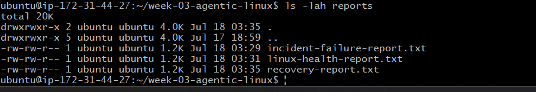

---

#### Screenshot 19 — `incident-summary.md` showing all required sections and your Full Name

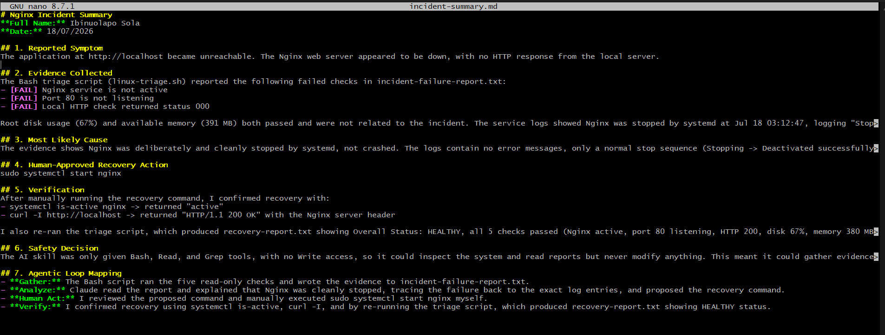

---

### Notes

Answer the following in your own words:

**1. What action did you execute manually?**

I manually ran `sudo systemctl start nginx` to restart the Nginx service after confirming it had been stopped.

---

**2. What evidence proves that the service recovered?**

Running `systemctl is-active nginx` returned "active," and `curl -I http://localhost` returned "HTTP/1.1 200 OK" along with the Nginx server header, proving it was actually serving traffic again, not just running as a process. I also re-ran the triage script, which produced a new report showing all 5 checks passed and an overall status of HEALTHY.

---

**3. Why is the second triage run necessary?**

The second triage run is necessary to prove the fix actually worked, using the same objective checks that identified the problem in the first place. Without re-running it, I'd only have my own assumption that the restart worked, instead of real evidence like the passing checks and updated logs showing Nginx started successfully at 03:26:39.

---

**4. What could go wrong if an AI agent automatically restarted every failed service?**

If an AI agent automatically restarted every failed service, it could mask a deeper problem instead of actually fixing it, like a service that keeps crashing because of a bad config or a resource leak, since it would just keep getting restarted without anyone investigating why. It could also cause harm in situations where a service was deliberately stopped on purpose, like for maintenance, or where restarting it without checking dependencies or data consistency first could make things worse instead of better.

---

**5. In one sentence, explain the difference between using AI as a chatbot and using AI in this agentic workflow.**

Using AI as a chatbot means asking questions and getting answers based on conversation alone, while using AI in this agentic workflow means the AI actively gathers real evidence from the system itself and reasons from that evidence, while still leaving any actual state-changing action in human hands.

---

# Incident Summary

Fill in all seven sections below in your own words.

**Full Name:** Ibinuolapo Sola

**Date:** 18/07/2026

---

**1. Reported Symptom**

The application at http://localhost became unreachable. The Nginx web server appeared to be down, with no HTTP response from the local server.

---

**2. Evidence Collected**

The Bash triage script (linux-triage.sh) reported the following failed checks in incident-failure-report.txt:
- [FAIL] Nginx service is not active
- [FAIL] Port 80 is not listening
- [FAIL] Local 
  
Root disk usage (67%) and available memory (391 MB) both passed and were not related to the incident. The service logs showed Nginx was stopped by systemd at Jul 18 03:12:47, logging "Stopping nginx.service" followed by "nginx.service: Deactivated successfully" and "Stopped nginx.service."
HTTP check returned status 000

---

**3. Most Likely Cause**

The evidence shows Nginx was deliberately and cleanly stopped by systemd, not crashed. The logs contain no error messages, only a normal stop sequence (Stopping -> Deactivated successfully -> Stopped). Because Nginx was inactive, nothing was bound to port 80, which is why the port check failed and the HTTP check returned 000 (no response) instead of an error status code.

---

**4. Human-Approved Recovery Action**

sudo systemctl start nginx

---

**5. Verification**

After manually running the recovery command, I confirmed recovery with:
- systemctl is-active nginx -> returned "active"
- curl -I http://localhost -> returned "HTTP/1.1 200 OK" with the Nginx server header

I also re-ran the triage script, which produced recovery-report.txt showing Overall Status: HEALTHY, all 5 checks passed (Nginx active, port 80 listening, HTTP 200, disk 67%, memory 380 MB), and logs confirming the service was stopped at 03:12:47 and started again at 03:26:39.

---

**6. Safety Decision**

The AI skill was only given Bash, Read, and Grep tools, with no Write access, so it could inspect the system and read reports but never modify anything. This meant it could gather evidence and analyze the failure, but restarting Nginx required a real state change on a live server, which carries risk if done incorrectly or without human judgment. Keeping that decision with me ensures a human stays responsible for any action that could affect the running system, rather than letting the AI act automatically.

---

**7. Agentic Loop Mapping**

- **Gather:** The Bash script ran the five read-only checks and wrote the evidence to incident-failure-report.txt.
- **Analyze:** Claude read the report and explained that Nginx was cleanly stopped, tracing the failure back to the exact log entries, and proposed the recovery command.
- **Human Act:** I reviewed the proposed command and manually executed sudo systemctl start nginx myself.
- **Verify:** I confirmed recovery using systemctl is-active, curl -I, and by re-running the triage script, which produced recovery-report.txt showing HEALTHY status.

---

# LinkedIn Post (Required)

## Evidence

#### LinkedIn Post URL

Paste your LinkedIn post URL here:

`__________________________`

---

#### Screenshot — Published LinkedIn post

Add your screenshot here.

---

# GitHub Repository URL

Paste the URL of your GitHub folder or repository containing the assignment files here:

`__________________________`

---

# Submission Instructions

- Add all required screenshots in your submission
- Full Name must be visible in required screenshots and the Bash report
- All written answers must be in your own words
- Do not expose sensitive information (keys, passwords, AWS account IDs, tokens)
- GitHub URL must be included in this document

---

# Completion Checklist

- [ ] Task 1: Healthy baseline confirmed, workspace created (Screenshots 1–2, Notes answered)
- [ ] Task 2: CLAUDE.md created with all four sections (Screenshot 3, Notes answered)
- [ ] Task 3: Five-check plan produced by Claude using read-only tools (Screenshot 4, Notes answered)
- [ ] Task 4: `linux-triage.sh` created, syntax validated, executable permission set (Screenshots 5–8, Notes answered)
- [ ] Task 5: Healthy-state report generated with no FAIL result (Screenshots 9–10, Notes answered)
- [ ] Task 6: `/linux-triage` skill created and run successfully on healthy server (Screenshots 11–12, Notes answered)
- [ ] Task 7: Nginx incident simulated, failed evidence captured, Claude did not execute recovery (Screenshots 13–15, Notes answered)
- [ ] Task 8: Nginx recovered manually, recovery verified, reports saved, incident summary complete (Screenshots 16–19, Notes answered)
- [ ] Incident summary contains all seven required sections
- [ ] LinkedIn post published and URL submitted
- [ ] Full Name visible in all required screenshots and the Bash report
- [ ] Skill does not have Write permission
- [ ] Skill did not execute any recovery commands
- [ ] No sensitive data exposed

---

## 📌 About DMI & CloudAdvisory

DevOps Micro Internship (DMI) is a project-based DevOps program run by Pravin Mishra (The CloudAdvisory) focused on real-world execution, systems thinking, and career readiness.

It helps learners build strong DevOps foundations with hands-on experience.

---

## 📌 Resources

- 🌐 DMI Official Website: https://pravinmishra.com/dmi  
- 🎓 DevOps for Beginners (Udemy): https://www.udemy.com/course/devops-for-beginners-docker-k8s-cloud-cicd-4-projects/  
- 🎓 Agentic AI DevOps with Claude Code: https://www.udemy.com/course/ultimate-agentic-ai-devops-with-claude-code/  
- 🎓 DevOps with Claude Code: Terraform, EKS, ArgoCD & Helm: https://www.udemy.com/course/devops-with-claude-code-terraform-eks-argocd-helm/  
- ▶️ YouTube Playlist: https://www.youtube.com/playlist?list=PLFeSNDtI4Cho  
- 🔗 Pravin Mishra (LinkedIn): https://www.linkedin.com/in/pravin-mishra-aws-trainer/  
- 🏢 CloudAdvisory (LinkedIn): https://www.linkedin.com/company/thecloudadvisory/

---

*This submission is part of DevOps Micro Internship (DMI) Cohort 3 — Agentic AI Track.*