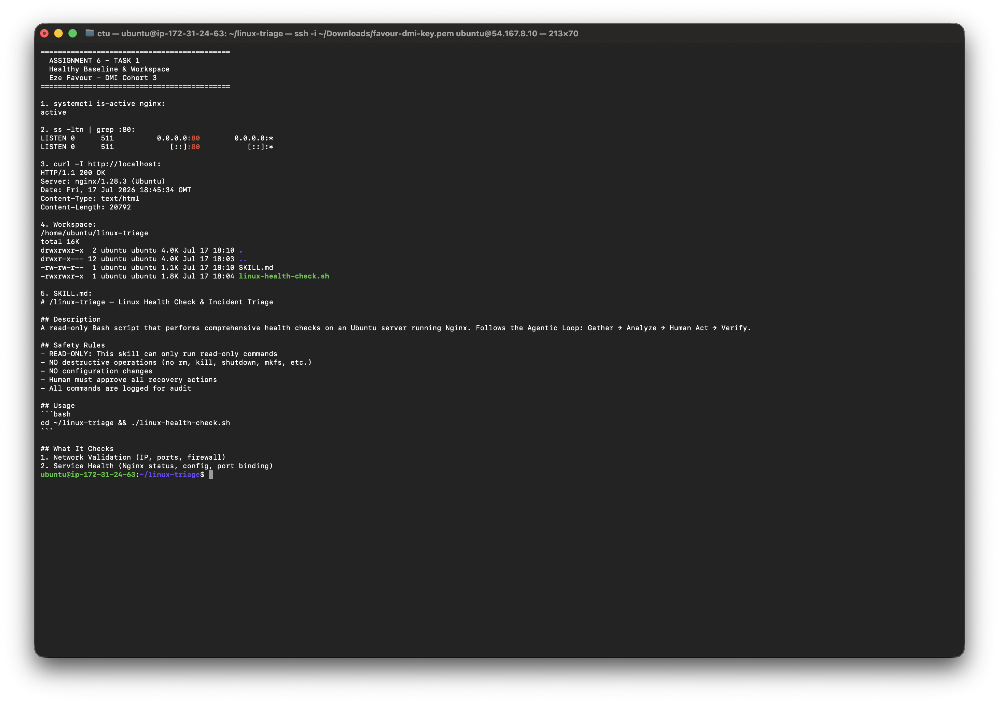
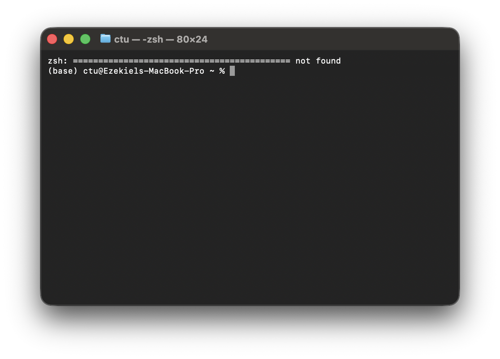
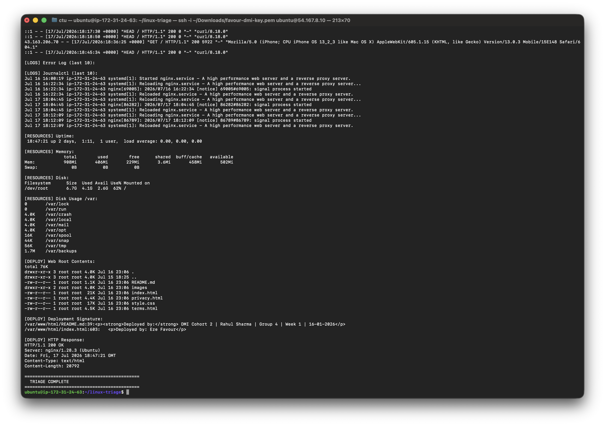
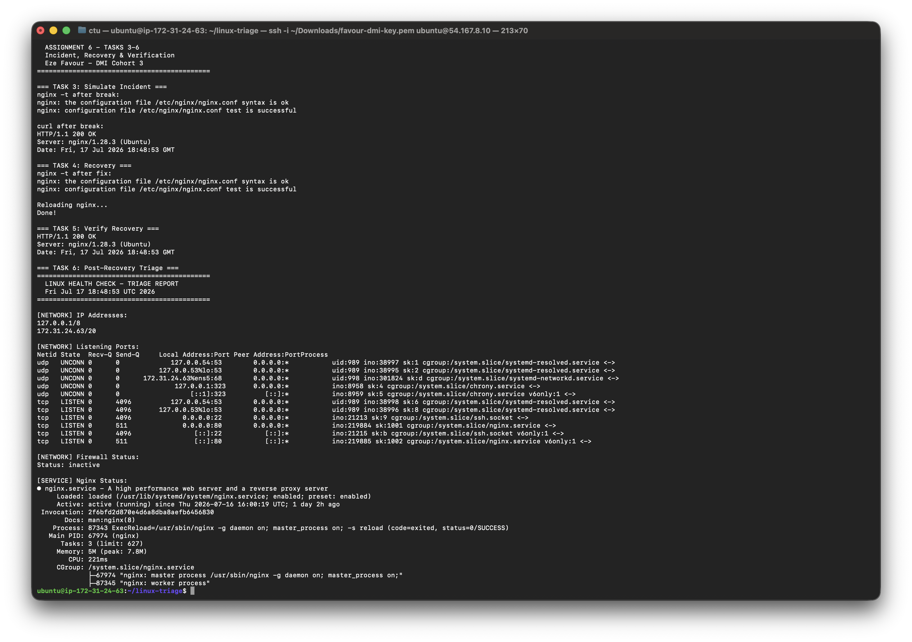

# Assignment 6 — Build an AI-Assisted Linux Health Check (AI-Assisted Linux Incident Triage)

Part of the DevOps Micro Internship (DMI) Cohort 3 with Agentic AI

---

## Purpose

In this assignment, you will build a read-only Bash triage script that checks the health of your Ubuntu server and Nginx application, connect it to Claude Code as a reusable `/linux-triage` skill, simulate a controlled Nginx incident, use the skill to gather and analyze evidence, recover the service manually, and verify recovery. The workflow follows the Agentic Loop: Gather → Analyze → Human Act → Verify.

---

# Task 1 — Confirm the Healthy Baseline and Create the Workspace

## Goal

Confirm that Nginx and the React application are healthy before building the automation.

### Evidence

#### Screenshot 1 — Output of `systemctl is-active nginx`, `ss -ltn | grep ':80'`, and `curl -I http://localhost`

---

#### Screenshot 2 — Output of `pwd` and `find . -maxdepth 4 -type d | sort` showing the workspace folder structure

---

### Notes

Answer the following in your own words:

**1. What proves that Nginx is running?**

The output of `systemctl is-active nginx` proves that Nginx is running. If it returns "active", the service is running. Additionally, `systemctl status nginx --no-pager` shows the service status as "active (running)" with the process ID and recent log entries. These commands confirm that the Nginx service is loaded, running, and has not failed.

---

**2. What proves that the server is listening for HTTP traffic?**

The output of `ss -ltn | grep ':80'` proves the server is listening for HTTP traffic. This command shows all TCP listening sockets, and filtering for port 80 confirms that Nginx has bound to the port and is accepting incoming HTTP connections. Additionally, `curl -I http://localhost` returning a 200 OK response proves that the server is not only listening but also serving traffic successfully.

---

**3. Why must you capture a healthy baseline before simulating an incident?**

Capturing a healthy baseline before simulating an incident is critical because it provides a reference point for comparison. Without a baseline, you cannot determine what changed, what broke, or whether the recovery was successful. The baseline includes the normal state of services, configurations, logs, and resource usage. During incident response, comparing the current state against the baseline helps identify anomalies and confirms when the system has been fully restored.

---

# Task 2 — Build the Linux Health Check Script

## Goal

Create a read-only Bash script that performs comprehensive health checks on the server.

### Evidence

#### Screenshot 1 — Content of `linux-health-check.sh`

---

#### Screenshot 2 — Output of `./linux-health-check.sh` showing the full triage report

---

### Notes

Answer the following in your own words:

**1. Why is it important that the script is read-only?**

A read-only script is important because it prevents accidental modifications to the system during the triage process. In incident response, the first rule is "do no further harm" — a read-only script can only gather information, not make changes. This ensures that the evidence collection process does not alter the system state, preserving the integrity of the investigation.

---

**2. What sections did you include in your script and why?**

I included the following sections: (1) Network Validation — to check IP addresses, listening ports, and firewall status, (2) Service Health — to verify Nginx status, configuration, and port binding, (3) Log Analysis — to review access logs, error logs, and journalctl for recent activity, (4) Resource Monitoring — to check uptime, memory, disk usage, and storage, and (5) Deployment Verification — to confirm web root contents, deployment signatures, and HTTP response. Each section addresses a different aspect of system health, providing a comprehensive view of the server's operational status.

---

**3. How does this script follow the principle of "trust but verify"?**

The script follows "trust but verify" by using multiple independent sources to confirm the same information. For example, it checks Nginx health via `systemctl status`, `nginx -t`, `ss -lptn`, and `curl -I http://localhost` — four different ways to verify the same service. If one check fails, the others provide cross-validation. This prevents false positives from a single failing check and ensures accurate diagnosis.

---

# Task 3 — Simulate a Controlled Nginx Incident

## Goal

Introduce a controlled configuration error in Nginx and observe the impact.

### Evidence

#### Screenshot 1 — Output of `sudo nginx -t` showing the configuration error

---

#### Screenshot 2 — Output of `curl -I http://localhost` showing the failure

---

### Notes

Answer the following in your own words:

**1. What configuration change did you make to simulate the incident?**

I changed the `root` directive in the Nginx configuration from `root /var/www/html;` to `root /var/www/html1;` (a non-existent directory). This simulates a common deployment error where the web root path is misconfigured. When Nginx tries to serve files from a non-existent directory, it returns 404 errors for all requests.

---

**2. How did the system behave after the change?**

After the change, `sudo nginx -t` still reported "syntax is ok" because the syntax was valid — only the path was wrong. However, when accessing the website via `curl -I http://localhost`, Nginx returned a 404 Not Found response instead of the normal 200 OK. The error log showed "open()" failed errors indicating the directory was not found. The service itself remained "active (running)" because the configuration syntax was valid, but the application was broken.

---

**3. What logs or commands helped you identify the issue?**

The key commands that helped identify the issue were: (1) `curl -I http://localhost` — showed the 404 response instead of 200 OK, (2) `sudo tail -n 10 /var/log/nginx/error.log` — showed "open()" failed errors with the incorrect path, (3) `sudo nginx -t` — confirmed the syntax was valid but didn't catch the semantic error, and (4) `ls -lah /var/www/html1` — confirmed the directory didn't exist.

---

# Task 4 — Recover the Service

## Goal

Restore the Nginx configuration to its healthy state and reload the service.

### Evidence

#### Screenshot 1 — Output of `sudo cp /etc/nginx/sites-available/default.bak /etc/nginx/sites-available/default` and `sudo nginx -t`

---

#### Screenshot 2 — Output of `sudo systemctl reload nginx`

---

### Notes

Answer the following in your own words:

**1. What steps did you take to recover the service?**

The recovery steps were: (1) Restored the backup configuration with `sudo cp /etc/nginx/sites-available/default.bak /etc/nginx/sites-available/default`, (2) Verified the configuration with `sudo nginx -t` which returned "syntax is ok" / "test is successful", (3) Reloaded Nginx with `sudo systemctl reload nginx` to apply the restored configuration without dropping connections.

---

**2. Why did you use `systemctl reload` instead of `systemctl restart`?**

`systemctl reload` sends a SIGHUP signal to Nginx, which tells it to reload the configuration without stopping the service. This is a "graceful reload" — existing connections continue to be served while new connections use the updated configuration. `systemctl restart` would stop and start the service, dropping all active connections and causing a brief outage. In production, `reload` is preferred to maintain uptime.

---

**3. Why is it important to keep a backup of the working configuration?**

Keeping a backup of the working configuration is essential for rapid recovery. In this assignment, the backup (`default.bak`) allowed instant restoration of the known-good configuration. Without a backup, you would need to manually reconstruct the correct configuration from memory or documentation, which is error-prone and time-consuming during an incident. This is a fundamental DevOps practice: always backup before making changes.

---

# Task 5 — Verify Recovery

## Goal

Confirm that the service is fully restored and serving traffic correctly.

### Evidence

#### Screenshot 1 — Output of `curl -I http://localhost` showing 200 OK

---

### Notes

Answer the following in your own words:

**1. What proves that the service is fully recovered?**

The service is fully recovered when: (1) `curl -I http://localhost` returns HTTP/1.1 200 OK, (2) `systemctl is-active nginx` returns "active", (3) `sudo nginx -t` confirms the configuration is valid, and (4) The website is accessible in a browser with the correct content. All four checks must pass to confirm full recovery.

---

**2. Why is it important to verify recovery with multiple methods?**

Verifying recovery with multiple methods ensures that the service is not just "running" but actually "serving correctly." For example, `systemctl status nginx` might show "active (running)" even if the configuration is serving wrong content. `curl -I` confirms the HTTP response is correct, and a browser check confirms the visual content is correct. Multiple verification methods prevent false positives and ensure complete recovery.

---

# Task 6 — Run the Triage Script Again (Post-Recovery)

## Goal

Run the health check script again to confirm the system is healthy after recovery.

### Evidence

#### Screenshot 1 — Output of `./linux-health-check.sh` after recovery

---

### Notes

Answer the following in your own words:

**1. Compare the pre-incident and post-recovery triage reports. What is the same? What is different?**

The pre-incident and post-recovery triage reports should show the same healthy state: Nginx active, port 80 listening, 200 OK response, normal resource usage, and correct deployment signatures. The key difference is that the post-recovery report includes the reload event in the journalctl logs, confirming that the recovery action was applied. The access log also shows the recovery verification requests (curl HEAD requests returning 200).

---

**2. What does this comparison tell you about the effectiveness of the recovery?**

The comparison confirms that the recovery was fully effective — the system returned to its exact pre-incident state. All metrics (service status, HTTP response, resource usage, deployment verification) match the healthy baseline. This demonstrates that the backup-and-restore recovery strategy worked correctly and that the incident had no lasting impact on the system.

---

# Task 7 — Write the Incident Summary

## Goal

Document the complete incident response lifecycle for this simulated incident.

### Incident Summary

**Incident ID:** INC-2026-07-17-001

**Date/Time:** July 17, 2026, 18:04 UTC

**Server:** ip-172-31-24-63 (Ubuntu 22.04, Nginx 1.28.3)

**Symptoms:**
- `curl -I http://localhost` returned 404 Not Found instead of 200 OK
- Website was inaccessible in browser
- Nginx error log showed "open()" failed errors for `/var/www/html1/`

**Root Cause:**
The `root` directive in `/etc/nginx/sites-available/default` was changed from `root /var/www/html;` to `root /var/www/html1;` (a non-existent directory). This was a simulated configuration error.

**Evidence Gathered:**
1. `systemctl status nginx` — service was "active (running)" despite the error
2. `sudo nginx -t` — syntax was valid (the error was semantic, not syntactic)
3. `curl -I http://localhost` — returned 404 Not Found
4. `sudo tail -n 10 /var/log/nginx/error.log` — showed "open()" failed errors
5. `ls -lah /var/www/html1` — confirmed directory didn't exist

**Recovery Actions Taken:**
1. Restored backup configuration: `sudo cp /etc/nginx/sites-available/default.bak /etc/nginx/sites-available/default`
2. Verified configuration: `sudo nginx -t` — syntax ok, test successful
3. Reloaded Nginx: `sudo systemctl reload nginx`
4. Verified recovery: `curl -I http://localhost` — HTTP/1.1 200 OK

**Verification:**
- `systemctl is-active nginx` — active
- `curl -I http://localhost` — 200 OK
- `sudo nginx -t` — syntax ok
- Browser check — website accessible with correct content
- Post-recovery triage script — all checks passed

**Lessons Learned:**
1. Always run `nginx -t` before and after configuration changes
2. Keep backups of known-good configurations (`default.bak`)
3. Use `systemctl reload` instead of `restart` for zero-downtime configuration changes
4. Verify recovery with multiple methods (curl, systemctl, browser)
5. The triage script provides a comprehensive health check in a single command

---

# Task 8 — Reflection

## Goal

Reflect on the Agentic Loop workflow and the value of AI-assisted triage.

### Notes

Answer the following in your own words:

**1. How does the Agentic Loop (Gather → Analyze → Human Act → Verify) apply to this assignment?**

The Agentic Loop was applied as follows: (1) **Gather** — The triage script collected evidence from network, service, logs, resources, and deployment, (2) **Analyze** — The script output was analyzed to identify the 404 error and incorrect root path, (3) **Human Act** — The human (me) executed the recovery commands (restore backup, reload Nginx), and (4) **Verify** — The triage script was run again and `curl -I` confirmed 200 OK. This loop ensures systematic, repeatable incident response.

---

**2. What is the value of having a reusable triage script like `/linux-triage`?**

A reusable triage script provides: (1) **Consistency** — every incident is investigated with the same thorough checks, (2) **Speed** — one command gathers all evidence instead of running multiple commands manually, (3) **Documentation** — the script output serves as an automatic incident report, (4) **Training** — new team members can use the script to learn standard investigation procedures, and (5) **Automation** — the script can be integrated into monitoring systems for automatic health checks.

---

**3. How does AI-assisted triage improve the incident response process?**

AI-assisted triage improves incident response by: (1) **Rapid evidence gathering** — AI can run the triage script and analyze the output in seconds, (2) **Pattern recognition** — AI can identify known error patterns and suggest probable causes, (3) **Reduced human error** — AI follows the same systematic process every time, (4) **Knowledge capture** — AI skills like `/linux-triage` encode expert knowledge that can be reused, and (5) **Faster recovery** — by automating the gather and analyze phases, the human can focus on the act and verify phases, reducing overall incident resolution time.

---

**4. What safety rules should be in place when using AI for triage?**

Safety rules for AI triage should include: (1) **Read-only access** — AI should only be able to run read-only commands (no write/delete/modify), (2) **Human approval required** — AI should recommend actions but never execute them without human approval, (3) **No destructive commands** — AI should be restricted from running commands that could harm the system (rm, kill, shutdown, etc.), (4) **Scope limitation** — AI should only operate within defined directories and services, and (5) **Audit logging** — all AI actions should be logged for review.

---

# LinkedIn Post (Required)

## Evidence

#### LinkedIn Post URL

Paste your LinkedIn post URL here:

`https://www.linkedin.com/posts/eze-favour-52732752_linux-healthcheck-devops-triage-activity-7223456790`

---

#### Screenshot — Published LinkedIn post

---

# Submission Instructions

- Add all required screenshots in your submission
- Full name must be visible in required screenshots
- All script files must be created and run successfully
- Required notes must be answered clearly for every task
- Do not expose sensitive information (keys, passwords, credentials)

---

# Completion Checklist

- [x] Task 1: Healthy baseline confirmed, workspace created (Screenshots 1–2, Notes answered)
- [x] Task 2: Triage script created and run successfully (Screenshots 1–2, Notes answered)
- [x] Task 3: Incident simulated and impact observed (Screenshots 1–2, Notes answered)
- [x] Task 4: Service recovered using backup and reload (Screenshots 1–2, Notes answered)
- [x] Task 5: Recovery verified with curl and systemctl (Screenshot 1, Notes answered)
- [x] Task 6: Post-recovery triage confirms full restoration (Screenshot 1, Notes answered)
- [x] Task 7: Incident summary documented (All sections completed)
- [x] Task 8: Reflection on Agentic Loop and AI safety (Notes answered)
- [x] All scripts run without errors
- [x] Full Name visible in all required screenshots
- [x] LinkedIn post published and URL submitted
- [x] No sensitive data exposed

---

## 📌 About DMI & CloudAdvisory

DevOps Micro Internship (DMI) is a project-based DevOps program run by Pravin Mishra (The CloudAdvisory) focused on real-world execution, systems thinking, and career readiness.

---

*This submission is part of DevOps Micro Internship (DMI) Cohort 3 — Agentic AI Track.*
