# Assignment 6 — Build an AI-Assisted Linux Health Check (AI-Assisted Linux Incident Triage)

Part of the DevOps Micro Internship (DMI) Cohort 3 with Agentic AI

---

## Purpose

In this assignment, you will build a read-only Bash triage script that checks the health of your Ubuntu server and Nginx application, connect it to Claude Code as a reusable `/linux-triage` skill, simulate a controlled Nginx incident, use the skill to gather and analyze evidence, recover the service manually, and verify recovery. The workflow follows the Agentic Loop: Gather → Analyze → Human Act → Verify.

---

# Task 1 — Confirm the Healthy Baseline and Create the Workspace

## Goal

Confirm that Nginx and the React application are healthy before building the automation.

### Evidence

#### Screenshot 1 — Output of `systemctl is-active nginx`, `ss -ltn | grep ':80'`, and `curl -I http://localhost`

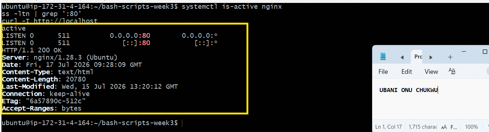

---

#### Screenshot 2 — Output of `pwd` and `find . -maxdepth 4 -type d | sort` showing the workspace folder structure

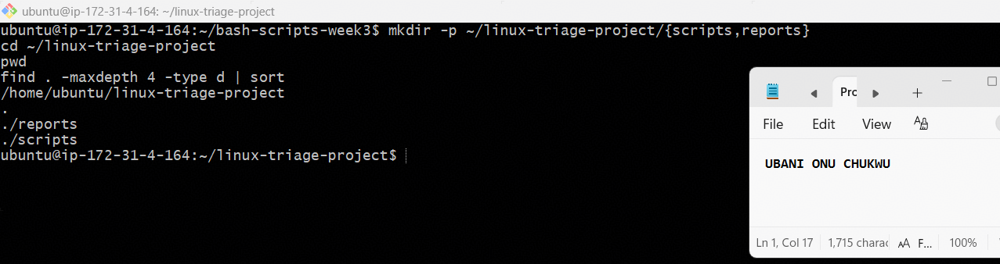

---

### Notes

**1. What proves that Nginx is running?**

`systemctl is-active nginx` returned `active`, confirming the systemd service is currently running (not stopped, failed, or inactive).

---

**2. What proves that the server is listening for HTTP traffic?**

`ss -ltn | grep ':80'` shows two `LISTEN` entries on port 80 — one for `0.0.0.0:80` (IPv4, all interfaces) and one for `[::]:80` (IPv6) — confirming the server is actively accepting incoming connections on the HTTP port, not just that the process exists.

---

**3. Why must you capture a healthy baseline before simulating an incident?**

Without a known-good baseline, there's no reliable way to tell what "broken" looks like compared to "normal" — the triage script's output during a real incident is only meaningful in contrast to what it reported when everything was working. The baseline also validates that the script and its checks work correctly before intentionally breaking something, so I can trust the script's diagnosis rather than debugging both the incident and the script at the same time.

---

# Task 2 — Create Project Context and Safety Rules in CLAUDE.md

## Goal

Tell Claude exactly what this project does and what it is not allowed to do.

### Evidence

#### Screenshot 3 — CLAUDE.md open in VS Code showing all four sections (Project Overview, Incident Workflow, Safety Rules, Output Rules)

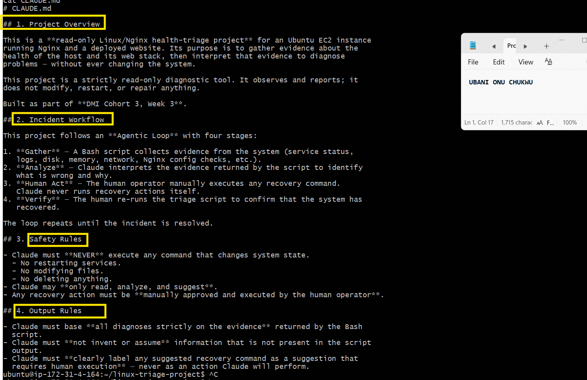

---

### Notes

**1. Why should Claude receive project-specific operational rules?**

Without explicit context, Claude has no way of knowing what's safe or expected in this specific environment — a generic AI assistant might assume it's fine to run `systemctl restart nginx` if it sees a failure, since that's a reasonable action in many contexts. `CLAUDE.md` removes ambiguity by explicitly defining the project's purpose, workflow, and boundaries, ensuring Claude's behavior aligns with this specific read-only, human-in-the-loop design rather than defaulting to generic "helpful assistant" behavior.

---

**2. Why is the human required to execute the recovery command?**

Keeping a human in the loop for any state-changing action ensures accountability, prevents unintended consequences from an AI misdiagnosing a situation, and preserves the operator's full context and judgment before anything is changed on a live system. This mirrors real production incident response — automated monitoring can detect and diagnose, but critical recovery actions (especially destructive ones) should have human sign-off, particularly while trust in AI-driven operations is still being established.

---

**3. Which rule prevents Claude from making an unsupported diagnosis?**

The Output Rules section: "Claude must base all diagnoses strictly on the evidence returned by the Bash script" and "must not invent or assume information that is not present in the script output." This forces every conclusion Claude reaches to be traceable back to actual observed evidence, rather than plausible-sounding guesses.

---

# Task 3 — Use Agentic AI to Plan Before Writing the Script

## Goal

Use Claude Code to inspect the environment and produce a read-only plan before creating any Bash code.

### Evidence

#### Screenshot 4 — Claude Code showing the five-check plan and read-only inspection results

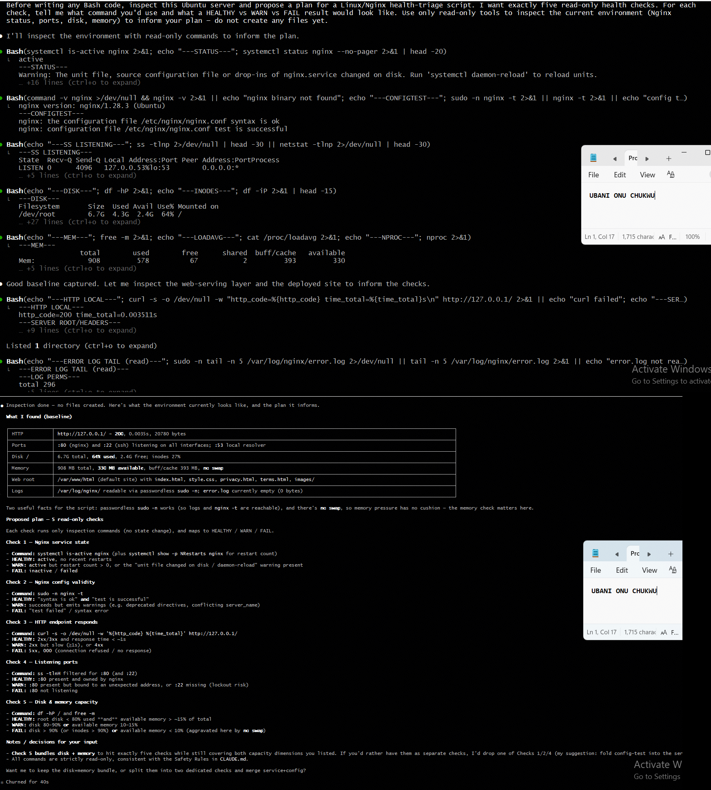

---

### Notes

**1. Which part of this task represents the Gather phase?**

Claude running the read-only Bash commands to inspect the environment — checking Nginx status, config validity, HTTP response, listening ports, disk, and memory — represents the Gather phase. This is the "collect evidence" step, done here manually by Claude as part of planning, before the reusable script formalizes it.

---

**2. Did Claude follow the instruction not to create files? How did you verify this?**

Yes — Claude explicitly stated "Inspection done — no files created" and only used `Bash` tool calls to run read commands (`systemctl`, `curl`, `ss`, `df`, `free`, `tail`). I verified this by checking that every command shown was an inspection command (status checks, reads) with no `nano`, `touch`, `>`, `echo >`, or `Write` tool calls anywhere in the output.

---

**3. Why is planning before coding useful in DevOps automation?**

Planning first surfaces environment-specific details that shape good design decisions — for example, Claude noticed this server has no swap space, which directly informed why the memory check matters more here than it might elsewhere. Writing the script first and discovering these details later often leads to rework or missed edge cases. This mirrors real infrastructure work: understanding the actual system before automating around it prevents scripts that look correct in theory but don't match the reality of the environment they'll run in.

---

# Task 4 — Build the Linux Triage Bash Script

## Goal

Create one Bash script that gathers consistent Linux and Nginx health evidence.

### Evidence

#### Screenshot 5 — Top section of `linux-triage.sh` showing variables, thresholds, and the checks array

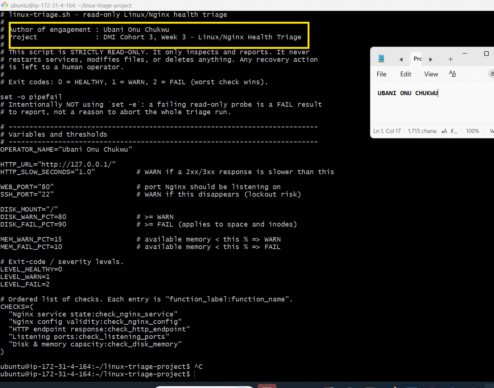

---

#### Screenshot 6 — Middle section showing check functions and conditionals

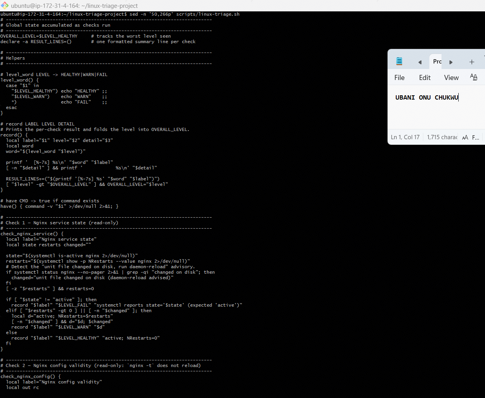
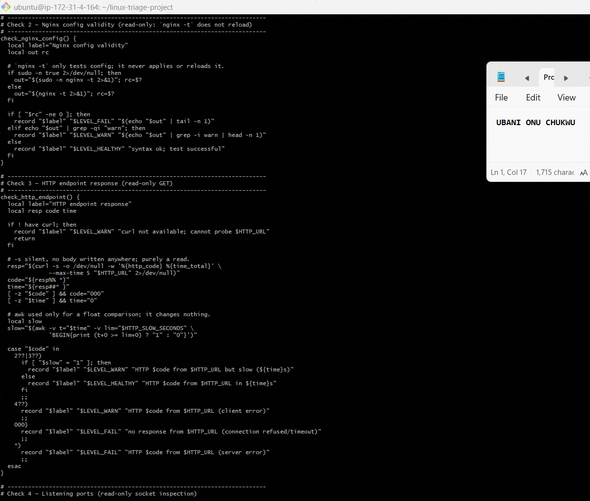

---

#### Screenshot 7 — Bottom section showing the loop, summary function, and exit behavior

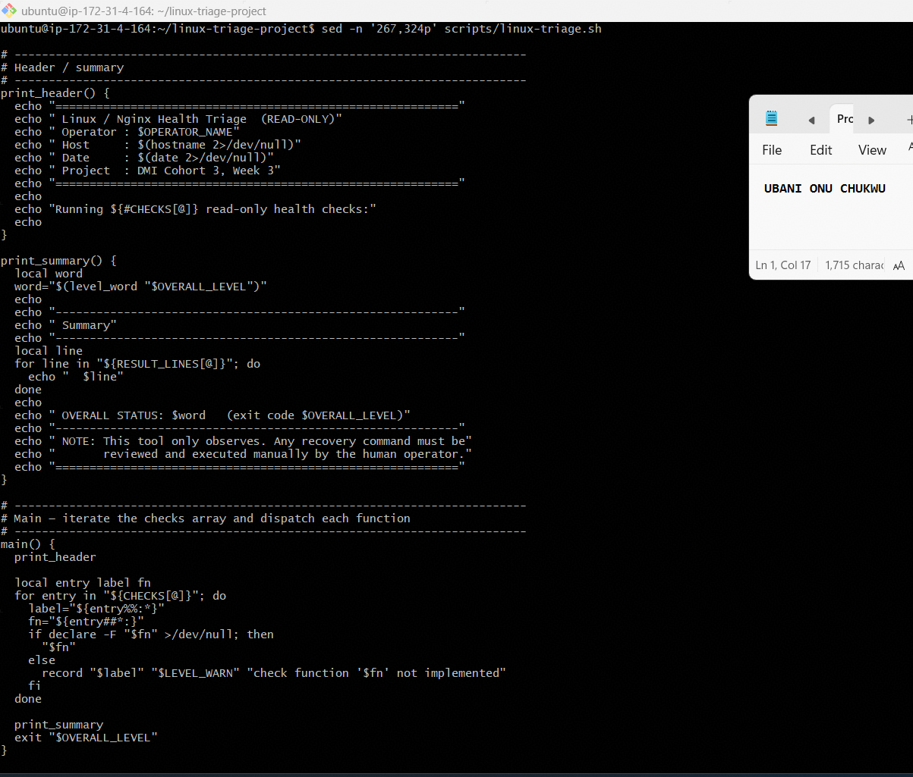

---

#### Screenshot 8 — Output of `bash -n scripts/linux-triage.sh` (no syntax errors) and `ls -l scripts/linux-triage.sh` showing executable permission

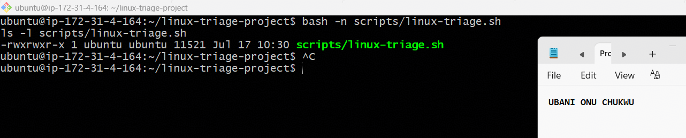

---

### Notes

**1. What is stored in the checks array?**

The `CHECKS` array stores five entries, each formatted as `"label:function_name"` — e.g., `"Nginx service state:check_nginx_service"`. This pairs a human-readable description with the actual Bash function that performs that check, allowing the main loop to both display and execute each check generically.

---

**2. How does the `for` loop use that array?**

The `main()` function's `for entry in "${CHECKS[@]}"` loop iterates through each `"label:function"` entry, splits it into `label` and `fn` using parameter expansion (`${entry%%:*}` and `${entry##*:}`), then dynamically calls the function name stored in `fn` using `"$fn"`. This means adding a new check only requires adding one line to the array — no changes to the loop itself.

---

**3. Why are the health checks separated into functions?**

Separating each check into its own function (`check_nginx_service`, `check_nginx_config`, etc.) keeps each piece of logic isolated, testable, and readable — a bug in the disk/memory check can't accidentally affect the Nginx service check. It also makes the script extensible: new checks can be added as new functions without touching existing ones, and the main loop stays clean regardless of how many checks exist.

---

**4. What is the purpose of `$(...)` in this script?**

`$(...)` is command substitution — it runs a command and captures its output as a string, which can then be stored in a variable. For example, `state="$(systemctl is-active nginx 2>/dev/null)"` captures the command's output ("active", "inactive", etc.) into the `state` variable so the script can evaluate it in a conditional, rather than just printing it to the terminal.

---

**5. Why does the script use different exit codes for HEALTHY, WARN, and FAIL?**

Exit codes let other programs, scripts, or monitoring systems (like a CI/CD pipeline or a cron job) programmatically detect the health outcome without parsing text output — a calling script can simply check `$?` after running `linux-triage.sh` and branch its own logic based on `0`, `1`, or `2`. This is standard Unix convention (`0` = success, non-zero = some kind of problem), and having three distinct levels lets automation distinguish "everything's fine" from "needs attention soon" from "urgent, act now."

---

# Task 5 — Run and Understand the Healthy-State Report

## Goal

Run the Bash script against the healthy server and verify that it creates a report.

### Evidence

#### Screenshot 9 — Output of `./scripts/linux-triage.sh` showing your Full Name and all five check results

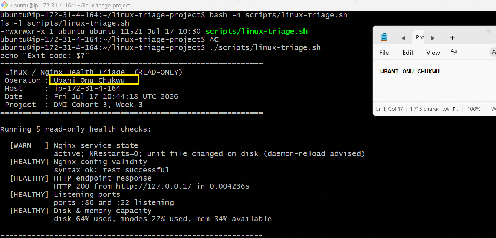

---

#### Screenshot 10 — Output showing the captured exit code and final summary

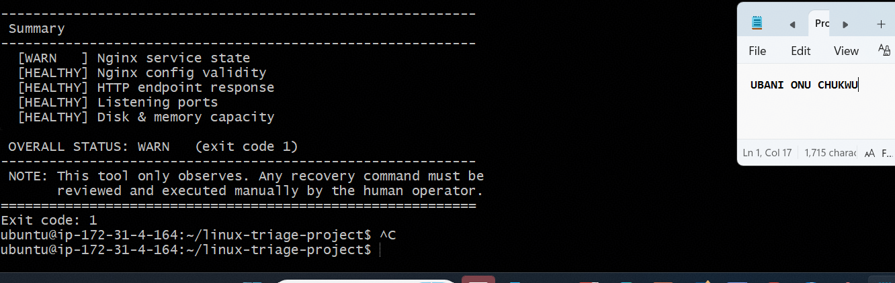

---

### Notes

**1. What is the overall status of your healthy baseline?**

WARN (exit code 1) — not HEALTHY, due to a single advisory-level issue: Nginx's unit file was changed on disk since the service last started (from earlier deployment work), so systemd recommends running `daemon-reload`. This is cosmetic, not a functional problem — the service itself is fully active and serving traffic correctly.

---

**2. Which exact Linux evidence proves the application is serving traffic?**

The "HTTP endpoint response" check returned `HEALTHY`, with the detail `HTTP 200 from http://127.0.0.1/ in 0.004236s` — a direct, successful HTTP response from the local server proves the application is not just "running" as a process, but actually accepting and correctly responding to real requests.

---

**3. Did your script return exit code 0 or 1? Explain why.**

Exit code 1 (WARN). The script's `main()` function sets `OVERALL_LEVEL` to the *worst* level seen across all five checks (via the `record` function's `[ "$level" -gt "$OVERALL_LEVEL" ]` comparison). Since Check 1 returned WARN while all others returned HEALTHY, the overall exit code reflects that single WARN rather than being diluted by the four HEALTHY results.

---

**4. What is the difference between a warning and a failure in this script?**

A WARN indicates something is slightly outside ideal conditions but not actively broken — like the daemon-reload advisory, or disk usage between 80-90%. A FAIL indicates the system is not functioning as expected — like Nginx being inactive, the config failing to validate, or the web port not listening at all. WARN is "keep an eye on this," while FAIL is "this needs immediate action."

---

# Task 6 — Create and Run the /linux-triage Skill

## Goal

Turn the Bash script into a reusable, manually invoked Agentic AI workflow.

### Evidence

#### Screenshot 11 — `SKILL.md` showing the frontmatter, allowed tool restrictions, and safety rules

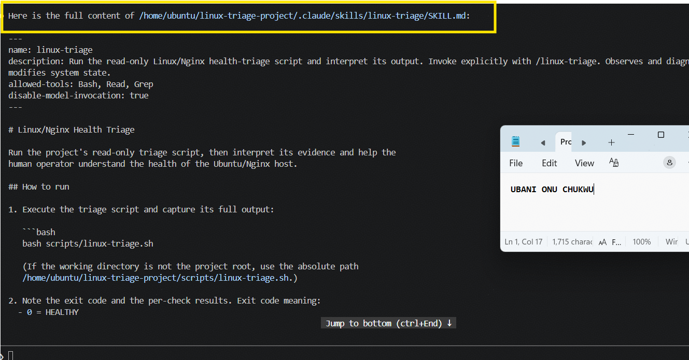

Additional evidence — `.claude/settings.json` enforcing a project-level permission denylist (blocking Write, Edit, and dozens of state-changing Bash commands at the permission layer, not just instructionally):

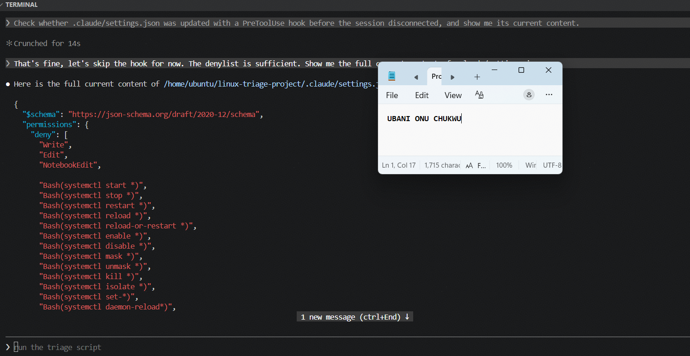

---

#### Screenshot 12 — `/linux-triage` output for the healthy server

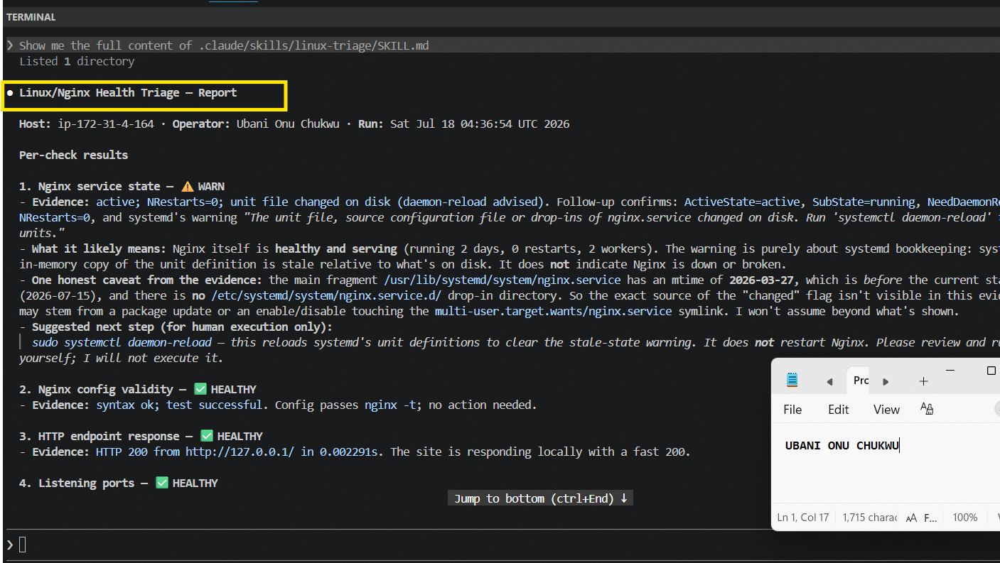

---

### Notes

**1. Why does this skill have Bash, Read, and Grep, but not Write?**

Bash, Read, and Grep are all read-only or inspection-oriented tools when restricted to the commands this skill's instructions specify — running the triage script, viewing config files, and searching logs/configs for patterns. Write is deliberately excluded because it's the tool that would let Claude create or overwrite files, which directly violates the project's read-only mandate. Excluding Write at the tool-permission level (not just instructing Claude not to use it) makes the restriction structural rather than just advisory. On top of this, the project's `.claude/settings.json` adds a technically-enforced permission denylist blocking Write, Edit, and dozens of specific state-changing Bash commands (systemctl start/stop/restart, rm, mv, chmod, etc.) — so the restriction is enforced at two layers, not just one.

---

**2. Why is `disable-model-invocation: true` useful for this skill?**

This setting prevents Claude from automatically deciding to run this skill on its own — for example, if I mentioned "the server seems slow" in casual conversation, Claude won't autonomously trigger a full triage run. Instead, the skill only executes when I explicitly type `/linux-triage`, keeping the human in control of *when* diagnostic actions happen, not just what actions are allowed.

---

**3. What part is performed by Bash, and what part is performed by Claude?**

Bash performs the actual evidence-gathering — running `linux-triage.sh`, which executes real system commands (`systemctl`, `curl`, `ss`, `df`, `free`) and produces deterministic, factual output. Claude performs the *interpretation* — reading that output, explaining what each result means in plain language, correlating findings across checks, and suggesting (but never executing) a recovery step. This is a clean separation: Bash establishes ground truth, Claude reasons about it.

---

**4. Why is this better than asking Claude "Is my server healthy?" without giving it evidence?**

Without evidence, Claude would either have to guess/hallucinate an answer or simply say it doesn't know — it has no built-in visibility into a live server's actual state. By running the triage script first and grounding Claude's response strictly in that output (per the Output Rules), every claim Claude makes is traceable to a real, verifiable system check, rather than being a plausible-sounding but unverified guess. This is the core value of the "Gather → Analyze" pattern: evidence first, interpretation second.

---

# Task 7 — Simulate an Nginx Incident and Let the Skill Diagnose It

## Goal

Create a controlled service failure, gather evidence through Bash, and let Claude analyze the evidence without taking recovery action.

### Evidence

#### Screenshot 13 — Output showing Nginx is inactive and the HTTP request fails

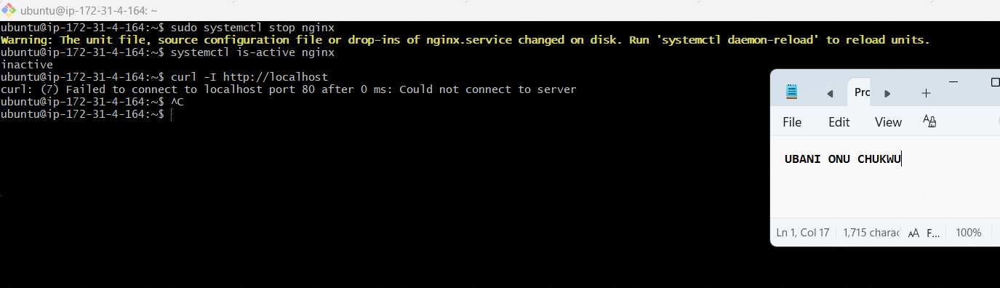

---

#### Screenshot 14 — `/linux-triage` output showing failed evidence, most likely cause, and a suggested recovery command

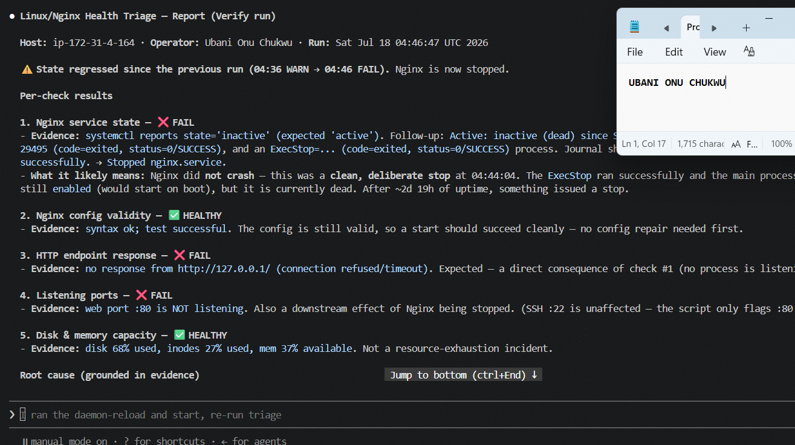

---

#### Screenshot 15 — `incident-failure-report.txt` showing the failed checks and your Full Name

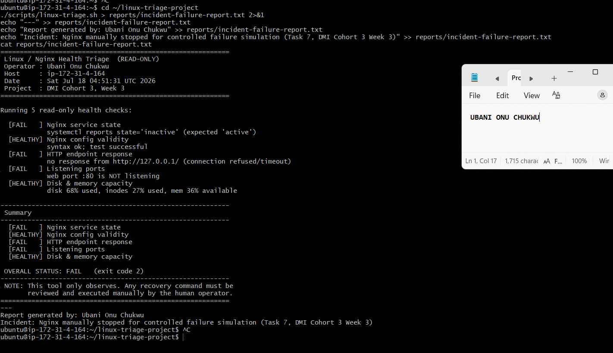

---

### Notes

**1. Which three checks failed?**

Nginx service state (`inactive`, expected `active`), HTTP endpoint response (connection refused/timeout), and Listening ports (web port :80 not listening).

---

**2. What evidence supports the conclusion that Nginx is unavailable?**

`systemctl` directly reported the service state as `inactive`. The follow-up journal evidence confirmed a clean stop sequence ("Stopping nginx.service..." → "Deactivated successfully." → "Stopped nginx.service.") with `Result=success` and exit code 0 — meaning this was an intentional stop, not a crash. This was corroborated by two downstream symptoms: `curl` couldn't connect at all (not even an HTTP error code, since nothing was listening), and `ss` confirmed port 80 had no active listener.

---

**3. Did Claude execute the recovery command? Why is that important?**

No — Claude explicitly labeled `sudo systemctl start nginx` as a "Suggested recovery (for human execution only)" and stated "I will not execute it." This matters because it preserves human control over state-changing actions on a live system — even though Claude correctly diagnosed the problem and identified a safe fix, the decision to actually act (and accept responsibility for that action) stays with the operator, consistent with the CLAUDE.md Safety Rules.

---

**4. Which phase of the Agentic Loop is represented by the Bash report?**

The **Gather** phase — the `linux-triage.sh` script (run via `/linux-triage`) collected raw, factual evidence about the system's current state (service status, HTTP response, port bindings) without any interpretation.

---

**5. Which phase is represented by Claude's explanation?**

The **Analyze** phase — Claude took the raw evidence from the Gather phase and interpreted it: identifying that the three failures were symptoms of one root cause, distinguishing a clean stop from a crash, and proposing a grounded recovery suggestion — all without taking any action itself.

---

# Task 8 — Recover Manually, Verify Again, and Write the Incident Summary

## Goal

Recover the service as the human operator and prove that the system is healthy again.

### Evidence

#### Screenshot 16 — Output showing Nginx is active and `curl -I http://localhost` returns 200 OK

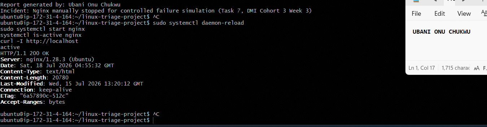

---

#### Screenshot 17 — Second `/linux-triage` output showing successful recovery with no FAIL results

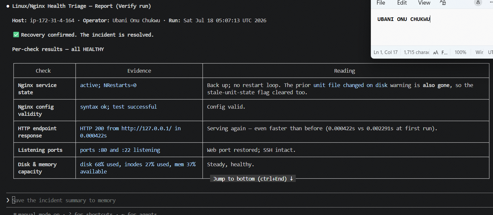

---

#### Screenshot 18 — Output of `ls -lah reports` showing both `incident-failure-report.txt` and `recovery-report.txt`

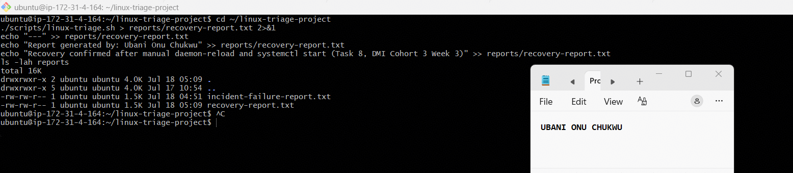

---

#### Screenshot 19 — `incident-summary.md` showing all required sections and your Full Name

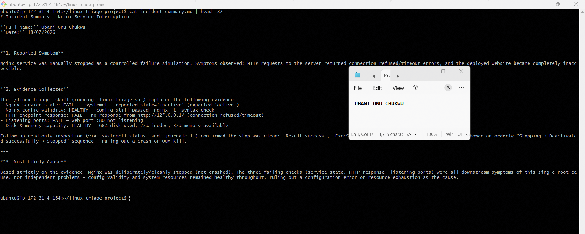
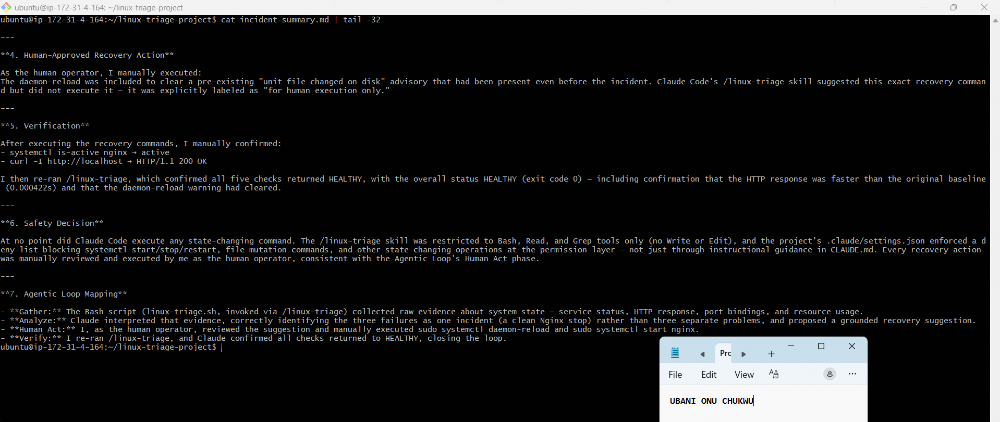

---

### Notes

**1. What action did you execute manually?**

I manually ran `sudo systemctl daemon-reload` (to clear the stale unit-file warning) followed by `sudo systemctl start nginx` (to bring the stopped service back up).

---

**2. What evidence proves that the service recovered?**

Direct commands confirmed it: `systemctl is-active nginx` returned `active`, and `curl -I http://localhost` returned `HTTP/1.1 200 OK`. This was then independently corroborated by re-running `/linux-triage`, which showed all five checks as HEALTHY, including a faster HTTP response time than the original baseline (0.000422s vs 0.002291s).

---

**3. Why is the second triage run necessary?**

A single successful `curl` or `systemctl is-active` check only confirms the service is up at that instant — it doesn't verify the full picture (config validity, port bindings, resource health) all together, and it doesn't leave a documented record comparable to the original triage report. Re-running the same standardized script that diagnosed the failure provides an apples-to-apples comparison, confirming recovery across every dimension that was checked during the incident, not just the one symptom I happened to test manually.

---

**4. What could go wrong if an AI agent automatically restarted every failed service?**

An AI blindly restarting services on any FAIL result could mask a deeper, recurring problem (e.g., repeatedly restarting a service that's crashing due to a memory leak, hiding the real issue instead of fixing it), cause a restart loop that makes things worse, or take action based on an incomplete or misdiagnosed picture — for example, restarting Nginx when the real problem was a disk-full condition wouldn't actually fix anything and could even cause data loss if timed badly. Human review adds a checkpoint where context the AI doesn't have (deployment schedules, known ongoing maintenance, business impact) can override a technically "correct" but contextually wrong automated action.

---

**5. In one sentence, explain the difference between using AI as a chatbot and using AI in this agentic workflow.**

A chatbot answers questions from what it already knows or is told, while this agentic workflow has Claude actively gather real, live evidence from a system, reason over that evidence within enforced safety boundaries, and participate in a structured operational loop — without ever crossing from advisor into unsupervised actor.

---

# Incident Summary

**Full Name:** Ubani Onu Chukwu

**Date:** 18/07/2026

---

**1. Reported Symptom**

Nginx service was manually stopped as a controlled failure simulation. Symptoms observed: HTTP requests to the server returned connection refused/timeout errors, and the deployed website became completely inaccessible.

---

**2. Evidence Collected**

The `/linux-triage` skill (running `linux-triage.sh`) captured the following evidence: Nginx service state FAIL (`systemctl` reported state='inactive', expected 'active'), Nginx config validity HEALTHY (config still passed `nginx -t`), HTTP endpoint response FAIL (no response from http://127.0.0.1/, connection refused/timeout), Listening ports FAIL (web port :80 not listening), and Disk & memory capacity HEALTHY (68% disk used, 27% inodes, 37% memory available). Follow-up read-only inspection via `systemctl status` and `journalctl` confirmed the stop was clean: `Result=success`, `ExecStop` exited with status 0, and the journal showed an orderly "Stopping → Deactivated successfully → Stopped" sequence — ruling out a crash or OOM kill.

---

**3. Most Likely Cause**

Based strictly on the evidence, Nginx was deliberately/cleanly stopped (not crashed). The three failing checks (service state, HTTP response, listening ports) were all downstream symptoms of this single root cause, not independent problems — config validity and system resources remained healthy throughout, ruling out a configuration error or resource exhaustion as the cause.

---

**4. Human-Approved Recovery Action**

As the human operator, I manually executed `sudo systemctl daemon-reload` followed by `sudo systemctl start nginx`. The daemon-reload was included to clear a pre-existing "unit file changed on disk" advisory that had been present even before the incident. Claude Code's `/linux-triage` skill suggested this exact recovery command but did not execute it — it was explicitly labeled as "for human execution only."

---

**5. Verification**

After executing the recovery commands, I manually confirmed `systemctl is-active nginx` returned `active` and `curl -I http://localhost` returned `HTTP/1.1 200 OK`. I then re-ran `/linux-triage`, which confirmed all five checks returned HEALTHY, with the overall status HEALTHY (exit code 0) — including confirmation that the HTTP response was faster than the original baseline (0.000422s) and that the daemon-reload warning had cleared.

---

**6. Safety Decision**

At no point did Claude Code execute any state-changing command. The `/linux-triage` skill was restricted to Bash, Read, and Grep tools only (no Write or Edit), and the project's `.claude/settings.json` enforced a deny-list blocking `systemctl start/stop/restart`, file mutation commands, and other state-changing operations at the permission layer — not just through instructional guidance in CLAUDE.md. Every recovery action was manually reviewed and executed by me as the human operator, consistent with the Agentic Loop's Human Act phase.

---

**7. Agentic Loop Mapping**

Gather: the Bash script (`linux-triage.sh`, invoked via `/linux-triage`) collected raw evidence about system state — service status, HTTP response, port bindings, and resource usage. Analyze: Claude interpreted that evidence, correctly identifying the three failures as one incident (a clean Nginx stop) rather than three separate problems, and proposed a grounded recovery suggestion. Human Act: I, as the human operator, reviewed the suggestion and manually executed `sudo systemctl daemon-reload` and `sudo systemctl start nginx`. Verify: I re-ran `/linux-triage`, and Claude confirmed all checks returned to HEALTHY, closing the loop.

---

# LinkedIn Post (Required)

## Evidence

#### LinkedIn Post URL

https://www.linkedin.com/posts/onuchukwu-ubani-10004741_devops-agenticai-claudecode-share-7484128182560960512-geSZ/?utm_source=share&utm_medium=member_desktop&rcm=ACoAAAi6A9ABP5zuoQ8QP1g4mp_mBXViSDgTxy0

---

#### Screenshot — Published LinkedIn post

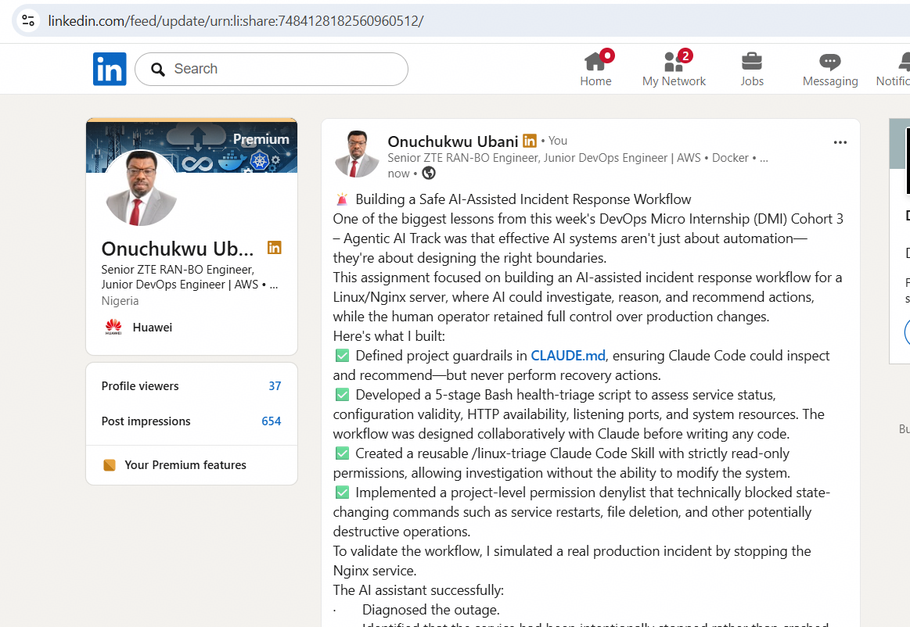

---

# GitHub Repository URL

https://github.com/Ubani-Onu-C/devops-micro-internship-pravinmishra/tree/main/week-03-linux-and-bash-for-devops/linux-triage-project

---

# Submission Instructions

- Add all required screenshots in your submission
- Full Name must be visible in required screenshots and the Bash report
- All written answers must be in your own words
- Do not expose sensitive information (keys, passwords, AWS account IDs, tokens)
- GitHub URL must be included in this document

---

# Completion Checklist

- [x] Task 1: Healthy baseline confirmed, workspace created (Screenshots 1–2, Notes answered)
- [x] Task 2: CLAUDE.md created with all four sections (Screenshot 3, Notes answered)
- [x] Task 3: Five-check plan produced by Claude using read-only tools (Screenshot 4, Notes answered)
- [x] Task 4: `linux-triage.sh` created, syntax validated, executable permission set (Screenshots 5–8, Notes answered)
- [x] Task 5: Healthy-state report generated with no FAIL result (Screenshots 9–10, Notes answered)
- [x] Task 6: `/linux-triage` skill created and run successfully on healthy server (Screenshots 11–12, Notes answered)
- [x] Task 7: Nginx incident simulated, failed evidence captured, Claude did not execute recovery (Screenshots 13–15, Notes answered)
- [x] Task 8: Nginx recovered manually, recovery verified, reports saved, incident summary complete (Screenshots 16–19, Notes answered)
- [x] Incident summary contains all seven required sections
- [x] LinkedIn post published and URL submitted
- [x] Full Name visible in all required screenshots and the Bash report
- [x] Skill does not have Write permission
- [x] Skill did not execute any recovery commands
- [x] No sensitive data exposed

---

## 📌 About DMI & CloudAdvisory

DevOps Micro Internship (DMI) is a project-based DevOps program run by Pravin Mishra (The CloudAdvisory) focused on real-world execution, systems thinking, and career readiness.

It helps learners build strong DevOps foundations with hands-on experience.

---

## 📌 Resources

- 🌐 DMI Official Website: https://pravinmishra.com/dmi  
- 🎓 DevOps for Beginners (Udemy): https://www.udemy.com/course/devops-for-beginners-docker-k8s-cloud-cicd-4-projects/  
- 🎓 Agentic AI DevOps with Claude Code: https://www.udemy.com/course/ultimate-agentic-ai-devops-with-claude-code/  
- 🎓 DevOps with Claude Code: Terraform, EKS, ArgoCD & Helm: https://www.udemy.com/course/devops-with-claude-code-terraform-eks-argocd-helm/  
- ▶️ YouTube Playlist: https://www.youtube.com/playlist?list=PLFeSNDtI4Cho  
- 🔗 Pravin Mishra (LinkedIn): https://www.linkedin.com/in/pravin-mishra-aws-trainer/  
- 🏢 CloudAdvisory (LinkedIn): https://www.linkedin.com/company/thecloudadvisory/

---

*This submission is part of DevOps Micro Internship (DMI) Cohort 3 — Agentic AI Track.*