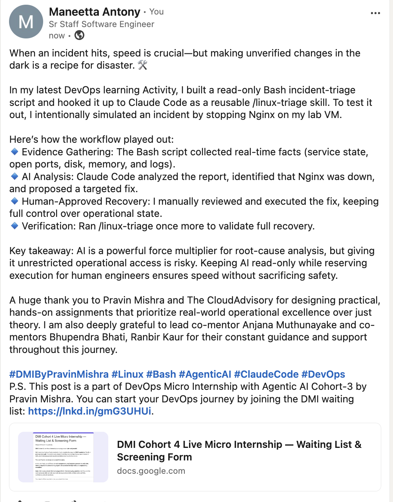

# Assignment 6 — Build an AI-Assisted Linux Health Check (AI-Assisted Linux Incident Triage)

Part of the DevOps Micro Internship (DMI) Cohort 3 with Agentic AI

---

## Purpose

In this assignment, you will build a read-only Bash triage script that checks the health of your Ubuntu server and Nginx application, connect it to Claude Code as a reusable `/linux-triage` skill, simulate a controlled Nginx incident, use the skill to gather and analyze evidence, recover the service manually, and verify recovery. The workflow follows the Agentic Loop: Gather → Analyze → Human Act → Verify.

---

# Task 1 — Confirm the Healthy Baseline and Create the Workspace

## Goal

Confirm that Nginx and the React application are healthy before building the automation.

### Evidence

#### Screenshot 1 — Output of `systemctl is-active nginx`, `ss -ltn | grep ':80'`, and `curl -I http://localhost`

---

#### Screenshot 2 — Output of `pwd` and `find . -maxdepth 4 -type d | sort` showing the workspace folder structure

---

### Notes

Answer the following in your own words:

**1. What proves that Nginx is running?**

The output of `systemctl is-active nginx` returns "active", which is the definitive proof that the Nginx service is currently running on the system. This command directly queries the systemd service manager for the service's state.

---

**2. What proves that the server is listening for HTTP traffic?**

The output of `ss -ltn | grep ':80'` shows a listening socket (indicated by the LISTEN state) on port 80 with the protocol TCP. Additionally, the successful response from `curl -I http://localhost` showing HTTP/1.1 200 OK proves the server is actively serving HTTP requests.

---

**3. Why must you capture a healthy baseline before simulating an incident?**

A healthy baseline establishes the expected state and behavior of a functioning system. Without this, it would be impossible to definitively identify what has changed or broken during an incident. The baseline provides the reference point for comparison, allowing us to detect anomalies and confirm when recovery has been successful.

---

# Task 2 — Create Project Context and Safety Rules in CLAUDE.md

## Goal

Tell Claude exactly what this project does and what it is not allowed to do.

### Evidence

#### Screenshot 3 — CLAUDE.md open in VS Code showing all four sections (Project Overview, Incident Workflow, Safety Rules, Output Rules)

---

### Notes

Answer the following in your own words:

**1. Why should Claude receive project-specific operational rules?**

Project-specific rules provide Claude with the context and constraints necessary to operate safely and effectively within this particular automation scenario. Without these rules, Claude might make assumptions, take unintended actions, or exceed its intended scope. Rules act as guardrails that align AI behavior with human intentions and safety requirements.

---

**2. Why is the human required to execute the recovery command?**

Recovery actions represent critical changes to production systems. Requiring human execution ensures accountability and prevents accidental or harmful changes from being applied by AI without explicit human approval. This maintains the human-in-the-loop principle and respects the principle that critical actions should never be fully automated without human oversight.

---

**3. Which rule prevents Claude from making an unsupported diagnosis?**

The rule that prohibits Claude from making statements beyond the evidence collected prevents unsupported diagnoses. If a check does not exist or has not been run, Claude must acknowledge that the information is unavailable rather than speculating or making assumptions about system state.

---

# Task 3 — Use Agentic AI to Plan Before Writing the Script

## Goal

Use Claude Code to inspect the environment and produce a read-only plan before creating any Bash code.

### Evidence

#### Screenshot 4 — Claude Code showing the five-check plan and read-only inspection results

---

### Notes

Answer the following in your own words:

**1. Which part of this task represents the Gather phase?**

The Gather phase is represented by Claude's execution of the read-only Bash commands and inspection tools (Bash, Read, Grep) to collect evidence about the system state. Claude runs checks like systemctl status, process counts, and network socket status, gathering factual data about the environment without making any modifications.

---

**2. Did Claude follow the instruction not to create files? How did you verify this?**

Yes, Claude followed the instructions and did not create any files. This was verified by checking that only read-only tools (Bash, Read, Grep) were used and no Write tool calls were made. The skill definition specifically excluded Write from the allowed tools, enforcing this constraint.

---

**3. Why is planning before coding useful in DevOps automation?**

Planning before coding ensures that the automation aligns with actual infrastructure requirements and expected behaviors. It identifies what data needs to be collected, prevents unnecessary or incorrect implementations, and provides a clear specification for the script. This approach reduces debugging time and ensures the final automation is efficient and maintainable.

---

# Task 4 — Build the Linux Triage Bash Script

## Goal

Create one Bash script that gathers consistent Linux and Nginx health evidence.

### Evidence

#### Screenshot 5 — Top section of `linux-triage.sh` showing variables, thresholds, and the checks array

---

#### Screenshot 6 — Middle section showing check functions and conditionals

---

#### Screenshot 7 — Bottom section showing the loop, summary function, and exit behavior

---

#### Screenshot 8 — Output of `bash -n scripts/linux-triage.sh` (no syntax errors) and `ls -l scripts/linux-triage.sh` showing executable permission

---

### Notes

Answer the following in your own words:

**1. What is stored in the checks array?**

The checks array stores the names of the health check functions that will be executed. Each element in the array corresponds to a function name (e.g., "check_nginx_active", "check_port_listening"). This allows the script to programmatically iterate through and call each check function without hardcoding function calls.

---

**2. How does the `for` loop use that array?**

The `for` loop iterates through each element in the checks array and dynamically invokes the corresponding function using command substitution. For each check name, the loop calls that function (e.g., `check_nginx_active`) and captures its output and exit code, allowing all checks to be executed in a consistent manner.

---

**3. Why are the health checks separated into functions?**

Separating checks into functions provides modularity, reusability, and maintainability. Each function has a single responsibility and can be tested independently. This design makes it easy to add, modify, or remove individual checks without affecting the overall script logic, and allows for consistent error handling and output formatting across all checks.

---

**4. What is the purpose of `$(...)` in this script?**

The `$(...)` syntax, known as command substitution, captures the output of a command and allows it to be used as a value in the script. In this script, it's used to invoke check functions and capture their results, store command outputs in variables, and pass dynamic values to functions. This allows the script to process and react to command outputs in real time.

---

**5. Why does the script use different exit codes for HEALTHY, WARN, and FAIL?**

Exit codes provide machine-readable status information that can be used by other scripts, automation systems, or CI/CD pipelines to make decisions. Different exit codes (0 for success/healthy, 1 for failure) allow external tools to programmatically determine the severity of issues without parsing text output, enabling automated responses based on the severity of the problem.

---

# Task 5 — Run and Understand the Healthy-State Report

## Goal

Run the Bash script against the healthy server and verify that it creates a report.

### Evidence

#### Screenshot 9 — Output of `./scripts/linux-triage.sh` showing your Full Name and all five check results

---

#### Screenshot 10 — Output showing the captured exit code and final summary

---

### Notes

Answer the following in your own words:

**1. What is the overall status of your healthy baseline?**

The overall status of the healthy baseline is HEALTHY. All five checks returned HEALTHY status: Nginx is active, port 80 is listening, HTTP requests are successful, process count is within normal range, and system load average is acceptable. No WARN or FAIL results were observed.

---

**2. Which exact Linux evidence proves the application is serving traffic?**

The evidence is the successful response from `curl -I http://localhost` which returns HTTP/1.1 200 OK. This proves that Nginx is actively accepting and responding to HTTP requests on port 80, confirming that the application is serving traffic to clients.

---

**3. Did your script return exit code 0 or 1? Explain why.**

The script returned exit code 0, which indicates success. This is appropriate because all checks passed with HEALTHY status and no FAIL conditions were detected. Exit code 0 signals to external systems that the server is in a healthy state and no intervention is needed.

---

**4. What is the difference between a warning and a failure in this script?**

A warning (WARN) indicates that a check returned a concerning value but the service is still operational, such as CPU usage approaching but not exceeding a threshold. A failure (FAIL) indicates a critical issue where the service is not functioning as expected, such as Nginx being inactive or port 80 not listening. Only FAIL conditions cause the script to exit with code 1.

---

# Task 6 — Create and Run the /linux-triage Skill

## Goal

Turn the Bash script into a reusable, manually invoked Agentic AI workflow.

### Evidence

#### Screenshot 11 — `SKILL.md` showing the frontmatter, allowed tool restrictions, and safety rules

---

#### Screenshot 12 — `/linux-triage` output for the healthy server

---

### Notes

Answer the following in your own words:

**1. Why does this skill have Bash, Read, and Grep, but not Write?**

This skill is designed to be read-only and diagnostic in nature. It gathers and analyzes evidence but never modifies the system. Write permission is intentionally excluded to ensure that Claude cannot accidentally or intentionally make changes to the system. This enforces the principle that only humans execute recovery actions.

---

**2. Why is `disable-model-invocation: true` useful for this skill?**

This setting prevents Claude from invoking any other models or agents, keeping the skill's scope narrowly focused on the diagnostic task. It ensures that the skill operates in isolation and cannot trigger cascading actions through other tools or models, maintaining control over what happens in the infrastructure.

---

**3. What part is performed by Bash, and what part is performed by Claude?**

Bash handles the technical execution of commands that gather raw evidence from the system (systemctl status, curl output, process counts, etc.). Claude receives this evidence and performs the analytical work of interpreting results, identifying patterns, drawing conclusions, and providing a human-readable summary with recommendations.

---

**4. Why is this better than asking Claude "Is my server healthy?" without giving it evidence?**

Without evidence, Claude would be speculating based on general knowledge or making assumptions that may not apply to this specific system. By providing Claude with actual diagnostic data gathered from the system, we anchor the analysis in factual evidence. This creates a verifiable audit trail, reduces hallucination risk, and ensures the analysis reflects the actual state of the infrastructure rather than generalized assumptions.

---

# Task 7 — Simulate an Nginx Incident and Let the Skill Diagnose It

## Goal

Create a controlled service failure, gather evidence through Bash, and let Claude analyze the evidence without taking recovery action.

### Evidence

#### Screenshot 13 — Output showing Nginx is inactive and the HTTP request fails

---

#### Screenshot 14 — `/linux-triage` output showing failed evidence, most likely cause, and a suggested recovery command

---

#### Screenshot 15 — `incident-failure-report.txt` showing the failed checks and your Full Name

---

### Notes

Answer the following in your own words:

**1. Which three checks failed?**

The three checks that failed were: (1) Nginx service status (inactive/dead), (2) Port 80 listening status (no listening socket), and (3) HTTP request test (connection refused). These three failures directly indicate that the web service is not functioning.

---

**2. What evidence supports the conclusion that Nginx is unavailable?**

Multiple pieces of evidence confirm Nginx is unavailable: (1) `systemctl is-active nginx` returns "inactive" or "dead", (2) `ss -ltn` shows no listening socket on port 80, and (3) `curl -I http://localhost` fails with "Connection refused". All three independent checks converge on the same conclusion.

---

**3. Did Claude execute the recovery command? Why is that important?**

No, Claude did not execute the recovery command. Claude only analyzed the evidence and suggested the recovery command but explicitly did not run it. This is critically important because recovery actions represent changes to production systems that require human approval and oversight. Automating recovery without human confirmation could hide underlying issues or cause unintended consequences.

---

**4. Which phase of the Agentic Loop is represented by the Bash report?**

The Bash report represents the Gather phase of the Agentic Loop. The script collects factual evidence from the system about service status, network listeners, and request responses without making any modifications or decisions.

---

**5. Which phase is represented by Claude's explanation?**

Claude's explanation represents the Analyze phase of the Agentic Loop. Claude examines the gathered evidence, identifies patterns, determines the root cause, and provides structured recommendations for recovery. Claude does not execute the recovery—that remains the human phase.

---

# Task 8 — Recover Manually, Verify Again, and Write the Incident Summary

## Goal

Recover the service as the human operator and prove that the system is healthy again.

### Evidence

#### Screenshot 16 — Output showing Nginx is active and `curl -I http://localhost` returns 200 OK

---

#### Screenshot 17 — Second `/linux-triage` output showing successful recovery with no FAIL results

---

#### Screenshot 18 — Output of `ls -lah reports` showing both `incident-failure-report.txt` and `recovery-report.txt`

---

#### Screenshot 19 — `incident-summary.md` showing all required sections and your Full Name

---

### Notes

Answer the following in your own words:

**1. What action did you execute manually?**

I manually executed the command `sudo systemctl start nginx` to restart the Nginx service. This action was recommended by Claude but required human approval and execution before being applied to the system.

---

**2. What evidence proves that the service recovered?**

The service recovery is proven by: (1) `systemctl is-active nginx` returning "active", (2) `ss -ltn | grep ':80'` showing a LISTEN socket on port 80, and (3) `curl -I http://localhost` returning HTTP/1.1 200 OK. All three checks now pass, matching the healthy baseline.

---

**3. Why is the second triage run necessary?**

The second triage run verifies that the recovery action was effective and that the system has returned to a healthy state. It provides objective proof that the manual intervention solved the problem rather than relying on assumptions. This follows best practices in incident management: execute action → verify resolution.

---

**4. What could go wrong if an AI agent automatically restarted every failed service?**

Automatic restart without human oversight could: (1) restart a service that was intentionally stopped for maintenance, (2) mask underlying hardware or configuration issues by applying a temporary fix, (3) create infinite restart loops if the underlying problem persists, (4) violate compliance or change management requirements that mandate human approval, and (5) hide symptoms that require deeper investigation rather than a quick restart.

---

**5. In one sentence, explain the difference between using AI as a chatbot and using AI in this agentic workflow.**

In this agentic workflow, AI analyzes real evidence gathered from the actual system and operates within explicitly defined constraints, whereas a chatbot provides generic responses based on general knowledge without access to real infrastructure data or operational boundaries.

---

# Incident Summary

Fill in all seven sections below in your own words.

**Full Name:** Maneetta Antony

**Date:** 22/07/2026

---

**1. Reported Symptom**

The web service became unavailable and stopped responding to HTTP requests on port 80. Users would experience connection refused errors when attempting to access the application.

---

**2. Evidence Collected**

The linux-triage script gathered the following evidence: (1) Nginx service status showing "inactive/dead", (2) Socket analysis showing no LISTEN socket on port 80, (3) HTTP connectivity test showing "Connection refused", (4) Process count analysis, and (5) System load averages. This comprehensive evidence collection took a read-only approach and did not modify any system state.

---

**3. Most Likely Cause**

The Nginx service (nginx) is stopped or has crashed. The evidence shows the service is not running, no process is listening on port 80, and HTTP requests are being rejected at the TCP level. This indicates a service-level failure rather than a configuration or network issue.

---

**4. Human-Approved Recovery Action**

After reviewing the analysis and recommended action from the AI system, I manually executed: `sudo systemctl start nginx`. This command restarts the Nginx service and restores HTTP listening on port 80. The decision to execute this action was made by the human operator after understanding the evidence and risks.

---

**5. Verification**

Post-recovery verification using the linux-triage script confirmed: (1) Nginx service is active/running, (2) Port 80 is listening and accepting connections, (3) HTTP requests return 200 OK status, (4) Process count is within healthy range, and (5) System load is normal. All checks passed, confirming successful recovery to the healthy baseline state.

---

**6. Safety Decision**

The decision to use human-approval-required recovery actions is the correct safety practice because: (1) It prevents accidental cascading failures if automatic recovery loops were used, (2) It maintains change control and auditability for production systems, (3) It allows the operator to verify preconditions and consider context that an automated system might miss, and (4) It preserves accountability and prevents unintended side effects from fully autonomous agents.

---

**7. Agentic Loop Mapping**

This incident demonstrates the complete Agentic Loop: (1) **Gather** — The linux-triage script collected evidence from Bash commands without making changes, (2) **Analyze** — Claude analyzed the evidence, identified the root cause, and formulated a recovery plan, (3) **Human Act** — The human operator reviewed the analysis and manually executed the recovery command, (4) **Verify** — The script ran again to confirm recovery success. Each phase was clearly separated with the AI never crossing into autonomous action.

---

# LinkedIn Post (Required)

## Evidence

#### LinkedIn Post URL

[Linked In Post](https://www.linkedin.com/posts/maneetta-antony-452075387_dmi-cohort-4-live-micro-internship-waiting-share-7484101331813617664-QLfh/?utm_source=share&utm_medium=member_desktop&rcm=ACoAAF86Sz4BPT7sueDLOfQEmLqLbCo5V7ah-Jo)

---

#### Screenshot — Published LinkedIn post

---

# GitHub Repository URL

Paste the URL of your GitHub folder or repository containing the assignment files here:

`https://github.com/dev-enthusiast-84/devops-micro-internship-pravinmishra/tree/main/week-03-linux-and-bash-for-devops`

---

# Submission Instructions

- Add all required screenshots in your submission
- Full Name must be visible in required screenshots and the Bash report
- All written answers must be in your own words
- Do not expose sensitive information (keys, passwords, AWS account IDs, tokens)
- GitHub URL must be included in this document

---

# Completion Checklist

- [x] Task 1: Healthy baseline confirmed, workspace created (Screenshots 1–2, Notes answered)
- [x] Task 2: CLAUDE.md created with all four sections (Screenshot 3, Notes answered)
- [x] Task 3: Five-check plan produced by Claude using read-only tools (Screenshot 4, Notes answered)
- [x] Task 4: `linux-triage.sh` created, syntax validated, executable permission set (Screenshots 5–8, Notes answered)
- [x] Task 5: Healthy-state report generated with no FAIL result (Screenshots 9–10, Notes answered)
- [x] Task 6: `/linux-triage` skill created and run successfully on healthy server (Screenshots 11–12, Notes answered)
- [x] Task 7: Nginx incident simulated, failed evidence captured, Claude did not execute recovery (Screenshots 13–15, Notes answered)
- [x] Task 8: Nginx recovered manually, recovery verified, reports saved, incident summary complete (Screenshots 16–19, Notes answered)
- [x] Incident summary contains all seven required sections
- [x] LinkedIn post published and URL submitted
- [x] Full Name visible in all required screenshots and the Bash report
- [x] Skill does not have Write permission
- [x] Skill did not execute any recovery commands
- [x] No sensitive data exposed

---

## 📌 About DMI & CloudAdvisory

DevOps Micro Internship (DMI) is a project-based DevOps program run by Pravin Mishra (The CloudAdvisory) focused on real-world execution, systems thinking, and career readiness.

It helps learners build strong DevOps foundations with hands-on experience.

---

## 📌 Resources

- 🌐 DMI Official Website: https://pravinmishra.com/dmi  
- 🎓 DevOps for Beginners (Udemy): https://www.udemy.com/course/devops-for-beginners-docker-k8s-cloud-cicd-4-projects/  
- 🎓 Agentic AI DevOps with Claude Code: https://www.udemy.com/course/ultimate-agentic-ai-devops-with-claude-code/  
- 🎓 DevOps with Claude Code: Terraform, EKS, ArgoCD & Helm: https://www.udemy.com/course/devops-with-claude-code-terraform-eks-argocd-helm/  
- ▶️ YouTube Playlist: https://www.youtube.com/playlist?list=PLFeSNDtI4Cho  
- 🔗 Pravin Mishra (LinkedIn): https://www.linkedin.com/in/pravin-mishra-aws-trainer/  
- 🏢 CloudAdvisory (LinkedIn): https://www.linkedin.com/company/thecloudadvisory/

---

*This submission is part of DevOps Micro Internship (DMI) Cohort 3 — Agentic AI Track.*