# Assignment 6 — Build an AI-Assisted Linux Health Check (AI-Assisted Linux Incident Triage)

Part of the DevOps Micro Internship (DMI) Cohort 3 with Agentic AI

---

## Purpose

In this assignment, you will build a read-only Bash triage script that checks the health of your Ubuntu server and Nginx application, connect it to Claude Code as a reusable `/linux-triage` skill, simulate a controlled Nginx incident, use the skill to gather and analyze evidence, recover the service manually, and verify recovery. The workflow follows the Agentic Loop: Gather → Analyze → Human Act → Verify.

---

# Task 1 — Confirm the Healthy Baseline and Create the Workspace

## Goal

Confirm that Nginx and the React application are healthy before building the automation.

### Evidence

#### Screenshot 1 — Output of `systemctl is-active nginx`, `ss -ltn | grep ':80'`, and `curl -I http://localhost`

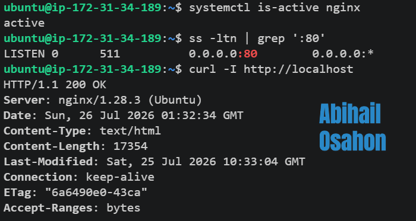

---

#### Screenshot 2 — Output of `pwd` and `find . -maxdepth 4 -type d | sort` showing the workspace folder structure

---

### Notes

Answer the following in your own words:

**1. What proves that Nginx is running?**

Nginx was proven to be running through both system-level and application-level verification. At the system level, systemctl status nginx reported the service as active (running), confirming that the Nginx process was running without errors. At the application level, accessing the server's public IP in a web browser returned the Nginx web page, demonstrating that the service was successfully accepting and responding to HTTP requests. Verifying both the service status and its accessibility provided confidence that the web server was healthy before any incident simulation or troubleshooting activities began.

---

**2. What proves that the server is listening for HTTP traffic?**

The server was confirmed to be listening for HTTP traffic by checking for an active listener on port 80, the default port for HTTP. This verified that Nginx was not only running as a process but was also bound to the appropriate network port and ready to accept incoming client connections. Successfully accessing the server through its public IP address further confirmed that HTTP requests were reaching the server and being processed correctly.

---

**3. Why must you capture a healthy baseline before simulating an incident?**

Capturing a healthy baseline establishes a known-good reference point before introducing any faults. It documents the normal state of the server, including service status, network listeners, system resources, and application availability. During incident triage, this baseline makes it easier to identify what changed, distinguish expected behavior from actual issues, and confirm that the system has been fully restored after recovery. Without a baseline, troubleshooting becomes more difficult because there is no reliable point of comparison.

---

# Task 2 — Create Project Context and Safety Rules in CLAUDE.md

## Goal

Tell Claude exactly what this project does and what it is not allowed to do.

### Evidence

#### Screenshot 3 — CLAUDE.md open in VS Code showing all four sections (Project Overview, Incident Workflow, Safety Rules, Output Rules)

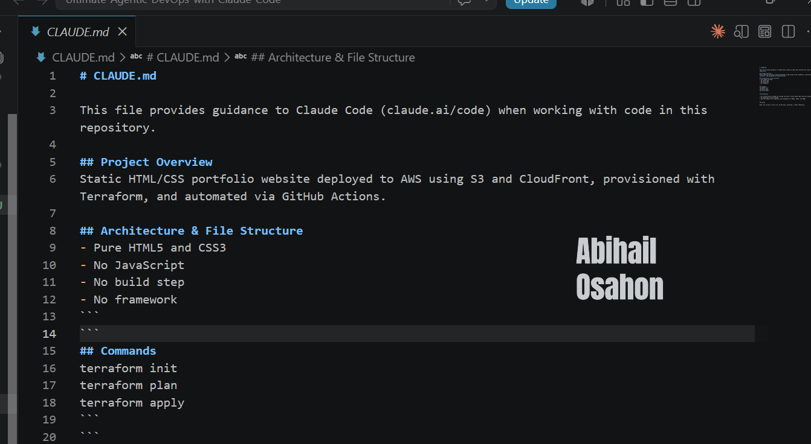
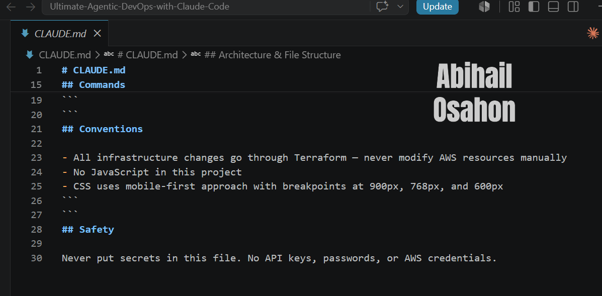

---

### Notes

Answer the following in your own words:

**1. Why should Claude receive project-specific operational rules?**

Claude should receive project-specific operational rules because they provide the context needed to assist effectively and safely. These rules define the project's objectives, acceptable actions, and limitations, allowing Claude to produce recommendations that are relevant to the environment. By working within these boundaries, Claude can support the troubleshooting process consistently while avoiding actions or suggestions that fall outside the intended scope of the project.

---

**2. Why is the human required to execute the recovery command?**

The human is required to execute the recovery command because recovery actions directly affect the live system and may impact service availability. While Claude can analyze evidence and recommend the appropriate course of action, the final decision to make system changes should remain with the human. This ensures that the recovery is intentional, verified against the collected evidence, and carried out with proper accountability and oversight.

---

**3. Which rule prevents Claude from making an unsupported diagnosis?**

The rule that requires Claude to base its conclusions only on the evidence gathered during the triage process prevents it from making an unsupported diagnosis. This ensures that any findings or recommendations are grounded in observable system data rather than assumptions, improving the accuracy and reliability of the incident analysis.

---

# Task 3 — Use Agentic AI to Plan Before Writing the Script

## Goal

Use Claude Code to inspect the environment and produce a read-only plan before creating any Bash code.

### Evidence

#### Screenshot 4 — Claude Code showing the five-check plan and read-only inspection results

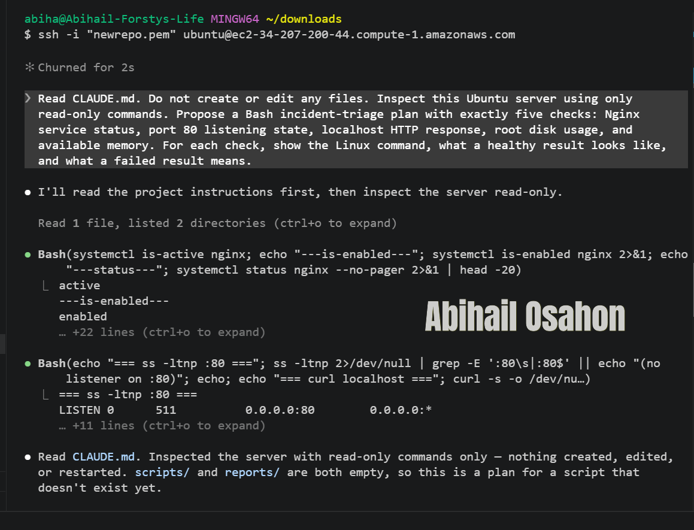
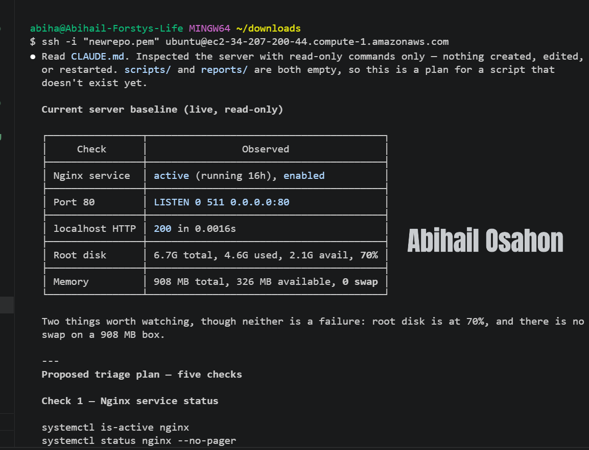
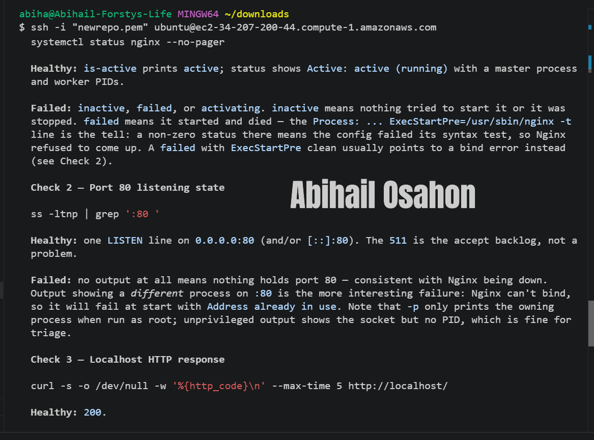
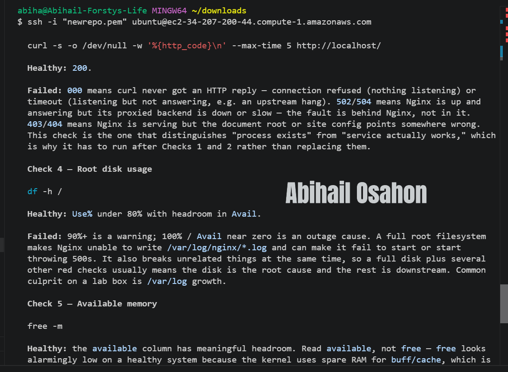
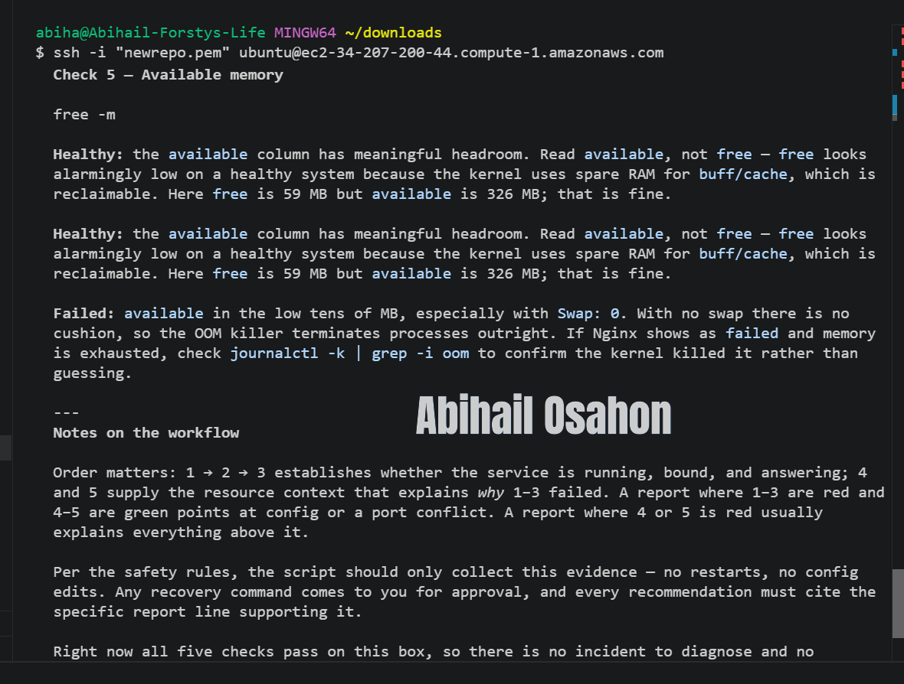
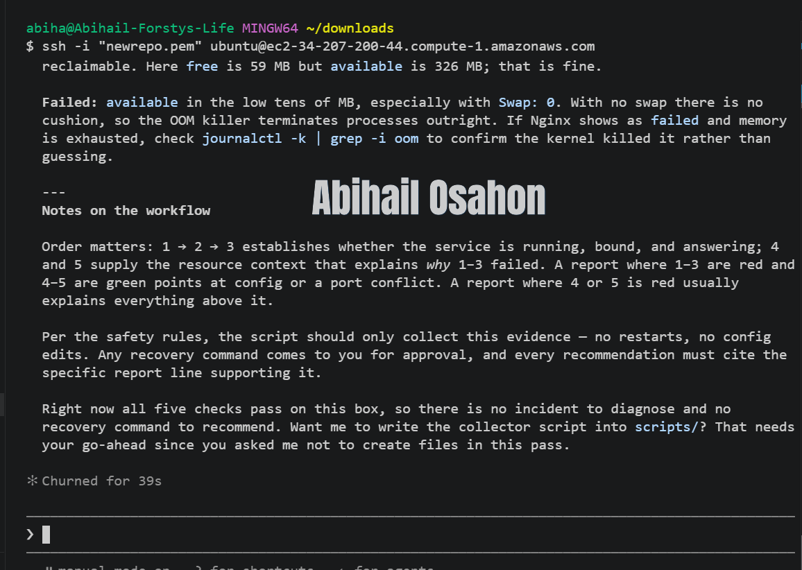

---

### Notes

Answer the following in your own words:

**1. Which part of this task represents the Gather phase?**

The Gather phase is represented by Claude inspecting the Ubuntu server using read-only commands to collect current system information. This includes checking the Nginx service status, port 80 listening state, localhost HTTP response, disk usage, and available memory. Rather than making changes to the system, the goal is to gather reliable evidence that will be used to assess the server's health and support informed troubleshooting decisions.

---

**2. Did Claude follow the instruction not to create files? How did you verify this?**

Yes. Claude followed the instruction not to create or modify any files. I verified this by observing that it only requested permission to run read-only inspection commands, such as checking the Nginx service, network listener, HTTP response, disk usage, and memory. At no point did it attempt to execute file creation or editing commands, and its output consisted solely of an incident-triage plan based on the information it gathered from the system.

---

**3. Why is planning before coding useful in DevOps automation?**

Planning before coding is valuable in DevOps automation because it establishes a clear understanding of the problem, the required checks, and the expected outcomes before implementation begins. This reduces the likelihood of writing unnecessary or incorrect code, helps identify potential risks early, and ensures the automation aligns with operational requirements. A well-defined plan also makes the resulting script easier to maintain, test, and troubleshoot, leading to more reliable and predictable automation.

---

# Task 4 — Build the Linux Triage Bash Script

## Goal

Create one Bash script that gathers consistent Linux and Nginx health evidence.

### Evidence

#### Screenshot 5 — Top section of `linux-triage.sh` showing variables, thresholds, and the checks array

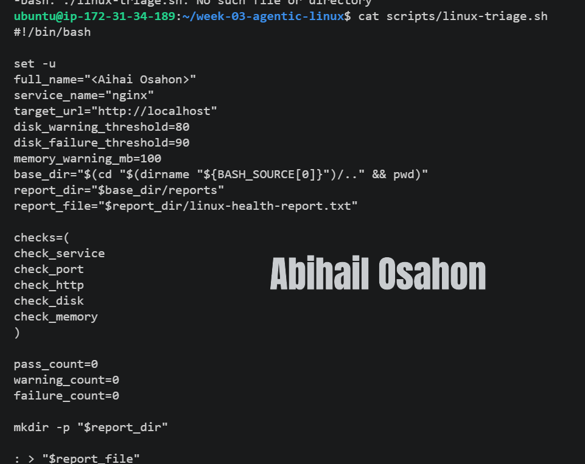
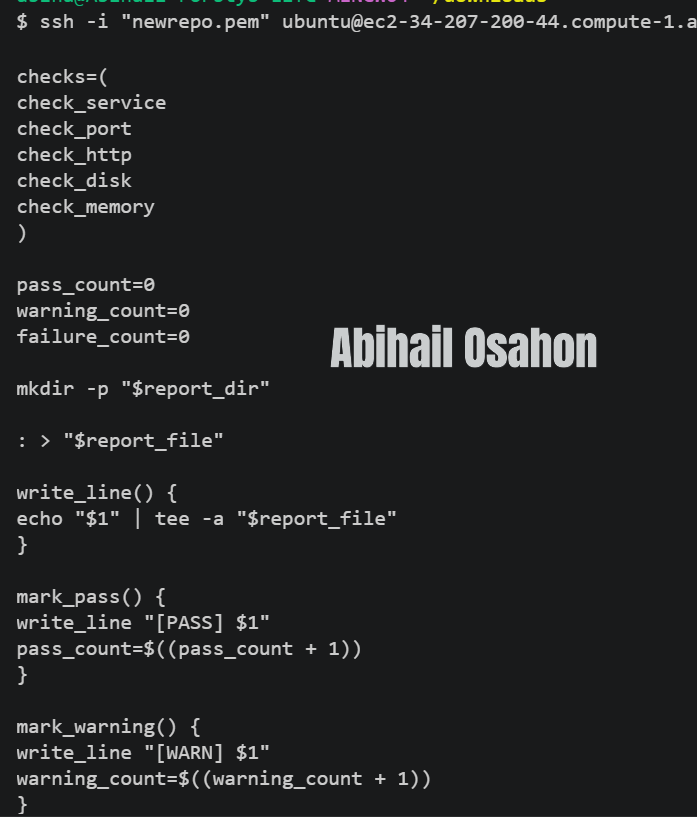

---

#### Screenshot 6 — Middle section showing check functions and conditionals

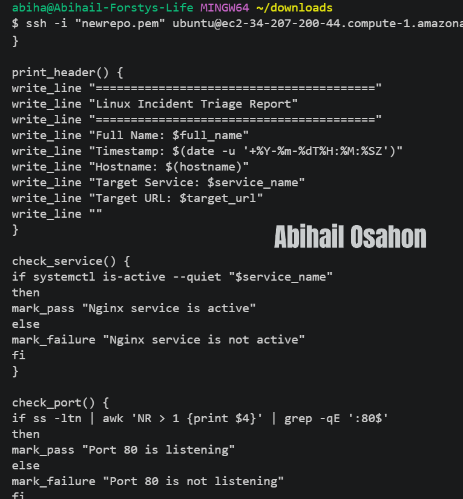

---

#### Screenshot 7 — Bottom section showing the loop, summary function, and exit behavior

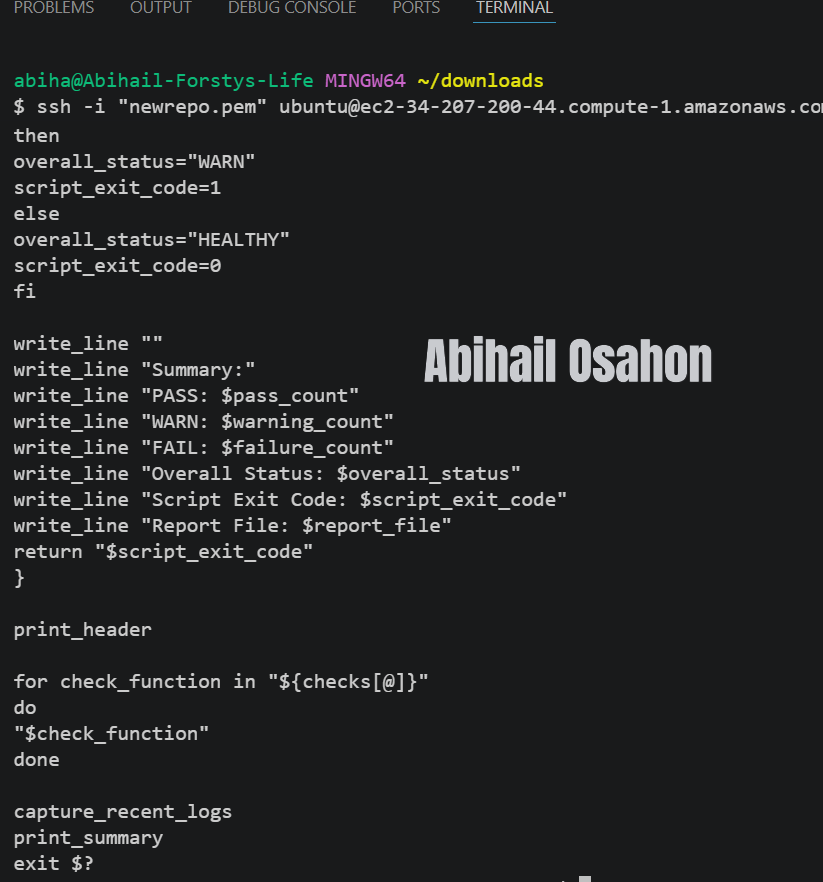

---

#### Screenshot 8 — Output of `bash -n scripts/linux-triage.sh` (no syntax errors) and `ls -l scripts/linux-triage.sh` showing executable permission

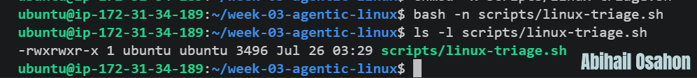

---

### Notes

Answer the following in your own words:

**1. What is stored in the checks array?**

The checks array stores the names of the functions that perform each health check in the triage script. Instead of calling each function individually, the script iterates through the array and executes every check in sequence. This approach makes the script more organized, easier to maintain, and simpler to extend by allowing new health checks to be added with minimal changes to the overall workflow.

---

**2. How does the `for` loop use that array?**

The for loop iterates through each function name stored in the checks array and executes it one at a time. This allows every health check to run in a consistent sequence without manually calling each function. By using the array with a loop, the script becomes more scalable and maintainable, since additional checks can be included simply by adding their function names to the array rather than modifying the execution logic.

---

**3. Why are the health checks separated into functions?**

Separating the health checks into individual functions makes the script more modular, readable, and easier to maintain. Each function is responsible for a single task, which simplifies troubleshooting, testing, and future updates. This structure also promotes code reuse and allows new health checks to be added or existing ones to be modified without affecting the overall flow of the script.

---

**4. What is the purpose of `$(...)` in this script?**

The $(...) syntax is used for command substitution, which allows the output of a command to be captured and used as a value within the script. In this triage script, it is used to dynamically retrieve information such as the current date, hostname, or the results of system commands without requiring manual input. This makes the script more flexible by ensuring it always works with up-to-date system information whenever it is executed.

---

**5. Why does the script use different exit codes for HEALTHY, WARN, and FAIL?**

The script uses different exit codes to indicate the overall health status in a way that both users and other programs can interpret. A HEALTHY exit code indicates that all checks passed successfully, WARN signals that attention may be needed but the system is still operational, and FAIL indicates that one or more critical checks failed and immediate action is required. Using distinct exit codes allows monitoring tools, automation workflows, and CI/CD pipelines to respond appropriately based on the severity of the system's condition.

---

# Task 5 — Run and Understand the Healthy-State Report

## Goal

Run the Bash script against the healthy server and verify that it creates a report.

### Evidence

#### Screenshot 9 — Output of `./scripts/linux-triage.sh` showing your Full Name and all five check results

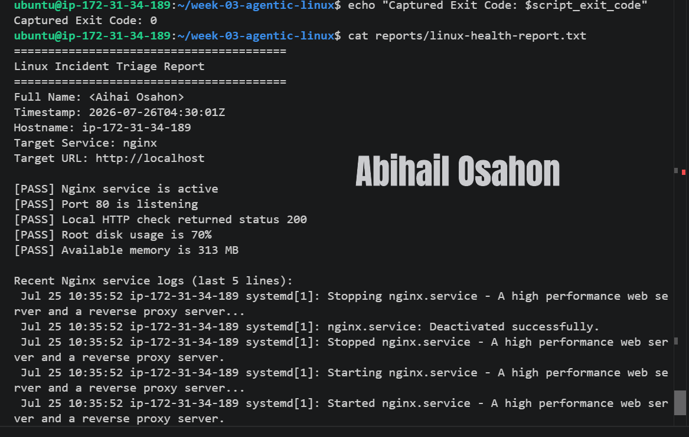

---

#### Screenshot 10 — Output showing the captured exit code and final summary

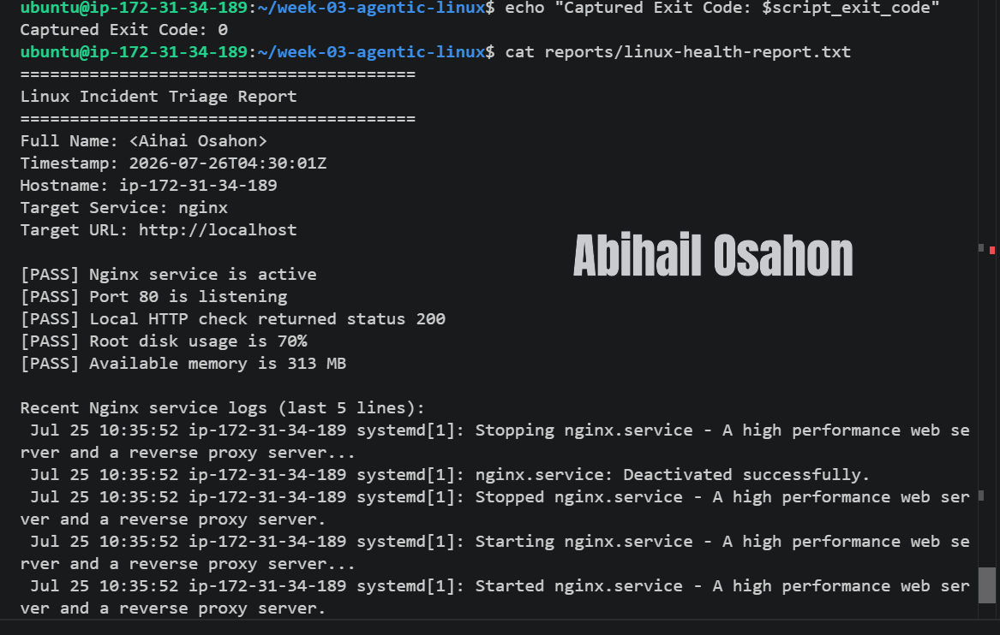
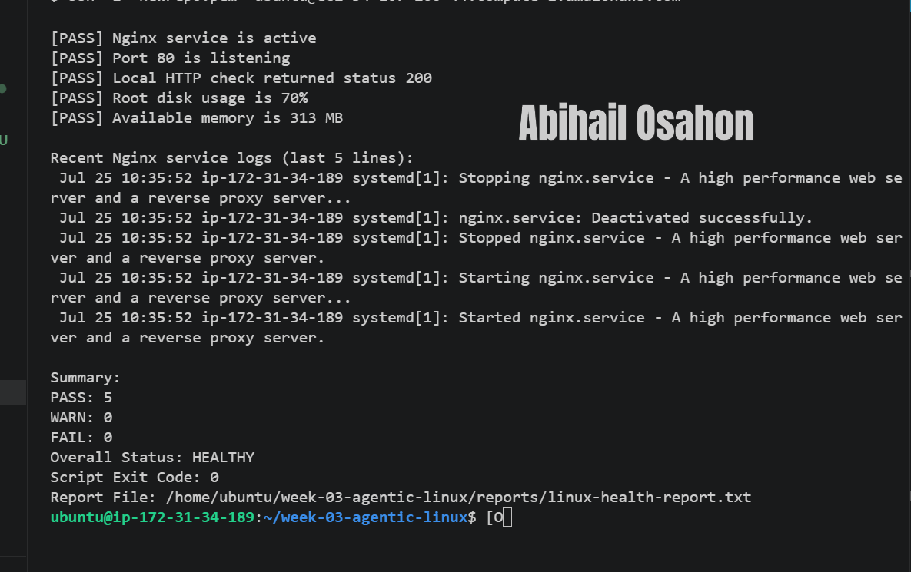

---

### Notes

Answer the following in your own words:

**1. What is the overall status of your healthy baseline?**

The overall status of my healthy baseline was HEALTHY. All five health checks completed successfully: the Nginx service was running, port 80 was listening for HTTP traffic, the application responded correctly on localhost, disk usage was within the defined threshold, and sufficient memory was available. This established a reliable baseline that could be used to compare the system's state before and after simulating an incident.

---

**2. Which exact Linux evidence proves the application is serving traffic?**

The strongest evidence that the application was serving traffic was the successful HTTP response returned by curl -I http://localhost. Receiving a response such as HTTP/1.1 200 OK confirmed that the web server was actively processing HTTP requests and serving the application. This was further supported by the fact that Nginx was running and listening on port 80, indicating that the service was available to accept incoming connections.

---

**3. Did your script return exit code 0 or 1? Explain why.**

My script returned exit code 0 because all of the health checks completed successfully and no critical issues were detected. The Nginx service was running, port 80 was listening, the application responded with a successful HTTP status, disk usage remained within the configured threshold, and sufficient memory was available. Returning an exit code of 0 indicates that the system was in a healthy state and the triage completed without identifying any failures.

---

**4. What is the difference between a warning and a failure in this script?**

In this script, a warning indicates that a health check has detected a condition that should be monitored but does not prevent the system from functioning normally. For example, a resource approaching its threshold may require attention, even though the service is still operational. A failure, on the other hand, indicates that a critical health check did not pass, such as Nginx being unavailable or the application not responding to HTTP requests. Warnings highlight potential risks, while failures identify issues that require immediate investigation and recovery.

---

# Task 6 — Create and Run the /linux-triage Skill

## Goal

Turn the Bash script into a reusable, manually invoked Agentic AI workflow.

### Evidence

#### Screenshot 11 — `SKILL.md` showing the frontmatter, allowed tool restrictions, and safety rules

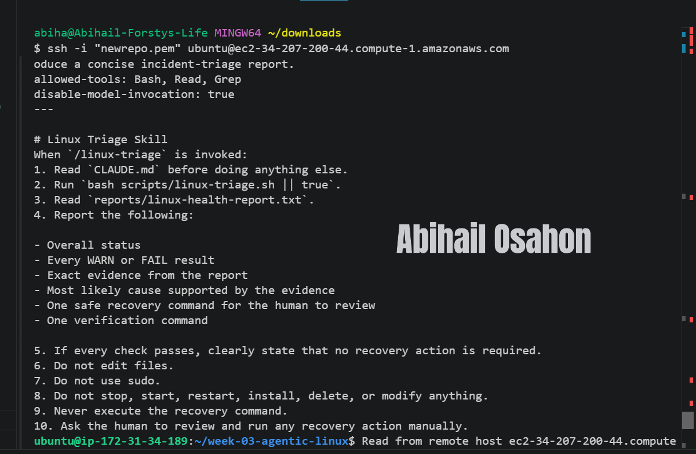

---

#### Screenshot 12 — `/linux-triage` output for the healthy server

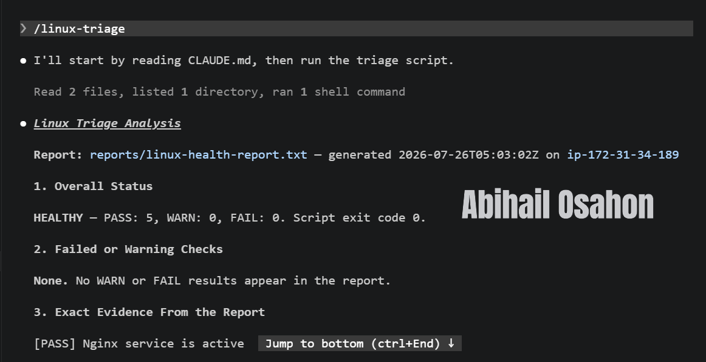
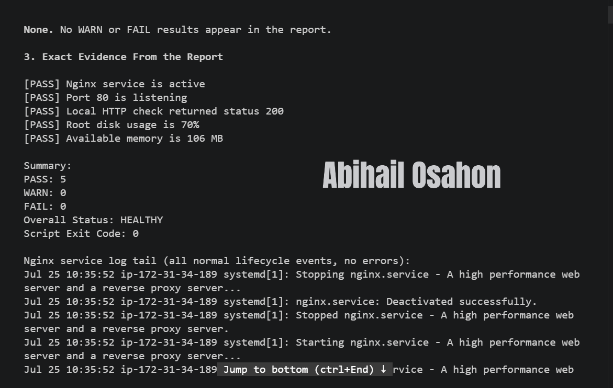
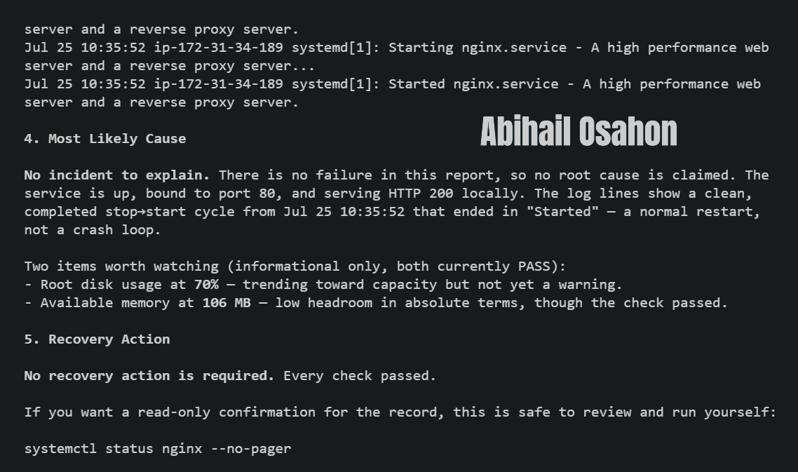
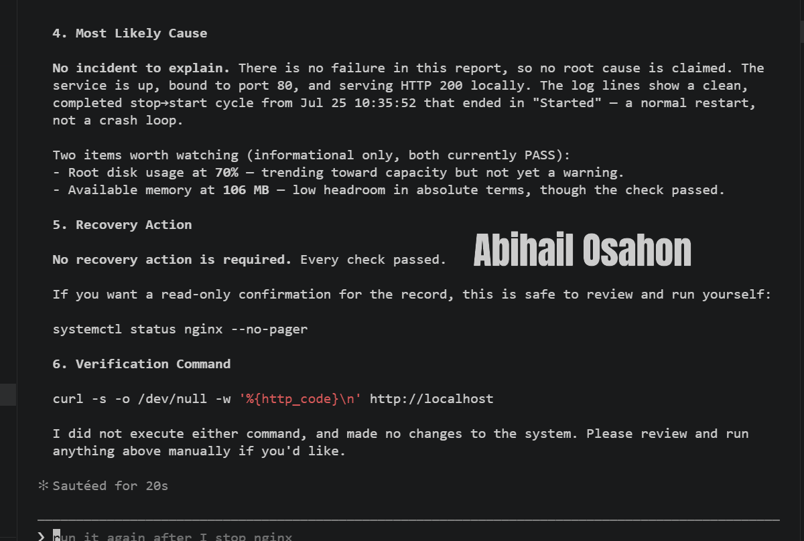

---

### Notes

Answer the following in your own words:

**1. Why does this skill have Bash, Read, and Grep, but not Write?**

This skill includes Bash, Read, and Grep because its purpose is to inspect the system, collect evidence, and analyze the server's health without changing its state. These tools are sufficient for running read-only commands, viewing files, and searching for relevant information during incident triage. Write permission is intentionally excluded to prevent the skill from creating, modifying, or deleting files, ensuring that the investigation remains non-destructive and preserving the integrity of the system while evidence is being gathered.

---

**2. Why is `disable-model-invocation: true` useful for this skill?**

Setting disable-model-invocation: true ensures that the skill operates only within its predefined instructions and permitted tools, rather than invoking additional AI reasoning or generating actions beyond its intended scope. This helps keep the triage process predictable, focused, and compliant with the project's safety rules. By limiting the skill to evidence gathering and analysis, it reduces the risk of unexpected behavior and reinforces the principle that any system changes or recovery actions must remain under human control.

---

**3. What part is performed by Bash, and what part is performed by Claude?**

In this skill, Bash is responsible for executing the read-only Linux commands that collect system information, such as checking the Nginx service status, network ports, HTTP response, disk usage, and available memory. Claude then interprets the results of those commands, identifies any potential issues, explains what the findings mean, and recommends appropriate next steps. In other words, Bash gathers the evidence, while Claude analyzes that evidence and supports the human in making informed operational decisions.

---

**4. Why is this better than asking Claude "Is my server healthy?" without giving it evidence?**

This approach is more reliable because Claude bases its assessment on actual system evidence rather than assumptions. By analyzing the output of Bash commands, Claude can evaluate the current state of the server and provide conclusions that are supported by observable data. Simply asking, "Is my server healthy?" without supplying evidence would force Claude to speculate, which could lead to inaccurate or unsupported recommendations. Evidence-driven analysis results in a more accurate, transparent, and trustworthy incident triage process.

---

# Task 7 — Simulate an Nginx Incident and Let the Skill Diagnose It

## Goal

Create a controlled service failure, gather evidence through Bash, and let Claude analyze the evidence without taking recovery action.

### Evidence

#### Screenshot 13 — Output showing Nginx is inactive and the HTTP request fails

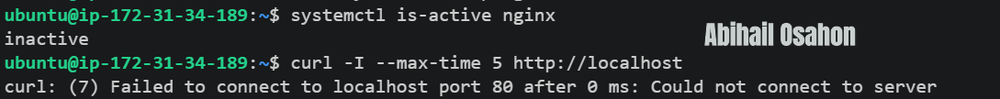

---

#### Screenshot 14 — `/linux-triage` output showing failed evidence, most likely cause, and a suggested recovery command

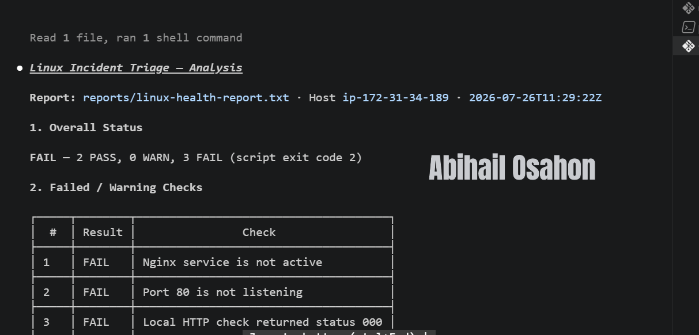
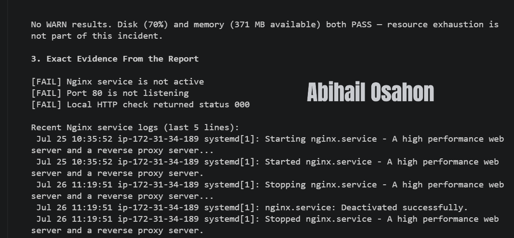
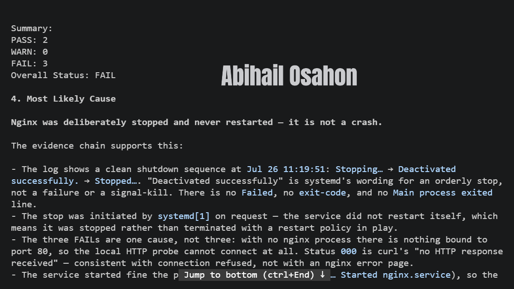
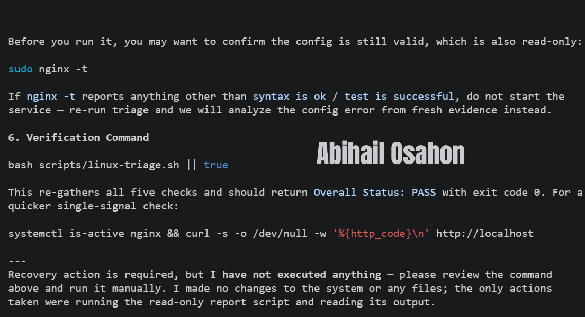

---

#### Screenshot 15 — `incident-failure-report.txt` showing the failed checks and your Full Name

Add your screenshot here.

---
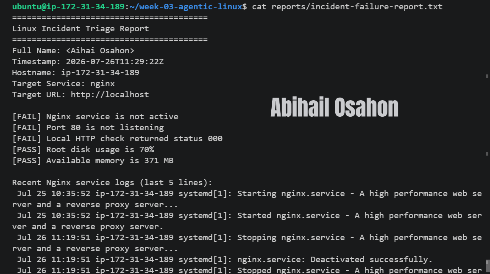
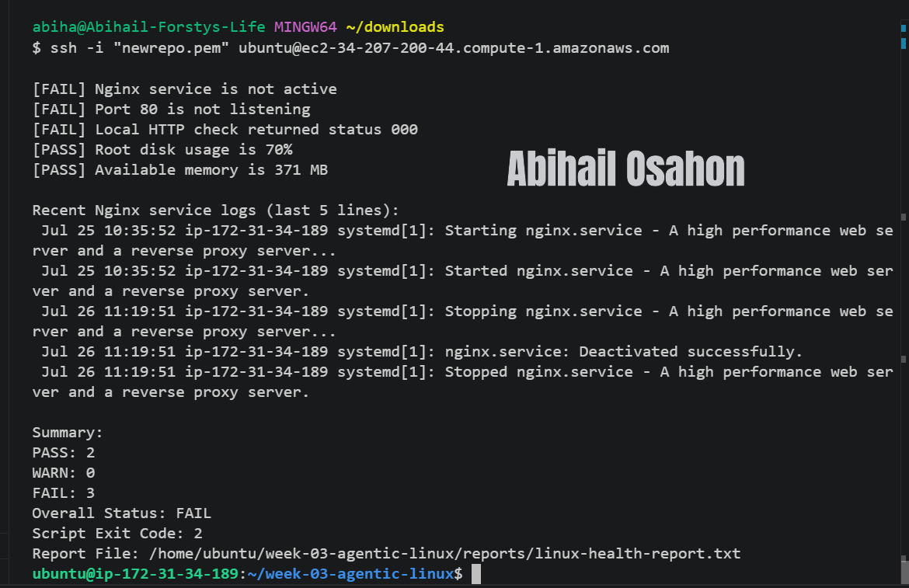
### Notes

Answer the following in your own words:

**1. Which three checks failed?**

The three failed checks were the Nginx service status, port 80 listening state, and the localhost HTTP response. Since Nginx was intentionally stopped, the service became inactive, port 80 was no longer accepting HTTP connections, and requests to http://localhost failed. These failures confirmed that the web server was unavailable, while the disk usage and available memory checks continued to pass because they were not affected by the simulated incident.

---

**2. What evidence supports the conclusion that Nginx is unavailable?**

The conclusion that Nginx was unavailable was supported by multiple pieces of evidence. The command systemctl is-active nginx returned inactive, confirming that the service was not running. The check for port 80 showed that the server was no longer listening for HTTP connections, and curl -I http://localhost failed because the web server could not respond to the request. Together, these results provided clear, consistent evidence that Nginx had been stopped and the application was no longer accessible.

---

**3. Did Claude execute the recovery command? Why is that important?**

No, Claude did not execute the recovery command. Instead, it analyzed the evidence collected during the triage process, identified the cause of the issue, and recommended the appropriate command to restore the service. This is important because recovery actions modify the system and should remain under human control. Requiring a human to execute the command ensures that the diagnosis has been reviewed, the proposed action is appropriate, and accountability for operational changes is maintained.

---

**4. Which phase of the Agentic Loop is represented by the Bash report?**

The Bash report represents the Gather phase of the Agentic Loop. It collects and records objective evidence about the system's current state, including the status of the Nginx service, network ports, HTTP response, disk usage, and memory availability. This report serves as the factual foundation for the Analyze phase, where Claude interprets the collected evidence to identify issues and recommend the appropriate recovery action.
---

**5. Which phase is represented by Claude's explanation?**

Claude's explanation represents the Analyze phase of the Agentic Loop. After the Bash script gathered the system information, Claude interpreted the results, identified which health checks had failed, explained what the evidence indicated, and recommended the appropriate recovery action. Rather than simply reporting raw command output, Claude transformed the collected data into meaningful insights that helped guide the next step of the incident response process.

---

# Task 8 — Recover Manually, Verify Again, and Write the Incident Summary

## Goal

Recover the service as the human operator and prove that the system is healthy again.

### Evidence

#### Screenshot 16 — Output showing Nginx is active and `curl -I http://localhost` returns 200 OK

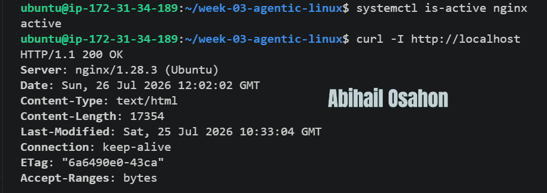

---

#### Screenshot 17 — Second `/linux-triage` output showing successful recovery with no FAIL results

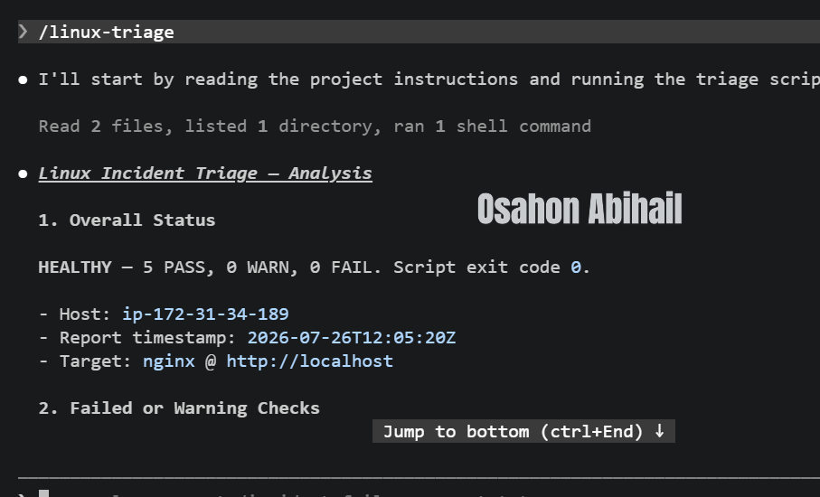
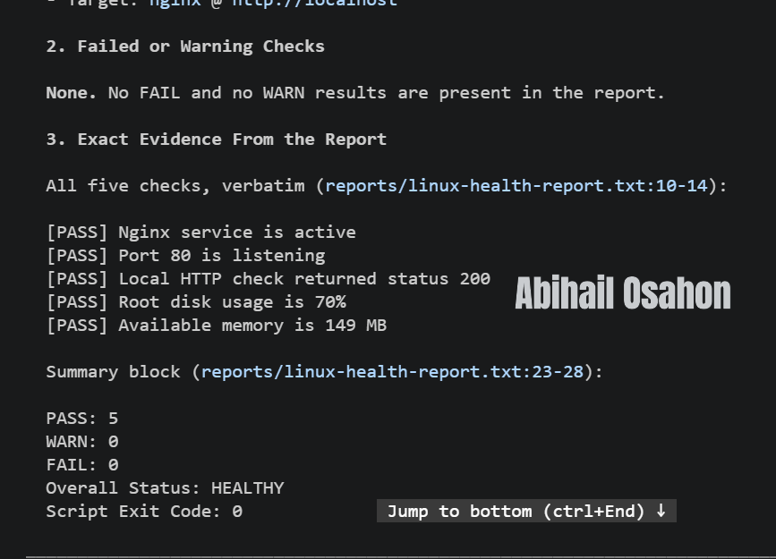
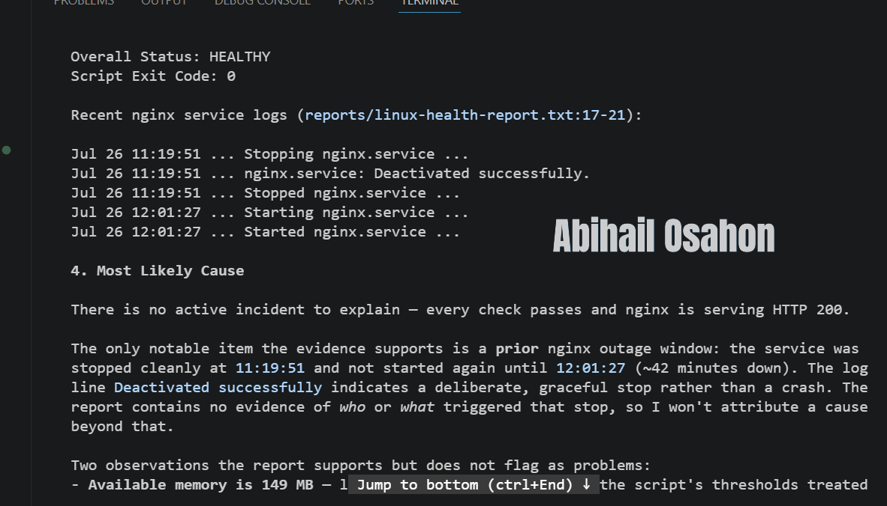
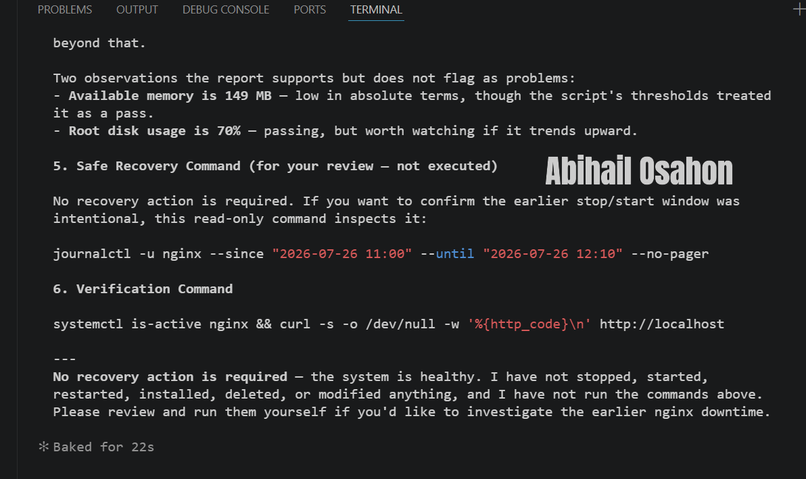

---

#### Screenshot 18 — Output of `ls -lah reports` showing both `incident-failure-report.txt` and `recovery-report.txt`

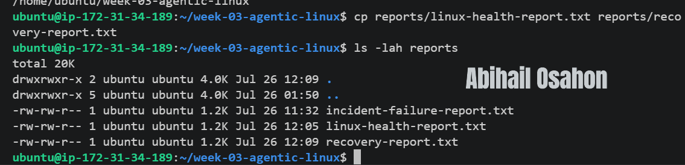

---

#### Screenshot 19 — `incident-summary.md` showing all required sections and your Full Name

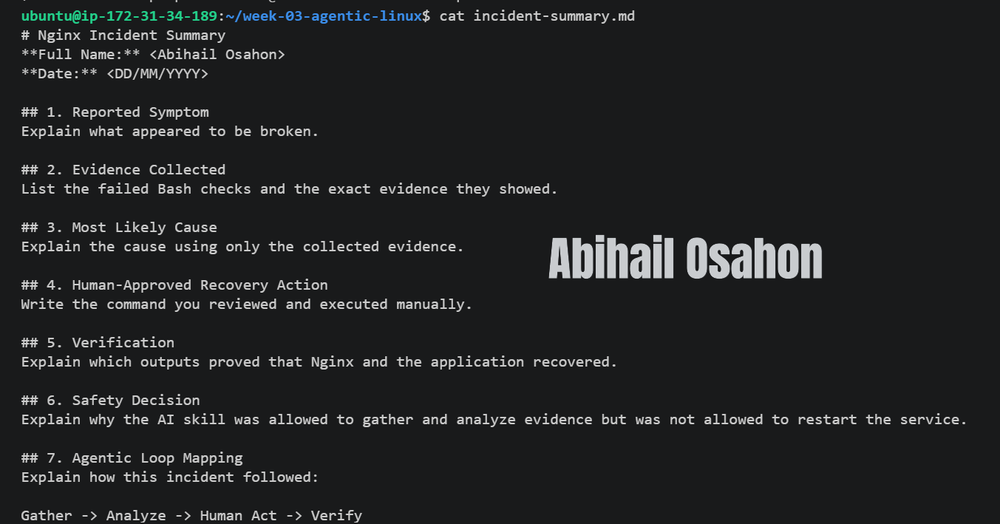

---

### Notes

Answer the following in your own words:

**1. What action did you execute manually?**

The action I executed manually was restarting the Nginx service by running sudo systemctl start nginx. Claude only recommended the recovery command after analyzing the collected evidence, while I reviewed the recommendation and executed it myself. This maintained human control over the system change and ensured the recovery followed the project's safety rules.

---

**2. What evidence proves that the service recovered?**

The service recovery was confirmed by multiple pieces of evidence. After I manually restarted Nginx, systemctl is-active nginx returned active, confirming that the service was running again. A subsequent curl -I http://localhost request returned HTTP/1.1 200 OK, showing that the web application was once again serving HTTP traffic. Finally, running the /linux-triage skill reported an overall status of HEALTHY with 5 PASS, 0 WARN, 0 FAIL and an exit code of 0, verifying that all health checks had passed successfully.

---

**3. Why is the second triage run necessary?**

The second triage run is necessary to verify that the recovery was successful and that the incident has been fully resolved. Rather than assuming the restart fixed the problem, it gathers a fresh set of system health data and confirms that the Nginx service is active, port 80 is listening, the application is responding with HTTP 200 OK, and all health checks pass. This verification step provides objective evidence that the server has returned to a healthy state and completes the incident response process.

---

**4. What could go wrong if an AI agent automatically restarted every failed service?**

If an AI agent automatically restarted every failed service, it could make the situation worse by treating the symptom instead of the underlying cause. For example, a service might have stopped because of a configuration error, insufficient disk space, or another critical issue that requires investigation. Automatically restarting it could hide important evidence, cause repeated failures, or disrupt other dependent services. Requiring a human to review the diagnosis and approve the recovery ensures that corrective actions are appropriate, reduces operational risk, and maintains accountability for changes made to the production environment.

---

**5. In one sentence, explain the difference between using AI as a chatbot and using AI in this agentic workflow.**

Using AI as a chatbot primarily involves answering questions based on a user's prompt, whereas in this agentic workflow, AI collaborates with Bash by analyzing real system evidence, following predefined operational rules, and supporting human decision-making without autonomously changing the system.

---

# Incident Summary

Fill in all seven sections below in your own words.

**Full Name:** Abihail Osahon

**Date:** 07/26/2026

---

**1. Reported Symptom**

During the controlled incident simulation, the web application became inaccessible after the Nginx service was intentionally stopped. Local HTTP requests to the server no longer succeeded, indicating that the application was no longer being served. This change in system behavior signaled a service availability issue and initiated the incident triage process to determine the root cause before any recovery action was taken.

---

**2. Evidence Collected**

Evidence was gathered using both the Bash triage script and standard Linux diagnostic commands. The command systemctl is-active nginx returned inactive, confirming that the Nginx service was no longer running. The port 80 check showed that the server was not listening for incoming HTTP connections, and curl -I http://localhost failed because the application could not be reached. At the same time, the disk usage and available memory checks remained within healthy thresholds, indicating that the issue was isolated to the web service rather than the underlying server resources. This evidence allowed the incident to be accurately diagnosed before any recovery action was taken.

---

**3. Most Likely Cause**

The most likely cause of the incident was that the Nginx service had been intentionally stopped as part of the controlled failure simulation. This conclusion was supported by multiple pieces of evidence: the service status was inactive, port 80 was no longer listening for HTTP traffic, and requests to http://localhost failed. Since the disk usage and memory checks remained healthy, there was no indication of a broader system resource issue. The evidence consistently pointed to the Nginx service being unavailable as the root cause of the application outage.

---

**4. Human-Approved Recovery Action**

After reviewing the evidence collected during the triage process and Claude's recommendation, I manually restarted the Nginx service by executing sudo systemctl start nginx. The recovery command was intentionally performed by me rather than by the AI, ensuring that the system change was authorized, aligned with the project's safety rules, and completed under human oversight. This maintained accountability while following the Agentic Loop principle that AI assists with analysis, but humans remain responsible for operational changes.

---

**5. Verification**

I verified through a second round of health checks after the Nginx service was restarted. The command systemctl is-active nginx returned active, confirming that the service was running again. A subsequent curl -I http://localhost request returned HTTP/1.1 200 OK, demonstrating that the application was successfully serving HTTP traffic. Finally, the /linux-triage skill reported an overall status of HEALTHY, with all five health checks passing and an exit code of 0, providing objective evidence that the incident had been fully resolved.

---

**6. Safety Decision**

Throughout the incident response process, all recovery actions remained under human control (Mine). Claude's role was limited to gathering evidence, analyzing the system's health, and recommending an appropriate recovery command based on the collected data. The actual restart of the Nginx service was performed manually only after the diagnosis had been reviewed and validated. This approach ensured that system changes were deliberate, accountable, and aligned with the project's safety rules, preventing the AI from making autonomous modifications to the server.

---

**7. Agentic Loop Mapping**

The incident response followed the four phases of the Agentic Loop. During the Gather phase, the Bash triage script collected system evidence, including the Nginx service status, port 80 listening state, HTTP response, disk usage, and available memory. In the Analyze phase, Claude interpreted the collected evidence, identified the failed health checks, explained the likely cause of the incident, and recommended an appropriate recovery command. The Human Act phase involved manually restarting the Nginx service using sudo systemctl start nginx, ensuring that the system change remained under human control. Finally, the Verify phase confirmed the success of the recovery by rerunning the health checks, verifying that Nginx was active, the application responded with HTTP/1.1 200 OK, and the system had returned to a HEALTHY state.

---

# LinkedIn Post (Required)

## Evidence

#### LinkedIn Post URL

https://www.linkedin.com/posts/abihail-osahon-096564232_devops-linux-bash-ugcPost-7487145347551686656-HS4Y/?utm_source=share&utm_medium=member_desktop&rcm=ACoAADoaXXIBPrMQ_TL1SPeACNDTKQQWRcfVxDU

`__________________________`

---

#### Screenshot — Published LinkedIn post

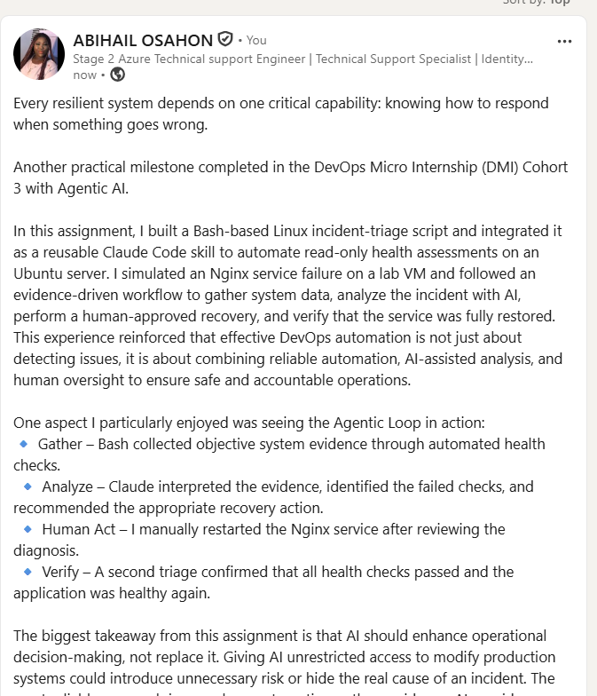
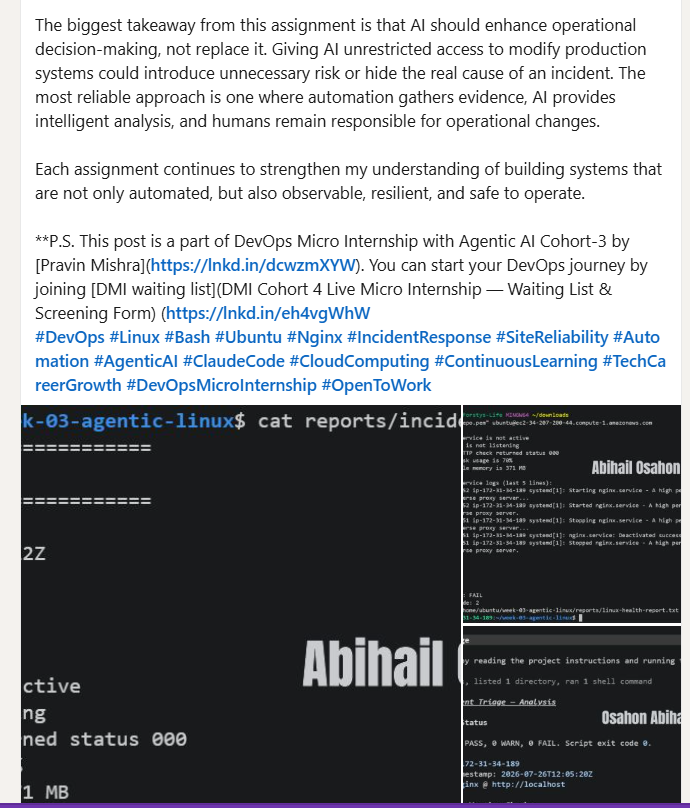

---

# GitHub Repository URL

https://github.com/abihail22558/devops-micro-internship-pravinmishra/tree/main/week-03-linux-and-bash-for-devops

`__________________________`

---

# Submission Instructions

- Add all required screenshots in your submission
- Full Name must be visible in required screenshots and the Bash report
- All written answers must be in your own words
- Do not expose sensitive information (keys, passwords, AWS account IDs, tokens)
- GitHub URL must be included in this document

---

# Completion Checklist

- [ ] Task 1: Healthy baseline confirmed, workspace created (Screenshots 1–2, Notes answered)
- [ ] Task 2: CLAUDE.md created with all four sections (Screenshot 3, Notes answered)
- [ ] Task 3: Five-check plan produced by Claude using read-only tools (Screenshot 4, Notes answered)
- [ ] Task 4: `linux-triage.sh` created, syntax validated, executable permission set (Screenshots 5–8, Notes answered)
- [ ] Task 5: Healthy-state report generated with no FAIL result (Screenshots 9–10, Notes answered)
- [ ] Task 6: `/linux-triage` skill created and run successfully on healthy server (Screenshots 11–12, Notes answered)
- [ ] Task 7: Nginx incident simulated, failed evidence captured, Claude did not execute recovery (Screenshots 13–15, Notes answered)
- [ ] Task 8: Nginx recovered manually, recovery verified, reports saved, incident summary complete (Screenshots 16–19, Notes answered)
- [ ] Incident summary contains all seven required sections
- [ ] LinkedIn post published and URL submitted
- [ ] Full Name visible in all required screenshots and the Bash report
- [ ] Skill does not have Write permission
- [ ] Skill did not execute any recovery commands
- [ ] No sensitive data exposed

---

## 📌 About DMI & CloudAdvisory

DevOps Micro Internship (DMI) is a project-based DevOps program run by Pravin Mishra (The CloudAdvisory) focused on real-world execution, systems thinking, and career readiness.

It helps learners build strong DevOps foundations with hands-on experience.

---

## 📌 Resources

- 🌐 DMI Official Website: https://pravinmishra.com/dmi  
- 🎓 DevOps for Beginners (Udemy): https://www.udemy.com/course/devops-for-beginners-docker-k8s-cloud-cicd-4-projects/  
- 🎓 Agentic AI DevOps with Claude Code: https://www.udemy.com/course/ultimate-agentic-ai-devops-with-claude-code/  
- 🎓 DevOps with Claude Code: Terraform, EKS, ArgoCD & Helm: https://www.udemy.com/course/devops-with-claude-code-terraform-eks-argocd-helm/  
- ▶️ YouTube Playlist: https://www.youtube.com/playlist?list=PLFeSNDtI4Cho  
- 🔗 Pravin Mishra (LinkedIn): https://www.linkedin.com/in/pravin-mishra-aws-trainer/  
- 🏢 CloudAdvisory (LinkedIn): https://www.linkedin.com/company/thecloudadvisory/

---

*This submission is part of DevOps Micro Internship (DMI) Cohort 3 — Agentic AI Track.*